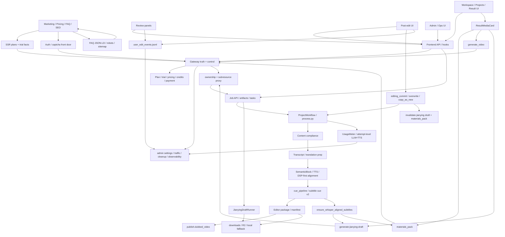

# GitNexus 项目图谱

新会话建议先读本文件，再按任务进入对应子图。
生成时间：2026-05-06
生成方式：基于当前仓库 `.gitnexus/` 最新索引与源码核对整理

## 1. 图谱概览

| 指标 | 数值 |
| --- | ---: |
| 文件数 | 1057 |
| 节点数 | 18,993 |
| 关系数 | 46,249 |
| 聚类数 | 822 |
| 流程数 | 300 |
| 索引提交 | `482b315` |
| 索引状态 | `up-to-date` |

这轮最需要反映的结构变化有六条：

- `deliverable-time whisper alignment` 已经成为正式交付侧路：Jianying 草稿和 `materials_pack` 在消费字幕前都会走 `ensure_whisper_aligned_subtitles`
- `cue_pipeline` 现在有完整的 `env capability + admin policy + trigger context` 语义，`publish / deliverable / manual` 三种触发策略已经落成
- `tts_input_cn_text` 已从“附带字段”升级为 drift 见证；`_block_is_in_sync()` 和 post-edit commit stamp 都依赖它
- `JianyingDraftRunner` 的 fingerprint 现在显式纳入 whisper policy snapshot；`skip_cache=true` 还会绕过外层 `succeeded` cache-hit
- Gateway admin 面已经长出 `whisper` 设置组与 `traffic analytics`，控制面不再只有 pricing / credits / cleanup
- overwrite commit 会同时失效两类交付副产物：Job API 层的 Jianying draft，以及 Gateway DB 里的 `materials_pack`

## 2. 关键基座

| 基座 | 当前主轴 | 代表文件 |
| --- | --- | --- |
| Workflow | `SemanticBlock -> TTS -> DSP-first alignment -> cue_pipeline -> editor outputs` | `src/pipeline/process.py`、`src/modules/output/output_dispatcher.py` |
| Subtitles | `SRT window` timing、drift gate、deliverable-time whisper sidecar | `src/modules/subtitles/cue_pipeline.py`、`src/services/subtitles/ensure_whisper_alignment.py` |
| Jianying | on-demand draft runner、policy-aware fingerprint、substeps、orphan rescue | `src/services/jobs/jianying_draft_runner.py`、`src/modules/output/jianying/jianying_draft_writer.py` |
| Editing | `overwrite / copy_as_new`、`tts_input_cn_text` stamp、deliverable invalidation | `src/services/jobs/editing_commit.py`、`src/services/jobs/copy_service.py` |
| Delivery | `materials_pack`、`generate_video`、download keys、R2 / local fallback | `gateway/background_task_executors.py`、`src/services/jobs/api.py`、`src/services/web_ui/output_entries.py` |
| Gateway | ownership、auth/captcha、plan truth、admin settings、traffic analytics | `gateway/job_intercept.py`、`gateway/main.py`、`gateway/admin_settings.py`、`gateway/traffic_analytics.py` |
| Metering & Audit | `UsageMeter`、`JobEvent`、`user_edit_events.jsonl` 三条 sidecar | `src/services/usage_meter.py`、`src/services/jobs/user_edit_audit.py` |

## 3. 子图入口

- 图谱索引：`docs/graphs/README.md`
- 工作流内核图：`docs/graphs/GITNEXUS_WORKFLOW_CORE_GRAPH.md`
- 剪映草稿交付图：`docs/graphs/GITNEXUS_JIANYING_DRAFT_DELIVERY_GRAPH.md`
- 审核流图：`docs/graphs/GITNEXUS_REVIEW_GRAPH.md`
- 编辑 / 后处理图：`docs/graphs/GITNEXUS_EDITING_POST_EDIT_GRAPH.md`
- 存储与交付图：`docs/graphs/GITNEXUS_STORAGE_DELIVERY_R2_GRAPH.md`
- 商业化图：`docs/graphs/GITNEXUS_COMMERCIALIZATION_GRAPH.md`
- Admin / Ops / Calibration 图：`docs/graphs/GITNEXUS_ADMIN_OPS_CALIBRATION_GRAPH.md`
- Benchmark / Quality / Cost 图：`docs/graphs/GITNEXUS_BENCHMARK_QUALITY_COST_GRAPH.md`

## 4. 仓库结构图

## 5. 核心证据链

### 5.1 deliverable-time whisper alignment 已经是正式侧路

- `src/services/subtitles/ensure_whisper_alignment.py` 模块头直接写明：它被 Jianying draft generation 和 `materials_pack` packaging 调用
- `src/services/jobs/jianying_draft_runner.py` 新增 `aligning_subtitles` 子步骤，并在后台线程里调用同一个 helper
- `gateway/background_task_executors.py` 在 `materials_pack` 选中 `subtitles` 时，会先走内部接口 `ensure-whisper-aligned-subtitles`

结论：whisper 对齐现在不是 publish 阶段的默认主路，而是“交付前确保字幕精对齐”的正式 sidecar。

### 5.2 `tts_input_cn_text` 已经变成 drift 见证

- `src/modules/subtitles/cue_pipeline.py::_block_is_in_sync()` 对比的是 `tts_input_cn_text` 与当前 `merged_cn_text`
- `src/services/jobs/editing_commit.py` 在 draft wav promoted 时，会把对应 segment 的 `tts_input_cn_text` 重打成当前 `cn_text`

结论：系统现在能显式区分“文本改了但音频没重做”和“文本与音频同步”这两种状态。

### 5.3 Jianying runner 的 cache 语义已经受 whisper policy 约束

- `src/services/jobs/jianying_draft_runner.py::_whisper_policy_snapshot()` 把 `env_capability_enabled / admin_enabled / trigger / skip_cache / model` 纳入 fingerprint 输入
- 同文件 `_whisper_force_fresh_active()` 还会在 `skip_cache=true` 时绕过外层 `succeeded` cache-hit

结论：admin 改 whisper 策略后，旧 draft zip 不会再被“错误复用”。

### 5.4 Gateway 控制面新增了两条独立轴线

- `gateway/admin_settings.py` 现在直接承载 whisper deliverable alignment 的 admin settings
- `gateway/traffic_analytics.py` 是只读的 Caddy access log parser，输出 crawler / scanner / human traffic 分类
- `gateway/main.py` 把 `captcha_router`、`traffic_analytics_router`、cleanup loops 一起挂到了 Gateway 生命周期里

结论：Gateway 已经同时承担商业真源、auth 前门、交付控制、以及流量 / 运维诊断控制面。

### 5.5 overwrite commit 会同时失效两类交付副产物

- `src/services/jobs/editing_commit.py::_invalidate_jianying_draft_on_commit(...)` 会重置 `jianying_draft_*` 并删除 `{project_dir}/jianying/`
- `gateway/job_intercept.py` 在 `editing/commit overwrite` 成功后会调用 `invalidate_materials_pack_for_job(...)`

结论：post-edit 后交付副产物都被显式视为 stale，不再靠“用户自己记得重做”。

## 6. 按任务选图

- 要看 whisper 对齐到底在哪一层发生、主路是否改变，读 `GITNEXUS_WORKFLOW_CORE_GRAPH.md`
- 要看 `skip_cache`、fingerprint、orphan rescue、`user_draft_root`，读 `GITNEXUS_JIANYING_DRAFT_DELIVERY_GRAPH.md`
- 要看 `materials_pack` 预对齐、下载白名单、cleanup，读 `GITNEXUS_STORAGE_DELIVERY_R2_GRAPH.md`
- 要看 `tts_input_cn_text` commit stamp、overwrite / copy_as_new、副产物失效，读 `GITNEXUS_EDITING_POST_EDIT_GRAPH.md`
- 要看 auth/captcha 前门、FAQ/SEO、套餐真源，读 `GITNEXUS_COMMERCIALIZATION_GRAPH.md`
- 要看 admin whisper settings、traffic analytics、orphan diagnosis、cleanup，读 `GITNEXUS_ADMIN_OPS_CALIBRATION_GRAPH.md`
