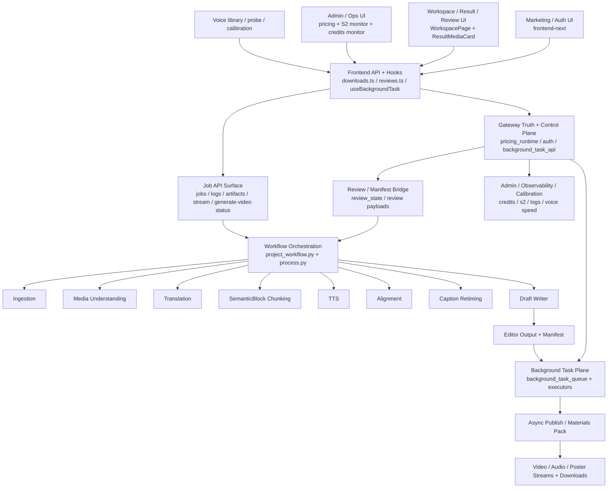

# GitNexus 项目图谱

新会话建议先读本文件，再按任务进入对应子图。

生成时间：2026-04-18
生成方式：基于当前仓库 `.gitnexus/` 最新索引与 GitNexus 本地查询结果整理

## 1. 图谱概览

当前 GitNexus 索引状态：

| 指标 | 数值 |
| --- | ---: |
| 文件数 | 774 |
| 符号节点数 | 13,516 |
| 关系边数 | 32,913 |
| 聚类数 | 524 |
| 执行流程数 | 300 |
| 索引提交 | `48be3fd` |
| 索引状态 | `up-to-date` |

和 2026-04-16 那版相比，当前架构有三处必须反映到图谱里：

- 前端已经进一步统一到 `frontend-next/`，旧 `frontend/` Vite 表面被清理出主路径
- 结果页新增了用户显式触发的后台导出平面：`materials_pack` 与 `generate_video`
- 工作流主线仍以 Jianying draft 为主交付，但“任务完成后再异步生成可播放视频”的链路已经成为稳定侧轴

## 2. 主要功能区块

下表选取当前索引中最能代表架构主干的聚类：

| 聚类 | 符号数 | 代表文件/成员 |
| --- | ---: | --- |
| Services | 443 | `src/services/transcript_reviewer.py`、`src/services/jobs/api.py`、`src/services/jobs/video_render_async.py` |
| Gateway | 255 | `gateway/main.py`、`gateway/background_task_api.py`、`gateway/background_task_queue.py`、`gateway/pricing_runtime.py` |
| Jobs | 122 | Job API、结果面、日志、流媒体与异步任务衔接 |
| Api | 106 | `frontend-next/src/lib/api/downloads.ts`、`reviews.ts`、`jobs.ts` |
| Tts | 88 | TTS provider、voice speed、voice selection |
| Workflow | 71 | `src/modules/workflow/project_workflow.py`、阶段 runner |
| Web_ui | 68 | review/manifest/web bridge |
| Draft | 57 | `draft_writer.py`、`caption_retiming.py` |
| Translation | 54 | 翻译与译后整理 |
| Billing | 47 | pricing、credits、billing surface |
| Pipeline | 45 | `src/pipeline/process.py` 阶段拼装与 payload 衔接 |
| Voice | 23 | voice clone / registry / probe / selection |
| Alignment | 22 | DSP 对齐与 rewrite fallback |
| Ingestion | 19 | subtitle/provider normalization |
| Workspace | 9 | `WorkspacePage`、结果页与 review/workspace surface |
| Admin | 11 | admin pricing surface |
| S2-monitor | 9 | S2 monitor |
| Credits-monitor | 8 | credits observability |

## 3. 子图入口

- 图谱索引：`docs/graphs/README.md`
- 工作流内核图：`docs/graphs/GITNEXUS_WORKFLOW_CORE_GRAPH.md`
- 商业化图：`docs/graphs/GITNEXUS_COMMERCIALIZATION_GRAPH.md`
- 审核流图：`docs/graphs/GITNEXUS_REVIEW_GRAPH.md`
- Admin / Ops / Calibration 图：`docs/graphs/GITNEXUS_ADMIN_OPS_CALIBRATION_GRAPH.md`

## 4. 仓库结构图

## 5. 核心证据链

### 5.1 工作流主线仍然是 Draft-first

- `src/modules/workflow/project_workflow.py` 的 `run_build()` 仍然按：
  `ingestion -> audio preparation -> media understanding -> translation -> chunking -> alignment -> draft`
- `SemanticBlock` 仍是 chunking 与 alignment 之间的核心单元
- `src/modules/draft/caption_retiming.py` 仍然是确定性数学 retiming

结论：主交付仍是 Jianying draft，不是把“视频导出”提升为主流程中心。

### 5.2 结果页已经挂上后台导出平面

- `frontend-next/src/components/workspace/ResultMediaCard.tsx` 同时使用 `useBackgroundTask()` 创建：
  `materials_pack`
  `generate_video`
- `frontend-next/src/lib/react/useBackgroundTask.ts` 明确支持：
  状态恢复
  轮询
  stalled hint
- `gateway/background_task_api.py` 暴露：
  `POST /api/jobs/{job_id}/tasks`
  `GET /api/jobs/{job_id}/tasks/{task_id}`
  `GET /api/jobs/{job_id}/tasks/latest`
  `GET /api/jobs/{job_id}/tasks/{task_id}/download`

这条链说明导出任务已经从“同步按钮动作”升级为 Gateway 控制的异步任务面。

### 5.3 后台任务的关键能力是 dedupe + restore

- `gateway/background_task_queue.py` 的 `compute_params_fingerprint()` 与前端 `downloads.ts` 的 `computeParamsFingerprint()` 显式对齐
- 同文件说明 fingerprint 同时用于：
  dedupe
  state restore
- `create_task()` 对 `(job_id, task_type, fingerprint)` 做活跃任务复用

结论：当前后台任务系统不是简单 queue，而是“参数身份 + 状态恢复”模型。

### 5.4 可播放视频生成已经形成完整闭环

- `src/services/jobs/video_render_async.py` 把状态写到：
  `{project_dir}/publish/render_status.json`
- 它内部调用：
  `VideoRenderer().render(req, progress_callback=_progress)`
- `src/modules/output/publish/video_renderer.py` 现在支持：
  进度回调
  ambient audio 混音
  poster 生成
- `src/services/jobs/api.py` 暴露：
  `stream/video`
  `stream/audio`
  `stream/poster`
  `generate-video/{task_id}` 状态读取

这说明“生成并回放中文视频”已经是结果页稳定能力，而不是临时脚本。

### 5.5 旧 Vite frontend 已退出主路径

从 `git diff --name-status 490cce8..HEAD` 可以直接看到：

- `frontend/src/routes/review/*`
- `frontend/src/routes/project-detail/*`
- `frontend/src/routes/voices/*`
- `frontend/src/lib/api/*`

整批被删除，而新的 workspace/review/result surface 都在 `frontend-next/` 内。

结论：图谱不应再把 `frontend-next + frontend` 当作并列主入口。

## 6. 按任务选图

- 要看主流程、Draft-first 结构、异步导出如何挂在后面：读 `GITNEXUS_WORKFLOW_CORE_GRAPH.md`
- 要看 plan/trial/pricing/credits/payment 真源：读 `GITNEXUS_COMMERCIALIZATION_GRAPH.md`
- 要看 review gate、WorkspacePage、review panels：读 `GITNEXUS_REVIEW_GRAPH.md`
- 要看 admin pricing、S2 monitor、credits observability、background tasks、voice calibration：读 `GITNEXUS_ADMIN_OPS_CALIBRATION_GRAPH.md`
