# GitNexus 项目图谱

新会话建议先读本文件，再按任务进入对应子图。生成时间：`2026-05-17`

生成方式：基于 GitNexus 最新索引、`mcp__gitnexus__.query` 结果与源代码交叉整理。

## 1. 图谱概览

| 指标 | 数值 |
| --- | ---: |
| 文件数 | 1290 |
| 节点数 | 23,201 |
| 关系数 | 52,487 |
| 聚类数 | 861 |
| 流程数 | 300 |
| 索引提交 | `e78a686` |
| 索引状态 | `up-to-date` |

本轮最需要反映的结构变化：

- Smart 已进入更严格的 P2 launch 形态：`smart_consent.py` 锁定 6 字段 consent，`compute_job_policy("smart")` 锁定 MiniMax + `speech-2.8-hd`，Gateway create path 会做提交前 UserVoice quota 水位检查。
- Smart voice path 从“直接 clone”推进到“先查同源个人音色复用，再必要时 clone”：UserVoice 增加 source metadata，Gateway 暴露 internal match，pipeline 和 VoiceSelection UI 都能消费复用候选。
- Smart voice_id 传播修复已落地：reused/cloned/preset 决策写入 `_speaker_voices` 后，会回写 `voice_id_a / voice_id_b`，避免 2-speaker path 仍把 `auto` 传给 translator。
- 非主说话人不再遗留空 voice_id，Smart 会从 `auto_matched_voice` 自动解析 preset voice，并结合 segment-level `dubbing_mode` 聚合跳过 keep-original speaker。
- Smart handoff job 不一定有 `smart_quality_report.json`，Job API 会从 `smart_decisions.jsonl` 合成最小 quality report，让 Workspace 显示“已转人工 + 原因 + 阶段”。
- Smart cost summary 永远是 admin-only surface，pipeline 写 `audit/smart_cost_summary.json`，Gateway settlement 后通过 `cost_summary_backfill.py` 回填实际扣点和 quota 使用量。
- Smart 成功或已降级任务现在可从项目列表进入 post-edit 修改；前端入口包含 `smart`，后端仍通过 `is_editable_smart_state` 限制只允许 `completed / downgraded_to_studio`。
- Smart LLM 默认模型进入 admin 模型配置体系，未配置时 Smart mode 各 prompt 默认 Gemini 3.1 Pro。
- Admin/Ops 新增磁盘管理面，`admin_disk_api.py` 汇总文件系统容量、孤儿项目目录、过期可清理目录、protected/admin 目录，并提供受控清理入口。

## 2. 关键基座

| 基座 | 当前主轴 | 代表文件 |
| --- | --- | --- |
| Workflow | `SemanticBlock -> TTS -> DSP-first alignment -> cue_pipeline -> editor outputs`，Smart inline branch 挂在 review gate 前后 | `src/pipeline/process.py`, `src/services/alignment/aligner.py` |
| Smart | deterministic auto-review, consent gate, quota-aware reuse/clone/preset, sidecar audit, Studio handoff | `src/services/smart/*`, `src/services/smart_wiring.py`, `gateway/smart_consent.py`, `src/pipeline/process.py` |
| Smart Reports | user quality report 与 admin cost summary 分离 | `src/services/smart/sidecar_emitter.py`, `src/services/smart/quality_report_synthesizer.py`, `gateway/admin_cost_api.py` |
| Review | `waiting_for_review -> WorkspacePage panels -> resume`，Smart handoff 复用 Studio gate，voice selection 支持 clone/reuse | `src/services/review_state.py`, `src/services/jobs/review_actions.py`, `gateway/voice_selection_api.py` |
| Editing | Smart/Studio `enter-edit -> editing speakers -> profile inference -> regenerate -> batch -> commit` | `src/services/jobs/editing_speakers.py`, `src/services/jobs/editing_batch.py`, `src/services/jobs/editing_commit.py` |
| Delivery | `materials_pack / generate_video / editor.jianying_draft_zip / R2 registry / parity` | `gateway/storage/backend_router.py`, `gateway/r2_artifact_sweeper.py`, `src/services/r2_publisher_lib/r2_parity.py` |
| Commercialization | Gateway owns plan, trial, pricing, entitlement, Smart availability, consent, fixed price and policy | `gateway/plan_catalog.py`, `gateway/entitlements.py`, `gateway/credits_service.py`, `gateway/job_intercept.py` |
| Auth | phone + email registration, reset, session | `gateway/auth_phone.py`, `gateway/auth_email.py`, `frontend-next/src/components/auth/*` |
| Calibration | manual / clone-after / review-preflight / Smart clone mirror / source metadata | `gateway/user_voice_api.py`, `gateway/user_voice_service.py`, `gateway/voice_calibration_hook.py`, `gateway/voice_calibration_review_preflight.py` |
| Admin/Ops | settings, Smart LLM defaults, traffic, support, cost, disk, cleanup, R2 sweeper | `gateway/admin_settings.py`, `src/services/llm_registry.py`, `gateway/admin_disk_api.py`, `gateway/admin_cost_api.py`, `gateway/main.py` |
| Metering & Settlement | `UsageMeter`, voice reuse/clone meter, Smart credits policy, terminal settle, cost backfill | `src/services/usage_meter.py`, `gateway/credits_service.py`, `gateway/job_terminal_mirror.py`, `gateway/cost_summary_backfill.py` |
| Offline Evaluation | `smart_shadow_eval / sim`, quality/cost reports | `scripts/smart_shadow_eval_collector.py`, `scripts/smart_shadow_sim_aggregator.py` |

## 3. 子图入口

- 图谱索引：`docs/graphs/README.md`
- 工作流内核图：`docs/graphs/GITNEXUS_WORKFLOW_CORE_GRAPH.md`
- Smart 自动审核图：`docs/graphs/GITNEXUS_SMART_AUTO_REVIEW_GRAPH.md`
- 剪映草稿交付图：`docs/graphs/GITNEXUS_JIANYING_DRAFT_DELIVERY_GRAPH.md`
- 审核流图：`docs/graphs/GITNEXUS_REVIEW_GRAPH.md`
- 编辑 / 后处理图：`docs/graphs/GITNEXUS_EDITING_POST_EDIT_GRAPH.md`
- 存储与交付图：`docs/graphs/GITNEXUS_STORAGE_DELIVERY_R2_GRAPH.md`
- 商业化图：`docs/graphs/GITNEXUS_COMMERCIALIZATION_GRAPH.md`
- 支持 / 通知图：`docs/graphs/GITNEXUS_SUPPORT_NOTIFICATIONS_GRAPH.md`
- Admin / Ops / Calibration 图：`docs/graphs/GITNEXUS_ADMIN_OPS_CALIBRATION_GRAPH.md`
- Benchmark / Quality / Cost 图：`docs/graphs/GITNEXUS_BENCHMARK_QUALITY_COST_GRAPH.md`

## 4. 仓库结构图

```mermaid
graph TD
    Marketing["Marketing / Pricing / FAQ / SEO"] --> PlansSSR["SSR plans + trial facts"]
    Marketing --> AuthFront["Phone + Email auth"]

    Workspace["Workspace / Projects / Result UI"] --> FrontApi["Frontend API / hooks"]
    TranslationForm["TranslationForm service_mode selector"] --> FrontApi
    ReviewUI["Review panels + SmartAutoDecisionPanel"] --> FrontApi
    EditUI["Post-edit UI"] --> FrontApi
    AppShell["Bell / popup / support / admin entry"] --> FrontApi
    AdminUI["Admin / Ops UI"] --> FrontApi

    PlansSSR --> Gateway["Gateway truth + control"]
    AuthFront --> Gateway
    FrontApi --> Gateway
    FrontApi --> JobApi["Job API / artifacts / tasks"]

    Gateway --> Billing["plan / trial / credits / payment"]
    Gateway --> Entitlements["entitlements / allowed service modes"]
    Gateway --> SmartConsent["smart_consent validator"]
    Gateway --> SupportPlane["support / notifications / announcements"]
    Gateway --> Ops["settings / LLM models / traffic / costs / disk / cleanup"]
    Gateway --> CalibrationPlane["voice calibration + user voice quota + source metadata"]
    Gateway --> Proxy["ownership + subresource proxy"]

    JobApi --> Workflow["process.py / ProjectWorkflow"]
    Workflow --> EffectiveMode["derive_effective_pipeline_mode"]
    EffectiveMode --> SmartPlane["Smart auto review"]
    EffectiveMode --> StudioFlow["Studio review flow"]

    SmartConsent --> SmartPlane
    SmartPlane --> Eligibility["eligibility_gate"]
    Eligibility --> AutoVoice["auto_voice_review"]
    Eligibility --> AutoTranslation["auto_translation_review"]
    AutoVoice --> Quota["Gateway user voice quota"]
    AutoVoice --> VoiceReuse["same-source UserVoice match/reuse"]
    AutoVoice --> CloneProvider["smart_wiring MiniMax clone provider"]
    VoiceReuse --> UserVoiceMirror["UserVoice source metadata"]
    CloneProvider --> UserVoiceMirror["register-smart user voice mirror"]
    AutoVoice --> MinorPreset["minor speaker preset auto-match"]
    MinorPreset --> VoiceIdProp["voice_id_a / voice_id_b propagation"]
    AutoTranslation --> SmartSidecar["smart_decisions / quality / cost"]
    AutoVoice --> SmartSidecar
    SmartPlane --> Handoff["handoff markers"]
    Handoff --> ReviewGate["waiting_for_review"]

    SmartSidecar --> QualityApi["Job API smart-quality-report"]
    QualityApi --> ReviewUI
    SmartSidecar --> CostApi["Admin cost API"]
    CostApi --> AdminUI

    Workflow --> ReviewGate
    ReviewGate --> ReviewUI
    ReviewUI --> ReviewApprove["review actions / voice selection approve"]
    ReviewApprove --> CalibrationPlane
    ReviewApprove --> Workflow
    ReviewUI --> CloneModal["voice clone/reuse modal"]
    CloneModal --> CalibrationPlane

    EditUI --> EditingPlane["Smart/Studio edit / speakers / profile / regenerate / batch / commit"]
    EditingPlane --> CloneModal
    EditingPlane --> Workflow
    EditingPlane --> DeliveryReset["invalidate stale deliverables"]

    Workflow --> EditOutputs["editor package / publish outputs"]
    EditOutputs --> WhisperEnsure["ensure_whisper_aligned_subtitles"]
    WhisperEnsure --> PackTask["materials_pack"]
    WhisperEnsure --> JDraftTask["generate-jianying-draft"]
    EditOutputs --> VideoTask["generate_video"]

    PackTask --> Delivery["downloads / R2 / local fallback"]
    JDraftTask --> Delivery
    VideoTask --> Delivery

    MainLife["gateway/main.py lifespan"] --> Sweeper["r2_artifact_sweeper"]
    Sweeper --> Mirror["job_terminal_mirror"]
    Mirror --> Registry["r2_artifacts + terminal PG mirror"]
    Mirror --> Settlement["settle_job_credit_ledger"]
    Settlement --> CostBackfill["cost_summary_backfill"]
    CostBackfill --> CostApi
    Sweeper --> Publisher["r2_publisher"]
    Publisher --> Registry
    Registry --> Delivery

    Cleanup["project_cleanup"] --> Parity["r2_parity_ok"]
    AdminDisk["admin_disk_api"] --> Cleanup
    AdminDisk --> DiskUI["/admin/disk"]
    Parity --> Registry

    Workflow --> UsageMeter["UsageMeter / attempt-level usage"]
    JobApi --> JobEvents["JobEvent stream"]
    EditUI --> UserEditAudit["user_edit_events.jsonl"]
    SmartSidecar --> Shadow["smart_shadow_eval / sim"]
    UsageMeter --> Shadow
    UserEditAudit --> Shadow
    JobEvents --> Ops
    Shadow --> Ops

    Settlement --> Billing
    Entitlements --> TranslationForm
    SupportPlane --> AppShell
    Ops --> AdminUI
    CalibrationPlane --> AdminUI
```

## 5. 核心证据链

### 5.1 Smart 已经从“审核骨架”进入“入口、策略、报告”的闭环

- `frontend-next/src/components/workspace/TranslationForm.tsx` 暴露 `serviceMode = "smart"`，读取 entitlements 判断是否可用，并用 credits estimate 获取智能版单价。
- `gateway/smart_consent.py` 强制 Smart 提交携带完整 6 字段 consent，并暂时拒绝未实现的 `fail_and_refund` 结算策略。
- `gateway/job_intercept.py::compute_job_policy(...)` 对 Smart 固定 MiniMax、`speech-2.8-hd`、`requires_review=True` 和 `voice_strategy=smart_auto`。
- `src/pipeline/process.py` 在 Smart effective mode 下执行 eligibility、voice review、translation review、handoff、quality report、cost summary。
- `frontend-next/src/components/workspace/SmartAutoDecisionPanel.tsx` 用户侧只渲染 quality report，不包含任何内部成本字段。

结论：Smart 不是只存在于后端策略层，而是从提交入口、pipeline 决策、用户解释面到 admin 成本面都有显式结构。

### 5.2 Smart voice path 现在优先复用个人音色

- `gateway/alembic/versions/028_user_voice_source_metadata.py` 为 `user_voices` 增加 source hash、source speaker、source job、sample seconds 等溯源字段和索引。
- `gateway/user_voice_service.py::match_user_voices(...)` 只在同用户、同 source_content_hash 下做 conservative match。
- `gateway/user_voice_api.py` 暴露 internal `/api/internal/user-voices/match`，Smart pipeline 可在 clone 前查询复用候选。
- `src/services/usage_meter.py::record_voice_reuse(...)` 将复用记为 `voice_clone` bucket 的非 billable 事件。

结论：Smart auto voice 不再默认创建新 clone，能复用同源强匹配个人音色时优先复用。

### 5.3 Smart voice clone 的生产边界现在更严格

- `_fetch_smart_user_voice_quota_remaining(...)` 通过 Gateway internal API 查询用户音色库剩余额度。
- Gateway create path 对非 admin Smart job 做提交前 quota safety water mark 检查，减少半路 handoff。
- `build_smart_clone_provider()` 仍集中在 `src/services/smart_wiring.py`，Smart 核心包不直接导入真实 provider。
- `_register_smart_clone_in_user_voices(...)` 将 clone 成功结果镜像回 Gateway UserVoice，否则 fail-closed handoff。
- `_resolve_smart_minor_speaker_voices(...)` 为非主说话人解析 preset voice，避免 Smart approved payload 留下空 voice_id。
- Smart auto-approve 分支会把 `_speaker_voices` 回灌到 `voice_id_a / voice_id_b`，确保 2-speaker translate path 真正使用 cloned/reused voice。

结论：Smart clone 不再是单点调用 provider，而是 consent、quota snapshot、reuse match、provider composition、UserVoice mirror、preset fallback 的组合边界。

### 5.4 quality report 和 cost summary 是两条不同安全域

- `smart_quality_report.json` 是用户可见解释层，Job API 只对 Smart job 暴露。
- `quality_report_synthesizer.py` 会从 `smart_decisions.jsonl` 合成 handoff 摘要，避免用户看到误导性的“处理中”。
- `smart_cost_summary.json` 由 admin-only `GET /api/admin/jobs/{job_id}/cost` 读取。
- `cost_summary_backfill.py` 在 settlement 后回填实际扣点和 MiniMax quota 使用量。

结论：质量解释给用户，成本审计给管理员，不能把内部成本字段泄漏到 Workspace。

### 5.5 Smart 完成后进入 post-edit 的入口已打开

- `frontend-next/src/app/(app)/projects/page.tsx` 的 `EDITABLE_SERVICE_MODES` 包含 `smart`。
- `src/services/jobs/api.py` 和 `src/services/smart/state.py` 仍是后端真源，只有 `completed / downgraded_to_studio` 可编辑。
- `VoiceModifyTab.tsx` 复用主流程的 `VoiceCloneModal` 和 `SpeakerAudioAuditModal`，克隆仍必须由用户显式点击触发。

结论：产品路径从“Smart 自动交付”补齐到“必要时进入 Studio post-edit 精修”。

### 5.6 Admin/Ops 已经有正式磁盘与模型管理平面

- `gateway/admin_disk_api.py` 暴露 overview、cleanup-orphans、cleanup-expired。
- 清理入口接收 job id，不接收任意路径，并复用 `project_cleanup.py` 的 safe root 检查。
- `frontend-next/src/app/(app)/admin/disk/page.tsx` 提供容量、孤儿目录、过期目录、protected/admin 目录的 UI。
- `src/services/llm_registry.py` 为 Smart mode 定义 Gemini 3.1 Pro per-mode defaults，admin settings 的 mode-aware prompt_models 可覆盖。

结论：项目目录清理和 Smart LLM 模型选择都进入 Gateway admin 控制平面。

### 5.7 Gateway 继续是商业事实真源

- `gateway/plan_catalog.py`、`gateway/entitlements.py`、`gateway/credits_service.py` 管理 plan、allowed service modes、fixed price、credit estimate。
- 前端只消费 Gateway facts，不能把智能版可用性或价格固化成第二套真源。

结论：Smart 入口上线后，商业化约束仍是 Gateway-source-of-truth。

## 6. 按任务选图

- 要看 Smart 自动审核、consent、voice reuse/clone quota、handoff、quality report、cost summary，读 `GITNEXUS_SMART_AUTO_REVIEW_GRAPH.md`
- 要看 phone/email auth、trial、pricing truth、Smart entry/entitlement/consent，读 `GITNEXUS_COMMERCIALIZATION_GRAPH.md`
- 要看 Smart/Studio post-edit 修改入口和编辑态克隆/复用音色，读 `GITNEXUS_EDITING_POST_EDIT_GRAPH.md`
- 要看 admin disk、Smart LLM model config、cost summary admin page、settlement backfill、cleanup 运维面，读 `GITNEXUS_ADMIN_OPS_CALIBRATION_GRAPH.md`
- 要看 Smart sidecar、UsageMeter、voice reuse/clone metering、shadow eval、质量与成本，读 `GITNEXUS_BENCHMARK_QUALITY_COST_GRAPH.md`
- 要看 review UI、voice selection clone/reuse 与 Smart 决策摘要，读 `GITNEXUS_REVIEW_GRAPH.md`
- 要看 workflow 内核、DSP-first 对齐、voice_id 传播与 cue pipeline，读 `GITNEXUS_WORKFLOW_CORE_GRAPH.md`
