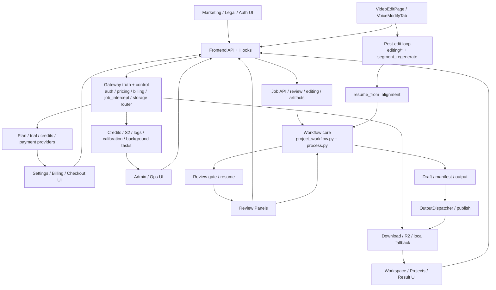

# GitNexus 项目图谱

新会话建议先读本文件，再按任务进入对应子图。

生成时间：2026-04-28
生成方式：基于当前仓库 `.gitnexus/` 最新索引与 GitNexus 本地查询结果整理

## 1. 图谱概览

当前 GitNexus 索引状态：

| 指标 | 数值 |
| --- | ---: |
| 文件数 | 938 |
| 符号节点数 | 16,470 |
| 关系边数 | 39,497 |
| 聚类数 | 671 |
| 执行流程数 | 300 |
| 索引提交 | `92864fd` |
| 索引状态 | `up-to-date` |

和 2026-04-18 那版相比，当前架构有四处必须反映到图谱里：

- `Workspace review -> Studio post-edit` 已经形成稳定双层表面，编辑不再只是零散端点
- `Gateway job_intercept -> storage.backend_router -> R2/local` 已经形成稳定下载决策轴
- 商业化侧已经扩展到 `billing center + provider abstraction + Alipay + legal pages`
- Gateway 控制平面继续扩大，`credits / S2 / job logs / display_name / background tasks` 已经不是边角逻辑

## 2. 主要功能区块

下表选取当前索引中最能代表架构主干的聚类：

| 聚类 | 符号数 | 代表文件/成员 |
| --- | ---: | --- |
| Services | 440 | `src/services/transcript_reviewer.py`、`src/services/jobs/api.py`、`src/services/jobs/editing_commit.py` |
| Gateway | 289 | `gateway/main.py`、`gateway/job_intercept.py`、`gateway/billing.py`、`gateway/storage/backend_router.py` |
| Jobs | 165 | Job API、editing、review actions、download / stream surface |
| Api | 139 | `frontend-next/src/lib/api/*`，含 review、voice selection、downloads、editing |
| Benchmark | 157 | 质量与基准侧代码明显增长，但不属于本轮主路径图谱 |
| Tts | 91 | TTS provider、voice speed、voice selection、segment regenerate |
| Ui | 80 | Next.js 交互表面与共享组件 |
| Gemini | 74 | translator / rewriter / related helpers |
| Web_ui | 68 | 仍有 library 形态的 review / snapshot / helpers 被主路径消费 |
| Pipeline | 51 | `src/pipeline/process.py` 阶段拼装、review pause / resume、alignment-only resume |
| Workflow | 50 | `src/modules/workflow/project_workflow.py` 与 stage runners |
| Draft | 47 | `draft_writer.py`、`caption_retiming.py`、输出落盘 |
| Translation | 44 | 翻译与译后整理 |
| Billing | 19 | plans、orders、checkout config、webhook settlement |
| Storage | 11 | backend router、R2 client、download routing |
| Marketing | 11 | pricing / legal / trust pages |
| Admin | 11 | admin pricing / ops 控制面 |
| Workspace | 6 | `WorkspacePage`、结果页、编辑入口 |

## 3. 子图入口

- 图谱索引：`docs/graphs/README.md`
- 工作流内核图：`docs/graphs/GITNEXUS_WORKFLOW_CORE_GRAPH.md`
- 审核流图：`docs/graphs/GITNEXUS_REVIEW_GRAPH.md`
- 编辑后处理图：`docs/graphs/GITNEXUS_EDITING_POST_EDIT_GRAPH.md`
- 存储与交付图：`docs/graphs/GITNEXUS_STORAGE_DELIVERY_R2_GRAPH.md`
- 商业化图：`docs/graphs/GITNEXUS_COMMERCIALIZATION_GRAPH.md`
- Admin / Ops / Calibration 图：`docs/graphs/GITNEXUS_ADMIN_OPS_CALIBRATION_GRAPH.md`

## 4. 仓库结构图

## 5. 核心证据链

### 5.1 主流程仍然是 Draft-first

- `src/modules/workflow/project_workflow.py` 的 `run_build()` 主顺序仍然是：
  `ingestion -> audio preparation -> media understanding -> translation -> chunking -> alignment -> draft`
- `src/modules/draft/caption_retiming.py` 仍然承担确定性 retiming
- `src/pipeline/process.py` 新增的是 review / editing / resume 侧轴，不是把视频渲染抬成主交付

结论：主交付仍是 Jianying draft，不是把“渲染 MP4”塞回主流水线中心。

### 5.2 Review 和 Post-Edit 现在是相邻但不同的两层

- `frontend-next/src/app/(app)/workspace/[jobId]/page.tsx` 继续在 `WorkspacePage` 内承接 review gate
- `frontend-next/src/components/workspace/VoiceSelectionPanel.tsx` 继续从 `voice_selection_review` payload 取说话人与候选音色，并通过 `/jobs/{id}/review/voice-selection/approve` 推进 gate
- `frontend-next/src/app/(app)/workspace/[jobId]/edit/page.tsx` 则在 `status == succeeded` 且 feature flag 打开后进入 `enterEditing -> getEditingSegments -> commitEditing`

结论：`review` 是显式 gate/resume，`post-edit` 是成功后的增量修改层，二者不应混成一条 UI 语义。

### 5.3 下载已经形成独立的 Gateway 路由决策面

- `gateway/job_intercept.py` 在下载入口里先走 `_maybe_r2_redirect(job_id, db)`
- `gateway/storage/backend_router.py` 明确声明它是“是否真的走 R2” 的唯一决策点
- 该 router 对 HEAD / upload / presign 任一异常统一 `return None`，由 Gateway 自动回落本地透传
- 下载事件现在有三类明确打点：
  `download.redirect.r2`
  `download.fallback.local`
  `download.local.direct`

结论：下载后端已经不是简单的 artifact 读取，而是带有路由决策、回退契约和事件打点的稳定轴线。

### 5.4 商业化侧已经不是“套餐页 + 假支付”的最小形态

- `frontend-next/src/app/(app)/settings/billing/page.tsx` 现在组合了：
  `SubscriptionSummary`
  `CreditsSummary`
  `CheckoutCard`
  `OrderHistory`
- `gateway/billing.py` 已经具备：
  `create_order`
  `get_checkout_config`
  provider query refresh
  provider-dispatched webhook handling
- `gateway/payment_providers.py` 已经把 `fake / alipay / wechatpay / stripe` 统一挂到 provider registry
- `frontend-next/src/app/(marketing)/privacy/page.tsx`、`refund/page.tsx`、`terms/page.tsx` 已成为营销信任面的一部分

结论：商业化图现在必须覆盖 provider abstraction、可用渠道发布、法律页与 settings billing center。

### 5.5 控制平面继续扩张，但仍应与主 pipeline 解耦

- `gateway/credits_observability.py` 明确是 admin-only read surface
- `gateway/s2_monitor_api.py` 与 `gateway/admin_job_monitor_api.py` 都围绕产物和日志做诊断，不是主流程 stage
- `gateway/job_intercept.py` 现在同时承接：
  下载路由
  `display_name` 文件名派生
  `copy_as_new` 后的 Gateway DB 镜像

结论：控制平面在增长，但它仍是围绕主流程的 sidecar，而不是主流程本身。

## 6. 按任务选图

- 要看主流程、Draft-first、alignment-only resume、异步导出如何挂在后面：读 `GITNEXUS_WORKFLOW_CORE_GRAPH.md`
- 要看 review gate、WorkspacePage、review panels：读 `GITNEXUS_REVIEW_GRAPH.md`
- 要看 Studio 修改、segment 状态机、overwrite / copy_as_new：读 `GITNEXUS_EDITING_POST_EDIT_GRAPH.md`
- 要看下载、R2 redirect、local fallback、文件名派生：读 `GITNEXUS_STORAGE_DELIVERY_R2_GRAPH.md`
- 要看 plan/trial/pricing/credits/payment 真源：读 `GITNEXUS_COMMERCIALIZATION_GRAPH.md`
- 要看 admin pricing、S2 monitor、credits observability、background tasks、voice calibration：读 `GITNEXUS_ADMIN_OPS_CALIBRATION_GRAPH.md`
