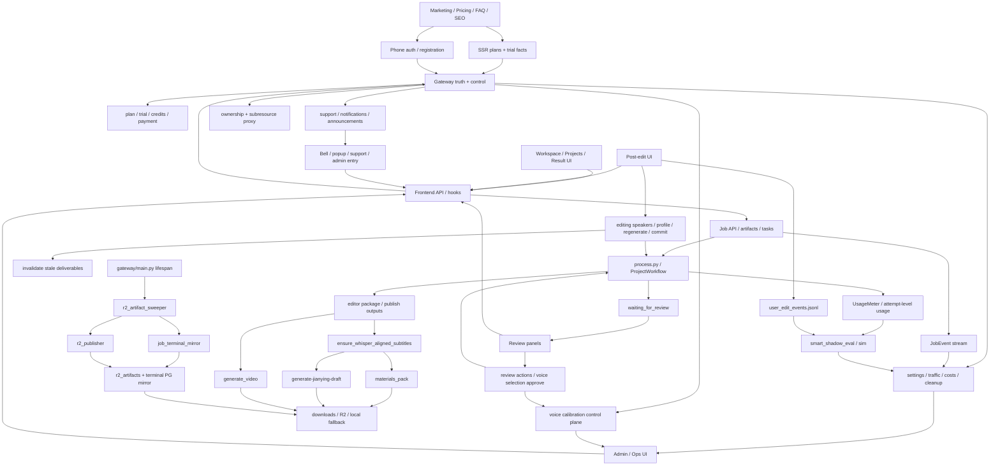

# GitNexus 项目图谱

新会话建议先读本文件，再按任务进入对应子图。生成时间：`2026-05-10`
生成方式：基于当前仓库 `.gitnexus/` 最新索引与源码交叉整理。

## 1. 图谱概览

| 指标 | 数值 |
| --- | ---: |
| 文件数 | 1215 |
| 节点数 | 21,691 |
| 关系数 | 49,871 |
| 聚类数 | 807 |
| 流程数 | 300 |
| 索引提交 | `2128003` |
| 索引状态 | `up-to-date` |

这轮最重要的结构变化有五条：

- `voice CPS auto-calibration` 已经从零散逻辑长成完整 sidecar：手动校准、clone 后自动校准、review-submit 前预热校准三条入口都已落地。
- editing 面新增了独立的 speakers registry 与 voice profile inference，`speaker -> profile -> UI badge` 成为新的稳定子链路。
- 存储交付面引入了 `r2_artifact_sweeper + job_terminal_mirror + r2_publisher`，下载不再只依赖请求时即时兜底。
- review 主路径依然是 `WorkspacePage -> panels -> resume`，但 voice selection approve 现在会先经过 T2 calibration preflight。
- 原有的 commercialization、support/notifications、benchmark/metering 轴线仍然成立，并继续和 Gateway truth、Job API、Workflow 核心并列。

## 2. 关键基座

| 基座 | 当前主轴 | 代表文件 |
| --- | --- | --- |
| Workflow | `SemanticBlock -> TTS -> DSP-first alignment -> cue_pipeline -> editor outputs` | `src/pipeline/process.py`、`src/services/alignment/aligner.py` |
| Review | `waiting_for_review -> WorkspacePage panels -> resume` | `src/services/review_state.py`、`src/services/jobs/review_actions.py` |
| Editing | `editing speakers -> profile inference -> regenerate -> commit` | `src/services/jobs/editing_speakers.py`、`src/services/jobs/editing_voice_profile.py`、`src/services/jobs/editing_commit.py` |
| Jianying | on-demand draft runner、claim guard、orphan rescue | `src/services/jobs/jianying_draft_runner.py`、`src/modules/output/jianying/jianying_draft_writer.py` |
| Delivery | `materials_pack / generate_video / editor.jianying_draft_zip / R2 registry` | `gateway/storage/backend_router.py`、`gateway/r2_artifact_sweeper.py`、`src/services/r2_publisher_lib/r2_publisher.py` |
| Calibration | manual / clone-after / review-preflight 三入口 | `gateway/user_voice_api.py`、`gateway/voice_calibration_hook.py`、`gateway/voice_calibration_review_preflight.py` |
| Gateway | ownership、plan truth、ops、support、cleanup | `gateway/job_intercept.py`、`gateway/main.py`、`gateway/admin_settings.py` |
| Support & Notifications | help center、support conversations、notifications、announcements | `gateway/support_service.py`、`gateway/notifications_api.py`、`gateway/system_announcements_service.py` |
| Metering & Audit | `UsageMeter`、`JobEvent`、`user_edit_events.jsonl` | `src/services/usage_meter.py`、`src/services/jobs/user_edit_audit.py` |
| Offline Evaluation | `smart_shadow_eval / sim`、quality/cost reports | `scripts/smart_shadow_eval_collector.py`、`scripts/smart_shadow_sim_aggregator.py` |

## 3. 子图入口

- 图谱索引：`docs/graphs/README.md`
- 工作流内核图：`docs/graphs/GITNEXUS_WORKFLOW_CORE_GRAPH.md`
- 剪映草稿交付图：`docs/graphs/GITNEXUS_JIANYING_DRAFT_DELIVERY_GRAPH.md`
- 审核流图：`docs/graphs/GITNEXUS_REVIEW_GRAPH.md`
- 编辑 / 后处理图：`docs/graphs/GITNEXUS_EDITING_POST_EDIT_GRAPH.md`
- 存储与交付图：`docs/graphs/GITNEXUS_STORAGE_DELIVERY_R2_GRAPH.md`
- 商业化图：`docs/graphs/GITNEXUS_COMMERCIALIZATION_GRAPH.md`
- 支持 / 通知图：`docs/graphs/GITNEXUS_SUPPORT_NOTIFICATIONS_GRAPH.md`
- Admin / Ops / Calibration 图：`docs/graphs/GITNEXUS_ADMIN_OPS_CALIBRATION_GRAPH.md`
- Benchmark / Quality / Cost 图：`docs/graphs/GITNEXUS_BENCHMARK_QUALITY_COST_GRAPH.md`

## 4. 仓库结构图

## 5. 核心证据链

### 5.1 review 提交前已经有显式 calibration preflight

- `frontend-next/src/components/workspace/VoiceSelectionPanel.tsx` 的 approve 仍然从 `approveVoiceSelection(jobId, approvals)` 进入。
- `gateway/job_intercept.py` 的 voice-selection approve 代理前，会进入 `gateway/voice_calibration_review_preflight.py`。
- preflight 会先解析 job-level final MiniMax model，再优先查 `user_voices(owner_id, voice_id)`，失败时再回退到 `voice_catalog`。
- preflight 有 50 秒硬上限，失败和超时都不会阻断后续 `proxy_request`。

结论：`voice_selection_review` 已经不仅是 UI 审核门，而是 review-submit 前的真实运行时准备面。

### 5.2 editing 面已经长出独立 speaker registry 与 profile inference

- `src/services/jobs/editing_speakers.py` 把编辑态 speaker registry 单独落在 `editor/editing/speakers.json`。
- `frontend-next/src/app/(app)/workspace/[jobId]/edit/page.tsx` 和 `EditPageSpeakerCreateDialog.tsx` 现在直接消费 `/editing/speakers`。
- `src/services/jobs/editing_voice_profile.py` 会在新 speaker 首次被绑定 segment 时异步推断 voice profile。
- `EditPageSpeakerProfileBadge.tsx` 则把 `pending / inferring / ready / failed` 状态显式带回 UI。

结论：editing speaker 已经不再只是 segment 上的一个字符串字段，而是有独立生命周期的编辑实体。

### 5.3 交付面已经从 lazy download 走向 proactive publish

- `gateway/main.py` 启动时会拉起 `r2_artifact_sweeper`。
- `gateway/r2_artifact_sweeper.py` 以 JSON store 为真源扫描 succeeded jobs，并先执行 `mirror_job_terminal_state(...)`。
- `gateway/job_terminal_mirror.py` 负责把 terminal state、`edit_generation`、结算副作用镜像回 Gateway PG，同时避免覆盖 Gateway 自有字段。
- `src/services/r2_publisher_lib/r2_publisher.py` 用 `jobs/{job_id}/g{edit_generation}/...` 这套 key 空间将 artifacts 主动推到 R2，并更新 `r2_artifacts` registry。

结论：下载层已经形成 “真源扫描 -> terminal mirror -> proactive publish -> registry redirect” 的正式交付平面。

### 5.4 calibration 已经形成三入口 sidecar

- `gateway/user_voice_api.py` 提供手动 `/user-voices/{voice_id}/calibrate-speed`。
- `gateway/voice_selection_api.py` clone 成功后会触发 `gateway/voice_calibration_hook.py`。
- `gateway/voice_calibration_review_preflight.py` 在 review submit 前做最后一轮缺失补齐。
- 三者都汇入共享的 `run_calibration_task` / inflight dedupe 语义。

结论：voice speed calibration 已经不是孤立工具，而是和 clone、review、ops 一起组成完整控制平面。

## 6. 按任务选图

- 要看 review gate、translation review、voice selection、review-submit calibration，读 `GITNEXUS_REVIEW_GRAPH.md`
- 要看 editing speakers、speaker profile、preview-source、commit hard gate，读 `GITNEXUS_EDITING_POST_EDIT_GRAPH.md`
- 要看 `materials_pack`、R2 发布、terminal mirror、download resolve，读 `GITNEXUS_STORAGE_DELIVERY_R2_GRAPH.md`
- 要看 admin settings、voice calibration、traffic、cost、cleanup，读 `GITNEXUS_ADMIN_OPS_CALIBRATION_GRAPH.md`
- 要看 workflow 内核、DSP-first 对齐与 cue pipeline，读 `GITNEXUS_WORKFLOW_CORE_GRAPH.md`
