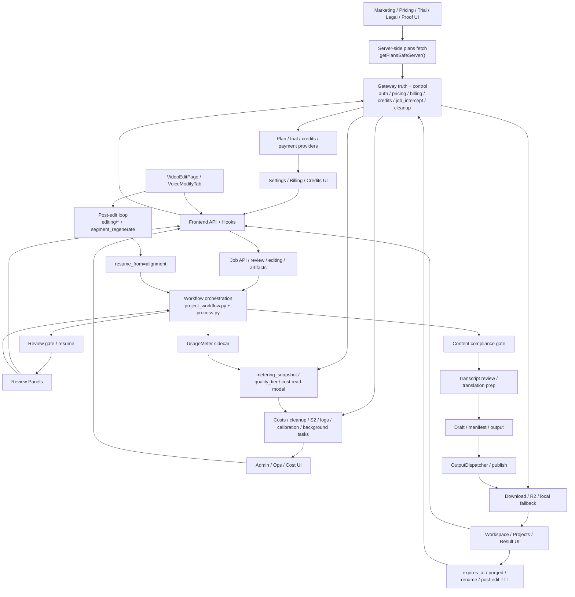

# GitNexus 项目图谱

新会话建议先读本文件，再按任务进入对应子图。

生成时间：2026-05-01
生成方式：基于当前仓库 `.gitnexus/` 最新索引与 GitNexus 本地查询结果整理

## 1. 图谱概览

当前 GitNexus 索引状态：

| 指标 | 数值 |
| --- | ---: |
| 文件数 | 961 |
| 符号节点数 | 16,761 |
| 关系边数 | 40,645 |
| 聚类数 | 712 |
| 执行流程数 | 300 |
| 索引提交 | `1934901` |
| 索引状态 | `up-to-date` |

这轮最需要反映的是四条新边：

- 点数逻辑已经不只是观测 sidecar，`job create` 与 `voice clone` 都有了 live credit guard
- Gateway 现在显式拥有 retention / `expires_at` / `purged` 的 authoritative DB 语义
- admin 成本管理继续站在 `metering_snapshot` 之上，但它仍是只读 read model
- marketing narrative/proof、content compliance gate 这些上一轮新增结构继续成立

## 2. 主要功能区块

下表选取当前索引中最能代表架构主干的聚类：

| 聚类 | 符号数 | 代表文件/成员 |
| --- | ---: | --- |
| Services | 488 | `src/services/transcript_reviewer.py`、`src/services/jobs/api.py`、`src/services/content_compliance.py` |
| Gateway | 403 | `gateway/job_intercept.py`、`gateway/credits_service.py`、`gateway/project_cleanup.py`、`gateway/voice_selection_api.py` |
| Jobs | 193 | Job API、editing、review actions、cleanup / list surfaces |
| Benchmark | 154 | metering / credits / cost / quality sidecar 已稳定成独立聚类 |
| Api | 138 | `frontend-next/src/lib/api/*`，含 review、voice selection、jobs、credits |
| Scripts | 99 | maintenance / diagnostics / support scripts |
| Tts | 97 | TTS provider、voice selection、segment regenerate |
| Gemini | 91 | translator / prompt model / retry helpers |
| Media_understanding | 88 | 媒体理解、说话人结构、合规前置信息 |
| Ui | 82 | Next.js 交互表面与共享组件 |
| Pipeline | 75 | `src/pipeline/process.py` orchestration、content compliance、late credit reserve |
| Workflow | 55 | `project_workflow.py`、stage runners、editing resume 接口 |
| Web_ui | 55 | translation review / cleanup / helper library |
| Draft | 47 | `draft_writer.py`、`caption_retiming.py`、输出落盘 |
| Translation | 44 | 翻译与译后整理 |
| Assemblyai | 42 | transcription / transcript artifacts |

## 3. 子图入口

- 图谱索引：`docs/graphs/README.md`
- 工作流内核图：`docs/graphs/GITNEXUS_WORKFLOW_CORE_GRAPH.md`
- 审核流图：`docs/graphs/GITNEXUS_REVIEW_GRAPH.md`
- 编辑后处理图：`docs/graphs/GITNEXUS_EDITING_POST_EDIT_GRAPH.md`
- 存储与交付图：`docs/graphs/GITNEXUS_STORAGE_DELIVERY_R2_GRAPH.md`
- 商业化图：`docs/graphs/GITNEXUS_COMMERCIALIZATION_GRAPH.md`
- Admin / Ops / Calibration 图：`docs/graphs/GITNEXUS_ADMIN_OPS_CALIBRATION_GRAPH.md`
- Benchmark / Quality / Cost 图：`docs/graphs/GITNEXUS_BENCHMARK_QUALITY_COST_GRAPH.md`

## 4. 仓库结构图

## 5. 核心证据链

### 5.1 点数已经从“只观测”升级到 live guard

- `gateway/credits_service.py` 新增 `reserve_credits_or_raise(...)`
- 它与 `shadow_reserve()` 共享 bucket priority / ledger shape，但不允许 partial reserve；余额不够会抛 `InsufficientCreditsError`
- `gateway/job_intercept.py` 在创建任务时，如果已知时长，会先 `reserve_credits_or_raise()`；失败则回滚本地事务并补偿取消上游任务
- 同文件在 `update_source_metadata` 晚到时长路径上，也会做 late reserve；若余额不足，会把 job 置为 failed
- `gateway/voice_selection_api.py` clone 路径同样改为 `reserve_credits_or_raise()`，不足时直接返回 402

结论：credits 不再只是 shadow accounting；至少在 job create 和 voice clone 两个入口上，它已经是 live guard。

### 5.2 retention / purged 现在由 Gateway DB authoritative 持有

- `gateway/job_intercept.py` 在创建普通任务时写入 `expires_at = now + 7d`；admin 任务则 `expires_at = None`
- `gateway/project_cleanup.py` 文件头明确声明它拥有 authoritative DB transition：过期 terminal job 会被翻成 `status='purged'`
- 同模块还明确：
  admin job 永不过期
  active statuses 不参与 purge
  非安全路径只翻状态，不碰磁盘
- `src/services/web_ui/cleanup.py` 则继续负责 Job API JSON store 的磁盘清理，并与 Gateway cleanup 共享安全白名单语义
- `gateway/job_intercept.py` 的 merge 逻辑还会阻止 stale Job API JSON 把已 `purged` 的 DB 行“复活”

结论：TTL 现在不是零散前端提示，而是 Gateway DB 层的 authoritative lifecycle 语义。

### 5.3 projects/workspace 已开始消费 TTL 与 purged 语义

- `frontend-next/src/features/jobs/expiry.ts` 现在明确把 `expiresAt` 作为第一优先级；只有缺失时才回退 `updatedAt + 7d`
- `frontend-next/src/app/(app)/projects/page.tsx` 会：
  对 admin 展示“永不过期”
  对普通任务展示分级 expiry label
  把 `purged` 当作正式状态处理
- 同页继续承接 rename，这说明 `display_name + expires_at + purged` 已经是项目列表的正式消费面

结论：前端结果表面现在已经明确站在 Gateway TTL 真源之上。

### 5.4 marketing/proof、content compliance 与 admin cost management 仍然成立

- marketing 首页仍然是 `PainPoints -> ProductProof -> ToolComparison -> PricingPreview` 的 narrative / proof surface
- workflow 前部仍然有 `content_compliance` gate
- `gateway/cost_management.py` 继续站在 `Job.metering_snapshot` 之上提供只读成本 / 收入 / 毛利 read model

结论：这次新提交是“在现有结构上补守门和保留期”，不是推翻上一轮结构。

## 6. 按任务选图

- 要看主流程、内容合规 gate、Draft-first、alignment-only resume：读 `GITNEXUS_WORKFLOW_CORE_GRAPH.md`
- 要看 review gate、speaker edits、voice selection quality tier：读 `GITNEXUS_REVIEW_GRAPH.md`
- 要看 Studio 修改、segment 状态机、overwrite / copy_as_new：读 `GITNEXUS_EDITING_POST_EDIT_GRAPH.md`
- 要看下载、R2 redirect、local fallback、文件名派生：读 `GITNEXUS_STORAGE_DELIVERY_R2_GRAPH.md`
- 要看 marketing narrative/proof、workspace 点数预估/预扣、plan/trial/pricing/credits/payment 真源：读 `GITNEXUS_COMMERCIALIZATION_GRAPH.md`
- 要看 admin pricing、admin costs、retention cleanup、credits observability、S2 monitor、background tasks、voice calibration：读 `GITNEXUS_ADMIN_OPS_CALIBRATION_GRAPH.md`
- 要看 live reserve/capture/release、quality tier、价格目录、margin 估算、provider breakdown：读 `GITNEXUS_BENCHMARK_QUALITY_COST_GRAPH.md`
