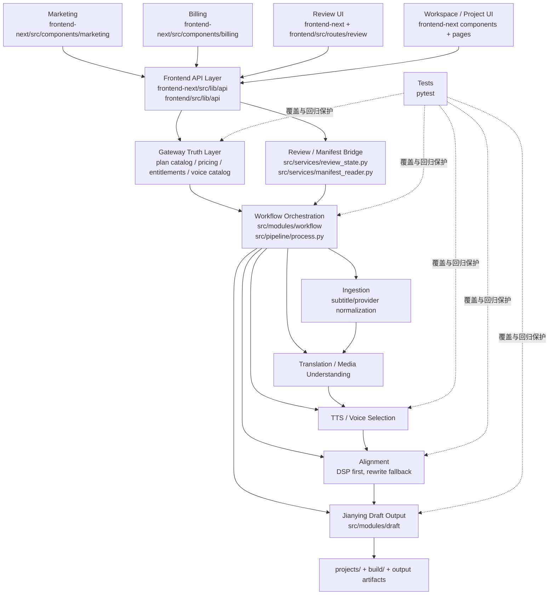
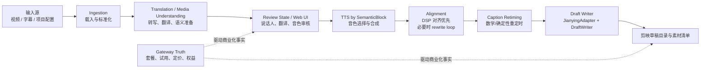

# GitNexus 项目图谱

新会话建议先读本文件，再按任务进入对应子图。

生成时间：2026-04-10  
生成方式：基于当前仓库 `.gitnexus/` 索引与 GitNexus 本地查询结果整理

## 1. 图谱概览

当前 GitNexus 索引状态：

| 指标 | 数值 |
| --- | ---: |
| 文件数 | 740 |
| 符号节点数 | 12,160 |
| 关系边数 | 29,443 |
| 聚类数 | 461 |
| 执行流程数 | 300 |
| 索引提交 | `05fb171` |

GitNexus 聚类显示，这个仓库的主骨架不是单一 Web 项目，而是一个围绕“视频翻译工作流 + Gateway 商业化 + 前端工作台”组合起来的多层系统。

为了可读性，下面的图谱刻意不展开最大的 `Tests` 聚类；GitNexus 实际上识别到 `Tests` 是全仓库最大的连接区块，说明当前项目的测试覆盖面很广，而且紧贴业务模块。

## 2. 主要功能区块

下表为 GitNexus 聚类中最值得纳入架构图的区块：

| 聚类 | 符号数 | 代表文件/成员 |
| --- | ---: | --- |
| Services | 381 | `main.py`、`src/services/transcript_reviewer.py`、`src/services/voice_clone.py`、`src/services/remote_workbench_runtime.py` |
| Gateway | 242 | `gateway/plan_catalog.py`、`gateway/pricing_schema.py`、`gateway/billing.py`、`gateway/voice_catalog_models.py` |
| Api | 156 | `frontend-next/src/lib/api/client.ts`、`frontend-next/src/lib/api/reviews.ts`、`frontend-next/src/lib/api/voiceSelection.ts` |
| Web_ui | 103 | `src/services/review_state.py`、`src/services/manifest_reader.py`、`gateway/voice_selection_api.py` |
| Workflow | 87 | `src/modules/workflow/project_workflow.py`、`src/modules/workflow/translation_stage_runner.py`、`src/pipeline/process.py` |
| Ui | 83 | `frontend-next/src/components/ui/sidebar.tsx`、`frontend-next/src/components/ui/sheet.tsx` |
| Media_understanding | 70 | 媒体理解与素材解析相关服务 |
| Tts | 59 | `src/services/tts/voice_match_resolver.py`、`minimax_voice_selector.py`、`volcengine_voice_catalog.py` |
| Draft | 51 | `src/modules/draft/draft_writer.py`、`caption_retiming.py`、`jianying_adapter.py` |
| Translation | 48 | 翻译与翻译结果清洗相关模块 |
| Alignment | 30 | `src/services/alignment/aligner.py`、`src/modules/alignment/alignment_orchestrator.py` |
| Pipeline | 20 | `src/pipeline/process.py` 与阶段 payload/衔接逻辑 |
| Ingestion | 19 | `src/modules/ingestion/providers.py`、`srt_loader.py`、`normalizer.py` |
| Billing | 17 | `frontend-next/src/components/billing/*`、`frontend-next/src/lib/billing/*` |
| Review | 19 | `frontend-next/src/components/workspace/TranslationReviewPanel.tsx`、`frontend/src/routes/review/*` |
| Marketing | 12 | `frontend-next/src/components/marketing/*` |

## 3. 仓库结构图

## 4. 核心执行流图

这张图按项目当前约束做了收敛：目标产物是剪映草稿，不是直接渲染 MP4。

## 5. GitNexus 直接证据

下面这些流程是直接从 GitNexus 的 process 资源中读取的，不是手工猜测：

### 5.1 项目详情页到结果下载 URL

`ProjectDetailPage → BuildBackendUrl`：

1. `frontend/src/routes/project-detail/ProjectDetailPage.tsx`
2. `loadDetail`
3. `frontend-next/src/lib/api/jobs.ts:getProjectDetail`
4. `frontend-next/src/lib/api/jobs.ts:getProjectArtifacts`
5. `frontend-next/src/lib/api/mappers.ts:toResultDownloadItems`
6. `frontend-next/src/lib/api/downloads.ts:buildResultDownloadUrl`
7. `frontend-next/src/lib/api/config.ts:buildBackendUrl`

这说明前端项目详情页是通过统一 API/下载配置层接后端，而不是各页面各自拼接地址。

### 5.2 翻译审核面板到 API 客户端

`TranslationReviewPanel → SerializeBody`：

1. `frontend-next/src/components/workspace/TranslationReviewPanel.tsx`
2. `load`
3. `frontend-next/src/lib/api/reviews.ts:getTranslationReview`
4. `frontend-next/src/lib/api/client.ts:get`
5. `frontend-next/src/lib/api/client.ts:request`
6. `frontend-next/src/lib/api/client.ts:serializeBody`

这说明审核流是独立前端面板 + 统一 API 客户端的模式。

### 5.3 Gateway 套餐事实进入积分扣减

`Shadow_capture → PlanConfig`：

1. `gateway/credits_service.py:shadow_capture`
2. `_pick_buckets_by_priority`
3. `_get_runtime_bucket_priority`
4. `gateway/pricing_runtime.py:get_runtime_pricing`
5. `_load_from_file`
6. `gateway/pricing_schema.py:build_default_pricing_payload`
7. `gateway/pricing_schema.py:PlanConfig`

这条链路很符合当前项目约束：Gateway 是定价、试用和权益事实的真源。

### 5.4 对齐阶段的状态读取链

`Run → StateError`：

1. `src/modules/workflow/alignment_stage_runner.py:run`
2. `_read_source_input_hash`
3. `src/modules/workflow/stage_helpers.py:get_stage_payload_value`
4. `src/services/state_manager.py:get_stage`
5. `src/services/state_manager.py:load`
6. `_normalize_state`
7. `_normalize_status`
8. `src/core/exceptions.py:StateError`

这说明 workflow 的阶段状态不是散落在脚本里，而是有明确的状态管理和异常边界。

## 6. 结论

从 GitNexus 图谱看，这个仓库目前最核心的三根主轴是：

1. `Workflow + Pipeline + Draft`：真正的视频翻译生产主链，终点是剪映草稿。
2. `Gateway + Billing + Pricing`：商业化事实层，负责套餐、试用、权益与支付相关真相。
3. `frontend-next / frontend + Api + Review`：营销、审核、工作台三类前端入口，通过统一 API 层连接 Gateway 和工作流。

如果后续需要继续细化，我建议下一步用 GitNexus 再分别生成：

1. “工作流内核图”：只展开 `Ingestion → Translation → TTS → Alignment → Draft`
2. “商业化图”：只展开 `Marketing / Auth / Billing / Entitlements / Checkout / Webhook`
3. “审核图”：只展开 `Speaker Review / Translation Review / Voice Review / ReviewState`

## 7. 子图入口

已经拆出的子图如下：

1. `docs/graphs/GITNEXUS_WORKFLOW_CORE_GRAPH.md`
2. `docs/graphs/GITNEXUS_COMMERCIALIZATION_GRAPH.md`
3. `docs/graphs/GITNEXUS_REVIEW_GRAPH.md`
