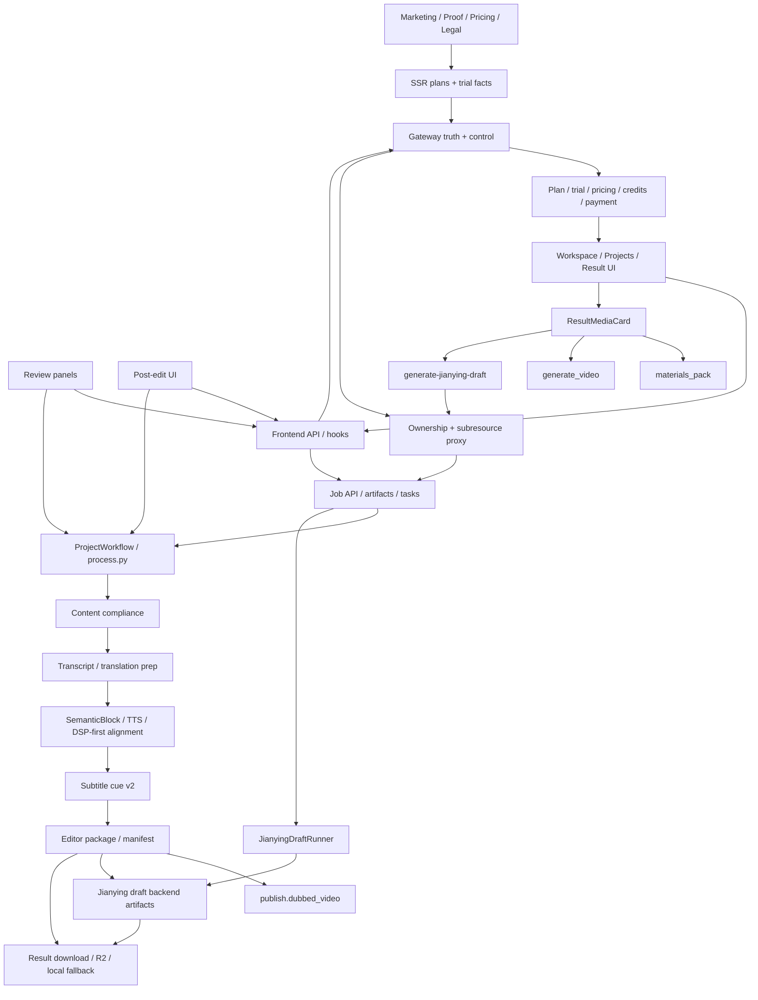

# GitNexus 项目图谱

新会话建议先读本文件，再按任务进入对应子图。

生成时间：2026-05-03
生成方式：基于当前仓库 `.gitnexus/` 最新索引与源码核对整理

## 1. 图谱概览

| 指标 | 数值 |
| --- | ---: |
| 文件数 | 1006 |
| 节点数 | 17,730 |
| 关系数 | 43,324 |
| 聚类数 | 741 |
| 流程数 | 300 |
| 索引提交 | `83f4ddd` |
| 索引状态 | `up-to-date` |

这轮最需要反映的结构变化有四条：

- `Subtitle Cue V2` 已经成为 `OutputDispatcher -> EditorPackageWriter -> SRT` 的 canonical path，而不是附带实验层。
- Studio 任务现在有一条单独的 `on-demand Jianying draft delivery` 平面，带状态机、异步 runner、Gateway ownership proxy、前端轮询与本地路径输入。
- 结果交付面已经稳定分成三类：`publish.dubbed_video`、`materials_pack`、`editor.jianying_draft_zip`。
- marketing 前门已经不再模糊描述“可继续剪辑”，而是明确把“导出剪映草稿”写进 narrative 和 workflow showcase。

## 2. 关键域

| 域 | 当前主轴 | 代表文件 |
| --- | --- | --- |
| Workflow | 语义块到对齐后的 canonical project | `src/pipeline/process.py`、`src/modules/output/output_dispatcher.py` |
| Subtitles | cue v2 分段、定时、校验、SRT 序列化 | `src/modules/subtitles/cue_pipeline.py`、`src/modules/subtitles/srt_writer.py` |
| Jianying | 剪映草稿 writer / validator / backend | `src/modules/output/jianying/jianying_draft_writer.py`、`src/modules/output/jianying/jianying_draft_backend.py` |
| Jobs API | 按需剪映草稿状态机、下载面、后台线程 runner | `src/services/jobs/api.py`、`src/services/jobs/jianying_draft_runner.py`、`src/services/jobs/models.py` |
| Gateway | ownership、套餐 gate、credits、job subresource proxy | `gateway/job_intercept.py`、`gateway/plan_catalog.py` |
| Frontend | workspace 结果页、Jianying path dialog、marketing proof | `frontend-next/src/components/workspace/ResultMediaCard.tsx`、`frontend-next/src/components/workspace/JianyingDraftPathDialog.tsx`、`frontend-next/src/app/(marketing)/page.tsx` |

## 3. 子图入口

- 图谱索引：`docs/graphs/README.md`
- 工作流内核图：`docs/graphs/GITNEXUS_WORKFLOW_CORE_GRAPH.md`
- 剪映草稿交付图：`docs/graphs/GITNEXUS_JIANYING_DRAFT_DELIVERY_GRAPH.md`
- 审核流图：`docs/graphs/GITNEXUS_REVIEW_GRAPH.md`
- 编辑 / 后处理图：`docs/graphs/GITNEXUS_EDITING_POST_EDIT_GRAPH.md`
- 存储与交付图：`docs/graphs/GITNEXUS_STORAGE_DELIVERY_R2_GRAPH.md`
- 商业化图：`docs/graphs/GITNEXUS_COMMERCIALIZATION_GRAPH.md`
- Admin / Ops / Calibration 图：`docs/graphs/GITNEXUS_ADMIN_OPS_CALIBRATION_GRAPH.md`
- Benchmark / Quality / Cost 图：`docs/graphs/GITNEXUS_BENCHMARK_QUALITY_COST_GRAPH.md`

## 4. 仓库结构图

## 5. 核心证据链

### 5.1 Subtitle Cue V2 已经是输出主路径

- `src/modules/output/output_dispatcher.py` 在 `editor_backend.write()` 之前调用 `_generate_subtitle_cues(...)`。
- 该调用惰性导入 `modules.subtitles.cue_pipeline.build_subtitle_cues_for_blocks(...)`，输入是 `localized_project.semantic_blocks + captions`。
- `src/modules/subtitles/cue_pipeline.py` 明确把自己定义为 `SemanticBlock list -> SubtitleCue list + ValidationReport` 的桥接层。
- `src/modules/subtitles/srt_writer.py` 明确声明“只序列化 canonical cues，不重分段，不重新定时”。

结论：字幕层现在不是“从 editor 产物再反推 SRT”，而是从 `SemanticBlock` 直接生成 canonical cues，再喂给 editor / SRT writer。

### 5.2 剪映草稿已经长成独立交付平面

- `src/services/jobs/models.py` 给 `JobRecord` 加了 `jianying_draft_status / started_at / completed_at / zip_path / user_root` 字段。
- `src/services/jobs/jianying_draft_runner.py` 定义了 `idle / running / succeeded / failed` 状态机，并在 Job API 启动时执行 `reap_stale()`。
- `src/services/jobs/api.py` 暴露：
  - `POST /jobs/{id}/generate-jianying-draft`
  - `GET /jobs/{id}/jianying-draft-status`
  - `user_draft_root` 作为 body 入口
- `gateway/job_intercept.py` 对这两个 subresource 做 ownership 校验后再注入 internal headers 转发。

结论：剪映草稿不是 `OutputDispatcher` 的默认同步副产品，而是 Studio 成功任务上的独立异步交付链。

### 5.3 交付面已经从“两类结果”变成“三类结果”

- `src/modules/output/manifest_writer.py` 把 `editor.jianying_draft_zip / editor.jianying_draft_dir / editor.jianying_compatibility_report` 写进 `primary_outputs.editor`。
- `src/services/web_ui/output_entries.py` 把 `editor.jianying_draft_zip` 纳入公开下载白名单。
- `frontend-next/src/components/workspace/ResultMediaCard.tsx` 现在同时承接：
  - `materials_pack`
  - `generate_video`
  - `JianyingDraftSection`

结论：结果页已经不只是在“视频 / 音频 / 素材包”之间切换，而是正式承载“导出到剪映草稿”的第三种交付模式。

### 5.4 marketing 前门已经把剪映草稿写成承诺

- `frontend-next/src/app/(marketing)/page.tsx` 继续以 `PainPoints -> FeaturedDemos -> ProductProof -> WorkflowShowcase -> PricingPreview` 组织 narrative。
- `frontend-next/src/components/marketing/workflow-showcase.tsx` 第 4 步明确写了“下载结果，或直接导出剪映草稿”。
- `frontend-next/src/components/marketing/product-proof.tsx` 结果面说明已经把“可下载的交付物”写成产品证明的一部分。

结论：marketing 不再只是证明“能翻译并配音”，而是开始证明“可交付到你本地剪映继续剪”。

## 6. 按任务选图

- 要看 `SemanticBlock -> cue v2 -> editor outputs`，读 `GITNEXUS_WORKFLOW_CORE_GRAPH.md`
- 要看 `generate-jianying-draft`、`user_draft_root`、zip / report、前端轮询，读 `GITNEXUS_JIANYING_DRAFT_DELIVERY_GRAPH.md`
- 要看下载白名单、`editor.jianying_draft_zip`、R2 / local fallback，读 `GITNEXUS_STORAGE_DELIVERY_R2_GRAPH.md`
- 要看首页如何消费“导出剪映草稿”的产品承诺，读 `GITNEXUS_COMMERCIALIZATION_GRAPH.md`
