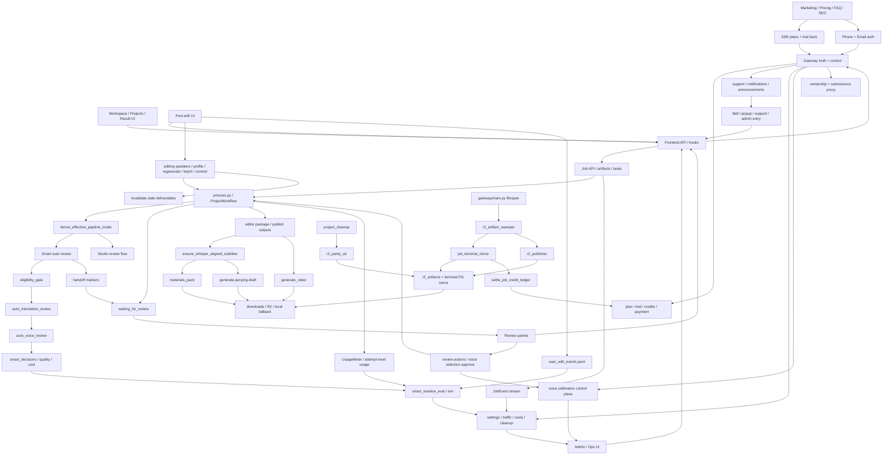

# GitNexus 项目图谱

新会话建议先读本文件，再按任务进入对应子图。生成时间：`2026-05-14`
生成方式：基于当前仓库 `.gitnexus/` 最新索引与源码交叉整理。

## 1. 图谱概览

| 指标 | 数值 |
| --- | ---: |
| 文件数 | 1256 |
| 节点数 | 22,670 |
| 关系数 | 52,154 |
| 聚类数 | 850 |
| 流程数 | 300 |
| 索引提交 | `d56ac1c` |
| 索引状态 | `up-to-date` |

这轮最需要反映的结构变化有六条：

- Smart 自动审核从计划进入代码：eligibility gate、translation auto review、voice auto review、handoff marker、smart_state、sidecar audit 和 credits policy 已经有可测试骨架。
- user-facing Studio gates 已经接受 Smart job：`smart_state.status in {completed, downgraded_to_studio}` 可以进入 editing 与 Jianying draft，但 in-flight/refunded Smart job 会被拒绝。
- Jianying draft runner 的 Smart 门禁已从单次 preflight 升级为 pre-lock + post-lock 双重检查，避免并发 smart_state 回写把 in-flight Smart job 误放进草稿生成。
- Auth 前门从 phone-only 扩展到 phone + email 双入口，email 注册同样坚持“验证码通过不等于注册完成”的 registration token 边界。
- R2 交付从 proactive publish 继续扩展到 cleanup parity：清理本地项目目录前可以强制检查 registry + R2 HEAD，避免删掉唯一可用副本。
- Job terminal mirror 现在还会同步 `smart_state`，让 credit settlement 能看到 Smart 的 `credits_policy`。
- editing 面新增 batch re-TTS，仍然只处理用户显式弄脏的 segment，并收集逐段失败。
- 根级部署与生产约束进入项目指导文件，生产 Compose、build context、R2/captcha 配置漂移都有明确边界。

## 2. 关键基座

| 基座 | 当前主轴 | 代表文件 |
| --- | --- | --- |
| Workflow | `SemanticBlock -> TTS -> DSP-first alignment -> cue_pipeline -> editor outputs` | `src/pipeline/process.py`、`src/services/alignment/aligner.py` |
| Smart | deterministic auto-review + handoff to Studio | `src/services/smart/*`、`src/services/smart_wiring.py` |
| Review | `waiting_for_review -> WorkspacePage panels -> resume` | `src/services/review_state.py`、`src/services/jobs/review_actions.py` |
| Editing | `editing speakers -> profile inference -> regenerate -> batch -> commit` | `src/services/jobs/editing_speakers.py`、`src/services/jobs/editing_batch.py`、`src/services/jobs/editing_commit.py` |
| Delivery | `materials_pack / generate_video / editor.jianying_draft_zip / R2 registry / parity` | `gateway/storage/backend_router.py`、`gateway/r2_artifact_sweeper.py`、`src/services/r2_publisher_lib/r2_parity.py` |
| Auth | phone + email registration, reset, session | `gateway/auth_phone.py`、`gateway/auth_email.py`、`frontend-next/src/components/auth/*` |
| Calibration | manual / clone-after / review-preflight 三入口 | `gateway/user_voice_api.py`、`gateway/voice_calibration_hook.py`、`gateway/voice_calibration_review_preflight.py` |
| Gateway | ownership、plan truth、ops、support、cleanup | `gateway/job_intercept.py`、`gateway/main.py`、`gateway/project_cleanup.py` |
| Metering & Settlement | `UsageMeter`、Smart credits policy、terminal settle | `src/services/usage_meter.py`、`gateway/credits_service.py`、`gateway/job_terminal_mirror.py` |
| Offline Evaluation | `smart_shadow_eval / sim`、quality/cost reports | `scripts/smart_shadow_eval_collector.py`、`scripts/smart_shadow_sim_aggregator.py` |

## 3. 子图入口

- 图谱索引：`docs/graphs/README.md`
- 工作流内核图：`docs/graphs/GITNEXUS_WORKFLOW_CORE_GRAPH.md`
- Smart 自动审核图：`docs/graphs/GITNEXUS_SMART_AUTO_REVIEW_GRAPH.md`
- 剪映草稿交付图：`docs/graphs/GITNEXUS_JIANYING_DRAFT_DELIVERY_GRAPH.md`
- 审核流图：`docs/graphs/GITNEXUS_REVIEW_GRAPH.md`
- 编辑 / 后处理图：`docs/graphs/GITNEXUS_EDITING_POST_EDIT_GRAPH.md`
- 存储与交付图：`docs/graphs/GITNEXUS_STORAGE_DELIVERY_R2_GRAPH.md`
- 商业化图：`docs/graphs/GITNEXUS_COMMERCIALIZATION_GRAPH.md`
- 支持 / 通知图：`docs/graphs/GITNEXUS_SUPPORT_NOTIFICATIONS_GRAPH.md`
- Admin / Ops / Calibration 图：`docs/graphs/GITNEXUS_ADMIN_OPS_CALIBRATION_GRAPH.md`
- Benchmark / Quality / Cost 图：`docs/graphs/GITNEXUS_BENCHMARK_QUALITY_COST_GRAPH.md`

## 4. 仓库结构图

## 5. 核心证据链

### 5.1 Smart 自动审核已经有正式边界

- `src/services/smart/eligibility_gate.py` 是纯 deterministic speaker gate，支持 production profile、canonical list、simulator aggregate 三种输入形状。
- `src/services/smart/auto_translation_review.py` 固化 6 个检查，reason code 与 shadow simulator 对齐。
- `src/services/smart/auto_voice_review.py` 只通过 `CloneProvider` protocol 编排 clone/preset/pause，不直接导入真实 provider。
- `src/services/smart_wiring.py` 是唯一允许接真实 MiniMax clone adapter 的 composition root。
- `src/services/smart/handoff.py` 一次性发出 review_state、`[SMART_STATE]`、`[WEB_REVIEW]` 三类 marker。

结论：Smart 不是把 LLM 塞进审核，而是 deterministic decision + provider protocol + Studio handoff 的新模式。

### 5.2 Smart state 现在从 pipeline 串到 Gateway 与结算

- `src/services/smart/state.py` 定义 `[SMART_STATE]` marker、`derive_effective_pipeline_mode(...)`、`is_editable_smart_state(...)`。
- `src/services/jobs/process_runner.py` 会先解析 Smart marker，再处理 web review marker。
- `gateway/job_intercept.py` 在 metering callback 和 list/detail mirror 路径合并 `smart_state`。
- `gateway/credits_service.py` 在 legacy terminal settlement 前优先读取 `smart_state.credits_policy`。

结论：Smart 的状态不是单个 JSON 字段，而是 pipeline、runner、Gateway、settlement 之间的显式状态通道。

### 5.3 email auth 已经成为正式商业化前门

- `gateway/auth_email.py` 暴露 registration code、verify registration code、complete registration、reset password。
- `gateway/main.py` 已挂载 `auth_email_router`。
- `frontend-next/src/components/auth/email-register-form.tsx` 与 `register-method-form.tsx` 让注册页支持邮箱路径。
- `gateway/alembic/versions/026_email_auth.py` 引入 `EmailVerificationChallenge` 持久化。

结论：注册入口现在是 phone + email 双通道，但 trial 和 session 仍由 Gateway 控制。

### 5.4 R2 交付已经进入 cleanup safety 阶段

- `src/services/r2_publisher_lib/r2_parity.py` 在 cleanup 前严格检查 expected keys、registry state、current `edit_generation` 与 R2 HEAD。
- `gateway/project_cleanup.py` 在 `AVT_CLEANUP_REQUIRES_R2_PARITY=true` 时，parity 不通过就跳过 rmtree 和 status flip。
- `scripts/r2_observability.py` 聚合 `download.* / stream.*` events，帮助判断 R2 命中和 fallback。

结论：R2 现在不仅是下载加速路径，还进入了本地磁盘释放的安全门。

## 6. 按任务选图

- 要看 Smart 自动审核、降级、sidecar、credits policy，读 `GITNEXUS_SMART_AUTO_REVIEW_GRAPH.md`
- 要看 phone/email auth、trial、pricing truth，读 `GITNEXUS_COMMERCIALIZATION_GRAPH.md`
- 要看 R2 publisher、parity、cleanup、download observability，读 `GITNEXUS_STORAGE_DELIVERY_R2_GRAPH.md`
- 要看 editing batch re-TTS、speaker profile、commit hard gate，读 `GITNEXUS_EDITING_POST_EDIT_GRAPH.md`
- 要看 workflow 内核、DSP-first 对齐与 cue pipeline，读 `GITNEXUS_WORKFLOW_CORE_GRAPH.md`
