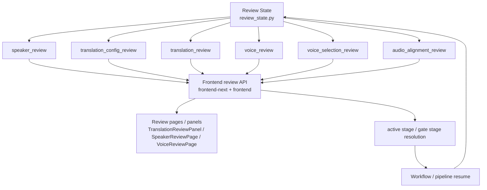

# GitNexus 审核流图

关联总图：`docs/graphs/GITNEXUS_PROJECT_GRAPH.md`

## 1. 范围

这张子图只看审核流，重点是：

- `ReviewStateManager` 与 stage 常量
- 前端审核页 / 审核面板
- review API
- pipeline 的 gate / resume 关系

## 2. 审核流主图

## 3. 当前 stage 集合

`src/services/review_state.py` 当前显式定义：

- `speaker_review`
- `translation_config_review`
- `translation_review`
- `voice_review`
- `voice_selection_review`
- `audio_alignment_review`

同一个文件还给出 UI route 对应：

- `speaker_review -> review`
- `translation_config_review -> translation-config`
- `translation_review -> translation`
- `voice_review -> voice-library`
- `voice_selection_review -> voice-selection`
- `audio_alignment_review -> audio-alignment`

这条映射说明 review 流已经不是单页单阶段，而是稳定的多阶段 gate 系统。

## 4. 前端入口

### 4.1 新前端 review API

- `frontend-next/src/lib/api/reviews.ts` 提供 `getTranslationReview(...)`。
- 同文件对 `speaker_review / translation_review / voice_review / voice_selection_review` 做 active stage 与 gate stage 判定。
- `frontend-next/src/components/workspace/TranslationReviewPanel.tsx` 调用 `getTranslationReview(jobId)` 并提交 `stage: 'translation_review'`。

### 4.2 兼容旧 review 页面

- `frontend/src/routes/review/SpeakerReviewPage.tsx` 调用 `getSpeakerReview(jobId)`。
- `frontend/src/routes/review/VoiceReviewPage.tsx` 调用 `getVoiceReview(jobId)`。

这说明审核流当前处于迁移阶段：新旧前端表面并存，但 review state 仍由统一 stage 常量驱动。

## 5. GitNexus 识别出的直接证据链

GitNexus process 当前能直接识别出以下审核链路：

- `TranslationConfigReviewPage -> BuildBackendUrl`
- `TranslationReviewPanel -> SerializeBody`
- `SpeakerReviewPage -> SerializeBody`
- `VoiceReviewPage -> SerializeBody`

这些 process 有两个价值：

- 说明审核页不是静态页面，而是明确连到 request/buildUrl/serializeBody
- 说明 review payload 的边界现在已经足够稳定，能被 GitNexus 提取成流程

## 6. 当前审核流边界

### 6.1 `voice_review` 与 `voice_selection_review` 并存

- `review_state.py` 注释明确说明：
  `voice_review` 是 legacy recovery/fallback stage
  `voice_selection_review` 是 Studio primary path

所以新功能设计应优先围绕 `voice_selection_review`，不要把 `voice_review` 误认为主路径。

### 6.2 review 是显式暂停恢复点

`frontend-next/src/lib/api/reviews.ts` 中的 active stage / gate stage 判断，配合 pipeline 的等待状态，说明 review 仍是显式 `waiting_for_review` 边界，而不是后台静默穿透。

## 7. 这张图适合回答什么问题

- 某个审核页对应的是哪个 stage
- 为什么 review 流会暂停，以及恢复点在哪里
- 新旧前端审核页是怎么同时挂在统一 review state 上的
- `voice_review` 和 `voice_selection_review` 到底谁是主路径
