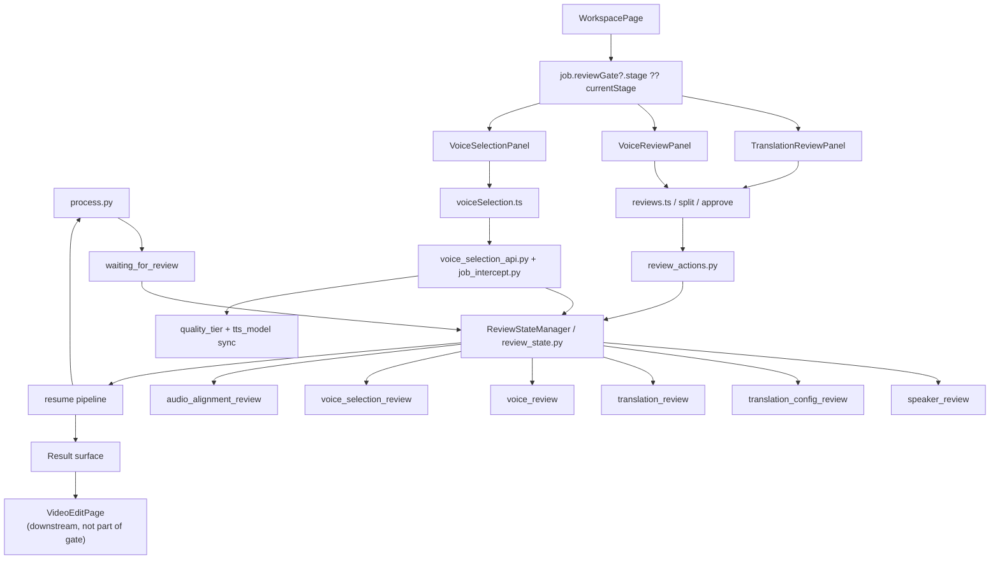

# GitNexus 审核流图

关联总图：`docs/graphs/GITNEXUS_PROJECT_GRAPH.md`

## 1. 范围

这张子图只看审核流，重点是：

- `review_state.py` 中的 stage 集合
- `WorkspacePage` 如何决定当前审核 UI
- `TranslationReviewPanel / VoiceReviewPanel / VoiceSelectionPanel`
- translation review 里的 speaker edits / split
- voice selection 里的 quality tier / clone pricing / resume

## 2. 审核流主图

## 3. 当前 stage 集合

`src/services/review_state.py` 当前显式定义：

- `speaker_review`
- `translation_config_review`
- `translation_review`
- `voice_review`
- `voice_selection_review`
- `audio_alignment_review`

并继续维护 tab 映射：

- `speaker_review -> review`
- `translation_config_review -> translation-config`
- `translation_review -> translation`
- `voice_review -> voice-library`
- `voice_selection_review -> voice-selection`
- `audio_alignment_review -> audio-alignment`

## 4. 当前前端入口仍然统一到 WorkspacePage

`frontend-next/src/app/(app)/workspace/[jobId]/page.tsx` 当前仍是审核流主入口：

- 导入 `TranslationReviewPanel`
- 导入 `VoiceReviewPanel`
- 导入 `VoiceSelectionPanel`
- 从 `job.reviewGate?.stage ?? job.currentStage` 推导当前审核阶段

同一个页面里还做了两件重要的控制逻辑：

- `translation_config_review` 在没有独立 UI 的情况下自动 approve
- `voice_selection_review` 仍通过 `VoiceSelectionPanel` 作为 Studio 主路径承接

这意味着审核流的用户交互表面仍然是“Workspace 内分流”，而不是旧时代的多 route review app。

## 5. Translation review 现在可以直接改说话人归属

### 5.1 前端

- `frontend-next/src/components/workspace/TranslationReviewPanel.tsx` 现在显式维护：
  `segmentSpeakers`
  `speakerNames`
  `segments`
- 提交 approve 时会把这三类变更一起发给后端
- split 动作也会带上 `pendingSpeakerChanges`

### 5.2 后端

- `src/services/jobs/review_actions.py:approve_translation(...)` 会先调用：
  `_apply_speaker_names_update_from_translation_review(...)`
  `_apply_segment_speakers_update_from_translation_review(...)`
- 然后才保存 translation review submission
- `split_segment(...)` 同样会先落下 pending speaker changes，再执行真正的切段

结论：translation review 已经不只是“改译文文本”，而是带说话人归属修正的写侧表面。

## 6. Voice selection 仍是主审核路径，而且会影响 quality tier

### 6.1 前端

- `frontend-next/src/components/workspace/VoiceSelectionPanel.tsx` 会从 review state 中提取 `voice_selection_review` payload
- 它现在会读取：
  smart recommendations
  `voice_clone_cost_credits`
  quality tier + credits 提示
- 这些显示都来自 Gateway pricing/runtime truth

### 6.2 后端

- `src/services/jobs/review_actions.py:resolve_minimax_tts_model_from_voice_selection(...)` 会从 per-speaker 选择推导 job 级 MiniMax model
- `gateway/job_intercept.py` 在 `review/voice-selection/approve` 拦截路径上，会把聚合后的 `quality_tier + tts_model` 写回 `Job.metering_snapshot`
- `gateway/voice_selection_api.py` clone 路径则继续用 runtime clone cost 做 reserve / capture / release

结论：`voice_selection_review` 不只是 UI 上的最后一步，它还直接影响后续扣点档位与 TTS 模型。

## 7. GitNexus 与源码直接证据

GitNexus 当前直接识别出：

- `WorkspacePage -> BuildBackendUrl`
- `WorkspacePage -> ResolveJobApiBaseUrl`

源码侧补足了具体落点：

- `TranslationReviewPanel` 提交 payload 已经包含 `segmentSpeakers`
- `VoiceSelectionPanel` 已明确显示 quality tier / clone credits
- `review_state.py` 注释仍明确说明：
  `voice_review` 是 legacy fallback
  `voice_selection_review` 是 Studio primary path

## 8. Review 与 Post-Edit 的边界

`frontend-next/src/app/(app)/workspace/[jobId]/edit/page.tsx` 现在会读取 `voice_selection_review` payload 里的 speaker display names，但它不是 review gate 本身：

- review 的本质仍是 `waiting_for_review -> panel submit -> resume`
- post-edit 的本质是 `succeeded -> editing -> mutate -> commit`

因此，`VideoEditPage` 应被视为 review 成功后的下游表面，而不是另一个 review stage。

## 9. 这张图适合回答什么问题

- 当前审核 UI 到底是哪个页面在承接
- translation review 现在能不能改 speaker 名称和 segment speaker
- `voice_review` 和 `voice_selection_review` 的主次关系是什么
- quality tier / clone credits 为什么会在审核阶段就确定
- pipeline 是怎样进入 `waiting_for_review`，又怎样恢复
