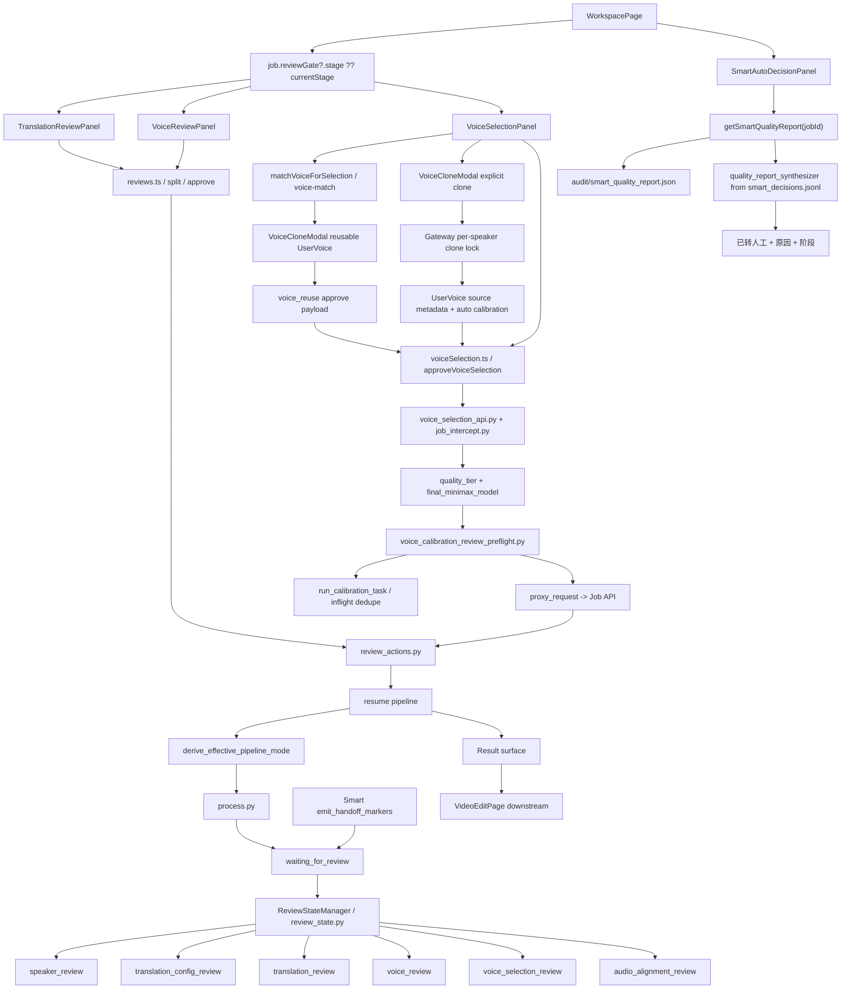

# GitNexus 审核流图

关联总图：`docs/graphs/GITNEXUS_PROJECT_GRAPH.md`

## 1. 范围

这张子图只看审核流，重点是：

- `review_state.py` 中的 stage 集合
- `WorkspacePage` 如何决定当前审核 UI
- `TranslationReviewPanel / VoiceReviewPanel / VoiceSelectionPanel`
- Smart handoff 后如何重新进入 Studio review
- Smart 完成或 handoff 后如何显示用户可见决策摘要
- voice selection approve 前的同源音色复用、克隆锁与 calibration preflight

## 2. 主图

## 3. 当前 stage 集合

`src/services/review_state.py` 当前显式定义：

- `speaker_review`
- `translation_config_review`
- `translation_review`
- `voice_review`
- `voice_selection_review`
- `audio_alignment_review`

tab 映射仍然是：

- `speaker_review -> review`
- `translation_config_review -> translation-config`
- `translation_review -> translation`
- `voice_review -> voice-library`
- `voice_selection_review -> voice-selection`
- `audio_alignment_review -> audio-alignment`

## 4. WorkspacePage 是统一审核与解释入口

`frontend-next/src/app/(app)/workspace/[jobId]/page.tsx` 仍然是审核流的主入口：

- 导入 `TranslationReviewPanel`
- 导入 `VoiceReviewPanel`
- 导入 `VoiceSelectionPanel`
- 导入并挂载 `SmartAutoDecisionPanel`
- 通过 `job.reviewGate?.stage ?? job.currentStage` 选择当前审核面

结论：人工审核流和 Smart 决策解释都收敛在 Workspace，而不是拆成第二套页面。

## 5. Smart handoff 使用原有 Studio review gate

- `src/services/smart/handoff.py` 调用 `review_state_manager.set_stage(... activate=True)`。
- 同一 helper 还发 `[WEB_REVIEW]` marker，让 `process_runner.py` 写入 `JOB_STATUS_WAITING_FOR_REVIEW`。
- `/continue` 后 `derive_effective_pipeline_mode(...)` 会在 `downgraded_to_studio` 状态下返回 `studio`。

结论：Smart 降级没有创造第二套 review UI，而是重新进入既有 Studio review gate。

## 6. Smart 决策摘要是 review 之后的用户解释面

- `SmartAutoDecisionPanel` 只在 Smart job 场景挂载。
- `getSmartQualityReport(jobId)` 对非 Smart job 返回隐藏语义。
- `quality_report_not_written` 只代表真正 in-flight；handoff job 会由 `quality_report_synthesizer.py` 合成可显示报告。
- 面板显示 status、credits policy label、speaker summary、voice decisions、translation review、retry summary、handoff history。
- 面板不显示成本字段，成本只进 admin route。

结论：Smart 用户能看到自动决策结果与转人工原因，但不会看到内部 provider 成本。

## 7. Translation review 仍然是 speaker 写侧入口

- `TranslationReviewPanel` 继续维护 `segmentSpeakers`、`speakerNames`、`segments`。
- approve payload 会把文本修改、speaker 归属、speaker 名称一并提交。
- `review_actions.py:approve_translation(...)` 会先应用 speaker names 与 segment speaker 变更，再保存 translation review submission。

结论：translation review 仍然是 speaker 纠偏的关键写侧。

## 8. Voice selection 先做复用 / 克隆前置确认

在进入 calibration preflight 前，voice selection 现在还有一层“复用优先、显式克隆”的前置协作：

- `VoiceCloneModal` 打开时调用 `matchVoiceForSelection(jobId, speakerId)`，按同用户、同源内容、同 speaker 查可复用 UserVoice。
- 命中强匹配时 UI 显示“发现可复用音色”，用户可以选择“复用此音色”；该路径提交 `voice_reuse`，不消耗 clone 点。
- 用户仍可显式触发 clone；Gateway 用 `review_state` 中的 per-speaker `cloning.started_at` 做短期 clone lock，重复点击返回 `clone_in_progress`。
- clone 成功后写入 UserVoice source metadata，并通过 calibration hook 触发速度校准。

结论：voice selection 现在把“复用已有个人音色”和“新克隆”放在同一个人工确认入口里，避免重复克隆。

## 9. Voice selection approve 会先做 T2 calibration preflight

`gateway/voice_calibration_review_preflight.py` 的当前约束：

- 只看 job-level final MiniMax model
- 优先查 `user_voices(owner_id, voice_id)`，失败时回退 `voice_catalog`
- 仅在缺失 `chars_per_second_by_model[final_minimax_model]` 时补齐
- MiniMax 之外的 provider 在 phase 1 跳过
- 总预算 50 秒，超时任务不取消
- 失败永不阻断真正的 review approve

结论：voice selection approve 带有真实运行时准备语义，但不是阻塞式长任务。

## 10. 关键证据

- `src/services/smart/handoff.py`
  - review_state + smart_state + web_review marker triple
- `src/services/smart/state.py`
  - effective mode
- `src/services/smart/quality_report_synthesizer.py`
  - handoff quality report synthesis
- `frontend-next/src/components/workspace/SmartAutoDecisionPanel.tsx`
  - Smart 决策摘要 UI
- `frontend-next/src/components/workspace/VoiceSelectionPanel.tsx`
  - `matchVoiceForSelection(jobId, speakerId)`
  - `VoiceCloneModal` reuse / clone UI
  - `approveVoiceSelection(jobId, approvals)`
- `frontend-next/src/lib/api/voiceSelection.ts`
  - `voiceReuse`
  - `VoiceReuseMatchResponse`
- `gateway/voice_calibration_review_preflight.py`
  - review-submit calibration preflight
- `gateway/voice_selection_api.py`
  - `/job-api/jobs/{job_id}/voice-match`
  - per-speaker clone lock
  - source metadata on clone
- `src/services/jobs/review_actions.py`
  - review submit 与 resume
- `src/services/jobs/api.py`
  - `/jobs/{id}/smart-quality-report`

## 11. 这张图适合回答什么问题

- 当前审核 UI 到底由哪个页面承接
- Smart 降级后为什么进入 Studio 审核
- Smart 决策摘要从哪里读取，为什么 handoff 也能显示
- translation review 能否改 speaker 名称和 segment speaker
- voice selection 为什么提示可复用音色、为什么 clone 按钮被锁住
- review submit 前为什么会先跑 voice calibration
- pipeline 怎样进入 `waiting_for_review`，又怎样恢复
