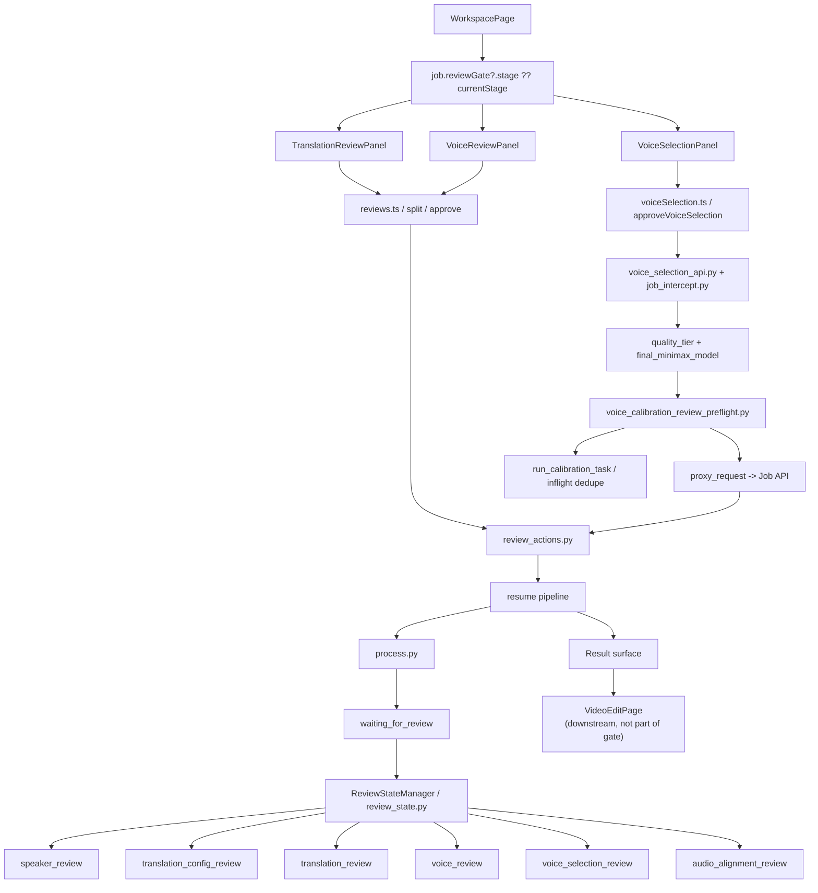

# GitNexus 审核流图

关联总图：`docs/graphs/GITNEXUS_PROJECT_GRAPH.md`

## 1. 范围

这张子图只看审核流，重点是：

- `review_state.py` 中的 stage 集合
- `WorkspacePage` 如何决定当前审核 UI
- `TranslationReviewPanel / VoiceReviewPanel / VoiceSelectionPanel`
- translation review 里的 speaker edits / split
- voice selection approve 前的 calibration preflight

## 2. 主图

## 3. 当前 stage 集合

`src/services/review_state.py` 当前显式定义：

- `speaker_review`
- `translation_config_review`
- `translation_review`
- `voice_review`
- `voice_selection_review`
- `audio_alignment_review`

tab 映射仍然是：

- `speaker_review -> review`
- `translation_config_review -> translation-config`
- `translation_review -> translation`
- `voice_review -> voice-library`
- `voice_selection_review -> voice-selection`
- `audio_alignment_review -> audio-alignment`

## 4. WorkspacePage 仍然是统一审核入口

`frontend-next/src/app/(app)/workspace/[jobId]/page.tsx` 仍然是审核流的主入口：

- 导入 `TranslationReviewPanel`
- 导入 `VoiceReviewPanel`
- 导入 `VoiceSelectionPanel`
- 通过 `job.reviewGate?.stage ?? job.currentStage` 选择当前审核面

同一页里仍保留两条重要控制逻辑：

- `translation_config_review` 在没有独立交互面的情况下自动 approve
- `voice_selection_review` 继续由 `VoiceSelectionPanel` 承接 Studio 主路径

结论：审核流仍然是 `WorkspacePage` 内部分流，而不是独立 review app。

## 5. Translation review 仍然是 speaker 写侧入口

### 5.1 前端

- `frontend-next/src/components/workspace/TranslationReviewPanel.tsx` 继续维护 `segmentSpeakers`、`speakerNames`、`segments`
- approve payload 会把文本修改、speaker 归属、speaker 名称一并提交
- split 动作也会携带 pending speaker changes

### 5.2 后端

- `src/services/jobs/review_actions.py:approve_translation(...)` 会先应用 speaker names 与 segment speaker 变更
- `split_segment(...)` 同样先落地 pending speaker changes，再执行真实切段

结论：translation review 不是单纯改译文，而是当前最主要的 speaker 纠偏写侧。

## 6. Voice selection approve 现在会先做 T2 calibration preflight

### 6.1 触发位置

- `frontend-next/src/components/workspace/VoiceSelectionPanel.tsx` 在 approve 时调用 `approveVoiceSelection(jobId, approvals)`
- 网关侧拦截点仍在 `gateway/job_intercept.py` 的 `review/voice-selection/approve`

### 6.2 preflight 语义

`gateway/voice_calibration_review_preflight.py` 明确约束了这轮预热校准：

- 只看 job-level final MiniMax model，而不是 per-speaker `model_hint`
- 优先探测 `user_voices(owner_id, voice_id)`，失败时才回退 `voice_catalog`
- 仅在缺失 `chars_per_second_by_model[final_minimax_model]` 时补齐
- MiniMax 之外的 provider 在 phase 1 直接跳过
- 每次预热的总预算是 50 秒，超时任务不取消，主请求继续代理
- 失败永不抛出，不阻断真正的 review approve

### 6.3 与 clone-after calibration 的边界

- review preflight 是 T2，目标是“提交前最后补齐缺口”
- `gateway/voice_calibration_hook.py` 是 T1，目标是“clone 成功后尽快打底”
- 手动 `/calibrate-speed` 是 T0，目标是“管理员或用户显式修正”

结论：voice selection approve 现在已经带有真实的运行时准备语义，而不是纯 UI 通过按钮。

## 7. 这张图的直接证据

- `frontend-next/src/components/workspace/VoiceSelectionPanel.tsx`
  - `approveVoiceSelection(jobId, approvals)`
  - UI 已消费 calibration 相关显示信息
- `gateway/voice_calibration_review_preflight.py`
  - job-level final model
  - user voice 优先查找
  - 50 秒硬预算
  - never raise
- `gateway/voice_selection_api.py`
  - clone 流程仍然是审核链路的写侧之一
- `src/services/jobs/review_actions.py`
  - 审核提交与 resume 仍由 Job API 侧落地

## 8. Review 与 Post-Edit 的边界

`frontend-next/src/app/(app)/workspace/[jobId]/edit/page.tsx` 会读取审核阶段留下来的 speaker display name 和 voice 结果，但它不是新的 review stage：

- review 的本质仍是 `waiting_for_review -> panel submit -> resume`
- post-edit 的本质仍是 `succeeded -> editing -> mutate -> commit`

因此 `VideoEditPage` 仍应视为审核成功后的下游平面。

## 9. 这张图适合回答什么问题

- 当前审核 UI 到底由哪个页面承接
- translation review 能否改 speaker 名称和 segment speaker
- `voice_review` 与 `voice_selection_review` 的主次关系是什么
- review submit 前为什么会先跑 voice calibration
- pipeline 怎样进入 `waiting_for_review`，又怎样恢复
