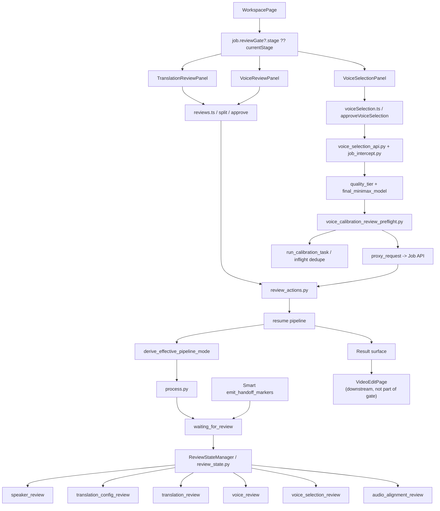

# GitNexus 审核流图

关联总图：`docs/graphs/GITNEXUS_PROJECT_GRAPH.md`

## 1. 范围

这张子图只看审核流，重点是：

- `review_state.py` 中的 stage 集合
- `WorkspacePage` 如何决定当前审核 UI
- `TranslationReviewPanel / VoiceReviewPanel / VoiceSelectionPanel`
- translation review 里的 speaker edits / split
- voice selection approve 前的 calibration preflight
- Smart handoff 后如何重新进入 Studio review

## 2. 主图

## 3. 当前 stage 集合

`src/services/review_state.py` 当前显式定义：

- `speaker_review`
- `translation_config_review`
- `translation_review`
- `voice_review`
- `voice_selection_review`
- `audio_alignment_review`

tab 映射仍然是：

- `speaker_review -> review`
- `translation_config_review -> translation-config`
- `translation_review -> translation`
- `voice_review -> voice-library`
- `voice_selection_review -> voice-selection`
- `audio_alignment_review -> audio-alignment`

## 4. WorkspacePage 仍然是统一审核入口

`frontend-next/src/app/(app)/workspace/[jobId]/page.tsx` 仍然是审核流的主入口：

- 导入 `TranslationReviewPanel`
- 导入 `VoiceReviewPanel`
- 导入 `VoiceSelectionPanel`
- 通过 `job.reviewGate?.stage ?? job.currentStage` 选择当前审核面

结论：审核流仍然是 `WorkspacePage` 内部分流。

## 5. Smart handoff 使用原有 Studio review gate

- `src/services/smart/handoff.py` 调用 `review_state_manager.set_stage(... activate=True)`。
- 同一 helper 还发 `[WEB_REVIEW]` marker，让 `process_runner.py` 写入 `JOB_STATUS_WAITING_FOR_REVIEW`。
- `/continue` 后 `derive_effective_pipeline_mode(...)` 会在 `downgraded_to_studio` 状态下返回 `studio`。

结论：Smart 降级没有创造第二套 review UI，而是重新进入既有 Studio review gate。

## 6. Translation review 仍然是 speaker 写侧入口

- `TranslationReviewPanel` 继续维护 `segmentSpeakers`、`speakerNames`、`segments`。
- approve payload 会把文本修改、speaker 归属、speaker 名称一并提交。
- `review_actions.py:approve_translation(...)` 会先应用 speaker names 与 segment speaker 变更，再保存 translation review submission。

结论：translation review 仍然是 speaker 纠偏的关键写侧。

## 7. Voice selection approve 会先做 T2 calibration preflight

`gateway/voice_calibration_review_preflight.py` 的当前约束：

- 只看 job-level final MiniMax model
- 优先查 `user_voices(owner_id, voice_id)`，失败时回退 `voice_catalog`
- 仅在缺失 `chars_per_second_by_model[final_minimax_model]` 时补齐
- MiniMax 之外的 provider 在 phase 1 跳过
- 总预算 50 秒，超时任务不取消
- 失败永不阻断真正的 review approve

结论：voice selection approve 带有真实运行时准备语义，但不是阻塞式长任务。

## 8. 关键证据

- `src/services/smart/handoff.py`
  - review_state + smart_state + web_review marker triple
- `src/services/smart/state.py`
  - effective mode
- `frontend-next/src/components/workspace/VoiceSelectionPanel.tsx`
  - `approveVoiceSelection(jobId, approvals)`
- `gateway/voice_calibration_review_preflight.py`
  - review-submit calibration preflight
- `src/services/jobs/review_actions.py`
  - review submit 与 resume

## 9. 这张图适合回答什么问题

- 当前审核 UI 到底由哪个页面承接
- Smart 降级后为什么进入 Studio 审核
- translation review 能否改 speaker 名称和 segment speaker
- review submit 前为什么会先跑 voice calibration
- pipeline 怎样进入 `waiting_for_review`，又怎样恢复
