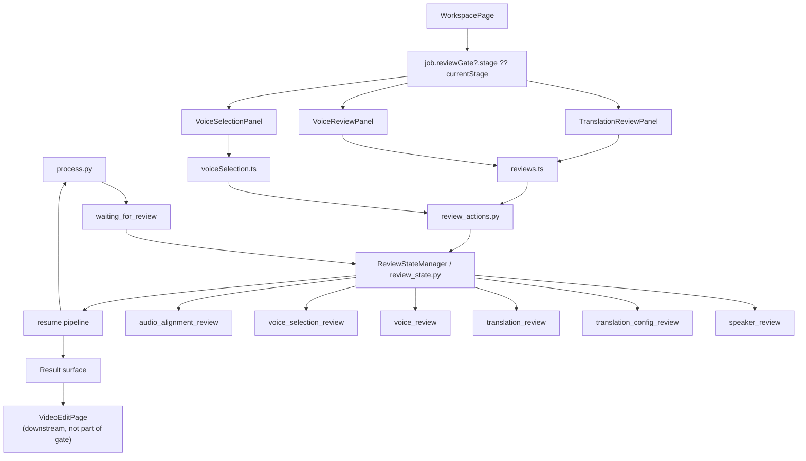

# GitNexus 审核流图

关联总图：`docs/graphs/GITNEXUS_PROJECT_GRAPH.md`

## 1. 范围

这张子图只看审核流，重点是：

- `review_state.py` 中的 stage 集合
- `WorkspacePage` 如何决定当前审核 UI
- `TranslationReviewPanel / VoiceReviewPanel / VoiceSelectionPanel`
- review gate 与 pipeline pause / resume
- review 完成后如何与 post-edit 表面衔接

## 2. 审核流主图

## 3. 当前 stage 集合

`src/services/review_state.py` 当前显式定义：

- `speaker_review`
- `translation_config_review`
- `translation_review`
- `voice_review`
- `voice_selection_review`
- `audio_alignment_review`

并继续维护 tab 映射：

- `speaker_review -> review`
- `translation_config_review -> translation-config`
- `translation_review -> translation`
- `voice_review -> voice-library`
- `voice_selection_review -> voice-selection`
- `audio_alignment_review -> audio-alignment`

## 4. 当前前端入口仍然统一到 WorkspacePage

`frontend-next/src/app/(app)/workspace/[jobId]/page.tsx` 当前是审核流主入口：

- 导入 `TranslationReviewPanel`
- 导入 `VoiceReviewPanel`
- 导入 `VoiceSelectionPanel`
- 从 `job.reviewGate?.stage ?? job.currentStage` 推导当前审核阶段

同一个页面里还做了两件重要的控制逻辑：

- `translation_config_review` 在没有独立 UI 的情况下自动 approve
- `voice_selection_review` 仍通过 `VoiceSelectionPanel` 作为 Studio 主路径承接

这意味着审核流的用户交互表面仍然是“Workspace 内分流”，而不是旧时代的多 route review app。

## 5. Voice selection 仍是主审核路径

### 5.1 前端

- `frontend-next/src/components/workspace/VoiceSelectionPanel.tsx` 会从 review state 中提取 `voice_selection_review` payload
- 提交时调用 `approveVoiceSelection(jobId, approvals)`
- `frontend-next/src/lib/api/voiceSelection.ts` 对应的提交端点是：
  `/jobs/{jobId}/review/voice-selection/approve`

### 5.2 后端

- `src/services/jobs/review_actions.py:approve_voice_selection(...)` 负责把 per-speaker 绑定写回 approved payload
- `src/pipeline/process.py` 在多处显式构建与刷新 `voice_selection_review` payload，并在需要时把任务置为 `waiting_for_review`

结论：`voice_selection_review` 仍是 Studio 主路径，不是一个已经废弃但尚未删除的残留 stage。

## 6. GitNexus 与源码直接证据

GitNexus 当前直接识别出：

- `WorkspacePage -> BuildBackendUrl`
- `WorkspacePage -> ResolveJobApiBaseUrl`
- `Approve_voice_selection -> StateError`

源码侧则补足了具体落点：

- `WorkspacePage` 在 `effectiveReviewStage === 'voice_selection_review'` 时渲染 `VoiceSelectionPanel`
- `review_state.py` 注释明确说明：
  `voice_review` 是 legacy fallback
  `voice_selection_review` 是 Studio primary path

## 7. Review 与 Post-Edit 的边界

`frontend-next/src/app/(app)/workspace/[jobId]/edit/page.tsx` 现在会读取 `voice_selection_review` payload 里的 speaker display names，但它不是 review gate 本身：

- review 的本质仍是 `waiting_for_review -> panel submit -> resume`
- post-edit 的本质是 `succeeded -> editing -> mutate -> commit`

因此，`VideoEditPage` 应被视为 review 成功后的下游表面，而不是另一个 review stage。

## 8. 这张图适合回答什么问题

- 当前审核 UI 到底是哪个页面在承接
- `voice_review` 和 `voice_selection_review` 的主次关系是什么
- pipeline 是怎样进入 `waiting_for_review`，又怎样恢复
- 为什么 edit 页会读取 review payload，但不应把 edit 页画成 review gate 本身
