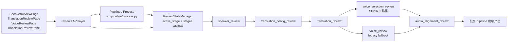

# GitNexus 审核流图

关联总图：`docs/graphs/GITNEXUS_PROJECT_GRAPH.md`

## 1. 范围

这张子图只看人工审核相关链路，重点是：

1. 审核阶段在状态层里如何定义。
2. 前端审核页如何经 API 读取/提交。
3. Pipeline 如何在各个 gate 前后挂起与恢复。

## 2. GitNexus 聚类焦点

| 聚类 | 符号数 | 代表成员 |
| --- | ---: | --- |
| Review | 19 | `SpeakerReviewPage.tsx`、`TranslationReviewPage.tsx`、`TranslationReviewPanel.tsx` |
| Web_ui | 103 | `src/services/review_state.py`、`src/services/manifest_reader.py` |
| Api | 156 | `frontend-next/src/lib/api/reviews.ts`、`frontend/src/lib/api/reviews.ts` |

## 3. 审核流图

## 4. 审核阶段真相

`src/services/review_state.py` 直接定义了审核阶段常量：

1. `speaker_review`
2. `translation_config_review`
3. `translation_review`
4. `voice_review`
5. `voice_selection_review`
6. `audio_alignment_review`

其中注释已经明确说明：

1. `voice_review` 是历史恢复/短样本绑定场景的 legacy fallback。
2. `voice_selection_review` 才是当前 Studio 主路径，承担多说话人选音、试听、可选 clone、以及按说话人选择 TTS provider。

## 5. Pipeline 挂 gate 的证据

在 `src/pipeline/process.py` 中，GitNexus 和源码搜索都能看到这些方法和 gate：

1. `_build_speaker_review_payload`
2. `_apply_speaker_review_payload`
3. `_build_translation_config_review_payload`
4. `_build_translation_review_payload`
5. `_build_voice_selection_review_payload`
6. `VOICE_SELECTION_REVIEW_STAGE`

同时，代码里明确存在：

1. `translation_config_review gate`
2. `translation_review gate`
3. `voice_selection_review gate (Studio mode only)`

这说明审核流不是前端附属功能，而是 pipeline 主链上的显式暂停点。

## 6. GitNexus 页面读取链

### 6.1 说话人审核页

GitNexus process：`SpeakerReviewPage → SerializeBody`

1. `frontend/src/routes/review/SpeakerReviewPage.tsx`
2. `load`
3. `frontend/src/lib/api/reviews.ts:getSpeakerReview`
4. `frontend-next/src/lib/api/client.ts:get`
5. `frontend-next/src/lib/api/client.ts:request`
6. `frontend-next/src/lib/api/client.ts:serializeBody`

### 6.2 翻译审核面板

GitNexus process：`TranslationReviewPanel → SerializeBody`

1. `frontend-next/src/components/workspace/TranslationReviewPanel.tsx`
2. `load`
3. `frontend-next/src/lib/api/reviews.ts:getTranslationReview`
4. `frontend-next/src/lib/api/client.ts:get`
5. `frontend-next/src/lib/api/client.ts:request`
6. `frontend-next/src/lib/api/client.ts:serializeBody`

### 6.3 音色审核页

GitNexus process：`VoiceReviewPage → SerializeBody`

1. `frontend/src/routes/review/VoiceReviewPage.tsx`
2. `load`
3. `frontend/src/lib/api/reviews.ts:getVoiceReview`
4. `frontend-next/src/lib/api/client.ts:get`
5. `frontend-next/src/lib/api/client.ts:request`
6. `frontend-next/src/lib/api/client.ts:serializeBody`

## 7. 审核流的当前结构判断

从图谱和源码一起看，当前审核流有三个层次：

1. 状态层：`ReviewStateManager` 负责持久化 `active_stage` 和每个 stage 的 payload/status。
2. UI 层：老前端 `frontend/src/routes/review/*` 与新工作台 `frontend-next/src/components/workspace/*` 并存。
3. 流程层：`src/pipeline/process.py` 在关键节点构建 payload、挂起等待审核、审批后恢复。

这也是为什么审核图需要单独拆出来：它不是单一页面，而是一套“状态机 + 前端页 + pipeline gate”的组合。
