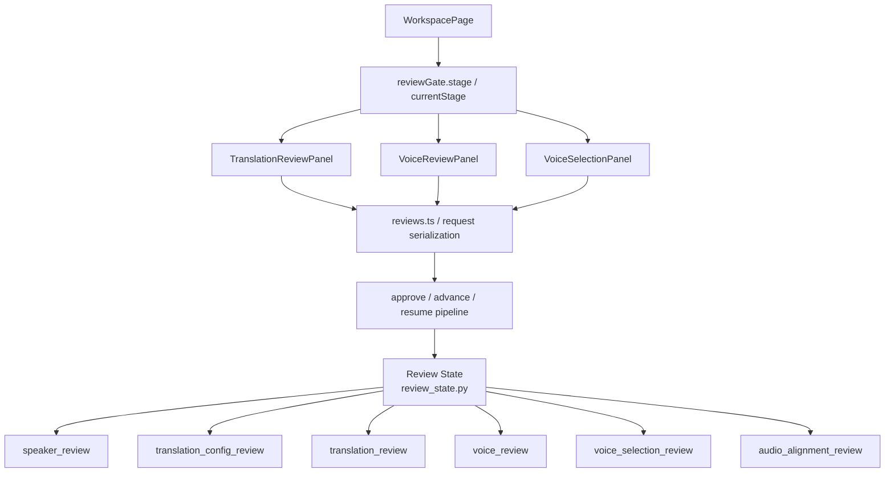

# GitNexus 审核流图

关联总图：`docs/graphs/GITNEXUS_PROJECT_GRAPH.md`

## 1. 范围

这张子图只看审核流，重点是：

- `review_state.py` 中的 stage 集合
- `WorkspacePage` 如何决定当前审核 UI
- `TranslationReviewPanel / VoiceReviewPanel / VoiceSelectionPanel`
- review gate 与 pipeline resume

## 2. 审核流主图

## 3. 当前 stage 集合

`src/services/review_state.py` 当前显式定义：

- `speaker_review`
- `translation_config_review`
- `translation_review`
- `voice_review`
- `voice_selection_review`
- `audio_alignment_review`

并继续维护 route/tab 映射：

- `speaker_review -> review`
- `translation_config_review -> translation-config`
- `translation_review -> translation`
- `voice_review -> voice-library`
- `voice_selection_review -> voice-selection`
- `audio_alignment_review -> audio-alignment`

## 4. 当前前端入口已经统一到 WorkspacePage

`frontend-next/src/app/(app)/workspace/[jobId]/page.tsx` 当前是审核流主入口：

- 导入 `TranslationReviewPanel`
- 导入 `VoiceReviewPanel`
- 导入 `VoiceSelectionPanel`
- 从 `job.reviewGate?.stage ?? job.currentStage` 推导当前审核阶段

同一个页面里还做了两件重要的控制逻辑：

- `translation_config_review` 在没有独立 UI 的情况下自动 approve
- `speaker_review / translation_config_review` 作为自动处理阶段，不再对应旧 Vite 前端那种独立 review 页面

这意味着审核流的用户交互表面已经是“Workspace 内分流”，而不是旧时代的多 route review app。

## 5. GitNexus 直接证据

GitNexus 当前直接识别出：

- `WorkspacePage -> BuildBackendUrl`
- `WorkspacePage -> ResolveJobApiBaseUrl`
- `TranslationReviewPanel -> SerializeBody`
- `TranslationReviewPanel -> ParsePayload`
- `TranslationReviewPanel -> ApiError`

这几条 process 说明：

- Workspace 是当前 review surface 的实际入口
- Translation review 的请求构造、payload 解析和错误边界都已稳定成独立链路

## 6. 新旧路径变化

从 `git diff --name-status 490cce8..HEAD` 可以直接看到：

- `frontend/src/routes/review/SpeakerReviewPage.tsx` 已删除
- `frontend/src/routes/review/TranslationReviewPage.tsx` 已删除
- `frontend/src/routes/review/VoiceReviewPage.tsx` 已删除
- 整个 `frontend/` Vite 前端已退出主路径

因此，旧图里“`frontend-next + frontend` 并列承载 review UI”的说法已经过期。

## 7. 当前审核流边界

### 7.1 `voice_review` 与 `voice_selection_review` 仍并存

`review_state.py` 注释仍然表明：

- `voice_review` 是 legacy recovery/fallback stage
- `voice_selection_review` 是 Studio primary path

所以设计与排障时，应该优先把 `voice_selection_review` 当主路径。

### 7.2 review 仍然是显式 gate / resume

虽然 UI 入口统一到 WorkspacePage，但 review 的本质没有变化：

- 任务进入 `waiting_for_review`
- 页面根据 `reviewGate.stage` 渲染对应 panel
- panel 提交后再推动 pipeline 恢复

这不是隐式自动穿透，而是显式 gate/resume 机制。

## 8. 这张图适合回答什么问题

- 当前审核 UI 到底是哪个页面在承接
- 为什么旧 review route 已删但 review stage 仍然存在
- `voice_review` 和 `voice_selection_review` 的主次关系是什么
- 哪些阶段还有用户交互，哪些已经自动化了
