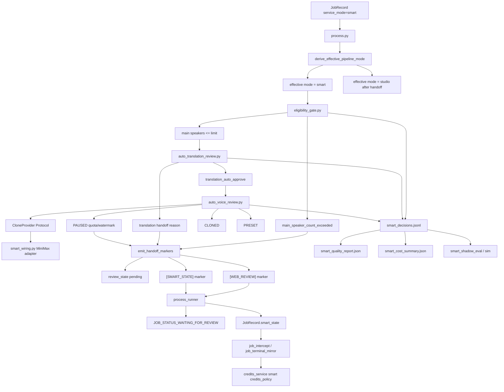

# GitNexus Smart 自动审核图

关联总图：`docs/graphs/GITNEXUS_PROJECT_GRAPH.md`

## 1. 范围

这张子图只看 Smart MVP P2 的自动审核与降级链路，重点是：

- speaker eligibility gate
- translation auto review
- voice clone / preset / pause orchestration
- provider Protocol 与真实 provider wiring 边界
- handoff 到 Studio human review
- `[SMART_STATE]` marker、sidecar audit、credits policy

## 2. 主图

## 3. 当前核心认知

### 3.1 Smart 决策层是 deterministic-first

- `eligibility_gate.py` 只做 speaker structure 归一化和主说话人计数。
- `auto_translation_review.py` 固化 6 项检查：术语保留、speaker assignment、一致性、长度预算、text/audio checksum、不确定 speaker 占比、clone eligible ratio。
- `auto_voice_review.py` 负责 per-speaker clone / preset / pause，不做 UI 写入，不直接写 review state。

结论：Smart MVP 当前不是“让 LLM 自动审核”，而是 deterministic policy 执行层。

### 3.2 provider 边界由 Protocol + composition root 约束

- `src/services/smart/contracts.py` 定义 `CloneProvider / TTSProvider / LLMProvider`。
- `src/services/smart/auto_voice_review.py` 只依赖 `CloneProvider`。
- `src/services/smart_wiring.py` 是真实 MiniMax clone adapter 的唯一 wiring 点。
- `tests/test_smart_skeleton_protocol_guards.py` 保护 `src/services/smart/**` 不直接导入真实 provider。

结论：Smart 自动 clone 可以接真实 provider，但真实 provider 入口被集中在 package 外的 composition root。

### 3.3 handoff 必须同时发三个信号

`src/services/smart/handoff.py` 把降级到 Studio 的动作打包成三件事：

- `review_state_manager.set_stage(..., status=PENDING, activate=True)`
- `emit_smart_state_marker(...)`
- `print(web_review_marker_builder(...))`

结论：缺少 `[WEB_REVIEW]` 会让 runner 把任务错误地 finalise 为 `succeeded`，所以 handoff helper 是必要边界。

### 3.4 smart_state 是跨进程状态通道

- pipeline 只能通过 stdout 发 `[SMART_STATE] {...}`。
- `process_runner.py` 先解析 Smart marker，再解析 web review marker。
- `JobRecord.smart_state` 会进入 Job API JSON store。
- Gateway 通过 `job_intercept.py` 和 `job_terminal_mirror.py` 镜像到 PG。

结论：`smart_state` 是 pipeline / runner / Gateway / settlement 之间的正式桥，不是只给前端展示的备注字段。

### 3.5 effective mode 防止 handoff 后重复进 Smart

- `derive_effective_pipeline_mode(record)` 保留 `record.service_mode="smart"` 作为审计事实。
- 当 `smart_state.status` 是 `downgraded_to_studio` 或 `fail_and_refunded` 时，pipeline 内部 effective mode 返回 `studio`。
- `is_editable_smart_state(...)` 只允许 `completed` 或 `downgraded_to_studio` 进入 editing / Jianying draft。

结论：Smart job 降级后继续保持 Smart 计费/审计身份，但控制流回到 Studio。

### 3.6 Smart credits policy 优先于 legacy terminal settlement

- `gateway/credits_service.py::settle_job_credit_ledger(...)` 在 succeeded/failed legacy branch 前先读取 `smart_state.credits_policy`。
- 当前 policy 分支包括：
  - `refund_full`
  - `capture_full`
  - `capture_actual_cost_capped_at_studio_price`
- clone refund 与 partial capture 仍是 stub，日志明确警告不能在真实依赖这些分支的生产路径里静默使用。

结论：Smart 结算策略已经有调度边界，但部分真实结算能力仍处于骨架阶段。

## 4. 关键证据

- `src/services/smart/eligibility_gate.py`
  - `normalize_speaker_stats(...)`
  - `evaluate_eligibility(...)`
- `src/services/smart/auto_translation_review.py`
  - deterministic 6-check verdict
- `src/services/smart/auto_voice_review.py`
  - `VoiceReviewChoice`
  - `VoiceReviewOutcome`
  - `evaluate_voice_review(...)`
- `src/services/smart/handoff.py`
  - review_state + smart_state + web_review marker triple
- `src/services/smart/state.py`
  - marker parse/emit
  - effective mode
  - editable Smart state
- `src/services/smart/sidecar_emitter.py`
  - `smart_decisions.jsonl`
  - `smart_quality_report.json`
  - `smart_cost_summary.json`
- `gateway/credits_service.py`
  - Smart credits policy dispatcher

## 5. 什么时候优先看这张图

- 想改 Smart 自动审核是否能直接通过
- 想改 Smart 降级到 Studio 的状态机
- 想接真实 clone / TTS / LLM provider 到 Smart
- 想排查 Smart job 为什么不能进入 editing
- 想改 Smart 失败退款、部分扣费、sidecar 审计
