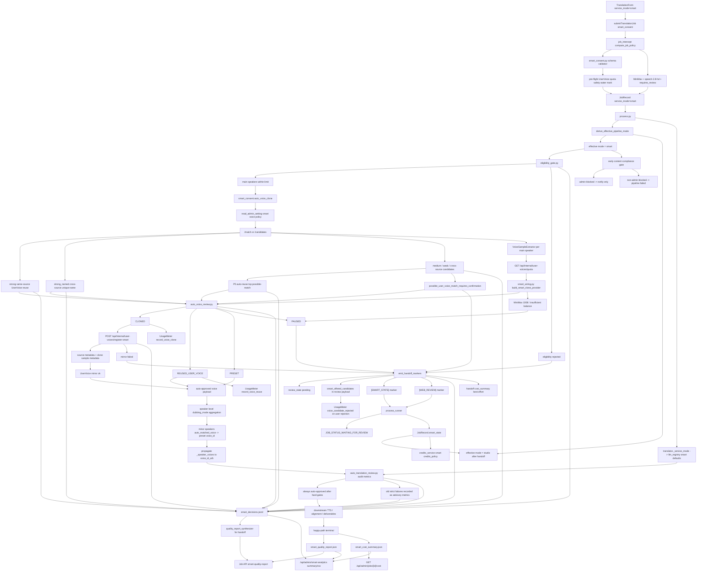

# GitNexus Smart 自动审核图

关联总图：`docs/graphs/GITNEXUS_PROJECT_GRAPH.md`

## 1. 范围

这张子图只看 Smart MVP 的自动审核、降级、报告与成本审计链路，重点是：

- Smart 提交入口与 consent payload
- Gateway `compute_job_policy("smart")` 与 `smart_consent` schema lock
- admin Smart voice policy: auto-clone / reuse / possible-match auto-reuse / weak-match pause
- Smart 2026-05-20 full-auto contract
- admin compliance notify-only / non-admin compliance hard fail
- speaker eligibility gate
- translation review audit metrics
- candidate-first user voice reuse / P5 possible-match auto-reuse / weak-match confirmation / voice clone / preset / pause orchestration
- user voice quota、MiniMax balance exhaustion 与真实 provider wiring
- minor speaker preset auto-match
- handoff 到 Studio human review
- `[SMART_STATE]` marker、`smart_decisions.jsonl`、quality report、admin cost summary、credits policy

## 2. 主图

## 3. 当前核心认知

### 3.1 Smart 入口已经接到前端提交流

- `TranslationForm.tsx` 支持 `serviceMode` 为 `express / studio / smart`。
- Smart 按 Gateway entitlements 判断是否可用，前端不自建 allowed service mode 真源。
- credits estimate 用 `service_mode=smart` 与 `quality_tier=standard` 获取用户侧固定价。
- submit payload 包含 Smart consent；Gateway 会先用 `smart_consent.py` 校验 6 字段 schema，缺字段、错类型或不支持的 `on_budget_exhausted` 会返回 `smart_consent_invalid`。
- Gateway `compute_job_policy("smart")` 会锁定 Smart 为 MiniMax、`speech-2.8-hd`、`requires_review=True`、`voice_clone_enabled=True`、`quality_tier=standard`，避免落回 Express 策略。
- `TranslationForm.tsx` 通过 voice selection pricing 读取 `smart_pause_warning_enabled`；当 admin 开启弱匹配确认时，Smart 提交页会提示用户可能暂停到音色审核。

结论：Smart 不是隐藏后端模式，已经是受 Gateway 权益控制的用户可选服务模式。

### 3.2 Smart 现在是 full-auto-first，deterministic checks 主要进入审计

- `eligibility_gate.py` 只做 speaker structure 归一化和主说话人计数。
- 2026-05-20 后，`auto_translation_review.py` 仍计算术语、speaker assignment、一致性、长度预算、checksum、不确定 speaker 占比、clone sample ratio 等 6 类 metrics，但这些不再阻塞 pipeline。
- 旧严格策略下会 handoff 的 glossary 低、speaker 冲突、长度溢出、checksum mismatch、uncertain speaker 高、clone eligible ratio 低、missing signals，现在只记录 `*_advisory_reason`。
- `auto_voice_review.py` 负责 per-speaker clone / preset / pause，不写 UI，不直接写 review state。

结论：Smart 不是“让 LLM 审核”，也不再默认把 translation review 变成人工确认点；deterministic checks 主要服务质量解释和 admin QA。

### 3.3 admin compliance 是通知，不是 pipeline block

- 内容合规硬 gate 已前移到 `_run_content_compliance_review(...)`。
- 非 admin 命中 `blocked` 时仍抛 `ContentPolicyViolationError`，任务失败退出，这是法律/安全边界。
- Admin 命中 `blocked` 时走 `admin_override_applied` 分支：派发任务通知、写日志，然后 `return payload` 继续流程。
- `evaluate_translation_review(..., compliance_block=True)` 保留兼容参数，但明确忽略该参数，避免 admin Smart job 再被 translation review 拉回人工。

结论：合规风险对普通用户仍是硬阻断；admin 自测/运维任务只提醒，不改变 pipeline 进度。

### 3.4 voice reuse / clone 现在有真实生产边界

- Smart 只有在 `smart_consent.auto_voice_clone is True` 且存在主说话人时才进入复用或克隆路径。
- pipeline 会先按 admin policy 决定是否查询候选：`smart_reuse_user_voice_enabled=False` 时跳过复用路径。
- 默认路径继续使用 internal `/user-voices/match` 做强匹配；当 possible-match 自动复用或 pause 策略需要更多候选时改用 `/user-voices/candidates`。
- 同用户、同源、同 speaker 的强匹配会记为 `reused_user_voice`，不产生 clone 点。
- 跨源唯一同名候选会提升为 `strong_named`，可自动复用，解决旧数据里同一个用户多来源同名音色被误判为 weak 的问题。
- `smart_auto_reuse_on_possible_user_voice_match=True` 时，medium / weak / cross-source possible match 会自动提升 top candidate 为 `possible_user_voice_match_auto_reused`，不产生 paid clone。
- P5 auto-reuse 优先级高于旧的 `smart_pause_on_possible_user_voice_match`；只有关闭 auto-reuse 且开启 pause 时，possible match 才触发 `possible_user_voice_match_requires_confirmation`。
- Gateway create path 只有在 consent 和 `smart_auto_clone_enabled` 都允许新克隆时，才对非 admin 做 voice library quota 安全水位预检；pipeline runtime 仍保留 fail-closed quota check。
- `_fetch_smart_user_voice_quota_remaining(...)` 调 Gateway internal quota endpoint，失败或无 internal key 会 fail-closed handoff。
- `src/services/smart_wiring.py` 是真实 MiniMax clone adapter 的 composition root。
- `_register_smart_clone_in_user_voices(...)` 把 clone 成功结果连同源内容、speaker、样本秒数、样本 segment ids 等 metadata 镜像进 Gateway UserVoice；镜像失败会 handoff，避免后续 quota stale。
- Smart auto-clone 成功现在会同步写 `UsageMeter.record_voice_clone(...)`，不再只登记 UserVoice 而漏掉 provider 成本。
- `_looks_like_quota_error(...)` 现在识别 `quota`、`balance`、`insufficient_balance`、`余额不足`、`payment_required` 和 MiniMax `1008`，provider balance exhaustion 会 PAUSED，而不是普通错误重试到 preset。

结论：Smart auto voice 的正确性依赖 consent、admin policy、候选匹配、quota snapshot、provider wiring、UserVoice mirror、UsageMeter 成本记录共同成立。

### 3.5 非主说话人自动 preset 修复了潜在多说话人缺口

- eligibility 只把主说话人交给 `auto_voice_review`。
- `_aggregate_speaker_dubbing_modes(...)` 会先把 segment-level dubbing mode 汇总到 speaker 层。
- 非主说话人的 `auto_matched_voice` 由 `_resolve_smart_minor_speaker_voices(...)` 解析。
- keep-original / mute-or-background 的非主说话人不会被强行配 preset voice。
- 解析结果写入 `_speaker_voices` 和 approved payload，并标记 `auto_decision = preset_minor_speaker`。
- 自动通过后会把 `_speaker_voices` 写回 `voice_id_a / voice_id_b`，保证 translator / TTS 不再看到 `auto`。

结论：低占比或 excluded speaker 不再因为没有进入 main-speaker review 而留下空 `voice_id`，且主说话人的 cloned/reused voice_id 会真实进入 TTS。

### 3.6 handoff 必须同时发三个信号

`src/services/smart/handoff.py` 把降级到 Studio 的动作打包成三件事：

- `review_state_manager.set_stage(..., status=PENDING, activate=True)`
- `emit_smart_state_marker(...)`
- `print(web_review_marker_builder(...))`

当前仍允许 handoff / pause 的 Smart 场景是：speaker eligibility 超限、样本不足、voice library 水位或 quota 不可用、clone provider 外部限制、clone mirror fail、clone expiry、弱个人音色候选确认。

结论：缺少 `[WEB_REVIEW]` 会让 runner 错误 finalise；缺少 `[SMART_STATE]` 会让 Gateway 和 settlement 看不到降级事实。但 translation review advisory metrics 本身不再触发 handoff。

### 3.7 弱匹配暂停会把候选写进审核态

- 默认 P5 策略下，possible match 优先自动复用，不走本节的暂停路径。
- `evaluate_voice_review(..., possible_voice_matches_by_speaker_id=..., admin_pause_on_possible_match=True)` 会在强匹配复用之后、新克隆之前执行。
- 触发 speaker 的 reason code 是 `possible_user_voice_match_requires_confirmation`。
- 后续 speaker 的级联 reason code 是 `paused_after_prior_possible_match_confirmation`。
- pipeline 会把 `smart_offered_candidates` 写入 `voice_selection_review.payload.speakers[]`，供人工审核 UI 与拒绝审计读取。
- 用户如果选择了候选以外的 voice，Gateway 会写非计费 `voice_candidate_rejected` usage event；如果选择复用则写 `record_voice_reuse`。

结论：弱匹配暂停现在是 P5 auto-reuse 关闭后的保守策略；开启时它不是失败，而是把“可能是同一个人”的音色候选转成可审计的人类确认点。

### 3.8 quality report 是用户解释层，不是成本层

- happy-path terminal Smart job 写 `audit/smart_quality_report.json`。
- handoff job 如果没有 report，Job API 会从 `smart_decisions.jsonl` 合成最小 quality report。
- `SmartAutoDecisionPanel` 默认展开，显示状态、计费策略标签、speaker summary、voice decisions、translation review、retry summary、handoff history。
- TypeScript `SmartQualityReport` 不包含内部成本字段。

结论：用户可以看到“系统自动做了什么和为什么转人工”，但看不到 provider 成本。

### 3.9 cost summary 是 admin-only 审计层

- pipeline 写 `audit/smart_cost_summary.json`，字段包含 `cost_breakdown_internal_only`。
- `gateway/admin_cost_api.py` 只在 `/api/admin/jobs/{job_id}/cost` 暴露，并做 admin role check。
- `gateway/cost_summary_backfill.py` 在 settlement 后回填 `pending_credits_charged` 与 quota usage。
- 前端 admin 成本页把 cost type 放在 admin route 内，避免用户 workspace 泄漏。

结论：Smart 成本数据有正式读路径，但只属于管理员安全域。

### 3.10 Smart analytics 汇总自动审核表现

- `gateway/admin_smart_analytics_api.py` 汇总 Smart jobs、alignment report、handoff reasons、edit events、quality report 与 cost summary。
- `/api/admin/smart-analytics/summary` 返回窗口级完成率、handoff reason、平均指标、cost/margin 和 report coverage。
- `/api/admin/smart-analytics/csv` 导出 job 级行，供离线分析 P5 auto-reuse、handoff、成本和质量。
- `frontend-next/src/app/(app)/admin/smart-analytics/page.tsx` 是 admin shell 中的 Smart 监控入口。

结论：Smart auto-review 不只靠单 job sidecar 解释，已经有跨任务 admin 级观测入口。

### 3.11 Smart LLM 模型选择进入 admin 可控面

- `src/services/llm_registry.py` 为 `smart` mode 的 `pass1 / pass2 / pass3 / translate / rewrite / probe_translate` 默认选择 Gemini 3.1 Pro。
- `gateway/admin_settings.py` 暴露 `prompt_models[mode][prompt_key]`，Smart 可被 admin override。
- pipeline 给 translator 写入 `_service_mode = job_service_mode`，让 prompt model resolution 能区分 Smart / Studio / Express。

结论：Smart translation 现在是 deterministic 质量观测层，不是默认人工 gate；底层 LLM 模型选择也不再误用平铺默认值。

### 3.12 smart_state 是跨进程状态通道

- pipeline 只能通过 stdout 发 `[SMART_STATE] {...}`。
- `process_runner.py` 先解析 Smart marker，再解析 web review marker。
- `JobRecord.smart_state` 会进入 Job API JSON store。
- Gateway 通过 `job_intercept.py` 和 `job_terminal_mirror.py` 镜像到 PG。

结论：`smart_state` 是 pipeline / runner / Gateway / settlement 之间的正式桥，不是只给前端展示的备注字段。

## 4. 关键证据

- `frontend-next/src/components/workspace/TranslationForm.tsx`
  - Smart service mode selector
  - entitlement gate
  - smart fixed price estimate
- `src/pipeline/process.py`
  - Smart inline branch
  - content compliance admin notify-only branch
  - candidate-first voice reuse
  - weak-match pause payload
  - quota lookup
  - clone provider construction
  - UserVoice mirror with source metadata
  - auto-clone UsageMeter recording
  - minor speaker preset resolver
  - voice_id propagation before translate
  - quality/cost summary emitters
- `gateway/job_intercept.py`
  - Smart compute_job_policy
  - create-job consent validation
  - pre-flight Smart voice quota safety water mark gated by consent + admin clone policy
  - voice reuse / candidate rejection audit
- `gateway/smart_consent.py`
  - Smart consent schema lock
- `src/services/smart/auto_translation_review.py`
  - full-auto translation review audit metrics
  - ignored `compliance_block` compatibility parameter
- `tests/test_smart_full_auto_spec_2026_05_20.py`
  - full-auto contract pin
- `tests/test_admin_compliance_notify_only.py`
  - admin compliance notify-only contract
- `src/services/smart/eligibility_gate.py`
  - `normalize_speaker_stats(...)`
  - `evaluate_eligibility(...)`
- `src/services/smart/auto_translation_review.py`
  - deterministic review verdict
- `src/services/smart/auto_voice_review.py`
  - `VoiceReviewChoice`
  - `VoiceReviewOutcome`
  - `evaluate_voice_review(...)`
  - P5 possible-match auto-reuse
  - MiniMax quota/balance exhaustion classifier
  - possible-match pause
- `src/services/smart/handoff.py`
  - review_state + smart_state + web_review marker triple
- `src/services/smart/sidecar_emitter.py`
  - `smart_decisions.jsonl`
  - `smart_quality_report.json`
  - `smart_cost_summary.json`
- `src/services/llm_registry.py`
  - mode-aware prompt model defaults
- `src/services/smart/quality_report_synthesizer.py`
  - handoff report synthesis from JSONL
- `gateway/user_voice_api.py`
  - internal quota, match, candidates, register-smart endpoints
- `gateway/user_voice_service.py`
  - candidate match scopes
  - `strong_named` cross-source unique-name auto-reuse tier
  - cross-source named matching
  - generic speaker name filter
- `gateway/admin_smart_analytics_api.py`
  - Smart summary / CSV analytics
  - report analysis aggregation
- `frontend-next/src/app/(app)/admin/smart-analytics/page.tsx`
  - admin Smart analytics UI
- `frontend-next/src/components/workspace/TranslationForm.tsx`
  - Smart weak-match warning banner
- `gateway/admin_cost_api.py`
  - admin-only cost summary endpoint
- `gateway/cost_summary_backfill.py`
  - post-settle backfill
- `tests/test_minimax_balance_exhaustion.py`
  - MiniMax 1008 / insufficient balance contract
- `tests/test_strong_named_auto_reuse.py`
  - cross-source unique-name auto-reuse contract

## 5. 什么时候优先看这张图

- 想改 Smart 自动审核是否能直接通过
- 想改 Smart voice policy、强匹配复用、P5 possible-match 自动复用、弱匹配暂停、新克隆开关
- 想改 Smart 降级到 Studio 的状态机
- 想接真实 clone / TTS / LLM provider 到 Smart
- 想排查 Smart 为什么复用了已有个人音色、为什么 possible match 没暂停、为什么没克隆、为什么 clone 被 quota/balance 拦住
- 想排查 Smart 为什么暂停到音色审核、为什么写了候选拒绝审计
- 想排查 Smart job 为什么没有 quality report 或为什么显示转人工
- 想排查 Smart 扣费、退款、成本摘要、sidecar 审计
- 想看 Smart analytics 为什么统计某个 handoff reason、cost 或质量指标
- 想改多说话人 Smart voice assignment
