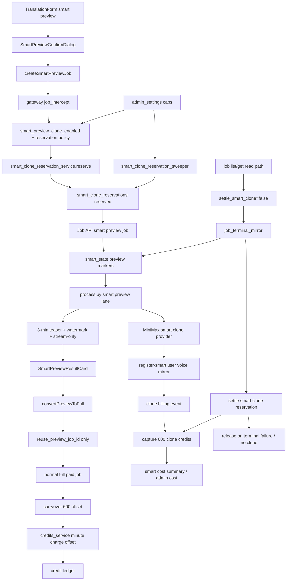

# GitNexus Smart Preview Clone / Billing 图

关联总图：`docs/graphs/GITNEXUS_PROJECT_GRAPH.md`

## 1. 范围

这张子图看的是“Smart 预览如何安全调用自动克隆，以及 600 点预约如何在预览和转完整之间结算”，重点是：

- Smart preview 创建入口与 3 分钟 teaser
- `smart_preview_clone_enabled` rollout gate
- smart clone reservation service
- 600 点 MiniMax clone 预约、capture、release、carryover
- global daily cap、inflight cap 与 strict reservation gate
- pipeline smart_state marker
- preview-only clone charge 与 full-job minute offset
- preview-to-full convert 不重复扣 600 点
- sweeper / terminal mirror / cost summary
- Job list/get read path must not settle clone reservation

## 2. 主图

## 3. 当前核心认知

### 3.1 预览克隆必须先预约，再调用 provider

- `smart_preview_clone_enabled` 默认关闭，作为 public preview clone 的总开关。
- `smart_clone_requires_reservation` 开启时，Smart MiniMax clone 必须带有效 reservation。
- reservation 覆盖 daily global cap、inflight cap、active row 唯一性和 billing event 去重。
- create path 拿不到 reservation 时应 fail-closed，不应进入真实 clone 后再补账。

结论：Smart preview clone 的第一原则是先有成本闸，再有 provider 调用。

### 3.2 预览只收克隆预约，不收分钟费

- Smart preview 的 3 分钟 teaser 是试用/决策面，不按完整任务分钟扣费。
- clone 成功时 capture 600 点 MiniMax clone 预约。
- preview terminal 会释放分钟 reservation，避免 teaser 被完整任务分钟价误扣。
- clone 未发生或终态失败时，reservation 进入 release / expire 补偿。

结论：预览收费语义是“如果发生自动克隆，收 600 点克隆成本”，不是完整 Smart 任务计费。

### 3.3 转完整通过 carryover 防止重复扣 600 点

- `convertPreviewToFull` 只提交 `reuse_preview_job_id`，不从前端复制源文件或音色事实。
- full job 创建时服务端从 preview job 派生源和必要上下文。
- `credits_service` 通过 `preview_clone_offset_reservation_id` / carryover marker 抵扣一次 600 点 clone charge。
- carryover 只能单次消费，避免同一预览被多个完整任务重复抵扣。

结论：预览转完整要保持“源复用服务端真源 + 600 点只扣一次”。

### 3.4 stream-only 预览不等于可编辑任务

- Smart preview result 只展示 teaser、状态、错误与转完整 CTA。
- 预览不进入 Studio post-edit、materials pack、剪映草稿、clean artifact 下载等完整任务面。
- 转完整后才进入正常 workflow / delivery / editing 范围。

结论：Smart preview 是购买前决策面，不应被当作完整任务的低价替代。

### 3.5 list/get 读路径不能触发 clone settlement

- `gateway/job_intercept.py` 的 list/get 路径调用 `mirror_job_terminal_state(..., settle_smart_clone=False)`。
- terminal mirror 与 sweeper 仍负责 Smart clone reservation 的 capture/release/expire；读路径只做展示态同步和 metadata 保护。
- `tests/test_gateway_list_jobs_metadata.py` 覆盖 list/get 不触发 smart clone settlement，防止用户刷新页面时产生财务副作用。

结论：Smart Preview clone 结算只应来自终态推进或补偿任务，不能来自列表/详情刷新。

## 4. 关键证据

- `frontend-next/src/components/workspace/SmartPreviewConfirmDialog.tsx`
  - preview confirmation UI
- `frontend-next/src/components/workspace/SmartPreviewResultCard.tsx`
  - preview result and convert CTA
- `frontend-next/src/lib/api/smartPreviewClone.ts`
  - create smart preview
  - convert preview to full
- `gateway/smart_clone_reservation_service.py`
  - 600 credit reservation state machine
  - daily / inflight cap
  - billing event idempotency
- `gateway/smart_clone_reservation_sweeper.py`
  - expired reservation cleanup
- `gateway/admin_settings.py`
  - smart preview clone switches and caps
  - strict reservation gate
- `gateway/job_intercept.py`
  - preview create policy
  - full convert source derivation
- `gateway/credits_service.py`
  - clone charge capture/release
  - preview clone offset / carryover
  - preview minute release
- `gateway/job_terminal_mirror.py`
  - terminal smart_state mirror and reservation settle
- `gateway/job_intercept.py`
  - list/get read-path `settle_smart_clone=False`
  - metadata snapshot and rollback
- `tests/test_gateway_list_jobs_metadata.py`
  - read-path no-settlement coverage
- `gateway/alembic/versions/037_smart_clone_reservations.py`
  - reservation table and billing event schema
- `gateway/alembic/versions/038_smart_clone_created_at_index.py`
  - daily cap index
- `gateway/alembic/versions/039_smart_clone_carryover.py`
  - single-use carryover marker

## 5. 什么时候优先读这张图

- 想改 Smart preview 自动克隆入口
- 想排查预览为什么被 reservation / cap 拒绝
- 想排查 600 点为什么 capture、release 或 expire
- 想改 preview-to-full，避免重复扣克隆点数
- 想确认 Smart preview 为什么没有完整下载、剪映草稿或后编辑入口
- 想排查 smart clone reservation sweeper、terminal settlement 或 cost summary
- 想确认列表/详情刷新不会触发 Smart clone capture/release
