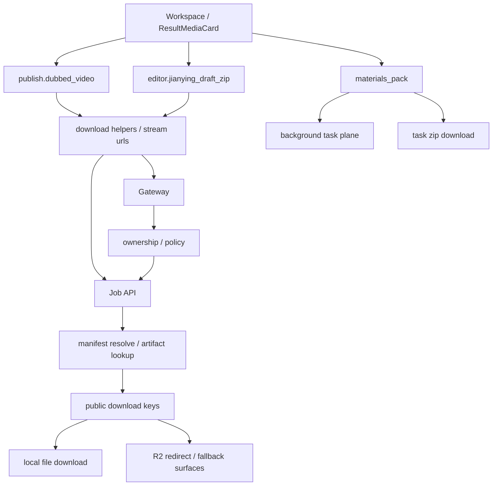

# GitNexus 存储与交付图

关联总图：`docs/graphs/GITNEXUS_PROJECT_GRAPH.md`

## 1. 范围

这张子图只看“任务结果如何变成用户可下载 / 可导出的交付物”，重点是：

- `publish.dubbed_video`
- `materials_pack`
- `editor.jianying_draft_zip`
- Job API 下载白名单、manifest resolve、R2 / local fallback 的边界

## 2. 主图

## 3. 当前交付面的变化

### 3.1 `editor.jianying_draft_zip` 已进入正式白名单

- `src/services/web_ui/output_entries.py` 的 `PUBLIC_RESULT_DOWNLOAD_KEYS` 现在包含：
  - `manifest.file`
  - `translation.segments`
  - `editor.subtitles`
  - `editor.dubbed_audio_complete`
  - `editor.jianying_draft_zip`
  - `publish.dubbed_video`

结论：剪映草稿 zip 不是隐藏调试产物，而是正式公开下载项。

### 3.2 结果页现在承载三种交付动作

- `frontend-next/src/components/workspace/ResultMediaCard.tsx`
  - 视频下载 / 播放
  - 素材包打包与下载
  - `JianyingDraftSection`

结论：结果页交付面已经从“下载结果”升级成“下载 / 打包 / 导出到剪映草稿”的多交付平面。

### 3.3 剪映草稿仍走 Job API download key，而不是前端直拼磁盘路径

- `ResultMediaCard.tsx` 构建下载地址时走：
  - `/jobs/{jobId}/download/editor.jianying_draft_zip`
- 这条路径仍然经过 Gateway ownership / Job API resolve

结论：前端并不知道 zip 的真实磁盘位置；下载权限和定位仍由后端掌握。

### 3.4 绝对路径模式影响的是 zip 内 draft，而不是下载协议

- `src/modules/output/jianying/jianying_draft_writer.py`
  - 无 `user_draft_root`：把 materials 改写成相对路径
  - 有 `user_draft_root`：把 materials 改写成用户本地剪映草稿目录下的绝对路径
- 但无论哪种模式，交付给用户的外层产物都还是 `editor.jianying_draft_zip`

结论：`user_draft_root` 改的是“解压后 draft_content.json 里的 material path”，不是前端下载协议。

## 4. 关键证据

- `src/services/web_ui/output_entries.py`
  - `editor.jianying_draft_zip` 在公开下载白名单中
- `src/modules/output/manifest_writer.py`
  - `primary_outputs.editor` 写入 jianying draft 相关路径
- `frontend-next/src/components/workspace/ResultMediaCard.tsx`
  - Studio 结果页显示 `JianyingDraftSection`
  - 下载 URL 指向 `/jobs/{id}/download/editor.jianying_draft_zip`
- `src/services/jobs/api.py`
  - download key 统一从 Job API resolve

## 5. 什么时候优先读这张图

- 想改结果页下载面
- 想把新交付物加入白名单
- 想判断剪映草稿 zip 该走哪条下载路径
- 想区分“zip 下载协议”和“zip 内 draft 的绝对 / 相对路径模式”
