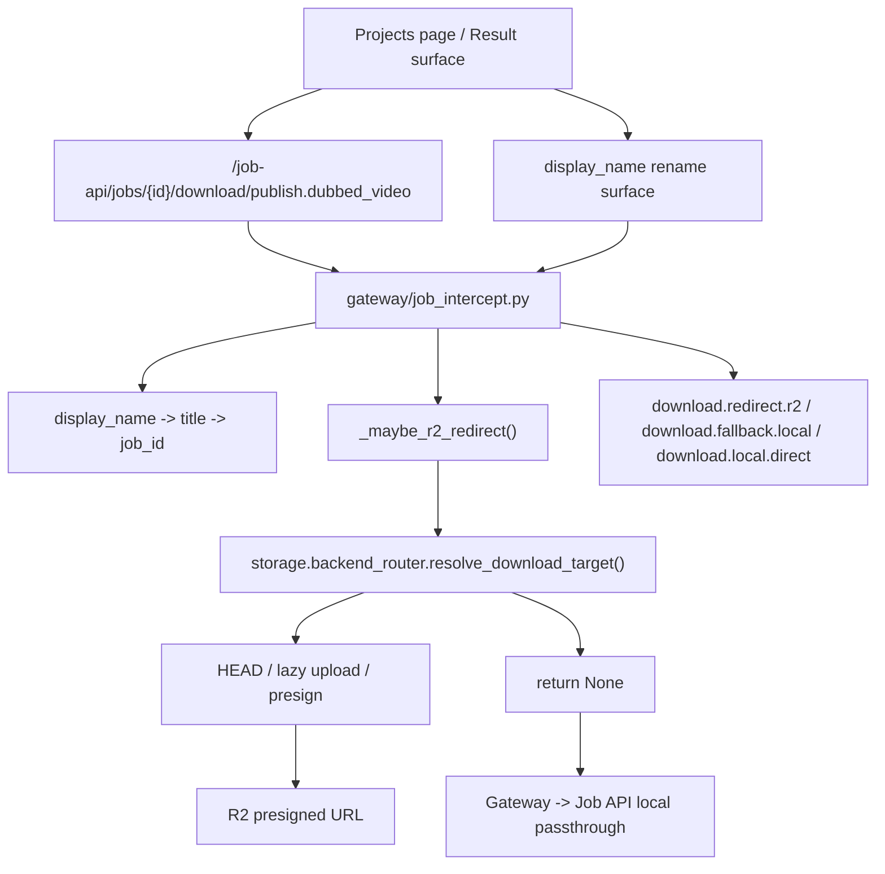

# GitNexus 存储与交付图

关联总图：`docs/graphs/GITNEXUS_PROJECT_GRAPH.md`

## 1. 范围

这张子图聚焦用户拿到结果文件时的交付链路，重点是：

- `projects` / `workspace` 下载表面
- Gateway 下载路由决策
- `display_name` 到文件名的派生
- `R2 redirect -> local fallback`
- 下载事件打点

## 2. 存储与交付主图

## 3. 前端对 R2 仍然零感知

- 用户侧下载 URL 仍然是：
  `/job-api/jobs/{id}/download/publish.dubbed_video`
- `frontend-next/src/app/(app)/projects/page.tsx` 负责展示结果、重命名、进入后续动作
- 前端不需要知道：
  bucket
  presigned URL
  `X-Amz-*`
  R2 endpoint

结论：下载后端选择仍然必须完全留在服务端。

## 4. 单一决策点与 fallback 契约

`gateway/storage/backend_router.py` 当前明确声明：

- 它是“这次下载是否真的走 R2”的唯一决策点
- 只有 `publish.dubbed_video` 这一个 artifact key 接到这条路由
- 对 HEAD / upload / presign 任一异常都必须 `return None`
- 返回 `None` 后由 Gateway 自动走本地透传

这条契约的关键意义是：R2 退化时，用户仍然拿得到文件。

## 5. Gateway 下载入口

`gateway/job_intercept.py` 当前在下载路径上做三件事：

- 先调用 `_maybe_r2_redirect(job_id, db)`
- 用 `_derive_download_filename(job)` 派生友好文件名
- 根据结果写入事件：
  `download.redirect.r2`
  `download.fallback.local`
  `download.local.direct`

其中 `_derive_download_filename(job)` 的优先级是：

- `display_name`
- `title`
- `job_id`

这说明重命名已经会直接影响用户“另存为”看到的文件名。

## 6. R2 路径的当前形状

`gateway/storage/backend_router.py` 与 `gateway/storage/r2_client.py` 共同形成当前 R2 交付链：

- `is_r2_enabled()` 判断当前是否启用 R2 后端
- `r2_key_for(job_id, artifact_key, local_path=...)` 生成对象 key
- `head_artifact(key)` 判断对象是否存在
- 本地存在但对象缺失时，按 per-key lock 触发 lazy upload
- `generate_presigned_download_url(key, download_filename)` 生成下载 URL

这条链目前是“可切换下载后端”，而不是“全仓统一对象存储”。

## 7. display_name 与交付面

- `frontend-next/src/app/(app)/projects/page.tsx` 已经有 rename / result card 表面
- `gateway/job_intercept.py` 也在 `copy_as_new` 返回后镜像写入 `new_display_name`

这意味着交付层现在不只是“有没有文件”，还要考虑：

- 项目在列表页叫什么
- 下载文件名叫什么
- 复制任务后的新结果以什么名字进入系统

## 8. 这张图适合回答什么问题

- 下载为什么必须先经过 Gateway，而不是让前端直连存储
- R2 故障时为什么用户仍然能继续下载
- `display_name` 为什么会影响最终下载文件名
- 当前哪些 artifact 已经接入 R2 路由，哪些还没有
