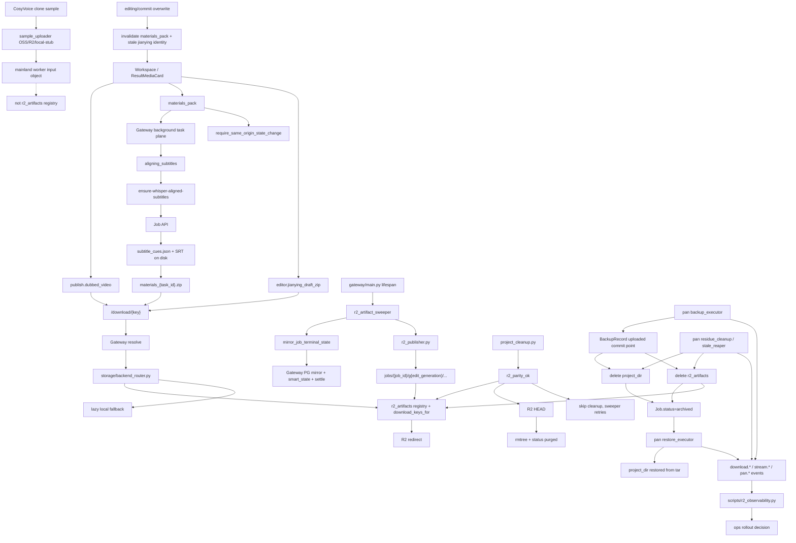

# GitNexus 存储与交付图

关联总图：`docs/graphs/GITNEXUS_PROJECT_GRAPH.md`

## 1. 范围

这张子图只看“任务结果如何变成用户可下载 / 可导出的交付物”，重点是：

- `publish.dubbed_video`
- `materials_pack`
- `editor.jianying_draft_zip`
- `r2_artifacts` registry
- proactive publish、registry redirect、lazy fallback
- terminal mirror、R2 parity、cleanup 与 observability
- Pan archive 后的本地 project_dir / R2 artifacts 删除与恢复边界
- CosyVoice clone sample uploader 与交付 R2 registry 的边界
- materials pack / job subresource 写路由的 CSRF same-origin guard

## 2. 主图

## 3. 当前交付面的新结构

### 3.1 proactive publish 仍然是 R2 主推动力

- `r2_artifact_sweeper.py` 以 JSON store 为真源扫描 succeeded jobs。
- 扫描时先执行 `mirror_job_terminal_state(...)`。
- `r2_artifacts IS NULL` 时全量 push。
- registry 缺 `editor.jianying_draft_zip` 时做 delta push。
- `expected_generation` 防止 overwrite race。

结论：R2 发布继续由后台扫表主动推进，而不是只靠下载请求触发。

### 3.2 terminal mirror 现在还同步 Smart state

- `gateway/job_terminal_mirror.py` 会把 upstream `smart_state` 合并到 Gateway PG。
- settle 前先合并 Smart state，使 `settle_job_credit_ledger(...)` 能看到 `credits_policy`。
- terminal settlement 仍然是幂等补偿式，适配 detail polling、list jobs、R2 sweeper 多入口观察同一终态。

结论：terminal mirror 现在同时服务下载交付一致性和 Smart 结算一致性。

### 3.3 cleanup 可以被 R2 parity gate 保护

- `src/services/r2_publisher_lib/r2_parity.py` 检查 expected artifact keys、current `edit_generation`、registry state、R2 HEAD。
- `gateway/project_cleanup.py` 在 `AVT_CLEANUP_REQUIRES_R2_PARITY=true` 时调用 `r2_parity_ok(...)`。
- parity 不通过时跳过 rmtree，也不把 DB status 翻成 `purged`。

结论：磁盘释放现在可以等待 R2 副本确认，避免删掉唯一可用 artifact。

### 3.4 R2 key 空间继续按 `edit_generation` 分代

- `r2_publisher.py` 使用 `jobs/{job_id}/g{edit_generation}/...`。
- registry entry 状态包括 `pushed / already_present / skipped_missing / failed`。
- overwrite 推进 generation 后，旧 generation 只保留取证意义，不再作为当前下载事实。

结论：post-edit 之后下载身份按 generation 隔离。

### 3.5 download / stream observability 成为灰度判断工具

- `scripts/r2_observability.py` 聚合 `download.redirect.r2_registry`、`download.fallback.local`、`stream.redirect.r2_registry`、`stream.fallback.local` 等事件。
- 同一脚本现在也聚合 pan event group：backup / restore / token / residue cleanup，用来观察归档与恢复健康度。
- 脚本是 stdlib-only，面向 Gateway / app 容器共享 jobs dir。
- 输出用于 rollout 判断，不能把 redirect 计数误解为下载成功率。

结论：R2 可观测性现在从手工 grep 升级为可重复脚本。

### 3.6 Pan archive 会主动退休本地和 R2 副本

- `backup_executor` 在 `BackupRecord.status=uploaded` 且三重校验通过后，才删除本地 `project_dir` 和 `Job.r2_artifacts` 指向的 R2 objects。
- 删除本地或 R2 失败不会把 Job 伪装成 `archived`；Job 留在 `archiving`，由 `residue_cleanup` 或 `stale_reaper` 补偿。
- `restore_executor` 只恢复本地 `project_dir`，不会自动重建 R2 registry；恢复后的交付再发布需要走既有发布/生成路径。

结论：R2 是在线交付缓存，Pan 是 admin 归档副本，两者不是同一个存储 backend。

### 3.7 交付物生成类写请求现在受 CSRF 保护

- `gateway/materials_api.py` 的 router 接入 `require_same_origin_state_change`，`POST /api/jobs/{job_id}/materials-pack` 不再只靠 session cookie。
- `gateway/main.py` 的 `/job-api/jobs/{job_id}/{subpath:path}` catch-all 对 GET/POST 都加 same-origin guard，覆盖 generate-jianying-draft、continue、review actions 等 Job API 子资源代理。
- 下载类 GET 仍通过 ownership / download key / storage router 判定，不把 CSRF 当作下载权限真源。

结论：生成交付物是 state-changing action，需要同源保护；下载交付物仍以 ownership/storage resolution 为主。

### 3.8 CosyVoice sample uploader 不是用户交付物 registry

- `gateway/cosyvoice_clone/sample_uploader.py` 服务 clone 前的样本交付给国内 worker，可用 OSS/R2/local stub backend。
- sample uploader 的对象生命周期服务 worker clone，不进入 `r2_artifacts` 交付物 registry，也不改变用户下载 URL。
- worker enabled 但 uploader 仍是 `local_fs_stub` 时，clone endpoint 在付费 worker 调用前 503。
- 交付物 R2 路径仍以 `publish.dubbed_video`、`materials_pack`、`editor.jianying_draft_zip` 等 artifact identity 为主，不应把 clone sample object 当成结果交付物。

结论：CosyVoice sample storage 是 worker 输入通道，和用户结果交付/R2 parity 是不同域。

## 4. 关键证据

- `gateway/r2_artifact_sweeper.py`
  - proactive scan / delta push
  - feature flags
  - `expected_generation`
- `gateway/job_terminal_mirror.py`
  - terminal mirror invariants
  - Smart state merge
  - credit/quota settle
- `src/services/r2_publisher_lib/r2_parity.py`
  - cleanup parity gate
- `gateway/project_cleanup.py`
  - `AVT_CLEANUP_REQUIRES_R2_PARITY`
- `scripts/r2_observability.py`
  - download / stream / pan event aggregation
- `gateway/storage/backend_router.py`
  - registry redirect
  - lazy fallback
- `gateway/cosyvoice_clone/sample_uploader.py`
  - CosyVoice clone sample upload backend
- `gateway/materials_api.py`
  - CSRF-protected materials-pack generation route
- `gateway/main.py`
  - CSRF-protected job subresource proxy
- `gateway/pan/backup_executor.py`
  - archive commit point
  - local + R2 deletion after uploaded
- `gateway/pan/restore_executor.py`
  - restore from pan tar
- `gateway/pan/residue_cleanup.py`
  - idempotent local/R2 cleanup retry

## 5. 什么时候优先看这张图

- 想改结果页下载面
- 想加新的 downloadable key
- 想排查为什么成功任务没有被主动推上 R2
- 想判断 cleanup 为什么没有删除某个过期项目
- 想看 R2 redirect / fallback 的观测口径
- 想判断 Pan 归档后为什么本地或 R2 还没删除
- 想判断 archived 任务恢复后为什么 R2 registry 没自动回来
- 想确认 CosyVoice clone sample upload 是否会进入用户交付物 registry
- 想排查 materials pack / generate draft / review 子资源为什么被 CSRF 拦截
