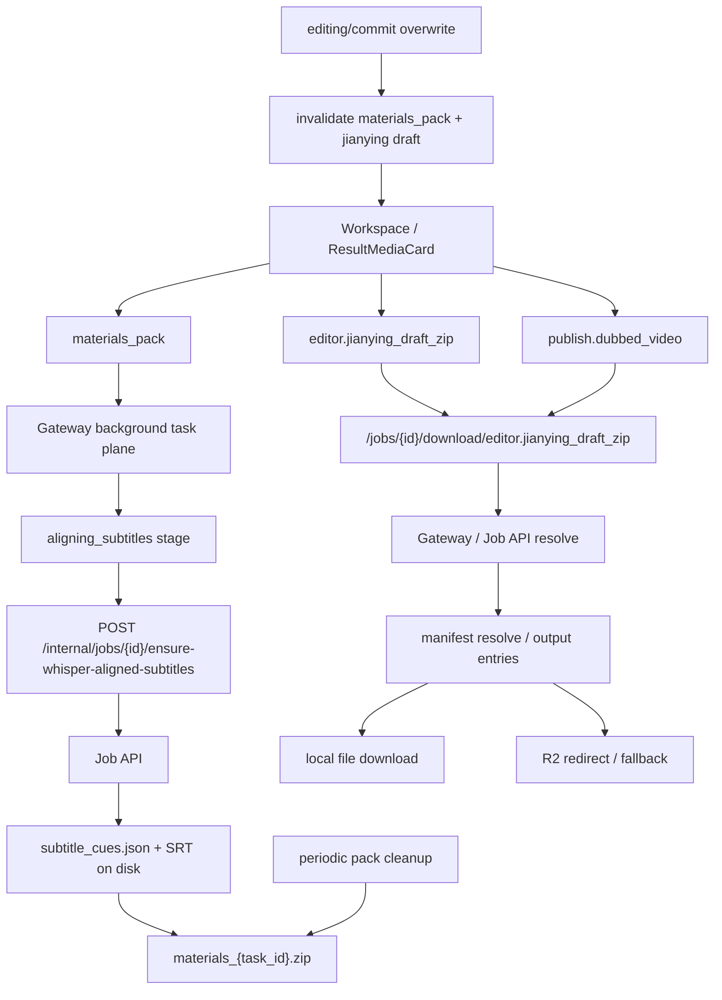

# GitNexus 存储与交付图

关联总图：`docs/graphs/GITNEXUS_PROJECT_GRAPH.md`

## 1. 范围

这张子图只看“任务结果如何变成用户可下载 / 可导出的交付物”，重点是：

- `publish.dubbed_video`
- `materials_pack`
- `editor.jianying_draft_zip`
- download key、manifest resolve、R2 / local fallback、cleanup 与 invalidation

## 2. 主图

## 3. 当前交付面的变化

### 3.1 `materials_pack` 现在有显式的“预打包字幕精对齐”阶段

- `gateway/background_task_executors.py::execute_materials_pack()` 在 `subtitles` 被选中时，会先进入 `aligning_subtitles`
- 它通过内部 HTTP 调用 Job API 的 `ensure-whisper-aligned-subtitles`
- 调用失败会被记录但吞掉，pack 继续使用磁盘上现有的 SRT

结论：`materials_pack` 现在会尽量交付 whisper 精对齐字幕，但不会因为这条 sidecar 失败而阻断打包。

### 3.2 `editor.jianying_draft_zip` 仍然是正式公开下载项

- `src/services/web_ui/output_entries.py` 继续把 `editor.jianying_draft_zip` 放在公开下载白名单里
- 结果页还是通过 `/jobs/{jobId}/download/editor.jianying_draft_zip` 取它，不是前端拼磁盘路径

结论：剪映草稿 zip 已经是正式交付面，不是隐藏调试产物。

### 3.3 overwrite commit 会让旧 `materials_pack` 变成 stale

- `gateway/job_intercept.py` 在 `editing/commit overwrite` 成功后会调用 `invalidate_materials_pack_for_job(...)`
- 其语义是：旧 zip 被 unlink，非终态旧任务置失败，避免用户继续下载 pre-edit 打包物

结论：现在 post-edit 后旧 `materials_pack` 不会继续“看起来还能用”。

### 3.4 materials zip 已经有独立 retention loop

- `gateway/main.py` 启动时恢复 stale background tasks
- 同文件还起了定时清理循环，周期性删除过期 `materials_pack` zips

结论：`materials_pack` 现在是 Gateway 自己维护生命周期的正式交付平面，而不是一次性临时文件。

### 3.5 `user_draft_root` 改的是 zip 内 draft 路径，不影响下载层

- `jianying_draft_writer.py` 决定的是解压后 `draft_content.json` 中的素材路径模式
- 外层下载层仍然统一走 Job API / Gateway resolve

结论：下载协议与 draft 内部路径语义是两层，不应混写到一起。

## 4. 关键证据

- `gateway/background_task_executors.py`
  - `execute_materials_pack()`
  - `_ensure_whisper_aligned_subtitles()`
- `src/services/jobs/api.py`
  - `/internal/jobs/{id}/ensure-whisper-aligned-subtitles`
- `src/services/web_ui/output_entries.py`
  - `PUBLIC_RESULT_DOWNLOAD_KEYS`
- `gateway/job_intercept.py`
  - `invalidate_materials_pack_for_job(...)`
- `gateway/main.py`
  - stale task recovery
  - periodic pack cleanup

## 5. 什么情况下优先读这张图

- 想改结果页下载面
- 想把新的交付物加入白名单
- 想判断 `materials_pack` 现在何时会触发 whisper 对齐
- 想排查为什么 post-edit 后旧 zip 不见了 / 失效了
