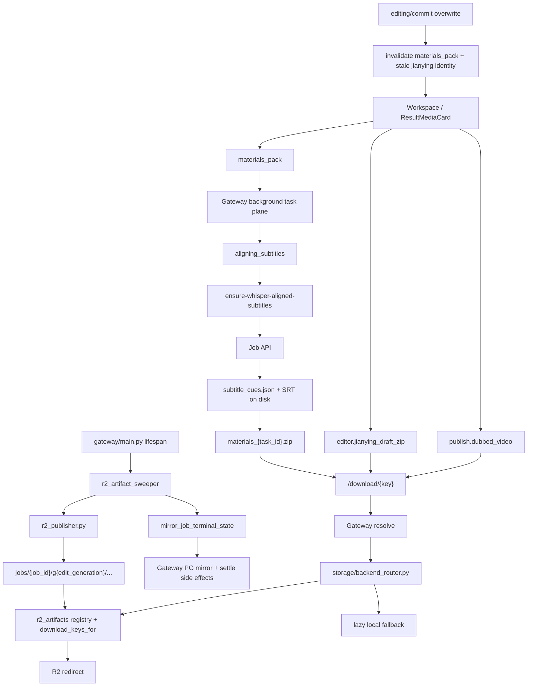

# GitNexus 存储与交付图

关联总图：`docs/graphs/GITNEXUS_PROJECT_GRAPH.md`

## 1. 范围

这张子图只看“任务结果如何变成用户可下载 / 可导出的交付物”，重点是：

- `publish.dubbed_video`
- `materials_pack`
- `editor.jianying_draft_zip`
- `r2_artifacts` registry
- proactive publish、registry redirect、lazy fallback
- terminal mirror、cleanup 与 invalidation

## 2. 主图

## 3. 当前交付面的新结构

### 3.1 `materials_pack` 仍然有显式的 whisper 预处理阶段

- `gateway/background_task_executors.py::execute_materials_pack()` 仍会先进入 `aligning_subtitles`
- 它通过内部调用 `ensure-whisper-aligned-subtitles`
- sidecar 失败会被记录，但不阻断最终打包

结论：`materials_pack` 会尽量交付 whisper 对齐字幕，但不会因 sidecar 失败而整个打包失败。

### 3.2 `r2_artifact_sweeper` 已经把主动发布拉进正式主链

`gateway/r2_artifact_sweeper.py` 明确了几条契约：

- 真源是 JSON store，而不是 Gateway PG
- 扫描成功任务时会先做 `mirror_job_terminal_state(...)`
- 命中 `r2_artifacts IS NULL` 时会全量 push
- 发现已有草稿但 registry 缺条目时会做 delta push
- 通过 `expected_generation` 防止与 overwrite race
- 受两个开关控制：
  - `AVT_DOWNLOAD_REDIRECT_BACKEND == "r2"`
  - `AVT_R2_PROACTIVE_PUSH_ENABLED == "true"`

结论：R2 发布已经不是“有下载请求才被动上传”，而是被正式拉进后台运维平面。

### 3.3 `job_terminal_mirror` 已经成为 sweeper 的前置补偿层

`gateway/job_terminal_mirror.py` 当前契约是：

- 把 terminal job state 从 JSON store 镜像回 Gateway PG
- `purged` 是 sticky
- terminal settle 必须幂等且补偿式
- 只镜像镜像字段，不覆盖 Gateway 自有的 `r2_artifacts / display_name / expires_at`
- 同步 `edit_generation`，避免 PG 与 JSON drift 造成错误发布

结论：terminal mirror 现在不仅服务 list-jobs，也直接服务 proactive publish 的一致性。

### 3.4 R2 key 空间现在显式带 `edit_generation`

- `src/services/r2_publisher_lib/r2_publisher.py` 用 `jobs/{job_id}/g{edit_generation}/...` 作为主动发布 key 空间
- registry entry 有：
  - `pushed`
  - `already_present`
  - `skipped_missing`
  - `failed`
- `editor.jianying_draft_zip` 只有在调用方确认存在时才会被推送

结论：同一 job 的不同编辑代际已经在交付层被正式区分，不再共享一组模糊下载身份。

### 3.5 `backend_router` 现在是 registry redirect 与 lazy fallback 并存

- `gateway/storage/backend_router.py` 同时理解两类 key：
  - legacy lazy path
  - proactive publisher registry path
- registry path 可以覆盖比 lazy upload 更多的 downloadable keys
- 仍然保留 local fallback，避免 registry 未热身时直接断链

结论：当前下载层是演进式迁移，而不是一次性切换到纯 R2。

### 3.6 overwrite 仍会让旧交付物失效

- `editing_commit.py` 会退休旧 Jianying claim identity
- `gateway/job_intercept.py` 仍会在 overwrite commit 后执行 `invalidate_materials_pack_for_job(...)`

结论：post-edit 后旧打包物、旧草稿 zip、旧 fingerprint 继续被视作 stale。

## 4. 关键证据

- `gateway/r2_artifact_sweeper.py`
  - proactive scan / delta push
  - feature flags
  - `expected_generation`
- `gateway/job_terminal_mirror.py`
  - terminal mirror invariants
  - `edit_generation`
- `src/services/r2_publisher_lib/r2_publisher.py`
  - key shape
  - registry states
- `gateway/storage/backend_router.py`
  - registry redirect
  - lazy fallback
- `gateway/main.py`
  - sweeper lifecycle start / cancel

## 5. 什么时候优先看这张图

- 想改结果页下载面
- 想加新的 downloadable key
- 想排查为什么某个成功任务没有被主动推上 R2
- 想判断 registry redirect 与 local fallback 的优先级
- 想排查 overwrite 后为什么旧草稿或旧打包物失效
