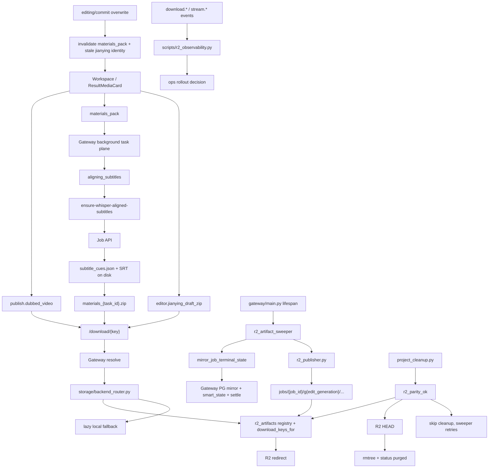

# GitNexus 存储与交付图

关联总图：`docs/graphs/GITNEXUS_PROJECT_GRAPH.md`

## 1. 范围

这张子图只看“任务结果如何变成用户可下载 / 可导出的交付物”，重点是：

- `publish.dubbed_video`
- `materials_pack`
- `editor.jianying_draft_zip`
- `r2_artifacts` registry
- proactive publish、registry redirect、lazy fallback
- terminal mirror、R2 parity、cleanup 与 observability

## 2. 主图

## 3. 当前交付面的新结构

### 3.1 proactive publish 仍然是 R2 主推动力

- `r2_artifact_sweeper.py` 以 JSON store 为真源扫描 succeeded jobs。
- 扫描时先执行 `mirror_job_terminal_state(...)`。
- `r2_artifacts IS NULL` 时全量 push。
- registry 缺 `editor.jianying_draft_zip` 时做 delta push。
- `expected_generation` 防止 overwrite race。

结论：R2 发布继续由后台扫表主动推进，而不是只靠下载请求触发。

### 3.2 terminal mirror 现在还同步 Smart state

- `gateway/job_terminal_mirror.py` 会把 upstream `smart_state` 合并到 Gateway PG。
- settle 前先合并 Smart state，使 `settle_job_credit_ledger(...)` 能看到 `credits_policy`。
- terminal settlement 仍然是幂等补偿式，适配 detail polling、list jobs、R2 sweeper 多入口观察同一终态。

结论：terminal mirror 现在同时服务下载交付一致性和 Smart 结算一致性。

### 3.3 cleanup 可以被 R2 parity gate 保护

- `src/services/r2_publisher_lib/r2_parity.py` 检查 expected artifact keys、current `edit_generation`、registry state、R2 HEAD。
- `gateway/project_cleanup.py` 在 `AVT_CLEANUP_REQUIRES_R2_PARITY=true` 时调用 `r2_parity_ok(...)`。
- parity 不通过时跳过 rmtree，也不把 DB status 翻成 `purged`。

结论：磁盘释放现在可以等待 R2 副本确认，避免删掉唯一可用 artifact。

### 3.4 R2 key 空间继续按 `edit_generation` 分代

- `r2_publisher.py` 使用 `jobs/{job_id}/g{edit_generation}/...`。
- registry entry 状态包括 `pushed / already_present / skipped_missing / failed`。
- overwrite 推进 generation 后，旧 generation 只保留取证意义，不再作为当前下载事实。

结论：post-edit 之后下载身份按 generation 隔离。

### 3.5 download / stream observability 成为灰度判断工具

- `scripts/r2_observability.py` 聚合 `download.redirect.r2_registry`、`download.fallback.local`、`stream.redirect.r2_registry`、`stream.fallback.local` 等事件。
- 脚本是 stdlib-only，面向 Gateway / app 容器共享 jobs dir。
- 输出用于 rollout 判断，不能把 redirect 计数误解为下载成功率。

结论：R2 可观测性现在从手工 grep 升级为可重复脚本。

## 4. 关键证据

- `gateway/r2_artifact_sweeper.py`
  - proactive scan / delta push
  - feature flags
  - `expected_generation`
- `gateway/job_terminal_mirror.py`
  - terminal mirror invariants
  - Smart state merge
  - credit/quota settle
- `src/services/r2_publisher_lib/r2_parity.py`
  - cleanup parity gate
- `gateway/project_cleanup.py`
  - `AVT_CLEANUP_REQUIRES_R2_PARITY`
- `scripts/r2_observability.py`
  - download / stream event aggregation
- `gateway/storage/backend_router.py`
  - registry redirect
  - lazy fallback

## 5. 什么时候优先看这张图

- 想改结果页下载面
- 想加新的 downloadable key
- 想排查为什么成功任务没有被主动推上 R2
- 想判断 cleanup 为什么没有删除某个过期项目
- 想看 R2 redirect / fallback 的观测口径
