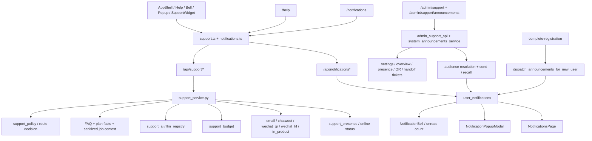

# GitNexus 支持 / 通知图

关联总图：`docs/graphs/GITNEXUS_PROJECT_GRAPH.md`

## 1. 范围

这张子图看的是“用户如何求助、AI 如何回答、何时转人工、公告与通知如何触达用户”，重点是：

- 帮助中心 / `SupportWidget` / `NotificationBell`
- `support_api` + `support_service`
- FAQ / plan facts / sanitized job context 回答链
- human handoff / presence / WeChat QR
- system announcements / live audiences / popup notifications

## 2. 主图

## 3. 当前最重要的结构认知

### 3.1 support 前门已经是正式产品面，不再是占位页或散落联系信息

- `frontend-next/src/components/app-shell.tsx` 现在直接挂了 `SupportWidget`
- `frontend-next/src/app/(app)/help/page.tsx` 已从“开发中”占位升级成真实帮助中心落地页
- `frontend-next/src/lib/api/support.ts` 已覆盖：
  - `getSupportConfig`
  - `createSupportConversation`
  - `sendSupportMessage`
  - `requestSupportHandoff`
  - `getOnlineStatus`
  - `listMyOpenConversations`

结论：支持已经进入主应用入口，而不是“用户自己找邮箱”。

### 3.2 `support_service.py` 是唯一决定一条消息怎么走的编排层

- 模块头明确写死三条规则：
  - 它是唯一决定“这条消息走 AI / template / handoff 哪条路”的地方
  - 所有路径都会写 `support_messages`
  - 所有路径都会写 `support_ai_usage`，即使没有真实 LLM 调用
- 代码入口把 `plan facts`、`FAQ search`、`sanitize_job_context_for_ai(job)`、`support_budget`、`support_policy` 串到一起

结论：support 不再是单个 prompt 或单个接口，而是正式 orchestrator。

### 3.3 support 的知识面是“FAQ + 套餐事实 + 用户自有任务上下文”

- `support_service.py` 会在用户拥有该 job 的前提下加载 job context
- 匿名用户与跨用户请求拿不到别人的任务上下文
- `support.ts` 的 `SupportSource` 已把可引用来源规范成：
  - `faq`
  - `plan_catalog`
  - `legal_page`
  - `job_status`
  - `template`
  - `notification`

结论：AI 客服能看的是受约束的业务知识与用户自有上下文，不是整个数据库。

### 3.4 人工接管已经有 presence、offline fallback、WeChat QR 等正式语义

- `support_api.py` 的 `/online-status` 会返回：
  - `online`
  - `online_count`
  - `has_wechat_qr`
  - `offline_message`
  - `handoff_offline_fallback_minutes`
- 前端类型里 handoff provider 已固定为：
  - `in_product`
  - `wechat_qr`
  - `email`
  - `chatwoot`
  - `wechat_kf`
- admin 支持页已经有 `PresenceConfigCard`、`WeChatQrCard`、`HandoffTicketsPanel`

结论：support 不是“全都交给 AI”，而是已经建模了在线人工与离线 fallback。

### 3.5 通知中心是用户可见投影，而不是任务状态真源

- `gateway/notifications_api.py` 提供：
  - 列表
  - unread count
  - mark read
  - archive
  - popup modal feed
- `frontend-next/src/app/(app)/notifications/page.tsx` 明确写着：
  - 它是 pipeline/system/support events 的 user-visible projection
  - 任务权威状态仍然在 job detail view

结论：通知平面解决的是“提醒与触达”，不是替代任务详情页。

### 3.6 系统公告现在可以直接扇出到通知中心，并支持新注册用户 live audience

- `system_announcements_service.py` 现在有 14 类 audience
- 其中 `for_new_registrations` 是 live audience
- `send_announcement(...)` 会把公告复制成 `UserNotification` 行
- `dispatch_announcements_for_new_user(...)` 会在新用户注册成功后补发所有仍处于激活状态的 live announcement
- popup 公告也会连同 `popup=true` 一起进入 feed

结论：系统公告、通知中心、注册后 onboarding 已经连成一条用户触达链。

## 4. 关键证据

- `gateway/support_api.py`
  - 会话 / 消息 / handoff / online-status / WeChat QR
- `gateway/support_service.py`
  - route decision orchestrator
  - knowledge + job context + budget + handoff
- `gateway/support_presence.py`
  - online presence
- `gateway/support_handoff.py`
  - human handoff
- `gateway/admin_support_api.py`
  - settings / overview / admin support surfaces
- `gateway/system_announcements_service.py`
  - audience resolver
  - send / recall
  - `for_new_registrations`
- `gateway/notifications_api.py`
  - bell / feed / popup API
- `gateway/notifications_service.py`
  - event-driven notification rows
- `frontend-next/src/components/app-shell.tsx`
  - `SupportWidget`
  - `NotificationBell`
  - `NotificationPopupModal`
- `frontend-next/src/app/(app)/help/page.tsx`
  - help center landing page

## 5. 什么情况下优先读这张图

- 想改帮助中心、客服浮窗、通知中心
- 想判断 support 消息到底什么时候走 FAQ、什么时候走 LLM、什么时候强制转人工
- 想接入或修改 WeChat QR / email / chatwoot / wechat_kf handoff
- 想做系统公告、popup 触达、或新注册用户 onboarding 通知
