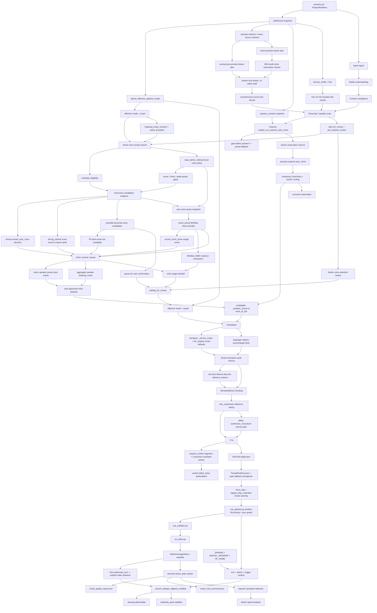

# GitNexus 工作流内核图

关联总图：`docs/graphs/GITNEXUS_PROJECT_GRAPH.md`

## 1. 范围

这张子图只看“主流水线如何形成 canonical outputs，以及 Smart / Studio 模式如何进入不同控制流”，重点是：

- `SemanticBlock` 仍然是 TTS / 对齐 / 字幕的基本处理单元
- 主对齐路径仍然是 `DSP-first alignment`
- Smart inline branch 已经在 `process.py` 内实装，包含 eligibility、voice review、P5 possible-match auto-reuse、translation audit metrics、handoff、terminal reports
- Smart Preview 是独立 teaser lane：创建前可预约 600 点 clone 成本，结果 stream-only，转完整后才进入完整 paid workflow
- Anonymous Preview 是营销漏斗 lane：未登录 direct/chunked upload 先进 APF admission，preview teaser 不能替代正式任务
- Smart 创建入口现在先经过 Gateway policy / consent 校验；pipeline 内部读取 app-safe admin policy，优先使用个人音色候选，再决定是否 reuse、clone 或暂停确认
- Express 快捷版新增可选 CosyVoice 自动克隆分支，必须满足 availability、server-confirmed consent、admin gate、reservation cap 后才会调用 worker
- Free tier 新增时长 fail-closed、MiMo voiceclone reference stamp、free watermark 与 restricted deliverables
- Phase 1a/1b reports 是 shadow-first 质量观测，不改变 `SemanticBlock` 和 DSP-first 主线
- language registry / job language fields 是 workflow 的输入事实，前端不应自建第二套语言规则
- paid fallback、force DSP、whisper deliverable sidecar 仍然受明确控制
- `derive_effective_pipeline_mode(...)` 决定 Smart job 是否继续走自动层，还是回到 Studio 控制流

## 2. 主图

## 3. 当前核心认知

### 3.1 `SemanticBlock` 仍然是主处理单元

- `process.py`、`output_dispatcher.py` 仍围绕 `aligned_blocks`、`captions`、`artifact_index` 组织输出。
- Smart 自动审核只决定是否继续、降级、clone/preset、是否转人工，不改变 TTS 单元。
- deliverable-time whisper helper 也是从 editor state 重建 block/cue，再走 deterministic cue pipeline。

结论：Smart、R2、Admin/Ops 的新增面没有改变“不要按 subtitle line 做 TTS / 对齐”的核心不变量。

### 3.2 effective mode 是 Smart / Studio 控制流入口

- `process.py` 在加载 `JobRecord` 后调用 `derive_effective_pipeline_mode(...)`。
- `record.service_mode` 继续保留真实审计身份，用于计费、审计、Job API 响应。
- `job_effective_pipeline_mode` 是 pipeline 内部决定是否进入 Smart 自动层的控制值。
- `downgraded_to_studio` 的 Smart job 后续 `/continue` 走 Studio 逻辑，不会重复进入 Smart auto-review。

结论：Smart job 降级后继续保留 Smart 审计事实，但控制流回到 Studio。

### 3.3 Preview lanes 只提供 teaser 与后续正式创建入口

- Anonymous Preview 在 create full job 前就经过 APF admission、probe 和 compliance，teaser 只用于营销试用。
- Smart Preview 可以在 admin gate 后进入 600 点 clone reservation，但结果仍是 stream-only 3 分钟 teaser。
- `reuse_anonymous_preview_id` 和 `reuse_preview_job_id` 都应由服务端解析源文件和上下文，前端只传 id。
- 转完整之后才进入正式 paid workflow、交付物、后编辑和结算边界。

结论：Preview lane 不改变 `SemanticBlock`、TTS、alignment 主线，也不能绕过正式任务权益。

### 3.4 Smart voice review 已经进入 workflow 主干

- eligibility gate 在 voice selection 阶段前执行，先筛出主说话人与被排除说话人。
- pipeline 通过 app-safe `read_admin_setting` 读取 `smart_auto_clone_enabled`、`smart_reuse_user_voice_enabled`、`smart_pause_on_possible_user_voice_match`，避免 app runtime 直接依赖 Gateway-only settings loader。
- pipeline 还读取 `smart_auto_reuse_on_possible_user_voice_match`；默认开启时，possible match 自动复用 top candidate，不再进入人工暂停。
- consent 与 admin policy 同时允许自动克隆时，pipeline 会抽样、校验样本、查询 user voice quota，再构造真实 `CloneProvider`。
- 克隆前会调用内部 `/api/internal/user-voices/candidates`，强匹配可以直接 `reused_user_voice`，不再消耗 clone 点数。
- 跨源唯一同名候选会被提升为 `strong_named`，也可自动复用。
- admin 关闭 P5 auto-reuse 且开启弱匹配暂停时，possible personal voice candidates 才会写入 review payload，等待用户确认，而不是继续静默 clone。
- MiniMax `status_code=1008 / insufficient balance / 余额不足` 被视为 provider exhaustion，进入 pause/handoff，不按普通 provider failure 重试到 preset。
- Smart 自动克隆成功后会写 `UsageMeter.record_voice_clone(...)`，避免 terminal cost summary 漏掉 pipeline 内真实克隆成本。
- quota 不可用、样本失败、provider pause、clone mirror 失败都会 fail-closed handoff。
- 非主说话人通过 `_resolve_smart_minor_speaker_voices(...)` 从 `auto_matched_voice` 解析 preset voice，并先聚合 segment-level `dubbing_mode`，避免 keep-original / mute-or-background 说话人被错误配音。
- Smart 自动通过后会把 `_speaker_voices` 明确写回 `voice_id_a / voice_id_b`，避免 translator/TTS 仍使用 `auto`。

结论：Smart voice review 现在是 workflow 内部的正式分支，不再只是服务模块骨架。

### 3.5 Smart translation review 现在是 audit-only metrics

- translation review 仍检查术语保留、speaker assignment、一致性、长度预算、checksum、不确定 speaker 占比、clone sample ratio。
- 2026-05-20 后，这些检查的失败只写入 advisory metrics，不再把 Smart 拉回人工审核。
- 内容合规已经前移到 early gate：非 admin blocked 直接失败退出，admin blocked 只发通知并继续。
- auto-approved translation 会继续落到 alignment/TTS 链路。
- translator 会带上 `_service_mode`，让 `llm_registry.get_prompt_model("smart", prompt_key)` 读取 Smart 专属默认模型或 admin override。

结论：Smart translation review 仍是 deterministic 质量观测点，但默认不是 human gate；Smart 全自动承诺优先。

### 3.6 主对齐策略依然是 DSP-first

- `src/services/alignment/aligner.py` 显式使用 `ThreadPoolExecutor`。
- paid fallback 由 semaphore 控制，不随线程数无限扩张。
- `force_dsp_alignment` 和 `capped_dsp_underflow` 继续输出 review / observability 信号。

结论：timing authority 仍在 deterministic 对齐链上，不交给 LLM。

### 3.7 terminal 阶段写 Smart reports

- happy-path Smart job 终态会写 `smart_quality_report.json` 和 `smart_cost_summary.json`。
- handoff 早退路径会尽量写 cost summary，并把 handoff 原因记录到 `smart_decisions.jsonl`。
- quality report 写入失败不阻断主流程，但用户侧可通过 JSONL synthesizer 看到 handoff 摘要。

结论：Smart reporting 已经是 workflow terminal 与 handoff 路径的一部分。

### 3.8 Phase 1a/1b reports 是 shadow-first 观测层

- `translation_quality.py` 在 shadow flag 下写 `reports/translation_quality_report.json`，只检测 wrong-script 风险，不改变翻译。
- `output_dispatcher.py` 写 `reports/subtitle_width_report.json` 和 `output/subtitle_quality_report.json`，为字幕宽度和 cue 质量提供证据。
- `transcript_reviewer.py` / `speaker_evidence.py` 写 speaker evidence JSONL，记录 speaker snapshot 的 changed/uncertain 决策。
- `sample_extractor.py` 可写 voice sample scoring shadow manifest，明确不改变实际 clone sample 选择。
- Job API `/jobs/{id}/reports` 只暴露白名单报告目录，admin report-analysis 再做跨任务汇总。

结论：这些 report 是 workflow 的旁路观测层，不替代 deterministic 主线和硬 gate。

### 3.9 whisper gate 仍然是部署能力 + admin policy + trigger context

- 部署能力：`.[whisper]`、`INSTALL_WHISPER`、`HF_HOME`
- admin policy：`whisper_alignment_enabled / trigger / skip_cache / model`
- trigger context：`publish / deliverable / manual`

结论：打开 admin 开关不等于节点一定具备 whisper runtime。

### 3.10 CosyVoice worker routing 已进入 TTS 主干

- `src/pipeline/process.py` 会从 review approve / voice-map enrichment 读取 `requires_worker / worker_target_model`，并写回 `DubbingSegment`。
- `requires_worker=True` 会强制段落使用 `tts_provider="cosyvoice"`，避免 job-level provider 或旧 snapshot 把克隆音色带到 MiniMax/VolcEngine 路径。
- `src/services/tts/tts_generator.py` 对 worker 段落调用 `_generate_one_cosyvoice_via_worker`，不允许静默 fallback 到 legacy CosyVoice 默认音色。
- worker 返回的 billed chars 是 authoritative，不能被普通字符估算覆盖。
- `src/services/tts/segment_regenerate.py` 对 worker 段落禁用 final retry loop，避免单段重试放大成多次付费 worker 调用。

结论：CosyVoice clone voice 已经不是普通 `voice_id`，而是带 worker routing 的 TTS 分支。

### 3.11 Express 自动克隆挂在主流程，但默认失败非致命

- `src/pipeline/process.py` 在 Express 非交互路径中调用 `maybe_run_express_auto_clone(...)`，它是自动克隆的唯一入口。
- `maybe_run_express_auto_clone` 先检查 admin 主开关、allowlist、server-confirmed `express_consent` 和主说话人阈值；任一失败都不构造真实 client。
- 通过 gate 后，`services.express.auto_clone` 依次执行 reserve、sample upload、worker clone、register-smart、consume，并把 worker routing 注入 speaker payload。
- clone 失败、样本不足、reservation denied、release 失败等都写 audit，但 Express 主任务继续走预设音色 fallback，不把快捷版任务直接打失败。
- 临时音色的到期删除不在 workflow 内做，而由 Gateway cleanup sweeper / CLI 异步治理。

结论：Express auto-clone 是 workflow 的可选增强层，不改变 `SemanticBlock`、TTS 对齐和剪映交付主线。

### 3.12 Free tier 在 workflow 内是硬 gate + 窄 TTS 分支

- `process.py` 对 `service_mode == "free"` 调用 `evaluate_free_duration_cap(...)`，缺失、非数字、NaN、inf、超 10 分钟都 fail-closed。
- free voiceclone 只在 `job_voice_strategy == "free_voiceclone"` 时调用 `stamp_segment_references(...)`，给可匹配 speaker 的 segment 写 `voiceclone_reference_path`。
- `TTSGenerator` 只有在 `_voice_strategy=free_voiceclone`、provider 为 MiMo、segment 有 reference path 时才调用 `_generate_one_mimo_voiceclone(...)`。
- free voiceclone fallback 必须 `force_mimo_preset=True`，避免 fallback 到 MiniMax/CosyVoice 等其他付费 provider。
- publish 阶段通过 `free_watermark_text_for(job_service_mode)` 把 watermark text 传入 output request，后续由 video renderer 加 drawtext。

结论：Free tier 不是改变 block/TTS/alignment 基本模型，而是在 workflow 上加时长、reference、MiMo voiceclone 和水印的受控分支。

## 4. 关键证据

- `src/pipeline/process.py`
  - `derive_effective_pipeline_mode`
  - preview markers and source reuse markers
  - `maybe_run_express_auto_clone` 调用点
  - free duration gate / voiceclone reference stamp / watermark wiring
  - early content compliance gate
  - admin compliance notify-only branch
  - `_fetch_smart_reusable_voice_match`
  - `_apply_smart_reused_voice_decision`
  - `_aggregate_speaker_dubbing_modes`
  - `_fetch_smart_user_voice_quota_remaining`
  - `_resolve_smart_minor_speaker_voices`
  - `_register_smart_clone_in_user_voices`
  - `_emit_smart_quality_report`
  - `_emit_smart_cost_summary`
- `src/services/admin_settings.py`
  - app-safe admin policy reads
- `gateway/user_voice_api.py`
  - internal UserVoice match and candidates endpoints
- `gateway/user_voice_service.py`
  - match scopes and candidate confidence
  - `strong_named` auto-reuse tier
- `src/services/usage_meter.py`
  - Smart auto clone usage recording
- `gateway/smart_consent.py`
  - Smart consent schema validator
- `gateway/smart_clone_reservation_service.py`
  - Smart preview clone reservation before provider call
- `gateway/anonymous_preview_api.py`
  - anonymous preview create / status / claim API
- `src/services/anonymous_preview_admission.py`
  - APF admission before preview job create
- `src/services/language_registry.py`
  - source/target language facts
- `gateway/express_consent.py`
  - Express consent schema validator
- `src/services/express/auto_clone.py`
  - Express reserve / clone / register / consume orchestration
- `src/services/express/pipeline_clients.py`
  - Express auto-clone real dependency wiring and gate
- `src/utils/free_duration_gate.py`
  - free 10-minute fail-closed gate
- `src/services/tts/voiceclone_reference.py`
  - per-speaker reference extraction and segment stamp
- `src/services/tts/mimo_tts_provider.py`
  - MiMo voiceclone primitive
- `src/utils/free_watermark.py`
  - free watermark policy
- `src/services/llm_registry.py`
  - Smart mode prompt model defaults and overrides
- `src/services/smart/state.py`
  - effective mode
  - editable Smart state
- `src/services/smart/eligibility_gate.py`
  - main speaker gate
- `src/services/smart/auto_voice_review.py`
  - clone / preset / pause orchestration
  - possible-match auto-reuse
  - MiniMax quota/balance exhaustion classifier
- `src/services/smart/auto_translation_review.py`
  - audit-only translation metrics
  - full-auto default
- `src/services/translation_quality.py`
  - translation quality report sidecar
- `src/services/speaker_evidence.py`
  - speaker evidence report sidecar
- `src/services/voice/sample_extractor.py`
  - voice sample scoring shadow manifest
- `src/services/jobs/api.py`
  - job reports catalog / report streaming endpoints
- `src/services/alignment/aligner.py`
  - parallel alignment
  - paid fallback semaphore
- `src/services/tts/tts_generator.py`
  - `requires_worker` dispatch
  - mainland worker billed chars preservation
- `src/services/tts/segment_regenerate.py`
  - worker segment retry guard
- `src/modules/subtitles/cue_pipeline.py`
  - window-first timing
  - sync guard
- `src/services/subtitles/ensure_whisper_alignment.py`
  - deliverable-time whisper sidecar

## 5. 什么时候优先读这张图

- 想改 `process.py` 主流水线
- 想改 Smart job 在 `/continue` 后走 Smart 还是 Studio
- 想改 anonymous preview 或 Smart preview 如何进入 teaser / convert-to-full
- 想改 Express 自动克隆是否进入 worker clone、什么时候 fallback 到预设音色、reservation 如何消费
- 想改 source/target language fact 如何进入 workflow
- 想改 free job 的 10 分钟 gate、MiMo voiceclone reference、paid API fallback 或水印传递
- 想改 Smart voice review、个人音色候选、P5 possible-match auto-reuse、弱匹配暂停、同源音色复用、translation review、handoff、terminal report
- 想改 CosyVoice clone voice 如何进入 TTS、preview 或 segment regenerate
- 想改 Phase 1a/1b report sidecars 或 Job API reports 目录
- 想改 DSP / paid fallback / force_dsp review 语义
- 想改 cue pipeline、SRT、deliverable-time whisper
