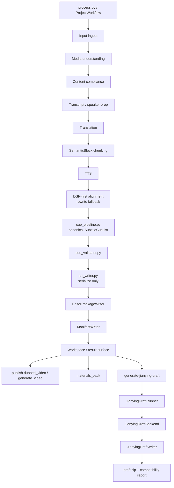

# GitNexus 工作流内核图

关联总图：`docs/graphs/GITNEXUS_PROJECT_GRAPH.md`

## 1. 范围

这张子图只看“主流水线如何形成 canonical output”，重点是：

- `SemanticBlock` 仍然是 TTS / 对齐 / 字幕的基本处理单元
- `Subtitle Cue V2` 已经并入输出主路径
- `Jianying draft` 不是替代主流水线，而是基于成功 Studio 任务的派生交付链

## 2. 主图

## 3. 现在的核心认知

### 3.1 cue v2 已经插到 editor write 之前

- `src/modules/output/output_dispatcher.py` 先构建 `ProjectOutput`
- 然后在 `editor_backend.write()` 前调用 `_generate_subtitle_cues(...)`
- `project_output.subtitle_cues = cue_result.cues`
- 之后才落盘 editor package

这意味着 editor / SRT 现在消费的是 canonical cues，而不是自己再做一次分段。

### 3.2 cue pipeline 仍然站在 deterministic 路径上

- `src/modules/subtitles/cue_pipeline.py` 从 `SemanticBlock + SubtitleLine` 出发，做的是 deterministic 的：
  - 文本拼接
  - 有效时长解析
  - cue 构建
  - validator 校验
- `src/modules/subtitles/srt_writer.py` 明确禁止 re-segmentation / re-timing，只做序列化

结论：字幕 retiming 仍然是数学 / 规则驱动，不是把 timing 再交给 LLM。

### 3.3 剪映草稿位于“成功 Studio 任务之后”的派生层

- `OutputDispatcher` 主路径先产出 editor package / manifest / publish artifacts
- `src/services/jobs/jianying_draft_runner.py` 再基于成功的 Studio job 触发按需生成
- `src/modules/output/jianying/jianying_draft_backend.py` 包装 writer + compatibility report

结论：剪映草稿交付已经很重要，但它并没有把主流水线改成“直接生成剪映草稿、跳过 editor canonical outputs”。

### 3.4 交付链现在是“三出口”

- `publish.dubbed_video`
- `materials_pack`
- `editor.jianying_draft_zip`

前两者是原来的视频/素材交付面；第三者是 Studio 结果页新增的派生交付面。

## 4. 关键证据

- `src/modules/output/output_dispatcher.py`
  - cue 生成在 `editor_backend.write()` 之前
  - `build_subtitle_cues_for_blocks(...)` 的输入来自 `semantic_blocks`
- `src/modules/subtitles/cue_pipeline.py`
  - 模块头部直接声明 `SemanticBlock list -> SubtitleCue list + ValidationReport`
- `src/modules/subtitles/srt_writer.py`
  - 模块头部直接声明“不重分段、不重定时，只序列化 canonical cues”
- `src/modules/output/manifest_writer.py`
  - `primary_outputs.editor` 里写入 `jianying_draft_zip / dir / compatibility_report`

## 5. 什么时候优先读这张图

- 想改 `process.py`、`OutputDispatcher`、`cue_pipeline.py`、`srt_writer.py`
- 想判断“剪映草稿是不是主流水线的一部分，还是后置派生层”
- 想确认 Subtitle Cue V2 在当前架构里到底处于什么位置
