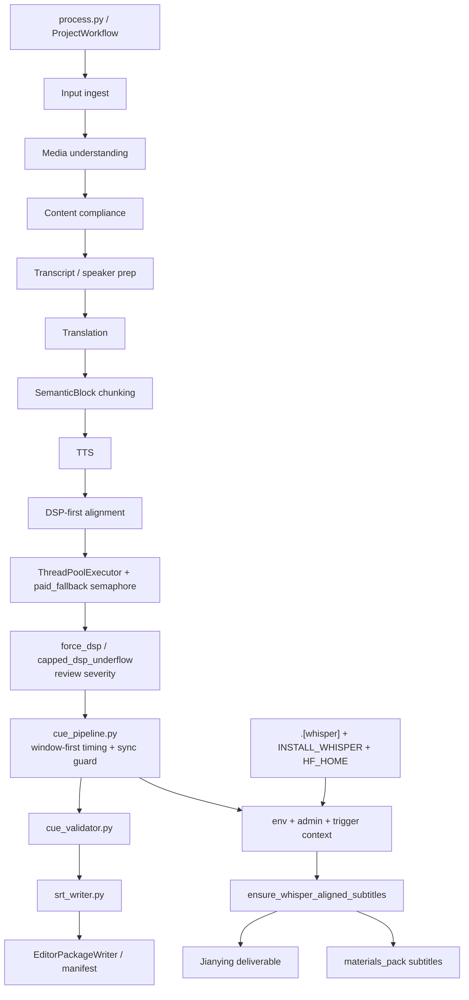

# GitNexus 工作流内核图

关联总图：`docs/graphs/GITNEXUS_PROJECT_GRAPH.md`

## 1. 范围

这张子图只看“主流水线如何形成 canonical outputs，以及交付前字幕如何被二次校正”，重点是：

- `SemanticBlock` 仍然是 TTS / 对齐 / 字幕的基本处理单元
- 主对齐路径仍然是 `DSP-first alignment`，不是把 timing 主导权交给 LLM
- 对齐实现现在已经是 `parallel executor + paid_fallback semaphore + force_dsp review semantics`
- whisper 是否可用，仍然要同时满足部署 capability 与运行时 policy

## 2. 主图

## 3. 当前核心认知

### 3.1 `SemanticBlock` 仍然是主处理单元

- `process.py` 与 `output_dispatcher.py` 仍然围绕 `aligned_blocks`、`captions`、`artifact_index` 组织输出
- deliverable-time whisper helper 也是从 `editor/segments.json` 重建 `SemanticBlock` 与 `SubtitleLine` 再走 cue pipeline

结论：这轮并发与 review 语义增强，没有把系统打回“按 subtitle line 做 TTS / 对齐”的旧模型。

### 3.2 主对齐策略依然是 DSP-first，但执行层已经并行化

- `src/services/alignment/aligner.py` 已经显式使用 `ThreadPoolExecutor`
- paid fallback 不是随线程无限并发，而是受 `paid_fallback_semaphore` 控制
- 代码注释明确把 paid fallback 视为慢 IO，Semaphore 是成本与供应商速率的硬边界

结论：工作流的 timing authority 仍在 deterministic 对齐链上，但吞吐与付费 fallback 已经被正式纳入调度策略。

### 3.3 `force_dsp` 现在是带 severity 的正式 review 语义

- `force_dsp_alignment` 可以从 admin settings 打开
- `capped_dsp_underflow` 统一分类为 `high severity`
- `process.py` 现在会导出：
  - `force_dsp_severity_distribution`
  - `force_dsp_review_suppressed_count`
  - `short_segment_force_dsp_count`
  - `capped_dsp_underflow_count`

结论：`force_dsp` 不再只是一个内部方法名，而是 review / observability 层可见的正式状态。

### 3.4 rewrite 侧也开始接收更明确的 rejection 语义，但 timing authority 仍未交给 LLM

- `process.py` 现在会把 `strict_retry_reason` 传进 rewriter
- `src/services/gemini/rewriter.py` 在 compact retry 路径上接收这个 reason，用于更明确地表达为什么第一次压缩失败

结论：LLM 被用于“文本修正”，不是“最终时间轴决策”；项目的 deterministic retiming 不变量仍然成立。

### 3.5 whisper gate 仍然是“部署 capability + admin policy + trigger context”三层语义

- 部署 capability：`faster-whisper` 只在 `.[whisper]` extra 安装后可用；Docker 通过 `INSTALL_WHISPER` 决定是否装进镜像，并通过 `HF_HOME` 复用模型缓存
- admin policy：`whisper_alignment_enabled / trigger / skip_cache / model`
- trigger context：`publish / deliverable / manual`

结论：whisper 已经不是简单的运行时开关，而是一条受部署与策略共同约束的交付 sidecar。

### 3.6 Jianying 与 `materials_pack` 仍然共享同一条交付侧路

- `JianyingDraftRunner` 在 `aligning_subtitles` 子步骤里调用 ensure helper
- `gateway/background_task_executors.py` 会在 `materials_pack` 选择了 `subtitles` 时，先通过内部 HTTP 调用 Job API 的 ensure endpoint

结论：两种交付方式现在共享同一份字幕精对齐语义，不再各自维护一套逻辑。

## 4. 关键证据

- `src/services/alignment/aligner.py`
  - `ThreadPoolExecutor`
  - `paid_fallback_semaphore`
  - `force_dsp_alignment`
  - `capped_dsp_underflow`
- `src/pipeline/process.py`
  - `force_dsp_severity_distribution`
  - `strict_retry_reason`
- `src/services/gemini/rewriter.py`
  - compact retry `strict_retry_reason`
- `src/modules/subtitles/cue_pipeline.py`
  - `publish / deliverable / manual` trigger gate
  - `_block_is_in_sync()`
- `src/services/subtitles/ensure_whisper_alignment.py`
  - 重写 `subtitle_cues.json` 与 SRT
- `src/services/jobs/jianying_draft_runner.py`
  - `SUBSTEP_ALIGNING_SUBTITLES`
- `gateway/background_task_executors.py`
  - `materials_pack` 预打包 whisper delegation

## 5. 什么情况下优先读这张图

- 想改 `aligner.py`、`process.py`、`cue_pipeline.py`、`ensure_whisper_alignment.py`
- 想判断 parallel alignment 是否改变了项目的 DSP-first 架构不变量
- 想确认 `force_dsp` / `capped_dsp_underflow` 现在在哪一层变成 review 语义
- 想搞清楚 `publish / deliverable / manual` 三种 whisper 触发策略的边界
