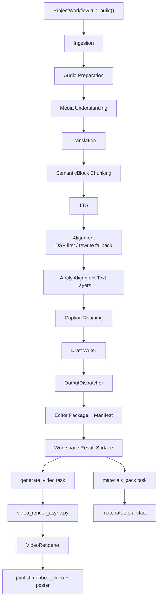

# GitNexus 工作流内核图

关联总图：`docs/graphs/GITNEXUS_PROJECT_GRAPH.md`

## 1. 范围

这张子图聚焦两条相关但不同的链路：

- 主工作流内核：从输入到 Jianying draft
- 任务完成后的导出平面：materials pack 与 generate video

其中第一条是主流程，第二条是用户显式触发的后处理侧轴。

## 2. 工作流主图

## 3. 主流程仍然是 Draft-first

`src/modules/workflow/project_workflow.py` 中 `run_build()` 的顺序仍然是：

1. `_run_ingestion_stage()`
2. `_run_audio_preparation_stage()`
3. `_run_media_understanding_stage(subtitle_lines)`
4. `_run_translation_stage(source_lines)`
5. `_run_chunking_stage(translated_lines)`
6. `_run_alignment_stage(blocks)`
7. `_apply_alignment_text_layers(translated_lines, aligned_blocks)`
8. `_run_draft_stage(translated_lines, aligned_blocks)`

这条顺序继续保证：

- TTS 单位仍然是 `SemanticBlock`
- Alignment 仍然是 chunking 之后的阶段
- Caption retiming 仍然是确定性处理
- 主交付仍然是 draft，而不是把视频渲染塞回主流水线中心

## 4. OutputDispatcher 的位置

`src/modules/output/output_dispatcher.py` 当前职责是：

- 读取 canonical `LocalizedProject`
- 先写 editor backend
- 再按 `OutputTarget` 决定是否执行 publish backend
- 最后写 manifest 并回填 artifact index

这说明 `OutputDispatcher` 不是替代 `project_workflow.py`，而是把“已完成的 canonical localized project”分发到输出后端。

## 5. 异步导出平面

### 5.1 前端入口

- `frontend-next/src/components/workspace/ResultMediaCard.tsx` 使用 `useBackgroundTask()` 管理：
  `materials_pack`
  `generate_video`
- `frontend-next/src/lib/api/downloads.ts` 提供：
  `buildTaskCreateUrl()`
  `buildTaskStatusUrl()`
  `buildTaskDownloadUrl()`
  `computeParamsFingerprint()`

### 5.2 Gateway 任务控制

- `gateway/background_task_api.py` 提供任务创建、查询、latest restore、下载接口
- `gateway/background_task_queue.py` 通过 `params_fingerprint` 做：
  dedupe
  latest state restore

这使“同一个 job、同一组参数”的导出任务具备可恢复状态，而不是重复生成。

### 5.3 视频生成闭环

- `src/services/jobs/video_render_async.py` 在后台线程中调用 `VideoRenderer().render(...)`
- 它把状态写到 `publish/render_status.json`
- `src/modules/output/publish/video_renderer.py` 现在支持：
  progress callback
  ambient audio 混音
  poster 生成

`src/services/jobs/api.py` 再把这些产物公开成：

- `stream/video`
- `stream/audio`
- `stream/poster`
- `generate-video/{task_id}` 状态查询

## 6. 当前结构含义

这套结构的关键边界是：

- 工作流成功后，先稳定落盘 editor/draft/manifest
- 结果页再决定是否异步打包素材或生成可播放视频
- 这样不会把 FFmpeg、zip、长耗时导出逻辑塞回主 pipeline 阻塞点

## 7. 这张图适合回答什么问题

- 为什么主流程仍然是 draft-first
- `OutputDispatcher` 在整个流程里到底处于什么层级
- 为什么视频导出现在是后台任务，不是主 pipeline 内同步步骤
- 结果页里的 materials pack 和 generate video 分别落到哪里
