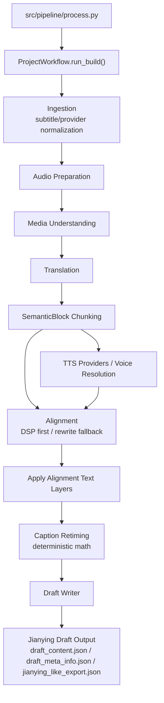

# GitNexus 工作流内核图

关联总图：`docs/graphs/GITNEXUS_PROJECT_GRAPH.md`

## 1. 范围

这张子图只看从输入到剪映草稿输出的工作流内核，重点是：

- `Ingestion`
- `Media Understanding`
- `Translation`
- `SemanticBlock Chunking`
- `TTS`
- `Alignment`
- `Caption Retiming`
- `Draft Writer`

不展开商业化、审核页 UI 和 admin 运维面，只保留和主流程强相关的桥接点。

## 2. 工作流主图

## 3. 阶段顺序证据

`src/modules/workflow/project_workflow.py` 中 `run_build()` 的执行顺序是：

1. `_run_ingestion_stage()`
2. `_run_audio_preparation_stage()`
3. `_run_media_understanding_stage(subtitle_lines)`
4. `_run_translation_stage(source_lines)`
5. `_run_chunking_stage(translated_lines)`
6. `_run_alignment_stage(blocks)`
7. `_apply_alignment_text_layers(translated_lines, aligned_blocks)`
8. `_run_draft_stage(translated_lines, aligned_blocks)`

这条链确认了几个架构事实：

- TTS 单位不是字幕行，而是 `SemanticBlock`
- 对齐发生在 chunking 之后，不是翻译后直接出字幕
- Draft 输出是流程终点，主交付物仍是剪映草稿，而不是直接 MP4

## 4. 模块职责拆分

### 4.1 Ingestion / Media Understanding / Translation

- `Ingestion` 聚类负责字幕、provider、输入归一化。
- `Media_understanding` 聚类负责源内容理解和素材信息整理。
- `Translation` 聚类负责翻译与译后结果清洗。

这三块共同决定后续 `SemanticBlock` 的语义切分边界。

### 4.2 SemanticBlock -> TTS -> Alignment

- `project_workflow.py` 中 `_run_chunking_stage(translated_lines)` 直接产出 `list[SemanticBlock]`。
- 之后 `_run_alignment_stage(blocks)` 消费的也是 `SemanticBlock`。
- `Alignment` 聚类和 `src/services/alignment/aligner.py` 仍然代表“DSP first，rewrite second”的策略边界。

### 4.3 Caption Retiming -> Draft Writer

- `src/modules/draft/caption_retiming.py` 的 `CaptionRetimer` 文档字符串明确写的是：
  “Retimes captions by linearly scaling original intra-block timing.”
- `CaptionRetimingConfig` 和 `RetimedCaption` 说明字幕时间是计算得出，不是 prompt 生成。
- `src/modules/draft/draft_writer.py` 负责写出：
  `draft_content.json`
  `draft_meta_info.json`
  `jianying_like_export.json`

## 5. 关键链路

### 5.1 Pipeline 阶段衔接

GitNexus 的 `Pipeline` 聚类当前集中在 `src/pipeline/process.py` 附近，包含：

- `_load_probe_cache`
- `_run_probe_translation`
- `_calibrate_tts_duration`
- `_build_process_output_captions`
- `_build_process_workflow_build_result`

这说明 `process.py` 主要承担“阶段拼装和 payload 衔接”，而不是替代 `project_workflow.py` 本身。

### 5.2 对齐后再生成字幕层

`project_workflow.py` 在 `_run_alignment_stage(blocks)` 之后还有 `_apply_alignment_text_layers(...)`，随后才进入 `_run_draft_stage(...)`。

这意味着：

- 先得到块级对齐结果
- 再把文本层和字幕层挂回去
- 最后才进入草稿写出

## 6. 这张图适合回答什么问题

- 为什么 TTS 单位是 `SemanticBlock` 而不是 subtitle line
- 为什么对齐要放在 chunking 之后
- 为什么 subtitle retiming 仍然应该保持确定性逻辑
- 为什么主输出是 Jianying draft，而不是直接 rendered MP4
