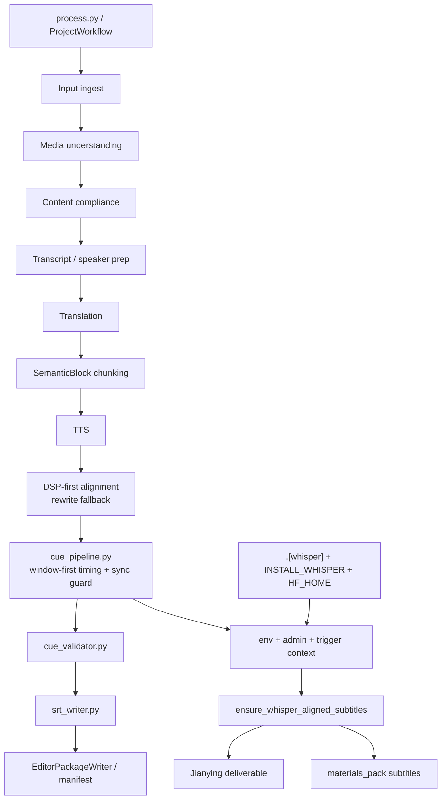

# GitNexus 工作流内核图

关联总图：`docs/graphs/GITNEXUS_PROJECT_GRAPH.md`

## 1. 范围

这张子图只看“主流水线如何形成 canonical outputs，以及交付前字幕如何被二次校正”，重点是：

- `SemanticBlock` 仍然是 TTS / 对齐 / 字幕的基本处理单元
- 主对齐路径仍然是 `DSP-first alignment`，不是把 timing 主导权交给 LLM
- `cue_pipeline` 继续承担 `SRT-window-first timing` 与交付前的 whisper 对齐 sidecar 入口
- whisper 是否可用，现在要同时满足部署 capability 与运行时 policy

## 2. 主图

## 3. 当前核心认知

### 3.1 `SemanticBlock` 仍然是主处理单元

- `process.py` 与 `output_dispatcher.py` 仍然围绕 `aligned_blocks`、`captions`、`artifact_index` 组织输出
- deliverable-time whisper helper 也是从 `editor/segments.json` 重建 `SemanticBlock` 与 `SubtitleLine` 再走 cue pipeline

结论：whisper 侧路没有把系统打回“按 subtitle line 做 TTS / 对齐”的旧模型。

### 3.2 主对齐策略依然是 DSP-first，whisper 只改交付字幕

- `ensure_whisper_alignment.py` 只负责重写 `output/subtitle_cues.json` 与 SRT 文件
- 它不会重跑主 TTS，也不会替换 `aligner.py` 的 DSP-first 主路
- collector / analyzer 也明确把 whisper coverage 建立在交付字幕的 `cues[].source` 上，而不是 workflow alignment cache

结论：项目的架构不变量没有变，新增的是“交付前字幕精校”的正式 sidecar。

### 3.3 whisper gate 现在是“部署 capability + admin policy + trigger context”三层语义

- 部署 capability：`faster-whisper` 只在 `.[whisper]` extra 安装后可用；Docker 通过 `INSTALL_WHISPER` 开关决定是否装进镜像，并通过 `HF_HOME` 复用模型缓存
- admin policy：`whisper_alignment_enabled / trigger / skip_cache / model`
- trigger context：`publish / deliverable / manual`

当前 trigger 语义：
- `publish`：允许 publish、deliverable、manual 三个 context
- `deliverable`：只允许 deliverable、manual；publish 阶段跳过
- `manual`：不允许自动触发，只保留管理员专用入口

结论：whisper 已经不是简单的运行时开关，而是一条受部署与策略共同约束的交付 sidecar。

### 3.4 `tts_input_cn_text` 仍然是 subtitle sync 的核心 guard

- `cue_pipeline.py::_block_is_in_sync()` 比较的是 `tts_input_cn_text` 与当前 `merged_cn_text`
- 空 `tts_input_cn_text` 被视为 in-sync；文本改了但音频没重做的 block 会被挡在 whisper path 之外
- commit 边界上由 `editing_commit.py` 负责把真正重生成后的 segment 重打标

结论：系统现在显式区分“字幕文本修改”与“音频已经跟上”的状态，避免拿旧音频做新文本的精对齐。

### 3.5 Jianying 与 `materials_pack` 已经共享同一条交付侧路

- `JianyingDraftRunner` 在 `aligning_subtitles` 子步骤里调用 ensure helper
- `gateway/background_task_executors.py` 会在 `materials_pack` 选择了 `subtitles` 时，先通过内部 HTTP 调用 Job API 的 ensure endpoint

结论：两种交付方式现在共享同一份字幕精对齐语义，不再各自维护一套逻辑。

## 4. 关键证据

- `src/modules/subtitles/cue_pipeline.py`
  - `publish / deliverable / manual` trigger gate
  - `_block_is_in_sync()`
  - `model / skip_cache` 从 admin settings 注入 whisper path
- `src/services/subtitles/ensure_whisper_alignment.py`
  - 读取 `editor/segments.json`
  - 计算当前 WAV 内容哈希
  - 重写 `subtitle_cues.json` 与 SRT
- `src/services/jobs/jianying_draft_runner.py`
  - `SUBSTEP_ALIGNING_SUBTITLES`
  - deliverable-time ensure 调用
- `gateway/background_task_executors.py`
  - `materials_pack` 预打包 whisper delegation
- `pyproject.toml`、`Dockerfile`、`docker-compose.yml`
  - `.[whisper]`
  - `INSTALL_WHISPER`
  - `HF_HOME`

## 5. 什么情况下优先读这张图

- 想改 `cue_pipeline.py`、`ensure_whisper_alignment.py`、`srt_writer.py`
- 想判断 whisper 对齐到底属于主路还是 sidecar
- 想确认 `tts_input_cn_text` 现在在哪一层产生语义作用
- 想搞清楚 `publish / deliverable / manual` 三种触发策略的边界
- 想排查“本机为什么没法跑 whisper 对齐”这类 capability vs policy 问题
