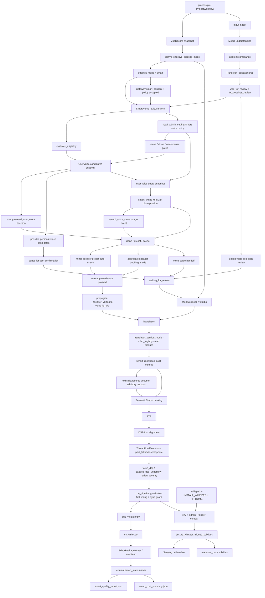

# GitNexus 工作流内核图

关联总图：`docs/graphs/GITNEXUS_PROJECT_GRAPH.md`

## 1. 范围

这张子图只看“主流水线如何形成 canonical outputs，以及 Smart / Studio 模式如何进入不同控制流”，重点是：

- `SemanticBlock` 仍然是 TTS / 对齐 / 字幕的基本处理单元
- 主对齐路径仍然是 `DSP-first alignment`
- Smart inline branch 已经在 `process.py` 内实装，包含 eligibility、voice review、translation audit metrics、handoff、terminal reports
- Smart 创建入口现在先经过 Gateway policy / consent 校验；pipeline 内部读取 app-safe admin policy，优先使用个人音色候选，再决定是否 clone 或暂停确认
- paid fallback、force DSP、whisper deliverable sidecar 仍然受明确控制
- `derive_effective_pipeline_mode(...)` 决定 Smart job 是否继续走自动层，还是回到 Studio 控制流

## 2. 主图

## 3. 当前核心认知

### 3.1 `SemanticBlock` 仍然是主处理单元

- `process.py`、`output_dispatcher.py` 仍围绕 `aligned_blocks`、`captions`、`artifact_index` 组织输出。
- Smart 自动审核只决定是否继续、降级、clone/preset、是否转人工，不改变 TTS 单元。
- deliverable-time whisper helper 也是从 editor state 重建 block/cue，再走 deterministic cue pipeline。

结论：Smart、R2、Admin/Ops 的新增面没有改变“不要按 subtitle line 做 TTS / 对齐”的核心不变量。

### 3.2 effective mode 是 Smart / Studio 控制流入口

- `process.py` 在加载 `JobRecord` 后调用 `derive_effective_pipeline_mode(...)`。
- `record.service_mode` 继续保留真实审计身份，用于计费、审计、Job API 响应。
- `job_effective_pipeline_mode` 是 pipeline 内部决定是否进入 Smart 自动层的控制值。
- `downgraded_to_studio` 的 Smart job 后续 `/continue` 走 Studio 逻辑，不会重复进入 Smart auto-review。

结论：Smart job 降级后继续保留 Smart 审计事实，但控制流回到 Studio。

### 3.3 Smart voice review 已经进入 workflow 主干

- eligibility gate 在 voice selection 阶段前执行，先筛出主说话人与被排除说话人。
- pipeline 通过 app-safe `read_admin_setting` 读取 `smart_auto_clone_enabled`、`smart_reuse_user_voice_enabled`、`smart_pause_on_possible_user_voice_match`，避免 app runtime 直接依赖 Gateway-only settings loader。
- consent 与 admin policy 同时允许自动克隆时，pipeline 会抽样、校验样本、查询 user voice quota，再构造真实 `CloneProvider`。
- 克隆前会调用内部 `/api/internal/user-voices/candidates`，强匹配可以直接 `reused_user_voice`，不再消耗 clone 点数。
- admin 开启弱匹配暂停时，possible personal voice candidates 会写入 review payload，等待用户确认，而不是继续静默 clone。
- Smart 自动克隆成功后会写 `UsageMeter.record_voice_clone(...)`，避免 terminal cost summary 漏掉 pipeline 内真实克隆成本。
- quota 不可用、样本失败、provider pause、clone mirror 失败都会 fail-closed handoff。
- 非主说话人通过 `_resolve_smart_minor_speaker_voices(...)` 从 `auto_matched_voice` 解析 preset voice，并先聚合 segment-level `dubbing_mode`，避免 keep-original / mute-or-background 说话人被错误配音。
- Smart 自动通过后会把 `_speaker_voices` 明确写回 `voice_id_a / voice_id_b`，避免 translator/TTS 仍使用 `auto`。

结论：Smart voice review 现在是 workflow 内部的正式分支，不再只是服务模块骨架。

### 3.4 Smart translation review 现在是 audit-only metrics

- translation review 仍检查术语保留、speaker assignment、一致性、长度预算、checksum、不确定 speaker 占比、clone sample ratio。
- 2026-05-20 后，这些检查的失败只写入 advisory metrics，不再把 Smart 拉回人工审核。
- 内容合规已经前移到 early gate：非 admin blocked 直接失败退出，admin blocked 只发通知并继续。
- auto-approved translation 会继续落到 alignment/TTS 链路。
- translator 会带上 `_service_mode`，让 `llm_registry.get_prompt_model("smart", prompt_key)` 读取 Smart 专属默认模型或 admin override。

结论：Smart translation review 仍是 deterministic 质量观测点，但默认不是 human gate；Smart 全自动承诺优先。

### 3.5 主对齐策略依然是 DSP-first

- `src/services/alignment/aligner.py` 显式使用 `ThreadPoolExecutor`。
- paid fallback 由 semaphore 控制，不随线程数无限扩张。
- `force_dsp_alignment` 和 `capped_dsp_underflow` 继续输出 review / observability 信号。

结论：timing authority 仍在 deterministic 对齐链上，不交给 LLM。

### 3.6 terminal 阶段写 Smart reports

- happy-path Smart job 终态会写 `smart_quality_report.json` 和 `smart_cost_summary.json`。
- handoff 早退路径会尽量写 cost summary，并把 handoff 原因记录到 `smart_decisions.jsonl`。
- quality report 写入失败不阻断主流程，但用户侧可通过 JSONL synthesizer 看到 handoff 摘要。

结论：Smart reporting 已经是 workflow terminal 与 handoff 路径的一部分。

### 3.7 whisper gate 仍然是部署能力 + admin policy + trigger context

- 部署能力：`.[whisper]`、`INSTALL_WHISPER`、`HF_HOME`
- admin policy：`whisper_alignment_enabled / trigger / skip_cache / model`
- trigger context：`publish / deliverable / manual`

结论：打开 admin 开关不等于节点一定具备 whisper runtime。

## 4. 关键证据

- `src/pipeline/process.py`
  - `derive_effective_pipeline_mode`
  - early content compliance gate
  - admin compliance notify-only branch
  - `_fetch_smart_reusable_voice_match`
  - `_apply_smart_reused_voice_decision`
  - `_aggregate_speaker_dubbing_modes`
  - `_fetch_smart_user_voice_quota_remaining`
  - `_resolve_smart_minor_speaker_voices`
  - `_register_smart_clone_in_user_voices`
  - `_emit_smart_quality_report`
  - `_emit_smart_cost_summary`
- `src/services/admin_settings.py`
  - app-safe admin policy reads
- `gateway/user_voice_api.py`
  - internal UserVoice match and candidates endpoints
- `gateway/user_voice_service.py`
  - match scopes and candidate confidence
- `src/services/usage_meter.py`
  - Smart auto clone usage recording
- `gateway/smart_consent.py`
  - Smart consent schema validator
- `src/services/llm_registry.py`
  - Smart mode prompt model defaults and overrides
- `src/services/smart/state.py`
  - effective mode
  - editable Smart state
- `src/services/smart/eligibility_gate.py`
  - main speaker gate
- `src/services/smart/auto_voice_review.py`
  - clone / preset / pause orchestration
- `src/services/smart/auto_translation_review.py`
  - audit-only translation metrics
  - full-auto default
- `src/services/alignment/aligner.py`
  - parallel alignment
  - paid fallback semaphore
- `src/modules/subtitles/cue_pipeline.py`
  - window-first timing
  - sync guard
- `src/services/subtitles/ensure_whisper_alignment.py`
  - deliverable-time whisper sidecar

## 5. 什么时候优先读这张图

- 想改 `process.py` 主流水线
- 想改 Smart job 在 `/continue` 后走 Smart 还是 Studio
- 想改 Smart voice review、个人音色候选、弱匹配暂停、同源音色复用、translation review、handoff、terminal report
- 想改 DSP / paid fallback / force_dsp review 语义
- 想改 cue pipeline、SRT、deliverable-time whisper
