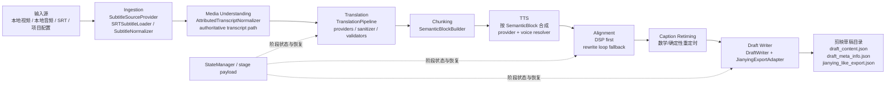

# GitNexus 工作流内核图

关联总图：`docs/graphs/GITNEXUS_PROJECT_GRAPH.md`

## 1. 范围

这张子图只看项目的生产主链，不展开营销、计费和管理后台。目标是回答两个问题：

1. 视频翻译主流程在代码里如何串起来。
2. 为什么当前主产物是剪映草稿，而不是直接渲染 MP4。

## 2. GitNexus 聚类焦点

| 聚类 | 符号数 | 代表成员 |
| --- | ---: | --- |
| Workflow | 87 | `src/modules/workflow/project_workflow.py`、`translation_stage_runner.py`、`draft_stage_runner.py` |
| Ingestion | 19 | `src/modules/ingestion/providers.py`、`srt_loader.py`、`normalizer.py` |
| Media_understanding | 70 | `src/modules/media_understanding/providers.py`、`normalizer.py` |
| Translation | 48 | `src/modules/translation/providers.py`、`sanitizer.py`、`validators.py` |
| Pipeline | 20 | `src/pipeline/process.py` |
| Tts | 59 | `src/services/tts/voice_match_resolver.py`、`minimax_voice_selector.py`、`volcengine_voice_catalog.py` |
| Alignment | 30 | `src/services/alignment/aligner.py`、`src/modules/alignment/alignment_orchestrator.py` |
| Draft | 51 | `src/modules/draft/draft_writer.py`、`caption_retiming.py`、`jianying_adapter.py` |

## 3. 工作流内核图

## 4. 真实入口顺序

源码中的 `ProjectWorkflow.run_build()` 已经把主链顺序写死，顺序如下：

1. `self._run_ingestion_stage()`
2. `self._run_audio_preparation_stage()`
3. `self._run_media_understanding_stage(subtitle_lines)`
4. `self._run_translation_stage(source_lines)`
5. `self._run_chunking_stage(translated_lines)`
6. `self._run_alignment_stage(blocks)`
7. `self._apply_alignment_text_layers(translated_lines, aligned_blocks)`
8. `self._run_draft_stage(translated_lines, aligned_blocks)`

这条顺序来自 `src/modules/workflow/project_workflow.py`，不是文档推断。

## 5. GitNexus 证据链

### 5.1 Workflow 阶段状态读取链

GitNexus process：`Run → StateError`

1. `src/modules/workflow/alignment_stage_runner.py:run`
2. `_read_source_input_hash`
3. `src/modules/workflow/stage_helpers.py:get_stage_payload_value`
4. `src/services/state_manager.py:get_stage`
5. `src/services/state_manager.py:load`
6. `_normalize_state`
7. `_normalize_status`
8. `src/core/exceptions.py:StateError`

这说明对齐阶段并不是黑盒脚本，而是显式依赖阶段状态和 payload 恢复机制。

### 5.2 Draft 聚类的输出边界

GitNexus 在 `Draft` 聚类中识别到的关键成员包括：

1. `src/modules/draft/draft_writer.py:resolve_draft_dir`
2. `src/modules/draft/draft_writer.py:load_existing_result`
3. `src/modules/draft/draft_writer.py:build_project`
4. `src/modules/draft/caption_retiming.py:retime_block`
5. `src/modules/draft/jianying_adapter.py:adapt`
6. `src/modules/draft/export_validator.py:_validate_track_segments`

这条链清楚说明：末端不是“直接导出 MP4”，而是“重定时字幕 + 构建草稿数据 + 适配剪映导出结构 + 校验”。

## 6. 架构不变量

这条主链在当前仓库里有几个非常稳定的不变量：

1. TTS 单位是 `SemanticBlock`，不是字幕单行。
2. 对齐策略是 DSP 优先，rewrite loop 只是 fallback。
3. 字幕重定时是数学/确定性处理，不是 LLM 驱动。
4. 主产物是剪映草稿目录与导出结构，不是直接渲染 MP4。

## 7. 对代码的阅读建议

如果要沿这条线继续深挖，优先阅读顺序建议是：

1. `src/modules/workflow/project_workflow.py`
2. `src/modules/translation/providers.py`
3. `src/services/alignment/aligner.py`
4. `src/modules/draft/caption_retiming.py`
5. `src/modules/draft/draft_writer.py`
