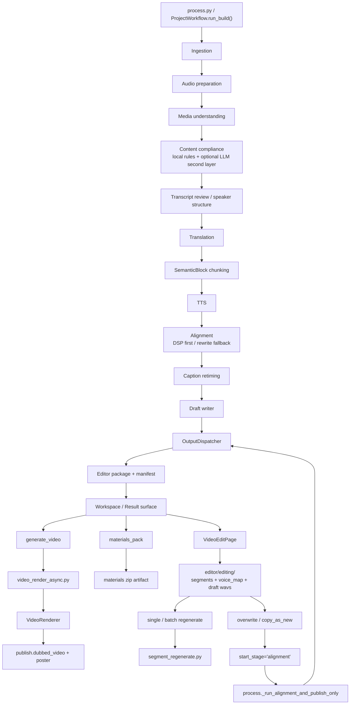

# GitNexus 工作流内核图

关联总图：`docs/graphs/GITNEXUS_PROJECT_GRAPH.md`

## 1. 范围

这张子图聚焦四条相关但不同的链路：

- 主工作流内核：从输入到 Jianying draft
- 主链前面的内容合规 gate
- 任务完成后的导出平面：`materials_pack` 与 `generate_video`
- 成功任务进入的 post-edit 回路：`editing -> regenerate -> commit -> alignment-only resume`

其中第一条是主流程，后两条都是围绕主流程的后处理侧轴；内容合规 gate 则是主流程前部的新阻断点。

## 2. 工作流主图

## 3. Draft-first 主骨架没有变

`src/modules/workflow/project_workflow.py` 中的本体顺序仍然围绕：

1. `_run_ingestion_stage()`
2. `_run_audio_preparation_stage()`
3. `_run_media_understanding_stage(subtitle_lines)`
4. `_run_translation_stage(source_lines)`
5. `_run_chunking_stage(translated_lines)`
6. `_run_alignment_stage(blocks)`
7. `_run_draft_stage(translated_lines, aligned_blocks)`

这条顺序继续保证：

- TTS 单位仍然是 `SemanticBlock`
- Alignment 仍然是 chunking 之后的阶段
- Caption retiming 仍然是确定性处理
- 主交付仍然是 draft，而不是把视频渲染塞回主流水线中心

## 4. 新增的内容合规 gate

### 4.1 位置

- `src/pipeline/process.py` 在 `media_understanding` 之后设置 stage 为 running
- 然后立即构造 `content_compliance_llm`
- 随后调用 `_run_content_compliance_review(...)`
- 只有通过后才继续 transcript review / translation 相关逻辑

### 4.2 语义

- `_run_content_compliance_review()` 先跑 `MainlandChinaContentComplianceReviewer`
- 若本地规则未明确拦截，且开关开启，再跑 `LLMContentComplianceReviewer`
- LLM 路径通过 `_call_content_compliance_llm_with_retry(...)` 做 retry / peer model 退让
- 最终报告写到 `compliance/content_review.json`
- 若结果 blocked，会抛 `ContentPolicyViolationError`

### 4.3 落盘与产物

- `process.py` 会把 `content_compliance` 放进 media-understanding stage payload
- artifact index 额外记录 `state.content_compliance`

结论：这不是营销或 admin sidecar，而是主 pipeline 前部新增的一道显式 gate。

## 5. OutputDispatcher 的位置

`src/modules/output/output_dispatcher.py` 当前职责仍然是：

- 读取 canonical `LocalizedProject`
- 先写 editor backend
- 再按 `OutputTarget` 决定是否执行 publish backend
- 最后写 manifest 并回填 artifact index

这说明 `OutputDispatcher` 不是替代 `project_workflow.py`，而是把“已完成的 canonical localized project”分发到输出后端。

## 6. 导出平面

### 6.1 前端入口

- `frontend-next/src/components/workspace/ResultMediaCard.tsx` 继续通过 `useBackgroundTask()` 管理：
  `materials_pack`
  `generate_video`
- `frontend-next/src/app/(app)/projects/page.tsx` 现在改成分页拉取 `listJobsPage(limit, offset)`，但导出入口仍然落在结果卡片与 workspace 表面

### 6.2 Gateway 任务控制

- `gateway/background_task_api.py` 提供任务创建、查询、latest restore、下载接口
- `gateway/background_task_queue.py` 通过 `params_fingerprint` 做：
  dedupe
  latest state restore

这使“同一个 job、同一组参数”的导出任务具备可恢复状态，而不是重复生成。

## 7. Post-Edit 回路

### 7.1 editing buffer 是独立工作区

- `src/services/jobs/editing.py` 定义：
  `enter_editing()`：`succeeded -> editing`
  `cancel_editing()`：`editing -> succeeded`
- 可变文件都放在 `editor/editing/` 下，而不是直接改 baseline
- `src/services/jobs/editing_segments.py` 维护段级状态：
  `accepted`
  `text_dirty`
  `tts_loading`
  `tts_dirty`
  `tts_failed`
  `voice_dirty`

### 7.2 regenerate 仍受原有付费约束

- `src/services/tts/segment_regenerate.py` 明确要求只能从 user-initiated editing path 调用
- 它会重试同一个 provider，不会 silent fallback 到别的 provider

这保证 post-edit 不会绕过既有的付费 API 触发边界。

### 7.3 commit 重新并回 alignment / publish

- `src/services/jobs/editing_commit.py` 的 `overwrite` 会把 editing buffer 提升到 baseline，然后以 `start_stage='alignment'` 重新提交 runner
- `copy_as_new` 则准备新 `job_id / project_dir`，再以相同的 `alignment` 起点启动新任务
- `src/pipeline/process.py` 明确支持 `resume_from == STAGE_ALIGNMENT` 时走 `_run_alignment_and_publish_only(config)`

结论：post-edit 不是重新跑 ingestion / translation 主链，而是以“对齐与发布重发”为核心的增量回路。

## 8. 当前结构含义

这套结构的关键边界是：

- workflow 主骨架仍然是 Draft-first
- 内容合规 gate 在翻译前阻断，不改写 Draft-first 的主骨架
- 结果页再决定是否异步打包素材或生成可播放视频
- Studio 修改进入独立 editing buffer，最后并回 `alignment -> publish`

因此，无论导出、post-edit 还是内容合规，都没有把 FFmpeg、zip、长耗时任务或可变编辑态塞回主 pipeline 的最前面。

## 9. 这张图适合回答什么问题

- 为什么主流程仍然是 draft-first
- 内容合规 gate 究竟插在主流程哪里，会不会阻断翻译
- `OutputDispatcher` 在整个流程里到底处于什么层级
- 为什么 post-edit 是 `alignment-only resume`，而不是整条流水线重跑
- 结果页里的 `materials_pack`、`generate_video`、`VideoEditPage` 分别接到哪里
