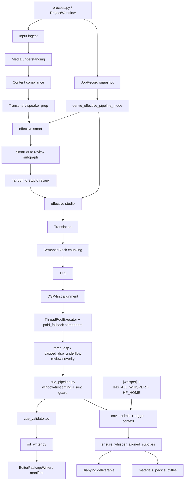

# GitNexus 工作流内核图

关联总图：`docs/graphs/GITNEXUS_PROJECT_GRAPH.md`

## 1. 范围

这张子图只看“主流水线如何形成 canonical outputs，以及 Smart / Studio 模式如何进入不同控制流”，重点是：

- `SemanticBlock` 仍然是 TTS / 对齐 / 字幕的基本处理单元
- 主对齐路径仍然是 `DSP-first alignment`
- paid fallback、force DSP、whisper deliverable sidecar 仍然受明确控制
- `derive_effective_pipeline_mode(...)` 现在决定 Smart job 是否继续走自动层

## 2. 主图

## 3. 当前核心认知

### 3.1 `SemanticBlock` 仍然是主处理单元

- `process.py`、`output_dispatcher.py` 仍围绕 `aligned_blocks`、`captions`、`artifact_index` 组织输出。
- deliverable-time whisper helper 也是从 editor state 重建 block/cue，再走 deterministic cue pipeline。

结论：Smart 与 R2 的新增面没有改变“不要按 subtitle line 做 TTS / 对齐”的核心不变量。

### 3.2 effective mode 是 Smart / Studio 控制流的新入口

- `process.py` 在加载 `JobRecord` 后调用 `derive_effective_pipeline_mode(...)`。
- `record.service_mode` 继续保留真实审计身份。
- `job_effective_pipeline_mode` 是 pipeline 内部决定是否进入 Smart 自动层的控制值。

结论：Smart job 降级后不会再次触发自动审核循环，pipeline 内部会按 Studio 逻辑继续。

### 3.3 主对齐策略依然是 DSP-first

- `src/services/alignment/aligner.py` 显式使用 `ThreadPoolExecutor`。
- paid fallback 由 semaphore 控制，不随线程数无限扩张。
- `force_dsp_alignment` 和 `capped_dsp_underflow` 继续输出 review / observability 信号。

结论：timing authority 仍在 deterministic 对齐链上，不交给 LLM。

### 3.4 rewrite 只负责文本修正

- `process.py` 会把 `strict_retry_reason` 传给 rewriter。
- `src/services/gemini/rewriter.py` 用它解释压缩失败原因。

结论：LLM 可帮助文本更适合合成，但不拥有最终 timing 决策。

### 3.5 whisper gate 仍然是部署能力 + admin policy + trigger context

- 部署能力：`.[whisper]`、`INSTALL_WHISPER`、`HF_HOME`
- admin policy：`whisper_alignment_enabled / trigger / skip_cache / model`
- trigger context：`publish / deliverable / manual`

结论：打开 admin 开关不等于节点一定具备 whisper runtime。

## 4. 关键证据

- `src/pipeline/process.py`
  - JobRecord snapshot
  - `derive_effective_pipeline_mode`
  - `UsageMeter`
  - `SemanticBlock` 输出链
- `src/services/smart/state.py`
  - effective mode
  - editable Smart state
- `src/services/alignment/aligner.py`
  - parallel alignment
  - paid fallback semaphore
- `src/modules/subtitles/cue_pipeline.py`
  - window-first timing
  - sync guard
- `src/services/subtitles/ensure_whisper_alignment.py`
  - deliverable-time whisper sidecar

## 5. 什么时候优先读这张图

- 想改 `process.py` 主流水线
- 想改 Smart job 在 `/continue` 后走 Smart 还是 Studio
- 想改 DSP / paid fallback / force_dsp review 语义
- 想改 cue pipeline、SRT、deliverable-time whisper
