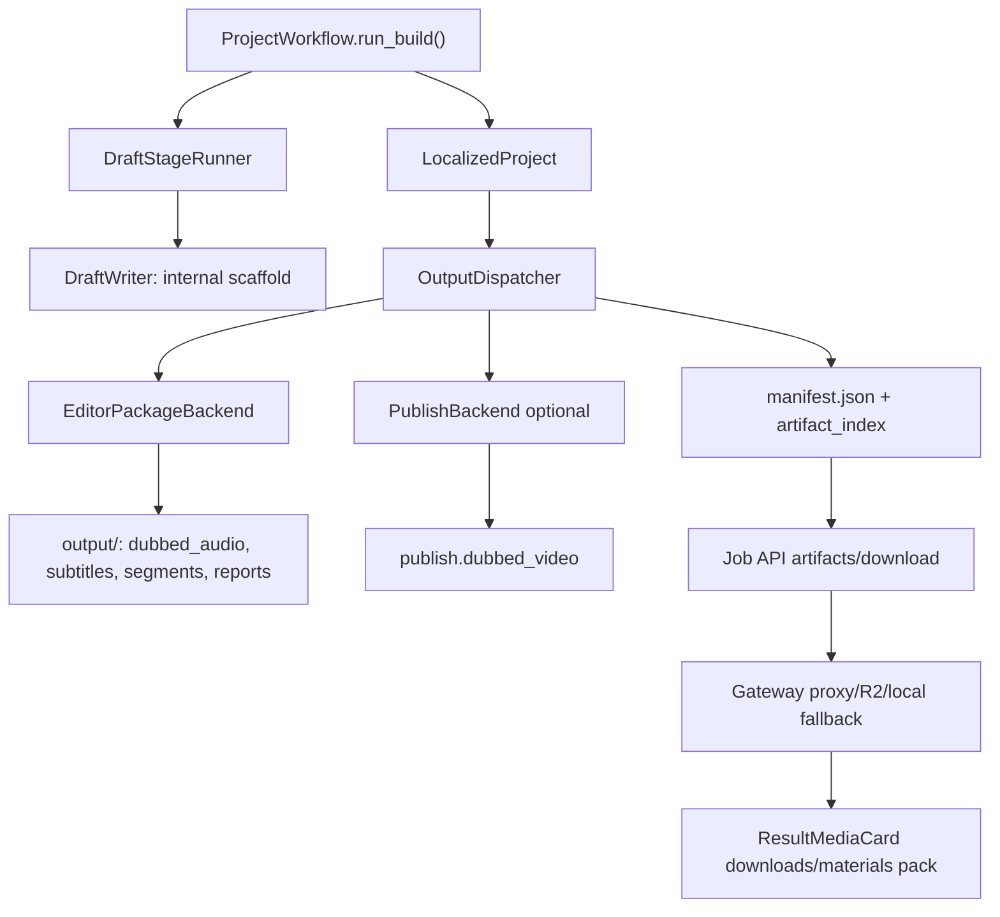

# 可打开剪映草稿交付接入方案

> Status: Approved
> Last updated: 2026-05-02
> Scope: 生成一个可被剪映专业版桌面端识别并打开的新草稿，作为本项目最终交付物之一；不把剪映自动渲染 MP4 纳入主链目标。

## 1. 结论

技术上可行，但必须把目标限定为“生成可打开的新草稿文件夹/草稿包”，而不是官方支持的工程导入 API。剪映/CapCut 草稿本质上是项目目录加若干 JSON 和资源文件，社区已有多个项目通过写 `draft_content.json`、`draft_meta_info.json`、素材目录来生成可打开草稿。

本项目当前已经有 draft-first 架构，但现有 `DraftWriter` 输出的是内部 scaffold 和 `jianying_like_export.json`，不是可直接打开的剪映私有格式。接入方向应当是新增一个真实剪映草稿后端，挂在最终 output delivery 层，复用现有确定性时间轴和素材，不改变 TTS / alignment / caption retiming 的核心边界。

重要前置条件：进入主链的剪映草稿包不得复用当前 SRT 二次切片逻辑。主链 Phase 1 前必须完成 `docs/plans/2026-05-02-subtitle-cue-generation-v2-plan.md` 的 gate，生成 canonical `SubtitleCue`，确保字幕文本来自实际 TTS 文本、语义切分稳定、时间点确定。剪映草稿后端只能消费这套 canonical cue，不允许自己重新切字幕或重新分配时间；独立 Phase 0 spike 可以先用现有 SRT 验证格式可行性。

## 1.1 前置 Gate：字幕生成流程 v2

在启动本方案 Phase 1 前，必须满足：

- 已生成 `editor.subtitle_cues` / `subtitle_cues.json`。
- 已生成 `editor.subtitle_quality_report` / `subtitle_quality_report.json`。
- `subtitle_quality_report.validation_status` 为 `passed`，或为 `needs_review` 但没有 text mismatch / timing overlap 等硬错误。
- 下载 SRT、internal draft caption、未来剪映草稿字幕都来自同一组 canonical `SubtitleCue`。
- 任一 block 的字幕 cue 文本归一化拼接后，必须等于该 block 实际送入 TTS 的最终 `merged_cn_text`。

注意：这里约束的是进入主链的 Phase 1 后端 PoC。Phase 0 技术 spike 可以与字幕 v2 Phase 1a 并行，用现有 SRT 验证 `pyJianYingDraft` 和剪映桌面端版本兼容性；spike 结果不得直接接入主链，也不得绕过后续 canonical cue gate。

未满足 gate 时：

- pipeline 仍可交付现有配音视频、配音音频、SRT 和素材包。
- 不生成 `editor.jianying_draft_zip`。
- manifest / 兼容报告记录 skipped reason: `subtitle_cues_not_ready` 或具体校验错误。

## 2. 外部依据

优先参考：

- `GuanYixuan/pyJianYingDraft`: 活跃度最高，支持 Python 生成剪映草稿，覆盖音视频、文本、字幕、轨道、转场、特效等。PyPI 最新版 `0.2.6` 于 2026-03-16 发布。
- `GuanYixuan/pyCapCut`: 同作者 CapCut 版本，可作为国际版结构对照。
- `notinmood/JianyingDraft.PY` / `xiaoyiv/JianYingProDraft`: 更早期实现，说明基础原理是创建 `draft_content.json`、`draft_meta_info.json`，并建立素材库、内容素材、轨道片段之间的引用。
- `vogelcodes/capcut-srt-export`: 不是生成器，但证明字幕等内容可通过 CapCut 草稿 JSON 读取和修改。

关键限制：

- 剪映 6+ 对 `draft_content.json` 模板读取有加密限制，社区库的“模板模式”只可靠覆盖 5.9 及以下；但从零生成基础音视频/字幕草稿仍有社区项目声称支持 5+。
- 批量自动导出依赖 UI 自动化，剪映 7+ 控件隐藏后风险较高。本方案不依赖自动导出。
- 官方 CapCut 帮助文档明确不支持把一个项目直接导入另一个项目并保留可编辑层，因此产品口径应是“下载/打开一个新草稿”，不是“导入到现有项目”。

## 3. 当前项目落点

现有链路：



现有真实可交付文件主要在 `OutputDispatcher` 之后注册到 manifest：

- `editor.dubbed_audio_complete`
- `editor.ambient_audio`
- `editor.subtitles`
- `editor.subtitles_en`
- `editor.subtitles_bilingual`
- `editor.segments_dir`
- `publish.dubbed_video`

最合适的接入点是 `OutputDispatcher` 调用 editor backend 之后、写 manifest 之前。原因：

- 此时 `ProjectOutput` 已经汇总了项目 ID、总时长、对齐段落、分段音频、字幕文本。
- `EditorPackageWriter` 已经生成剪映友好的 WAV 和 SRT。
- `ArtifactIndex` 是最终下载、素材包和前端展示的统一入口。
- 不需要改动 translation / chunking / TTS / alignment 的核心阶段。

## 4. 目标草稿形态

PoC 目标只覆盖本项目当前最重要的可编辑交付：

- 原视频轨：使用 `source.original_video`。
- 配音轨：优先使用 `editor.dubbed_audio_complete`，作为整条配音音频。
- 字幕轨：优先使用 `editor.subtitles` 或 `editor.subtitles_bilingual` 导入为剪映文本字幕。
- 环境音轨：可选，使用 `editor.ambient_audio`，默认低音量或单独轨道。
- 项目尺寸：默认 1920x1080；后续从源视频探测宽高。
- 草稿名称：优先 `display_name` / `video_title` / `project_id`。

暂不覆盖：

- 花字、贴纸、复杂模板、转场、滤镜、关键帧。
- 剪映自动导出 MP4。
- 将生成草稿合并进用户已有草稿。
- full usage ledgering 或新的付费计量维度。

## 5. 设计方案

### 5.1 新增真实剪映草稿后端

新增模块建议：

```text
src/modules/output/jianying/
  __init__.py
  jianying_draft_backend.py
  jianying_draft_models.py
  jianying_draft_writer.py
  jianying_draft_validator.py
```

核心接口：

```python
@dataclass(slots=True)
class JianyingDraftRequest:
    project_id: str
    project_title: str
    source_video_path: str
    dubbed_audio_path: str
    subtitle_path: str
    output_dir: str
    ambient_audio_path: str | None = None
    width: int = 1920
    height: int = 1080


@dataclass(slots=True)
class JianyingDraftResult:
    draft_dir: str
    draft_zip_path: str
    draft_content_path: str
    draft_meta_info_path: str
    manifest_path: str | None
    compatibility_report_path: str
    validation_status: str
```

后端职责：

- 从 `ProjectOutputResult` 和 `ArtifactIndex` 解析输入素材。
- 调用 `pyJianYingDraft` 或内部 adapter 生成剪映项目目录。
- 将草稿目录打包成 zip，供浏览器下载。
- 写 `jianying_compatibility_report.json`，记录剪映版本、生成器版本、素材清单、验证结果。
- 不做网络调用，不调用剪映 UI，不自动渲染。

### 5.2 依赖策略

第一阶段建议使用 `pyJianYingDraft` 做 PoC，但要包在本项目自己的 adapter 后面：

```text
OutputDispatcher
  -> JianyingDraftBackend
      -> PyJianYingDraftAdapter
```

原因：

- 社区库已经覆盖草稿字段细节，能缩短验证周期。
- 本项目保留自己的 `JianyingDraftBackend` 边界，后续可以替换为自研 writer。
- 依赖应先做 optional dependency，不进入默认 `main.py` / `pytest` 必需路径。

建议开关：

```text
AVT_ENABLE_JIANYING_DRAFT=0/1
AVT_JIANYING_DRAFT_ENGINE=pyjianyingdraft/internal
AVT_JIANYING_DRAFT_WIDTH=1920
AVT_JIANYING_DRAFT_HEIGHT=1080
```

如果未安装 `pyJianYingDraft` 或开关未启用，pipeline 不失败，只跳过真实剪映草稿产物，并在 manifest 的兼容报告或日志里记录 skipped reason。

### 5.3 输出目录约定

建议写入：

```text
{project_dir}/jianying/
  draft/
    draft_content.json
    draft_meta_info.json
    materials/...
    ...
  exports/
    jianying_draft_{job_id_or_project_id}.zip
  jianying_compatibility_report.json
```

manifest artifact keys：

```text
editor.jianying_draft_dir
editor.jianying_draft_zip
editor.jianying_compatibility_report
```

这些 key 属于 editor 类产物，不属于 publish 产物。剪映草稿是主目标交付之一，但它仍是“编辑器工程产物”，不是已发布视频。

### 5.4 OutputDispatcher 接入

建议扩展 `OutputRequest`，新增非破坏性选项：

```python
@dataclass(slots=True)
class OutputRequest:
    targets: list[OutputTarget] = field(default_factory=lambda: [OutputTarget.EDITOR])
    include_jianying_draft: bool = False
    service_mode: str | None = None
    ...
```

`src/pipeline/process.py::_dispatch_process_output_bundle()` 当前构造 `OutputRequest` 时需要显式打开开关，建议从环境变量注入：

```python
include_jianying = os.environ.get("AVT_ENABLE_JIANYING_DRAFT", "0") == "1"

OutputRequest(
    targets=[OutputTarget.PUBLISH],
    include_jianying_draft=include_jianying,
    service_mode=service_mode,
    ...
)
```

如果文件尚未导入 `os`，同步补充 import。`service_mode` 应从任务创建层、source info 或现有 job metadata 传入，不能只依赖前端 `serviceMode` 的 UI 可见性。

接入流程：

```python
editor_result = self.editor_backend.write(project_output)
self._register_editor_artifacts(artifact_index, editor_result)

if request.include_jianying_draft and request.service_mode == "studio":
    jianying_result = self.jianying_backend.write(
        self._build_jianying_request(
            localized_project,
            artifact_index,
            project_root,
            editor_result,
        )
    )
    self._register_jianying_artifacts(artifact_index, jianying_result)

manifest_path = self.manifest_writer.write(...)
```

注意事项：

- `source.original_video` 缺失时不要硬失败 editor 输出；真实剪映草稿标记 skipped。原因是本项目仍可能处理纯音频或字幕输入。
- `editor.dubbed_audio_complete` 是整轨，PoC 阶段比逐段音频更稳；逐段音频可后续用于更细粒度可编辑。
- Phase 0 spike 可临时使用现有 SRT 验证草稿能否打开；Phase 1 主链必须使用 canonical `SubtitleCue` 或由它序列化出的 SRT，不得再走旧 SRT 二次切片结果。
- 主链默认只在 `service_mode == "studio"` 时生成剪映草稿；Express 或缺失 mode 都应跳过并记录 `skipped_reason=service_mode_not_enabled`。本地 spike / dev 脚本需要显式传入 Studio 等价模式，不能依赖漏传 mode 放行。未来如产品决定 Express 也给草稿，再显式放开生成策略和下载白名单。

### 5.5 下载与前端接入

Job API：

- 若现有下载 surface 需要公共 key 注册，在 `PUBLIC_RESULT_DOWNLOAD_KEYS` 增加 `editor.jianying_draft_zip`，并在 `RESULT_OUTPUT_SPECS` 增加 `("editor.jianying_draft_zip", "jianying_draft")`。
- Express 直接下载白名单保持默认不开放：不要把 `editor.jianying_draft_zip` 加入 `EXPRESS_ALLOWED_DOWNLOAD_KEYS`。
- 生成侧是主控：Express 默认不生成该 artifact；下载白名单只是防御线。Studio 模式在 artifact 存在且校验通过时开放下载。

Gateway：

- 第一阶段不接 R2，只走现有 Job API local passthrough。
- Phase 2 上线后观察 30 天。若 `editor.jianying_draft_zip` 月下载次数 > `publish.dubbed_video` 月下载次数的 30%，再把它纳入 `storage.backend_router` 的可选 R2 key；否则继续 local passthrough，避免为低频大文件提前扩大 R2 成本。R2 仍必须保持失败回退本地。

素材包：

- `gateway/materials_pack_common.py` 新增 item:

```python
"jianying_draft": ["editor.jianying_draft_zip"]
```

- materials availability 也要按 service mode 控制：Express 默认隐藏并拒绝 `jianying_draft`，Studio 在 artifact 存在时展示。

前端：

- `ResultMediaCard` 新增“剪映草稿”下载按钮，位置在“配音视频/配音音频/素材包”同一行。
- 按钮只在 `materials-availability` 或 result summary 显示 `jianying_draft=true` 时出现。
- 文案建议：`剪映草稿` / `下载后解压，用剪映打开草稿目录`。如果不想在界面解释过多，可以在 toast 或帮助弹层里说明。

### 5.6 文件级改动清单

第一阶段后端 PoC：

| 文件 | 改动 |
| --- | --- |
| `src/modules/output/jianying/*` | 新增真实剪映草稿 backend、request/result model、writer、validator |
| `src/modules/output/output_models.py` | `OutputRequest` 增加 `include_jianying_draft: bool = False`，并承接 `service_mode` 或等价策略字段 |
| `src/modules/output/output_dispatcher.py` | 注入并调用 `JianyingDraftBackend`；注册 `editor.jianying_draft_*` artifacts；仅当 `service_mode == "studio"` 时生成 |
| `src/modules/output/manifest_writer.py` | `primary_outputs.editor` 增加 `jianying_draft_zip` 和兼容报告路径 |
| `src/pipeline/process.py` | 在 `_dispatch_process_output_bundle()` 构造 `OutputRequest` 时读取 `AVT_ENABLE_JIANYING_DRAFT`，传入 `include_jianying_draft`，并传递可用的 `service_mode` |
| `requirements*.txt` 或可选 extras | 仅在确认后增加 optional `pyJianYingDraft` 依赖；默认 clean env 不强依赖 |

第二阶段交付面：

| 文件 | 改动 |
| --- | --- |
| `src/services/web_ui/constants.py` | `PUBLIC_RESULT_DOWNLOAD_KEYS` 增加 `editor.jianying_draft_zip`，仅 Studio 可用 |
| `src/services/jobs/read_surface.py` | `RESULT_OUTPUT_SPECS` 增加 `("editor.jianying_draft_zip", "jianying_draft")` |
| `gateway/materials_pack_common.py` | `ITEM_TO_ARTIFACT_KEYS` 增加 `jianying_draft` |
| `src/services/jobs/api.py` | materials availability 增加 `jianying_draft`；Express 白名单保持默认不开放；Express 请求该素材项时拒绝或隐藏 |
| `frontend-next/src/types/jobs.ts` | `DOWNLOADABLE_ARTIFACT_KEYS` 增加 `editor.jianying_draft_zip` |
| `frontend-next/src/lib/api/downloads.ts` | `MaterialsAvailability` 增加 `jianying_draft` |
| `frontend-next/src/components/workspace/ResultMediaCard.tsx` | 增加“剪映草稿”下载按钮和素材包选项 |

第三阶段可选存储扩展：

| 文件 | 改动 |
| --- | --- |
| `gateway/storage/backend_router.py` | 评估是否把 `editor.jianying_draft_zip` 加入可 R2 redirect 的 artifact key |
| `gateway/job_intercept.py` | 若接 R2，则增加对应 download redirect 分支和友好文件名派生 |

## 6. 验证矩阵

### 6.1 自动化测试

新增单元测试：

- `tests/test_jianying_draft_backend.py`
  - 缺少 `source.original_video` 时 skipped，不影响 editor 产物。
  - 有视频、音频、字幕时生成 result，并注册 artifact。
  - `pyJianYingDraft` 未安装时跳过，不让 `pytest` 失败。

- `tests/test_output_dispatcher_jianying.py`
  - `include_jianying_draft=False` 时行为完全不变。
  - `include_jianying_draft=True` 时 manifest 包含新 artifact keys。

- `tests/test_job_api_jianying_download.py`
  - Studio 任务可下载 `editor.jianying_draft_zip`。
  - Express 任务默认不能下载，除非白名单明确变更。

- `tests/test_materials_pack_jianying.py`
  - 选中 `jianying_draft` 时 zip 可被素材包纳入。

### 6.2 手工兼容验证

必须用真实剪映桌面端验证：

| 剪映版本 | 平台 | 验证项 |
| --- | --- | --- |
| 5.9 | Windows | 草稿出现在草稿列表；时间线有原视频、配音、字幕；素材不丢失 |
| 6.x | Windows | 从零生成草稿是否可打开；不验证模板读取 |
| 7.x | Windows | 草稿是否可打开；不验证自动导出 |

每个版本至少验证：

- 关闭剪映后解压草稿到草稿目录。
- 重启或刷新剪映草稿列表。
- 打开草稿不崩溃、不空白。
- 原视频轨可见。
- 配音音轨与时间轴起点对齐。
- 字幕文本可编辑，时间码基本匹配。
- 素材路径移动后不会全部丢失，或报告里明确要求原素材路径存在。

## 7. 分阶段实施

### Phase 0: 样例采集与技术 spike

目标：

- 与字幕流程 v2 Phase 1a 并行启动，不要求 canonical cue gate 已完成。
- 用现有 SRT 先验证 `pyJianYingDraft`、草稿目录结构和剪映 5.9/6.x/7.x 桌面端可打开性。
- 在本地 Windows 剪映专业版上创建一个最小样例：原视频 + WAV 音频 + SRT 字幕。
- 对比样例草稿与 `pyJianYingDraft` 输出结构。
- 确认草稿目录名、封面、meta 文件、素材路径规则。

交付：

- `docs/research/jianying-draft-format-notes.md`
- 一个不进入主链的实验脚本，例如 `scripts/dev_generate_jianying_draft_poc.py`

### Phase 1: 后端 PoC

目标：

- 新增 `JianyingDraftBackend`。
- 在 `OutputDispatcher` 后接入，但默认关闭。
- 注册 `editor.jianying_draft_*` artifact。
- 生成 zip。
- 只消费 canonical `SubtitleCue`，不重新切字幕。
- 以字幕 v2 gate 为进入主链的前置条件；未满足时只记录 skipped reason。

验收：

- `pytest` 在未安装 `pyJianYingDraft` 的 clean env 仍通过。
- 开启开关并安装依赖后，能生成 zip。
- 手工解压后，剪映 5.9/6.x 至少一个版本可打开。
- 草稿字幕、下载 SRT 与 `subtitle_cues.json` 文本和时间一致。

### Phase 2: 交付面接入

目标：

- Job API 允许 Studio 下载 `editor.jianying_draft_zip`。
- 前端展示“剪映草稿”按钮。
- 素材包支持包含草稿 zip。

验收：

- 成功任务 result summary 能看到 `jianying_draft`。
- 点击按钮下载 zip。
- Express/Studio 白名单行为符合预期。

### Phase 3: 稳定性与版本矩阵

目标：

- 增加兼容报告。
- 增加版本/引擎标记。
- 对无法生成的输入类型给出明确 skipped reason。
- 决定是否将 `include_jianying_draft` 设为 Studio 默认开启。

验收：

- 每次生成的草稿 zip 内包含兼容报告。
- 不同剪映版本的打开结果可追踪。
- 失败不影响 `publish.dubbed_video` 和现有素材包。

## 8. 风险与缓解

| 风险 | 影响 | 缓解 |
| --- | --- | --- |
| 剪映私有格式变动 | 新版本打不开草稿 | 版本矩阵验证；兼容报告；adapter 边界可替换 |
| `pyJianYingDraft` 依赖不稳定 | clean env / CI 失败 | optional dependency；未安装时 skip |
| 素材路径丢失 | 用户打开草稿提示重连素材 | zip 内尽量包含资源副本；报告说明草稿目录必须整体解压 |
| 草稿 zip 过大 | 下载慢 / R2 成本上升 | 先 local passthrough；上线 30 天后若下载次数超过 `publish.dubbed_video` 的 30% 再接 R2 |
| 前端误导为“导入现有项目” | 用户预期错误 | 文案统一为“可打开的新草稿” |
| Express/Studio 权限混淆 | 暴露过多编辑资产 | 默认仅 Studio 开放，Express 继续只给成品视频 |
| 草稿配音轨为整轨，无法在剪映内分段 re-TTS | 用户期望“剪映里改字 + 自动重生成配音”落空 | §9 文案明确“字幕在剪映改，配音回平台改”；未来如需逐段编辑，再考虑输出逐段 wav 注册为多个音频片段 |

## 9. 建议的最终用户口径

中文产品文案：

- 按钮：`剪映草稿`
- 下载提示：`下载后解压，将草稿文件夹放入剪映草稿目录，再在剪映中打开。`
- 编辑边界：`字幕可在剪映直接编辑；如需修改配音，请回到本平台的修改流程。`
- 失败提示：`当前任务暂未生成剪映草稿，可下载配音视频或素材包继续编辑。`

避免文案：

- `导入剪映工程`
- `导入到当前项目`
- `自动发布到剪映`

这些说法会暗示官方导入能力或自动导出能力，和实际技术边界不一致。

## 10. 推荐下一步

并行推进字幕 v2 Phase 1a 与本方案 Phase 0，不直接改前端默认交付。也就是：

1. 启动字幕 v2 Phase 1a：实现 canonical `SubtitleCue` 最小路径，替换当前 editor SRT 二次切片主路径。
2. 同时启动剪映 Phase 0 spike：固定一个剪映版本，用现有 SRT 和 `pyJianYingDraft` 生成最小草稿，验证能否打开。
3. 完成 `subtitle_quality_report` hard error gate，阻断 text mismatch / timing overlap / timing_out_of_block / empty_cue。
4. 手工确认 spike 草稿可打开后，等待字幕 gate 达标，再把后端接入 `OutputDispatcher`，默认由环境变量关闭且 Studio-only。
5. 后端 PoC 只消费 canonical `SubtitleCue` 或由它生成的 SRT，不复用 spike 的旧 SRT 路径。
6. 只有当至少一个真实剪映版本验证通过，再进入前端下载按钮和素材包接入。
