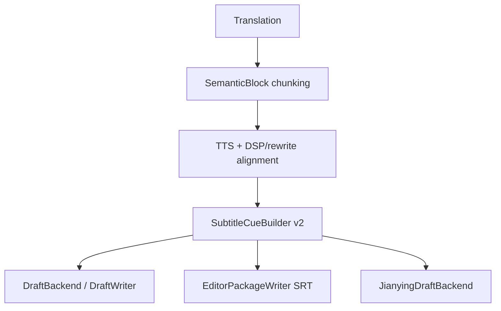

# 字幕生成流程 v2：语义切分、TTS 文本一致性与确定性时间轴

> Status: Approved
> Last updated: 2026-05-02
> Scope: 在生成可打开剪映草稿前，先统一本项目的字幕 cue 生成流程，保证字幕语义完整、时间点确定、字幕文本与实际 TTS 文本一致。

## 1. 背景

当前项目已经坚持 TTS unit 是 `SemanticBlock`，alignment 是 DSP first，字幕 retiming 是确定性处理。但实际输出字幕仍有明显问题：

- `CaptionRetimer` 按原始 subtitle line 生成 draft caption。原始字幕如果把一句话拆坏，后续字幕也会继承这种拆分。
- `EditorPackageWriter._build_subtitle_slices()` 又在生成 SRT 时重新按标点和固定长度切片，长句无标点时会硬切，可能把完整词语或短语拆到两个字幕里。
- `distribute_text_by_weights()` 会把 rewrite 后的 `merged_cn_text` 按原始行长度分回多行；这保证了数量匹配，但不保证语义边界。
- SRT、内部 draft scaffold、未来剪映草稿导入包不是从同一个 canonical subtitle cue 集合生成，容易出现“网页预览/下载 SRT/剪映草稿字幕不一致”。

因此，真实剪映草稿导入包的前置条件应该是：先建立一套统一的字幕 cue 生成与验证流程。

## 2. 目标

必须满足：

- 字幕文本以实际送入 TTS 的最终中文文本为真源。
- 每个 `SemanticBlock` 的字幕 cue 拼接后，归一化结果必须等于该 block 的最终 TTS 文本。
- 字幕切分优先按完整语义短句，不为了固定字数强行切开词语。
- 字幕时间必须落在对应 block 的对齐后音频时间槽内，单调递增、无重叠。
- SRT、内部 draft scaffold、剪映草稿包都从同一组 canonical cue 生成。
- 仍保持确定性 retiming，不引入 LLM 驱动字幕时间点。

允许：

- 对过长但没有可靠语义边界的句子，宁可保留较长字幕并标记 `needs_review`，也不要硬切词。
- 后续可接入 TTS provider word timestamps 或 forced-alignment 作为增强，但 v2 默认路径不依赖外部服务。

## 3. 非目标

- 不改变 TTS unit：仍然是 `SemanticBlock`，不是 subtitle line。
- 不把字幕时间交给 LLM 判断。
- 不要求第一版做到逐字/逐词 karaoke 级时间戳。
- 不在第一版处理花字、动效、字幕模板样式。
- 不把剪映自动导出 MP4 纳入主链。

## 4. 当前问题定位

### 4.1 Draft caption retiming 继承原始字幕切分

`src/modules/draft/caption_retiming.py` 当前逻辑：

- 输入是 `SemanticBlock + source_lines`。
- 输出 caption 数量等于原始 subtitle line 数量。
- 时间按原始 line 在 block 内的相对位置线性缩放。
- 文本优先取 `block.final_cn_lines`，否则回退 `block.cn_line_texts`。

问题：

- 如果原始 line 把一个词拆开，draft caption 仍会拆开。
- 如果 rewrite 后 `merged_cn_text` 已变化，`final_cn_lines` 的分配是长度权重，不是语义切分。
- 时间点只继承原字幕比例，不知道 TTS 实际停顿。

### 4.2 Editor SRT 输出做了第二套切分

`src/modules/output/editor/editor_package_writer.py` 当前逻辑：

- `_build_subtitle_slices()` 以 `AlignedSegment.cn_text` 为输入。
- 先按中文标点切，再按 `_MAX_ZH_CHARS` 硬切。
- 时间按中文字符数比例分配。
- 英文按词数切成同样数量。

问题：

- 长句、专有名词、数字、英文混排容易被硬切。
- 它与 draft caption retiming 不是同一套 cue。
- 时间分配不知道实际 TTS 文本、重写、DSP 后的最终 cue 边界。

### 4.3 缺少字幕质量 gate

当前没有统一检查：

- cue 文本拼接是否等于实际 TTS 文本。
- 是否拆开英文单词、数字、括号内容、URL、专有词。
- cue 是否覆盖 block 音频槽。
- SRT / draft / manifest 使用的 cue 是否同源。

## 5. 设计原则

### 5.1 单一真源

每个 block 的字幕中文文本必须来自：

```text
block.merged_cn_text
```

且必须是在 alignment/rewrite 结束后的最终值。原因是 `AlignmentOrchestrator.process_block()` 调用 TTS 时使用的就是 `block.merged_cn_text`；rewrite 后也会更新它。因此字幕不能再以原始 `SubtitleLine.cn_text` 或后来按长度分配的 `final_cn_lines` 作为最终真源。

建议新增显式字段或 helper：

```python
def resolve_spoken_text(block: SemanticBlock) -> str:
    return block.merged_cn_text.strip()
```

后续如要更严谨，可给 `SemanticBlock` 增加 `spoken_cn_text` 或 `tts_input_text` 字段，但第一步可先集中 helper，减少模型迁移成本。

`final_cn_lines` 生命周期必须明确：

- Phase 1a/1b：alignment 链路可继续写 `block.final_cn_lines`，保持现有回退路径兼容；但新的 SRT、draft caption、剪映草稿字幕主路径不得再读取它。
- Phase 2：删除 `SemanticBlock.final_cn_lines` 字段，移除 `alignment_orchestrator` 中的写入、`caption_retiming` 中的读取以及缓存恢复残留字段。
- Phase 2 验收增加 grep 守卫：生产代码中不得再引用 `final_cn_lines`，只允许迁移脚本、历史 fixture 或明确标记的 legacy 测试保留。

### 5.2 单一 canonical cue 集合

新增 canonical model：

```python
@dataclass(slots=True)
class SubtitleCue:
    cue_id: str
    block_id: str
    speaker_id: str
    speaker_name: str | None
    text: str
    en_text: str
    start_ms: int
    end_ms: int
    source: str  # semantic_block_v2
    needs_review: bool = False
    review_reason: str | None = None
```

所有输出都消费 `list[SubtitleCue]`：

- `subtitles_zh.srt`
- `subtitles_en.srt`
- `subtitles_bilingual.srt`
- internal `DraftCaptionTrack`
- future `editor.jianying_draft_zip`
- subtitle quality report

### 5.3 语义切分优先

切分策略分层：

1. 强边界：`。！？!?`、明显句末。
2. 中边界：`；;`、冒号后的完整说明、明显并列短句。
3. 弱边界：`，,、`，但只能在切分后两侧都满足最小长度且不破坏专有词时使用。
4. 安全边界：空格、英文词边界、数字/单位边界之外。
5. 无可靠边界：不硬切词，保留长 cue 并标记 `needs_review=long_unbreakable_text`。

明确禁止：

- 在英文单词中间切。
- 在连续数字、金额、百分比、时间码中间切。
- 在 URL、邮箱、文件名中间切。
- 在括号/引号未闭合区间中间切。
- 为了满足固定字数，把中文连续词组按字符硬切。

第一版可用规则实现，不引入新 tokenizer 依赖。后续若要更好，可增加可选 tokenizer，但不能让 clean env 的 `pytest` 依赖它。

为控制工程量，切分规则分两步落地：

- Phase 1a 只实现最高收益约束：中文强/中标点切分，以及绝不切开英文单词。数字、URL、邮箱、括号/引号嵌套等复杂混排先整体保留在同一 cue，标记 `needs_review=unknown_mixed_token` 或 `long_unbreakable_text`。
- Phase 1b 再补全数字+单位、百分比、时间码、URL、邮箱、文件名、括号/引号配对识别，并用真实样本形成回归集。

### 5.4 确定性时间分配

每个 block 的 cue 时间范围：

```text
block_start_ms = block.first_start_ms
block_end_ms = block.first_start_ms + effective_audio_duration_ms
```

`effective_audio_duration_ms` 优先级：

1. `block.actual_audio_duration_ms`，如果 alignment 后有效。
2. `block.target_duration_ms`。
3. `block.last_end_ms - block.first_start_ms`。

cue 内时间按 speech weight 分配，而不是简单字符数：

- 中文汉字：1.0
- 英文单词：按音节/长度估算，最低 1.0
- 数字：按中文读法估算权重
- 标点停顿：句末增加 pause weight，逗号增加较小 pause weight
- 空白和纯格式符不计入发音权重

为与 §5.3 切分规则的工程量节奏对齐，speech weight 也分两步落地：

- Phase 1a 用最简版：中文汉字 1.0 / 英文单词 1.5（不分音节） / 数字按字符 1.0 each / 标点权重 0。最简版不引入音节和读法估算，但仍要保证"汉字与英文混排时英文不会被压成几乎零权重"。
- Phase 1b 再细化：英文按音节估算、数字按中文读法估算、补全句末/逗号 pause weight，并用真实样本验证不破坏 §5.4 时间约束。

约束：

- cue start/end 单调递增。
- 不重叠。
- 每个 cue 最小展示时长建议 500-600ms。
- 如果 block 太短，允许降低最小时长，但必须保证非零。
- 最后一条 cue 必须结束于 block_end_ms。
- cue 时间不得超过对应 block 音频槽。

Studio 修改流需要单独约定：在 publish-only / alignment-resume commit 场景中，如果用户改了 `cn_text` 但没有触发 TTS 重跑，`SubtitleCueBuilder` 可能会使用新的 `block.merged_cn_text` 搭配旧的 `actual_audio_duration_ms` 和旧音频槽。这是可接受的，因为该修改路径没有再生成人声，等价于用户接受旧音频时长；validator 应记录 `text_audio_may_need_review`，但只要时间仍合法，不作为硬失败。如果修改流触发 TTS 重跑，则必须先更新 block 的实际音频和 duration，再生成字幕 cue。

这仍然是数学 retiming，不是 LLM retiming。

## 6. 建议模块与接入点

新增：

```text
src/modules/subtitles/
  __init__.py
  cue_models.py
  semantic_segmenter.py
  cue_timing.py
  cue_builder.py
  cue_validator.py
  srt_writer.py
```

核心接口：

```python
class SubtitleCueBuilder:
    def build_for_blocks(
        self,
        *,
        aligned_blocks: list[SemanticBlock],
        source_captions: list[SubtitleLine],
    ) -> list[SubtitleCue]:
        ...
```

接入阶段建议：



第一步可以先在 `OutputDispatcher` / editor 输出层接入 canonical cues，替换 `EditorPackageWriter._build_subtitle_slices()` 的二次切片。第二步再把 `DraftBackend.build_retimed_captions()` 改为消费 canonical cues，消除 draft 与 SRT 的差异。

## 7. 产物与 manifest

新增产物：

```text
{project_dir}/output/subtitle_cues.json
{project_dir}/output/subtitle_quality_report.json
```

artifact keys：

```text
editor.subtitle_cues
editor.subtitle_quality_report
```

`subtitle_cues.json` 示例：

```json
{
  "schema_version": "subtitle_cues_v2",
  "project_id": "xxx",
  "cues": [
    {
      "cue_id": "block_0001_cue_001",
      "block_id": "block_0001",
      "speaker_id": "speaker_1",
      "text": "今天我们先看第一个问题",
      "en_text": "Today let's look at the first question",
      "start_ms": 1200,
      "end_ms": 3100,
      "needs_review": false
    }
  ]
}
```

## 8. 验证规则

`SubtitleCueValidator` 必须检查：

- 对每个 block，`normalize("".join(cue.text)) == normalize(block.merged_cn_text)`。
- cue 的 `[start_ms, end_ms]` 落在 block 音频槽内。
- 同一 block 内 cue 单调、无重叠、无倒退。
- cue 文本不为空。
- cue 数量合理：不能因为标点密集生成大量 <500ms 字幕。
- 不能拆开英文单词、连续数字、URL、括号区间。
- SRT writer 不得再自行切分，只能序列化 canonical cues。

`normalize()` 是 validator 的 contract，先固定实现再扩展：

- Unicode NFKC。
- 移除 BOM、零宽字符和不可见格式符。
- 折叠连续空白，去掉首尾空白。
- 仅在比较阶段归一化中英文常见标点、全角/半角差异；展示文本保持原文。
- 保留数字、英文字母、CJK 字符和有语义的符号，不删除可能改变含义的字符。

硬错误与 review 项要分开：

- 硬错误：`text_mismatch`、`timing_overlap`、`timing_out_of_block`、`empty_cue`。
- Review：`long_unbreakable_text`、`unknown_mixed_token`、`text_audio_may_need_review`、`short_display_duration`。

`subtitle_quality_report.json` 应记录：

- `validation_status`: `passed` / `needs_review` / `failed`
- 每个 block 的 cue 数量。
- 长 cue、短 cue、无法安全切分、文本不一致等问题。
- 是否允许进入剪映草稿生成。

进入剪映草稿生成的 gate：

```text
validation_status in {"passed", "needs_review"}
and no hard errors
```

如果存在 `needs_review`，仍可生成草稿，但报告和前端应提示“字幕建议复查”。

## 9. 测试计划

新增测试：

- `tests/test_subtitle_semantic_segmenter.py`
  - 不拆英文单词。
  - 不拆数字/百分比/金额。
  - 不拆括号未闭合内容。
  - 长中文无标点时不硬切词，标记 review。

- `tests/test_subtitle_cue_builder.py`
  - cue 拼接等于 `block.merged_cn_text`。
  - rewrite 后文本以 rewrite 结果为准。
  - cue 时间覆盖 block audio slot。
  - block 之间互不重叠。

- `tests/test_editor_srt_uses_canonical_cues.py`
  - `_write_srt()` 不再重新语义切分。
  - zh/en/bilingual 共用同一组 cue 时间。

- `tests/test_draft_backend_uses_canonical_cues.py`
  - draft captions 与 SRT captions 文本和时间一致。

- `tests/test_jianying_draft_requires_subtitle_cues.py`
  - 缺少 `editor.subtitle_cues` 或 validator failed 时，剪映草稿生成 skipped。

- `tests/test_subtitle_normalize_contract.py`
  - NFKC、零宽字符、空白折叠、标点比较归一化稳定。
  - 不删除数字、英文字母、CJK 字符和有语义符号。

- `tests/test_no_final_cn_lines_main_path.py`
  - Phase 2 后 grep 生产代码，确保 `final_cn_lines` 不再被主路径读取或写入。

## 10. 分阶段实施

### Phase 1a: Minimal canonical cue path

- 新增 `SubtitleCue` model、最小 segmenter、timing、validator。
- 切分规则只覆盖中文强/中标点和“不切英文单词”。
- 数字、URL、邮箱、括号/引号嵌套等复杂混排先整体保留并标记 review。
- speech weight 用最简版（中文 1.0 / 英文单词 1.5 / 数字 1.0/char / 标点 0），不区分音节和读法。
- `EditorPackageWriter` 改为消费 canonical cues。
- 写 `subtitle_cues.json` 和 `subtitle_quality_report.json`。
- 旧 `_build_subtitle_slices()` 保留一轮兼容，但不再作为主路径。

验收：

- SRT 不再硬切英文单词，不再按固定字数硬拆中文连续文本。
- SRT 文本拼接与实际 TTS 中文文本一致。
- `pytest` 覆盖最小语义切分、normalize contract 与时间单调。

### Phase 1b: Mixed-token segmentation completion

- 补全数字+单位、百分比、时间码、URL、邮箱、文件名、括号/引号配对识别。
- 建立 small regression set，覆盖真实中英文混排样本。
- 调整 `needs_review` 规则，减少可安全识别样本的误报。
- speech weight 细化：英文按音节估算、数字按中文读法估算、补全句末/逗号 pause weight。

验收：

- 不拆数字、百分比、金额、时间码、URL、邮箱、文件名。
- 括号/引号未闭合区间不被切开。
- 复杂样本不会破坏 `normalize(cue_text_joined) == normalize(block.merged_cn_text)`。

### Phase 2: Draft caption 迁移

- `DraftBackend` / `CaptionRetimer` 迁移到 canonical cues。
- internal scaffold 的 caption track 与 SRT 共用同一 cue 集合。
- `CaptionRetimer` 可保留为 legacy fallback，但不再作为主路径。
- 删除 `SemanticBlock.final_cn_lines` 字段及主路径读写残留，增加 grep 守卫测试。

验收：

- `draft_content.json` caption items 与 `subtitles_zh.srt` cue 一致。
- post-edit commit 后重新生成 subtitle cues，不复用旧 SRT。
- 生产代码无 `final_cn_lines` 主路径引用。

### Phase 3: 剪映草稿 gate

- `JianyingDraftBackend` 只消费 canonical cues。
- 若 `subtitle_quality_report` 有 text mismatch / timing overlap，跳过剪映草稿生成。
- 前端/manifest 暴露字幕质量报告。

验收：

- 剪映草稿包里的字幕与下载 SRT 完全同源。
- 用户修改文案后，commit -> alignment resume -> subtitle cues -> SRT/剪映草稿 全链路刷新。

## 11. 与剪映草稿方案的关系

生成“可打开的新剪映草稿”必须排在本方案之后。剪映草稿后端不得自己重新切字幕，也不得重新分配字幕时间；它只能读取 canonical `SubtitleCue`。

剪映草稿方案的 Phase 1 前置 gate：

```text
SubtitleCueBuilder v2 implemented
subtitle_cues.json generated
subtitle_quality_report.json passed or needs_review without hard errors
SRT output migrated to canonical cues
```

未满足前置 gate 时，只允许继续交付现有配音视频、配音音频和素材包，不生成 `editor.jianying_draft_zip`。
