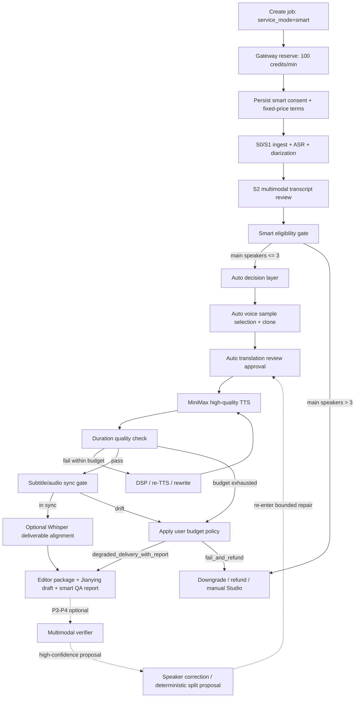

# 智能版自动视频翻译流程方案草案

- 创建日期：2026-05-04
- 状态：方案草案，待审核
- 适用范围：快捷版 / 工作台版之上的智能版自动交付能力
- 更新记录：
  - 2026-05-04 吸收评审意见，明确 Smart MVP 不依赖独立多模态 verifier，补充降级交付契约、幂等闸、付费 API 守卫、成本汇总、kill switch 和 Smart → Studio 接管契约；补充已落地 P0 的 `user_edit_events.jsonl` 作为 Smart shadow evaluation 与 verifier learning 的人类纠错事实源；补齐 Express / Studio / Smart 定位、translation auto-approval 风险边界、clone 配额和失败重试策略、长视频 retry cap、Smart 成功后进入 Studio 精修，以及 P0 shadow evaluator 执行入口。
  - 2026-05-06 执行前复核：吸收字幕音频同步 Phase A-D 已落地能力，明确 Smart MVP 必须复用 `tts_input_cn_text`、`text_audio_drift`、`ensure_whisper_aligned_subtitles()` 和 Whisper 双闸门 / 指纹缓存边界；补充 faster-whisper 作为可选部署能力而非默认依赖的要求。
- 关联文档：
  - `docs/plans/2026-04-24-video-translation-quality-cost-optimization-plan.md`
  - `docs/plans/2026-05-02-subtitle-cue-generation-v2-plan.md`
  - `docs/plans/2026-05-04-subtitle-audio-sync-plan.md`
  - `docs/plans/2026-05-04-user-edit-audit-data-optimization-plan.md`
  - `docs/graphs/GITNEXUS_WORKFLOW_CORE_GRAPH.md`
  - `docs/graphs/GITNEXUS_REVIEW_GRAPH.md`
  - `docs/graphs/GITNEXUS_COMMERCIALIZATION_GRAPH.md`
  - `docs/graphs/GITNEXUS_BENCHMARK_QUALITY_COST_GRAPH.md`

## 1. 核心判断

智能版可行，但不应被设计成一套新流水线。它应该是工作台版能力之上的“自动决策层 + 自动时长修复回环 + 成本闸 + 质量报告”。

现有系统已经有可复用基础：

- S2 三轮审校已经能做 speaker 识别、`correct_speaker`、`split`、音色画像。
- `voice_selection_review` 已经承接多 speaker 音色选择、克隆、TTS provider / MiniMax model 选择。
- TTS 单位仍是 `SemanticBlock` / `DubbingSegment`，不是字幕行。
- Pre-TTS rewrite、TTS、DSP-first alignment、失败段落 semantic split repair 已经存在。
- 字幕 cue v2 已经以最终 `SemanticBlock.merged_cn_text` 为字幕中文真源；Phase A/B 已补 `DubbingSegment.tts_input_cn_text` / `SemanticBlock.tts_input_cn_text` 和 `text_audio_drift` 质量报告字段，适合实现“字幕与最终 TTS 内容一致”和“文本改了但音频未重生”的自动拦截。
- Phase C/D 已有本地 Whisper 字幕时间对齐能力：`ensure_whisper_aligned_subtitles()` 可在剪映草稿 / 素材包交付前重算 SRT 时间，受 `AVT_WHISPER_ALIGN_ENABLED` 和 admin `whisper_alignment_enabled` 双闸门控制，默认关闭且可回退到比例分配。
- Gateway 已经是套餐、扣点、试用、权益、质量档位事实源，智能版商业事实应继续只放在 Gateway。

因此，智能版的第一性目标不是“再做一个 Pipeline”，而是：

1. 自动生成并提交原本由人工完成的 review payload。
2. 自动选择可克隆样本和 TTS 模型。
3. 自动执行有限次数的 DSP 压缩、同文本 re-TTS、同段内 rewrite 缩短。
4. 复用已落地的字幕 / 音频一致性字段与 Whisper deliverable-time 对齐能力，生成更适合智能版“无人审核”的剪映草稿和素材包。
5. 为后续多模态 verifier 预留审计、幂等和修复接口，但 Smart MVP 不依赖 verifier。
6. 将所有自动决策写入可审计 sidecar，形成后续调参和毛利分析数据。

独立多模态 verifier 是新模块，不是现有能力。它应单独做方案和离线 benchmark，再作为 Smart P3/P4 接入，不能阻塞智能版 MVP。

## 2. 产品定义

### 2.1 三档关系

- 快捷版：低成本、少交互、自动匹配预设音色，不承诺高级自动校对。
- 工作台版：高质量工作流，人工审核翻译、说话人、音色和后编辑。
- 智能版：工作台版加强版，用更高成本换取自动化，默认不要求人工审核。

Smart 不取代 Express。Express 是廉价自动化，主要依赖预设音色、低 retry 和较少自动修复；Smart 是高价自动化，使用自动克隆、有界修复、成本审计和质量报告。三档能力和成本关系应表达为：

```text
Express < Studio < Smart
```

这里的排序不是“人工更少就更低端”，而是能力组合递增：Express 省钱省交互，Studio 给人工控制权，Smart 用更高成本替用户完成原本需要人工确认的流程。

智能版首版只设计一个固定产品档，不再细分 standard / high / flagship，也不在前端暴露质量档选择。系统内部如果仍需要 `quality_tier` 字段，固定使用 `standard` 作为兼容现有计费表的实现字段，不代表智能版是低质量档，也不是用户可选档位。

智能版仍以生成 Jianying draft / editor package 为主交付目标。直出 MP4 可以保留为派生产物，但不能改变项目主交付方向。

### 2.2 固定收费

智能版用户侧采用固定收费：

```text
100 credits / source minute
```

这应被视为用户最终价格，不应在用户未再次确认的情况下因为内部重试、自动克隆、多模态校验而额外扣点。

内部仍必须有成本闸。固定价格不代表内部可无限调用付费 API，而是系统在 100 credits/min 的产品价内自行承担重试策略、降级策略和毛利波动。

产品承诺应是“自动交付 + 有界自动修复 + 风险报告”，不是“所有复杂视频都自动完美”。智能版的卖点是省人工时间，而不是零风险。

如果内部预算耗尽但仍能形成可用结果，是否交付带风险报告的降级结果，必须在下单时由用户明确选择，不能留给后端隐式决定。

### 2.3 说话人数限制

智能版第一阶段建议明确限制：

```text
智能版暂不支持 3 位以上主要配音说话人。
```

这里的“说话人”建议定义为“需要配音或克隆的主要说话人”，而不是 ASR 识别出的所有 speaker label。以下对象可以不计入主说话人上限：

- 观众互动、掌声、短促插话、环境声。
- 被系统标记为 `keep_original` 的低占比 speaker。
- S2 低支持度、低置信度、不参与克隆的临时 speaker。

执行方式分两层：

1. 下单 / 上传前提示：智能版适合单人、双人、最多三位主要说话人的视频。
2. S1/S2 后强校验：若主要配音说话人大于 3，终止智能版高成本路径，提供降级到工作台版或失败退款的产品路径。

“低占比”“临时 speaker”“主要配音 speaker”的阈值在 P0 阶段只作为假设，不应第一天硬编码成不可改常量。离线评估必须输出不同阈值下的覆盖率、拒绝率和预计毛利，再回写本节。

## 3. 必须保持的架构不变量

智能版不能突破这些边界：

- TTS unit 仍是 `SemanticBlock` / `DubbingSegment`，不是字幕行。
- Alignment 仍是 DSP first；rewrite / re-TTS 是 fallback 或修复回环。
- 字幕 retiming 仍是数学 / 确定性逻辑，不交给 LLM。
- 字幕 / 音频同步必须以 `tts_input_cn_text` 与 `merged_cn_text` 的归一化一致性为 gate；`text_audio_drift` 段不得进入 Whisper 对齐，应回退比例布局并在质量报告中标记。
- Whisper 对齐是本地确定性后处理，不是 verifier，不应绕过双闸门、模型缓存指纹和 fallback 规则。
- 多模态大模型只能提出 correction proposal，不能直接改时间轴。
- Gateway 是 plan / trial / pricing / entitlement / debit rate 的唯一事实源。
- 前端只消费智能版权益、价格和提示，不重新定义扣点或模型事实。
- 本地开发、测试和默认路径不得引入真实外部 API 依赖；智能版外部调用必须可 mock / fake。
- faster-whisper / CTranslate2 不是默认运行依赖。若 Smart 要把 Whisper 对齐作为交付质量能力，必须通过可选 image build、持久模型缓存和 ops/admin 双闸门启用，不能在运行时静默 `pip install`。

## 4. 推荐工作流



## 5. Gateway 与计费设计

### 5.1 服务模式建议

建议新增 `service_mode = "smart"`，而不是只在 `studio` 下面新增一个前端标签。

原因：

- 智能版不只是更高 quality tier，它改变了 review gate 行为和自动付费 API 调用授权。
- `allowed_service_modes` 可以自然控制 Free / Plus / Pro / Trial 是否支持智能版。
- `credits_service.estimate_credits()` 可以通过 `(service_mode, quality_tier)` 取到 `100 credits/min`。
- job 创建、权益校验、bucket priority、capture / release 均能继续走 Gateway。

建议初始 debit rate：

```python
("smart", "standard"): 100
```

这里的 `standard` 只是内部兼容现有 `(service_mode, quality_tier)` 二维计费表的字段。智能版首版不提供 `smart.standard`、`smart.high`、`smart.flagship` 三个用户可选档位，前端应固定提交 `service_mode="smart"` 和 `quality_tier="standard"`。

不建议把智能版扣点伪装成 `("studio", "flagship") = 100`，否则会和当前工作台最高档 `50 credits/min` 的语义混淆。

Smart 任务建议在 Gateway 队列中拥有独立 bucket priority。原则是高于 Studio standard，但不盲目压过所有 Studio 高优先级任务；具体数值在 P0 根据并发模型、provider 速率限制和用户 SLA 决定。这样可以避免 Smart 批量任务挤占 Studio 用户的 LLM / TTS / clone provider 配额，也避免 100 credits/min 用户落入低优先级队列。

### 5.2 固定价与内部预算分离

用户侧：

- 创建 job 时按源视频分钟数预留 `100 credits/min`。
- 成功交付时按固定价 capture。
- 失败、超过智能版适配边界、或无法进入高成本路径时，按产品规则 release / refund / 转工作台版。

系统侧：

- 记录真实 LLM / TTS / clone / verifier 调用成本。
- 记录内部 retry 和 re-TTS 预算消耗。
- 不因内部成本超出而自动加扣用户点数。
- 成本超限时，停止继续烧 API，并按 `smart_consent.on_budget_exhausted` 进入降级交付或失败退款路径。

### 5.3 付费 API 授权边界

智能版需要显式授权，不应被实现成普通 fallback。

建议在 job 创建时持久化：

```json
{
  "service_mode": "smart",
  "smart_consent": {
    "auto_voice_clone": true,
    "auto_retranslate": false,
    "auto_retts": true,
    "auto_multimodal_verification": false,
    "fixed_rate_credits_per_minute": 100,
    "no_extra_charge_without_confirmation": true,
    "on_budget_exhausted": "degraded_delivery_with_report"
  }
}
```

`on_budget_exhausted` 可选值建议先限制为：

- `degraded_delivery_with_report`：预算耗尽时交付当前最佳版本，并在智能质检报告中明确风险段、未完成修复和降级原因。
- `fail_and_refund`：预算耗尽且未达到质量标准时不交付智能版结果，进入退款或转工作台流程。

`auto_multimodal_verification=false` 是 Smart MVP 默认值。后续 verifier 独立上线并通过 benchmark 后，才允许按灰度开关启用。

`auto_retranslate=false` 是 Smart MVP 默认值。MVP 的时长修复只包含 DSP 压缩、同文本 re-TTS、同段内 rewrite 缩短；完整重新翻译成本更高，应作为 P4 verifier-driven repair 的一部分在离线评估后接入。

订单页和创建页应明确提示：

- 智能版会自动调用高质量 TTS、自动克隆音色和自动重试；多模态 verifier 属于后续增强，不是 MVP 承诺。
- 智能版暂不支持 3 位以上主要配音说话人的视频。
- 若系统识别为不适合智能版，将降级、终止或进入退款/转工作台流程。

### 5.4 上线开关与付费 API 守卫

智能版必须默认关闭，通过显式环境变量启用：

```text
AVT_ENABLE_SMART_MODE=false
```

要求：

- Docker / 本地默认值为 `false`。
- Gateway 在未启用时拒绝创建 `service_mode=smart` job。
- 前端在未启用时不展示智能版入口。
- 启用状态必须出现在 admin / startup diagnostics 中，便于成本异常时一键关闸。

还应增加付费 API 守卫测试，建议文件：

```text
tests/test_smart_paid_api_guards.py
```

测试目标：

- smart 路径调用 voice clone 前必须检查 `smart_consent.auto_voice_clone == true`。
- retry loop 必须被 `MAX_RETRY` / `MAX_RETTS` / 总预算常量约束。
- `except Exception` fallback 分支不得自动调用付费 API。
- 没有 `AVT_ENABLE_SMART_MODE=true` 时，不允许创建 smart job。

与现有 Phase 1 / Phase 2 守卫一致，付费 API 调用边界检查应采用 AST 字面量扫描和 import graph 检查，不能只依赖 runtime 单测。尤其是“`except Exception` fallback 不得自动调用付费 API”这类不存在性约束，应由静态守卫锁住。

### 5.5 Whisper 对齐部署边界

Whisper 字幕时间对齐已经在项目中作为可选交付前处理能力落地，但它不是 Smart 的默认本地开发依赖，也不是付费 API。Smart 方案执行前需要明确以下部署边界：

- 默认路径：`AVT_WHISPER_ALIGN_ENABLED` 未开启、admin `whisper_alignment_enabled=false`，所有任务仍走现有比例 cue 布局。
- 正式启用路径：不要在运行中 `docker exec pip install faster-whisper`，因为容器重建会丢失；应通过 app image 的可选 build extra 安装，例如 `.[whisper]` 或等价 build arg。
- 模型缓存：HuggingFace / faster-whisper 模型缓存必须落到宿主 bind-mount 或 named volume，例如 `/opt/aivideotrans/model_cache`，并通过 `HF_HOME` / 相关环境变量持久化。否则 app 容器重建后会重新下载模型。
- 双闸门：ops env capability 与 admin policy 必须同时开启；Smart 不应私自绕过 `ensure_whisper_aligned_subtitles()` 的 gate。
- 指纹缓存：Jianying / materials_pack 使用 Whisper 对齐时，必须保留 Phase D 修复后的缓存边界：指纹包含 env capability、admin model、trigger、skip_cache；音频 hash 必须基于当前 WAV 字节，不能信任旧 sidecar；`skip_cache=true` 不能被外层 zip cache 吞掉。
- 质量报告：Whisper 成功与否、回退原因、对齐模型和 `text_audio_drift_count` 应进入 Smart QA report，便于解释“为什么某些段仍使用比例时间”。

Smart MVP 可以把 Whisper 作为“高质量字幕交付增强”启用，但不应让它成为创建 smart job 的硬前置条件。没有 faster-whisper 或模型未预热时，系统应按现有 fallback 交付，并在报告中标明 `subtitle_alignment_method="proportional_fallback"`。

## 6. 自动决策层

智能版应把 review stage 从“人工确认”改成“系统生成并自动批准 payload”。

建议职责：

- 读取 S2 review result、speaker diff、Pass 3 voice profile、speaker structure profiles。
- 生成 `voice_selection_review.payload` 并自动设为 approved。
- 生成 `translation_review.payload` 并自动设为 approved，除非命中不可自动处理风险。
- 将所有自动选择写入 `smart_decisions.jsonl` 或类似 sidecar。

自动决策层不应直接绕过现有 review state 结构。继续复用 `ReviewStateManager` 有两个好处：

- 工作台和智能版共享恢复路径。
- 智能版失败或降级时，可以回到工作台 UI 接着人工处理。

### 6.1 translation_review 自动批准边界

Smart 自动批准 `translation_review.payload` 时，payload 字段必须完整，不允许因为无人审核就省略 Studio 路径默认依赖的字段。

Glossary 来源按优先级确定：

1. 用户下单或项目设置中上传 / 选择的 glossary。
2. 项目已有 glossary / person name normalization 产物。
3. S2 转写和 speaker profile 中自动抽取的人名、品牌名、术语候选。
4. 如果没有可用 glossary，显式写入空 glossary，并记录 `glossary_source="none"`，不能让下游误以为字段缺失。

以下情况首版视为不可自动批准的翻译风险，应进入降级、失败或 Studio 接管路径：

- Glossary 存在时，`term_preservation_rate` / `glossary_preservation_rate` 低于 P0 校准阈值，初始假设为 80%。
- 翻译段 speaker 与 S2 / voice selection 的 speaker 归属冲突，且无法通过确定性规则消解。
- 现有内容合规路径判定高风险。
- 翻译长度预算估算超出目标范围，经过一次同段内 rewrite 后仍超过 15%。
- 自动 rewrite 导致 `final_spoken_text` 与 `subtitle_source_text` checksum 不一致，且无法自动修复。

这些风险应写入 `smart_decisions.jsonl` 和 `smart_quality_report.json`，并标记是否触发 Smart → Studio handoff。

### 6.2 Smart 成功交付后的 Studio 精修

Smart 成功交付后应允许进入 Studio post-edit 二次精修。产品路径是“先自动交付，必要时再人工精修”，这比把 Smart 和 Studio 做成互斥产品更符合用户预期。

实现要求：

- Smart 输出的 `editor/` 目录结构必须与 Studio post-edit 输入兼容。
- 自动生成的 `segments.json`、`voice_map.json`、TTS 音频目录和字幕 cue 必须满足现有 Studio 修改 / 保存 / commit 路径。
- 进入 Studio 时必须保留 `auto_approved`、`smart_decision_id`、`smart_state` 等标记，不能把系统自动行为伪装成用户行为。
- Studio post-edit 的 γ publish-only resume 路径必须能从 Smart 输出继续执行。

如果 P2 实现阶段发现某些 Smart 产物暂时不兼容 Studio，应先禁止入口并在产品文案中明确说明；不应让用户进入半可用的精修界面。

### 6.3 Smart → Studio 接管契约

智能版失败、预算耗尽、speaker gate 不通过或用户选择转人工时，必须有明确状态契约。

建议不要直接改写原始 `service_mode`，而是保留审计事实：

```json
{
  "service_mode": "smart",
  "smart_state": {
    "status": "downgraded_to_studio",
    "reason": "main_speaker_count_exceeded",
    "handoff_stage": "voice_selection_review",
    "credits_policy": "refund_smart_or_apply_studio_price"
  }
}
```

人工接管规则：

- 保留已生成的 S2、translation、voice selection payload，但必须标记哪些是 `auto_approved`。
- 接管时可重置当前 active review stage，让用户重新确认关键阶段。
- 已完成的自动克隆、自动 TTS 和自动 rewrite 记录必须保留在 `smart_decisions.jsonl`，不得伪装成用户编辑。

建议先给出 fail-safe 费用默认提案，owner 可在 P0 阶段调整：

| 触发点 | 默认计费动作 |
| --- | --- |
| Speaker gate 在 S2 后未通过，主要说话人 > 3 | 释放智能版预留，0 扣点；前端引导转 Studio 重新下单 |
| 未触发任何付费 clone / TTS / LLM 调用就降级 | 释放智能版预留，0 扣点 |
| 已开始 clone / TTS，用户选择 `fail_and_refund` 后触发失败 | 按 UsageMeter 已发生真实成本折算点数扣点，但不超过同视频 Studio 等价价；剩余释放 / 退还 |
| 已开始 clone / TTS，用户选择 `degraded_delivery_with_report` 且交付当前最佳版本 | 按智能版固定价 `100 credits/min` capture |
| 系统 bug、生产事故或全链失败 | 全额释放 / 退款，并写故障 incident，不让用户为系统错误买单 |

## 7. 自动音色克隆策略

### 7.1 克隆对象

第一版只建议自动克隆主要说话人：

- 主说话人数量 <= 3。
- 每个 speaker 有足够高置信、单说话人、音质合格样本。
- 低占比、短插话、观众互动、归属不确定 speaker 使用预设音色或保留原音。

### 7.2 样本选择硬条件

以下是 P0 假设值，不是最终定版。必须在离线评估中跑历史数据校准，并输出不同阈值下的主 speaker 克隆覆盖率、拒绝率、降级率和估算毛利。

建议初始阈值：

- 每个 speaker 至少 3 段候选样本。
- 合计有效人声时长至少 20-30 秒。
- 单段样本建议 5-15 秒，过短不稳定，过长增加混入风险。
- 不使用 S2 speaker 归属不确定、mixed-speaker suspected、overlap suspected 的段落。
- 不使用背景音乐、人声重叠、低 SNR、明显噪音、掌声 / 笑声主导段落。
- 样本覆盖应来自多个时间点，避免同一局部误判污染整个人声克隆。

如果某个 speaker 找不到合格样本：

- 不强行克隆。
- 使用 MiniMax 官方音色或现有 voice reranker 最优预设音色。
- 在智能质检报告中标记：`clone_skipped_reason`。

如果预设音色降级段超过总配音时长的 30%，`smart_quality_report.json` 顶部必须显式警告：

```text
本次交付包含较多预设音色段，建议人工审核音色匹配度。
```

### 7.3 克隆配额、失败重试与缓存复用

触发任何 MiniMax clone 调用前，必须检查账户 voice library 当前剩余配额。若剩余配额低于安全水位，初始建议 `N=3`，所有未触发的克隆申请不得继续调用付费 clone API。

处理规则：

- 配额不足：记录 `clone_skipped_reason="account_quota_low"`；若受影响配音时长 <= 30%，降级预设音色并写入 QA report；若 > 30%，暂停 Smart 任务，提示稍后重试或取消。
- 样本不合格、内容限制、speaker 归属不确定：不重试 clone，改用预设音色或进入 Smart → Studio handoff。
- provider 瞬时错误、网络错误、限流：允许有界重试，建议每个 speaker 总尝试次数 <= 3，包括首次尝试；重试使用指数退避和同一 idempotency key。
- 同一 `root_job_id + speaker_id + sample_set_sha256 + provider + model` 已有成功 clone 结果时，优先复用缓存，不重新 clone。

如果主要 speaker 的 clone 在有界重试后仍失败：

- 尚未开始下游 TTS / clone 成本很低时，可将任务置为 `smart_state.status="clone_blocked_waiting_retry"`，用户可稍后重试，系统复用 S0-S3、S2、translation、样本选择等已有产物。
- 用户也可以取消任务；若未交付智能版结果，默认全额释放 / 退款，不让用户为内部 clone 失败买单。
- 若用户选择继续使用预设音色交付，按 `degraded_delivery_with_report` 处理，并在 QA report 顶部明确降级比例和失败原因。

## 8. 根据大模型输出自动拆分段落的可行性

技术上可行，而且现有 S2 已经具备基础能力。当前 `transcript_reviewer.py` 支持 LLM 输出：

```json
{
  "action": "split",
  "index": 2,
  "at_text": "切换点文本",
  "speaker_after": "speaker_a",
  "reason": "原因"
}
```

后端已有确定性 apply 逻辑：

- 根据 `index` 找到原 transcript line。
- 根据 `at_text` 在原文中定位拆分字符位置。
- 使用 word-level timing 时优先估算更准确的 `split_ms`。
- 拆成前后两段。
- `speaker_after` 合法时给后半段赋新 speaker。

智能版应沿用这个模式，但收紧成“LLM proposal + deterministic validation + bounded apply”。

### 8.1 LLM 只能提议，不能直接改时间轴

S2 reviewer 或后续独立 verifier 可以判断：

- 该段疑似 speaker 错认。
- 该段疑似混入两个及以上说话人。
- 建议在哪个文本锚点拆分。
- 拆分后后半段属于哪个 speaker。

但最终是否拆分必须由后端规则决定。

### 8.2 自动拆分校验规则

建议首版校验：

- 原段时长必须 >= 15 秒，短段不自动拆。
- `at_text` 必须在原文中能定位，且最好唯一定位。
- 拆分点不能落在段落开头或结尾附近。
- 拆分后两段文本都非空，且两段时长都 >= 最小阈值。
- 拆分点应尽量靠近 ASR word boundary 或停顿点。
- `speaker_after` 必须是合法 speaker id；如果不在合法集合中，首版直接 reject proposal，不做模糊映射，避免 LLM 编造的 speaker label 通过映射偷渡进来。
- 不允许把同一 speaker 的短语义停顿误拆成两个 speaker。
- 不允许跨 `SemanticBlock` 随意合并或改字幕时间。

校验失败时：

- 记录 proposal rejected。
- 不拆分。
- 不触发 rewrite / re-TTS。

### 8.3 TTS 后发现 speaker 问题的修复路径

本节是 P3/P4 能力，不属于 Smart MVP。Smart MVP 可以使用现有 S2 proposal 做前置修正，但不依赖 TTS 后 verifier。

如果后续多模态 verifier 在 TTS 后发现问题，不能只修改字幕或最终剪映草稿。

正确路径：

1. 回到 transcript / DubbingSegment 层。
2. 生成 speaker correction 或 split proposal。
3. 通过确定性校验后写回 segment。
4. 对受影响 segment 重新翻译或调整译文。
5. 重新 TTS。
6. 重新 alignment。
7. 最后重新生成字幕 cue 和剪映草稿派生产物。

这样才能保证说话人、TTS 音色、字幕和剪映轨道一致。

必须增加幂等性闸：

```text
verifier 对 (segment_id, final_spoken_text_sha256, tts_audio_sha256) 三元组只判一次
```

如果同一三元组已经判过，不允许再次调用 verifier 或触发新修复。这样避免“verifier 判错 → re-TTS → verifier 又判错”的烧钱循环。

## 9. TTS 时长修复回环

智能版可以比工作台版更积极地做 DSP 压缩、同文本 re-TTS、同段内 rewrite 缩短，但必须有硬上限。完整 re-translate 不属于 Smart MVP，后续只应作为 P4 verifier-driven repair 的一部分接入。

建议初始闸：

- 单 segment 最多 2 次 re-TTS。
- 单 segment 最多 2 次同段内 rewrite。
- 全任务额外 re-TTS 累计音频时长 <= 源视频时长的 1.5 倍。
- P3/P4 verifier 调用次数按 segment 数和任务分钟数封顶，并受三元组幂等 key 约束。
- 自动 split / speaker correction 每段最多接受 1 次，避免同一段反复拆。

长视频需要额外收紧全任务预算。源视频超过 60 分钟时，全任务额外 re-TTS 累计音频时长上限建议改为：

```text
min(1.5 * source_minutes, source_minutes + 30min)
```

这个公式也可以统一用于所有任务；对 60 分钟以内视频等价或更宽松，对 2 小时以上视频能阻止 retry 音频时长随源视频线性失控。

预算优先级：

- 全任务预算优先级高于单 segment retry 配额。
- 当全任务预算剩余低于一次单段 re-TTS 的平均消耗估算时，新的 segment retry 申请直接拒绝。
- 已在途 retry 可以完成，但完成后停止继续申请新 retry，避免早期噪声段吃光后续段落预算。

超过闸后：

- 不继续调用付费 API。
- 如果用户选择 `degraded_delivery_with_report`，使用当前最佳版本交付，并在智能质检报告中标记风险。
- 如果用户选择 `fail_and_refund`，或质量低于产品最低标准，进入失败 / 退款 / 转工作台路径。

固定 100 credits/min 不应被解释成“系统可以无限尝试直到完美”。智能版应承诺“自动交付 + 有界自动修复 + 风险报告”，不应承诺所有复杂视频都自动完美。

## 10. 字幕与最终 TTS 内容一致性

这是智能版必须保证的硬约束：

```text
中文字幕文本必须来自最终一次实际送入 TTS 的正文。
```

当前链路适合实现这一点：

- TTS 前 rewrite 成功后会写回 `segment.cn_text`。
- Phase A 已新增 `segment.tts_input_cn_text`，记录当前音频实际由哪段中文合成；post-TTS rewrite、commit、copy_as_new 等 TTS 提交路径必须保持重盖章。
- 输出阶段 `SemanticBlock.merged_cn_text` 来自最终 `segment.cn_text`。
- Phase B 已新增 `SemanticBlock.tts_input_cn_text`，字幕 cue pipeline 和 validator 可以比较 `normalize(tts_input_cn_text) == normalize(merged_cn_text)`，输出 `text_audio_drift` issue。
- 字幕 cue v2 从 `SemanticBlock.merged_cn_text` 生成；只有文本 / 音频 in-sync 的 block 才允许进入 Whisper 字符时间对齐。
- editor package / SRT / subtitle_cues.json 可以共享同一组 canonical cue。

因此智能版必须禁止以下行为：

- TTS 后另起一条字幕改写链。
- 多模态 verifier 只改字幕、不改 TTS 文本。
- 为了让字幕好看而修改内容，却不重新 TTS。
- 为了让 TTS 更短而改写 `tts_text`，但字幕仍保留旧译文。

建议新增或强化一个显式不变量：

```text
final_spoken_text == subtitle_source_text
```

实现上应第一天就区分 `final_spoken_text` 与 `tts_payload_text`，即使初始默认二者相等。这样后续 MiniMax / 其他 provider 使用情绪、停顿、音效控制标签时，不需要再做历史迁移。

```json
{
  "final_spoken_text": "给用户看的、字幕显示的、可朗读正文",
  "tts_payload_text": "实际发给 provider 的文本，允许包含 provider 控制标记",
  "final_spoken_text_sha256": "...",
  "tts_payload_text_sha256": "...",
  "subtitle_source_text_sha256": "..."
}
```

初始实现可以映射为：

```text
final_spoken_text = segment.cn_text
tts_payload_text = final_spoken_text
subtitle_source_text = final_spoken_text
```

但字段和 checksum 应在 Smart MVP 就落盘。

### 10.1 标点差异

当前 SRT writer 会做显示层 trailing punctuation strip。这可能导致 SRT 字面文本和 TTS 正文尾标点不完全一致。

建议产品口径：

- 默认认为尾标点清理属于显示层差异，内容仍一致。
- 如果需要“字面完全一致”，智能版应禁用或特殊标记该显示层清理。

### 10.2 Provider 控制标记

如果 MiniMax 或其他 TTS provider 后续需要音效标签、停顿标签、情绪标签，这些标签不应进入字幕。

建议规则：

- 字幕对应 `final_spoken_text`。
- TTS provider 可使用 `tts_payload_text`。
- `tts_payload_text` 必须能反向归一化到 `final_spoken_text`，否则不允许自动交付。

### 10.3 keep_original 段

`keep_original` 段不经过 TTS，但仍必须满足字幕源一致性：

```json
{
  "final_spoken_text": "ASR 转写原文或人工确认后的显示文本",
  "tts_payload_text": null,
  "subtitle_source_text": "ASR 转写原文或人工确认后的显示文本"
}
```

这类段落的 checksum 规则应改为：

```text
final_spoken_text_sha256 == subtitle_source_text_sha256
tts_payload_text_sha256 == null
```

也就是说，“字幕 = 最终 TTS 正文”在 `keep_original` 场景下应表述为“字幕 = 最终保留原音对应文本”，而不是强行要求存在 TTS payload。

### 10.4 已落地字段与 Smart MVP 使用方式

Smart MVP 不需要重新设计一套字幕一致性机制，应直接复用已落地的字段和报告：

```text
DubbingSegment.tts_input_cn_text
SemanticBlock.tts_input_cn_text
cue_validator issue: text_audio_drift
subtitle_quality_report.json::text_audio_drift_count
subtitle_cues.json::alignment_fingerprint / alignment_model
```

执行要求：

- Smart 的每次自动 rewrite / re-TTS / draft promotion 后，必须沿用现有盖章路径，确保 `tts_input_cn_text` 反映最新音频。
- Smart QA report 应读取 `subtitle_quality_report.json`，把 `text_audio_drift_count`、drift block 列表、Whisper aligned / proportional fallback block 数写入 `smart_quality_report.json`。
- 如果 Smart 流程结束时仍存在 `text_audio_drift_count > 0`，不能标记为“完全自动高质量通过”。应进入 `degraded_delivery_with_report` 或 `fail_and_refund` 分支，取决于用户下单时的预算耗尽 / 降级交付选择。
- P3/P4 verifier 若提出文本或 speaker 修复，必须回写 segment 并重新 TTS / alignment / cue generation，不能只改 `subtitle_cues.json`。

## 11. 多模态 verifier 策略

多模态 verifier 是独立新模块，不属于 Smart MVP。当前项目已有 S2 multimodal transcript review，但没有“对比原音频与 TTS 音频并判定 speaker / mixed-speaker 错误”的 verifier 模块。

因此：

- Smart MVP 不依赖 verifier。
- verifier 需要单独方案，例如 `docs/plans/2026-05-XX-multimodal-verifier-plan.md`。
- verifier 上线前必须有离线 precision / recall benchmark，尤其要评估误报触发 re-TTS 的成本。
- verifier 接入 Smart 后，第一阶段只做 only-report，不自动修复。
- 只有高置信 proposal、deterministic validation 通过、且预算 / 幂等闸允许时，才进入自动修复。

verifier 的触发条件、prompt、阈值和评估集不应凭经验拍脑袋。已落地 P0 的用户修改审计事件可以作为 verifier 的弱标注数据来源：

- `translation_segment_speaker_changed`、`post_edit_segment_speaker_changed`：speaker 误归属正样本。
- `translation_segment_split_confirmed`、`post_edit_segment_split_confirmed`，尤其是拆分后两个子段 speaker 不同：mixed-speaker segment 正样本。
- `voice_selection_speaker_reassigned`：音色选择阶段发现的 speaker 归属修正。
- `voice_selection_dubbing_mode_changed` 中的 `keep_original` / `mute_or_background`：非对白、观众互动、背景声和不应克隆样本的训练信号。
- `post_edit_text_changed + post_edit_tts_regenerated + post_edit_draft_tts_accepted`：翻译长度、口语化和 TTS 时长修复是否有效的强反馈。
- `post_edit_draft_tts_discarded`：重合成策略、音色选择或 verifier proposal 的反例信号。

这些数据进入 verifier benchmark 时，只应使用 `effective` 或高置信 `confirmed` 事件；`weak` / `discarded` 事件可以用于体验和误报分析，但不能直接当作模型错误真值。

数据偏差告警：`user_edit_events` 的 effective corrections 主要来自 Studio 用户的精修偏好。Smart 用户群可能更偏快速量产，对短插话、低占比 speaker、背景互动的容忍度不同。verifier benchmark 不应只把 Studio effective corrections 当绝对真值；P3 阶段需要补一份针对 Smart 任务类型的人工标注集，即使首版只有 50-100 段，也应用来校准 Studio-bias。

后续 verifier 候选范围：

- 多 speaker 邻接边界段。
- S2 曾发生 correction 的 speaker。
- TTS 时长严重不合格段。
- 自动克隆样本来源段。
- `needs_review` 或 low-confidence 段。

不同内容类型应分策略：访谈、演讲、影视对白、综艺、游戏解说不应使用同一阈值。

## 12. 智能版质检报告与审计

智能版必须输出可审计报告。建议新增：

```text
{project_dir}/audit/smart_decisions.jsonl
{project_dir}/audit/smart_quality_report.json
{project_dir}/audit/smart_cost_summary.json
```

记录内容：

- 智能版适配检查结果。
- 检测到的主要 speaker 数。
- 每个 speaker 的克隆决策、样本来源、跳过原因。
- 自动批准的 review payload 摘要。
- 每个 segment 的 DSP 压缩、rewrite、re-TTS 次数。
- 每个 verifier proposal 的 accepted / rejected 原因。
- 最终字幕与 TTS 文本 checksum。
- 字幕音频同步状态：`text_audio_drift_count`、drift block 列表、Whisper aligned / proportional fallback block 数、fallback reason、`alignment_model`。
- 内部成本估算：LLM calls、TTS chars、clone calls、verifier calls。
- 触发的成本闸和降级原因。

`smart_cost_summary.json` 至少应包含：

```json
{
  "llm_input_tokens": 0,
  "llm_output_tokens": 0,
  "tts_chars_total": 0,
  "tts_chars_wasted_in_retries": 0,
  "clone_calls": 0,
  "verifier_calls": 0,
  "whisper_blocks_total": 0,
  "whisper_blocks_aligned": 0,
  "whisper_cache_hits": 0,
  "whisper_cache_misses": 0,
  "whisper_wall_time_ms": 0,
  "internal_cost_usd_estimate": 0.0,
  "fixed_revenue_credits": 0,
  "gross_margin_estimate_pct": null
}
```

其中 `tts_chars_wasted_in_retries` 是关键字段，用来衡量智能版 retry 策略是否正在吃掉毛利。

Whisper 是本地可选算力，不应计入 LLM / TTS / clone 付费 API 成本，但应记录 wall time、cache hit / miss、fallback reason 和模型名。这样可以在不混淆毛利的前提下评估 Smart 交付耗时、CPU / 内存压力和是否值得默认启用。

P2 采集口径应直接复用 `UsageMeter.summarize()` 的 TTS bucket 汇总：

```python
tts_chars_wasted_in_retries = (
    summary["post_tts_resynth_billed_chars"]
    + summary["post_edit_resynth_billed_chars"]
)
```

如果实现阶段需要排除用户进入 Studio 后的手工 post-edit 成本，应在 `smart_cost_summary.json` 中同时保留 `post_tts_resynth_billed_chars` 与 `post_edit_resynth_billed_chars` 两个明细字段，不要只保存合计。

这些数据不应混进 `user_edit_events.jsonl`。智能版自动决策是系统行为，不是用户行为。建议保持三类 sink 的边界：

- `JobEvent`：生命周期和控制面。
- `UsageMeter`：LLM / TTS / clone / verifier 成本与 attempt。
- `smart_decisions.jsonl`：自动决策、自动修复、自动降级行为。

`smart_decisions.jsonl`、`smart_quality_report.json`、`smart_cost_summary.json` 与 `user_edit_events.jsonl` 一样，应落在 bind-mount 的 `audit/` 子目录。`smart_decisions.jsonl` 使用 append-only 语义，不做运行时轮转；长期归档由 admin 定期任务搬到对象存储，不在主流程中处理。

### 12.1 与用户修改审计数据的闭环

`docs/plans/2026-05-04-user-edit-audit-data-optimization-plan.md` 的 P0 已经把人工修改行为落成独立事实源：

```text
{project_dir}/audit/user_edit_events.jsonl
```

智能版应直接利用这条数据链，但不能混淆三类行为：

- 用户人工修改写入 `user_edit_events.jsonl`。
- 智能版系统行为写入 `smart_decisions.jsonl`。
- LLM / TTS / clone / verifier 调用成本写入 `UsageMeter`。

Smart shadow evaluation 的核心对比关系应是：

```text
smart_decisions proposal
  vs
user_edit_events effective human correction
  vs
UsageMeter actual cost
```

可直接利用的 P0 字段和机制：

- `event_id` / `schema_version`：保证离线 dataset builder 可幂等、可前向兼容解析。
- `root_job_id`：把同源视频的重跑、copy_as_new、人工修改版本归并分析。
- `segment.start_ms / end_ms / duration_ms`：对齐 smart proposal、TTS retry、verifier 判断和人工修正。
- `before / after`：构造 speaker correction、split、keep_original、text rewrite 的弱标注样本。
- `effective_marker`：区分临时试错、服务端已确认和最终进入交付结果的修改。
- `actor.user_id_hash`：支持跨任务统计，同时避免把真实用户身份写入审计文件。

建议在 P0/P1 同期补成本关联机制：

- `UsageMeter.record_*` 返回或暴露 `usage_event_id`。
- 触发付费调用的 `user_edit_event` / `smart_decision` 记录该 `usage_event_id`。
- 如果 P0 暂时拿不到 event id，dataset builder 只能临时用 `job_id + segment_id + created_at window + provider` 回填；这应被视为过渡方案，不是长期事实源。

建议在 Smart P1 之前或同期补一个轻量 dataset builder，输出给智能版和 verifier 共用：

```text
reports/benchmark/<date>/user_edit_audit/
  segment_speaker_corrections.jsonl
  segment_splits.jsonl
  keep_original_segments.jsonl
  text_rewrite_segments.jsonl
  job_summary.csv
```

这些数据可以直接回答智能版上线前最关键的几类问题：

- 哪些 segment 特征最容易被用户改 speaker。
- mixed-speaker split 主要发生在短插话、长段中途 turn，还是 overlap 场景。
- 低占比 speaker 更常被保留原音、合并回主 speaker，还是确实需要克隆。
- 哪类文本修改能减少 re-TTS 和 DSP 压缩。
- 智能版自动决策如果在历史任务里 shadow 跑一遍，会和用户最终修改差多少。

### 12.2 Verifier Learning Agent 边界

可以建立 verifier learning agent，但它第一阶段只能做离线归纳和提案，不能直接改生产 verifier prompt、模型开关、speaker 阈值或付费调用策略。

建议采用 [Hermes 平台设计](hermes/2026-04-11-hermes-platform-design.md) 里的受控读写边界：

- 读取：只通过受控 evidence bundle 或离线 benchmark 输出读取，不直接扫业务库和项目目录。
- 写入：只写 `verifier_learning_insights` / benchmark report / prompt candidate，不直接改生产配置。
- 每条 insight 必须带 evidence refs，例如 `job_id`、`segment_id`、`event_id`、音频 / 文本 hash、修改前后、触发规则和置信度。
- insight 必须有人类审核状态，例如 `new`、`accepted`、`rejected`、`promoted_to_rule`、`promoted_to_prompt_eval`。
- agent 只能提出“哪些特征值得 verifier 检查、哪些 prompt/rule 候选值得离线评估”，不能绕过 precision / recall benchmark 自动上线。

这样可以把人工审核和视频修改阶段的真实纠错持续转化为 verifier 的训练 / 评估 / 调参材料，同时保留可回溯、可停用、可审核的生产边界。

## 13. 内容合规与不可自动化边界

智能版不应跳过内容合规。Smart MVP 不新增合规模型，按现有 Studio / pipeline 内容合规路径处理。

建议以下情况直接拒绝智能版自动交付，或转工作台人工处理：

- 现有内容合规路径判断高风险。
- 原视频人声严重重叠，无法稳定分离 speaker。
- 主要 speaker > 3。
- P3/P4 verifier 多次出现互相矛盾判断。
- 无法为主要 speaker 找到可用音色且预设音色匹配置信度过低。
- 字幕 / TTS checksum 不一致且无法自动修复。
- TTS provider 失败率或重试次数超过成本闸。

## 14. 离线验证计划

正式实现前应先做 20-30 个历史任务的 shadow evaluation。

P0 入口建议明确为一次性脚本：

```text
scripts/smart_shadow_evaluator.py
```

该脚本只读历史 project artifacts、S2 结果、UsageMeter summary 和 `audit/user_edit_events.jsonl`，不调用真实付费 API，不依赖 Hermes runtime。Hermes / verifier learning agent 只作为后续受控读写边界参考，不参与 P0 执行。

### 14.1 样本选择

覆盖：

- 单人讲解。
- 双人访谈。
- 三人以内多人讨论。
- 背景音乐明显的视频。
- 插话多的视频。
- 说话人相似的视频。
- 影视 / 综艺 / 游戏类高噪声样本。

### 14.2 只模拟，不烧付费 API

第一轮只统计：

- 会识别出几个主要 speaker。
- 每个 speaker 是否能找到合格克隆样本。
- 会触发多少次 clone。
- 会触发多少次 DSP 压缩 / rewrite / re-TTS，以及 P4 若启用完整 re-translate 会触发多少次。
- P3/P4 若启用 verifier，会触发多少次多模态 verifier。
- 会有多少 split / speaker correction proposal。
- 多少 proposal 能通过 deterministic validation。
- 不同“低占比 speaker”阈值下，主要 speaker 数、拒绝率、降级率如何变化。
- 已有任务的 `text_audio_drift_count` 分布、drift block 占比、Whisper aligned ratio、proportional fallback reason 分布。
- 如果历史任务已有 Whisper sidecar cache，统计 cache hit / miss 和每分钟视频的本地对齐耗时；没有 cache 时用抽样任务估算 cold-run wall time。
- 估算成本 p50 / p90 / p99。

### 14.3 通过标准

建议进入实现阶段的门槛：

- p90 内部估算成本低于固定价格可承受范围。
- p99 在硬闸内可控。
- 主要 speaker <= 3 的样本中，主 speaker 合格克隆样本覆盖率达到可接受水平。
- Smart MVP 不要求 verifier precision / recall 达标；P3/P4 verifier 接入前必须单独达标。
- 字幕与 TTS 文本 checksum 一致率接近 100%。
- `text_audio_drift_count` 在 Smart 自动修复后应为 0，或进入明确的降级 / 失败分支。
- Whisper 作为交付增强时，不应成为 Smart 创建或结算的硬依赖；若本地模型不可用，fallback 结果仍必须可交付并可解释。

## 15. 分阶段实施建议

### P0：方案和数据评估 — **conditional PASS for P1（2026-05-06 验证完成）**

> 📊 **P0 实测结果**：见 [`2026-05-06-smart-shadow-eval-p0-results.md`](2026-05-06-smart-shadow-eval-p0-results.md)
>
> - 全量 38 jobs：speaker gate 100% 通过、克隆样本 100% 充足、阈值矩阵 ≥8s 全 100% eligible
> - Post-Phase-D 3 jobs (early signal)：drift=0、Whisper>98%、margin 全正、§11 verdict PASS
> - 全量 §11：INCONCLUSIVE (metering<50%) ✓ 正确反映样本时效
> - **结论：P0 PASS for P1 shadow，NOT PASS for P2 production launch**（详见 results note §1）
>
> **进 P2 前必须重跑 P0**，门槛：post-Phase-D metered jobs ≥10（重跑）/ ≥20（考虑 P2）。
>
> 🔄 **2026-05-07 retry estimation 子项更新**（见 P0 results note §13、P1 done note §4-bis.3.b）：
> spec §3.5 retry estimation **v2 minimal LANDED**（commit `21e1653`）—— v1 → v2: p50 386%→75%, p90 667%→119.8%（5× 改善）。
> **v2 accepted as conservative planning signal**，原 ≤50% 目标 deferred 到 v3 per-voice k 校准（触发条件 `post_phase_metered_jobs ≥30 且 per-voice metered ≥10`）。
> P2 入口里 "retry 精度 ≤50%" 不再是硬阻塞；**P2 cost 推断改走 metered actual + safety margin** 路径，simulator `expected_retts_count` 仅作 sanity check / planning signal。

- 明确智能版服务模式、固定价格、授权文案、speaker 上限。
- 明确 `on_budget_exhausted` 产品契约和 Smart → Studio 接管费用规则。
- 写 `scripts/smart_shadow_evaluator.py`，读取历史 project artifacts，不调用真实付费 API。
- 读取已落地的 `user_edit_events.jsonl`，把人工 speaker correction、split、keep_original、text rewrite 作为 Smart shadow evaluation 的对照集。
- 读取已落地的 `subtitle_quality_report.json`、`subtitle_cues.json`、`DubbingSegment.tts_input_cn_text`，统计字幕音频 drift 和 Whisper 对齐覆盖率。
- 统计主要 speaker 数、样本可用率、潜在重试次数和成本分布。
- 校准"低占比 speaker""合格克隆样本"的阈值假设。
- 明确 faster-whisper 的正式启用方式：可选镜像依赖、持久化模型缓存、默认双闸门关闭；不得把临时 `docker exec pip install` 当生产方案。

### P1：Shadow 智能决策

- 在工作台版完成后，后台生成智能版会做出的自动决策。
- 不自动克隆，不自动 re-TTS，不影响用户交付。
- 对比用户实际修改和智能决策差异。
- 输出 smart proposal 与 `user_edit_events` effective correction 的差异报告，作为 verifier 触发规则和 speaker risk score 的输入。

### P2：智能版 MVP

**入口前置条件**（2026-05-07 更新）：
- post-Phase-D metered jobs ≥ 20（覆盖更多内容类型）
- cost p90/p99 在 INCONCLUSIVE 转 PASS / FAIL 后才能定 100 cred/min 可行性
- production `pricing_runtime.json` 真实单价 snapshot 写入
- spec §3.5 retry estimation **v2 minimal LANDED + accepted as conservative planning signal**（commit `21e1653`，v1 → v2: p50 386%→75%, p90 667%→119.8%, 5× 改善但未达原 ≤50% 目标 — **deferred to v3** per-voice k 校准）
- P2 cost 推断**不**依赖 simulator `expected_retts_count` 精度；走 **metered actual + safety margin**

**实施清单**：
- 上线 `service_mode=smart`。
- 固定 100 credits/min。
- 默认受 `AVT_ENABLE_SMART_MODE=false` kill switch 控制。
- 添加 smart MVP fake provider 套件：`FakeTTSProvider`、`FakeCloneProvider`、`InMemoryUsageMeter`，支持受控音频时长、失败率、延迟和成本回放。
- 启用 speaker <= 3 gate。
- 自动批准 voice selection / translation review。
- 自动选择 MiniMax 高质量 TTS 档。
- 自动克隆主 speaker，样本不足则降级预设音色。
- 启用有限 TTS 时长修复回环：DSP 压缩、同文本 re-TTS、同段内 rewrite 缩短，不包含完整 re-translate。
- 复用 `tts_input_cn_text` / `text_audio_drift` gate；Smart 输出前必须跑字幕音频一致性检查。
- 如启用 Whisper 交付增强，必须通过 `ensure_whisper_aligned_subtitles()` 和 Phase D 指纹 / 缓存边界，不允许在 Smart pipeline 里另写一套绕过双闸门的对齐逻辑。
- 增加 Smart 对 Phase D 缓存边界的回归：env capability 变化、admin model 变化、`skip_cache=true`、WAV 覆盖重写、Jianying succeeded zip cache 命中路径都不得吞掉应有的重新对齐。
- 输出 `smart_decisions.jsonl`、`smart_quality_report.json`、`smart_cost_summary.json`。
- 增加付费 API 守卫测试。
- 不包含独立 verifier。
- **retry estimation 用法约束**（2026-05-07）：simulator per-segment `expected_retts: True` 是 SOFT SIGNAL ONLY（length overflow 检测），**严禁**用作 re-TTS action trigger；只能作为人工审 / 诊断 / 成本预警。Action trigger 必须基于 actual TTS duration overflow（DSP 压缩失败、re-tts cap 等运行时实际数据），不基于 simulator 的事前预测。

### P3：独立 multimodal verifier

- 单独设计 verifier 模块和方案文档。
- 离线 precision / recall benchmark。
- 使用 `segment_speaker_corrections.jsonl`、`segment_splits.jsonl`、`keep_original_segments.jsonl` 等用户修改数据构造正负样本和高风险触发集。
- 评估误报触发 re-TTS 的成本风险。
- 输出 verifier proposal schema、幂等 key 和 only-report 产物。

### P4：Verifier 接入 Smart pipeline

- 先 only-report，不自动修复。
- 再允许高置信 speaker correction / mixed-speaker split 自动 apply。
- 所有修复必须回写 segment，再重跑翻译 / TTS / alignment / subtitle cue。
- verifier 调用必须受预算闸和 `(segment_id, final_spoken_text_sha256, tts_audio_sha256)` 幂等 key 约束。

### P5：规模化与商业化优化

- 用 UsageMeter + smart_decisions 数据计算真实毛利。
- 联合 `user_edit_events` 统计智能版交付后的人类返工率、speaker 修正率、split 率和文本改写率。
- 按内容类型调整阈值。
- 决定是否放宽 speaker 上限、是否允许额外付费解锁更多 speaker。
- 将智能版失败样本引入 admin QA 和 benchmark 看板。

## 16. 待审核问题

已形成方案判断的问题：

- 智能版建议新增独立 `service_mode = "smart"`。
- 智能版首版只有一个产品档，内部固定使用 `("smart", "standard") = 100`，不暴露质量档选择。
- 主 speaker 合格克隆样本不足时，不强行克隆，使用预设音色继续交付并记录 `clone_skipped_reason`。
- Smart MVP 不包含独立 verifier；verifier 单独进入 P3/P4。
- SRT trailing punctuation strip 默认视为显示层差异；内容一致性以 `subtitle_source_text_sha256` / `final_spoken_text_sha256` 为准。
- 主要 speaker > 3 时，MVP 默认拒绝 Smart 自动路径，并引导用户转 Studio，不在 Smart MVP 做额外付费解锁更多 speaker。
- `on_budget_exhausted` 默认采用 `degraded_delivery_with_report`；`fail_and_refund` 保留为用户主动可选。
- Smart → Studio 接管费用默认采用 §6.3 的 fail-safe ladder。
- Smart MVP 必须复用已落地的 `tts_input_cn_text` / `text_audio_drift` / `ensure_whisper_aligned_subtitles()` 能力，不另建字幕一致性链路。
- faster-whisper 是可选交付增强依赖，不进入默认本地 / 测试必需路径；正式启用需要镜像级安装与持久化模型缓存，不能依赖容器内临时 pip install。

仍需项目 owner 决策的问题：

1. 是否批准上述三个默认产品策略，或需要在 P0 前改成更保守的退款 / 转人工策略？
