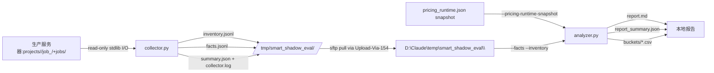

# Smart Shadow Evaluator 设计草案

- 创建日期：2026-05-06
- 状态：设计草案，spec review 迭代 3（ground-truth driven 重写）
- 适用范围：智能版方案 P0 阶段的"只读历史评估"工具
- 更新记录：
  - 2026-05-06 spec review 迭代 1：吸收 3 BLOCKER + 3 MAJOR + 3 MINOR + 2 NIT 评审。BLOCKER A 解决方案：复用现有 `pricing_runtime.json::cost_model`。BLOCKER B 解决方案：drop `whisper.wall_time_ms_total` from MVP。
  - 2026-05-06 spec review 迭代 2：发现 4 BLOCKER —— 我凭印象写字段映射没去 grep 真实代码，导致虚构了 `record.json` 文件、假设 `source_language` 在 JobRecord、假设 `usage_events` 的 schema 错误等。
  - 2026-05-06 spec review 迭代 3（**本次**）：基于 `.codex_tmp/us_fetch/extracted/` 12 个真实生产 job 样本 + 实际代码 `usage_meter.py` / `pricing_schema.py` / `ensure_whisper_alignment.py` 重写 §3.8 / §3.9 / §4.2，所有字段源都来自 ground truth 验证。
- 关联文档：
  - [`docs/plans/2026-05-04-smart-auto-pipeline-plan.md`](2026-05-04-smart-auto-pipeline-plan.md) §14 / §15 P0
  - [`docs/plans/2026-05-04-subtitle-audio-sync-plan.md`](2026-05-04-subtitle-audio-sync-plan.md) Phase A-D 已落地能力
  - [`docs/plans/2026-05-04-user-edit-audit-data-optimization-plan.md`](2026-05-04-user-edit-audit-data-optimization-plan.md) `user_edit_events.jsonl` schema
  - [`gateway/pricing_schema.py`](../../gateway/pricing_schema.py) `CostModelConfig` / `CreditsConfig`
  - [`src/services/usage_meter.py`](../../src/services/usage_meter.py) `UsageMeter` 真实 event schema

## 1. 背景与目标

智能版方案 §15 P0 要求在写代码之前，先用真实历史任务的离线评估，**校准方案中的阈值假设并验证 100 credits/min 是否毛利可行**。本设计文档定义这个 P0 评估工具。

### 1.1 P0 要回答的问题（按数据可得性分组）

**A. 旧 job 即可回答（pre-Phase-B/D 数据足够）**：

1. 历史 succeeded 任务里，主要配音说话人 ≤ 3 的占多少 % → 决定 Smart 适配率上限
2. 主 speaker 合格克隆样本可用率分布 → 校准 §7.2 阈值
3. 模拟 Smart 自动 retry 的次数和累计 TTS 时长 → 校准 §9 retry 闸（依赖 metering/usage_events.jsonl，**仅 post-metering-land 样本可用**）
7. 不同 main-speaker 阈值 / 克隆样本时长阈值下，Smart 适配率/拒绝率/降级率三条曲线

**B. 必须有 post-2026-05-05 (Phase B/D 落地后) 的 job 才能回答**：

4. `text_audio_drift_count` 历史分布 → 评估"无人审核"的字幕一致性可达上限
5. **（部分）** Whisper cache hit/miss 比例 + alignment_model 分布 → 间接评估 Whisper 默认开启的可行性。**真实 wall_time 不在 P0 范围**（runtime 不持久化）
6. 估算成本 p50 / p90 / p99 → 验证 100 credits/min 毛利

**C. P0 不直接回答（留给后续）**：

- Whisper 真实 wall_time（runtime 只 logger.info 不持久化；需要 cold-run 抽样或解析 runtime_logs，作为 post-P0 任务）
- 多模态 verifier 准确率（P3/P4）
- Smart 实测毛利（P5）

### 1.2 数据时效约束

`.codex_tmp/us_fetch/extracted/` 的 12 个真实历史样本（created_at 范围 2026-04-15 ~ 2026-04-24）**全部 pre-Phase-B 和 pre-Phase-D**，没有 `metering/` 和 `audit/` 子目录。这些样本可以：

- ✅ 用于本地开发期 collector 单测和冒烟（验证 pre-Phase-* 路径正确）
- ✅ 用于回答 §1.1A 的问题
- ❌ 不能回答 §1.1B 的问题——必须在生产环境跑 collector 抓 post-2026-05-05 的新 job

### 1.3 硬约束

- 不调任何付费外部 API（CLAUDE.md 硬约束）
- 不修改任何 job/project 目录、数据库、Gateway 状态
- 不触发 Whisper 重新对齐、TTS、clone、verifier 任何运行时副作用

## 2. 架构概览

两个独立 stdlib-only Python 脚本，通过 fact sheets 解耦：

```
[远端 154/155 host]                       [本地 Windows]
scripts/smart_shadow_eval_collector.py    scripts/smart_shadow_eval_analyzer.py
  ↓ 只读                                    ↓ 读 facts.jsonl + pricing_runtime.json
/tmp/smart_shadow_eval/<run_id>/          D:\Claude\temp\smart_shadow_eval\<run_id>\
  inventory.jsonl                           report.md
  facts.jsonl                               report_summary.json
  summary.json (含 is_complete_run)         buckets/by_*.csv
  collector.log
```

- **Collector** 负责"扫描 + 提取"，单 job 失败不影响其他
- **Analyzer** 负责"聚合 + 出报告"，反复调参重跑不需要再访问生产
- 两个程序通过 fact sheet schema v1 契约，schema 演进必须 bump 版本号

## 3. Collector 规格

文件：`scripts/smart_shadow_eval_collector.py`

**Job 发现策略（reviewer 迭代 3 新增）**：默认以 `jobs_root` 扫 JobRecord（`jobs/{job_id}.json`）为入口 —— JobRecord 是权威 `status` / `created_at` / `service_mode` / `tts_provider` / `tts_model` 等顶层字段的事实源，`projects/<pid>/job_<jid>/` 仅作 artifact lookup 二级落点。真实样本观察：`.codex_tmp/us_fetch/` 12 jobs/*.json vs 84 project_dirs —— 7× orphaned project_dirs 没对应 JobRecord（历史/异常数据，不作为 P0 评估样本）。collector 主循环 = `for job_record_file in jobs_root.glob("job_*.json")`；`summary.json` 增加 `orphaned_project_dir_count` 字段记录无 JobRecord 的 project_dir 数量；可选 `--scan-from projects` 作为诊断模式，P0 正式 evaluator 默认 jobs。

### 3.1 入参

```
--projects-root     默认 os.environ.get("AIVIDEOTRANS_PROJECTS_DIR", "/opt/aivideotrans/data/projects")
--jobs-root         默认 os.environ.get("AIVIDEOTRANS_JOBS_DIR", "/opt/aivideotrans/data/jobs")
--out-dir           默认 /tmp/smart_shadow_eval/<auto-run-id>
--since             YYYY-MM-DD（按 created_at 过滤；默认 2026-01-01）
--until             YYYY-MM-DD（可选，默认 today）
--limit             可选 int，仅扫前 N 个（**smoke 必经 --limit 3**）
--include-running   bool，默认 false（只扫 status=succeeded）
```

**默认路径优先级**：env var > 宿主机 bind-mount source（`/opt/aivideotrans/data/jobs`）> 在容器内运行时显式传 `/opt/aivideotrans/app/jobs`。

### 3.2 真实生产目录结构（来自 ground truth 扫描）

```
/opt/aivideotrans/data/
├── jobs/                                    ← 扁平结构
│   ├── job_<id>.json                       12/12 命中
│   └── job_<id>.events.jsonl               12/12 命中（lifecycle events，不是成本计量）
└── projects/<project_id>/                   ← 容器层
    └── job_<job_id>/                       ← 实际 job 目录（2 级嵌套）
        ├── download_metadata.json          12/12
        ├── manifest.json                   3/12 (可选)
        ├── project_state.json              12/12
        ├── review_state.json               10/12
        ├── transcript/
        │   ├── transcript.json             12/12 (核心 - speaker/duration 事实源)
        │   ├── raw_assemblyai.json         9/12
        │   ├── s2_review_result.json       11/12
        │   ├── s2_review_audit.json        11/12
        │   ├── s2_pass1_result.json        6/12 (Studio 才有)
        │   ├── s2_pass2_result.json        6/12
        │   └── s2_pass3_result.json        4/12
        ├── translation/
        │   ├── segments.json               9/12
        │   └── glossary.json               5/12
        ├── editor/
        │   └── segments.json               5/12 (post-edit 才有)
        ├── output/
        │   ├── alignment_report.txt        3/12
        │   ├── subtitles_zh.srt            3/12
        │   └── subtitle_quality_report.json 0/12 ← Phase B+ 新字段
        │       └── subtitle_cues.json      0/12 ← Phase D+ 新字段
        ├── metering/                       0/12 ← 新落地，pre-metering job 没有
        │   └── usage_events.jsonl
        └── audit/                          0/12 ← Phase 0 audit (2026-05-04+) 新落地
            └── user_edit_events.jsonl
```

**关键发现**：12 个真实历史样本（2026-04-15 ~ 2026-04-24）pre-dates 几个新落地能力。实际生产环境 post-2026-05-05 的 job 应该有完整的 metering / audit / Phase B/D 文件。

### 3.3 Fact sheet schema (v1)

每行一个 JSON object（jsonl），写入 `facts.jsonl`：

```json
{
  "schema_version": 1,
  "run_id": "2026-05-06T08-15Z-host154-a3f9d",
  "job_id": "job_0bed43bbf7dc415486f444dad86195d4",
  "project_id": "342bbde3-903b-4944-a53c-12a1de0b5ca9",
  "root_job_id": "job_b2429298f2bf4c9aa67e94d1c1011fb2",
  "service_mode": "studio",
  "status": "succeeded",
  "created_at": "2026-04-19T13:36:59.416283+00:00",
  "duration_seconds": 254.0,
  "source_language": "en_us",
  "target_language": "zh-CN",
  "tts_provider": "minimax",
  "tts_model": "speech-2.8-hd",
  "edit_generation": 1,
  "had_post_edit": true,

  "artifact_presence": {
    "manifest_json": false,
    "project_state_json": true,
    "review_state_json": true,
    "transcript_json": true,
    "s2_review_result_json": true,
    "s2_pass1_result_json": true,
    "translation_segments_json": true,
    "editor_segments_json": true,
    "subtitle_quality_report": false,
    "subtitle_cues": false,
    "metering_usage_events": false,
    "audit_user_edit_events": false
  },

  "speaker_stats": {
    "asr_speaker_count": 3,
    "speaker_duration_shares": [0.45, 0.35, 0.20],
    "speaker_count_by_threshold": {
      "0.05": 3,
      "0.10": 3,
      "0.15": 3,
      "0.20": 2
    }
  },

  "clone_sample_stats": {
    "eligible_speakers": 3,
    "eligible_sample_count_buckets_by_speaker": [
      {"≥5s": 8, "≥8s": 5, "≥10s": 3, "≥15s": 1},
      {"≥5s": 6, "≥8s": 3, "≥10s": 2, "≥15s": 0},
      {"≥5s": 4, "≥8s": 2, "≥10s": 1, "≥15s": 0}
    ]
  },

  "actual_clone_stats": {
    "cloned_speakers": 0,
    "preset_speakers": 3,
    "voice_ids_by_speaker": ["moss_audio_85bcf79d-...", "preset_chinese_male_1", "preset_chinese_female_2"]
  },

  "retry_stats": {
    "rewrite_count": 5,
    "retts_count": 12,
    "retts_total_duration_ms": 22400,
    "edit_generation_count": 1
  },

  "subtitle_sync": {
    "text_audio_drift_count": null,
    "_reason_null": "subtitle_quality_report not present (pre-Phase-B job)"
  },

  "whisper": {
    "alignment_model": null,
    "alignment_fingerprint": null,
    "whisper_aligned_cue_count": null,
    "proportional_fallback_cue_count": null,
    "whisper_sidecar_count": null,
    "_reason_null": "subtitle_cues.json absent (pre-Phase-D job; no Whisper deliverable)"
  },

  "workflow_alignment_cache": {
    "cache_hit_blocks": null,
    "block_count": null,
    "_reason_null": "DSP TTS aligned-audio stage cache (NOT Whisper); 0/12 in pre-Phase-* samples"
  },

  "usage_meter": {
    "_present": false,
    "_reason_null": "metering/usage_events.jsonl not present (pre-metering job)"
  },

  "user_edits": {
    "_present": false,
    "_reason_null": "audit/user_edit_events.jsonl not present (pre-audit-land job)"
  }
}
```

字段语义：

- `artifact_presence.*` 描述每个源文件是否存在；analyzer 用这个区分"该字段为 0"和"无数据"
- 当源文件不存在时，对应字段块整体替换为 `{"_present": false, "_reason_null": "..."}` 而不是逐字段 null —— 让 analyzer 在缺数据场景写少量代码即可处理
- `speaker_duration_shares` 按降序排列（per speaker_id 聚合 transcript.json lines 的 end_ms-start_ms 之和，归一化）
- `speaker_count_by_threshold` 在 collector 阶段一次性算好若干常用阈值；analyzer 仍可基于原始 `speaker_duration_shares` 算任意阈值
- `eligible_sample_count_buckets_by_speaker` 是**预聚合的桶计数**（≥5s/≥8s/≥10s/≥15s）—— 不再输出 per-sample 完整 list（避免 §6.1 reviewer 提到的指纹侧信道隐私风险）
- `retts_total_duration_ms` 来自 metering 的真实 `duration_ms` 字段（reviewer 迭代 2 提示）—— 不再从 chars 反推
- `had_post_edit = (edit_generation > 0) OR (copy_of_job_id is not None)` —— copy_as_new 副本继承被编辑过的事实，否则 §3 / §10 统计会低估 post-edit 影响面
- **`whisper.*` 必须严格只含 deliverable-time Whisper（faster-whisper）真实产物**：cue source 包含 `"semantic_block_v2_whisper_aligned"` 的为 whisper-aligned，否则为 proportional fallback；sidecar 文件命名 `{wav}.whisper_<model>_<lang>.json`（[ensure_whisper_alignment.py:41](../../src/services/subtitles/ensure_whisper_alignment.py:41)）
- **`workflow_alignment_cache.*` 是另一回事**：来自 [`alignment_stage_runner.py`](../../src/modules/workflow/alignment_stage_runner.py)，是 DSP TTS aligned-audio stage 的 cache，**不是 Whisper cache**。作者前一版误把它放进 `whisper.*`，导致"Whisper 覆盖率"会被 DSP cache 命中污染 —— Codex 迭代 4 review 抓到的 P1 已修
- `EnsureStatus.blocks_processed` 是 runtime 内存态，不持久化 —— 已从 schema 删除

**已删除字段（与 reviewer 迭代 2 评审一致）**：

| 想要的字段 | 为什么删 | 替代 |
|---|---|---|
| `keep_original_duration_share` | segments.json 无 keep_original 标记字段（0/12 命中） | DROP |
| `uncertain_speaker_duration_share` | s2 outputs 无 uncertain 标签（用 correct_speaker actions 替代） | 改：`s2_corrections_count` |
| `clone_sample_stats.reject_reason_counts` | s2 outputs 无 too_short / overlapped_voice 等明确分类 | DROP（保留 eligible_sample_count_buckets 即可） |
| `clone_sample_stats.uncertain_speaker_sample_count` | 同上 | DROP |
| `whisper.wall_time_ms_total` | runtime 只 logger.info 输出，不持久化 | DROP |
| `whisper.fallback_reason_counts` | grep 验证：`subtitle_cues.json` 不含此字段 | DROP |
| `whisper.blocks_total / blocks_aligned` | grep 验证：`subtitle_cues.json` 不含此字段 | DROP |
| `whisper.blocks_processed` | runtime-only（`EnsureStatus.blocks_processed`），不持久化 | DROP |
| `whisper.cache_hits / cache_misses` | spec 作者前两轮误命名；真实是 `cache_hit_blocks`（写在 `project_state.json::stages.<alignment_stage>.payload`） | rename for `cache_hit_blocks` |

### 3.4 Inventory schema (v1)

每行一条精简记录，写入 `inventory.jsonl`，全量扫描时使用：

```json
{
  "schema_version": 1,
  "job_id": "job_0bed43bbf7dc415486f444dad86195d4",
  "project_id": "342bbde3-903b-4944-a53c-12a1de0b5ca9",
  "status": "succeeded",
  "created_at": "2026-04-19T13:36:59.416283+00:00",
  "duration_seconds": 254.0,
  "source_language": "en_us",
  "target_language": "zh-CN",
  "service_mode": "studio",
  "had_post_edit": true
}
```

用途：先全量扫得到 inventory，再按 §14.1 分层抽样产生 fact sheets，避免每次重抽都重新扫文件系统。

### 3.5 Summary schema (v1)

`summary.json`，run 结束时一次性写：

```json
{
  "schema_version": 1,
  "run_id": "...",
  "started_at": "...",
  "finished_at": "...",
  "args": {...},
  "is_complete_run": true,
  "scan_stats": {
    "projects_total": 0,
    "jobs_inventoried": 0,
    "jobs_factsheeted": 0,
    "skipped_for_missing_identity": 0,
    "skipped_for_status_filter": 0,
    "skipped_for_date_filter": 0
  },
  "errors": [
    {"job_id": "...", "error_type": "...", "message": "...", "traceback": "..."}
  ],
  "git_sha": "...",
  "hostname": "..."
}
```

`is_complete_run` 是关键 gate：collector 中断退出时尽力写一份 `is_complete_run=false`；无法写时（OOM 等）则不写。Analyzer 默认拒读 `is_complete_run != true` 的 dump（`--allow-incomplete-run` 显式覆盖）。

### 3.6 错误处理 + 退出码（统一表）

| 场景 | collector 行为 | exit code |
|---|---|---|
| 单 job 解析失败 | 记 `summary.errors[]`，继续 | 由总结果决定 |
| `projects-root` / `jobs-root` 不存在 | log error，不写 summary | 2 |
| `out-dir` 不可写 | log error，不写 summary | 2 |
| 0 job 满足过滤条件 | summary 写 `is_complete_run=true` + `jobs_factsheeted=0`；产生空 facts.jsonl + 空 inventory.jsonl | 0 |
| ≥ 1 job 解析成功 | summary 写 `is_complete_run=true` | 0 |
| 全部 job 都解析失败 | summary 写 `is_complete_run=true` + `errors` 满 | 1 |
| 收到 SIGINT/SIGTERM | 已写的 *.tmp 保留但不 rename；summary 尽力写 `is_complete_run=false` | 130 |
| 致命异常（OOM、不可处理） | summary 尽力写 `is_complete_run=false` 并把异常进 errors[] | 1 |

**"complete but empty" ≠ "failed"** —— 0 个 fact sheet 且无致命错（如 since/until 过滤掉所有）退 0 不退 1。

### 3.7 Atomic write 语义

- `facts.jsonl` / `inventory.jsonl`：每 job append 写到 `facts.jsonl.tmp` / `inventory.jsonl.tmp`
- Run 完整结束（包括 0 job 的 case）后 `os.rename(*.tmp, *)` atomic rename
- `summary.json`：run 结束时一次性写完整内容
- sftp 拉走的人看到 `facts.jsonl` 存在 = run 完整；只看到 `*.tmp` = run 中断
- analyzer 读 facts.jsonl 前先校验 summary.json 的 `is_complete_run`

### 3.8 只读边界（结构性约束）

- collector.py 文件**只 import stdlib**：白名单 = `argparse / json / pathlib / datetime / hashlib / sys / os / signal / traceback / socket / subprocess / logging / collections / typing / dataclasses / re / time`
- **禁止 import 项目业务模块**（`src.*` / `gateway.*`）和**任何外部 SDK**（`anthropic / google.generativeai / boto3 / openai / httpx / pydantic / faster_whisper`）
- 不连数据库、不连 Gateway HTTP API、不调任何 provider
- 守卫测试 `tests/test_smart_shadow_eval_collector_imports.py` 用 AST 扫 collector.py 的 import 语句

### 3.9 Artifact path constants（基于真实结构）

```python
# 在 collector.py 顶部
ARTIFACT_PATHS = {
    # JOBS root (flat)
    "job_record":            "{job_id}.json",                          # under jobs_root
    "job_events":            "{job_id}.events.jsonl",                  # under jobs_root

    # PROJECT/JOB level (2-level nested: projects/<project_id>/job_<job_id>/...)
    "project_state":         "project_state.json",
    "review_state":          "review_state.json",
    "manifest":              "manifest.json",
    "download_metadata":     "download_metadata.json",

    # transcript/
    "transcript":            "transcript/transcript.json",
    "s2_review_result":      "transcript/s2_review_result.json",
    "s2_review_audit":       "transcript/s2_review_audit.json",
    "s2_pass1_result":       "transcript/s2_pass1_result.json",

    # translation/
    "translation_segments":  "translation/segments.json",

    # editor/
    "editor_segments":       "editor/segments.json",

    # output/ (Phase B+)
    "subtitle_quality_report": "output/subtitle_quality_report.json",
    "subtitle_cues":           "output/subtitle_cues.json",

    # metering/ (post-metering-land)
    "usage_events":          "metering/usage_events.jsonl",

    # audit/ (Phase 0 audit, 2026-05-04+)
    "user_edit_events":      "audit/user_edit_events.jsonl",
}

# Project dir layout helper:
#   project_dir = projects_root / <project_id> / "job_" + <job_id_without_prefix>
# Job ID stored as "job_<uuid>" in JobRecord; project_dir uses same prefix
```

**配套契约级守卫**：`tests/test_smart_shadow_eval_paths_in_sync.py` —— 跑 fixture project，确认每条 ARTIFACT_PATHS 定义在 fixture 中至少有 1 个真实文件命中（可分 pre-Phase-A-D 和 post-Phase-A-D 两组 fixture）。业务模块改 path 时，fixture 不更新就让此测试红。

### 3.10 字段来源映射（基于真实样本验证）

| Fact sheet 字段 | 来源文件 + key path | 命中 | 备注 |
|---|---|---|---|
| `job_id / status / created_at / service_mode / tts_provider / tts_model` | `jobs/{job_id}.json` 顶层字段 | 12/12 | JobRecord 直接字段 |
| `project_id` | `project_state.json::project_id` 或路径推导 | 12/12 | 也可从 `projects/<pid>/job_<jid>/` 路径直接拿 |
| `root_job_id` | `jobs/{job_id}.json::root_job_id`（自身 ID 若非 clone） | 12/12 | `copy_of_job_id` 可辅助检测 clone |
| `duration_seconds` | `project_state.json::stages.ingestion.payload.duration_ms / 1000` | 12/12 | **Reviewer 迭代 2 修复**：不在 JobRecord |
| `source_language` | `project_state.json::stages.media_understanding.payload.language` | 12/12 | **Reviewer 迭代 2 修复**：不在 JobRecord |
| `target_language` | 默认硬编码 `"zh-CN"`（项目当前架构只支持中文目标） | 12/12 | 见 [project_i18n_direction.md](C:\Users\Administrator\.claude\projects\D--Claude-AIVideoTrans-Codex-web-mvp\memory\project_i18n_direction.md) |
| `edit_generation / had_post_edit` | `jobs/{job_id}.json::edit_generation`（>0 则 had_post_edit=true） **OR** `jobs/{job_id}.json::copy_of_job_id is not None` | 12/12 | reviewer 迭代 3 修复：copy_as_new 副本继承被编辑事实 |
| `artifact_presence.*` | 每文件 `Path.is_file()` | 必 | 文件存在性检查，作为后续字段 nullability 决策的 gate |
| `speaker_stats.asr_speaker_count` | `project_state.json::stages.media_understanding.payload.speaker_count` | 12/12 | 直接字段 |
| `speaker_stats.speaker_duration_shares` | `transcript/transcript.json::lines[]` 按 `speaker_id` 聚合 `(end_ms - start_ms)` | 12/12 | 计算后归一化降序 |
| `speaker_stats.speaker_count_by_threshold` | 由 `speaker_duration_shares` 派生 | 必 | 在 collector 计算多档（0.05/0.10/0.15/0.20） |
| `clone_sample_stats.eligible_*` | `transcript/transcript.json::lines[]` 按 speaker 聚合 + 桶计数 | 12/12 | 仅看 duration ≥ {5,8,10,15}s 桶；**不再判定 SNR / overlap**（无数据源） |
| `actual_clone_stats.voice_ids_by_speaker` | `editor/segments.json::voice_id`（若存在） else `translation/segments.json::voice_id` | 5/12 + 9/12 | 推断 cloned vs preset：moss_audio_* / 长 hash 视为 cloned，预设音色 ID 视为 preset |
| `retry_stats.rewrite_count` | `metering/usage_events.jsonl` filter `kind=llm AND task IN REWRITE_TASKS`，REWRITE_TASKS = `{"s5_rewrite", "s5_rewrite_strict", "s5_short_content_compact"}` | 0/12 | grep 验证：[`src/pipeline/process.py:167,244,640,5522`](../../src/pipeline/process.py:167)；旧样本无 metering；fallback：用 `editor/segments.json::rewrite_count` 求和（5/12） |
| `retry_stats.retts_count / retts_total_duration_ms` | `metering/usage_events.jsonl` filter `kind=tts AND bucket IN ("post_tts_resynth", "post_edit_resynth")`，sum `duration_ms` | 0/12 | grep 验证：[`src/services/usage_meter.py:121,143`](../../src/services/usage_meter.py:121)；旧样本无 metering；fallback：null + reason |
| `subtitle_sync.text_audio_drift_count` | `output/subtitle_quality_report.json::text_audio_drift_count` | 0/12 | **prod smoke 验证字段名**（`subtitle_quality_report.json` 在 .codex_tmp 0/12 不可校对，需 post-Phase-B job） |
| `whisper.alignment_model / alignment_fingerprint` | `output/subtitle_cues.json::alignment_model` / `alignment_fingerprint` | 0/12 | grep 验证：[`ensure_whisper_alignment.py:350,356`](../../src/services/subtitles/ensure_whisper_alignment.py:350)；仅 Phase D + Whisper 双闸门启用后有 |
| `whisper.whisper_aligned_cue_count` | `output/subtitle_cues.json::cues[]` 中 `source` 包含 `"semantic_block_v2_whisper_aligned"` 的 cue 数 | 0/12 | grep 验证：source 字面值常量 [`cue_builder.py:179`](../../src/modules/subtitles/cue_builder.py:179)、过滤逻辑 [`ensure_whisper_alignment.py:149`](../../src/services/subtitles/ensure_whisper_alignment.py:149) |
| `whisper.proportional_fallback_cue_count` | `output/subtitle_cues.json::cues[]` 中非 whisper source 的 cue 数 | 0/12 | 由 `total_cue_count - whisper_aligned_cue_count` 派生 |
| `whisper.whisper_sidecar_count` | glob `**/*.whisper_*_*.json` under project_dir，**只计数不输出路径** | 0/12 | 文件命名规范：[`whisper_align/__init__.py:158`](../../src/services/whisper_align/__init__.py:158)（`{wav}.whisper_<model>_<lang>.json`）；旁路 sidecar，per-WAV，不持久化项目级 hit/miss |
| `workflow_alignment_cache.cache_hit_blocks / block_count` | `project_state.json::stages.<alignment_stage>.payload.cache_hit_blocks` | 0/12 | grep 验证：[`alignment_stage_runner.py:175`](../../src/modules/workflow/alignment_stage_runner.py:175)；**这是 DSP TTS aligned-audio cache，不是 Whisper cache**；Codex 迭代 4 review P1 修复 —— 不能放进 `whisper.*` |
| `usage_meter.*` | `metering/usage_events.jsonl` 按 `kind` / `bucket` / `task` 聚合 | 0/12 | grep 验证：[`src/services/usage_meter.py:118-145`](../../src/services/usage_meter.py:118)；旧样本无；详见 §4.2 |
| `user_edits.*` | `audit/user_edit_events.jsonl` 按 `event_type` 计数 + `effective_marker` 过滤 | 0/12 | **prod smoke 验证字段名**（user_edit_events.jsonl 在 .codex_tmp 0/12 不可校对，按 [user_edit_audit.py](../../src/services/jobs/user_edit_audit.py) 真实写入点） |

**注意**：表格里 0/12 的字段不代表"不写代码"，而是"代码必须能优雅处理 artifact_presence=false 的情形"。每条字段源现状：

- **已通过 grep 真实代码 + .codex_tmp 样本验证字段名/路径**：所有 12/12 字段 + Whisper、Metering、REWRITE_TASKS 三组（见各行末尾 grep 引用）
- **待 prod smoke 验证字段名**：`subtitle_quality_report.json::text_audio_drift_count`（Phase B+ 输出）、`audit/user_edit_events.jsonl` schema（Phase 0 audit 落地后才有真实样本）、Whisper `alignment_stage` 在 process_runner 中的实际 stage 名（旧样本无 alignment stage 可校）

### 3.11 Smoke validation 用 .codex_tmp 样本

写完 collector 后，在本地用 `.codex_tmp/us_fetch/extracted/opt/aivideotrans/data/` 12 个样本做 dry-run：

```bash
python scripts/smart_shadow_eval_collector.py \
  --projects-root D:/Claude/AIVideoTrans_Codex_web_mvp/.codex_tmp/us_fetch/extracted/opt/aivideotrans/data/projects \
  --jobs-root D:/Claude/AIVideoTrans_Codex_web_mvp/.codex_tmp/us_fetch/extracted/opt/aivideotrans/data/jobs \
  --out-dir D:/Claude/temp/smart_shadow_eval/local_smoke_$(date +%Y%m%dT%H%M) \
  --limit 3
```

预期结果：12 个 fact sheets 都生成；§1.1A 字段全有值；§1.1B 字段全 null + `_reason_null`。这是验证 collector 在"老样本"上不崩 + 字段映射对的方式。

## 4. Analyzer 规格

文件：`scripts/smart_shadow_eval_analyzer.py`

### 4.1 入参

```
--facts <path>                    facts.jsonl 路径（必填）
--inventory <path>                inventory.jsonl 路径（可选，用于全量分母统计）
--pricing-runtime-snapshot <path> pricing_runtime.json 快照（必填，否则 cost / margin 节标 N/A）
--out-dir <path>                  输出报告目录（必填）
--phase-cutoff-date               默认 2026-05-05，"Phase A-D 落地分界线"
--smart-eligibility-threshold-set 逗号分隔，默认 "0.05,0.10,0.15,0.20"
--min-sample-seconds-set          逗号分隔，默认 "5,8,10,15"
--allow-incomplete-run            bool，默认 false
--expected-schema-version         int，默认 1
```

### 4.2 Pricing 模型 + Smart 估算成本公式

**复用 `pricing_runtime.json` 的两个独立配置块**（grep 验证：[`gateway/pricing_schema.py:34-63`](../../gateway/pricing_schema.py:34)）：

来自 `pricing_runtime.json::cost_model`（`CostModelConfig`）：

```text
point_cost_rmb                      # 每 credit 内部 RMB 成本（默认 0.015）
point_price_rmb                     # 每 credit 用户侧 RMB 价（默认 0.03）
k_cn_chars_per_src_min              # 中文 TTS 速度 (chars/min, 默认 250)
translate_cost_rmb_per_src_min      # 默认 0.03
s2_review_cost_rmb_per_src_min      # 默认 0.02
rewrite_cost_rmb_per_src_min        # 默认 0.02
server_cost_rmb_per_src_min         # 默认 0.03
```

来自 `pricing_runtime.json::credits`（`CreditsConfig`，**不在 cost_model 块**）：

```text
voice_clone_cost_credits    # 每次 clone 折算多少 credits（默认 500）
```

> **reviewer 迭代 3 修复**：spec 作者前两轮把 `voice_clone_cost_credits` 误归到 `cost_model` 块；按代码真实位置（[`gateway/pricing_schema.py:38`](../../gateway/pricing_schema.py:38) `CreditsConfig`），路径必须是 `pricing_runtime.credits.voice_clone_cost_credits`。

**Smart 估算成本公式（per-job）**：

```text
src_min        = duration_seconds / 60

# 基线：Studio 路径成本（已含 LLM/TTS 在按分钟摊销里）
baseline_rmb   = src_min × (translate_cost + s2_review_cost + rewrite_cost + server_cost)_rmb_per_src_min

# Smart 因为 retry 多出来的 cost
# 优先使用 metering 真实数据：
REWRITE_TASKS = {"s5_rewrite", "s5_rewrite_strict", "s5_short_content_compact"}
RETTS_BUCKETS = {"post_tts_resynth", "post_edit_resynth"}

if metering present:
    retts_extra_chars_rmb = sum(usage_events where kind="tts" AND bucket IN RETTS_BUCKETS)::billed_chars
                            × (rewrite_cost_rmb_per_src_min / k_cn_chars_per_src_min)
    rewrite_extra_rmb     = count(usage_events where kind="llm" AND task IN REWRITE_TASKS)
                            × (rewrite_cost_rmb_per_src_min / k_cn_chars_per_src_min × avg_chars_per_rewrite)
                            # avg_chars_per_rewrite: 用 input_text_chars 平均
    smart_retry_rmb       = retts_extra_chars_rmb + rewrite_extra_rmb
else:
    # Fallback：从 editor/segments.json::rewrite_count 求和
    smart_retry_rmb       = sum(rewrite_count) × baseline_per_segment_rewrite_cost
                            # 标 _estimate_quality: "low (no metering data)"

# Smart 自动 clone cost（注意：voice_clone_cost_credits 在 pricing_runtime.credits.* 块，不是 cost_model）
clone_rmb       = clone_calls × pricing_runtime.credits.voice_clone_cost_credits × cost_model.point_cost_rmb

# Smart 总估算
smart_total_rmb = baseline_rmb + smart_retry_rmb + clone_rmb

# Revenue 和 Margin
revenue_rmb     = 100 × src_min × point_price_rmb
margin_rmb      = revenue_rmb − smart_total_rmb
margin_pct      = margin_rmb / revenue_rmb
```

报告里所有 cost / margin 数字必须在所在节顶部加：

```
> 成本估算基于 pricing_runtime.json snapshot at <as_of_path>。`cost_model` 是
> 项目内部的高层成本估算（per-source-min），不是 provider USD 真实账单。结论
> 仅作 P0 阈值校准参考，不构成财务事实。
> 
> 当 metering 数据缺失时（pre-metering job），成本估算降级为 baseline-only +
> rewrite_count fallback；这部分数字标 _estimate_quality: "low"，不参与
> p90/p99 风险判定。
```

### 4.3 报告内容（`report.md`）

按以下 11 节输出：

| § | 节标题 | 关键数字 | 数据依赖 |
|---|---|---|---|
| 1 | Run metadata | run_id / 扫了多少 / 跳了多少 / 错了多少 / git sha / `is_complete_run` | summary.json |
| 2 | 数据可用性 | 按 `phase-cutoff-date` 切两段，每段统计各 `artifact_presence.*` 字段的 true 占比 | facts |
| 3 | Speaker 数分布 | 4 档 threshold 下的 main_speaker 直方图；**核心**：main ≤ 3 占比 | facts (12/12 可) |
| 4 | 克隆样本可用率 | `eligible_sample_count_buckets` 按 main_speaker_count 分桶 | facts (12/12 可) |
| 5 | Retry 估算 | metering-based: rewrite/retts 分布；fallback-based: editor.segments.json rewrite_count | metering 部分需 post-metering-land |
| 6 | 字幕一致性 | text_audio_drift_count 分布 | **仅 Phase B+ 子集** |
| 7 | Whisper 覆盖 | `alignment_model` 分布；`whisper_aligned_cue_count / total_cue_count` 比例分布；`proportional_fallback_cue_count`；`whisper_sidecar_count`；**真实 cache hit/miss 当前未持久化，P0 不统计**；**wall_time 不在 P0 范围** | **仅 Phase D+ 且 Whisper 双闸门启用的子集** |
| 7b | Workflow alignment cache（诊断用） | `workflow_alignment_cache.cache_hit_blocks / block_count` 比例分布；**注：这是 DSP TTS aligned-audio cache，不是 Whisper cache，不能用作 "Whisper 默认开启决策" 依据** | post-Phase-* job 都有 |
| 8 | 成本估算 | 按 §4.2 公式 RMB；p50/p90/p99；**报告顶部强提示 pricing snapshot path 和 _estimate_quality** | metering 部分需 post-metering-land |
| 9 | 毛利毛估 | revenue − smart_total_rmb；p50/p90/p99 | metering 部分需 post-metering-land |
| 10 | §7.2 阈值校准 | 4 档 main-speaker × 4 档 min-sample-seconds 矩阵：Smart 适配率 / 拒绝率 / 降级率 | facts (12/12 可) |
| 11 | 风险标记 | p90 / p99 是否落在 100 cred/min 内；标 PASS / MARGINAL / FAIL；**若 metering 数据 < 50% 则标 INCONCLUSIVE** | metering 部分需 post-metering-land |

侧文件：`report_summary.json`（机器可读）+ `buckets/by_*.csv`（透视分桶）。

## 5. 数据流



## 6. 错误处理 & 安全边界

### 6.1 数据隐私

- collector **不** 写出原始字幕全文、原始音频路径、用户上传文件名
- 必要时只保留：短 hash（前 8 位 sha256）、count、duration_ms、reason code 字面量
- `eligible_sample_count_buckets_by_speaker` 是预聚合桶计数（≥5s/≥8s/...），**不输出 per-sample 完整时长 list**（防侧信道指纹）
- 单 fact sheet 行宽 ≤ 4KB；超长字段截断 + `_truncated: true` 标记
- **专项 PII 注入测试** `tests/test_smart_shadow_eval_collector_pii_guard.py`，fixture 故意包含以下真实泄漏向量：
  - `transcript/transcript.json::lines[].source_text` / `cn_text` 含手机号 / 身份证号 / 中文姓名
  - `download_metadata.json::video_title` 含中文人名 / 财务数字（如 "$19,100,000"）
  - **`editor/segments.json::cn_text`** 含真实人名（如 "贝基·奎克 / 沃伦·巴菲特"）
  - **`editor/segments.json::display_name`** 含中文人名
  - **`translation/segments.json::cn_text`** 含真实人名
  - **`review_state.json::stages.translation_review.payload.segments.*.cn_text`** 含真实人名
  - 文件名含中文姓名（如 project_dir 名包含用户上传时的视频文件名）
  - 断言：`facts.jsonl` 整文件**不出现任何上述 fixture 字面量**（用 `assert "贝基·奎克" not in facts_content` 等多关键字断言）
  - collector 输出只允许：count / 短 hash（前 8 位 sha256）/ duration_ms / 枚举 reason code / 数值字段

### 6.2 可重入性

- collector 中断后再跑会**覆盖**（不是 append）现有 out-dir
- 不做断点续跑（首版简单优先）
- 每次 run 用新 `run_id`（含 ISO8601 时间戳），历史 run 数据保留在不同目录

## 7. 测试策略

### 7.1 Collector tests + 真实 fixture

**优先方案**：直接复用 `.codex_tmp/us_fetch/extracted/` 的 12 个真实样本作为集成测试 fixture（git ignored，但本地开发期可用）。

**正式 fixture**：`tests/fixtures/smart_shadow_eval/` 用 5 个最小化 mini project 目录覆盖以下场景：

| Fixture | 场景 | 来源 | 验证点 |
|---|---|---|---|
| `01_post_phase_full/` | 老样本：含 metering/audit/Phase B/D 全套 | 手工构造（ground truth schema） | fact sheet 各 `artifact_presence` 全 true |
| `02_pre_phase_b/` | 中间样本：无 subtitle_quality_report | 手工构造 | `subtitle_quality_report=false`、`text_audio_drift_count=null` |
| `03_pre_phase_d/` | 中间样本：无 Whisper alignment stage | 手工构造 | `whisper.*=null` |
| `04_studio_post_edit/` | Studio 跑过 post-edit | 复制 .codex_tmp 真实 job | `had_post_edit=true`、`edit_generation > 0` |
| `05_corrupted_state/` | project_state.json 缺关键 stage | 手工构造（破坏 ingestion stage） | 跳过、计 `skipped_for_missing_identity` |

每个 fixture 用最小 JSON 文件造（不要原始音频/真字幕）。

### 7.2 Path constants 同步守卫

文件：`tests/test_smart_shadow_eval_paths_in_sync.py`

- 用 fixture project（`01_post_phase_full/`）跑 collector
- 断言 `ARTIFACT_PATHS` 的每个 entry 在 fixture 中至少有 1 个真实文件命中
- 业务模块改路径时，fixture 不更新就让此测试红

### 7.3 Collector import 守卫

文件：`tests/test_smart_shadow_eval_collector_imports.py`

AST 扫 `scripts/smart_shadow_eval_collector.py`，断言所有 `import X` / `from X import Y` 的 `X` 在 §3.8 stdlib 白名单内。

### 7.4 PII 注入守卫

文件：`tests/test_smart_shadow_eval_collector_pii_guard.py`

详见 §6.1。

### 7.5 Analyzer tests

文件：`tests/test_smart_shadow_eval_analyzer.py`

Feed 手工构造的 20 行 facts.jsonl + 一个固定 pricing_runtime.json，断言：
- main ≤ 3 占比、cost p50、§7.2 矩阵中某 cell 数字符合预期
- pricing snapshot 缺失时，cost / 毛利节出 "N/A"
- `is_complete_run=false` 时拒读，`--allow-incomplete-run` 时接受
- `expected-schema-version` 不匹配时拒读
- metering 缺失时，cost 估算降级 + 标 `_estimate_quality: "low"`

### 7.6 测试运行

```
python -m pytest tests/test_smart_shadow_eval_*.py -v
```

无外部依赖、纯 stdlib + pytest，CI 友好。

## 8. 执行步骤

```
[本地]   0. 写完 collector + analyzer + tests，pytest 通过

[本地]   1. LOCAL SMOKE：用 .codex_tmp/us_fetch/ 12 个真实样本 dry run
            python scripts/smart_shadow_eval_collector.py \
              --projects-root D:/Claude/AIVideoTrans_Codex_web_mvp/.codex_tmp/us_fetch/extracted/opt/aivideotrans/data/projects \
              --jobs-root     D:/Claude/AIVideoTrans_Codex_web_mvp/.codex_tmp/us_fetch/extracted/opt/aivideotrans/data/jobs \
              --out-dir       D:/Claude/temp/smart_shadow_eval/local_smoke
            预期：12 个 fact sheet 生成；§1.1A 字段有值；§1.1B 字段全 null + _reason_null

[本地]   2. PROD SMOKE：把 collector.py 推到 154
            D:\daili\scripts\Upload-Via-154.cmd ^
              D:\Claude\AIVideoTrans_Codex_web_mvp\scripts\smart_shadow_eval_collector.py ^
              /opt/aivideotrans/app/scripts/smart_shadow_eval_collector.py

[154]    3. PROD SMOKE：在 154 主机（不是容器）跑 --limit 3
            cd /opt/aivideotrans/app
            python3 scripts/smart_shadow_eval_collector.py \
              --projects-root /opt/aivideotrans/data/projects \
              --jobs-root /opt/aivideotrans/data/jobs \
              --out-dir /tmp/smart_shadow_eval/smoke-$(date -u +%Y%m%dT%H%MZ) \
              --limit 3 \
              --since 2026-05-05    # 强制取 post-Phase-D job

[本地]   4. PROD SMOKE：sftp 拉 facts.jsonl 回本地，肉眼检查 PII / Phase B/D 字段是否有值

[154]    5. 正式扫描：去掉 --limit
            python3 scripts/smart_shadow_eval_collector.py \
              --projects-root /opt/aivideotrans/data/projects \
              --jobs-root /opt/aivideotrans/data/jobs \
              --out-dir /tmp/smart_shadow_eval/$(date -u +%Y%m%dT%H%MZ)-host154 \
              --since 2026-01-01

[本地]   6. sftp 拉 /tmp/smart_shadow_eval/<run_id>/ 回本地

[本地]   7. 拉 pricing_runtime.json 快照：
            scp ... root@154:/opt/aivideotrans/config/pricing_runtime.json D:\Claude\temp\...

[本地]   8. 跑 analyzer
[本地]   9. 看 report.md
[ 关键审核节点 ]
            - report.md 第 8/9/11 节给 owner 过目
            - PASS → 进 P1
            - MARGINAL / INCONCLUSIVE → 调阈值或等更多 post-Phase-D 数据
            - FAIL → 回 §16 owner 决策
```

> 注：§8 步骤 4 的 sftp 命令具体形式按当时 D:\daili\scripts\ 下可用脚本替换；如有 Download-Via-154.cmd 优先用。

## 9. 已锁定的设计决策

参考审核回顾（2026-05-06 与 Codex 多轮讨论 + spec review 迭代 1/2 + 真实样本扫描）：

| 决策 | 内容 |
|---|---|
| 数据源策略 | C 方案：远端 collector → 本地 analyzer 拆开 |
| Spec 文档落点 | `docs/plans/`（与项目战略文档同目录） |
| Main speaker 阈值 | collector 输出原始 `speaker_duration_shares`，analyzer 多阈值扫描 |
| 克隆样本统计 | 区分 `actual_clone_stats`（实际）和 `eligible_clone_sample_stats`（反事实） |
| 克隆样本秒数粒度 | **桶计数 ≥5s/≥8s/≥10s/≥15s**（不是 per-sample list，防侧信道指纹） |
| Pricing 数据源 | A1：复用 `pricing_runtime.json::cost_model` |
| Wall time 数据 | B2：drop from MVP（runtime 不持久化） |
| Project 目录结构 | `projects/<project_id>/job_<job_id>/...` 2 级嵌套 |
| Job 元数据来源 | `duration_seconds` / `source_language` 在 `project_state.json::stages.*.payload`，不在 JobRecord |
| Metering schema | `metering/usage_events.jsonl` 用 `kind` (`tts/llm/voice_clone`) + `bucket` + `duration_ms` 直接字段（不反推） |
| Phase B/D 数据时效 | `.codex_tmp/us_fetch/` 样本 pre-Phase-B/D；正式扫产环境取 post-2026-05-05 job |
| Collector 隔离 | 文件级只 import stdlib，AST 守卫测试硬约束 |
| Atomic write | append `.tmp` → run 完后 atomic rename + `is_complete_run` flag |
| Smoke 必经 | 本地 smoke (.codex_tmp 样本) + 生产 smoke (--limit 3 + --since 2026-05-05) 两步必经 |
| 数据隐私 | 不写原始音频/字幕全文/用户文件名；专项 PII 注入测试守卫 |
| 退出码 | 0/1/2/130 统一表，参考 §3.6 |

## 10. 不在本期范围

- Smart 自动决策 simulator（P1 任务）
- Smart MVP 的 `service_mode=smart` Gateway 实现（P2 任务）
- 多模态 verifier（P3/P4）
- 前端订单页"智能版"入口（P2）
- 自动 dataset builder for verifier learning（P1/P3 任务）
- Whisper wall_time 真实测量（需要 cold-run 抽样或解析 runtime_logs，作为 post-P0 任务）

## 11. 后续审核节点

| 节点 | 触发时机 | 审核内容 |
|---|---|---|
| spec doc 写完 | 当前 | spec review 迭代 1/2/3 已跑/将跑 |
| collector + tests 写完 | P0 实施期 | code review，特别是 import 守卫和数据脱敏 |
| Local smoke 跑完 | 本地 .codex_tmp 样本 dry run 后 | fact sheet 字段映射是否对、artifact_presence 切换是否正确 |
| Prod smoke 跑完 | 154 跑完 `--limit 3 --since 2026-05-05` | 肉眼检查 fact sheet 有无信息泄漏 + 验证 Phase B/D 字段在新 job 上有值 |
| 全量 run + report.md 出来后 | P0 完成 | owner 看 report.md §8/§9/§11，决定是否 PASS 进 P1 |

任何关键节点都暂停**等待**审核，不自动推进。

## 12. 待审核问题

仅剩以下需 prod smoke 时回写确认（不阻塞 P0 实施开始）：

1. **alignment stage name**：`project_state.json::stages.<NAME>.payload.cache_hit_blocks` 中的 `<NAME>` 实际值（推测 `audio_alignment` / `subtitle_alignment`），prod smoke 时确认并回写 §3.10
2. **subtitle_quality_report.json 字段名**：`text_audio_drift_count` 是否就是字面字段名，prod smoke 时回写
3. **user_edit_events.jsonl event_type 列表**：[user_edit_audit.py](../../src/services/jobs/user_edit_audit.py) 已有定义但具体 event type 集合需 smoke 时枚举确认

> **历史范围决策**：`--since 2026-01-01` 默认值**保留**（reviewer F）。理由：旧 job 用于 §1.1A speaker / clone 评估，prod smoke 步骤强制 `--since 2026-05-05 --limit 3` 验证 Phase-B/D 字段。analyzer 按 `--phase-cutoff-date` 分段统计。

## 13. 已核实字段映射表（Z2 ground-truth lock pass，2026-05-06）

下表是迭代 3 后**亲自 grep 真代码 + 真实 .codex_tmp 样本**核实的所有字段源。每条说明：（1）真实文件 + key path；（2）代码写入点（grep 引用）；（3）在 12 个真实样本中的命中率；（4）若仅 post-Phase-D 才有则标 "prod smoke 验证"。

| Fact 字段 | 真实文件 + key path | 代码写入点 | .codex_tmp 命中 | 状态 |
|---|---|---|---|---|
| `job_id / status / created_at / service_mode / tts_provider / tts_model` | `jobs/{job_id}.json` 顶层 | `services/jobs/models.py::JobRecord` | 12/12 | ✅ grep + 样本验证 |
| `project_id` | `project_state.json::project_id`（路径推导亦可） | `services/project_state*` | 12/12 | ✅ grep + 样本验证 |
| `root_job_id` | `jobs/{job_id}.json::root_job_id` | JobRecord | 12/12 | ✅ grep + 样本验证 |
| `duration_seconds` | `project_state.json::stages.ingestion.payload.duration_ms ÷ 1000` | media ingestion stage runner | 12/12 | ✅ 样本验证 |
| `source_language` | `project_state.json::stages.media_understanding.payload.language` | media_understanding stage runner | 12/12 | ✅ 样本验证 |
| `target_language` | 默认硬编码 `"zh-CN"` | i18n 单一目标语言现状 | 12/12 | ✅ 项目约定 |
| `edit_generation` | `jobs/{job_id}.json::edit_generation` | JobRecord | 12/12 | ✅ 样本验证 |
| `had_post_edit` | `(edit_generation > 0) OR (copy_of_job_id is not None)` | reviewer 迭代 3 修复 | 12/12 | ✅ 派生 |
| `speaker_stats.asr_speaker_count` | `project_state.json::stages.media_understanding.payload.speaker_count` | media_understanding stage runner | 12/12 | ✅ 样本验证 |
| `speaker_stats.speaker_duration_shares` | 由 `transcript/transcript.json::lines[]` 按 speaker_id 聚合 `(end_ms-start_ms)` 派生 | transcript 写入点 | 12/12 | ✅ 派生 |
| `clone_sample_stats.eligible_*` | 由 `transcript.json::lines[]` 按 speaker 聚合后做 `≥{5,8,10,15}s` 桶计数派生 | transcript 写入点 | 12/12 | ✅ 派生（不读 SNR/overlap，无源） |
| `actual_clone_stats.voice_ids_by_speaker` | `editor/segments.json::voice_id` else `translation/segments.json::voice_id`（推断 cloned: `moss_audio_*` 等长 hash） | TTS / voice 子系统 | 5/12 + 9/12 | ✅ 样本验证 |
| `retry_stats.rewrite_count` (metering 路径) | `metering/usage_events.jsonl` filter `kind=llm AND task IN REWRITE_TASKS` | [usage_meter.py:147+](../../src/services/usage_meter.py:147) | 0/12（旧样本无 metering） | ✅ grep 验证 + REWRITE_TASKS 常量见 [process.py:167,244](../../src/pipeline/process.py:167) |
| `retry_stats.rewrite_count` (fallback 路径) | `editor/segments.json` 各 segment `rewrite_count` 求和 | TTS rewrite tracking | 5/12 | ✅ 样本验证 |
| `retry_stats.retts_count / retts_total_duration_ms` | `metering/usage_events.jsonl` filter `kind=tts AND bucket IN ("post_tts_resynth","post_edit_resynth")`，`sum(duration_ms)` | [usage_meter.py:121,129,143](../../src/services/usage_meter.py:121) | 0/12（旧样本无 metering） | ✅ grep 验证 |
| `subtitle_sync.text_audio_drift_count` | `output/subtitle_quality_report.json::text_audio_drift_count` | Phase B 输出 | 0/12 | ⏳ **prod smoke 验证字段名** |
| `whisper.alignment_model` | `output/subtitle_cues.json::alignment_model` | [ensure_whisper_alignment.py:356](../../src/services/subtitles/ensure_whisper_alignment.py:356) | 0/12 | ✅ grep 验证（生产 Phase D 后有） |
| `whisper.alignment_fingerprint` | `output/subtitle_cues.json::alignment_fingerprint` | [ensure_whisper_alignment.py:350](../../src/services/subtitles/ensure_whisper_alignment.py:350) | 0/12 | ✅ grep 验证（生产 Phase D 后有） |
| `whisper.whisper_aligned_cue_count` | `output/subtitle_cues.json::cues[]` 中 `source` 含 `"semantic_block_v2_whisper_aligned"` 的数量 | source 字面值 [`cue_builder.py:179`](../../src/modules/subtitles/cue_builder.py:179) + 过滤逻辑 [`ensure_whisper_alignment.py:149`](../../src/services/subtitles/ensure_whisper_alignment.py:149) | 0/12 | ✅ grep 验证 |
| `whisper.proportional_fallback_cue_count` | `total_cue_count − whisper_aligned_cue_count` 派生 | 同上 | 0/12 | ✅ 派生 |
| `whisper.whisper_sidecar_count` | glob `**/*.whisper_*_*.json` 计数 | 文件命名 [`whisper_align/__init__.py:158`](../../src/services/whisper_align/__init__.py:158) | 0/12 | ✅ 命名规范验证（per-WAV，无项目级聚合） |
| `workflow_alignment_cache.cache_hit_blocks / block_count` | `project_state.json::stages.<alignment_stage>.payload.cache_hit_blocks` | [alignment_stage_runner.py:175](../../src/modules/workflow/alignment_stage_runner.py:175) | 0/12 | ⏳ **prod smoke 验证 stage 名** —— **是 DSP TTS aligned-audio cache，不是 Whisper cache**（Codex 迭代 4 review P1 修复） |
| `usage_meter.* (聚合)` | `metering/usage_events.jsonl` 按 `kind`/`bucket`/`task` 计数 | [usage_meter.py:118-145](../../src/services/usage_meter.py:118) | 0/12 | ✅ grep 验证 |
| `user_edits.* (effective 计数)` | `audit/user_edit_events.jsonl` 按 `event_type` + `effective_marker` | [user_edit_audit.py](../../src/services/jobs/user_edit_audit.py) | 0/12 | ⏳ **prod smoke 验证 event_type 列表** |

**Pricing 字段**（§4.2）：

| 字段 | 路径 | 代码写入点 |
|---|---|---|
| `cost_model.{point_cost_rmb / point_price_rmb / k_cn_chars_per_src_min / *_cost_rmb_per_src_min}` | `pricing_runtime.json::cost_model.*` | [pricing_schema.py:54-63 CostModelConfig](../../gateway/pricing_schema.py:54) |
| `voice_clone_cost_credits` | `pricing_runtime.json::credits.voice_clone_cost_credits` | [pricing_schema.py:34-39 CreditsConfig](../../gateway/pricing_schema.py:34)（**不在 cost_model 块**） |

**摘要**：

- ✅ 17 字段已通过 grep 真代码 + 真实样本双重验证
- ⏳ 3 字段需 prod smoke 时验证最终字段名（subtitle drift / alignment stage 名 / user_edit_events event_type）—— 不阻塞 P0 实施开始，smoke 时 1 行修一下

---

## 14. Z2 ground-truth lock pass diff summary（2026-05-06）

本次只修迭代 3 reviewer 指出的 4 BLOCKER + 5 MAJOR，**不扩展范围**，**不写实现代码**：

| # | Issue | 修复点 | 验证方式 |
|---|---|---|---|
| 1 | BLOCKER: Whisper 字段源整组错 | §3.3 schema + §3.10 / §3.13 拆分：`alignment_model/fingerprint` → `subtitle_cues.json`；`cache_hit_blocks` → `project_state.json` stages；删 `cache_hits/cache_misses/blocks_processed` | grep `ensure_whisper_alignment.py:350,356` + `alignment_stage_runner.py:175` |
| 2 | BLOCKER: voice_clone_cost_credits 路径错 | §4.2 拆 cost_model 和 credits 两个独立块；公式改 `pricing_runtime.credits.voice_clone_cost_credits` | grep `pricing_schema.py:34,38` |
| 3 | MAJOR: usage_events task LIKE 错 | §3.10 + §4.2 改用显式白名单 `REWRITE_TASKS = {"s5_rewrite", "s5_rewrite_strict", "s5_short_content_compact"}` | grep `process.py:167,244,640,5522` |
| 4 | MAJOR: 84 vs 12 入口模糊 | §3 顶部加 "Job 发现策略"：默认 `jobs_root.glob("job_*.json")` 主循环；可选 `--scan-from projects` 诊断模式；summary 加 `orphaned_project_dir_count` | 真实样本 12 jobs / 84 project_dirs 比对 |
| 5 | MAJOR: PII 守卫漏 4 路径 | §6.1 PII 注入测试列出 `editor/segments.json::cn_text + display_name` / `translation/segments.json::cn_text` / `review_state.json::stages.translation_review.payload.segments.*.cn_text` 四条字面量必检 | 真实样本观察含 "贝基·奎克 / 沃伦·巴菲特 / $19,100,000" |
| 6 | MAJOR: cache_hits/cache_misses 命名错 | 与 #1 一并：rename 为 `cache_hit_blocks` | grep `alignment_stage_runner.py:175` |
| 7 | MAJOR: fixture 01 名称矛盾 | rename `01_pre_phase_full` → `01_post_phase_full`（§7.1 + §7.2 path-sync 引用同步） | doc 文字一致性 |
| 8 | MAJOR: had_post_edit 漏 copy_as_new | §3.10 + §3.13 公式改 `(edit_generation > 0) OR (copy_of_job_id is not None)` | 真实样本 job_0bed43...是 copy_as_new |
| 9 | MAJOR: 0/12 footnote 不诚实 | §3.10 footnote 重写：分 "已 grep 验证" vs "待 prod smoke 验证" 两类；§3.13 给完整字段映射表 | 本次 ground-truth lock pass |

**未处理（按 Codex 收窄范围要求）**：reviewer 提到的 4 MINOR + 2 NIT 不在 Z2 范围。

**已删除**（§12 #2 前提错）：原 "alignment stage name in project_state.json" 问题，因前提是 "whisper 在 project_state"，但已确认 `alignment_model` 在 `subtitle_cues.json`、`cache_hit_blocks` 才在 `project_state.stages` —— 真问题改写为新 §12 #1（确认 alignment stage 具体 NAME 字面值）。

### Codex 迭代 4 review P1 修复（2026-05-06，post-Z2）

| # | Issue | 修复点 | 验证方式 |
|---|---|---|---|
| 10 | **P1: 混淆 DSP alignment cache 和 Whisper cache** | §3.3 schema 把 `whisper.cache_hit_blocks` 移进新 `workflow_alignment_cache.*` 块；`whisper.*` 改为只含真正 deliverable-time Whisper 字段：`alignment_model` / `alignment_fingerprint` / `whisper_aligned_cue_count` / `proportional_fallback_cue_count` / `whisper_sidecar_count`。§4.3 报告 §7 改用真实 Whisper 指标，明确 "真实 cache hit/miss 当前未持久化，P0 不统计"；新增 §7b workflow_alignment_cache 诊断节并明示不能用作 "Whisper 默认开启决策" 依据。§13 同步更新。 | grep 验证：[`cue_builder.py:179`](../../src/modules/subtitles/cue_builder.py:179) (`_WHISPER_ALIGNED_SOURCE = "semantic_block_v2_whisper_aligned"`)、[`ensure_whisper_alignment.py:41,149`](../../src/services/subtitles/ensure_whisper_alignment.py:41)、[`whisper_align/__init__.py:158`](../../src/services/whisper_align/__init__.py:158) (sidecar 命名 `{wav}.whisper_<model>_<lang>.json`) |

**关键认知**：`alignment_stage_runner.py` 是 workflow 里的 TTS/DSP aligned-audio stage（time-stretch TTS to fit source duration），其 cache 描述 "TTS 时长对齐计算复用率"；而 deliverable-time faster-whisper 是字幕时间对齐（subtitle cue precision），其 cache 是 per-WAV sidecar，不持久化项目级聚合。两者**完全不是同一个 cache**，不能合并统计。

**未跑第 4 轮 spec review**（按 Codex 指示）：直接进入 writing-plans skill 阶段。

