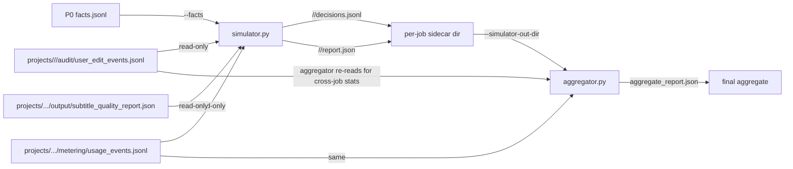

# Smart Shadow Simulator 设计草案 (P1)

- 创建日期：2026-05-06
- 状态：设计草案，待审核
- 适用范围：智能版方案 §15 P1 阶段 — Shadow 智能决策 simulator
- 关联：
  - 智能版总方案：[`2026-05-04-smart-auto-pipeline-plan.md`](2026-05-04-smart-auto-pipeline-plan.md) §15 P1
  - P0 evaluator spec：[`2026-05-06-smart-shadow-evaluator-design.md`](2026-05-06-smart-shadow-evaluator-design.md)
  - P0 results note：[`2026-05-06-smart-shadow-eval-p0-results.md`](2026-05-06-smart-shadow-eval-p0-results.md)
  - User edit audit schema：[`2026-05-04-user-edit-audit-data-optimization-plan.md`](2026-05-04-user-edit-audit-data-optimization-plan.md)

---

## 1. 目标与边界

### 1.1 P1 目标

在已完成的真实 Studio 任务上**离线模拟**："如果智能版来跑，会做出哪些自动决策？"，然后**对比** Studio 用户实际人工修改 + metering + 最终交付，回答：

1. Smart 自动决策与 Studio 实际人工修改有多大差异？
2. Smart eligibility gate 真实拒绝率 / 降级率？
3. Smart 自动批准 translation/voice review 与人工的差距分布？
4. retry/cost 在 shadow 路径上的预测值与真实 Studio 任务消耗对比是否一致？

### 1.2 P1 硬边界（绝对不能突破）

| 约束 | 状态 |
|---|---|
| 创建 `service_mode=smart` job | ❌ |
| 前端展示智能版入口 | ❌ |
| 扣费 / 调真实 clone / TTS / verifier API | ❌ |
| 触发额外 Whisper 重跑 | ❌ |
| 修改用户交付 artifact | ❌ |
| 改 `services/jobs/api.py`、`jianying_draft_runner.py`、Gateway 后台任务 | ❌ |
| 在真实 job lifecycle 加 hook | ❌ |
| 写入 production `{project_dir}/audit/` 目录 | ❌（schema 稳定前不写） |
| 离线读 fact sheets + project artifacts（只读） | ✅ |
| 输出到 `D:/Claude/temp/smart_shadow_sim/` 或 `/tmp/smart_shadow_sim/` | ✅ |

### 1.3 P1 不解决的（留 P2/P3/P4）

- 真实自动 clone / re-TTS / 多模态 verifier 调用
- 用户可见的 Smart 入口
- 真实 100 cred/min 收费扣点

### 1.4 进 P2 前的累积条件（继承 P0 results）

- post-Phase-D metered jobs ≥ 10 → 重跑 P0 + P1 shadow report
- ≥ 20 + cost p90/p99 稳定 + production pricing snapshot 写入 → 考虑 P2

---

## 2. 架构概览

```
[fact sheets from P0]                [shadow simulator (P1)]            [aggregator]
prod_full/facts.jsonl       →   smart_shadow_sim simulate    →   per-job sidecars
                                                                  + smart_shadow_sim aggregate
                                                                  →  aggregate_report.json
[Studio comparison artifacts]
{project_dir}/audit/user_edit_events.jsonl ─┐
{project_dir}/metering/usage_events.jsonl  ─┼→ aggregator reads (read-only)
{project_dir}/output/subtitle_quality_*.json─┘
{job_id}.events.jsonl
```

**两个 stdlib-only 脚本**（沿用 P0 evaluator 的离线 + read-only + 双脚本拆分模式）：

| 脚本 | 输入 | 输出 |
|---|---|---|
| `scripts/smart_shadow_sim_simulator.py` | facts.jsonl + （可选）补充 artifact | `<out_dir>/<job_id>/smart_shadow_decisions.jsonl` + `smart_shadow_report.json` |
| `scripts/smart_shadow_sim_aggregator.py` | 多个 simulator 输出 + Studio 真实修改 artifact | `<out_dir>/aggregate_report.json` |

> **关键不变量**：simulator 与 aggregator 都是**纯 stdlib-only**，不导入业务模块、不调付费 API、不动 production 目录。沿用 P0 collector 的 AST guard 模式。

---

## 3. Smart 自动决策模型（shadow simulator 的核心逻辑）

按 P0 results note §6 锁定的初始阈值：

| 参数 | 值 | 来源 |
|---|---|---|
| `main_speaker_threshold` | 0.10 | P0 §3.1 区分度最佳 |
| Smart eligibility gate | `main_speaker_count(0.10) ≤ 3` | 智能版方案 §2.3 |
| Clone sample 最低秒数（soft） | ≥ 8s | P0 §3.3 全 100% eligible |
| Clone sample 最低秒数（preferred） | ≥ 10s | P0 §3.3 仍 100% eligible |
| Clone sample 数量门槛 | 每 main speaker ≥ 3 段 ≥8s，合计 ≥ 20s | 沿用 §7.2 spec |
| `≥15s` 硬要求 | NO | P0 §3.3 5-8% 误降级 |

### 3.1 Stage-level 决策（必输出）

每个 job 输出 6 个 stage 决策（参考方案 §6 自动决策层）。**每个 stage 必须能在数据缺失时退回到明确状态**（避免 simulator 给出 silent garbage）。

| Stage | smart_decision 内容 | 数据源 (来自 fact sheet 或 simulator 直读) | 数据缺失时回退 |
|---|---|---|---|
| `eligibility_gate` | `pass` / `reject_main_speakers_gt_3` / `reject_clone_samples_insufficient` | `speaker_stats.speaker_count_by_threshold[main_threshold]` + `clone_sample_stats.eligible_sample_count_buckets_by_speaker` | speaker_stats 缺失 → `unevaluable: missing_speaker_stats` |
| `voice_sample_selection` | 每个 main speaker 的 `clone` / `preset` 决定，附 reason | `clone_sample_stats.eligible_sample_count_buckets_by_speaker` + 阈值 | clone_sample_stats 缺失 → `unevaluable: missing_clone_samples` |
| `clone_policy` | `auto_clone_main_speakers: list[speaker_id]` | 同上 + main_speaker 列表（来自 voice_sample_selection 的 cloned 子集） | unevaluable 当 voice_sample_selection 不可用 |
| `translation_review_auto_approval` | `auto_approve` / `manual_review_required: <reason>` | **当下能用的 proxy**：`speaker_stats.uncertain_speaker_duration_share` + `clone_sample_stats.eligible_speakers / asr_speaker_count` 比值 | 缺数据 → `unevaluable` |
| `tts_duration_repair_policy` | 估算 `expected_rewrite_count` + `expected_retts_count` + `would_hit_budget_cap: bool` | 见 §3.5 估算公式 | 缺 duration_seconds → `unevaluable` |
| `subtitle_sync_policy` | `whisper_align_recommended: bool` + `expected_fallback_ratio: float` | `whisper.*`（仅 post-Phase-D job 有数据） | 缺 whisper 数据 → `unevaluable: pre_phase_d_job` |

**关键规约**：

- spec §3.1 `translation_review_auto_approval` 的输入**必须是事前可知的信号**（uncertain speaker share / s2 corrections），不能用事后的 drift_count / retry_count 反推（spec 1.0 的 framing 已修正：drift 是 deliverable-time 信号，逻辑上不能驱动事前的 review approval 决定）
- 任何 stage 在数据缺失时都输出 `unevaluable + reason`，**绝不**输出 placeholder 决定
- per-job report.json 必须列出 `stages_unevaluable: [stage_names]`，让 owner 一眼看到该 job 哪些维度不能给结论

### 3.2 Per-segment 决策（仅记需要解释的段）

**segment_id 来源（reviewer iter 1 BLOCKER 修复 - 锁定）**：simulator **直接读** `editor/segments.json`（首选）或 fallback `translation/segments.json` —— **不扩 fact sheet schema**。理由：fact sheet 已经汇总到 job-level，加 per-segment 数据会让 fact sheet 行宽爆 4KB；simulator 多 30 行 reader code 是可接受成本。reader 内联在 simulator.py，不复用 collector helper（沿用 stdlib-only 隔离）。

不是所有 segment 都记。只记**会触发 Smart 不同行为**或**有人工修改对照**的段：

| 触发条件 | 字段 |
|---|---|
| Smart 会触发 re-TTS（基于 retry_stats） | `expected_retts: bool, reason: str` |
| Smart 会 rewrite 缩短译文 | `expected_rewrite: bool, reason: str` |
| Smart 会 reject auto-approval（uncertain speaker） | `auto_approval: bool, reject_reason: str` |
| Smart 会跳过 clone 改用预设音色 | `clone_skipped_reason: str` |
| 该段在 Studio 跑过 user_edit（speaker / split / text） | `user_edit_kinds: list[str]` |
| 该段进入 subtitle drift list | `drift: bool` |

无以上任何条件 → 不输出该 segment（noise reduction）。

### 3.3 跟 Studio 实际的对照逻辑

每个 stage 决策 + per-segment 决策都要记 **shadow_vs_studio diff**：

| Field | 含义 |
|---|---|
| `smart_decision` | shadow simulator 推断的决策 |
| `studio_actual` | 从 user_edit_events / metering / 最终 artifact 读出的实际（详见 §3.4） |
| `match: bool` | 二者是否一致 |
| `diff_kind: enum` | 不一致类型（详见 §3.4 末尾） |

### 3.4 studio_actual 取数表（reviewer iter 1 BLOCKER 修复）

每个 stage 必须有明确的"Studio 实际做了什么"映射，simulator 才能算 `match: bool`。

| Stage | studio_actual 取值 | 来源 | 备注 |
|---|---|---|---|
| `eligibility_gate` | 永远是 `pass`（task 走完 = Studio 没拒） | tautology | smart_decision 反之可能是 `reject_*` → diff_kind 标 `smart_more_aggressive` |
| `voice_sample_selection` | 每 main speaker 的实际 voice classification（cloned / preset） | `actual_clone_stats.voice_ids_by_speaker` 已分类好（来自 `editor/segments.json::voice_id` + 启发式分类） | 直接复用 P0 collector 的 `_classify_voice_id` 输出 |
| `clone_policy` | 实际 `cloned_speakers` list | `actual_clone_stats.voice_ids_by_speaker` 取 `_classify_voice_id == "cloned"` 的 speaker_id 集合 | |
| `translation_review_auto_approval` | `auto_approved` if `user_edits.text_changes_effective == 0` else `user_modified` | `user_edits` from fact sheet（其源 = `audit/user_edit_events.jsonl`） | 解释：Studio 没改 cn_text 视为相当于"自动批准"；改了 = 人工修订。**该匹配是粗匹配**：studio 改 cn_text ≠ smart 当时会拒绝 auto-approval；该 stage 的 `match: bool` 不要单看，要联合 §4.3 `translation_review_diff` 四象限解读 |
| `tts_duration_repair_policy` | 实际 `retts_count` + `retts_total_duration_ms` | `retry_stats` from fact sheet（metering 路径）or `editor/segments.json::rewrite_count` 求和（fallback 路径） | 数据缺失 → studio_actual = `unknown` → match = N/A |
| `subtitle_sync_policy` | 实际 alignment_model + drift_count | `whisper.alignment_model` + `subtitle_sync.text_audio_drift_count` | post-Phase-D 才有 |

**`diff_kind` 取值**：

- `match`: smart_decision == studio_actual
- `smart_more_aggressive`: smart 更激进（如 smart 拒绝 / 降级而 studio 实际通过）
- `smart_less_aggressive`: smart 不动而 studio 走了人工干预
- `orthogonal`: 二者维度不直接可比（如 smart 选 cloned A 而 studio 用 cloned B）
- `no_studio_signal`: studio_actual = `unknown` 或数据缺失

### 3.5 Retry estimation 公式（reviewer iter 1 MAJOR 修复）

`tts_duration_repair_policy` stage 的 `expected_retts_count` 估算公式（v1，简单稳健）：

```text
# Inputs (来自 simulator 直读 editor/segments.json):
#   estimated_cn_chars = len(segment["cn_text"])
#   k_cn_chars_per_src_min = 240   # 默认值，来自智能版方案 §9 / pricing_schema CostModelConfig
#   duration_min = (segment["end_ms"] - segment["start_ms"]) / 60000.0

# 基线：每段 segment 对应一次 TTS，无 retry
baseline_tts_count = N_segments

# Smart 触发额外 retts 的条件估算（基于 P0 results §4.1 / §5）：
#   - 若 segment 时长 > 估算 source_min × k_cn_chars_per_src_min × 1.05（rewrite 阈值），加 1 次 retts
#   - 若 segment fact has rewrite_count > 0 in editor.segments.json (历史已有 retry 信号)，加该值
expected_retts_count = sum_per_segment(
    (1 if estimated_cn_chars > k_cn_chars_per_src_min * duration_min * 1.05 else 0)
    + (segment.get("rewrite_count", 0) or 0)
)

# Budget cap 检测：retts_audio 累计 > 1.5 × source_audio
would_hit_budget_cap = (expected_retts_count * avg_segment_duration > 1.5 * source_duration)
```

**v1 已知局限**（aggregate report 的 `warnings` 必须显式标注）：
- 公式不区分 rewrite vs retts（实际方案 §9 二者各自闸限）
- 不模拟 budget exhaustion 后的"按 budget policy 降级或 fail"分叉
- 没有内容类型相关的 retry 系数（访谈 vs 演讲 retry 概率不同）

**改进路径**（不在 P1 第一阶段）：
- v2：基于 P1 第一阶段实测 simulator vs actual 的 retts 偏差，校准乘数
- v3：内容类型 + segment 长度联合系数

期望 v1 的精度：在 P0 已观测的 3 个 post-Phase-D job 上，retts_count 估算误差 ≤ 50%（aggregate `retry_estimation_vs_actual.estimation_error_p90` 报真实值）。

---

## 4. Sidecar Schema

### 4.1 `smart_shadow_decisions.jsonl`（per-job，每行一条 stage 或 segment 决策）

```json
{
  "schema_version": 1,
  "run_id": "2026-05-06T11-30Z-USER-XXX-3833b0e",
  "job_id": "job_xxx",
  "decision_kind": "stage" | "segment",
  "stage_or_segment_id": "eligibility_gate" | "segment_5",
  "smart_decision": {...},
  "studio_actual": {...},
  "match": true | false,
  "diff_kind": "match" | "smart_more_aggressive" | "smart_less_aggressive" | "orthogonal" | "no_studio_signal",
  "evidence": {
    "fact_field_path": "speaker_stats.speaker_count_by_threshold.0.10",
    "fact_value": 2,
    "user_edit_event_ids": ["..."],
    "usage_meter_aggregate": {...}
  }
}
```

### 4.2 `smart_shadow_report.json`（per-job 摘要）

```json
{
  "schema_version": 1,
  "run_id": "...",
  "job_id": "...",
  "smart_eligibility": "pass" | "reject" | "route_to_studio",
  "stage_decisions_count": 6,
  "stage_decisions_match": 4,
  "segment_decisions_count": 12,
  "segment_decisions_match": 9,
  "smart_more_aggressive_count": 2,
  "smart_less_aggressive_count": 1,
  "orthogonal_count": 0,
  "thresholds_used": {
    "main_speaker_threshold": 0.10,
    "min_sample_seconds_soft": 8,
    "min_sample_seconds_preferred": 10
  },
  "fact_source": "<path to facts.jsonl>",
  "studio_comparison_sources": {
    "user_edit_events": "<path>",
    "usage_meter": "<path>",
    "subtitle_quality_report": "<path>"
  },
  "warnings": []
}
```

### 4.3 `aggregate_report.json`（跨 job）

```json
{
  "schema_version": 1,
  "run_id": "...",
  "jobs_simulated": 5,
  "smart_eligibility_breakdown": {
    "pass": 5,
    "reject": 0,
    "route_to_studio": 0
  },
  "stage_decision_match_rate": {
    "eligibility_gate": "5/5 (100%)",
    "voice_sample_selection": "4/5 (80%)",
    "clone_policy": "5/5 (100%)",
    "translation_review_auto_approval": "3/5 (60%)",
    "tts_duration_repair_policy": "5/5 (100%)",
    "subtitle_sync_policy": "5/5 (100%)"
  },
  "user_edit_observations": {
    "jobs_with_speaker_corrections": 1,
    "jobs_with_splits_confirmed": 0,
    "jobs_with_text_changes": 1,
    "_note": "observational only — Smart 不直接做 speaker correction 或 split（这些是 S2 Pass1 阶段，Studio 和 Smart 共享）。Smart 的 voice_sample_selection / translation_review 会被 user edits 间接影响：详见 voice_selection_diff 和 translation_review_diff"
  },
  "voice_selection_diff": {
    "jobs_evaluated": 5,
    "smart_studio_match": 4,
    "smart_more_clones": 1,
    "smart_fewer_clones": 0,
    "smart_unevaluable": 0,
    "_note": "Smart 选择 vs Studio 实际 voice_id 分类（cloned/preset）的差异分布"
  },
  "translation_review_diff": {
    "jobs_evaluated": 5,
    "smart_auto_approved_studio_unmodified": 3,
    "smart_auto_approved_studio_modified": 1,
    "smart_rejected_studio_modified": 0,
    "smart_rejected_studio_unmodified": 0,
    "smart_unevaluable": 1,
    "_note": "smart_rejected_studio_unmodified 是误报（smart 多管闲事），smart_auto_approved_studio_modified 是漏报（smart 该挡没挡）"
  },
  "subtitle_drift_observations": {
    "jobs_with_drift_data": 3,
    "jobs_with_drift_count_zero": 3,
    "jobs_with_drift_count_gt_zero": 0,
    "_note": "Smart 不会预先预测 drift（drift 是事后信号），仅记录 Studio 实际 drift 分布作为 Smart cost/quality 信号"
  },
  "retry_estimation_vs_actual": {
    "jobs_with_metering": 3,
    "smart_estimated_retts_count_p50": 21,
    "actual_retts_count_p50": 21,
    "estimation_error_p50": "0.0%",
    "estimation_error_p90": "0.0%",
    "estimation_formula_version": 1
  },
  "warnings": [],
  "p2_readiness_signals": {
    "post_phase_metered_jobs": 3,
    "p2_threshold_metered_jobs": 10,
    "ready_for_p2_rerun": false
  }
}
```

---

## 5. 文件结构

新增：

```
scripts/
├── smart_shadow_sim_simulator.py       # 离线 simulator，per-job decisions + report
└── smart_shadow_sim_aggregator.py      # 多 job 汇总

tests/
├── test_smart_shadow_sim_simulator.py
├── test_smart_shadow_sim_simulator_imports.py     # AST guard
├── test_smart_shadow_sim_simulator_pii_guard.py   # PII 注入守卫（继承 P0 模式）
├── test_smart_shadow_sim_aggregator.py
└── fixtures/smart_shadow_sim/                     # mini fact sheets + comparison artifacts
    ├── full_post_phase/
    ├── full_pre_phase/
    ├── studio_post_edited/
    └── ...
```

不修改任何 `src/` / `gateway/` / `services/` 文件。沿用 P0 stdlib-only 隔离。

---

## 6. 入参

### 6.1 simulator

```
--facts <path>                  P0 collector 输出的 facts.jsonl（必填）
--projects-root <path>          可选，用于读 user_edit_events / usage_events 等补充对照
--out-dir <path>                必填，simulator 输出目录
--main-speaker-threshold        默认 0.10
--clone-min-seconds-soft        默认 8
--clone-min-seconds-preferred   默认 10
--limit                         可选，仅模拟前 N 个 job（smoke）
```

### 6.2 aggregator

```
--simulator-out-dir <path>      simulator 输出根目录（必填）
--projects-root <path>          可选，用于补充对照
--out-dir <path>                必填，aggregate 报告输出位置
```

---

## 7. 数据流



---

## 8. 错误处理 + 退出码（沿用 P0 风格）

| 场景 | 行为 | exit code |
|---|---|---|
| 单 job 模拟失败 | 记 `report.warnings[]`，继续下一个 | 0（除非全部失败） |
| facts.jsonl 不存在 | exit 2 | 2 |
| out-dir 不可写 | exit 2 | 2 |
| 0 jobs 模拟成功 | exit 1 | 1 |
| ≥ 1 job 模拟成功 | exit 0 | 0 |

---

## 9. 测试策略（沿用 P0 hardening 模式）

1. **`test_smart_shadow_sim_simulator.py`** — 用 fixtures 跑 simulator，断言 decisions/report 字段
2. **`test_smart_shadow_sim_simulator_imports.py`** — AST guard，stdlib-only
3. **`test_smart_shadow_sim_simulator_pii_guard.py`** — PII 注入测试（fixtures 含中文姓名等）
4. **`test_smart_shadow_sim_aggregator.py`** — 多个 job sidecar 喂入，断言 aggregate 数字
5. **fixture 4 个 mini 场景**：
   - `full_post_phase`：完整 post-Phase-D fact + 0 user edits（理想）
   - `full_with_user_edits`：post-Phase-D fact + speaker_correction user edit
   - `pre_phase`：缺 metering / drift（预期 simulator 跳过部分对照）
   - `corrupted`：facts 缺关键字段（预期 warnings 而非 crash）

6. **PII fixture 复用 P0 同源**（reviewer iter 1 MINOR 修复）：`tests/test_smart_shadow_sim_simulator_pii_guard.py` 应 import `tests/test_smart_shadow_eval_collector_pii_guard.py::PII_LITERALS` 列表（避免两套测试 PII 漂移）

**目标**：≥ 25 tests，全 stdlib，独立测试 < 5s

---

## 10. Smoke 流程（按 P0 模式）

```
[本地] 0. 写完 simulator + aggregator + tests，pytest 全绿
[本地] 1. SMOKE：用 prod_full/facts.jsonl 跑 simulator (--limit 3)
        python scripts/smart_shadow_sim_simulator.py \
          --facts D:/Claude/temp/smart_shadow_eval/prod_full/facts.jsonl \
          --projects-root D:/Claude/AIVideoTrans_Codex_web_mvp/.codex_tmp/us_fetch/extracted/opt/aivideotrans/data/projects \
          --out-dir D:/Claude/temp/smart_shadow_sim/local_smoke \
          --limit 3
[本地] 2. 看 sidecar 内容，确认 decisions / report 合理
[本地] 3. 跑 aggregator
        python scripts/smart_shadow_sim_aggregator.py \
          --simulator-out-dir D:/Claude/temp/smart_shadow_sim/local_smoke \
          --out-dir D:/Claude/temp/smart_shadow_sim/local_smoke
[本地] 4. 看 aggregate_report.json
[关键审核节点] 把 aggregate_report.json 给 owner 过目
        - smart_eligibility_breakdown 是否符合 P0 预期
        - stage_decision_match_rate 是否合理
        - user_edit_correlation 是否揭示了 Smart vs Studio 差异
        Owner approves → 跑生产 smoke (5-10 jobs)
[生产 smoke] 5. 上传 simulator/aggregator 到 154，跑 prod facts
[本地]      6. 拉回 + 看 aggregate
[关键审核节点] owner 看 aggregate_report 决定是否进 P2 准备
```

---

## 11. 已锁定的设计决策

| 决策 | 内容 |
|---|---|
| 触发时机 | 离线脚本，**绝不**挂生产 lifecycle hook |
| 输入 | 优先复用 P0 fact sheets；如需额外字段，先扩 collector schema |
| 输出位置 | `D:/Claude/temp/smart_shadow_sim/<run_id>/` 或 `/tmp/smart_shadow_sim/<run_id>/`，**不污染 production audit/** |
| 决策颗粒度 | stage-level 主，per-segment 仅记需解释的段 |
| 报告聚合 | per-job sidecar + cross-job aggregate |
| 工具实现 | 双脚本（simulator + aggregator），均 stdlib-only + AST guard |
| 测试模式 | 继承 P0 hardening (PII guard、AST guard、fixture-driven) |
| 阈值 | spec v1 锁定（2026-05-06）：main=0.10、sample ≥8s soft / 10s preferred；来自 P0 results note §6。后续修改需新发 design v2 |

---

## 12. 待审核问题

iter 1 review 已解决（spec v1.1）：

- ✅ per-segment segment_id 来源 → §3.2 锁定 simulator 直读 editor/segments.json
- ✅ studio_actual 6 stage 取数规则 → §3.4 完整表
- ✅ retry estimation 公式 → §3.5 v1 公式
- ✅ aggregate `would_have_caught_*` 重写 → §4.3 改用 `voice_selection_diff` / `translation_review_diff` / `subtitle_drift_observations` 三组真实可计算指标
- ✅ §3.1 数据缺失回退列 + translation_review_auto_approval 不再用事后 drift 反推

仍需 owner 确认：

1. **P2 readiness threshold 数字（10/20）**：是否在 simulator 内部硬编码 `P2_RERUN_THRESHOLD = 10` 常量，还是在 spec 文档 / pricing_runtime.json 里配置？倾向**前者**（v1 简单，后续要改改一处）。
2. **fixture 顺序与 P0 复用度**：是否每个 fixture 都伴随对应的 user_edit_events.jsonl mini 文件？还是 fixture 用空 audit 占位（依赖 §3.4 的 "no_studio_signal" 退化路径）？倾向**前者**（fixture 自带 user_edit_events 让测试更紧）。

---

## 13. 不在本期范围

- 真实 service_mode=smart 实施（P2）
- 多模态 verifier（P3/P4）
- 前端 Smart 入口（P2）
- 写入 production project_dir/audit/（schema 稳定后单独决定）
- 任何 lifecycle hook
