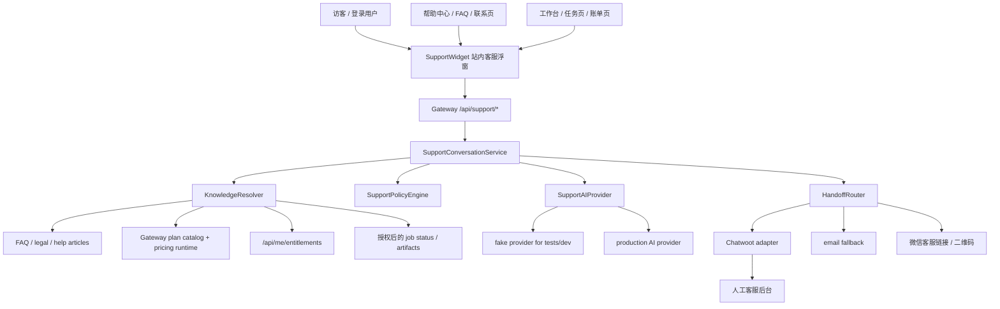

# AI 客服与人工客服接入方案

日期：2026-05-08

更新记录：

- 2026-05-08：吸收 Claude Code 方案审核意见，强化 AI 费用护栏、模板优先路由、邮箱工单、客服主后台提前决策、Job 上下文白名单与 AST 守卫测试。
- 2026-05-08：收敛 P1 admin 范围，移除 P1 自动最便宜模型策略，将预算 warning 简化为告警语义，并连续化阶段命名。
- 2026-05-08：通知系统 §16 收敛 P1 范围，加 §16.7 P1 vs P2+；明确与 `events.jsonl` 边界；统一 `severity` 取值；`category` → `topic` 与 `scope` 解耦；加 `dedupe_key` schema；管理员告警分流到邮件 / webhook；明确 `expires_at` 与 retention 语义；通知中心与 `usePollingTask` 边界。
- 2026-05-08：Codex 复审第二轮收尾 — `AVT_SUPPORT_ANONYMOUS_ENABLED` env 默认改为 false（与代码一致）；§16.7/§18 标注 P1 落地的通知 trigger 实际来自 gateway `intercept_get_job` 状态比对（GET-poll-derived），不是 pipeline 主动写入；admin 暴露 `support_anonymous_enabled` 开关；`_IMPLEMENTED_REAL_PROVIDERS` 守卫确保 DeepSeek stub 不会因为已存在 `DEEPSEEK_API_KEY` 而被误判 ready。

## 0. 结论

本项目适合采用“站内 AI 客服前台 + 成熟人工客服系统接入”的渐进方案：

1. P1 先做项目内轻量 AI 客服前台，覆盖售前、套餐、试用、使用流程、任务失败初筛、剪映草稿导出等高频问题。
2. P1 必须内置费用护栏和模板优先路由：能用 FAQ/模板回答的问题不调用 LLM，所有真实 AI 调用受单次 token、单用户、单会话、全局月度预算约束。
3. P2 先用站内 handoff 表 + 邮件通知跑人工客服闭环，不立即部署 Chatwoot。
4. P3 在真实工单量证明需要在线坐席后，再接入 Chatwoot 作为人工客服后台，站内 AI 判断无法解决时创建人工会话并附带摘要。
5. P4 增加微信客服入口作为中国用户信任触点，先用二维码或客服链接承接。
6. P5 如果微信咨询量足够，再做企业微信/微信客服 API adapter，把微信消息也纳入同一套 AI 分流和人工工单体系。

不建议当前阶段自研完整坐席后台。客服后台会牵涉在线状态、分配、会话记录、通知、权限、工单、统计、素材管理、合规留存等长期维护面。项目当前商业化规则也要求“轻量、可测试、可替换”，更适合先自建 AI 分流层，把人工坐席能力交给开源成熟系统。

## 1. 当前项目上下文

### 1.1 相关架构边界

从项目图谱和现有代码看，客服系统必须遵守这些边界：

- Gateway 是套餐、试用、价格、权益的真源，前端和 AI 都不能硬编码最终商业事实。
- 前端已经按 `marketing`、`auth`、`app` 概念分区，客服浮窗不能让营销页或 auth 页误继承工作台 UI chrome。
- 默认测试、本地开发、clean local path 应继续使用 fake/mock/stub，不应强依赖外部 AI、Chatwoot、微信客服、短信或支付服务。
- 当前商业化阶段不应顺手引入团队坐席、复杂 CRM、完整 usage ledger、全自动续费二次通道等后续范围。
- 面向营销、支付、客服的用户文案应优先服务中文用户，语气自然、可信、少用直译式 SaaS 文案。

### 1.2 现有可复用入口

当前已有的客服相关基础：

- 公开联系页：`frontend-next/src/app/(marketing)/contact/page.tsx`
  - 现在主要提供客服邮箱、账单退款、隐私、版权投诉、商务合作说明。
- 工作台帮助页：`frontend-next/src/app/(app)/help/page.tsx`
  - 当前还是“帮助中心开发中”的占位。
- FAQ：`frontend-next/src/components/marketing/faq.tsx`
  - 已有中文 FAQ 和 `FAQPage` JSON-LD，适合作为 AI 客服知识库的第一批静态语料。
- 套餐真源：`gateway/plan_catalog.py`、`gateway/pricing_runtime.py`
  - AI 回答套餐、试用、价格时必须实时读取这些事实，不能复制一份 prompt 常量。
- 登录态：`frontend-next/src/components/providers/session-provider.tsx`、`gateway/auth.py`
  - 登录用户客服会话可以带上 `user_id`、`plan_code`、当前页面和可授权的 `job_id`。
- Gateway 现有外部服务原则：`gateway/config.py`
  - 现有短信、验证码、下载后端等配置已经体现“默认 fake/local，生产再切真实服务”的模式，客服也应沿用。

## 2. 目标与非目标

### 2.1 目标

- 降低售前和基础使用问题的人工处理量。
- 给未登录访客提供即时售前答疑，尤其是长视频、英文转中文、剪映草稿、试用、授权视频来源等问题。
- 给登录用户提供任务排障入口，例如任务失败、字幕异常、导出找不到、素材包/剪映草稿下载等问题。
- 当 AI 无法解决时，将上下文整理后转给人工，而不是让用户重复描述。
- 保持套餐、试用、价格、权益事实从 Gateway 动态读取。
- 所有默认测试路径不调用真实外部服务。
- 为后续微信客服接入预留 adapter，不把微信客服耦合进主业务流程。

### 2.2 非目标

- 不自研完整坐席后台。
- 不让 AI 自动退款、改套餐、改额度、删除账户、确认版权结论或承诺人工处理时限。
- 不把 Chatwoot、微信客服、外部 AI 服务变成 `main.py` 或 `pytest` 的硬依赖。
- 不在 P1 做多坐席排班、团队坐席、复杂 SLA、机器人训练后台。
- 不在前端硬编码最终价格、试用天数、试用分钟数、套餐权限。
- 不在第一阶段把微信客服 API 作为主要客服链路。

## 3. 推荐系统形态

### 3.1 总体架构



### 3.2 核心原则

- 前端只负责展示与采集上下文，不承担客服决策和商业事实。
- Gateway 负责鉴权、速率限制、知识检索、套餐事实读取、AI 调用、转人工判断、外部系统 adapter。
- AI provider 必须可替换。默认实现为 deterministic fake provider，生产通过配置启用真实模型。
- 人工客服 provider 必须可替换。P2 默认 email handoff；只有真实工单量证明需要在线坐席后，P3 才接入 Chatwoot；P4/P5 增加微信客服 adapter。
- AI 回答应提供“依据来源类型”，例如 `faq`、`plan_catalog`、`legal_page`、`job_status`，便于排查漂移。
- 模板和确定性路由优先于 LLM。命中 FAQ、套餐事实、任务错误码、敏感类别、人工关键词时，默认不调用真实 AI。
- 费用护栏是 P1 必做能力，不是上线后的监控优化。真实 AI 调用必须经过预算、token、输入长度、超时和 provider 默认值守卫。
- 人工客服主后台必须在 P0 决策清楚。站内、邮箱、微信后续都应汇总到同一个运营后台或同一张 handoff 表，避免渠道割裂后再迁移。

## 4. 用户流程

### 4.1 未登录访客售前咨询

入口：

- 首页、定价页、试用页、联系页右下角客服浮窗。
- FAQ 区域的“还有疑问，问客服”入口。

典型问题：

- “支持多长的视频？”
- “可以导出剪映草稿吗？”
- “YouTube 视频可以用吗？”
- “试用会不会自动扣费？”
- “Express 和 Studio 有什么区别？”
- “Rask/HeyGen/ElevenLabs 和你们有什么区别？”

处理：

- AI 使用 FAQ、legal pages、plan catalog 回答。
- 涉及套餐事实时实时读取 Gateway plans response。
- 用户多次追问购买、发票、合同、商务 API 时，引导转人工。

### 4.2 登录用户使用排障

入口：

- 工作台首页、任务详情页、结果页、编辑页、账单页。
- 帮助中心页。

上下文：

- `user_id`
- `plan_code`
- 当前页面 `page_url`
- 可选 `job_id`
- 任务状态、最近错误摘要、可下载交付物状态，仅限当前用户拥有的任务。

典型问题：

- “为什么任务失败？”
- “剪映草稿在哪里下载？”
- “为什么素材包里字幕没有对齐？”
- “修改一句后要重新生成整条视频吗？”
- “为什么 Plus 不能上传 90 分钟视频？”

处理：

- AI 先给排查步骤和项目内解释。
- 如果涉及具体任务失败，返回下一步动作，例如查看任务详情、重新导出、联系人工。
- 任务多次失败、付款异常、用户明确不满意时转人工。

### 4.3 账单、退款、隐私、版权

这些场景默认提高转人工优先级：

- 付款成功但套餐未到账。
- 重复扣费、退款、发票、对账。
- 隐私删除请求。
- 版权投诉、侵权、授权争议。
- 账号安全和手机号归属。

AI 可以解释公开政策和收集必要信息，但不能作出最终承诺。

## 5. 消息路由与 AI 回答策略

### 5.0 P1 必做路由链路

客服入口不能设计成“用户消息直接进 LLM”。P1 的默认链路应为：

```text
user message
  -> risk / abuse checker
  -> language guard
  -> keyword and template router
  -> FAQ / plan / job-error deterministic answer
  -> support AI budget guard
  -> LLM with allowlisted knowledge context
  -> handoff policy
```

路由顺序的目标是：能用确定性规则回答的内容不调用 LLM，必须转人工或必须限制的内容也不调用 LLM。

建议 P1 至少内置 5 类模板：

- 试用是否自动扣费。
- 剪映草稿如何下载。
- Express / Studio 区别。
- 任务失败基础排查。
- 退款、付款异常、隐私、版权、投诉的人工分流。

任务失败类问题优先匹配 `error_code` 或有限错误类别，返回模板化排查步骤。只有 error category 不明、用户描述复杂、模板无法覆盖时才进入 LLM。

### 5.1 可回答范围

AI 客服可以回答：

- 产品定位：长视频英文转中文、中文配音、字幕、剪映草稿。
- 基础流程：上传、处理、检查、下载、剪映继续精剪。
- 常见交付物：中文配音视频、音频、字幕、翻译文本、素材包、剪映草稿工程。
- Express / Studio 区别。
- 授权视频来源的原则性说明。
- 套餐和试用事实，但必须来自 Gateway 动态事实。
- 任务状态解释和用户可操作的排障建议。
- 帮助中心已有文档内容。

### 5.2 不可回答或必须谨慎回答

AI 不应：

- 编造价格、折扣、套餐权限、试用额度。
- 承诺退款一定通过、人工多久一定回复。
- 判断用户素材是否一定合法。
- 暴露内部错误堆栈、日志、prompt、密钥、路径、其他用户信息。
- 替用户执行高风险账户操作。
- 在没有授权的情况下读取任务、订单、账单或项目内容。

### 5.3 转人工触发条件

满足任一条件即建议或直接转人工：

- 用户明确表达：`人工`、`真人`、`转客服`、`找人`、`别让 AI 回答`。
- 同一会话中连续 2 次被用户标记“没有解决”。
- AI confidence 低于阈值，例如 `< 0.55`。
- 同一问题重复改写 3 次以上。
- 问题属于退款、重复扣费、套餐未到账、发票、隐私、版权、账号安全。
- 涉及具体任务失败且基础排查后仍无法解决。
- 用户情绪明显升级，例如投诉、威胁差评、要求赔偿。

情绪和投诉升级不应依赖 LLM 判断。P1 先用中文关键词 blocklist/route list，例如：

- `投诉`
- `差评`
- `工信部`
- `315`
- `赔偿`
- `举报`
- `律师`
- `消协`

命中这些词时，直接进入人工分流或人工建议，不再调用 LLM 做情绪分析。

### 5.4 语言边界

P1 默认中文客服体验。由于产品本身面向“英文视频转中文”，可能会有英文用户咨询售前，但客服系统第一阶段不应让 LLM 自由切换语言。

建议：

- 检测到纯英文或明显非中文输入时，返回固定英文兜底文案和邮箱联系方式。
- 中英混合但核心意图可由中文模板识别时，仍用中文回答。
- 多语言客服能力作为后续独立任务，不在 P1 借 LLM 自由发挥实现。

### 5.5 回答格式

中文用户看到的回答应尽量短、具体、可操作：

- 先直接回答结论。
- 再给 1-3 个操作步骤。
- 涉及套餐限制时说明“以当前页面显示为准”并引用动态事实。
- 涉及高风险问题时给出人工入口。

示例：

```text
可以。任务完成后可以下载剪映草稿工程，打开后能继续编辑字幕、配音和素材轨道。

你可以在任务结果页找到“剪映草稿”下载项。如果刚修改过字幕或配音，建议先重新生成草稿，避免下载到旧版本。
```

### 5.6 AI 费用护栏

客服 AI 是持续小额消耗，风险不是单次大额失败，而是上线后真实流量慢漏。因此费用护栏必须随 P1 一起上线。

必须实现：

- 全局月度预算上限，例如 `AVT_SUPPORT_AI_MONTHLY_BUDGET_USD=50`。
- DB accumulator 记录当月估算成本，按 provider/model/input/output token 写入。
- 触顶后的降级路径：模板回复 + “AI 客服繁忙，可转人工/邮件联系”，不能让客服入口整体不可用。
- 单条消息 `max_tokens` 硬截断，由 provider adapter 注入，不能由 prompt 覆盖。
- 输入字符数硬截断，超长输入先摘要或提示用户缩短，不直接送 LLM。
- provider timeout 和 retry 上限，避免长时间挂起或重复计费。
- 单会话、单用户、单 IP 调用上限。频率限制是必要条件，但不能替代全局预算。

P1 路由只需要两个成本状态：

```text
normal -> budget_exhausted
```

- `normal`：正常模板/AI 路由。
- `budget_exhausted`：停止真实 LLM 调用，只保留模板、FAQ、邮箱/人工分流。

预算达到 80% 时只触发 `warning` 告警，不改变 routing 行为。不要在 P1 做“随机抽样降级”或复杂中间态，否则同一问题可能出现不同答案，调试和运营解释都会变复杂。等有真实客服流量后，再决定是否按 category、用户 plan 或业务价值做更细降级。

### 5.7 滥用识别与拦截

恶意刷 AI 消耗是必须防的场景。识别信号包括：

- 未登录用户短时间高频发送。
- 同一 IP/device 多会话并发。
- 同一问题反复改写。
- 超长 prompt injection 文本。
- 明显要求忽略规则、暴露 prompt、读取内部字段。
- 低价值问题持续命中 LLM。

拦截策略分层：

- 轻度异常：模板回复 + 冷却时间。
- 中度异常：要求登录、验证码或手机号验证。
- 高风险但看起来是真实售后：限制 AI，创建人工/邮件 handoff。
- 明显滥用：停止 AI 回复，只展示邮箱或“请求过于频繁，请稍后再试”。

注意：不能把所有疑似刷量用户都自动转人工，否则攻击者只是把 AI 成本转成人工成本。人工分流应优先给登录用户、付款/退款/任务失败等真实业务问题。

## 6. 知识库设计

### 6.1 第一批知识来源

静态来源：

- `frontend-next/src/components/marketing/faq.tsx`
- `frontend-next/src/app/(marketing)/contact/page.tsx`
- `frontend-next/src/app/(marketing)/terms/page.tsx`
- `frontend-next/src/app/(marketing)/privacy/page.tsx`
- `frontend-next/src/app/(marketing)/refund/page.tsx`
- 后续新增 `docs/support/knowledge/*.md`

动态来源：

- `GET /api/plans`
- `GET /api/me/entitlements`
- `GET /api/me/subscription`
- `GET /api/billing/history`
- 授权后的 `job_id` 状态、交付物可用性、任务错误摘要。

### 6.2 建议新增知识目录

建议新增：

```text
docs/support/
  knowledge/
    product-basics.md
    upload-and-authorization.md
    express-vs-studio.md
    jianying-draft-export.md
    subtitles-and-alignment.md
    billing-and-refund-routing.md
    troubleshooting-jobs.md
  runbooks/
    chatwoot-handoff.md
    wechat-kf-setup.md
    support-agent-playbook.md
```

这些文档作为 AI 客服的人工维护知识源。注意：涉及价格、试用、额度的数字不应写死在 knowledge 文档中，只能描述“从套餐页/Gateway 获取”。

### 6.3 检索策略

P1 不需要复杂向量库。建议先做轻量可测试的检索：

- FAQ 和 help article 预处理成小段。
- 使用关键词 + 简单中文同义词映射做候选召回。
- 动态事实由显式 resolver 读取，不走 embedding。
- AI prompt 只接收 top 3-5 段候选上下文。

到 P3 后，如果客服问题增长明显，再评估：

- SQLite FTS / Postgres full-text search。
- 小型 embedding index。
- Chatwoot/工单历史沉淀的知识回流。

## 7. Gateway 后端方案

### 7.1 新增模块建议

```text
gateway/
  support_api.py
  support_models.py
  support_service.py
  support_knowledge.py
  support_templates.py
  support_policy.py
  support_budget.py
  support_ai.py
  support_handoff.py
  support_adapters/
    __init__.py
    chatwoot.py
    email.py
    wechat_kf.py
```

职责：

- `support_api.py`：FastAPI router。
- `support_models.py`：DB models 或 Pydantic schemas。
- `support_service.py`：会话编排。
- `support_knowledge.py`：FAQ/help/plans/job context resolver。
- `support_templates.py`：FAQ、错误码、敏感类别、语言兜底等确定性模板路由。
- `support_policy.py`：转人工、敏感问题、回答边界。
- `support_budget.py`：AI 调用预算、token 限制、月度 accumulator 和降级状态。
- `support_ai.py`：fake provider + production provider interface。
- `support_handoff.py`：统一人工转接接口。
- `support_adapters/*`：Chatwoot、email、微信客服等外部系统实现。

### 7.2 大模型接入方案

客服 AI 不应新建一套绕过项目管理面的 provider 配置。生产接入应复用现有模型注册表：

- 注册表文件：`src/services/llm_registry.py`
- 当前逻辑模型 `deepseek` 已映射到 `api_model_id = "deepseek-v4-flash"`。
- `deepseek` 当前配置为 text-only，`api_key_env = "DEEPSEEK_API_KEY"`，并通过 `request_overrides` 禁用 thinking。
- 管理面已有 `provider_api_keys` / disabled models / cost_rank 等模型管理语义，客服应沿用这些边界。

建议新增客服专用 prompt key：

```python
_DEFAULTS["support_chat"] = "deepseek"
```

并在 admin 模型管理中允许 `support_chat` 选择 text-only 模型。这样客服模型选择和翻译/改写/review 模型一样可见、可禁用、可替换。

客服模型选择必须隔离命名空间：

- 客服只写 `support_chat` 配置项，不修改翻译、改写、review、内容审核等其他 prompt key。
- 主管理面禁用某个 model 后，客服模型列表必须尊重 disabled 状态。
- 客服 admin 页面可以复用 `MODEL_REGISTRY` 和 `get_available_models_for_prompt("support_chat")`，但 UI 和保存路径独立。
- 不修改 `_DEFAULTS` 的运行时全局副本来保存管理员选择；默认值只是无配置时的 fallback。

#### P1 admin 范围

P1 admin 页面必须瘦身，最多保留 10 个运营真正需要改的配置：

1. 客服总开关。
2. 真实 AI 开关。
3. 客服模型选择，默认 `deepseek` / `deepseek-v4-flash`。
4. 月度预算上限。
5. DeepSeek V4 Flash input 单价，默认 `$0.14 / 1M tokens`。
6. DeepSeek V4 Flash output 单价，默认 `$0.28 / 1M tokens`。
7. 单条最大输出 token。
8. 预算触顶降级文案。
9. 敏感词/人工关键词列表。
10. 运营通知邮箱。

P1 将“最大输入字符数”和“默认人工通道”保留为 env/常量，后台只显示不可编辑状态；默认人工通道固定为 email。

P1 不做模板编辑器。模板先放在 `support_templates.py` 的 Python dict 中，由工程师通过 PR 修改；这样测试、review 和回滚都清楚。P2+ 再考虑把模板编辑搬到 admin 后台或 DB。

#### P2+ admin 范围

以下配置不要塞进 P1：

- 浮窗页面 allowlist。
- 移动端展示策略。
- 首次问候语和快捷问题编辑器。
- FAQ/错误码模板编辑器。
- 工单分类和标签。
- Chatwoot/微信渠道配置。
- 知识源开关。
- 会话保留期可视化。
- Job context allowlist 编辑器。
- 复杂风控阈值面板。
- 指标 Top N 和知识库沉淀工作台。

这些能力有价值，但会把 P1 admin 页面变成单独项目，应该在 P2+ 根据真实运营痛点补。

#### Admin 页面 IA

建议路由结构：

```text
frontend-next/src/app/(app)/admin/support/
  page.tsx             总览（P1：指标 + 预算状态 + 今日会话）
  model/page.tsx       大模型管理（P1 必做）
  handoff/page.tsx     转人工与邮件工单（P2）
  templates/page.tsx   模板路由（P2+，P1 只读展示 Python dict）
  channels/page.tsx    外部接入：email / Chatwoot / 微信（P3+）
  policy/page.tsx      风控、隐私、保留期（P2+）
```

P1 如果前端工作量需要再压缩，可以先只有 `admin/support/page.tsx`，页面内放“总览 + 大模型管理”两个区块；但要按上面的 IA 留出后续拆页路径。

#### 成本单价配置

月度预算 accumulator 不能只靠文档里的价格备忘。P1 要把模型单价做成 admin 可配置：

- `input_usd_per_1m_tokens`
- `output_usd_per_1m_tokens`

默认值写入当前 DeepSeek V4 Flash 单价。预算计算公式：

```text
estimated_cost_usd =
  input_tokens / 1_000_000 * input_usd_per_1m_tokens
  + output_tokens / 1_000_000 * output_usd_per_1m_tokens
```

不要依赖 provider response 返回真实 cost；很多 provider 不返回，或者精度/口径不适合作为预算护栏。DeepSeek 调价时，管理员在后台改两个数字即可，不需要改代码和重新部署。

后端设置建议：

```text
GET  /api/admin/support/settings
POST /api/admin/support/settings
GET  /api/admin/support/model-options
```

其中 `model-options` 内部调用注册表能力：

```python
get_available_models_for_prompt("support_chat")
```

P1 admin-editable 保存字段建议：

```json
{
  "support_enabled": true,
  "support_ai_enabled": true,
  "support_ai_model": "deepseek",
  "support_ai_max_output_tokens": 400,
  "support_ai_monthly_budget_usd": 50,
  "support_ai_input_usd_per_1m_tokens": 0.14,
  "support_ai_output_usd_per_1m_tokens": 0.28,
  "support_budget_exhausted_message": "AI 客服当前繁忙，你可以先查看常见问题，或转人工客服处理。",
  "support_sensitive_keywords": ["人工", "退款", "投诉", "差评", "工信部", "315", "赔偿", "举报"],
  "support_ops_email": "support@example.com"
}
```

#### 推荐生产模型

推荐生产首选：

```text
logical model: deepseek
api model id: deepseek-v4-flash
mode: non-thinking / thinking disabled
```

理由：

- 客服问题以短文本问答、FAQ 改写、分类和摘要为主，不需要高推理模型。
- DeepSeek V4 Flash 是 text-only 高性价比模型，适合高频客服流量。
- 项目注册表已经把 `deepseek` 作为翻译/改写类低成本默认模型，复用这个逻辑名比新硬编码 `deepseek-v4-flash` 更可控。
- 注册表里的 `request_overrides` 已经表达“禁用 thinking”，能避免客服问题触发长推理和费用失控。

外部价格会变动。DeepSeek 官方价格页当前列出 `deepseek-v4-flash` 的 cache miss input 为 `$0.14 / 1M tokens`、output 为 `$0.28 / 1M tokens`，并说明 `deepseek-chat` / `deepseek-reasoner` 未来会被弃用且分别对应 V4 Flash 的非 thinking / thinking 模式。上线前必须再次核对官方价格页。

#### 不建议 P1 自动选“最便宜”

P1 只实现 `explicit` 模型策略：管理员选择一个逻辑模型，默认 `deepseek`。不要实现 `cost_first_text` 分支。

原因：

- `cost_rank` 是粗排序，不是精确美元成本。
- 有些模型支持 audio 或多模态，但未必适合作为客服文本模型。
- 某些 provider 虽便宜但延迟、稳定性、合规、可用余额不一定满足客服。
- 最便宜模型如果缺 key，不应 silent fallback 到真实昂贵模型。
- P1 写了 `cost_first_text` 但不用，就是死代码，还要测试和维护，异常路径也可能误触发。

P1 策略：

```text
AVT_SUPPORT_AI_PROVIDER=fake
AVT_SUPPORT_AI_MODEL=deepseek
```

如果后续需要自动选择，再作为 P3+ 独立任务引入：

```text
AVT_SUPPORT_AI_MODEL_POLICY=cost_first_text
```

P3+ 的 `cost_first_text` 必须满足：

- 只在 `AVT_SUPPORT_AI_ALLOWED_MODELS` 内选择。
- 只选 `MODEL_REGISTRY` 中 enabled 且配置了可用 key/credential 的模型。
- 只选 text-capable 模型。
- 不跨越预算状态；预算触顶时优先降级模板，而不是换更贵模型。
- 选择结果写入日志和 `support_ai_usage`，方便审计。

#### Provider adapter 约束

无论选择哪个模型，adapter 必须强制：

- `max_output_tokens <= AVT_SUPPORT_AI_MAX_OUTPUT_TOKENS`。
- 输入长度截断。
- timeout。
- no-thinking / low-reasoning 模式。
- structured JSON 输出：`reply`、`confidence`、`category`、`handoff_recommended`、`sources`。
- 成本估算写入 `support_ai_usage`。

### 7.3 API 草案

#### 获取客服配置

```http
GET /api/support/config
```

返回：

```json
{
  "enabled": true,
  "anonymous_enabled": true,
  "ai_enabled": true,
  "handoff_enabled": true,
  "wechat_kf_enabled": false,
  "max_messages_before_captcha": 5
}
```

#### 创建会话

```http
POST /api/support/conversations
```

请求：

```json
{
  "channel": "web",
  "entrypoint": "pricing",
  "page_url": "/pricing",
  "job_id": null
}
```

返回：

```json
{
  "conversation_id": "uuid",
  "status": "open",
  "handoff_state": "none"
}
```

#### 发送消息

```http
POST /api/support/conversations/{conversation_id}/messages
```

请求：

```json
{
  "message": "试用结束后会自动扣费吗？",
  "client_context": {
    "page_url": "/pricing",
    "job_id": null
  }
}
```

返回：

```json
{
  "reply": "不会自动扣费。试用结束后会回到 Free 套餐，你也可以主动升级到 Plus 或 Pro。",
  "confidence": 0.86,
  "category": "trial",
  "sources": [
    { "type": "plan_catalog", "id": "trial_config" },
    { "type": "faq", "id": "pricing_trial_auto_charge" }
  ],
  "handoff": {
    "recommended": false,
    "required": false,
    "reason": null
  }
}
```

#### 转人工

```http
POST /api/support/conversations/{conversation_id}/handoff
```

请求：

```json
{
  "reason": "user_requested_human",
  "preferred_channel": "chatwoot"
}
```

返回：

```json
{
  "handoff_state": "created",
  "provider": "chatwoot",
  "provider_conversation_id": "12345",
  "message": "已为你转接人工客服，请稍等。"
}
```

### 7.4 数据模型草案

#### `support_conversations`

- `id`
- `user_id` nullable
- `anonymous_id` nullable
- `channel`: `web | wechat | email`
- `entrypoint`
- `page_url`
- `job_id` nullable
- `category` nullable
- `status`: `open | waiting_human | handled | closed`
- `handoff_state`: `none | recommended | requested | created | failed | closed`
- `handoff_provider` nullable
- `handoff_provider_conversation_id` nullable
- `last_confidence` nullable
- `message_count`
- `created_at`
- `updated_at`

#### `support_messages`

- `id`
- `conversation_id`
- `sender`: `user | assistant | human | system`
- `body`
- `redacted_body` nullable
- `metadata` JSON
- `created_at`

#### `support_handoff_requests`

- `id`
- `conversation_id`
- `provider`: `chatwoot | email | wechat_kf`
- `reason`
- `summary`
- `status`: `pending | created | failed | closed`
- `provider_payload` JSON
- `created_at`
- `updated_at`

P1 如果想进一步降风险，可以先只落 `support_conversations` 和 `support_messages`，`support_handoff_requests` 到 P2 再加。

如果接入 Chatwoot 或微信客服，Gateway 需要同步关闭状态：

- 优先：provider webhook 回调更新 `handoff_state=closed` 和 `status=closed/handled`。
- 兜底：定时 reconcile provider conversation status，避免 Gateway 永久停在 `created`。
- 邮箱 fallback 无法自动确认关闭时，保留人工后台或 admin 操作入口，手动标记 `closed`。

#### `support_ai_usage`

- `id`
- `conversation_id`
- `user_id` nullable
- `anonymous_id` nullable
- `provider`
- `model`
- `input_tokens`
- `output_tokens`
- `input_usd_per_1m_tokens`
- `output_usd_per_1m_tokens`
- `estimated_cost_usd`
- `budget_month`
- `route`: `template | faq | llm | handoff`
- `created_at`

这个表用于月度预算 accumulator、异常用量分析和后续客服成本复盘。模板和 FAQ 可以记录 `route` 但成本为 0。

## 8. 前端方案

### 8.1 新增组件

```text
frontend-next/src/components/support/
  SupportWidget.tsx
  SupportLauncher.tsx
  SupportConversationPanel.tsx
  SupportMessageList.tsx
  SupportHandoffBanner.tsx
  support-copy.ts
```

### 8.2 加载位置

建议：

- `frontend-next/src/app/(marketing)/layout.tsx`
  - 首页、定价页、试用页、联系页显示客服浮窗。
- `frontend-next/src/app/(app)/layout.tsx`
  - 工作台、任务、账单、设置、帮助页显示客服浮窗。
- `frontend-next/src/app/(auth)/layout.tsx`
  - 暂不加载完整浮窗，避免干扰登录和验证码。只在页面底部保留“登录遇到问题，联系我们”链接即可。

### 8.3 交互原则

- 右下角固定入口，移动端底部浮动，不遮挡主要 CTA。
- 默认问候语要短：
  - “你好，我可以帮你解答试用、套餐、导出剪映草稿和任务排障问题。”
- 问题输入框旁提供常见问题快捷入口：
  - “试用会自动扣费吗？”
  - “怎么导出剪映草稿？”
  - “任务失败怎么办？”
  - “我要找人工客服”
- AI 回答后提供：
  - “已解决”
  - “没解决，转人工”
- 转人工后展示当前人工渠道状态，不继续让 AI 抢答。

指标上不要把“用户没有点击没解决”当作已解决。中文用户常见行为是直接关窗口或离开页面，建议状态分类：

- `explicit_resolved`：用户点击“已解决”。
- `handoff_requested`：用户点击“没解决，转人工”或命中转人工策略。
- `implicit_unknown`：N 分钟无操作或直接关闭窗口。
- `reopened_or_reasked`：用户重新提问或换说法追问。

主指标优先看转人工率、重复追问率、模板命中率、LLM 调用率和预算消耗，不把“已解决率”作为早期核心 KPI。

## 9. 人工客服系统选择

### 9.1 邮箱工单作为 P2 默认人工闭环

P1 后不建议立刻部署 Chatwoot。更稳的 P2 是：

- 转人工时写入 `support_handoff_requests`。
- 系统发送一封用户确认邮件。
- 系统发送一封运营通知邮件，包含 AI 摘要、用户问题、页面、登录状态、可授权的任务 ID。
- 运营人员通过邮箱回复用户，并可在 admin/support 页面手动标记 `closed`。

这样可以先验证真实工单量和人工负担，不引入 Rails + Postgres + Redis + Sidekiq + Caddy + TLS + 备份 + 版本升级 + 坐席培训的长期运维成本。

建议连续观察 3-6 个月，满足以下条件再进入 Chatwoot：

- 日均人工工单量稳定超过项目负责人设定阈值，例如 `N >= 10/天`。
- 邮箱来回影响转化或售后 SLA。
- 用户明确需要实时在线 chat。
- 运营人员需要标签、分配、会话历史、坐席协作和报表。

### 9.2 Chatwoot 作为 P3 选项

如果 P2 数据证明需要在线坐席，建议 P3 使用 Chatwoot 自托管作为人工客服后台。

理由：

- 开源、可自托管，适合先把用户会话和数据留在自己的基础设施里。
- 支持网站 live chat、会话收件箱、坐席、标签、自动化、API、Webhook、帮助中心等客服基础能力。
- 可以通过 Gateway adapter 创建会话、写入用户属性、发送 AI 摘要，避免前端直接持有客服系统密钥。
- 适合“先 AI，后人工”的站内客服模式。

接入方式：

- 单独部署 Chatwoot，不与主业务服务强耦合。
- 使用独立数据库/Redis 或至少独立 schema，避免客服系统升级影响主业务 Postgres。
- Caddy 增加 `support.*` 或内部服务反代。
- Gateway 保存 Chatwoot API token。
- 转人工时调用 Chatwoot API 创建/更新 contact 和 conversation，并写入：
  - `user_id`
  - `plan_code`
  - `phone/email` 的脱敏版本或授权可见版本
  - `current_url`
  - `job_id`
  - AI 会话摘要
  - 用户最近 3-5 条消息

资料核对：

- Chatwoot 提供自托管部署文档和网站客服场景说明，见 https://www.chatwoot.com/deploy
- Chatwoot 代码仓库见 https://github.com/chatwoot/chatwoot
- Chatwoot LICENSE 文件显示 `enterprise/` 目录另有许可，其他内容为 MIT Expat license，见 https://github.com/chatwoot/chatwoot/blob/develop/LICENSE
- Chatwoot Enterprise Edition 文档说明 Community Edition 为 MIT，Enterprise Edition 为 proprietary license，见 https://www.chatwoot.com/docs/product/others/enterprise-edition

### 9.3 Zammad 作为备选

Zammad 更偏传统 helpdesk / ticketing，适合邮件工单、工单状态、团队处理流程。若未来客服以邮件、工单、售后排障为主，而不是站内即时咨询，Zammad 可以作为备选。

不作为首选的原因：

- 对站内“AI 先答、解决不了再转 live chat”的体验贴合度不如 Chatwoot。
- 对当前营销转化和即时咨询需求而言，接入成本与用户体验收益不如 Chatwoot。

资料核对：

- Zammad open source 说明见 https://zammad.com/en/company/open-source

### 9.4 微信客服作为中国用户补充入口

微信客服适合提升中国用户信任，尤其是付款、售后、商务合作场景。但不建议 P1 直接把微信客服作为主链路。

建议：

- P4 先在联系页、页脚、客服浮窗人工入口中加入微信客服二维码或链接。
- 通过 scene 参数带上来源，例如 `source=pricing`、`source=billing`、`job_id_hash=...`。
- P5 再做微信客服 API adapter，处理回调验签、消息收发、客服账号链接生成、会话分配。

风险：

- PC 网站跳微信链路会中断站内上下文。
- 微信 API 接入涉及 token、回调、消息加解密、客服账号管理、会话状态同步。
- 如果与 Chatwoot 并行，需要明确哪个系统是客服主后台，否则坐席会分散在两个后台。

资料核对：

- 企业微信/微信客服 API 文档说明可通过 API 管理客服账号、收发消息、分配会话，见 https://qiyeweixin.apifox.cn/doc-417793
- 获取客服账号链接接口文档见 https://apifox.com/apidoc/docs-site/406014/api-10061323

## 10. 安全、合规与风控

### 10.1 鉴权与权限

- 未登录用户只能问公开问题，不能查任务、订单、账单。
- 登录用户查询 `job_id` 时必须校验任务属于当前用户。
- Admin/support agent 后台读取用户上下文必须有独立权限。
- Chatwoot/微信 adapter 不应暴露内部 API key 到前端。

### 10.2 速率限制

建议默认限制：

- 未登录用户：每 IP 每小时 20 条 AI 消息。
- 登录用户：每用户每小时 60 条 AI 消息。
- 同一会话最多连续 30 条消息，超过后建议转人工或新开会话。
- 未登录连续 5 条后可要求登录或验证码。

速率限制实现可沿用 Gateway 现有 risk/captcha 思路，P1 先做简单 DB/内存限流，P2 再接入更完整的风控。

### 10.3 隐私与日志

- 默认不把完整视频转写、字幕全文、用户上传文件内容送给客服 AI。
- 任务排障只传状态、错误类型、交付物状态、有限摘要。
- 日志中脱敏手机号、邮箱、订单号、外部 provider id。
- 支持会话保留周期应短于或等于主业务合规策略，建议初始 90 天。
- 用户请求删除账户或数据时，客服会话也应进入删除/匿名化流程。

### 10.4 Job 上下文白名单与脱敏

Job 上下文注入 AI 是高风险点，必须使用显式 allowlist。不能把 ORM record、manifest、异常原文或任意 dict 直接拼进 prompt。

建议新增：

```python
@dataclass(frozen=True)
class JobContextForAI:
    job_id: str
    display_name: str | None
    status: str
    service_mode: str | None
    source_duration_seconds: float | None
    error_category: str | None
    user_visible_error: str | None
    available_artifacts: tuple[str, ...]
    updated_at: str | None
```

并在 `support_knowledge.py` 中只暴露一个入口：

```python
def sanitize_job_context_for_ai(job_record) -> JobContextForAI:
    ...
```

禁止进入 AI prompt 的字段包括但不限于：

- `project_dir`
- `workspace_dir`
- `manifest_path`
- `source_ref` 原文中的敏感 URL/token
- 绝对路径，例如 `D:\...`、`/opt/...`
- stacktrace、container 内部路径、provider 原始错误 payload
- 其他用户资源引用或共享音色内部 id

AI provider adapter 层还要做一次 PII 兜底脱敏：

- 手机号。
- 邮箱。
- 订单号。
- 支付 provider id。
- URL query 中的 token/code/signature。

### 10.5 Prompt injection 防护

- 用户消息永远视为不可信输入。
- AI 只能访问 allowlist knowledge resolver 输出。
- 不允许用户通过消息要求 AI “忽略规则”“显示系统 prompt”“读取其他用户任务”。
- 动态工具调用只暴露固定函数，不暴露任意 HTTP/file/database 查询。

## 11. 配置建议

新增环境变量建议：

```text
AVT_SUPPORT_ENABLED=false
AVT_SUPPORT_ANONYMOUS_ENABLED=false
AVT_SUPPORT_AI_PROVIDER=fake
AVT_SUPPORT_AI_ENABLED=false
AVT_SUPPORT_AI_MODEL=deepseek
AVT_SUPPORT_AI_API_KEY=
AVT_SUPPORT_OPS_EMAIL=sxz999@proton.me
AVT_SUPPORT_AI_MONTHLY_BUDGET_USD=50
AVT_SUPPORT_AI_INPUT_USD_PER_1M_TOKENS=0.14
AVT_SUPPORT_AI_OUTPUT_USD_PER_1M_TOKENS=0.28
AVT_SUPPORT_AI_MAX_INPUT_CHARS=2000
AVT_SUPPORT_AI_MAX_OUTPUT_TOKENS=400
AVT_SUPPORT_AI_TIMEOUT_SECONDS=15
AVT_SUPPORT_HANDOFF_PROVIDER=email

AVT_CHATWOOT_ENABLED=false
AVT_CHATWOOT_BASE_URL=
AVT_CHATWOOT_ACCOUNT_ID=
AVT_CHATWOOT_INBOX_ID=
AVT_CHATWOOT_API_TOKEN=

AVT_WECHAT_KF_ENABLED=false
AVT_WECHAT_KF_CORP_ID=
AVT_WECHAT_KF_SECRET=
AVT_WECHAT_KF_OPEN_KFID=
```

默认值必须保证：

- 本地不配置任何外部 token 也能启动。
- `pytest` 不访问外网。
- provider 为 `fake` 时返回 deterministic 回答，便于测试；此时 `AVT_SUPPORT_AI_MODEL=deepseek` 只是管理员默认展示值，不触发真实调用。
- `support_ai.py` 的 default provider 字面量必须是 `"fake"`，并用测试守住。
- env var 缺失时不能 silent fallback 到真实 provider；启用真实 provider 但缺少 key/model 时应启动失败或在 support config 中禁用 AI。
- provider adapter 必须强制注入 max output tokens、timeout 和输入截断。
- Chatwoot/微信失败时不影响主站、上传、任务、支付。

## 12. 测试策略

### 12.1 后端测试

必须覆盖：

- FAQ/knowledge resolver 能返回候选内容。
- 套餐/试用问题使用 Gateway plan catalog，不硬编码。
- 未登录用户不能查询 job/order/billing 上下文。
- 登录用户不能查询其他用户 job。
- `sanitize_job_context_for_ai()` 只输出 allowlist 字段。
- support prompt 拼接路径不能包含 `project_dir`、`workspace_dir`、`manifest_path`、绝对路径前缀或 stacktrace。
- 明确“转人工”触发 handoff。
- refund/payment/privacy/copyright 问题触发 handoff。
- 投诉/差评/工信部/315/赔偿/举报等关键词不调用 LLM，直接进入人工分流。
- 英文输入走固定英文兜底，不让 LLM 自由切换语言。
- 模板命中时不调用 LLM。
- AI 月度预算触顶后降级到模板和人工分流。
- provider adapter 强制 `max_tokens`、timeout、输入长度截断。
- fake AI provider deterministic。
- 默认 provider 字面量为 `fake`，env 缺失不能落到真实 provider。
- support model 默认逻辑名为 `deepseek`，并解析到 `deepseek-v4-flash`。
- admin support model options 只返回 enabled text models，缺 credential 时显示不可用状态。
- P1 只支持 explicit 模型选择，不实现 `cost_first_text`。
- AI 成本估算使用 admin configured input/output USD per 1M token 单价。
- Chatwoot adapter 使用 mock HTTP，不真实访问外部服务。
- 外部 provider 配置缺失时返回可控 fallback。

建议增加 AST/静态守卫测试：

- `tests/test_support_no_internal_field_leakage.py`
  - 扫描 `gateway/support*.py` 和 `gateway/support_adapters/*.py`。
  - 禁止 support prompt 或 AI context 构造中出现 `project_dir`、`workspace_dir`、`manifest_path`、`/opt/aivideotrans`、`D:\` 等内部路径字段。
- `tests/test_support_ai_provider_defaults.py`
  - 守住 `AVT_SUPPORT_AI_PROVIDER` 默认值为 `fake`。
  - 守住真实 provider 缺 key/model 时不会被静默启用。
- `tests/test_support_budget_guard.py`
  - 守住月度预算触顶后的降级行为。

### 12.2 前端测试

建议覆盖：

- marketing layout 中客服入口可见。
- auth layout 不加载完整客服浮窗。
- app layout 中能带上登录上下文。
- 发送消息、收到回答、点击“没解决，转人工”。
- 移动端不遮挡核心按钮。
- 中文文案不溢出、不遮挡内容。

### 12.3 回归边界

每次客服能力变更后至少跑：

- `pytest`
- `frontend-next` lint/build，若当次改到前端。
- support 相关单测。

## 13. 分阶段实施计划

### P0 - 文档与知识盘点

目标：

- 确认方案、范围、外部系统选择。
- 整理第一批客服知识源。

交付：

- 本方案文档。
- `docs/support/knowledge/*` 初稿。
- Chatwoot 与微信客服部署/账号准备清单。
- 主客服后台决策记录：站内、邮箱、微信最终汇总到 `support_handoff_requests`、Chatwoot，还是微信客服后台。
- P2 是否只用邮箱工单的判断标准和工单量阈值。

完成标准：

- 开发者确认 P1 范围。
- 明确生产先用 email handoff 跑真实工单量，还是已有充分理由直接进入 Chatwoot。

### P1 - 站内 AI 客服 MVP

目标：

- 上线站内 AI 客服浮窗。
- 支持 FAQ、套餐、试用、基础使用问题。
- 支持“建议转人工”，但人工先走邮箱 fallback 或配置关。

后端任务：

- 新增 `/api/support/config`。
- 新增 `/api/support/conversations`。
- 新增 `/api/support/conversations/{id}/messages`。
- 新增模板路由表，至少覆盖 5 个高频/敏感场景。
- 新增 AI 月度预算 accumulator 和降级状态。
- 新增可配置 token 单价，预算估算不依赖 provider 返回 cost。
- 新增 fake AI provider。
- 新增 support policy engine。
- 新增 basic DB models 和 migrations。
- 加入 rate limit。
- 加入 max output tokens、输入长度、timeout、provider 默认值守卫。

前端任务：

- 新增 `SupportWidget`。
- marketing/app layout 接入。
- help page 从占位改成帮助中心入口。
- FAQ 增加“问客服”入口。
- 新增 P1 admin support 页面，限定为“总览 + 大模型管理 + 预算/关键词/邮箱”小范围配置；默认模型显示 DeepSeek V4 Flash。

完成标准：

- 本地无外部 token 可运行。
- 常见 FAQ 问题能回答。
- 模板命中时不调用 LLM。
- 月度预算触顶后降级到模板和人工分流。
- 预算 80% 只触发告警，不改变 routing 行为。
- 管理员可在后台客服管理页选择客服模型，默认 `deepseek` / `deepseek-v4-flash`。
- 价格/试用从 Gateway 动态读取。
- 退款/人工请求触发转人工建议。

### P2 - 邮箱工单人工闭环

目标：

- AI 无法解决时先创建站内 handoff request 和邮件工单。
- 不部署 Chatwoot，先收集真实人工量和 SLA 压力。

后端任务：

- 新增 `support_handoff_requests`。
- 新增 email adapter。
- 转人工时写入 handoff request，并发送用户确认邮件和运营通知邮件。
- 支持 admin 手动标记 `closed`。
- 记录转人工原因、分类、页面、用户上下文和 AI 摘要。

完成标准：

- 用户点击转人工后收到确认提示。
- 运营邮箱收到结构化工单。
- Gateway 能查看 pending/closed handoff。
- 连续观察 3-6 个月，形成是否部署 Chatwoot 的数据依据。

### P3 - Chatwoot 人工接入

目标：

- AI 无法解决时创建 Chatwoot 会话。
- 人工客服看到 AI 摘要和用户上下文。

后端任务：

- 新增 Chatwoot adapter。
- 保存 provider conversation id。
- 转人工失败时 fallback 到邮箱。
- 增加 admin runbook。

部署任务：

- 部署 Chatwoot。
- 配置 Caddy 反代和 TLS。
- 配置 inbox、agent、标签、自动回复。
- 设置 API token。

完成标准：

- 用户点击转人工后，Chatwoot 后台出现会话。
- 会话包含用户最近问题、页面、计划、任务 ID。
- Chatwoot 关闭会话后 Gateway 能通过 webhook 或 reconcile 同步 `closed`。
- Chatwoot 不可用时主站不受影响。

### P4 - 微信客服轻接入

目标：

- 为中国用户提供微信客服触点。

任务：

- 在联系页、页脚、客服浮窗人工入口展示微信客服二维码或链接。
- 根据入口附带 scene/source 参数。
- 明确客服工作时间和预期响应方式。

完成标准：

- 用户可从网站顺畅打开微信客服。
- 不影响站内 AI 与 email/Chatwoot 主流程。
- P4 上线前已确认微信咨询最终归属同一主后台或同一 handoff 表，不新增无人维护的第二后台。

### P5 - 微信客服 API adapter

目标：

- 微信消息也进入统一客服分流逻辑。

任务：

- 实现微信客服回调验签和消息解密。
- 实现 access token 管理。
- 实现客服账号链接生成。
- 实现消息收发 adapter。
- 将微信 conversation 映射到 support_conversations。
- 按 P0 已确认的主后台策略，将微信消息同步到主后台或统一 handoff 表，避免坐席双后台割裂。

完成标准：

- 微信入口用户可得到 AI 初答。
- 明确转人工后由哪个后台接待。
- 微信 API 不影响主业务启动和测试。

## 14. 运维与指标

建议新增指标：

- `support_conversation_count`
- `support_ai_message_count`
- `support_ai_resolution_rate`
- `support_handoff_rate`
- `support_handoff_create_failed_count`
- `support_low_confidence_rate`
- `support_provider_latency_ms`
- `support_top_categories`

建议 admin 面后续增加：

- 最近客服会话列表。
- 低置信度问题 Top N。
- 转人工原因统计。
- 未命中文档的问题列表。
- 知识库更新建议。

## 15. 风险与缓解

| 风险 | 影响 | 缓解 |
| --- | --- | --- |
| AI 编造价格或承诺 | 商业和合规风险 | 套餐事实只能走 Gateway resolver，prompt 不写价格数字 |
| AI 客服费用慢漏 | 月底出现持续小额大账单 | P1 内置月度预算、token 硬截断、模板优先、预算触顶降级 |
| 恶意刷 AI 消耗 | 成本和人工被刷爆 | 风险检测、冷却、登录/验证码门槛、明显滥用不自动转人工 |
| 用户把客服当售后审批入口 | 人工压力和纠纷 | refund/payment/privacy/copyright 默认转人工 |
| Chatwoot 运维增加 | 部署复杂度上升 | P2 先用邮箱工单跑真实量；达到阈值后再部署 Chatwoot |
| 微信客服链路割裂 | 坐席多后台处理 | P0 先决策主客服后台；P4 只做轻入口且同步到统一归口 |
| 客服会话泄露隐私 | 合规风险 | 脱敏、授权校验、最小上下文、保留周期 |
| Job 内部路径/stacktrace 泄漏给 LLM | 内部信息进入外部 provider 日志 | `sanitize_job_context_for_ai` allowlist + AST 守卫测试 |
| 外部服务导致测试失败 | 工程质量下降 | fake provider 默认、mock HTTP、无 token 也能跑 |
| 客服浮窗影响转化页面 | 体验下降 | 入口小而明确，移动端避开核心 CTA |

## 16. 通知系统与客服系统边界

通知系统应单独建设，客服系统不应承载所有消息通知。二者关系是：

- 通知系统负责系统主动告知用户。
- 客服系统负责用户主动提问和人工转接。
- 用户从通知进入客服时，客服读取通知上下文，帮助解释或排障。
- 客服工单状态变化可以反向产生通知，例如“人工客服已回复”“工单已关闭”。

通知系统与现有 `events.jsonl` 的边界：

- `src/services/jobs/events.py` 写入 `{job_id}.events.jsonl`，是工程师可观测性数据，用户不可见，不能直接驱动前端通知。
- `user_notifications` 是 events 的“用户可见投影”。任务完成、剪映草稿就绪等事件由 pipeline 显式写入两条数据：内部 event（保留所有字段）+ sanitized user notification（只含 allowlist 字段）。
- 两边 schema 不共享，retention 策略独立。通知系统不读 events.jsonl，events 系统也不依赖通知存在。

### 16.1 通知类型分层

通知需要明确区分系统级、用户相关、任务相关三类。

#### 系统级消息

作用域：全站或某一类用户群。

典型场景：

- 系统维护公告。
- 功能上线公告。
- 价格/套餐规则变更提示。
- 服务异常或恢复通知。
- 法务/隐私/条款更新。

特点：

- 通常不绑定单个用户或任务。
- 可以按 role、plan、创建时间、地区等条件投放。
- 不应进入客服 AI prompt，除非用户从该公告点击“问客服”。
- 管理员可创建、定时发布、下线。

建议字段：

- `scope = "system"`
- `audience_rule`
- `severity`: `info | success | warning | error`（全表统一，原 `critical` 合并到 `error`）
- `starts_at`
- `ends_at`
- `created_by_admin_id`

#### 用户相关消息

作用域：单个用户。

典型场景：

- 试用即将到期。
- 套餐升级成功。
- 支付成功/失败。
- 退款申请状态变化。
- 额度不足。
- 账号安全提示。
- 人工客服已回复。

特点：

- 必须绑定 `user_id`。
- 可进入客服上下文，但要脱敏。
- 与账单、订阅、客服工单等对象可以通过 `related_type/related_id` 关联。
- 权限校验必须保证只能当前用户读取。

建议字段：

- `scope = "user"`
- `user_id`
- `related_type`: `billing_order | subscription | support_conversation | support_handoff | account_security`
- `related_id`
- `read_at`
- `archived_at`

#### 任务相关消息

作用域：单个用户的单个任务。

典型场景：

- 任务已创建。
- 任务处理完成。
- 任务失败。
- 任务进入编辑中。
- 剪映草稿已生成。
- 素材包已生成。
- 字幕精对齐完成或降级。
- post-edit overwrite 后旧交付物已失效。

特点：

- 必须绑定 `user_id` 和 `job_id`。
- 可以显示在全局通知中心，也可以显示在任务详情页局部时间线。
- 进入客服时，客服只能读取 sanitized job context，不能读取内部路径、stacktrace、manifest。
- 生命周期应跟任务 TTL 和交付物 TTL 协同。

建议字段：

- `scope = "job"`
- `user_id`
- `job_id`
- `job_event_type`
- `artifact_key` nullable，例如 `editor.jianying_draft_zip`、`materials_pack`。
- `related_task_id` nullable，例如后台材料包任务 ID。
- `read_at`
- `expires_at`

### 16.2 数据模型草案

建议独立表：

```text
user_notifications
```

字段草案：

- `id`
- `scope`: `system | user | job`（作用域：谁能看到）
- `topic`: `billing | account | artifact | support | maintenance`（业务话题：关于什么）
- `user_id` nullable
- `job_id` nullable
- `title`
- `body`
- `severity`: `info | success | warning | error`
- `related_type` nullable
- `related_id` nullable
- `artifact_key` nullable
- `action_url` nullable
- `dedupe_key` nullable，配合 `(user_id, job_id, dedupe_key)` unique index
- `metadata` JSON
- `read_at` nullable
- `archived_at` nullable
- `expires_at` nullable
- `created_at`

字段语义说明：

- `scope` 表示“谁能看到”，`topic` 表示“关于什么”，二者正交。原先 `category` 字段含 `system` / `job` 取值与 `scope` 重复，已删除，避免前端 enum 双轴交叉。
- `dedupe_key` 用于幂等去重，例如同一 job 的同一 event 在重试场景下只产生一条通知。即使 P1 不实现节流逻辑，schema 层先建好 unique index，P2 加节流不需要改 migration。
- `expires_at` 是业务关联资源失效时间（例如 artifact TTL）。到期后通知整条记录仍保留作为历史，前端只 disable `action_url` 或显示“链接已失效”。通知整体保留期（建议 90 天）由独立 retention 任务管，不依赖 `expires_at`。

P1 为了轻量，先统一落 `user_notifications` 单表，系统公告在读取时按 audience 动态合并。等用户量到 N 万级、未读查询有性能问题时再评估拆为 `system_announcements` + `user_notification_reads`。

管理员告警（预算超限、provider 异常、handoff 创建失败等）不进 `user_notifications`，走独立通道（邮件 / webhook / Slack）。混进同一张表会让权限校验、保留期、用户可见性逻辑变复杂，且管理员告警通常需要外部通道，不只是站内。

### 16.3 与客服系统的连接

客服会话允许携带：

- `notification_id`
- `notification_scope`
- `job_id`
- `related_type`
- `related_id`

用户从通知点击“问客服”时：

```text
notification -> support conversation
  -> sanitize notification context
  -> if job notification: sanitize_job_context_for_ai(job)
  -> template/FAQ/LLM/handoff
```

客服可读取的通知上下文必须 allowlist（明确字段）：

- `title`。
- `topic`。
- `body`：本身已是用户可见文本，但仍走 PII redactor 兜底脱敏（手机号 / 邮箱 / 订单号）。
- `action_url`：仅 public URL，不传带 token / signature 的内部链接。
- `job_id` 经 `sanitize_job_context_for_ai(job)` 输出。
- `artifact_key`。

禁止传给 AI：

- 内部错误原文。
- provider callback payload。
- 支付签名。
- 内部路径。
- admin-only metadata。

### 16.4 前端呈现

建议三个入口：

- 全局通知中心：`frontend-next/src/app/(app)/notifications/page.tsx`
  - 落在 `(app)` 路由组，未登录访问跳登录页。
  - 显示系统级、用户级、任务级通知。
- 任务详情页通知/事件区域：
  - 只显示当前 `job_id` 相关通知。
- 客服浮窗上下文入口：
  - 从通知进入时显示“正在咨询：剪映草稿已生成”等短上下文。

通知中心是只读用户消息流，不替代 `usePollingTask()`。任务状态权威来源仍是 polling/job status，通知只是补充提醒；二者状态短暂不一致时（例如通知先到、polling 还没到下一轮），UI 以 polling 为准，通知只起“提醒去看”的作用。

通知列表需要支持：

- 按类型筛选：全部、系统、账户/账单、任务、客服。
- 已读/未读。
- 重要通知置顶。
- 一键问客服。
- 一键跳转任务/账单/下载页。

### 16.5 管理员配置

后台通知管理页建议独立于客服管理页，但可以在客服管理页显示最近客服相关通知。

管理员可配置（以下均为 P2+ 范围，不在通知 P1 中）：

- 系统公告创建/编辑/下线。
- 通知模板。
- 哪些事件产生站内通知。
- 哪些事件额外发送邮件/短信/微信。
- 通知保留天数。
- 任务完成/失败是否通知。
- 剪映草稿/素材包生成是否通知。
- 客服工单状态变化是否通知。
- 预算/系统异常是否通知管理员。

通知 P1 不做 admin 编辑器。事件 → 通知映射 hardcode 在 Python 模块（例如 `notification_dispatch_map.py`）的 dict 中，运营要改映射或文案走 PR；通知模板也是 Python 字符串常量。这样测试、review、回滚都清楚，避免 admin 后台一上来就背 10 张配置表。等真实运营痛点出现，再决定哪些项搬到 admin。

### 16.6 实施顺序

建议不要把通知系统塞进客服 P1。顺序：

1. 客服 P1 支持从页面和任务上下文提问。
2. 通知 P1 独立实现站内通知中心和三类通知模型。
3. 客服 P2/P3 支持 `notification_id` 上下文。
4. 后续增加邮件/微信模板消息等外部通知渠道。

### 16.7 通知 P1 vs P2+ 范围

参照客服 P1 的 admin 瘦身原则，通知系统也要明确分层，避免一上来就做成完整 messaging center。

#### 通知 P1（最小可上线）

- 单表 `user_notifications`，不拆 `system_announcements` / `user_notification_reads`。
- 只支持 `scope=user` 和 `scope=job` 两类，`scope=system` 系统公告留 P2。
- 站内展示 only，不发邮件 / 短信 / 微信。
- 事件 → 通知映射 hardcode 在 Python dict（例如 `notification_dispatch_map.py`），由后端事件触发产生；admin 不能编辑。
- 不做 audience_rule、定时发布、模板编辑器。
- 前端只做：全局通知中心列表 + 任务详情页通知区。
- 已读 / 未读、按 `topic` 筛选、archive、跳转 `action_url`。
- 管理员告警不走通知系统，先发邮件 / webhook。

#### 通知 P2+

- `scope=system` 系统公告 + `audience_rule` 投放规则 + 定时发布。
- 多渠道 dispatcher：站内 + 邮件 + 短信 + 微信，每个 channel 独立 adapter。
- 通知模板编辑器、admin 可编辑事件 → 通知映射。
- 通知节流和去重逻辑（P1 schema 已留 `dedupe_key`，P2 加 worker）。
- 客服会话状态变化产生用户通知（依赖客服 P3 完成）。

P1 体量约束：通知 P1 后端 ≤ 1 张表 + 1 个 dispatch 模块 + 1 套事件映射 dict；前端 ≤ 1 个 list 页 + 1 个任务详情页区块 + 1 个 hook。超过这个体量就要重新评估是否还在 P1 范围内。

#### P1 通知 trigger 落地说明（2026-05-08 实现现状）

落地的最小切口实际只接入一个 trigger：gateway `intercept_get_job` 在每次 `GET /job-api/jobs/{id}` 时比较上游 status 和本地 `Job.status`，若发生 `succeeded` / `failed` 转移则调用 `notifications_helpers.maybe_dispatch_job_transition` 写一条通知。**结果**：用户登录后只要在工作台、任务详情页、列表页轮询过任意一次，就会触发通知；从未打开页面的用户不会拿到通知。

这是 P1 MVP 的妥协。完整事件流（pipeline 在终态显式 POST `/internal/notifications/dispatch`）作为 P2+ 任务推进，端点已就绪，dedupe_key schema 已就绪，只欠 pipeline 侧 wiring。

## 17. 开放决策

需要项目负责人确认：

1. 主客服后台是邮箱工单、Chatwoot 还是微信客服，站内/微信/邮箱最终汇总到哪里。
2. P3 是否使用 Chatwoot 自托管，还是先用邮箱 handoff 跑 3-6 个月。
3. 是否已有企业微信/微信客服主体与账号。
4. 人工客服初始工作时间和用户侧承诺文案。
5. 客服会话保留周期。
6. 生产 AI provider 选型和预算上限；默认建议 `deepseek` / `deepseek-v4-flash`。
7. 后台客服管理页是否允许管理员切换到 DeepSeek 以外的 text model，还是第一阶段只允许 DeepSeek。
8. 是否允许登录用户客服会话展示脱敏手机号/邮箱给坐席。
9. 是否需要把客服会话与订单、任务详情页做深链接。
10. 通知系统是否本季度立项，与客服 P1 同期推进还是错开；P1 通知优先做“任务级通知”还是“账单级通知”。

## 18. 推荐实施切口

最小可交付切口：

1. 建 `support_api.py`、`support_service.py`、`support_ai.py`，只支持 fake provider。
2. 从 FAQ + plan catalog 回答 10 个固定高频问题。
3. 前端只在 marketing/app layout 加 `SupportWidget`。
4. 转人工先写入 DB 并显示“请通过邮箱联系客服”，不接外部系统。
5. 单测覆盖 policy、plan resolver、authz、fake provider。
6. AI 月度预算 accumulator + 模板回复路由表。
7. Admin support 页面的大模型管理，默认 `deepseek` / `deepseek-v4-flash`。

这个切口能在不引入外部依赖的情况下验证客服入口、AI 策略和中文用户体验。验证后再接 Chatwoot，风险最低。

通知系统的最小切口（如果与客服 P1 同期推进）：

1. 建 `user_notifications` 单表 + `notification_dispatch_map.py` 事件映射 dict。
2. **2026-05-08 落地现状**：gateway `intercept_get_job` 在每次任务详情请求时比较 upstream/本地 status，若转入终态则写一条 sanitized notification。Pipeline 主动写入（在任务完成 / 失败 / 剪映草稿就绪等节点 POST `/internal/notifications/dispatch`）是 P2+ 后续步骤，端点已就绪；用户从不轮询任务时当前不会收到通知。
3. 前端 `app/(app)/notifications/page.tsx` 列表页 + 任务详情页通知区块。
4. 已读 / archive / 跳转 `action_url` 三个交互。
5. 管理员告警走邮件，不进通知表。

通知 P1 不依赖客服 P1，二者可并行。客服 P1 通过 `notification_id` 上下文消费通知是 P2+ 的连接点。
