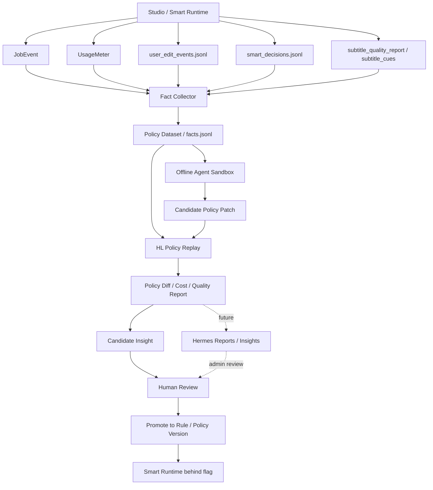

# Heuristic Learning / Smart / Hermes 融合方案

- 创建日期：2026-05-10
- 状态：方案草案，待审核
- 适用范围：智能版自动视频翻译、离线质量/成本评估、内部 ops / research 控制面
- 触发背景：围绕 Heuristic Learning 是否适合本项目、现有数据是否足够、与 Hermes 和智能版流程的关系进行讨论后的方案沉淀

## 0. 关联文档

- `docs/plans/2026-05-04-smart-auto-pipeline-plan.md`
- `docs/plans/2026-05-06-smart-shadow-evaluator-design.md`
- `docs/plans/2026-05-06-smart-shadow-sim-design.md`
- `docs/plans/2026-05-06-smart-shadow-eval-p0-results.md`
- `docs/plans/2026-05-06-smart-shadow-sim-p1-done-note.md`
- `docs/plans/2026-05-04-user-edit-audit-data-optimization-plan.md`
- `docs/plans/hermes/2026-04-11-hermes-platform-design.md`
- `docs/graphs/GITNEXUS_WORKFLOW_CORE_GRAPH.md`
- `docs/graphs/GITNEXUS_BENCHMARK_QUALITY_COST_GRAPH.md`
- `docs/graphs/GITNEXUS_JIANYING_DRAFT_DELIVERY_GRAPH.md`
- Weng, Jiayi. 2026-05. [Learning Beyond Gradients](https://trinkle23897.github.io/learning-beyond-gradients/)
- Artifact repository: [Trinkle23897/learning-beyond-gradients](https://github.com/Trinkle23897/learning-beyond-gradients)

## 1. 核心判断

Heuristic Learning 可以应用到本项目，而且长期收益较大。但它不应被理解为“让 agent 自动修改生产代码并上线”，而应被定义为：

> 基于历史 job、用户修改、成本计量、质量报告和失败样本，离线迭代可测试、可回放、可灰度的 heuristic policy。

这里采用的是 Weng 2026.05 提出的 Heuristic Learning 的安全适配版，而不是原版闭环形态。原版 HL 的核心机制是：coding agent 在反馈循环中持续修改 policy 代码；本项目第一阶段不采纳这一步，只采纳 state / action / feedback / code-as-policy 的 framing。原因是本项目运行在 SaaS 真实用户和付费 API 环境里，iteration 不像 Atari / MuJoCo / VizDoom 那样廉价、可重置、可无限试错。

更准确地说，本方案不是宣称“直接复刻 Weng HL”，而是：

- 把本项目中的 voice rerank、eligibility gate、retry budget、alignment threshold、subtitle sync gate 视为 code-form policy。
- 把 `smart_shadow_eval / sim`、`user_edit_events`、`UsageMeter`、质量报告视为 feedback / memory / experiment record。
- 把 coding-agent-in-loop 限制在离线 sandbox 中生成候选 policy，不允许直接修改生产代码或生产配置。
- 通过人工审核、版本化、测试和灰度，把可行候选提升到 Smart Runtime。

因此，本方案可以被称为“HL-inspired offline policy learning”，而不是完整原版 HL。

三条线的合理分工是：

- Smart / 智能版流程：用户侧产品能力，负责自动决策、自动修复和自动交付。
- Heuristic Learning：工程方法和离线策略改进机制，负责从真实样本里提炼、评估、版本化 policy。
- Hermes：内部控制面和治理层，负责周期性扫描、异常发现、insight 生成、投递和 admin 查询。

推荐融合方式不是把三者合并成一个大系统，而是形成三层：

1. Policy Lab / HL 离线层：运行 shadow evaluation、policy replay、候选规则评估。
2. Smart Runtime / 产品执行层：只消费通过离线验证和灰度批准的 policy。
3. Hermes / 内部治理层：读取报告、发现退化、管理 insight 生命周期，不直接改生产策略。

也可以按 System 1 / System 2 理解：

- Smart Runtime 是 System 1：执行已审核、确定性、可审计的 policy。
- Policy Lab / HL 离线层是 System 2：分析反馈、生成候选、做离线实验。
- Hermes 如果未来启动，是 System 2 的治理和投递面：发现退化、整理 insight、推动审核。

## 2. 为什么本项目适合 HL

本项目的主流程不是纯开放式生成，而是多阶段、强约束、可回放的工程流水线：

- TTS 单元是 `SemanticBlock` / `DubbingSegment`。
- Alignment 是 DSP-first，rewrite / re-TTS 是 fallback 或修复回环。
- 字幕 retiming 是数学 / 确定性逻辑。
- 交付目标是 editor package / Jianying draft，而不是以 rendered MP4 为唯一主产物。
- 已经存在 UsageMeter、JobEvent、user_edit_events、subtitle_quality_report、smart_shadow_eval / sim 等可观察数据面。

这类系统里的长期质量瓶颈通常不是“模型再聪明一点”，而是：

- 阈值选取是否稳定。
- fallback 是否过早或过晚。
- review gate 是否误放或过严。
- 重试和付费调用是否吃掉毛利。
- 交付状态机是否能把边界异常变成可诊断事实。

这些正是 HL 最适合处理的问题。

## 3. 与智能版流程的交叉

智能版方案已经包含 HL 的雏形，只是没有使用 Heuristic Learning 这个名字。

已重合的能力包括：

- `smart_shadow_eval / sim`：离线回放和策略比较。
- `smart_shadow_decisions.jsonl`：自动决策轨迹。
- `diff_kind`：把 shadow policy 与 Studio 实际行为分成 match / smart_more_aggressive / smart_less_aggressive / orthogonal / no_studio_signal。
- `user_edit_events.jsonl` + `effective_marker`：用户最终修正事实源。
- `UsageMeter`：成本、重试、付费调用事实源。
- `aggregate_report.json`：策略阶段级表现汇总。

因此，HL 第一阶段不需要新起一套大框架，应直接把智能版 P0/P1 工具链升级为通用 policy evaluation harness。

### 3.1 Smart Runtime 的边界

Smart Runtime 可以做：

- 执行已批准的 eligibility gate。
- 执行已批准的 voice sample selection / clone policy。
- 自动批准或拒绝 translation review。
- 运行有界 TTS duration repair。
- 运行字幕 / 音频同步 gate。
- 输出 `smart_decisions.jsonl`、`smart_quality_report.json`、`smart_cost_summary.json`。

Smart Runtime 不应做：

- 在线自学习并改阈值。
- 自动改 production prompt 或 admin settings。
- 绕过 `ensure_whisper_aligned_subtitles()` 另建字幕对齐链路。
- 把 simulator 的 `expected_retts` soft signal 当作 re-TTS action trigger。
- 破坏 DSP-first 和 deterministic retiming 不变量。

## 4. 与 Hermes 的交叉

Hermes 当前是 parked 状态，设计完整但零代码落地。它不应阻塞 Smart 或 HL 的近期推进。

但 Hermes 设计里有几条边界非常适合借给 HL：

- controlled read APIs：agent 只读受控 evidence bundle，不直接扫业务库和生产目录。
- controlled writeback：报告和 insight 通过 backend ingest 写入，不让 agent 直接写业务表。
- `collector -> detector -> analyst -> publisher`：规则先筛选，LLM 只分析可疑切片。
- reports / insights / deliveries：把分析产物持久化、可检索、可投递。
- insight 审核状态：`new`、`accepted`、`rejected`、`promoted_to_rule`、`promoted_to_prompt_eval`。
- evidence refs：每条结论必须能回到 `job_id`、`segment_id`、`event_id`、hash、触发规则和置信度。

如果未来启动 Hermes，推荐让 Hermes 消费 HL 报告，而不是让 Hermes 直接执行 HL：

- Hermes 周期性读取 `smart_shadow_sim` / `policy_eval` 输出。
- Hermes 检测 policy 退化、成本异常、样本缺口、unknown voice provenance 异常。
- Hermes 生成 insight 并投递 admin / Telegram。
- 人类审核后，候选规则进入离线 benchmark 或灰度开关。

Hermes 不应：

- 直接改 Smart policy。
- 直接改价格、权益、prompt、model toggle。
- 触发真实 clone / TTS / verifier 付费调用。
- 作为 pipeline executor 参与用户 job 主流程。

## 5. 现有数据是否足够

结论：

- 够启动离线 HL。
- 不够支撑可靠的自动线上学习。

当前已有三条主要数据面：

- `JobEvent`：生命周期、状态变化、控制面诊断。
- `UsageMeter`：LLM / TTS / voice clone 成本和 attempt-level 结果。
- `user_edit_events.jsonl`：用户编辑意图、最终生效修改和 survivor marker。

另外已有：

- `subtitle_quality_report.json`：字幕音频漂移。
- `subtitle_cues.json`：cue source、Whisper alignment coverage、proportional fallback。
- `smart_shadow_eval_collector.py`：事实表抽取。
- `smart_shadow_sim_simulator.py`：6 阶段离线决策。
- `smart_shadow_sim_aggregator.py`：跨 job 聚合。

从最近的 shadow aggregate 看，已有样本可以支撑早期判断：

- `jobs_simulated = 39`
- `jobs_with_metering_actual = 21`
- `post_phase_metered_jobs = 12`
- `ready_for_p2_rerun = true`

但同时存在明显缺口：

- `subtitle_sync_policy` 有大量 `no_studio_signal`。
- `studio_unknown_voices` 较多，影响 voice selection / clone policy 评估。
- translation review 可判定样本偏少。
- 当前数据更适合 job-level / stage-level 分析，不足以长期稳定训练 segment-level policy。

## 6. 需要补充的观察点

### 6.1 Policy 决策快照

新增或复用 append-only sidecar，记录每次 heuristic policy 的输入、版本、输出和证据。

建议 schema 与 `smart_decisions.jsonl` 兼容：

```json
{
  "schema_version": 1,
  "created_at": "2026-05-10T00:00:00Z",
  "job_id": "job_xxx",
  "root_job_id": "job_xxx",
  "policy_name": "tts_duration_repair_policy",
  "policy_version": "v2",
  "decision_kind": "stage",
  "entity_id": "segment_42",
  "input_features": {},
  "decision": {},
  "evidence_refs": {},
  "outcome_refs": {}
}
```

命名建议：

- Smart 产品运行时继续使用 `{project_dir}/audit/smart_decisions.jsonl`。
- 更通用的非 Smart policy 观察可以使用 `{project_dir}/audit/policy_observations.jsonl`。
- 两者 schema 尽量保持兼容，便于 dataset builder 统一读取。

### 6.2 Voice ID provenance

需要显式记录 voice_id 来源，减少 `unknown`：

- `preset`
- `cloned`
- `user_voice`
- `catalog`
- `provider_raw`
- `fallback_default`

记录位置可以在 voice selection / editing speaker profile / smart_decisions 中保留。长期应避免靠字符串前缀猜 voice 类型。

### 6.3 Segment / Block 级 outcome

HL 需要知道哪个 segment 或 block 出了问题，而不只是 job 总数：

- 哪个 block 发生 `text_audio_drift`。
- 哪个 segment 触发 rewrite / re-TTS / force_dsp。
- 哪个 segment 被用户改 speaker / split / text。
- 哪个 segment 的自动修复最终进入交付。
- 哪个 segment 触发 degraded delivery。

现有 `user_edit_events` 已有一部分 segment 信息，但 collector 聚合后信息变粗。建议 dataset builder 输出 segment-level benchmark 文件，而不是只输出 job-level facts。

### 6.4 用户结果反馈

即使没有显式评分，也可以记录弱标签：

- 用户是否下载 editor package。
- 用户是否触发 Jianying draft。
- 用户是否进入 post-edit。
- 用户是否 commit overwrite / copy_as_new。
- 用户是否反复 regenerate。
- 用户是否 abandon。

这些属于结果行为，不应混入 `UsageMeter`，也不应混成用户编辑意图。可以进入 JobEvent、delivery audit 或单独 outcome summary。

### 6.5 Policy / 环境版本快照

每个可回放 job 应能知道当时运行环境：

- policy version。
- admin settings snapshot。
- whisper policy snapshot。
- TTS provider / model。
- alignment thresholds。
- pricing runtime snapshot。
- code git sha。

否则不同阶段的数据混在一起会污染 HL 结论。

### 6.6 失败分支原因

需要 machine-readable reason，而不只是最终 status：

- `force_dsp_review_reason`
- `capped_dsp_underflow`
- `rewrite_rejected_reason`
- `clone_skipped_reason`
- `budget_exhausted_reason`
- `whisper_fallback_reason`
- `jianying_claim_lost_reason`
- `cache_miss_reason`

### 6.7 Policy code modularization & compression

Weng HL 的一个重要警告是：heuristic system 如果只追加规则、不压缩历史，最终会变成难维护的规则泥球。本项目已有类似风险：voice reranker、eligibility、retry、alignment、subtitle sync 中的阈值和特例会随着线上样本不断增加。

因此需要把 policy 从大流程里逐步抽成可单独 import、可单独 replay、可单独测试的 pure-function 风格模块。

优先候选：

- voice selection / voice reranking policy。
- Smart eligibility gate。
- clone sample selection policy。
- translation review auto-approval policy。
- TTS duration repair policy。
- subtitle sync policy。
- force_dsp / capped_dsp review severity policy。

模块化要求：

- 输入是结构化 features，不直接读取全局状态。
- 输出是结构化 decision + reason，不直接写 artifact。
- policy version 显式可见。
- 每个 policy 有 golden regression set。
- 每个 policy 可由 shadow harness 独立 replay。

同时建立周期性 compression checkpoint：

- 合并重复阈值和重叠特例。
- 删除已被新规则覆盖的旧补丁。
- 把“线上救火规则”折叠成更小的通用条件。
- 对压缩前后跑同一批 benchmark，确认行为差异可解释。
- 压缩本身也必须输出 diff report 和人工审核记录。

## 7. 推荐架构



## 8. 分阶段落地建议

### Phase HL-0：命名和边界确认

目标：把 HL 明确定义为离线 policy learning，不是线上自学习。

产物：

- 本方案审核通过。
- 在智能版方案中补一句：Smart P0/P1 shadow tools 是 HL 的第一执行面。
- 明确 `smart_decisions.jsonl` 与通用 `policy_observations.jsonl` 的关系。

验收：

- 文档边界明确。
- 不新增生产 hook。
- 不新增真实外部 API 调用。

### Phase HL-1：扩展离线 dataset builder

目标：把现有 job-level facts 扩成更适合 policy 学习的 segment-level dataset。

建议输出：

```text
reports/benchmark/<date>/policy_dataset/
  job_facts.jsonl
  segment_outcomes.jsonl
  policy_observations.jsonl
  user_edit_survivors.jsonl
  usage_attempts.jsonl
  summary.json
```

重点字段：

- `job_id`
- `root_job_id`
- `segment_id`
- `block_id`
- `speaker_id`
- `duration_ms`
- `source_text_chars`
- `cn_text_chars`
- `tts_input_text_hash`
- `final_text_hash`
- `alignment_method`
- `force_dsp_severity`
- `rewrite_count`
- `retts_count`
- `user_edit_kinds`
- `effective`
- `usage_event_ids`

验收：

- stdlib-only。
- read-only。
- 不写 production project dir。
- 能在本地样本和生产抽样包上跑通。

### Phase HL-2：Policy Evaluation Harness

目标：让 policy 版本可以离线对比。

第一批 policy：

- `eligibility_gate`
- `voice_sample_selection`
- `clone_policy`
- `translation_review_auto_approval`
- `tts_duration_repair_policy`
- `subtitle_sync_policy`

比较指标：

- match rate。
- no_studio_signal rate。
- smart_more_aggressive / smart_less_aggressive。
- retry estimation error p50 / p90。
- subtitle drift count。
- user edit survivor reduction。
- estimated cost delta。

验收：

- 每个 policy 输出版本号。
- 每次跑评估输出 aggregate report。
- 新 policy 不通过生产 hook 自动生效。

### Phase HL-2.5：Offline agent candidate loop

目标：在完全离线、无付费 API、无生产写入权限的 sandbox 里，引入 Weng 原版 HL 最有特色的 coding-agent-in-loop，但只让 agent 生成候选 policy patch。

执行流程：

1. 固定一个 read-only benchmark bundle。
2. 给 agent 提供 policy 模块、测试、shadow eval 命令和失败报告。
3. agent 只能修改离线 policy 模块或新增测试，不能改生产 runtime glue。
4. 跑 unit tests、golden regression、shadow eval。
5. 输出 candidate patch、aggregate diff、失败样本、成本影响和风险说明。
6. 人类审核后，候选进入 policy registry；未审核前不得进入 Smart Runtime。

硬边界：

- 不读生产数据库。
- 不写 production project dir。
- 不调用 MiniMax / Gemini / VolcEngine / verifier 真实付费 API。
- 不自动改 admin settings。
- 不自动开 Smart flag。
- 不自动提交生产代码。

验收：

- sandbox 可复现：相同输入 bundle + policy commit 产生同一份 diff report。
- candidate patch 只触碰指定 policy write set。
- 任何性能提升必须同时报告 cost / quality / false-positive tradeoff。
- 至少保留一个 holdout benchmark，防止 agent 对当前样本过拟合。

### Phase HL-3：Smart Runtime 接入

目标：只让通过评估的 policy 进入 Smart P2 runtime。

接入原则：

- `AVT_ENABLE_SMART_MODE=false` 默认关闭。
- policy version 写入 `smart_decisions.jsonl`。
- 所有付费 API 走 fake provider 测试。
- 所有自动修复有成本闸。
- 所有降级分支写原因。

验收：

- Smart MVP fake provider 套件通过。
- 付费 API 守卫测试通过。
- `main.py` 和 `pytest` 仍可在 clean local 环境运行。
- 不破坏 Studio / Express 现有路径。

### Phase HL-4：Hermes 消费 HL 报告

前置条件：Hermes Phase 1 至少已有 reports / insights / ingest / admin surfaces。

目标：Hermes 只作为 HL 的治理和发现层。

Hermes 可做：

- 定期读取 policy aggregate report。
- 报告 policy 退化。
- 提醒样本量不足。
- 发现 unknown voice provenance 异常。
- 发现 cost p90 / p99 异常。
- 生成候选 insight。

Hermes 不可做：

- 自动改 policy。
- 自动改 admin settings。
- 自动触发付费调用。
- 自动 rerun 用户 job。

## 9. 优先级建议

近期优先级：

1. 继续完善 Smart P0/P1 shadow 工具链，不等待 Hermes。
2. 增加 voice_id provenance，降低 voice policy 的 no_studio_signal。
3. 增加 policy version / input_features / decision snapshot。
4. 扩展 segment-level dataset builder。
5. 抽出第一批 pure-function policy module，并补 golden regression set。
6. 把 retry estimation v3 的前置数据补足：post-phase metered jobs ≥ 30，per-voice metered ≥ 10。

中期优先级：

1. Smart P2 只接入已验证 policy。
2. 输出 `smart_decisions.jsonl`、`smart_quality_report.json`、`smart_cost_summary.json`。
3. 用真实 Smart 用户行为校正 Studio-bias。
4. 建立 50-100 段人工标注集，用于 verifier / speaker risk benchmark 和 policy golden regression。
5. 启动 HL-2.5 offline agent candidate loop，但只生成候选，不自动上线。

长期优先级：

1. Hermes 若启动，读取 HL 报告并管理 insight。
2. 建立 policy registry 和 promotion workflow。
3. 将高置信策略灰度到 Smart Runtime。
4. 把失败样本持续加入 benchmark。
5. 周期性做 policy compression checkpoint，防止规则堆叠失控。

## 10. 风险和约束

### 10.1 Studio-bias

`user_edit_events` 主要来自 Studio 用户。Studio 用户更偏精修，Smart 用户可能更偏快速量产。不能把 Studio effective corrections 当作绝对真值。

缓解：

- Smart 上线后单独统计 Smart 用户返工。
- P3 前补一份 Smart 任务类型人工标注集。
- 指标里区分 “Studio user modified” 和 “objective quality failure”。

### 10.2 Policy 过拟合

样本量小、内容类型单一时，HL 容易调出只适合当前样本的阈值。

缓解：

- 所有报告输出样本量和 unevaluable rate。
- 按内容类型拆分统计。
- 任何 policy promotion 都必须有 holdout 或后续抽样验证。

### 10.3 生产自动化越权

HL / Hermes 如果能直接改生产配置，会放大错误。

缓解：

- Phase 1 只允许写 report / insight。
- policy promotion 必须人工审核。
- Smart Runtime 只消费版本化 policy。
- admin flag / kill switch 必须存在。

### 10.4 成本不可控

Smart 固定价不代表内部可无限重试。

缓解：

- `smart_cost_summary.json` 必须记录 retry waste。
- 所有 verifier / clone / re-TTS 必须有预算闸。
- retry action trigger 必须基于运行时实际失败，不基于 simulator soft signal。

### 10.5 HL 名称预期错位

如果文档只说“应用 HL”，读者可能误以为本项目要直接复刻 Weng 原版：让 coding agent 在闭环里持续改生产 policy 代码。这个预期是错误且危险的。

缓解：

- 明确本方案是 HL-inspired offline policy learning。
- 明确原版 coding-agent-in-loop 只允许进入 HL-2.5 sandbox。
- 生产 runtime 永远只消费人工审核后的版本化 policy。

### 10.6 规则泥球

HL 的长期风险不是没有规则，而是规则不断增加后失去结构。

缓解：

- policy 模块化。
- golden regression set。
- compression checkpoint。
- 每次压缩输出行为 diff 和人工审核记录。

## 11. 非目标

本方案不做以下事情：

- 不实现 Hermes。
- 不启动 Smart P2。
- 不新增真实付费 API 调用。
- 不让 agent 自动修改生产代码或生产配置并上线。
- 不把 Weng 原版 coding-agent-in-loop 直接接入用户 job。
- 不把 rendered MP4 变成主交付目标。
- 不把字幕时间轴交给 LLM 生成。
- 不把 `user_edit_events`、`UsageMeter`、`smart_decisions` 混成一个日志。

## 12. 补充判断

HL 对本项目的长期价值主要来自复利：

- 每个失败样本能变成可回放 benchmark。
- 每次用户修改能变成策略评估数据。
- 每次重试和付费调用能进入毛利分析。
- 每次 delivery 异常能沉淀成诊断规则。
- 每次 policy 变更能被版本化、比较和回滚。

如果执行得克制，HL 会把“靠经验调阈值”逐步变成“有样本、有证据、有回放、有灰度的策略演进”。这比直接训练一个新模型更贴合当前项目，也更符合已有架构不变量。

推荐近期行动是：

1. 把 Smart P0/P1 shadow 工具链正式命名为 HL 的第一执行面。
2. 补 `policy_observations` / `smart_decisions` 的版本化决策快照。
3. 优先修 voice provenance 和 segment-level outcome，降低不可评估率。
4. 抽出第一批 pure-function policy module，并建立 golden regression set。
5. 在离线 sandbox 中试运行 agent candidate loop，但只产出候选 patch 和 diff report。
6. 等 Smart P2 进入 runtime 前，再决定是否需要 Hermes 参与治理。
