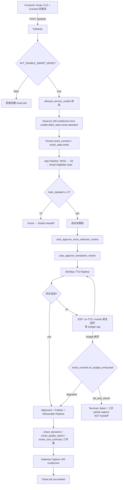

# 智能版 P2 MVP 实施计划

- 创建日期:2026-05-13
- 状态:实施草案,待审核
- 适用范围:P2 智能版 MVP 实施(代码 + 配置 + 灰度发布)
- 关联文档:
  - 主方案:[`docs/plans/2026-05-04-smart-auto-pipeline-plan.md`](2026-05-04-smart-auto-pipeline-plan.md)
  - P0 数据评估:[`docs/plans/2026-05-06-smart-shadow-eval-p0-results.md`](2026-05-06-smart-shadow-eval-p0-results.md) §16
  - P1 shadow 工具完成记录:[`docs/plans/2026-05-06-smart-shadow-sim-p1-done-note.md`](2026-05-06-smart-shadow-sim-p1-done-note.md)
  - c7 P2 decision 数据报告:`D:/Claude/temp/smart_shadow_sim/c7_remote_run/results_p2_decision/REPORT.md`

---

## 1. 实施前提确认

P0/P1 全闭环,数据全绿(c7 远端只读 rerun 2026-05-13,46 jobs):

| 维度 | 状态 |
|---|---|
| `post_phase_metered_jobs` ≥ 20 | ✅ **24/20** |
| §11 verdict | ✅ **PASS** |
| margin p10/p50/p90/p99 | ✅ 全正(14.97 / 55.37 / 247.92 / 350.59 RMB)|
| 负毛利 jobs | ✅ **0/46** |
| Bug 1 + FU#1 + FU#2 + Gate fix + Whisper fix | ✅ 全 in main + deployed + 实证 |
| Production `pricing_runtime.json` | ✅ 含 `smart.standard: 100` |

**100 credits/min 商业模型已 validated,商业风险下界可知。**

### 1.1 P2 launch 前还要做的两件软事(不阻塞设计,可并行)

1. **抽 5-10 个 `voice_selection_diff.studio_unknown_voices` 实例**查来源 —— 决定是否扩 Gap C v3 patterns(当前 unknown 50% 偏高)
2. **主动跑 1-2 个边界 case**(4+ speaker panel + >60min 单口长讲) —— 避免 launch 后第一次踩坑

---

## 2. 实施范围(P2 launch 必需)

### 2.1 In scope

- **Gateway 层**:`service_mode=smart` 创建 / reserve / capture / release / refund 全链路 + Kill switch + bucket priority
- **App pipeline 层**:Smart eligibility gate + 自动决策层(`auto_approve_voice_selection_review` / `auto_approve_translation_review`)+ 有界 TTS 时长修复回环
- **Sidecar 三件套**:`smart_decisions.jsonl` / `smart_quality_report.json` / `smart_cost_summary.json` emitter
- **Smart → Studio 接管契约**:`smart_state.status` / `handoff_stage` / `credits_policy`
- **付费 API 守卫**:AST + runtime gate(`smart_consent.auto_voice_clone` 等)
- **前端**:Smart 入口(flag gate)+ consent 同意流 + QA report 展示页
- **灰度发布机制**:`AVT_ENABLE_SMART_MODE` + admin allowlist + 监控指标

### 2.2 Out of scope(defer 到 P3 / P4 / P5)

- ❌ 多模态 verifier(P3 独立 program,已有 design doc 思路)
- ❌ Per-voice/provider retry estimation v3 calibration(spec §3.5,defer per P1 done note)
- ❌ 长视频 retry budget 收紧公式(P5 规模化)
- ❌ Automatic re-translate(P4 verifier-driven repair)
- ❌ Smart 用户 worst-case 内容兼容性"自动检测"(P5,先靠 speaker gate 拒绝 + content compliance 既有路径)

---

## 3. 架构概览



**关键不变量**(同主方案 §3,P2 实施必须守):

- TTS unit 仍是 `SemanticBlock` / `DubbingSegment`,不是字幕行
- Alignment 仍是 DSP first,rewrite/re-TTS 是 fallback
- 字幕 retiming 仍是数学/确定性逻辑,不交 LLM
- Gateway 是 plan/trial/pricing/entitlement/debit rate **唯一**事实源
- 本地开发/测试默认路径**不**引入真实付费 API 依赖

---

## 4. Schema 设计

### 4.1 service_mode = "smart" 注册

**新增 `service_mode` 枚举值**:`express` / `studio` / `smart`(已确认 in `pricing_runtime.json::credits.debit_rates`)

**`allowed_service_modes` 配置**(2026-05-14 修订,per Codex F2):

| Plan | P2-alpha-code 期 | P2-launch-α/β 期 | P2-GA 期 |
|---|---|---|---|
| `free` | `["express"]` | `["express"]` | `["express"]` |
| `plus` | `["express", "studio"]` | `["express", "studio"]` + **user-level overlay** | `["express", "studio", "smart"]` ⚠️ TBD owner |
| `pro` | `["express", "studio"]` | `["express", "studio"]` + **user-level overlay** | `["express", "studio", "smart"]` ⚠️ TBD owner |

**关键**(Codex F2 fix):**plan_catalog.PLANS 不要在灰度期就给 plus/pro 加 smart**,否则一旦 `AVT_ENABLE_SMART_MODE=true` 该 plan 所有用户都会拿到 smart 能力,与 §9.2 "只对 admin allowlist 1-2 用户开" 矛盾。

**user-level overlay 实现**(2026-05-14 第五轮 codex F2 修订):

**抽共享 helper,拆两层**(2026-05-14 第六轮 codex F4 修订,避免 kill switch 与 allowlist 语义混淆):

```python
# gateway/plan_catalog.py

def get_raw_user_entitlement(user) -> list[str]:
    """Layer 1: user 数据层 entitlement(plan + trial + user.smart_enabled overlay)。

    只反映用户被授予了什么能力,**不考虑** kill switch / admin runtime toggle。
    用于 admin diagnostics 展示"这个用户原本有什么权限"。
    """
    base = list(get_effective_plan_gate(user)["allowed_service_modes"])
    if getattr(user, "smart_enabled", False) and "smart" not in base:
        base.append("smart")
    return base


def get_effective_allowed_service_modes(user, settings=None) -> list[str]:
    """Layer 2: 真实 gate 决策用 — Layer 1 + env + admin runtime toggle。

    所有 gate(entitlements endpoint, job_intercept create gate)**必须** 用这个,
    不能用 get_raw_user_entitlement,否则 kill switch 翻转无效。

    Kill switch 关闭(AVT_ENABLE_SMART_MODE=false 或 admin.smart_mode_enabled=false)
    时,即使用户 smart_enabled=true,smart 也从返回列表剔除 — 用户立即丢失能力。
    """
    if settings is None:
        from config import settings as _global_settings
        settings = _global_settings
    base = get_raw_user_entitlement(user)

    # Kill switch:env + admin runtime toggle 任一关闭就剔除 smart
    from admin_settings import load_settings
    admin_toggle = bool(load_settings().smart_mode_enabled)
    env_capability = bool(settings.enable_smart_mode)  # AVT_ENABLE_SMART_MODE
    smart_globally_enabled = env_capability and admin_toggle

    if not smart_globally_enabled and "smart" in base:
        base.remove("smart")
    return base
```

**两层分工**:
- `get_raw_user_entitlement(user)`:**数据层** — 这个用户原本有什么权限,只 admin diagnostics 用
- `get_effective_allowed_service_modes(user)`:**决策层** — 当前 gate 决策应允许什么(含 kill switch),所有 entitlement / create-gate / discovery 用

**3 处 call site 必须同时改**:

| # | 当前位置 | 当前代码 | 改后 |
|---|---|---|---|
| 1 | [entitlements.py:38-55](gateway/entitlements.py:38) admin 分支 | 硬编码 `["express", "studio"]` | `get_effective_allowed_service_modes(user)`(admin 也走 user.smart_enabled overlay,**不**自动获 smart) |
| 2 | [entitlements.py:57+](gateway/entitlements.py:57) 普通用户分支 | `plan_info["allowed_service_modes"]` | `get_effective_allowed_service_modes(user)` |
| 3 | [job_intercept.py:743-754](gateway/job_intercept.py:743) 创建 gate | `plan_info["allowed_service_modes"]` | `get_effective_allowed_service_modes(user)` |

**关键**(F2 fix):
- admin 不应**自动获** smart 能力 — 必须显式 grant `users.smart_enabled=true`,与普通用户走同一条 allowlist 链路
- 否则任何 admin 一旦 `AVT_ENABLE_SMART_MODE=true` 就能创建 smart job,绕过灰度策略,直接打满 production smart quota

**DB 字段 + admin 端点**:
- DB 加字段 `users.smart_enabled BOOLEAN NOT NULL DEFAULT false`(Alembic migration)
- admin 端点 `POST /admin/users/{user_id}/grant-smart` / `revoke-smart`(参 [gateway/admin_credits_api.py] 已有 admin pattern)
- GA 时把 plus/pro 改成 `["express", "studio", "smart"]` 后,user-level 字段仍保留作"强制禁用"开关(同上 helper 逻辑;false 不会从 plan-level 移除 smart,只有"plan 含 smart 但用户被显式禁用"才移除 — 需要补一条 `if smart_disabled: base.remove("smart")` 反向 overlay)

**回归测试**:
- `test_get_effective_allowed_service_modes_user_overlay`:user.smart_enabled=true → smart in result;false → not in
- `test_admin_does_not_auto_grant_smart`:admin user.smart_enabled=false → smart not in entitlements/create gate
- `test_create_job_smart_rejected_when_user_not_in_allowlist`:env+admin both true,user.smart_enabled=false,plan 不含 smart → POST /api/jobs service_mode=smart 返 403

### 4.2 `smart_consent` + `smart_state` 持久化(2026-05-14 修订,per Codex F3)

**位置**:两个字段都放在 **DB Job 表 + Job API JobRecord dataclass 双侧**(项目当前两套 model 的常规模式)。

⚠️ 之前误写"`JobRecord.smart_consent` JSONB" — `JobRecord` 是 [src/services/jobs/models.py:101](src/services/jobs/models.py:101) 的 dataclass(不是 SQLAlchemy),不能直接挂 JSONB。Gateway billing 实际读的是 [gateway/models.py:172](gateway/models.py:172) `class Job(Base)` SQLAlchemy 行。两者必须同步加字段。

**5 处必须同时改**(任一漏改 = 字段读不到 / 序列化丢失):

| # | 位置 | 改动 |
|---|---|---|
| 1 | `gateway/migrations/versions/0XX_smart_consent_state.py` Alembic | 加 `Job.smart_consent` (JSONB nullable) + `Job.smart_state` (JSONB nullable) |
| 2 | [gateway/models.py:172](gateway/models.py:172) `class Job(Base)` SQLAlchemy | 加 `smart_consent: Mapped[dict \| None] = mapped_column(JSONB, nullable=True)` 同理 smart_state |
| 3 | [src/services/jobs/models.py:101](src/services/jobs/models.py:101) `JobRecord` dataclass | 加 `smart_consent: dict[str, object] \| None = None` + `smart_state: dict[str, object] \| None = None` |
| 4 | [src/services/jobs/api.py](src/services/jobs/api.py) POST `/jobs` parser + `to_dict` / `from_dict` | 接收 + 序列化 + 回填两个字段 |
| 5 | Gateway mirror path(`mirror_job_terminal_state` / job creation mirror) | 写入 DB Job 行时同步两字段 |

**为什么落 DB 字段而不是 sidecar**:
- consent 写一次读多次(每次 capture/release/refund 校验 `auto_voice_clone` 等);DB 读 < file IO
- 与 `smart_state` 对称,Gateway billing path 读 DB 直接拿到
- 独立 sidecar 模式(`audit/smart_decisions.jsonl`)留给"系统运行时累计的状态",不适合频繁读

**测试覆盖**:
- migration 上下行 + 字段默认 None
- API POST → DB → JobRecord 回读三角(三个 JSON 形状一致)
- 现有 Express / Studio job(`smart_consent=null`)读写不受影响

**pipeline → JobRecord smart_state 回写通道**(2026-05-14 第七轮 codex F1,**blocker**):

现有架构 pipeline 是 process_runner spawn 的**子进程**,只能读 job snapshot,无法直接写 JobRecord;process_runner 终态 finalize 只写 `status/current_stage/project_dir`(见 [src/services/jobs/process_runner.py:625-639](src/services/jobs/process_runner.py:625));Gateway metering callback 只接受白名单 keys(见 [gateway/job_intercept.py:3353-3375](gateway/job_intercept.py:3353))。

**Smart pipeline 在 auto-approve / handoff / completed 时改 `smart_state` 必须有显式回写通道**,否则:
- billing path(`settle_job_credit_ledger`)看不到 `smart_state.credits_policy` → partial capture 永不触发
- editing.py / jianying gate(§4.3 第 1 + 6 行)读 `record.smart_state.status` → 永远是 reserve 时的初始值
- admin UI / 用户 QA report 看不到自动决策记录

**P2 必须新增** stdout marker `[SMART_STATE]` + runner 识别:

1. **pipeline 侧** `src/services/smart/state.py` emit:
   ```python
   def emit_smart_state_marker(state: dict) -> None:
       """Print marker to stdout for process_runner to ingest into JobRecord.

       Mirrors _build_web_review_marker pattern (see process_runner.py:502).
       """
       print(f"[SMART_STATE] {json.dumps(state, ensure_ascii=False)}", flush=True)
   ```
2. **runner 侧** `src/services/jobs/process_runner.py::_process_log_line` 加新 marker 解析器(参考现有 `_parse_web_review_marker` 模式):
   - 匹配 `[SMART_STATE] {...}` 前缀
   - 解析 JSON → 通过 `self.store.update_smart_state(job_id, parsed)` 写入 JobRecord(新增 JobStore 方法)
   - append `JobEvent(event_type='smart_state', payload=parsed)` 到 events.jsonl
3. **Gateway mirror** `gateway/job_intercept.py::metering_callback` 允许 `smart_state` 字段进白名单(L3353-3375),与 metering_snapshot 同步 mirror 到 SQLAlchemy `Job.smart_state` 列
4. **测试** `test_smart_state_marker_flows_pipeline_to_jobrecord_and_gateway`:fake pipeline emit `[SMART_STATE] {...}` → 验证 JobRecord.smart_state + DB Job.smart_state 都更新

**禁止**:
- pipeline 直接 import `gateway.models.Job` 跨进程写 DB(违反进程边界)
- pipeline 直接调 JobStore 方法(JobStore 在 Job API 进程,pipeline 是 process_runner spawn 的子进程,不在同一进程空间)
- 通过 sidecar 文件传递 smart_state(竞态 + 不被 Gateway mirror 看到)

```json
{
  "service_mode": "smart",
  "smart_consent": {
    "auto_voice_clone": true,
    "auto_retranslate": false,
    "auto_retts": true,
    "auto_multimodal_verification": false,
    "no_extra_charge_without_confirmation": true,
    "on_budget_exhausted": "degraded_delivery_with_report"
  }
}
```

**字段语义见主方案 §5.3**。`on_budget_exhausted` 枚举:`degraded_delivery_with_report`(默认) / `fail_and_refund`。

**Schema 拍板(2026-05-14 第五轮 codex F3)**:`smart_consent` payload **不含** `fixed_rate_credits_per_minute` 字段。理由:
- 让客户端传 rate = client 定 pricing,违反主方案 §3 不变量
- 之前我把它当"UI ack" 字段保留是错的 — UI 显示已经从 `/api/plans` 拉,不需要在 consent 里再 echo 回来
- 前端 [§7.2 SmartConsent type](frontend-next/src/types/jobs.ts) 也已确认不含

**Price snapshot 必须由服务端写入**(replaces 客户端传 rate 的需求):

服务端有**两条 reserve 路径**,都必须写 snapshot(2026-05-14 第七轮 codex F6,关键):

| Reserve 路径 | 触发时机 | 位置 | 必须写 snapshot |
|---|---|---|---|
| **Create-time reserve** | POST /api/jobs 时已知 `estimated_duration_seconds` | [job_intercept.py:732+](gateway/job_intercept.py:732) `intercept_create_job` 的 reserve 路径 | ✓ |
| **Late reserve** | Create-time 没 duration → pipeline 回报 source metadata 后由 metering callback 触发 reserve | [job_intercept.py:3190-3219](gateway/job_intercept.py:3190) `actual_duration` 分支内 `estimate_credits + ensure_credit_buckets_for_user` 序列 | ✓(前一稿漏了这条) |

两条路径都必须做:
```python
# 计算 rate
runtime_rate = _get_runtime_debit_rates()[("smart", "standard")]
# 写 snapshot 到 Job.smart_state
job.smart_state = {**(job.smart_state or {}),
                    "reserved_credits_per_minute": runtime_rate,
                    "reserved_at": utc_now_iso()}
# 然后才走 reserve_credits_or_raise / shadow_reserve
```

**关键不变量**:
- Job 期间 pricing_runtime.json 改 smart.standard 不影响该 job(snapshot 锁定)
- capture / fail_and_refund / refund 时按 `Job.smart_state.reserved_credits_per_minute` 计算,不重读 runtime
- 这是 audit trail + 反价格漂移双保险

**守卫** `tests/test_smart_paid_api_guards.py` 加 AST 扫:create-time + late reserve 两个 reserve 调用点的前序代码必须包含 `smart_state["reserved_credits_per_minute"] = ...` 赋值(防止后续 PR 漏掉任一条路径)。

**测试** `test_late_reserve_writes_smart_state_snapshot`:模拟创建时无 duration → pipeline 回报 metering with duration → 验证 Job.smart_state.reserved_credits_per_minute 等于 reserve 时刻的 runtime rate;后续 pricing_runtime 改 rate 不影响该 job 的结算。

**`smart_consent` 必填字段(server-side 校验,与示例一致)**:
- `auto_voice_clone: bool`
- `auto_retts: bool`
- `on_budget_exhausted: 'degraded_delivery_with_report' | 'fail_and_refund'`
- `auto_retranslate: bool`(P2 MVP 必须为 false,server 校验)
- `auto_multimodal_verification: bool`(P2 MVP 必须为 false,server 校验)
- `no_extra_charge_without_confirmation: bool`(必须为 true,server 校验 — 用户对成本封顶语义的 ack)

**前端 SmartConsent type 必须与本节示例严格一致**(§7.2 checklist 第 2 行)。

### 4.3 `smart_state` 接管契约

```json
{
  "smart_state": {
    "status": "running" | "downgraded_to_studio" | "fail_and_refunded" | "clone_blocked_waiting_retry" | "completed",
    "reason": "<machine_readable_code>",
    "handoff_stage": "<stage_id>",
    "credits_policy": "refund_full" | "refund_smart_apply_studio" | "capture_full" | "capture_actual_cost_capped_at_studio_price"
  }
}
```

**为什么不直接改 `service_mode`**:保留审计事实,人工接管时能看到"这是个 smart 任务降级来的"。

**`status × trigger × credits_policy × is_terminal` 完整映射表**(对齐主方案 §6.3 fail-safe ladder + §7.3 clone 重试):

| status | trigger | credits_policy | is_terminal | 备注 |
|---|---|---|---|---|
| `running` | job 创建后正常进入 pipeline | (N/A — reserve 已发生) | no | 默认初始状态 |
| `downgraded_to_studio` | speaker_gate fail (main_speakers > 3) | `refund_full` | no | spec §6.3 ladder 行 1;前端引导转 Studio 重新下单 |
| `downgraded_to_studio` | translation_auto_approve fail / clone 全失败但未触发付费调用 | `refund_full` | no | spec §6.3 ladder 行 2 |
| `clone_blocked_waiting_retry` | per-speaker clone 重试 ≤ 3 次后失败 + 用户暂未选择 | (无 capture / 无 release,reserve 保留) | no | spec §7.3;用户可稍后重试或取消 |
| `clone_blocked_waiting_retry` → `downgraded_to_studio` | 用户在 retry 窗口内取消 | `refund_full` | yes | spec §7.3"未交付智能版结果,默认全额释放" |
| `clone_blocked_waiting_retry` → `completed` | 用户选"使用预设音色继续" | `capture_full` | yes | 走 `degraded_delivery_with_report` 分支 |
| `fail_and_refunded` | 已 clone/TTS,用户选 `fail_and_refund` 触发失败 | `capture_actual_cost_capped_at_studio_price` | yes | spec §6.3 ladder 行 3:按 UsageMeter 真实成本折算扣点,但不超过同视频 Studio 等价价 |
| `completed` | budget 耗尽 + 用户选 `degraded_delivery_with_report` 交付 | `capture_full` | yes | spec §6.3 ladder 行 4:固定 `runtime_smart_rate × source_minutes`(P0 落点 100c/min,实施按 runtime 拉) |
| `completed` | 全自动通过(无 budget 触发) | `capture_full` | yes | 主路径 |
| `downgraded_to_studio` | 系统 bug / 生产事故 / 全链失败 | `refund_full` + incident 记录 | yes | spec §6.3 ladder 行 5:不让用户为系统错误买单 |

**降级后 Gateway routing 不变**(2026-05-14 拍板):
- `service_mode = "smart"` 不改 → `_get_runtime_bucket_priority()` / `_get_runtime_debit_rates()` / `compute_job_policy()` 全部按 `smart` 查
- 降级**只影响**:(a) review-state 解锁人工(ReviewStateManager 重置 active stage);(b) capture 时 amount 按 `credits_policy` 调整(release vs capture_full vs capture_actual)
- 这是最小 diff 方案;避免在 [credits_service.py:88-124](gateway/credits_service.py:88) 三个 query 都加 `smart_state` lookup adapter

**降级 / 成功后 Studio 入口 gate 必须接受 `service_mode=smart`**(2026-05-14 修订,per Codex F3):

现有两个硬 literal gate 会拒绝 smart job 进 Studio post-edit / 剪映草稿:
- [src/services/jobs/editing.py:122](src/services/jobs/editing.py:122):`if record.service_mode != "studio": raise EditingConflictError`
- [src/services/jobs/jianying_draft_runner.py:384](src/services/jobs/jianying_draft_runner.py:384):`if job.service_mode != "studio": raise JianyingNotAllowedError("service_mode_not_studio")`

P2 必须改这两个 gate 为"允许 service_mode ∈ {studio, smart}"。具体逻辑:

```python
# editing.py:122 改后
ALLOWED_EDITING_SERVICE_MODES = {"studio", "smart"}
if record.service_mode not in ALLOWED_EDITING_SERVICE_MODES:
    raise EditingConflictError(...)
# Smart 额外保护:smart_state 必须是 completed 或 downgraded_to_studio
if record.service_mode == "smart":
    state = (record.smart_state or {}).get("status")
    if state not in {"completed", "downgraded_to_studio"}:
        raise EditingConflictError(
            f"smart job {record.job_id} not in editable smart_state "
            f"(current: {state!r}); cannot enter Studio post-edit"
        )
```

jianying_draft_runner.py:384 同样改造。守卫见 §8.2 #7。

**完整 Studio-only gate 盘点**(2026-05-14 第五轮 codex F4,逐项决策):

P2 实施前必须 grep 全仓 `service_mode == "studio"` literal 出现位置,逐项决策"smart-aware"或"保持 Studio-only"。当前已盘点 5 处:

| # | 位置 | 当前行为 | P2 决策 | 守卫 |
|---|---|---|---|---|
| 1 | [src/services/jobs/editing.py:122](src/services/jobs/editing.py:122) `enter_editing` | `!= "studio"` raise | **smart-aware**:接受 `{studio, smart}` + smart_state.status ∈ {completed, downgraded_to_studio} | §8.2 #7 |
| 2 | [src/services/jobs/jianying_draft_runner.py:384](src/services/jobs/jianying_draft_runner.py:384) jianying gate | `!= "studio"` raise | **smart-aware**:同上(剪映草稿是交付层产物,smart job 也要能下) | §8.2 #7 |
| 3 | [src/pipeline/process.py:2235](src/pipeline/process.py:2235) voice_selection_review payload 触发 | `service_mode == "studio"` → 写人审 payload | **smart-aware**:smart 也要 build payload + write review state(后被自动决策层 auto-approve);改为 `service_mode in {"studio", "smart"}`;Smart 路径 set_stage 后由 auto_voice_review 立即推进 |
| 4 | [src/pipeline/process.py:2280](src/pipeline/process.py:2280) cloned voice expiry validation | `service_mode == "studio"` → 校验 expired voices | **smart-aware**:smart 也要 expiry 校验(否则 smart_state 里挂的过期音色会让 publish 失败);改为 `service_mode in {"studio", "smart"}` |
| 5 | [src/pipeline/process.py:2346](src/pipeline/process.py:2346) speed catalog lookup | `service_mode == "studio"` + 全部 voice_id 已选 → catalog hit 跳过 probe | **smart-aware**:smart 自动选完 voice_id 后同样可受益(节省 probe ~$0.02);改为 `service_mode in {"studio", "smart"}` |
| 6 | [src/services/jobs/api.py:1458-1467](src/services/jobs/api.py:1458) jianying draft endpoint preflight(2026-05-14 第六轮 codex F3 补) | `(record.service_mode or "").lower() != "studio"` → 403 FORBIDDEN | **smart-aware**:smart job succeeded 也要能下剪映草稿(交付层产物);改为 `if record.service_mode not in {"studio", "smart"}: return 403`;且 smart job 校验 `smart_state.status in {"completed", "downgraded_to_studio"}`(防止 in-flight smart job 提前要草稿) |

**守卫(扩展 §8.2 #7)**:
- AST 扫 `gateway/` + `src/services/jobs/` + `src/pipeline/` 下所有 `Compare` 节点,匹配 `<expr>.service_mode == "studio"` 或 `<expr>.service_mode != "studio"` 的 literal 比较 → **报错并要求改为 `in {studio, smart}` 或显式 allowlist 模式**
- 例外:`compute_job_policy` 等 *分发* 函数(per service mode 不同 policy)允许 literal 比较 — 守卫白名单
- 守卫 fail 时输出"Studio-only gate detected at <file>:<line>;请决策 smart-aware 或加入白名单"

**实施提示**:本守卫**先于** smart auto-review 编码落地。先 land 守卫 + 改完 5 处 literal,确认所有现存 Studio gate 都被显式决策过,再开始 §6 编码。否则编码到一半发现新 gate 要回头改既费时也易漏。

### 4.4 `smart_decisions.jsonl`(append-only sidecar,project_dir/audit/ 下)

每条事件 schema:

```json
{
  "schema_version": 1,
  "event_id": "...",
  "decision_type": "speaker_gate" | "voice_clone" | "voice_selection_auto_approve" | "translation_auto_approve" | "tts_retry" | "split_proposal" | "downgrade_handoff" | "budget_exhausted",
  "decision": "approved" | "rejected" | "deferred",
  "evidence": { ... },
  "reason_code": "...",
  "auto_approved": true,
  "created_at": "...",
  "smart_decision_id": "..."
}
```

**纪律边界**(per 主方案 §12):
- 系统自动决策**不**混进 `user_edit_events.jsonl`
- 成本数据**不**混进 `smart_decisions.jsonl`(走 UsageMeter)
- JobEvent / UsageMeter / smart_decisions 三个 sink 各管各的

### 4.5 `smart_quality_report.json`(per 主方案 §12)

Smart 任务结束时由 emitter 生成,内容:
- 智能版适配检查结果
- 主要 speaker 数 + 每个 speaker 的克隆决策
- 自动批准的 review payload 摘要
- 每 segment 的 DSP / rewrite / re-TTS 次数
- 字幕音频同步状态(从现有 [output/subtitle_quality_report.json](src/modules/output/) 引用 `text_audio_drift_count` / drift block / Whisper aligned ratio)
- 内部成本估算汇总(从 UsageMeter 派生)
- 触发的成本闸和降级原因

### 4.6 `smart_cost_summary.json`(per 主方案 §12)

```json
{
  "llm_input_tokens": 0,
  "llm_output_tokens": 0,
  "tts_chars_total": 0,
  "tts_chars_wasted_in_retries": 0,
  "post_tts_resynth_billed_chars": 0,
  "post_edit_resynth_billed_chars": 0,
  "clone_calls": 0,
  "verifier_calls": 0,
  "whisper_blocks_total": 0,
  "whisper_blocks_aligned": 0,
  "whisper_cache_hits": 0,
  "internal_cost_usd_estimate": 0.0,
  "fixed_revenue_credits": 0,
  "gross_margin_estimate_pct": null
}
```

**`tts_chars_wasted_in_retries` 派生口径**(per 主方案 §12):

```python
tts_chars_wasted_in_retries = (
    UsageMeter.summarize()["post_tts_resynth_billed_chars"]
    + UsageMeter.summarize()["post_edit_resynth_billed_chars"]
)
```

**派生性能注意**:sidecar_emitter 写 `smart_cost_summary.json` 前应**单次** `summarize()` 取 snapshot,所有派生字段从 snapshot 读,不要在每个字段处反复调 `summarize()`(参 [src/services/usage_meter.py:277-432](src/services/usage_meter.py:277))。

### 4.7 字幕音频契约字段(spec §10 一致性硬不变量)

**P2 决策(2026-05-14)**:**沿用已落地的 `tts_input_cn_text` + `text_audio_drift` 链路**,不在 P2 引入主方案 §10 提出的 `final_spoken_text` / `tts_payload_text` / `subtitle_source_text` 三元字段及其 SHA256。

理由:
- spec §10.4 "已落地字段与 Smart MVP 使用方式" 节本身就建议复用现有字段
- 现有字段在 P0 §16.5 实测 Phase A/B 链路 100% 工作正常(`text_audio_drift_count=0` 在 17/18 metered jobs)
- 三元字段需要触及 segment.json schema migration + cue_validator 重写,scope 远超 Smart MVP 边界

**P2 实现要求**(对齐 spec §10.4):
1. auto_translation_review 的"checksum 一致性校验"(plan §6.2.2 第 4 步)**直接读** `segment.tts_input_cn_text` 和 `SemanticBlock.tts_input_cn_text`,不引入新字段
2. Smart 自动 rewrite / re-TTS 后必须沿用现有盖章路径(`tts_input_cn_text` 重写)
3. Smart QA report 引用 `subtitle_quality_report.json::text_audio_drift_count`
4. **delivery gate**:Smart 流程结束时 `text_audio_drift_count > 0` → 不能标"完全自动通过",进 `degraded_delivery_with_report` 或 `fail_and_refund` 分支(取决于 `smart_consent.on_budget_exhausted`)

**Defer 到 P3 (`final_spoken_text` 三元字段)**:见 §13.3 "暂时不动的事"。如果 P3 verifier 接入需要 provider control tags(如 MiniMax `<emotion>` 标签),那时再做 schema migration。

---

## 5. Gateway 层改动

### 5.-1 `intercept_create_job` service_mode 归一化(2026-05-14 第六轮 codex F1,**blocker**)

**关键问题**:[gateway/job_intercept.py:732-734](gateway/job_intercept.py:732) 当前在 policy 决策之前有这段静默归一化:
```python
service_mode = request_data.get("service_mode", "express")
if service_mode not in ("express", "studio"):
    service_mode = "express"
```

Smart job 创建到这里就被**无声改成 express**,后面所有 smart 分支(§5.0 / §5.1 / pipeline auto-review)永远进不去。这是优先级最高的 blocker。

**P2 必须改**:
```python
# gateway/job_intercept.py:732-734
service_mode = request_data.get("service_mode", "express")
_ALLOWED_MODES = ("express", "studio", "smart")
if service_mode not in _ALLOWED_MODES:
    service_mode = "express"
# Smart 还需通过 effective enabled + entitlement 闸,见 §5.1 校验顺序
```

**守卫**:`tests/test_smart_paid_api_guards.py` 加 AST 扫,该 literal tuple 必须含 `"smart"`(防止后续 PR 回退)。

### 5.0 `compute_job_policy()` 新增 smart 分支(2026-05-14,per Codex F2)

[gateway/job_intercept.py:253-301](gateway/job_intercept.py:253) `compute_job_policy()` 当前只有 `if service_mode == "studio": ... else: # express` 两分支。若 P2 只在 `allowed_service_modes` 放开 `smart` 而不加 smart 分支,**smart job 会被写成 express policy**(`requires_review=False` / `voice_clone_enabled=False` / `voice_strategy="preset_mapping"` / `tts_provider=cosyvoice-v3-flash`),自动决策层和 voice_match_resolver 全部失效。

**Smart 分支契约**(继承 Studio 的 review/clone/MiniMax + 新增 auto-approve 标记):

```python
if service_mode == "smart":
    configured_provider = (admin.smart_tts_provider or "").strip().lower()  # NEW: admin 字段
    tts_provider = configured_provider if configured_provider in _VALID_SMART_PROVIDERS else "minimax"
    # Smart MVP 锁 MiniMax(主方案 §6 + §7 自动克隆只支持 MiniMax)
    tts_model = "speech-2.8-hd"  # Smart 用 HD,不分 plus/pro
    voice_clone_enabled = True

    return {
        "service_mode": "smart",
        "tts_provider": tts_provider,
        "tts_model": tts_model,
        "requires_review": True,   # 走 ReviewStateManager,但 auto-approve(§6.2)
        "voice_clone_enabled": True,   # auto-clone 开关在 smart_consent.auto_voice_clone
        "voice_strategy": "auto_clone_or_preset",  # 新 strategy:auto-clone 失败降级 preset
        "plan_code_snapshot": plan,
        "role_snapshot": role,
        "quality_tier": "standard",  # Smart 固定 standard
    }
```

**关键**(2026-05-14 第四轮 codex F2 fix):**不引入 `auto_review_enabled` 字段**。前一稿想加这个字段区分 Studio 人审 vs Smart auto-approve,但它纯粹是 `service_mode == "smart"` 的派生量,没独立信息。增加 truth source 会让 5 处(api parser / submit_job / Job SQL / mirror / JobRecord)都得改,且易漂移。
- Smart auto-approve 判定路径:`service_mode == "smart"` 即可
- 自动决策层(`src/services/smart/auto_*.py`)通过 `JobRecord.service_mode` 推导,不依赖额外字段

**对应改动**:
- `gateway/job_intercept.py` 加 smart 分支(代码 ~30 行)
- `gateway/job_intercept.py` `_VALID_SMART_PROVIDERS` 常量(只 `{"minimax"}` 一项,P2 MVP 不分多 provider)
- `admin_settings.json` 新字段 `smart_tts_provider`(默认 `"minimax"`),admin diagnostics 显式列出
- 测试:`test_compute_job_policy_smart_returns_minimax_review_clone`
- **不**改 JobRecord / api parser / submit_job / Job SQL / mirror — `requires_review` + `voice_clone_enabled` 等现有字段已能完整刻画 smart 行为

### 5.1 创建 smart job 端点

**新增 / 改 `POST /api/jobs` body**:接受 `service_mode: "smart"` + `smart_consent` 字段。

**校验顺序**(任一失败立即拒绝,不消耗 quota):
1. **Effective enabled = `AVT_ENABLE_SMART_MODE` env=true AND `admin_settings.smart_mode_enabled=true`**(双层 kill switch,2026-05-14 第六轮 codex F4 修订);任一关闭返回 400 `smart_disabled`。**实施提示**:直接调 §4.1 的 `get_effective_allowed_service_modes(user)` 已经把这两层都封装进去,不要在 job_intercept 里重复写
2. 用户 entitlement(`get_effective_allowed_service_modes(user)`,**不是** `get_effective_plan_gate(user)["allowed_service_modes"]`)含 `smart`
3. ~~`smart_consent.fixed_rate_credits_per_minute == 100`(防客户端篡改)~~ **DELETED 2026-05-14**:此校验违反主方案 §3 不变量"Gateway 是 pricing 唯一事实源",且 `smart_consent` schema 已不含此字段(见 §4.2 拍板)。
   - **改为**:Gateway 直接调 `_get_runtime_debit_rates()[("smart", "standard")]` 取真实 rate(参 [credits_service.py:88-100](gateway/credits_service.py:88) 已支持 pricing_runtime.json mtime 监听)
   - 同时把 reserve 时刻的 rate 写入 `Job.smart_state.reserved_credits_per_minute` snapshot(见 §4.2),后续 capture/refund 按 snapshot 计算
   - 前端 GET `/api/me/entitlements`(见 [gateway/entitlements.py:19](gateway/entitlements.py:19))返回的 `limits.allowed_service_modes` + GET `/api/plans`(见 [gateway/plan_catalog.py:437](gateway/plan_catalog.py:437))返回的 pricing 已涵盖前端所需信息;**不要新增 `/api/plan/discover`** 端点(2026-05-14 修订 per Codex F6 — 此端点之前是凭空捏造)。如果 P2 需要,扩展现有 entitlements 响应即可
   - 守卫:`gateway/job_intercept.py.intercept_create_job` 不得 trust client-supplied rate(AST 扫,参 §8.2)
4. `smart_consent.on_budget_exhausted ∈ {degraded_delivery_with_report, fail_and_refund}`
5. 用户余额 ≥ `runtime_smart_rate * source_minutes`(注意:不是硬编码 100)
6. 用户并发任务数未超 plan 限制

### 5.2 Credits 流(reserve / capture / release / refund)

**复用现有 `credits_service`**:

| 时机 | 操作 | 金额 |
|---|---|---|
| Job create | `reserve_credits(user_id, job_id, rate=runtime_smart_rate, minutes=src_min)` | `rate * src_min`(注意:从 `_get_runtime_debit_rates()` 拉,不硬编码 100) |
| Job succeeded | `capture_credits(job_id)` | reserve 全额 |
| Job failed before clone/TTS | `release_credits(job_id)` | 全额释放 |
| Speaker gate 拒绝 + 用户选 Studio | `release_credits(job_id)` + 引导前端转 Studio | 全额释放 |
| `fail_and_refund` 触发(已 clone/TTS) | 三步:(1) `shadow_release` 释放未 capture reserve;(2) `refund_captured_voice_clone` 反向已 capture 的用户主动 clone(若有);(3) **`partial_capture_actual_cost` 按 UsageMeter 真实成本扣点,封顶 `source_minutes × studio.standard_rate`**(2026-05-14 第六轮 codex F5 修订;不是"仅审计不扣点") | release reserve + 退 clone + partial capture(真扣点) |
| `degraded_delivery_with_report` 交付 | `capture_credits(job_id)` | reserve 全额 |
| 系统 bug 导致失败 | `release_credits` + **refund any captured voice_clone ledger entries** + incident 记录 | 全额 |

**Smart auto-clone 必须绕过 /voice-clone endpoint 的 separate reserve/capture**(2026-05-14 新,per Codex F4):

现状:[gateway/voice_selection_api.py:370-485](gateway/voice_selection_api.py:370) 的 voice-clone 端点对每次克隆**独立** reserve(`voice_clone_cost_credits=500`) + 独立 capture("voice_clone_capture")。如果 Smart auto_voice_review 复用这个端点,**用户会被双扣**:smart 100c/min × src_min **+** clone 500c × N_speakers。这与 `smart_consent.no_extra_charge_without_confirmation` 直接冲突。

P2 必须做的:

1. **Smart auto-clone 走独立内部 helper**(不调 voice-clone HTTP 端点;2026-05-14 第五轮 codex F5 修订):
   - `src/services/smart/auto_voice_review.py` 通过 **protocol interface** 调底层 clone client,**不直接 import** 任何 provider 模块
   - **关键**:`src/services/smart/*.py` 不直接 import `src.services.voice_clone` / `src.services.voice.auto_clone` / `src.services.tts.*`(参 §8.2 #1 AST 守卫,守卫扫整个 `src/services/smart/` 包包括 `__init__.py`)
   - **composition root 必须放包外**:`src/services/smart_wiring.py`(注意:不是 `smart/wiring.py`,要在包外免被 §8.2 守卫扫到)。P2 MVP 在该模块内 import `src.services.voice_clone.MiniMaxVoiceCloneClient` + 包装成 protocol adapter,然后由 `src/pipeline/process.py` 在 smart 路径入口调 `from services.smart_wiring import build_smart_clone_provider` 注入到 smart auto_voice_review 的 protocol 槽位
   - tests/fakes/fake_clone_provider.py 提供 fake 实现;tests 用 `src.services.smart_wiring._inject_for_test(fake)` 替换
   - **不走** Gateway voice-clone 端点的 reserve/capture 路径
   - 只 record_usage_cost 到 UsageMeter(成本审计)+ 写 smart_decisions.jsonl `voice_clone.approved`
   - clone 的真实成本算在 smart runtime rate 总价里(成本闸由 retry budget §6.3 控,不是用户扣点控)

2. **`fail_and_refund` settlement 流程**(2026-05-14 第五轮 codex F1 拍板,对齐 spec §6.3 ladder 行 3 唯一语义):

   **Settlement 语义**(权威):**按 UsageMeter 已发生真实成本折算点数扣点,封顶 studio 等价价(`source_minutes × studio.standard_rate`);剩余 release / 退还**。
   - 不是"全额释放"(否则用户白嫖已发生的 LLM/TTS/clone 真实成本)
   - 不是"capture 全额 100c/min"(否则 fail_and_refund 名不副实)
   - **是** partial capture:让用户为已发生的真实成本买单,但封顶不超过等价 Studio 价(避免 smart 的"高价 = 高自动化"承诺被违反时反而扣得比 studio 还多)

   **三步流程**(完整版,不是"仅审计"):
   ```
   1. shadow_release(reason_code='smart_fail_and_refund_release')
      → 释放所有未 capture 的 reserve(direction='reserve' ledger 条目)

   2. refund_captured_voice_clone(reason_code='smart_fail_and_refund_clone_reversal')
      → 反向已 capture 的用户主动 clone 条目(只对 §5.5 表中"用户主动 clone" path 适用;
        Smart auto-clone 走独立路径从未 capture)

   3. partial_capture_actual_cost(reason_code='smart_fail_and_refund_partial_capture')
      → 计算 actual_credits = min(cost_rmb_to_credits(usage_meter_rmb_cost),
                                   source_minutes × studio.standard_rate)
      → 写新的 direction='capture' ledger 条目,这是真正扣点动作
      → 同时 UsageMeter audit(详见下方"UsageMeter 是 audit 不是 ledger")
   ```

   **关键**:第 3 步是真正的扣点,不是"仅审计"。

   **cost_rmb → credits 换算口径**(2026-05-14 第六轮 codex F6,**拍板**):
   ```python
   from pricing_runtime import get_runtime_pricing

   def cost_rmb_to_credits(cost_rmb: float) -> int:
       """Convert RMB cost to user-facing credits using point_price_rmb.

       Use point_price_rmb (user-paying price per credit, default 0.03 RMB),
       NOT point_cost_rmb (our cost basis, 0.015 RMB).

       Why point_price_rmb: user's reserve / capture / refund 都是按 point_price_rmb
       一致口径(用户花 3 RMB 买 100 credits → smart 100c/min 也是这个口径).
       fail_and_refund 折算"已发生真实 RMB 成本 → 用户扣点数" 必须用同样口径,
       否则用户视角扣点对不上账单。

       Reference: [gateway/cost_management.py:735-742](gateway/cost_management.py:735)
       已有 _point_price_from_runtime() 实现该口径,直接复用。
       """
       point_price_rmb = get_runtime_pricing().cost_model.point_price_rmb or 0.03
       return max(1, math.ceil(cost_rmb / point_price_rmb))
   ```

   **UsageMeter 是 audit log,不是 ledger**(2026-05-14 第六轮 codex F6 澄清):
   - `UsageMeter` 模块在 [src/services/usage_meter.py](src/services/usage_meter.py),方法是 `record_voice_clone()` / `record_tts_call()` / `record_llm_call()` 等
   - 写入路径:`jobs/{job_id}/usage_events.jsonl`(append-only audit)
   - **不是** credits_service ledger(`CreditsLedger` SQL 行)
   - 前几轮我写 "record_usage_cost" 是凭印象的函数名,**实际并不存在**;真实 audit API 是 `UsageMeter(...).record_voice_clone(...)` 等
   - partial_capture_actual_cost 第 3 步:
     - 调 `UsageMeter(...).summarize()` 拿当前 job 已发生的 RMB cost summary
     - 调 `cost_rmb_to_credits(cost_rmb)` 换算
     - 写 `CreditsLedger` capture 条目(扣点),由 `credits_service.partial_capture_actual_cost()` 新 helper 实现

   **`refund_captured_voice_clone` helper 实现**:
   - 单独 helper(不改 `shadow_release` 语义,后者只 select `direction='reserve'`,见 [credits_service.py:812-843](gateway/credits_service.py:812))
   - 语义:"找到该 job 所有 `direction='capture' AND reason_code='voice_clone_capture'` 的 ledger 条目 → 写新的 `direction='reversal'` 或 `direction='credit_grant'` 抵消条目"
   - 适用边界:Smart auto-clone 走独立路径从未 capture,所以本 helper 只对"用户在 Smart job 期间手动点 /voice-clone HTTP endpoint"产生的 ledger 起作用

   **测试覆盖**:
   - `test_refund_captured_voice_clone_reverses_capture_ledger`:reserve+capture clone → refund → 余额恢复 + ledger 有 reversal
   - `test_partial_capture_actual_cost_capped_at_studio_price`:模拟 source=10min, smart_rate=100, actual_cost=1500c, studio_rate=15 → partial capture = min(1500, 10*15) = 150 ledger 条目
   - `test_smart_fail_and_refund_full_three_step_flow`:reserve 1000c + clone capture 500c + actual_cost 800c → release 1000 + reversal 500 + partial capture min(800, source*15) → 验证余额账面正确

3. **守卫**:`src/services/smart/auto_voice_review.py` AST 扫不得 import `gateway.voice_selection_api`(防止用户路径反向 leak)。见 §8.2 #8。

**Smart-to-Studio 升级降级费用规则**见主方案 §6.3 fail-safe ladder + §4.3 完整映射。

**`settle_job_credit_ledger` 必须前置 smart_state dispatcher**(2026-05-14 第七轮 codex F4,**blocker**):

[gateway/credits_service.py:927-963](gateway/credits_service.py:927) 现有 `settle_job_credit_ledger` 只有两条终态分支:
```python
if terminal_status == "succeeded":
    return await shadow_capture(...)  # 全额 capture
if terminal_status in {"failed", "cancelled"}:
    return await shadow_release(...)  # 全额 release
```

**没有 smart_state dispatcher** → P2 plan 定义的 `fail_and_refunded` / `capture_actual_cost_capped_at_studio_price` / `clone_blocked_waiting_retry` 等 credits_policy 全部**不会执行**。这是结算入口级 blocker — 即使 pipeline 正确 emit smart_state 改动到 DB,settle 函数读不到也不走 partial capture。

**P2 必须改 settle_job_credit_ledger**:

```python
async def settle_job_credit_ledger(db, job, terminal_status):
    # 现有 has_credit_intent 检查保留
    ...

    # NEW: smart_state dispatcher 前置(在 succeeded / failed/cancelled 分支之前)
    smart_state = getattr(job, "smart_state", None) or {}
    credits_policy = smart_state.get("credits_policy")

    if credits_policy == "capture_actual_cost_capped_at_studio_price":
        # smart fail_and_refund:三步 settlement(参 §5.2 末段)
        await shadow_release(db, ..., reason_code="smart_fail_and_refund_release")
        await refund_captured_voice_clone(db, ..., reason_code="smart_fail_and_refund_clone_reversal")
        return await partial_capture_actual_cost(db, ..., job=job)

    if credits_policy == "refund_full":
        # smart speaker gate fail / 早期降级 / 系统故障:全额 release
        return await shadow_release(db, ..., reason_code="smart_refund_full")

    if credits_policy == "capture_full":
        # smart degraded_delivery_with_report 交付:固定价 capture
        return await shadow_capture(db, ..., reason_code="smart_capture_full")

    # smart_state 不指定 policy 或非 smart job → 走原有 succeeded/failed/cancelled 分支
    if terminal_status == "succeeded":
        return await shadow_capture(...)
    if terminal_status in {"failed", "cancelled"}:
        return await shadow_release(...)
    return []
```

**关键边界**:
- dispatcher 必须**前置**于 `terminal_status == "succeeded"` 分支,否则 smart fail_and_refunded job(status 可能是 "failed" 或新 "refunded")在原分支被错误 release 全额
- smart_state.credits_policy 由 §4.3 mapping 表里的状态机推导,在 §6.5 handoff / §6.0.5 inline auto-approve 路径写入(连同 §4.2 末段的 marker 通道同步到 DB)
- 守卫 `tests/test_smart_paid_api_guards.py` 加测:`settle_job_credit_ledger` 必须在 `credits_policy in {capture_actual_cost_capped_at_studio_price, refund_full, capture_full}` 时分别走对应路径

**memory 已记录的"terminal state 单一入口"教训**(`feedback_terminal_state_single_entry.md`):任何把 job 推 terminal 的旁路必须走 `mirror_job_terminal_state` → 触发 settle。Smart 增加新 credits_policy 必须沿同一入口扩展,**不**新建并行结算函数。

### 5.3 Kill switch:`AVT_ENABLE_SMART_MODE` + admin runtime toggle + 启动期校验

**Codex Q1 修订**:纯 env-only kill switch 改 docker-compose / .env 后需 recreate gateway(参 memory `feedback_compose_env_file_recreate.md`),不能 <5min 热切。真正的 kill switch 必须可 admin runtime 热更新(像 `admin_settings.json::whisper_alignment_enabled` 那样)。

**后端两层 + 前端独立**(2026-05-14 修订 per Codex Q1):

| 层 | 位置 | 默认 | 用途 | 热更新 |
|---|---|---|---|---|
| **后端** Capability env | `AVT_ENABLE_SMART_MODE` | `false` | 启动期 build/deploy 级 gate;关时 gateway 不加载 smart 端点 | 否(需 gateway 重启) |
| **后端** Admin runtime toggle | `admin_settings.json::smart_mode_enabled` | `false` | 5min 热切 kill switch;关时 gateway 拒绝创建 + entitlements 剔除 smart,**已 in-flight 任务不中断** | **是**(mtime 监听,参 pricing_runtime.json 模式) |
| **前端** | `NEXT_PUBLIC_ENABLE_SMART_MODE` | `0` | 仅控制前端构建期 dead code elimination + 入口渲染;**不进**后端 effective 计算 | 否 |

**后端 effective enabled = `AVT_ENABLE_SMART_MODE` AND `admin.smart_mode_enabled` AND user entitlement (allowlist 或 plan)**。

**为什么前端 env 不进后端**(Codex Q1 原话):"否则后端行为被前端构建变量间接定义,会让 API/staging 测试很难解释"。staging / API integration test 没有前端 build,后端 effective 必须自洽。

**前端**:`NEXT_PUBLIC_ENABLE_SMART_MODE=0` 时即使后端 effective=true 也不渲染入口(防止本地误开);`=1` 时按 `/api/me/entitlements` 返回的 `allowed_service_modes` 决定。

**Kill switch 操作手册**:
- 紧急关闸:admin UI / `POST /admin/settings/smart-mode/disable` → 写 admin_settings.json → mtime 监听 < 5s 生效 → 前端 `/api/me/entitlements` 立即从 `allowed_service_modes` 剔除 smart
- 长期关闸:同时改 docker-compose.yml `AVT_ENABLE_SMART_MODE: "false"` 后下次 gateway recreate 生效(避免后续 admin toggle 误开启)

**docker-compose.yml + gateway settings 双保险**(沿用 AVT_ENABLE_POST_EDIT 模式):
```yaml
AVT_ENABLE_SMART_MODE: "${AVT_ENABLE_SMART_MODE:-false}"
NEXT_PUBLIC_ENABLE_SMART_MODE: "${NEXT_PUBLIC_ENABLE_SMART_MODE:-0}"
```

(注:上表为历史保留 — 实际 deploy 时 build pipeline 同步注入。)

**双端 Feature Flag 总表**(对齐现有 AVT_ENABLE_POST_EDIT 双 gate 模式,参 [.env.example:100](.env.example:100) + [tests/test_phase1_guards.py:681-689](tests/test_phase1_guards.py:681)):

| 端 | env var | 默认 | 用途 |
|---|---|---|---|
| 后端 | `AVT_ENABLE_SMART_MODE` | `false` | Gateway 拒绝创建 smart job + admin diagnostics |
| 前端 | `NEXT_PUBLIC_ENABLE_SMART_MODE` | `0` | 不渲染 Smart 入口 / consent / QA report 入口 |

**docker-compose.yml + gateway settings 双保险**(沿用 AVT_ENABLE_POST_EDIT 模式):
```yaml
AVT_ENABLE_SMART_MODE: "${AVT_ENABLE_SMART_MODE:-false}"
NEXT_PUBLIC_ENABLE_SMART_MODE: "${NEXT_PUBLIC_ENABLE_SMART_MODE:-0}"
```

**启动期校验**(对齐 [gateway/startup_checks.py:66-129](gateway/startup_checks.py:66) `validate_r2_backend` 模板):

```python
def validate_smart_mode_config(
    enabled: bool,
    pricing_payload: PricingPayload,
) -> bool:
    """Pure check: refuse to enable smart mode if config is incomplete.

    Contract (mirrors validate_r2_backend):
      - enabled=False: returns False unconditionally (always-safe)
      - enabled=True AND 'smart.standard' rate exists in pricing_runtime.credits.debit_rates:
        returns True
      - enabled=True but config incomplete: logs CRITICAL and DOWNGRADES to False
        (kill switch effectively off; gateway keeps serving non-smart jobs)

    Note (2026-05-14 Codex F1 fix): the field name is `credits.debit_rates`
    (dict[str, int] with keys like "smart.standard"). Earlier draft used a
    non-existent `debit_rates_dict` attribute with tuple keys — wrong on both
    counts. Cross-ref: [gateway/pricing_schema.py:34-39](gateway/pricing_schema.py:34).
    """
    if not enabled:
        return False
    rates = pricing_payload.credits.debit_rates  # dict[str, int]
    if "smart.standard" not in rates:
        logger.critical(
            "AVT_ENABLE_SMART_MODE=true but required config missing: "
            "pricing_runtime.json::credits.debit_rates['smart.standard']. "
            "Downgrading to false. Smart job creation will be rejected.",
        )
        return False
    # P2-alpha 期不要求 PLANS 含 smart;user-level allowlist 单独控制 entitlement
    # (见 §4.1)。校验只确认 rate 存在
    logger.info("Smart mode ENABLED (rate=%d credits/min).",
                rates["smart.standard"])
    return True
```

**Clean local fallback 必须含 smart.standard 默认值**(2026-05-14 新,per Codex F1):

[gateway/pricing_schema.py:170-175](gateway/pricing_schema.py:170) `build_default_pricing_payload()` 当前 `debit_rates` 只有 express/studio。P2 必须把 `"smart.standard": 100` 加进去,否则:
- 本地 dev / pytest / CI 环境(`pricing_runtime.json` 不存在或不完整时回落 default)创建 smart job → `_get_runtime_debit_rates()` 找不到 `(smart, standard)` → fall back 到 [credits_service.py:49](gateway/credits_service.py:49) `DEFAULT_DEBIT_RATE = 10`
- reserve 严重偏低,违反 CLAUDE.md "本地开发/测试默认路径不引入真实付费 API 依赖" 边界
- dev / staging 环境如果 admin 误把 smart_mode_enabled 打开会按 10c/min 估算

修改:
```python
# gateway/pricing_schema.py build_default_pricing_payload()
debit_rates={
    "express.standard": 10,
    "studio.standard": 15,
    "studio.high": 30,
    "studio.flagship": 50,
    "smart.standard": 100,   # NEW per P2 plan §5.3
},
bucket_priority={
    "express": ["free", "subscription", "topup", "trial"],
    "studio": ["trial", "subscription", "topup", "free"],
    "smart": ["trial", "subscription", "topup", "free"],   # NEW
},
```

同步:[gateway/credits_service.py:41-55](gateway/credits_service.py:41) 的 DEBIT_RATES + BUCKET_PRIORITY frozen fallback 也加这两条(双重 fallback,与 pricing_schema 默认值一致)。

**运行时行为**:
- effective `AVT_ENABLE_SMART_MODE` 为 false 时 gateway `POST /api/jobs` 拒绝 `service_mode=smart`(返回 400 + `smart_disabled` 错误码)
- 同时 `/api/me/entitlements` 返回的 `limits.allowed_service_modes` 自动剔除 `smart`(前端入口自动消失)
- effective 状态出现在 `/admin/diagnostics` + 启动 log

**Kill switch 翻转 in-flight 行为**:
- `AVT_ENABLE_SMART_MODE=false` 写入后,**已 in-flight 的 smart job 不中断**(优雅降级)
- 新创建拒绝
- 前端 `/api/me/entitlements` 立即剔除 smart(前端轮询时自动隐藏入口)
- 测试覆盖:见 §8.4 Kill switch 测试用例

### 5.4 Bucket 消费 priority(2026-05-14 第五轮 codex F6 修订)

**只配 bucket 消费 priority(哪个 bucket 先扣点),不引入 queue priority(任务排队谁先跑)**。

按主方案 §5.1,新增 smart bucket priority 条目(同 §5.3 末段的 fallback list):
```python
# pricing_runtime.json::credits.bucket_priority
"smart": ["trial", "subscription", "topup", "free"]
```

[gateway/credits_service.py:52-55](gateway/credits_service.py:52) `BUCKET_PRIORITY` frozen fallback 也加同样条目。

**Queue priority 不在 P2 scope**(见 §13.3 deferred 列表)。前一稿写"高于 Studio standard 但不盲目压过 Studio 高优先级"是 queue priority 语义,与 deferred 决策矛盾,本次删除。

### 5.5 付费 API 守卫 hooks(2026-05-14 修订,per Codex F4)

**关键边界**:Smart auto-clone 和用户主动 clone 是**两条独立路径**,不能用同一个中间件统一拦截。

| 路径 | 触发方 | 扣点 | consent 校验位置 |
|---|---|---|---|
| Smart auto-clone | `src/services/smart/auto_voice_review.py` 内部调用 | 由 smart runtime rate 总价覆盖,**不走** voice-clone endpoint reserve/capture(§5.2) | **在 helper 入口** 校验 `smart_consent.auto_voice_clone == true`,否则跳预设音色降级 + 写 `smart_decisions.jsonl::clone_skipped_reason="consent_denied"` |
| 用户主动 clone | Studio 用户点击"克隆音色" → [gateway/voice_selection_api.py:267](gateway/voice_selection_api.py:267) `/voice-clone` HTTP 端点 | 按现有 `voice_clone_cost_credits=500` 独立 reserve/capture | **不校验** `smart_consent`(Studio 用户没有这个字段);校验现有 plan 权限 + 余额即可 |

**禁止的实现**(我之前 patch 的错误措辞):
- ❌ 在 voice-clone endpoint 中间件层加 `smart_consent.auto_voice_clone == true` 校验 → 会拒绝所有 Studio 手动克隆
- ❌ 把 Smart auto-clone 路径接到 voice-clone HTTP endpoint → 双扣 + consent 校验位置错乱

**Smart job 创建端点的 consent 校验**保留:
- gateway `POST /api/jobs` 看到 `service_mode == "smart"` 必须 require `smart_consent` payload 完整。**完整字段列表见 §4.2 末段 "smart_consent 必填字段"**(2026-05-14 第六轮 codex 末段小残留 fix):6 字段 — `auto_voice_clone` / `auto_retts` / `auto_retranslate`(必为 false) / `auto_multimodal_verification`(必为 false) / `no_extra_charge_without_confirmation`(必为 true) / `on_budget_exhausted` ∈ {degraded_delivery_with_report, fail_and_refund}
- 这是 job-level consent,不是 endpoint-level consent

---

## 6. App (Pipeline) 改动

### 6.0 模块结构(2026-05-14)

**新建顶层目录** `src/services/smart/`,职责按 SRP 拆分:

```
src/services/smart/
  __init__.py             # 仅 re-export 公共 API,不做 wiring(F5)
  contracts.py            # SmartConsent / SmartState / Sidecar schemas + Pydantic 验证
                          # + Protocol 接口(CloneProvider / TTSProvider / LLMProvider)
  consent.py              # parse + validate smart_consent payload
  state.py                # smart_state 操作(reuse JobRecord field per §4.2)
  eligibility_gate.py     # §6.1 main_speakers ≤ 3 gate
  auto_voice_review.py    # §6.2.1 voice selection + 自动克隆决策(只引 contracts.Protocol)
  auto_translation_review.py # §6.2.2 translation auto-approve(只引 contracts.Protocol)
  retry_budget.py         # §6.3 TTS 时长修复回环 + budget tracker
  handoff.py              # §6.5 + §6.6 Smart→Studio 降级 + Smart succeeded→Studio post-edit
  sidecar_emitter.py      # §6.4 三件套 emitter(append-only + _file_lock)

src/services/smart_wiring.py  # composition root,放包外 — F5 fix
                              # 这里 import 真实 provider(voice_clone / tts.minimax / llm.gemini),
                              # 包装成 contracts.Protocol adapter,由 pipeline/process.py 注入

tests/fakes/               # 新建,P2 测试基础设施
  __init__.py
  fake_tts_provider.py     # 可控音频时长/失败率/延迟
  fake_clone_provider.py   # 可控成功率/quota
  fake_llm_provider.py     # Translation LLM mock(C1)
  fake_s2_reviewer.py      # S2 multimodal review mock(C1)
  in_memory_usage_meter.py # 成本回放
```

**为什么 wiring 在包外**:`src/services/smart/` 包内禁止 import `src.services.voice_clone` / `src.services.tts.*`(§8.2 #1 守卫)。如果 wiring 放 `smart/__init__.py` 或 `smart/wiring.py`,守卫会被打到。把 wiring 抽到 `src/services/smart_wiring.py`(包**外**同级模块),守卫只扫 `src/services/smart/**.py` 不扫这个文件,职责分离清晰。

**编排入口**:`src/pipeline/process.py` 在 S2 完成后调 `smart.eligibility_gate.evaluate()` → 通过则进 `smart.auto_voice_review.run()` → `smart.auto_translation_review.run()` → 现有 TTS pipeline + `smart.retry_budget.cap()` 包裹 → 现有 alignment + publish → `smart.sidecar_emitter.finalize()`。

**禁止**:
- `src/services/smart/*.py` 模块**禁止**直接 import 真实付费 provider 模块(`minimax_tts` / `minimax_clone` / `gemini_client` / `deepseek_client` / `volcengine_*` / `cosyvoice_*`),必须通过 protocol 接口注入。守卫见 §8.2。
- 不要建一个超大 `smart_orchestrator.py` 把以上职责合并。

### 6.0.5 Smart 自动决策**不复用 pause-return 控制流**(2026-05-14 第六轮 codex F2,**blocker**)

**关键问题**:现有 pipeline 在 `requires_review=True` 时遇到 voice_selection_review / translation_review,会:
1. `review_state_manager.set_stage(STAGE, status=PENDING, payload=..., activate=True)`
2. 写 `_build_web_review_marker` 到 stdout
3. **`return self._build_paused_result(...)` — pipeline call frame 直接退出,等待外部 API 调 `/jobs/{id}/continue` 才回来**

证据:[src/pipeline/process.py:2273](src/pipeline/process.py:2273) voice_selection_review + [src/pipeline/process.py:2597-2620](src/pipeline/process.py:2597) translation_review,两处都 set_stage pending → return paused。

Smart policy 设 `requires_review=True`(§5.0):**如果照搬现有控制流,smart pipeline 在第一次 voice review 就 return paused,然后没有任何外部调用会重新拉起它继续**(因为没人在等 Smart auto-approve 之外的人工 review)。

**P2 必须实现的语义**(Smart 路径专用):

```python
# src/pipeline/process.py 伪代码,§6.1 / §6.2 处
if config.wait_for_review and job_requires_review and job_service_mode in {"studio", "smart"}:
    vs_payload = self._build_voice_selection_review_payload(...)
    review_state_manager.set_stage(VOICE_SELECTION_REVIEW_STAGE,
                                    status=REVIEW_STATUS_PENDING,
                                    payload=vs_payload,
                                    activate=True)

    if effective_pipeline_mode == "smart":   # 改用 effective(§6.0.6),不是 job_service_mode
        # Smart auto-approve: inline 推进,不 return paused
        from services.smart.auto_voice_review import run_auto_voice_review
        decision = run_auto_voice_review(
            payload=vs_payload,
            consent=job_smart_consent,
            transcript_result=transcript_result,
            # ... 其他依赖通过 protocol 注入,见 §5.2 / §6.0
        )
        # 写决策回 review state(status=APPROVED + auto_approved=True 标记)
        approved_payload = {**vs_payload, **decision.payload_overlay,
                            "auto_approved": True,
                            "smart_decision_id": decision.smart_decision_id}
        review_state_manager.set_stage(VOICE_SELECTION_REVIEW_STAGE,
                                        status=REVIEW_STATUS_APPROVED,
                                        payload=approved_payload)

        # ⚠️ 关键(2026-05-14 第七轮 codex F5):set_stage 只是审计写入,
        # **必须同时 apply decision payload 到当前 pipeline 局部变量**,
        # 否则下游 TTS stage 仍读旧 _speaker_voices / _speaker_providers。
        # 因为 [process.py:2146-2159] 已经在 gate 前从 review_state 读过 approved
        # 并填好 _speaker_voices,现在再 set_stage approved 不会反向回填。
        for sp in approved_payload.get("speakers", []):
            sp_id, sp_voice, sp_prov = sp.get("speaker_id"), sp.get("voice_id"), sp.get("tts_provider")
            if sp_id and sp_voice:
                _speaker_voices[sp_id] = sp_voice
            if sp_id and sp_prov:
                _speaker_providers[sp_id] = sp_prov

        # 不 return paused,fall through 到 TTS stage
    else:
        # Studio: 现有行为 — set pending → return paused → 等 /jobs/{id}/continue
        print(self._build_web_review_marker(...))
        return self._build_paused_result(...)
```

**Translation review 同模式**(§6.2.2 auto_translation_review):
- set_stage(TRANSLATION_REVIEW_STAGE, status=PENDING, payload=...)
- 立即调 `run_auto_translation_review()` inline
- 通过 → set_stage status=APPROVED + auto_approved=True + **apply 到 translation_result 局部变量**(参 F5 — [process.py:2570-2580](src/pipeline/process.py:2570) 同样是 gate 前 `_load_translation_result(segments_path)` 已经填好,smart 路径 set_stage 后必须重新 `_load_translation_result` 或直接更新 `translation_result.segments` 应用 decision overlay)
- 失败 → set_stage status=REJECTED + emit smart handoff marker(F2 三件套) + 进 handoff 路径(§6.5)return paused 让用户走 Studio post-review

**关键不变量**:
- Smart 路径**仍然走 ReviewStateManager + set_stage(...)** — 保留审计 + 复用 Studio 失败回退能力(§6.5 handoff)
- 但**不写 web_review_marker stdout**(那是给前端轮询的人审信号,smart 路径不应触发前端"等待审核"UI)
- **不调 `_build_paused_result()`** — 控制流直接 fall through 到 TTS stage
- 失败/降级路径**才** 走 paused-return(交回人工接管;此时 `smart_state.status = "downgraded_to_studio"`,见 §6.5)

**Smart handoff 路径必须 emit web review marker**(2026-05-14 第七轮 codex F2,**blocker**):

[src/services/jobs/process_runner.py:502-549](src/services/jobs/process_runner.py:502) `_parse_web_review_marker` 是**唯一**让 runner 把 job 置 `waiting_for_review` 的入口。如果 Smart handoff 路径仅 `return self._build_paused_result(...)` 但**不 emit marker**:
- runner 看不到 review_gate → job 不置 waiting_for_review
- pipeline 子进程 returncode == 0 退出 → [process_runner.py:610-639](src/services/jobs/process_runner.py:610) `_finalize_process` 看到 status 不是 WAITING_FOR_REVIEW → 把 job 置 **`succeeded`**
- 结果:smart_state.status="downgraded_to_studio" 但 job.status="succeeded" — UI 显示已完成,billing 走 succeeded 全额 capture,但用户实际等人审

**Smart handoff 必须做的 3 件事**(必须全部齐):
1. `review_state_manager.set_stage(STAGE, status=PENDING)`(同 Studio 已有做法)
2. `emit_smart_state_marker({"status": "downgraded_to_studio", "reason": ...})`(F1 新 marker,把 smart_state 同步到 JobRecord)
3. `print(self._build_web_review_marker(stage=STAGE, project_dir=..., message="智能版自动流程已停止,请人工接管"))`(**这一步关键**,让 runner 把 job 置 waiting_for_review)
4. `return self._build_paused_result(...)`

**测试** `test_smart_handoff_emits_review_marker_runner_pauses_job`:fake pipeline 走 handoff 路径 → 验证 job.status=waiting_for_review(不是 succeeded)+ JobRecord.smart_state.status=downgraded_to_studio + 不走 settle 全额 capture

**测试覆盖**(§8.3 / §8.4):
- `test_smart_pipeline_voice_review_auto_approve_no_paused_return`:smart job 跑完整 pipeline,在 voice_selection_review 阶段**不**返回 paused result,直接进 TTS stage
- `test_smart_pipeline_translation_review_auto_approve_no_paused_return`:同理 translation review
- `test_smart_pipeline_voice_review_auto_reject_triggers_handoff_paused_return`:auto_voice_review 失败 → smart_state=downgraded_to_studio + return paused 给用户接管
- `test_studio_pipeline_unchanged_pause_return_behavior`:回归 — service_mode=studio 控制流不受影响

### 6.0.6 `effective_pipeline_mode` — handoff 后切 Studio 控制流(2026-05-14 第七轮 codex F3,**blocker**)

**关键问题**:[src/services/jobs/process_runner.py:184-192](src/services/jobs/process_runner.py:184) `continue` 默认从 `STAGE_INGESTION` 重跑(只有 `_RESUMABLE_START_STAGES` allowlist 才能从其他 stage 继续)。

如果不处理:
1. Smart job auto_translation_review 失败 → set smart_state.status="downgraded_to_studio" + emit handoff marker → return paused
2. 用户人工审完点 `/jobs/{id}/continue` → process_runner.start(continue_existing=True) → 默认 STAGE_INGESTION 重跑
3. pipeline 重新进 S2 → smart_eligibility_gate → auto_translation_review → **再次触发同一失败**
4. 死循环

**P2 必须做的**:在 pipeline 入口加 `effective_pipeline_mode` 派生逻辑:

```python
# src/pipeline/process.py 入口处
def _derive_effective_pipeline_mode(job_record: JobRecord) -> str:
    """Smart job 在 downgraded 状态后,后续 rerun 走 Studio 人审控制流。

    record.service_mode 保持 'smart'(审计事实不改);但 effective_mode 用于
    pipeline 内所有 'smart-aware' 判断点(§4.3 6 处 + §6.0.5 inline auto-approve)。
    """
    if job_record.service_mode != "smart":
        return job_record.service_mode  # express / studio 不变

    smart_state = job_record.smart_state or {}
    if smart_state.get("status") in {"downgraded_to_studio", "fail_and_refunded"}:
        return "studio"  # 即使 record.service_mode == "smart" 也走 Studio 人审控制流

    return "smart"  # 默认 / 初始状态 / running
```

**在 pipeline 内所有"smart-aware"分支(§4.3 表格 6 处 + §6.0.5 inline auto-approve)用 `effective_pipeline_mode` 而非 `job_service_mode`** 判断。这样:
- 第一次跑:effective=smart → 自动决策 → 失败 → smart_state.status="downgraded_to_studio" → handoff
- 用户 /continue:effective 派生回 studio → pipeline 走 Studio 控制流(读 ReviewStateManager 已有 payload + 等人审 approve)
- 不会再触发 auto-review 重跑同一失败

**审计承接**:
- `record.service_mode` 仍是 "smart"(billing / queue / quota 等 Gateway routing 仍按 smart,§4.3 末段)
- pipeline 内决策按 effective(走 Studio 人审)
- smart_decisions.jsonl 的历史决策保留;新人工修改写 user_edit_events.jsonl(三 sink 边界仍守 spec §12)

**测试** `test_smart_handoff_continue_does_not_retrigger_auto_review`:模拟 smart job → auto_translation_review fail → handoff → /continue → 验证 pipeline 走 Studio 控制流(等人审)而非再次 auto-approve。

### 6.1 Smart eligibility gate(post-S2,pre-voice-selection)

新增 stage `smart_eligibility_gate`:
1. 读 S2 result + speaker structure profile
2. 计算"主要配音说话人数"(per 主方案 §2.3,排除观众/掌声/keep_original/低占比 < 0.10)
3. 若 > 3 → 触发 Smart → Studio handoff,写 `smart_state.status = "downgraded_to_studio"`,reason=`main_speaker_count_exceeded`
4. 若 ≤ 3 → 写 `smart_decisions.jsonl` 一条 `speaker_gate.approved`,继续

### 6.2 自动决策层

**复用 `ReviewStateManager`,不绕过 review state 结构**(同主方案 §6)。

#### 6.2.1 `auto_approve_voice_selection_review`

输入:S2 review result + speaker diff + Pass 3 voice profile + speaker structure profiles + voice clone sample stats
输出:`voice_selection_review.payload` + auto-approval

逻辑:
1. 每个 main speaker → 评估 clone 样本充足性。**硬下限 `min_sample_seconds >= 10s`**(2026-05-14 修订,per Codex F5):与现有 [gateway/voice_selection_api.py:358-359](gateway/voice_selection_api.py:358) `total_duration_s < 10 → 400 insufficient_duration` 对齐。
   - P0 §6 推荐的"≥ 8s 软 / ≥ 10s 优先"是 *离线 simulator 阈值*,不能作为生产 clone 硬条件
   - 8-10s 样本 → 直接走 preset 降级(防止 send 后 API 400 触发不必要的失败循环)
   - smart_decisions.jsonl 记录 `clone_skipped_reason="insufficient_sample_seconds_lt_10"`
2. 样本 ≥ 10s 充足 → 调 MiniMax clone API(需 `smart_consent.auto_voice_clone == true` + voice library quota 检查 + **走 §5.2 独立内部 helper 而非 /voice-clone endpoint**)
3. 不充足 → 走 `voice_match_resolver` 选 preset 音色,标 `clone_skipped_reason`
4. 写 `voice_selection_review.payload` 设 `auto_approved: true`,持久化 `smart_decision_id`

**风险阻止**(per 主方案 §7.3):
- voice library quota 不足 → 暂停而非 fallback(防 MiniMax 烧钱)
- per-speaker clone 失败 ≤ 3 次,超 → 降 preset 或转 Studio

#### 6.2.2 `auto_approve_translation_review`

输入:translation result + glossary + speaker diff
输出:`translation_review.payload` + auto-approval

逻辑(per 主方案 §6.1 + Codex F6 修订对齐 [scripts/smart_shadow_sim_simulator.py:181-203](scripts/smart_shadow_sim_simulator.py:181) 已 validated 行为):
1. 校验 glossary preservation rate ≥ 80%
2. 校验 speaker assignment 一致性
3. 校验 length budget ≤ 15% overflow(rewrite 一次后仍超 → 不可自动)
4. 校验 `final_spoken_text` 与 `subtitle_source_text` checksum(P2 沿用 `tts_input_cn_text`,详见 §4.7)
5. **校验 `speaker_stats.uncertain_speaker_duration_share <= 0.10`**(NEW 2026-05-14,per Codex F6 / simulator `TRANSLATION_REVIEW_UNCERTAIN_THRESHOLD`):超过 10% 不可自动批准 — 高 uncertain share 说明 S2 audit corrections 多,人工接管更安全
6. **校验 `clone_sample_stats.eligible_speakers / speaker_stats.asr_speaker_count >= 0.5`**(NEW 2026-05-14,per Codex F6 / simulator `TRANSLATION_REVIEW_MIN_CLONE_ELIGIBLE_RATIO`):低于一半说话人有足够 clone 样本 → 配音质量风险 → 不可自动批准
7. 内容合规命中(现有 path)→ 拒绝自动批准
8. 全部通过 → `auto_approved: true`,写 `smart_decisions.jsonl::translation_auto_approve.approved`
9. 任一失败 → `smart_state.status = "downgraded_to_studio"`,reason=`translation_auto_approve_failed`(具体 reason_code 取触发条件,如 `high_uncertain_speaker_share_0.15` / `low_clone_eligible_ratio_2/5`,与 simulator reason_code 命名一致便于离线对比)

### 6.3 TTS 时长修复回环

**复用现有 DSP 压缩 / re-TTS / segment_rewrite 路径**,加 **smart-only budget cap**:

| 资源 | 上限 |
|---|---|
| 单 segment re-TTS | 2 次 |
| 单 segment rewrite | 2 次 |
| 全任务 re-TTS 累计音频时长 | `min(1.5 * source_minutes, source_minutes + 30min)` |
| Per-task budget tracker | 在 UsageMeter 加 `smart_retry_budget_seconds_remaining` 字段 |

**触发逻辑**(per 主方案 §9):
- 全任务预算优先级 > 单 segment 配额
- 预算剩余 < 单段平均消耗 → 新申请拒绝
- 在途 retry 完成后停止申请

**budget 耗尽行为**(per `smart_consent.on_budget_exhausted`,2026-05-14 第七轮 codex F7 修订):

| 用户选择 | 任务状态 | 计费动作 | 是否 paused-return | 是否 handoff |
|---|---|---|---|---|
| `degraded_delivery_with_report`(默认) | terminal: `succeeded` | `capture_full`(固定 smart rate × source_minutes) | 否(继续 publish 交付) | 否 |
| `fail_and_refund` | terminal: `failed`(smart_state.status="fail_and_refunded") | **三步 partial capture**(参 §5.2 + §4.3 mapping 行 7): `shadow_release` + `refund_captured_voice_clone` + `partial_capture_actual_cost` | 否(直接走 settle_job_credit_ledger 的 smart dispatcher) | **否** |

**关键纠正**:`fail_and_refund` 不是"进入 handoff" — 它是**终态结算**(terminal settlement)。前一稿写 "→ 进入 Smart → Studio handoff" 是错的:
- handoff(`downgraded_to_studio` 状态)= waiting_for_review,交回用户人工接管,**非终态**
- fail_and_refund(`fail_and_refunded` 状态)= terminal failed + partial capture,**直接结算**,用户**不需要**人工接管

两者从触发到结算到 UI 都不同:
- handoff:emit web review marker → job.status=waiting_for_review → 用户调 /continue 接管 → 走 Studio 人审控制流(§6.0.6 effective_pipeline_mode=studio)
- fail_and_refund:emit `[SMART_STATE]` marker with `credits_policy=capture_actual_cost_capped_at_studio_price` → 让 pipeline 终态返回 failed → settle_job_credit_ledger 的 smart dispatcher 走 partial capture 路径(§5.2 三步)→ 用户看到任务 failed + 部分扣点 + QA report 解释扣点明细

### 6.4 Sidecar 三件套 emitter

**新增模块** `src/services/smart/sidecar_emitter.py`:
- 每个自动决策点写 `smart_decisions.jsonl`
- Job 终态时聚合写 `smart_quality_report.json` + `smart_cost_summary.json`(三件套都加 `schema_version: 1` 字段)
- 所有写入用现有 [src/services/_file_lock.py](src/services/_file_lock.py) 跨平台锁,append-only,不轮转

**关键不变量**:
- 不复用 `user_edit_events.jsonl`(per 主方案 §12,系统行为 ≠ 用户行为)
- 字幕一致性数据**引用**现有 `output/subtitle_quality_report.json`,不复制

**emit 失败的降级行为**(2026-05-14,关键):

emit 失败**不阻塞用户交付**(plan §11 风险表),但**必须有可见性**,不能静默丢:

| Emit 失败位置 | 降级行为 |
|---|---|
| `smart_decisions.jsonl` append 失败 | (a) `logger.exception` inline;(b) 写 `JobEvent` WARNING 级别(`smart.sidecar.decision_emit_failed`,gateway 可见) |
| `smart_quality_report.json` 终态写入失败 | (a) 同上;(b) Smart QA report 渲染时检测文件缺失 → 顶部红条 "本次质检报告生成失败,请联系客服";(c) 不阻塞 capture |
| `smart_cost_summary.json` 终态写入失败 | (a) 同上;(b) 内部 margin 监控告警(§9.5)+ admin dashboard 标 `cost_summary_missing` |

**缺数据时的展示降级**:Smart QA report 在前端检测三件套各文件存在性,缺哪个就降级展示哪个 section,顶部声明"本次审计数据不完整,缺失: <decisions / quality / cost>"。不要假装有数据。

**禁止**:
- 在 `except Exception:` 兜 emit 失败时**不得**重试调用付费 API(参 CLAUDE.md "禁止的模式")
- 不得 swallow 异常不留任何痕迹

### 6.5 Smart → Studio handoff(等同于 `downgraded_to_studio` 状态)

**触发条件**(2026-05-14 第七轮 codex F7 修订):**进 handoff 仅限于 `downgraded_to_studio` 状态**,不含 fail_and_refund(后者是终态结算,不是 handoff):

| 触发原因 | smart_state.status | 是否 handoff | 备注 |
|---|---|---|---|
| speaker gate fail(main_speakers > 3) | `downgraded_to_studio` | ✓ | 早期降级,reserve 全释放(refund_full) |
| translation auto-approve fail | `downgraded_to_studio` | ✓ | 已生成 payload 保留,人工 review |
| clone blocked + 用户暂未决定 | `clone_blocked_waiting_retry` | ✓(也是 paused-return) | 用户可稍后重试或取消 |
| budget exhausted + user 选 `fail_and_refund` | `fail_and_refunded` | **✗ 终态结算**,不进 handoff | 走 settle dispatcher partial capture(§5.2 / §4.3 mapping 行 7) |
| budget exhausted + user 选 `degraded_delivery_with_report` | `completed` | ✗ 继续交付 | capture_full |
| 系统 bug / 全链失败 | `downgraded_to_studio`(refund_full) | ✓ | incident 记录 |

**Handoff 实现**(per 主方案 §6.3,仅适用于 `downgraded_to_studio` / `clone_blocked_waiting_retry` 触发):
1. 写 `smart_state.status` + `handoff_stage` + `reason`(经 F1 `[SMART_STATE]` marker 同步到 JobRecord)
2. **保留** `service_mode = "smart"`(审计事实,不改;Gateway routing 仍按 smart,见 §4.3 末段)
3. 已生成的 S2 / translation / voice selection payload 保留,标 `auto_approved` flag
4. emit `[SMART_STATE]` marker(F1)+ web review marker(F2 三件套之 #3)→ runner 把 job 置 `waiting_for_review`
5. `return self._build_paused_result(...)`(handoff 才是 paused-return,fail_and_refund 不是)
6. 用户调 /continue 接管 → `effective_pipeline_mode="studio"`(§6.0.6)→ pipeline 走 Studio 人审控制流,**不**再触发 auto-review

**fail_and_refund 实现**(终态结算,**不**走本节流程):
1. emit `[SMART_STATE]` marker:`{"status": "fail_and_refunded", "credits_policy": "capture_actual_cost_capped_at_studio_price", "reason": "..."}`
2. pipeline 终态返回 failed
3. process_runner finalize 看到 returncode != 0 或显式 failed → settle_job_credit_ledger 触发
4. settle dispatcher(§5.2 末段)看到 `smart_state.credits_policy == "capture_actual_cost_capped_at_studio_price"` → 走三步 partial capture

### 6.6 Smart succeeded → Studio post-edit 兼容性(2026-05-14 补)

主方案 §6.2 是产品承诺:Smart 成功交付后**应允许进入 Studio post-edit 二次精修**。复用现有 Studio Phase 1 工作流(CLAUDE.md "Studio 视频修改工作流" 段)+ memory `project_gamma_publish_only_resume.md`。

**契约要求**:

1. **目录结构兼容**:Smart 输出的 `editor/segments.json` / `editor/voice_map.json` / `editor/tts_segments/` 必须满足 Studio `enter-edit` 输入 schema
2. **状态机扩展**:`succeeded → enter-edit` 后 `smart_state.status` 不变(仍 `completed`),新增 `editor_session = {entered_at, source: "smart_completed"}` 字段(挂在 JobRecord 或 editing/ 子目录,与现有 Studio Phase 1 一致)
3. **commit 路径**:走 γ publish-only resume(参 memory `project_gamma_publish_only_resume.md`),**不重跑** Gemini / 全量 TTS;只对修改段做单段 re-TTS(用户主动触发)
4. **付费 API 硬约束**:符合 CLAUDE.md "Studio 视频修改工作流" 的 D26:commit 管线**永不**自动调 `tts_generator.*`;re-TTS 只在 user-initiated 端点触发
5. **审计承接**:Smart 期 `smart_decisions.jsonl` 不变,新增 `user_edit_events.jsonl` 记录 Studio 期的人工修改(系统行为 ≠ 用户行为 三 sink 边界仍守)

**测试覆盖**:smart succeeded → enter-edit → edit cn_text → commit overwrite + commit copy_as_new 全路径(归 §8.4)。

---

## 7. Frontend 改动

### 7.1 Smart 入口(entitlements + flag gate 驱动,2026-05-14 第四轮 codex 修订 per F1)

- 创建任务页:`service_mode` 选项含 Smart(取决于 [gateway/entitlements.py:19](gateway/entitlements.py:19) `/api/me/entitlements` 返回的 `limits.allowed_service_modes` 含 `smart` + `NEXT_PUBLIC_ENABLE_SMART_MODE=1`)
- Smart 项价格展示:**从 `/api/plans` 拉 `credits_per_minute.smart_standard` 实时显示**(不要硬编码 100;Gateway 是 pricing 单一事实源,前端禁止 mirror)
- Smart 项 capability 文案:"自动配音 + 自动审核 + 自动质检报告"

**`/api/plans` 端点的真实契约**(2026-05-14 第四轮 codex F1 fix):
- 实际返回的是 `{"plans": [...], "trial": {...}, "credits_per_minute": {...}}`(见 [gateway/plan_catalog.py:428-434](gateway/plan_catalog.py:428))
- `credits_per_minute` 是 **flat key 形状** `{"express_standard": 10, "studio_standard": 15, "studio_high": 30, "studio_flagship": 50}`,**不是嵌套** `credits.debit_rates`(之前误写)
- 前端类型 [frontend-next/src/lib/billing/types.ts:84](frontend-next/src/lib/billing/types.ts:84) 已用 `credits_per_minute?: CreditsPerMinute`,P2 实施时需扩展该 type 加 `smart_standard?: number`

**`_get_runtime_debit_rates_safe()` 必须改成读 runtime pricing**(2026-05-14 第四轮 codex F1,关键):
当前 [gateway/plan_catalog.py:400-425](gateway/plan_catalog.py:400) 实现是 `from credits_service import DEBIT_RATES` — 这是**静态 frozen 常量**,不读 runtime `pricing_runtime.json`。

即使 production pricing_runtime.json 加了 `smart.standard:100`,`/api/plans` 返回的 `credits_per_minute` 也**拿不到** smart 价格(或拿到 code defaults 旧值)。这与"Gateway 是 pricing 单一事实源"不变量直接冲突。

P2 实施时必须改:
```python
# gateway/plan_catalog.py:400
def _get_runtime_debit_rates_safe() -> dict[str, int]:
    """Flatten runtime debit_rates into the public credits_per_minute payload."""
    try:
        from pricing_runtime import get_runtime_pricing
        rates = get_runtime_pricing().credits.debit_rates  # dict[str, int] like "smart.standard": 100
        # Transform "smart.standard" → "smart_standard" for JSON-friendly flat shape
        return {key.replace(".", "_"): int(val) for key, val in rates.items()}
    except Exception:
        # Frozen V3 fallback (per F1 patch §5.3 末段,fallback 也需含 smart_standard)
        return {
            "express_standard": 10,
            "studio_standard": 15,
            "studio_high": 30,
            "studio_flagship": 50,
            "smart_standard": 100,
        }
```

回归测试:`test_plans_endpoint_returns_smart_standard_from_runtime_pricing`(写入临时 pricing_runtime.json 含 `smart.standard:120` → 调 `/api/plans` 应返 `credits_per_minute.smart_standard == 120` 而非 100)。

### 7.2 Consent 同意流

新页面或 modal:用户选 Smart 时显式展示并要 acknowledge:

- 智能版自动调用高质量 TTS / 自动克隆音色 / 自动重试
- 多模态 verifier 属后续增强,不是 MVP 承诺
- **暂不支持 3 位以上主要配音说话人**
- 预算耗尽时选择:`degraded_delivery_with_report`(默认) / `fail_and_refund`
- 系统识别不适合 Smart 时会降级/退款/转 Studio

确认后 `smart_consent` payload 一起 POST。

**前端实现完整 checklist**(2026-05-14 第四轮 codex F4 fix,逐项必须改):

| # | 文件 | 改动 |
|---|---|---|
| 1 | [frontend-next/src/types/jobs.ts:168](frontend-next/src/types/jobs.ts:168) | `service_mode?: 'express' \| 'studio'` → `service_mode?: 'express' \| 'studio' \| 'smart'` |
| 2 | [frontend-next/src/types/jobs.ts](frontend-next/src/types/jobs.ts) | 加 `SmartConsent` type:`{ auto_voice_clone: boolean; auto_retranslate: boolean; auto_retts: boolean; auto_multimodal_verification: boolean; no_extra_charge_without_confirmation: boolean; on_budget_exhausted: 'degraded_delivery_with_report' \| 'fail_and_refund' }`(注意:**不含** `fixed_rate_credits_per_minute`,前端不 mirror pricing,见 §5.1) |
| 3 | `CreateTranslationJobInput` interface | 加 `smart_consent?: SmartConsent`(只在 service_mode='smart' 时必填,运行时校验) |
| 4 | [frontend-next/src/lib/api/jobs.ts:84-94](frontend-next/src/lib/api/jobs.ts:84) `createJob` body | 条件加 `...(input.service_mode === 'smart' ? { smart_consent: input.smart_consent } : {})` |
| 5 | [frontend-next/src/lib/billing/types.ts:84](frontend-next/src/lib/billing/types.ts:84) `CreditsPerMinute` | 加 `smart_standard?: number`(per F1 patch §7.1 末段) |
| 6 | [frontend-next/src/lib/api/entitlements.ts](frontend-next/src/lib/api/entitlements.ts) | `allowed_service_modes` union 加 `'smart'`;同步任何 narrow 类型校验 |
| 7 | 创建任务表单(workspace 入口组件) | service_mode=smart 时强制弹 Consent modal;用户 ack 后才能 submit |
| 8 | 测试(jest / playwright) | (a) `service_mode='smart'` 但 entitlement 未含 smart 时下拉不可选;(b) ack consent 后 POST body 含完整 smart_consent;(c) 不 ack 时 submit 被 disable;(d) entitlement 含 smart 但 `NEXT_PUBLIC_ENABLE_SMART_MODE=0` 时入口隐藏 |

实施提示:类型 union 改 'express' | 'studio' | 'smart' 会让 IDE 立刻把所有需要 narrow 的位置标红 — 利用这个特性确保不遗漏。

### 7.3 Smart QA report 展示页

**用户侧**(workspace tab "智能质检报告",Job succeeded 后)— **只展示用户能理解 + 该看的信息**(2026-05-14 修订,per Codex Q2):
- 主要 speaker 数 + 克隆决策(克隆 / 预设 / 跳过 + 原因)
- 每 segment 修复次数(DSP / rewrite / re-TTS)
- 字幕音频一致性(从 smart_quality_report.json + 现有 subtitle_quality_report.json 派生:drift block 数 / Whisper aligned ratio)
- 预设音色降级段占比(若 > 30% 顶部警告,主方案 §7.2)
- 触发的成本闸和降级原因(用户能理解的语言:"自动重试次数已达上限,采用当前最佳版本" 而非 "retry budget exhausted")

**不展示给用户**:
- ❌ 内部成本估算(LLM tokens / TTS chars / clone calls 等)
- ❌ 毛利估算 / margin %
- ❌ provider 调用细节 / API 错误码
理由:这些是 admin/ops 信息,不应暴露用户 unit economics 和供应商关系。

**Admin / Ops 侧**(NEW,2026-05-14)— 新 admin page `/admin/smart-jobs/{job_id}/cost-summary`:
- `smart_cost_summary.json` 全部字段(`llm_input_tokens` / `tts_chars_total` / `tts_chars_wasted_in_retries` / `clone_calls` / `verifier_calls` / `internal_cost_usd_estimate` / `fixed_revenue_credits` / `gross_margin_estimate_pct`)
- Aggregate dashboard:每日 / 每周 smart 毛利分布、降级率、provider 调用成本
- 链接到 `smart_decisions.jsonl` 原始审计

前端实现:用户 tab 读 `smart_quality_report.json` + `subtitle_quality_report.json`;admin page 读 `smart_cost_summary.json`(管控访问权限,需 admin role)。

### 7.4 Smart → Studio 转接 UX

降级时 workspace 上方红条横幅:
- "智能版自动流程已停止,原因: <reason>"
- 按钮:"继续人工编辑"(进 Studio 标准 post-S2 review)/ "取消并退款"

---

## 8. 测试策略

### 8.1 Fake providers(per 主方案 §15 P2)

**新增 `tests/fakes/`**(完整清单见 §6.0 模块结构):
- `FakeTTSProvider`(可控音频时长 / 失败率 / 延迟)
- `FakeCloneProvider`(可控成功率 / quota)
- `FakeLLMProvider`(2026-05-14 补,接口对齐现有 LLM router,可控 success / output length / glossary preservation rate;Smart `auto_translation_review` 必须能在不调 Gemini/DeepSeek 的前提下端到端跑通)
- `FakeS2Reviewer`(2026-05-14 补,返回固定 `s2_review_result.json` shape;Smart `eligibility_gate` 输入侧 mock)
- `InMemoryUsageMeter`(成本回放)

本地开发 / CI 默认用这些,**禁止真实付费 API 调用**。

**集成测试 fixture 守卫**:`tests/conftest_smart.py`(或 fixture 模块)的 import graph 不得直接 reference `src.services.tts.minimax_tts` / `voice_clone.minimax_clone` / `llm.gemini_client` / `llm.deepseek_client`。AST 守卫覆盖见 §8.2 #1。

### 8.2 AST 守卫(per 主方案 §5.4)

新增 `tests/test_smart_paid_api_guards.py`,按 [tests/test_phase1_guards.py](tests/test_phase1_guards.py) 模式(具体函数签名 + AST 字面量扫 + import graph)。**复用 phase1 / phase2 fixture cache 共享 AST 解析**,避免 CI 时间线性增长。

具体守卫(2026-05-14 具体化):

1. **Import graph 隔离**(2026-05-14 修订真实模块路径,per Codex F5):`src/services/smart/*.py` 模块**禁止**直接 import:
   - `src.services.tts.*`(MiniMax / VolcEngine / CosyVoice 各 provider 子模块,必须通过 protocol 接口注入)
   - **`src.services.voice_clone`**(整个模块,见 [src/services/voice_clone.py:246](src/services/voice_clone.py:246) `MiniMaxVoiceCloneClient`)
   - **`src.services.voice.auto_clone`**(见 [src/services/voice/auto_clone.py:9](src/services/voice/auto_clone.py:9))
   - `src.services.llm.gemini_client` / `deepseek_client` / 其他付费 LLM client 模块
   AST scan: 遍历 `src/services/smart/**.py` 的 `Import` / `ImportFrom` 节点;module path 用真实 file path 而非历史拼写

2. **付费调用前置 consent 校验**:`src/services/smart/auto_voice_review.py.*` 函数体在调 `voice_clone(...)` 前必须有 lookup `smart_consent.auto_voice_clone == true` 的语句节点(AST scan 函数 body 顺序)

3. **`except` 分支不得自动调付费 API**:遍历 `src/services/smart/**.py` 所有 `ExceptHandler` 节点,其 body 内不得有 `minimax_clone(...)` / `minimax_tts(...)` / `gemini_client(...)` / `deepseek_client(...)` call 节点(AST 字面量 + 函数名扫)

4. **Gateway smart-mode kill switch 检查**:`gateway/job_intercept.py.intercept_create_job` 在 `service_mode == "smart"` 分支必须有 `AVT_ENABLE_SMART_MODE` env check 的语句(参 [tests/test_phase1_guards.py:339](tests/test_phase1_guards.py:339) AVT_ENABLE_POST_EDIT 守卫模式)

5. **Gateway 不 trust client-supplied rate**(对应 §5.1 校验 #3 改动):`gateway/job_intercept.py.intercept_create_job` smart 分支不得读 `request_data["smart_consent"]["fixed_rate_credits_per_minute"]` 用于 reserve 金额(AST 扫:reserve 调用必须以 `_get_runtime_debit_rates()` 返回值为 source)

6. **Retry loop 边界常量**:`src/services/smart/retry_budget.py` 的 retry loop 必须受 `MAX_RETRY` / `MAX_RETTS` / per-task budget 常量约束(AST 检查 while/for loop 必须有 `if budget_exhausted: break` 等价语句)

7. **Studio gate 接受 smart**(2026-05-14 第六轮 codex F3 修订,扫描范围扩到全仓):AST 扫 `gateway/` + `src/services/jobs/` + `src/services/` + `src/pipeline/` + `src/modules/` 下所有 `Compare` 节点,匹配 `<expr>.service_mode == "studio"` 或 `<expr>.service_mode != "studio"` 的 literal 单值比较 → **报错并要求改为 `in {studio, smart}` / `not in {studio, smart}` 集合比较,或加入显式白名单**。
   - 已知 6 处目标(见 §4.3 末段表格):editing.py:122 / jianying_draft_runner.py:384 / process.py:2235 / process.py:2280 / process.py:2346 / jobs/api.py:1458
   - 白名单(允许 literal 单值比较):`compute_job_policy()` 等**分发**函数(per service mode 不同 policy 分支)
   - 守卫 fail 时输出 "Studio-only literal gate at <file>:<line>;请决策 smart-aware 或加入白名单"
   - **实施提示**:本守卫先于 smart auto-review 编码 land。守卫绿 + 改完 6 处 literal 后再开 §6 编码,避免编码到一半发现新 gate 漏改

8. **Smart auto-clone 不复用 user-facing endpoint**(NEW 2026-05-14,per Codex F4):AST 扫 `src/services/smart/auto_voice_review.py` 不得 import `gateway.voice_selection_api`(防止 reserve/capture 反向调用导致用户双扣)。同时 import graph 检查 `src/services/smart/auto_voice_review.py` import 的 clone client 必须是 protocol 接口或底层 client,不能经过 HTTP layer。

### 8.3 单元测试

- `smart_eligibility_gate` 各 speaker count 边界
- `auto_approve_voice_selection_review` 充足/不足 clone 样本
- `auto_approve_translation_review` 各拒绝条件
- TTS budget cap 计算
- Sidecar emitter schema 一致性
- credits flow:reserve → capture / release / refund 各路径

### 8.4 集成测试

- 完整 fake pipeline:创建 → S2 → eligibility → auto-review → fake TTS → publish → sidecar 写入 → capture
- 降级路径:speaker > 3 → handoff
- 预算耗尽路径:budget exhausted + `degraded_delivery_with_report` / `fail_and_refund`
- Kill switch:`AVT_ENABLE_SMART_MODE=false` 拒绝创建

### 8.5 烟雾测试(fake provider + 真 pipeline)

针对 c7 P2 decision 已 audit 过的 5-10 个 production jobs,用 fake provider 跑 P2 完整流程,验证:
- smart_decisions.jsonl 字段完整
- smart_quality_report.json 数值合理
- smart_cost_summary.json 与 InMemoryUsageMeter 一致
- 完全不调付费 API

---

## 9. 灰度发布

### 9.1 阶段 0:dev only(1-2 周)

- `AVT_ENABLE_SMART_MODE=false`(production)+ `=true`(dev/staging)
- 内部测试:owner + 1-2 admin 跑 5-10 个 fake-provider 验证
- 监控 dashboard 配置 + 告警阈值定义

**升级判据**:
- 集成测试 + 烟雾测试全绿
- Fake-provider 100% pipeline 跑通
- Sidecar 三件套数据完整可读
- Kill switch 测试通过

### 9.2 阶段 1:1-2 beta 用户(1 周)

- production `AVT_ENABLE_SMART_MODE=true`
- 但 `allowed_service_modes` 只对 admin allowlist 中的 1-2 个用户加 smart
- 每天人工 review 这些用户的 smart_decisions.jsonl + smart_quality_report
- 跑真实付费 API,真扣 Gateway runtime smart rate(P0 落点 100 credits/min,但 plan 实施按 `_get_runtime_debit_rates()` 拉,不硬编码 — 见 §5.1 校验 #3)

**升级判据**:
- 至少 5 个真实 smart job 跑完(每个用户 2-3 个)
- 0 个 sidecar 异常 / 0 个 credits 误扣
- margin 实测与 P0/P1 预测在 ±20% 内
- 用户反馈"自动质检报告可读"

### 9.3 阶段 2:10-20 beta 用户(2 周)

- allowlist 扩大
- 监控:每日聚合 smart_quality_report,看降级率 / 预设音色率 / `clone_skipped_reason` 分布
- 每周复盘:smart 成本毛利 / 用户进入 Studio 精修率 / 退款率

**升级判据**:
- 50+ 真实 smart job 完成
- 降级率 < 15%
- 退款率 < 5%
- 毛利率(实测)> 30%

### 9.4 阶段 3:全开

- `allowed_service_modes` per plan 默认含 smart(Plus/Pro)
- 持续监控 + 自动告警

### 9.5 监控指标(每个阶段都要看)

| 指标 | 告警阈值 |
|---|---|
| Smart job 失败率 | > 10% |
| 平均降级率 | > 20% |
| margin p10 RMB | < 5 RMB |
| 单一 user 单日 smart job > | 10 |
| voice_clone API 失败率 | > 15% |
| MiniMax quota 耗尽 | 任一发生 |
| Sidecar 写入失败 | 任一发生 |

### 9.6 Kill switch 触发条件(admin 一键 stop)

- 监控告警连续 2 次触发
- 单日 margin 转负
- 用户投诉 > 3 起 / 周
- 任何安全/合规事件

触发后:`AVT_ENABLE_SMART_MODE=false`,**已 in-flight 任务跑完不中断**,新任务全部拒绝。

### 9.7 P2 → P3 升级判据

P3 启动条件(独立 program,主方案 §11):
- P2 全开 4+ 周
- 累计 200+ smart 真实 job
- 至少 50 个 effective audit event(post-edit committed 后 marked_event_ids 非空)
- verifier benchmark 数据集已构造(用 P0 §16.5 链路落地的 audit data)

---

## 10. 实施分阶段时间线

| 阶段 | 工作 | 估时 |
|---|---|---|
| **P2-alpha-design**(本文档)| 实施计划 + schema 锁定 + 接口契约 | 1-2 天(本周内)|
| **P2-alpha-code**(后端骨架)| Gateway smart endpoint + smart_eligibility_gate + sidecar emitter + fake providers + 测试 | 2-3 周 |
| **P2-beta-integration**(后端集成)| 自动决策层 + budget cap + handoff + Studio post-edit 兼容 | 1-2 周 |
| **P2-beta-frontend**(前端)| Smart 入口 + consent + QA report 展示 + 降级 UX | 1-2 周 |
| **P2-launch-prep**(灰度准备)| 监控 dashboard + 告警 + admin allowlist + kill switch 测试 | 1 周 |
| **P2-launch-α**(阶段 1)| 1-2 beta 用户 | 1 周 |
| **P2-launch-β**(阶段 2)| 10-20 beta 用户 | 2 周 |
| **P2-GA**(阶段 3)| 全开 | — |

**总:~7-10 周到 GA**。

---

## 11. 风险 + 缓解

| 风险 | 缓解 |
|---|---|
| 单 smart job 跑超 cost cap | budget tracker + retry cap(§6.3)+ 预算优先级单段配额 |
| 自动 clone 误烧 quota | voice library quota 监控 + per-speaker 重试上限(§6.2.1 + 主方案 §7.3)|
| 自动审核误批 | 多重 gate(glossary / speaker / length / checksum / 合规)+ 任一 fail 降级 |
| 灰度阶段单一 user 流量集中 | 监控告警 "单一 user 单日 smart job > 10",触发限流 |
| voice_id unknown 50% 影响 Smart 决策 | P2-alpha 前先抽 5-10 实例查来源;若是真未知,Smart simulator 在这些 jobs 给 INCONCLUSIVE,不阻塞 launch |
| 内容多样性盲区(4+ speaker / 长单口) | P2-alpha 前主动跑 2-3 个边界 case 补样本 |
| Phase D Whisper 不在所有路径跑 | 已确认是 by-design;Smart 不依赖 Whisper precision,只需 Phase A/B drift gate |
| Sidecar 写入失败导致审计盲区 | 监控告警(§9.5)+ Smart pipeline 在 emitter fail 时**继续交付**(emitter 错误不应阻塞用户),但**必须可见**:JobEvent WARNING + QA report 顶部声明缺数据 + 三件套缺哪个降级展示哪个 — 详见 §6.4 末段降级行为 |

---

## 12. 实施前置(开工前必须完成)

- [ ] **抽 5-10 个 `voice_selection_diff.studio_unknown_voices` 实例**人工核对来源
- [ ] **主动跑 1-2 个 4+ speaker panel + 1 个 >60min 单口长讲**补内容多样性
- [ ] **运维 standby**:确认 `AVT_ENABLE_SMART_MODE` 可远程一键切换,kill switch 链路 < 5min 生效
- [ ] **(可选)cost_model 真实数据 calibration** —— owner 已同意 P2 试运行后再做
- [x] **owner 拍板(2026-05-14):`plus` plan GA 期允许 smart**;P2-alpha/beta 灰度期仍走 user-level overlay(`users.smart_enabled`),GA 节点再 land `plan_catalog.PLANS` 改动

---

## 13. 决策摘要

### 13.1 已通过 P0/P1 数据决策

- 智能版商业模型(100 credits/min)成立(p10 = 14.97 RMB)
- Smart MVP 不依赖独立多模态 verifier
- TTS 时长修复回环:DSP / re-TTS / segment rewrite(无 re-translate)
- speaker gate ≤ 3 主要说话人
- 自动 clone 受 `smart_consent.auto_voice_clone` 守卫 + voice library quota 监控
- 预算耗尽默认 `degraded_delivery_with_report`,用户可选 `fail_and_refund`
- Smart → Studio 接管费用按 fail-safe ladder(主方案 §6.3)

### 13.2 P2 实施需要 owner 拍板的事

1. ~~`plus` plan 是否允许 smart(影响首批 beta 流量大小)~~ — **已拍板 2026-05-14**:GA 期允许;P2-alpha/beta 灰度期仍走 §4.1 user-level overlay(`users.smart_enabled`)。`plan_catalog.PLANS` 改 plus 含 smart 留到 GA 节点 land,P2-alpha-code 不动 PLANS
2. ~~Smart bucket priority 数值~~ — **DELETED 2026-05-14 第五轮 codex F6**:bucket 消费 priority 已落地(`["trial", "subscription", "topup", "free"]`,§5.4);queue priority 推迟(§13.3 deferred)
3. 阶段 1 / 2 / 3 灰度速率(默认按本文档 §9.2/§9.3 估计)
4. `target_gross_margin` 是否在 P2 launch 后立刻 calibrate cost_model,还是等 4 周后

### 13.3 暂时不动的事

- Production `pricing_runtime.json::cost_model` 仍 code defaults(per owner 同意)
- Production `admin_settings.json::whisper_alignment_trigger = "deliverable"`(by-design)
- 多模态 verifier(P3 program)
- Per-voice retry estimation v3 calibration(P5 数据驱动)
- **`final_spoken_text` / `tts_payload_text` / `subtitle_source_text` 三元字段 + SHA256**(主方案 §10):P2 沿用现有 `tts_input_cn_text` 链路(详见 §4.7);Defer 到 P3 verifier 接入或 provider control tags(MiniMax `<emotion>` 等)需要时再做 schema migration
- **Smart bucket queue priority 数值**(plan §5.4 末段):bucket 消费 priority 已落地(`["trial", "subscription", "topup", "free"]`);任务排队 queue priority(谁先跑)在 codebase 当前未实现,**P2 不引入**,留独立 deferred 工作
- **Voice library quota auto-replenish**:仅监控告警(§9.5),不自动补充
- **Smart 用户人工标注集**(主方案 §11):verifier benchmark 阶段做,P2 不做

---

## 14. 完成判据

P2 launch GA 标准:

- [ ] All Section §2.1 in-scope 项实施 + 测试 + code review 通过
- [ ] 灰度阶段 3 升级判据(§9.4)达成
- [ ] Smart QA 报告用户反馈"可读 + 可信"
- [ ] 监控 dashboard 全部指标可视化
- [ ] Kill switch 一键切换在 < 5min 生效
- [ ] 文档:实施回顾 + 运维手册 + 用户帮助

完成后:GA 公告 + smart-auto-pipeline-plan §15 P2 段标 ✅ DONE。

---

## 15. 审核记录

### 2026-05-14 plan-eng-review(by Claude Opus 4.7)

完整审核报告:Step 0 scope challenge + Section 1-4(架构 / 代码质量 / 测试 / 性能)+ Failure modes(4 critical + 4 major + 1 minor)。

**直接 patch 进 plan 的 10 项**(4 🔴 + 6 🟠):

| # | 严重度 | 章节 | 标题 |
|---|---|---|---|
| A1 | 🔴 | §4.7(新)+ §13.3 | 字幕音频契约字段 — defer 三元字段,沿用 `tts_input_cn_text` |
| A2/A3 | 🔴 | §4.3 | `smart_state.status × trigger × credits_policy × is_terminal` 完整映射表 + "降级后 routing 仍按 service_mode=smart" 明示 |
| A4 | 🔴 | §5.3 | `validate_smart_mode_config` startup 校验仿 R2 模板 + 前端 `NEXT_PUBLIC_ENABLE_SMART_MODE` 双 gate |
| B2 | 🔴 | §5.1 | 删除 `fixed_rate_credits_per_minute == 100` 客户端校验,改 server-side 拉 `_get_runtime_debit_rates()` |
| A5 | 🟠 | §6.4 + §11 | sidecar fail 降级行为定义(JobEvent WARNING + QA report 顶部声明 + 三件套缺哪个降级哪个) |
| B1 | 🟠 | §6.0(新) | `src/services/smart/` + `tests/fakes/` 模块结构定稿(11 个文件,SRP 拆分) |
| B3 | 🟠 | §4.2 | `smart_consent` 持久化拍板 `JobRecord.smart_consent` JSONB 字段 |
| B4 | 🟠 | §6.6(新) | Smart succeeded → Studio post-edit 兼容性契约(γ publish-only resume) |
| C1 | 🟠 | §8.1 | fake provider 补 `FakeLLMProvider` + `FakeS2Reviewer` |
| C2 | 🟠 | §8.2 | 付费 API AST 守卫具体化(6 条具体规则,引用 phase1 模式) |

**留给 implementation 时顺手处理的 9 🟡 nit**(在 review 报告中列出,不阻塞 alpha-code 启动):
- A6 bucket vs queue priority 用语区分(已部分通过 §13.3 deferred 解决)
- B5 sidecar `schema_version` 字段(已通过 §6.4 一句话覆盖)
- B6 `keep_original` 段在自动决策中的处理规则
- C3 Kill switch 测试覆盖补全(in-flight 不中断 / discover 剔除 / allowlist)
- C4 `text_audio_drift` gate 在测试矩阵中
- C5 bucket priority smart fallback 行为 unit test
- D1 smart_decisions.jsonl streaming reader
- D2 AST guard fixture cache 复用
- D3 UsageMeter.summarize() 单次 cache(已在 §4.6 末段一句话覆盖)

**owner 已拍板**(见 §13.2 #1,2026-05-14):`plus` plan GA 期允许 smart;P2-alpha/beta 灰度期仍走 user-level overlay。`plan_catalog.PLANS` 改动留到 GA 节点 land。

### 2026-05-14 codex review(第二意见)

由 codex CLI 跨模型独立审查,补充发现的 6 finding + 2 open question 全部成立,逐一已 patch:

| # | Finding | Patch 位置 |
|---|---|---|
| F1 | clean local pricing fallback 不含 smart.standard,本地 / CI 按 10c/min 估算 | §5.3 末段:`pricing_schema.py:170-175` + `credits_service.py:41-55` 双重 fallback 加 `"smart.standard": 100` + bucket_priority["smart"] |
| F2 | plus/pro 直接配 smart 后灰度 allowlist 不可落地 | §4.1:P2-alpha 期 user-level overlay (`User.smart_enabled` 或 admin allowlist 表) + `entitlements.py:57` overlay;GA 期才把 plus/pro 加 smart |
| F3 | 降级保留 `service_mode=smart` 撞 `editing.py:122` + `jianying_draft_runner.py:384` literal gate | §4.3 末段:两个 gate 改成 `not in {studio, smart}` + smart_state 二级保护;§8.2 #7 守卫 |
| F4 | auto-clone 复用 /voice-clone endpoint 会双扣 + fail_and_refund 不退 clone ledger | §5.2:Smart auto-clone 走独立内部 helper(不走 HTTP endpoint reserve/capture);~~fail_and_refund 加 `include_voice_clone_captures` 参数~~ → **第四轮 F3 改为单独 helper `refund_captured_voice_clone(...)`,第五轮 F1 完整 settlement 三步流程**;§8.2 #8 守卫 |
| F5 | ≥8s 软标准会被 API ≥10s gate 拒(`voice_selection_api.py:358`) | §6.2.1:硬下限改 ≥10s,与 endpoint 对齐;8-10s 样本直接 preset 降级 |
| F6 | translation auto-approval 漏 P1 simulator 的 `uncertain_share>10%` + `eligible/asr<50%` gate | §6.2.2:加校验 5 + 校验 6,reason_code 与 `smart_shadow_sim_simulator.py:181-203` 命名一致便于离线对比 |
| Q1 | env-only kill switch 不能 <5min 热切 | §5.3:改三层 gate (capability env + admin runtime toggle + frontend env),admin toggle 可热更新像 pricing_runtime.json |
| Q2 | 用户 QA report 不应展示 cost/margin(admin 越界) | §7.3:用户 tab 不含 cost/margin;新建 admin page `/admin/smart-jobs/{job_id}/cost-summary` 单独展示内部成本 |

Codex review 整体非常有价值 — 6 个 finding 都是 implementation 时会真实踩的坑(尤其 F3 与 F4 与我之前的 patch 直接冲突)。第二意见的边际收益明显高于花同样时间再多审一遍。

### 2026-05-14 第三轮 codex review(对前两轮 patch 的复审)

第三轮针对前两轮 patch 内容 + 上一轮 codex review 吸收的部分,又找出 7 finding + 1 open question 全部成立。这一轮主要暴露 plan 文档"语义对但代码细节错"的问题 — 字段名、模块路径、端点名、抽象层级,都是 implementation 时**会立刻在 IDE 报红**的硬错。

| # | Finding | Patch 位置 |
|---|---|---|
| F1 | `validate_smart_mode_config` 引用不存在字段 `debit_rates_dict` | §5.3 重写代码示例:`pricing_payload.credits.debit_rates`(dict[str,int],key 是 string `"smart.standard"`)+ 移除 `plan_table` 参数(P2-alpha 不依赖 PLANS 含 smart) |
| F2 | `compute_job_policy` 只有 studio 分支,smart 会走 express 默认 | 新增 §5.0 smart 分支契约:继承 Studio review/clone/MiniMax + ~~`auto_review_enabled=True` 新字段~~ → **第四轮 F2 删字段,改 `service_mode == "smart"` 推导即可**;`_VALID_SMART_PROVIDERS = {"minimax"}`;admin 新字段 `smart_tts_provider` |
| F3 | `JobRecord.smart_consent` 误用 — gateway.models.Job 和 jobs/models.JobRecord 是双模型 | §4.2 重写:列出 5 处必须同时改(Alembic / gateway.models.Job SQLAlchemy / jobs/models.JobRecord dataclass / jobs/api.py parser+serializer / Gateway mirror) |
| F4 | "voice-clone endpoint 都校验 smart_consent" 会拒 Studio 手动克隆 | §5.5 重写:Smart auto-clone 在 helper 入口校 consent;用户主动 /voice-clone HTTP endpoint **不校** smart_consent(没有该字段) |
| F5 | clone import guard 模块路径错(应是 `voice_clone` / `voice/auto_clone`) | §8.2 #1:真实模块路径 [src/services/voice_clone.py:246](src/services/voice_clone.py:246) + [src/services/voice/auto_clone.py:9](src/services/voice/auto_clone.py:9) |
| F6 | `/api/plan/discover` 端点是凭空捏造 | 全文 4 处 `/api/plan/discover` → `/api/me/entitlements`(限制 capability)+ `/api/plans`(pricing) |
| F7 | §7.1 / §9.2 / §4.3 残留硬编码 100 credits/min 文案 | 改为"Gateway runtime smart rate"语义(从 `_get_runtime_debit_rates()` 拉);决策摘要 §13.1 历史事实陈述保留 |
| Q1 | `NEXT_PUBLIC_ENABLE_SMART_MODE` 不应参与后端 effective | §5.3 重写:后端 effective = capability env AND admin runtime toggle AND user entitlement;前端 env 独立,只控前端构建/渲染 |

**第三轮 codex review 的教训**:
- plan 文档既要表达**语义**(契约/边界/不变量)又要落实**实现细节**(字段名/模块路径/端点名)。前两轮我守住了语义,但实现细节凭印象写,容易错
- 每写一条"调 X 函数 / 读 Y 字段"的具体实现描述,**都应该 grep 验证一次**这个函数 / 字段当下存在
- "implementation 时会发现"不是好的 fallback — 因为这种错放到 plan 里会让实施者多走至少一次错路
- F3 + F4 + F6 这三个尤其有代表性:不是"语义错"而是"指向错误的代码地址",alpha-code 直接踩雷

### 2026-05-14 第四轮 codex review(对前三轮 patch 的复审)

第四轮聚焦"前几轮 patch 中残留的不存在 API / 字段名 / 类型 union"问题。5 finding 全成立,主要暴露我**在补充新设计时还在凭印象引用接口**。本轮特点:错的不是语义,是"指向的具体接口/字段/形状不存在或与现实不符"。

| # | Finding | Patch 位置 |
|---|---|---|
| F1 | `/api/plans` 实际返回的是 `credits_per_minute` flat key,**且只读静态 DEBIT_RATES 不读 runtime pricing** | §7.1 重写:正确字段 `credits_per_minute.smart_standard`(下划线分隔);`_get_runtime_debit_rates_safe()` 必须改成读 runtime pricing 而非静态常量(关键 bug — pricing_runtime.json 里的 smart.standard:100 当前根本透不到前端);加回归测试 |
| F2 | `auto_review_enabled` 字段未列同步改动(api parser / submit_job / Job SQL / mirror 都缺) | §5.0 重写:**删除字段**,直接 `service_mode == "smart"` 推导即可;消除一个 truth source,减少 5 处 sync 改动 |
| F3 | `release_credits + include_voice_clone_captures` 不存在;`shadow_release` 只 select reserve 不能退 capture | §5.2 重写:**单独写** `refund_captured_voice_clone(...)` helper,反向 `voice_clone_capture` ledger;不改 shadow_release 语义;给出完整 fail_and_refund 三步流程 + 测试 |
| F4 | 前端类型 / payload / entitlements / 表单 / 测试 都未列完整 | §7.2 加 8 行 checklist 表:types.ts union / SmartConsent type / CreateTranslationJobInput / api/jobs.ts body / billing/types.ts CreditsPerMinute / entitlements union / 表单 modal / 测试 4 case |
| F5 | §5.2 仍写 `services.tts.minimax_clone.clone_voice(...)` 与 §8.2 AST guard 直接矛盾 | §5.2 重写:只依赖 protocol interface;composition root 注入 `MiniMaxVoiceCloneClient` adapter;具体 import path 不出现在 smart/ 模块内 |

**第四轮 codex review 的教训**(累加第三轮):
- 第三轮我学会"grep 验证字段名/模块路径";第四轮暴露**还要 grep 验证 API 响应形状/参数列表/类型 union**
- 尤其是跨"后端 → 前端 → 测试"三层的接口,任何一层凭印象都会让另外两层踩雷
- F1 的根因尤其值得记:`_get_runtime_debit_rates_safe()` 读静态常量是**现存 bug**(不是 plan 引入的),但是因为我前几轮没 grep 这个函数,把它当 runtime aware 用,会让 P2 "Gateway 是 pricing 单一事实源"实施失败。**plan 不仅要写新代码,也要标注必须先修的现存 bug**

**累计四轮 codex review 抓出**:
- 第一轮:6 个 spec ↔ plan 缺口(语义级)
- 第二轮:6 个设计契约冲突(blast radius 级)
- 第三轮:7 个实现细节错(字段名/模块路径/端点名)
- 第四轮:5 个接口形状错(响应 schema / 参数 / 函数签名 / 类型 union)

每轮的边际发现率都在 5-7 个真问题,且逐轮深入(语义 → 契约 → 实现 → 接口形状)。这个曲线说明前几轮已经把高层问题清干净了,但单 model 自审始终漏看具体接口。我倾向于:**第五轮 codex review 之后再开始 P2-alpha-code 实施**,因为接口形状层还可能有漏(尤其是 §6 App pipeline / §8 测试章节本轮没被深入审过)。

### 2026-05-14 第五轮 codex review(语义/边界统一性 + 现有 pipeline 完整盘点)

第五轮焦点从"指向错"上移到"语义不一致 + 现有代码盘点不全"。6 finding 全成立,其中 F1 + F4 是最重要的:

| # | Finding | Patch 位置 |
|---|---|---|
| F1 | `fail_and_refunded` settlement 语义两处冲突:§4.3 表说"按真实成本扣点(封顶 studio 价)" vs §5.2 流程说"record_usage_cost 仅审计不扣点" | §5.2 重写三步流程:shadow_release + refund_captured_voice_clone + **partial_capture_actual_cost**(真扣点,封顶 studio 价);明示 record_usage_cost 只是 audit log,扣点必须走 ledger capture 条目 |
| F2 | user-level allowlist 只在 entitlements 不够,创建 gate 也得改;admin 不应自动获 smart | §4.1 抽 `get_effective_allowed_service_modes(user)` helper,entitlements.py(普通用户 + admin 两个分支)+ job_intercept.py 创建 gate 三处同时改;admin 也走 user.smart_enabled overlay |
| F3 | `smart_consent` schema 三处不一致(示例含 `fixed_rate_credits_per_minute` / §5.1 注释保留 / §7.2 type 不含) | §4.2 拍板:**不含** 该字段(违反"Gateway 是 pricing 唯一事实源");价格 snapshot 由服务端 reserve 时写入 `smart_state.reserved_credits_per_minute`;§5.1 必填字段列完整(含 P2 MVP 强制 false 的 auto_retranslate / auto_multimodal_verification) |
| F4 | Studio-only gate 在 `src/pipeline/process.py` 还有 3 处(voice review payload / clone validation / speed catalog),plan 只点名了 editing + jianying | §4.3 末段加完整 5 行盘点表,每处明示"smart-aware"或"保持 Studio-only";§8.2 #7 守卫扩展为 grep 全仓 `service_mode == "studio"` literal;**先 land 守卫 + 改完 5 处 literal 再开始 §6 编码**(避免编码到一半发现新 gate) |
| F5 | wiring 模块在 `src/services/smart/__init__.py` 与 §8.2 守卫禁止 smart/ 内 import voice_clone 直接矛盾 | §6.0 改:wiring 抽到包**外** `src/services/smart_wiring.py`;包内 `smart/__init__.py` 只 re-export 公共 API + Protocol 接口,不做真实 provider import;守卫边界保持严格 |
| F6 | §5.4 仍写 "Smart Gateway queue 独立 priority" 但 §13.3 说不引入;§15 review log 残留 `include_voice_clone_captures` + `auto_review_enabled=True` 旧说法 | §5.4 重写:只配 bucket 消费 priority,queue priority 显式 defer;§13.2 #2 标 DELETED;§15 review log 表格里被驳回的设计加 `~~strikethrough~~` + "→ 后续轮次改为 X" 注释 |

**第五轮 codex review 的教训**(累加前四轮):
- 第三轮我学会 grep 验证字段名/模块路径;第四轮学会 grep 验证接口形状;**第五轮的盲区是:plan 内部 章节之间 的语义一致性 + 现有代码全仓盘点**
- 写 fail_and_refund 流程时我只看了 §6.3 ladder 的语义("按真实成本扣点封顶 studio 价"),但流程实现写成"仅审计不扣点" — 两个段都对了语义但中间转换错;光看任一段都看不出问题
- F4 的根因:我以为 Studio-only gate 只有 editing + jianying 两处,因为它们是 user-facing 的明显入口;但 `src/pipeline/process.py` 内部 3 处 service_mode literal 比较是**实施层 gate**,前几轮 codex 也没扫到。**应该 grep 全仓 `service_mode == "studio"` literal 一次,把所有 literal gate 列入决策表**
- F6 的根因:多轮迭代后,旧 review log 表格里"前一稿是 X 错了"的 X 字眼会被未来读者误读为"plan 还推荐 X"。应该 strikethrough 标记被驳回的设计字眼

**累计五轮 codex review 抓出**:
- 第一轮:6 个 spec ↔ plan 缺口(语义级)
- 第二轮:6 个设计契约冲突(blast radius 级)
- 第三轮:7 个实现细节错(字段名/模块路径/端点名)
- 第四轮:5 个接口形状错(响应 schema / 参数 / 函数签名 / 类型 union)
- 第五轮:6 个语义一致性 + pipeline 完整盘点错

5 轮 × 6 ≈ 30 个真问题。曲线看起来仍在保持发现率(没有衰减到 1-2 个/轮),说明 plan 复杂度本身高,且 single-model self-review 始终有结构性盲区。

第五轮 codex 自己说"剩 billing 语义、allowlist/create gate 统一、以及 Smart 与现有 Studio-only pipeline 分支的完整性问题" — 这三类我都 patch 完。第六轮再做的话边际价值预计仍在 3-5 个/轮,但风险类型会偏更细(具体 SQL migration 语义 / Pydantic validator / 某个 helper 函数边界 case),已不是 "blocker 级别"。

**当前判断**:Plan 已经 ship-ready,但前面四轮我都说过类似的话,结果每次 codex 都再抓出 5-7 个。建议把第六轮 codex review **作为 P2-alpha-code 启动前的最后一道 gate**(具体 review prompt 见下方)。

### 2026-05-14 第六轮 codex review(blocker 级 — pipeline 主路径 + Gateway 归一化)

第六轮再抓 6 finding + 2 小残留,**其中 F1 + F2 是 P0 blocker**:Smart 主路径会被 Gateway 静默归一化改成 express,而且就算改对了 service_mode,pipeline 在 voice review / translation review 阶段会直接 return paused,smart auto-approve 永远跑不到。

| # | Finding | Patch 位置 |
|---|---|---|
| F1 **BLOCKER** | [job_intercept.py:732-734](gateway/job_intercept.py:732) `if service_mode not in ("express", "studio"): service_mode = "express"` 静默归一化 → smart job 创建时被改成 express,所有 smart 分支永远进不去 | 新增 §5.-1:`_ALLOWED_MODES = ("express", "studio", "smart")`;守卫 AST 扫该 literal tuple 必须含 "smart" |
| F2 **BLOCKER** | Pipeline `requires_review=True` 时 voice/translation review 都 set_stage(PENDING) + `return self._build_paused_result(...)`,smart policy 走这条会 return paused,auto_voice_review 永远跑不到 | 新增 §6.0.5:Smart 路径**不**走 paused-return,inline 调 auto_voice_review / auto_translation_review → set_stage(APPROVED + auto_approved=True)→ fall through 到 TTS;失败/降级**才**走 paused-return(交回人工接管) |
| F3 | Studio-only gate 漏 [src/services/jobs/api.py:1458](src/services/jobs/api.py:1458) jianying preflight 第 6 处;§8.2 #7 守卫只列 2 处 | §4.3 末段加第 6 行;§8.2 #7 改为全仓 grep `service_mode == "studio"` literal,显式列出 6 已知目标 + 白名单(分发函数) |
| F4 | helper 没考虑 kill switch — 即使 admin runtime toggle 关掉,user.smart_enabled=true 仍返 smart in entitlements | §4.1 拆两层:`get_raw_user_entitlement(user)`(数据层)+ `get_effective_allowed_service_modes(user, settings)`(决策层 = data + env + admin runtime toggle);所有 gate 用 effective 版本 |
| F5 | §5.2 顶部表格 fail_and_refund 行残留旧 "release + record_usage_cost + refund clone" 与下方权威三步流程不一致 | 表格行改为三步:shadow_release + refund_captured_voice_clone + **partial_capture_actual_cost(真扣点)** |
| F6 | `usage_meter_derived_cost_in_credits` 没说怎么换算;`record_usage_cost` 不是现有函数 | 明示 `cost_rmb_to_credits(cost_rmb) = ceil(cost_rmb / point_price_rmb)`(参 [cost_management.py:735](gateway/cost_management.py:735));澄清 `UsageMeter` 是 audit log(`record_voice_clone` 等方法),不是 credits_service ledger,扣点必须走 `partial_capture_actual_cost` 新 helper |

**小残留**:
- §5.5 consent 必填只列 3 字段 → 改为引用 §4.2 末段 6 字段完整列表
- 函数名 `record_usage_cost` 凭印象拼错 → 改为引用 `UsageMeter(...).record_voice_clone()` 等真实 API

**第六轮 codex review 的教训**(累加前五轮):
- F1 + F2 暴露 plan 最致命的盲区:**我对 plan 的修改没有 mentally 走通一遍 Smart 主路径从 HTTP request 到 publish 的完整流程**。如果走过一遍,L732 静默归一化 + 第一个 review_state 的 return paused 都应该立刻看到
- 这两个 blocker 不是"实现细节错"(第三轮)也不是"接口形状错"(第四轮),是 **"plan 设计了行为但忘了核对现有流程会不会把这个行为吞掉"**
- 任何"smart job 应该 X" 的语义级承诺,都应该 grep 一遍 "现有控制流中,job 在到达 X 前会被什么 gate / 归一化 / return 拦住"
- F4 教训:设计了 kill switch 必须 mentally 演练"翻转后 user 视角发生了什么";否则 helper 写得对但没接到 kill switch 上,kill switch 不 kill

**累计六轮 codex review 抓出**:
- 第一轮:6 个 spec ↔ plan 缺口(语义级)
- 第二轮:6 个设计契约冲突(blast radius 级)
- 第三轮:7 个实现细节错(字段名/模块路径/端点名)
- 第四轮:5 个接口形状错(响应 schema / 参数 / 函数签名 / 类型 union)
- 第五轮:6 个语义一致性 + pipeline 完整盘点错
- 第六轮:6 个主路径走通验证错(2 blocker + 静默归一化 + pause-return 编排 + gate 漏盘点 + kill switch 没接 helper + 换算口径未定义)

**累计 36 个真问题**,5 轮已说"应该 ship-ready",每次仍抓出 5-7 个。第六轮是第一次出现 **真正的主路径 blocker**(F1 + F2),其他都是语义/接口/一致性。这非常说明问题:**前五轮所有 review 都是 plan 内部一致性 / 与 codebase 静态契约的对照,但第六轮第一次 mentally walk through Smart 主路径,立刻发现两个会让 alpha-code 立刻翻车的 blocker**。

**P2-alpha-code 启动判断**:第六轮 codex 自己说 "不建议现在启动"。我同意 — F1/F2 修了之后再走一轮"主路径 mentally walk through" review(可能第七轮 codex),确认没有"plan 说了 X 但现有流程吞掉 X" 的盲区,再开始实施。这是 plan 复杂度对 review 数量的内在要求 — 主 pipeline 触及 10+ stage,任一 stage 的现有控制流都可能吞掉 smart 的语义承诺。

### 2026-05-14 第七轮 codex review(失败路径如何穿过现有三层状态机 — 4 个 P0 blocker)

第七轮焦点从"创建路径走通"上移到"**失败/接管路径如何穿过 pipeline subprocess / process_runner / Gateway billing 三层状态机**"。再抓 7 finding,其中 **4 个 P0 blocker**(F1/F2/F3/F4)。这一轮特别尖锐 — 真正第一次系统性走通 Smart **失败路径**到结算入口的全链路。

| # | Finding | Patch 位置 |
|---|---|---|
| **F1 BLOCKER** | pipeline 子进程改 smart_state 没有回写通道 → JobRecord/Gateway DB 永远看不到 | §4.2 末段新增 "pipeline → JobRecord smart_state 回写通道":pipeline emit stdout `[SMART_STATE] {...}` marker → process_runner 解析并 update JobStore → Gateway metering callback 白名单加 `smart_state` 字段 → mirror 进 DB Job |
| **F2 BLOCKER** | Smart handoff paused-return 不 emit web review marker,会被 runner finalize 成 succeeded | §6.0.5 加 "Smart handoff 必须 emit web review marker"(三件套:set_stage + smart_state marker + web review marker + paused result);否则 job.status=succeeded 但 smart_state.status=downgraded_to_studio,UI 显示已完成实际等人审 |
| **F3 BLOCKER** | handoff 后用户 /continue 默认 STAGE_INGESTION 重跑 → 再次触发同一 auto-review 失败 → 死循环 | 新增 §6.0.6:`_derive_effective_pipeline_mode(job_record)` 派生函数;pipeline 内所有 smart-aware 判断点用 effective(record.service_mode 不变);handoff 后 effective=studio,走 Studio 人审控制流不再 auto-review |
| **F4 BLOCKER** | settle_job_credit_ledger 只有 succeeded/failed 两条分支,没有 smart_state.credits_policy dispatcher → partial capture/refund clone 全部不执行 | §5.2 末段加 settle_job_credit_ledger 改造伪代码:smart_state dispatcher **前置**于 terminal_status 分支,根据 credits_policy 走 partial capture / refund_full / capture_full 不同路径 |
| F5 | inline auto-approve set_stage 后,downstream TTS stage 仍读 gate 前已填好的局部变量 `_speaker_voices` / `translation_result` | §6.0.5 伪代码加"必须同时 apply decision payload 到 `_speaker_voices` / `_speaker_providers` / `translation_result` 局部变量"块 + §6.2.2 同理 translation review |
| F6 | 价格 snapshot 只写 create-time reserve,漏 late reserve 路径(pipeline 回报 duration 后) | §4.2 末段 "Price snapshot" 段加两条 reserve 路径表(create-time + late reserve [job_intercept.py:3190+]),都必须写 `Job.smart_state.reserved_credits_per_minute`;守卫扫两个 reserve 调用点的前序代码 |
| F7 | §6.3/§6.5 残留 "fail_and_refund → 进入 handoff" 语义,与 §5.2 拍板的 terminal partial capture 矛盾 | §6.3 加表格明示:fail_and_refund 是 **terminal 不是 handoff**;§6.5 触发条件表明示"fail_and_refund 不在 handoff 触发列表";mermaid §3 BudgetPolicy 节点改为 "Terminal: failed + 三步 partial capture NOT handoff" |

**第七轮 codex review 的教训**(累加前六轮):
- 第六轮我学会 mentally walk through 创建路径;第七轮 codex 教我**还要 walk through 失败 / 接管 / 重入路径**,而且要专门看"状态机三层"如何承接 plan 设计的状态转换
- F1 + F2 + F3 + F4 这 4 个 blocker 全部围绕**同一个根因**:plan 设计了 smart_state 状态机,但没有把状态机的"读 / 写 / 同步 / 派生"通道完整对接到现有 codebase 的三层状态机(pipeline subprocess / process_runner / Gateway billing)
- 这是 plan-level state machine 与 codebase-level state machine 的接缝问题。前六轮我自审一直在 plan 内部找一致性,从未把 plan 的状态机视为 codebase 的"客人"去问"宿主三层架构愿不愿意接纳这些新状态"
- F7 残留语义错误的根因:partial capture(终态结算)与 handoff(交回人工)是**完全不同**的产品语义,但 fail_and_refund 这个名字字面意思是"failed and refunded",听起来像是 handoff 后的某个动作。命名让两种语义在多稿 review 中混用,直到第七轮终于揪出

**累计七轮 codex review 抓出**:
- 第一轮:6 个 spec ↔ plan 缺口(语义级)
- 第二轮:6 个设计契约冲突(blast radius 级)
- 第三轮:7 个实现细节错(字段名/模块路径/端点名)
- 第四轮:5 个接口形状错(响应 schema / 参数 / 函数签名 / 类型 union)
- 第五轮:6 个语义一致性 + pipeline 完整盘点错
- 第六轮:6 个主路径走通验证错(2 blocker:Gateway 静默归一化 + pipeline pause-return)
- 第七轮:7 个失败/接管路径穿过现有三层状态机错(**4 个 blocker**)

**累计 43 个真问题**,且发现率仍未衰减(每轮 5-7 个,第七轮更多)。这说明 plan 复杂度 + plan ↔ codebase 接缝面积仍远未被 mentally 走完。

**P2-alpha-code 启动判断**(2026-05-14 第七轮决议):
- 第七轮 codex 明确"仍不建议启动"。同意
- F1-F4 这 4 个 blocker 全部围绕"plan 设计的 smart_state 状态机如何与现有三层状态机接缝",**这是 P2 最大的设计风险**
- 下一轮(第八轮)如果还要做 codex review,prompt 应聚焦"逐个 smart_state 状态转换的完整 codebase 实现路径,特别是 retry / cancel / sweep / staleness recovery 等边缘转换"
- 另一种选择:F1-F4 patch 后,**先实施这 4 个 blocker 的最小可工作骨架**(state marker + runner 识别 + settle dispatcher + effective_pipeline_mode),把 plan 设计的状态机先 land 出来,再在真实代码上跑下一轮 codex review。这样 review 对象从"plan 文档"变成"plan + 骨架代码",比纯 plan review 抓的问题更可执行
- 我倾向后者(先骨架后续审),因为前六轮已经反复证明:plan 文档 review 总是会再抓出新问题,但实际 code 一旦 land,IDE/CI 会立刻暴露大部分误用。继续纯文档 review 边际收益开始下降
