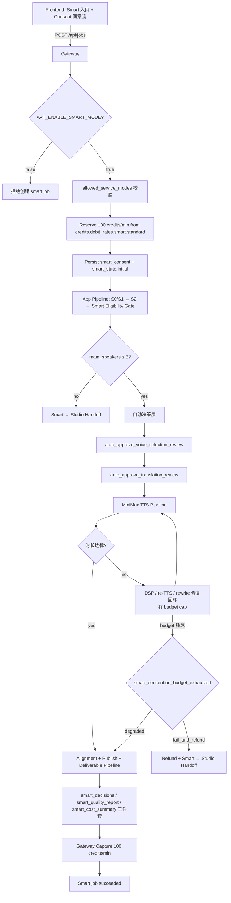

# 智能版 P2 MVP 实施计划

- 创建日期:2026-05-13
- 状态:实施草案,待审核
- 适用范围:P2 智能版 MVP 实施(代码 + 配置 + 灰度发布)
- 关联文档:
  - 主方案:[`docs/plans/2026-05-04-smart-auto-pipeline-plan.md`](2026-05-04-smart-auto-pipeline-plan.md)
  - P0 数据评估:[`docs/plans/2026-05-06-smart-shadow-eval-p0-results.md`](2026-05-06-smart-shadow-eval-p0-results.md) §16
  - P1 shadow 工具完成记录:[`docs/plans/2026-05-06-smart-shadow-sim-p1-done-note.md`](2026-05-06-smart-shadow-sim-p1-done-note.md)
  - c7 P2 decision 数据报告:`D:/Claude/temp/smart_shadow_sim/c7_remote_run/results_p2_decision/REPORT.md`

---

## 1. 实施前提确认

P0/P1 全闭环,数据全绿(c7 远端只读 rerun 2026-05-13,46 jobs):

| 维度 | 状态 |
|---|---|
| `post_phase_metered_jobs` ≥ 20 | ✅ **24/20** |
| §11 verdict | ✅ **PASS** |
| margin p10/p50/p90/p99 | ✅ 全正(14.97 / 55.37 / 247.92 / 350.59 RMB)|
| 负毛利 jobs | ✅ **0/46** |
| Bug 1 + FU#1 + FU#2 + Gate fix + Whisper fix | ✅ 全 in main + deployed + 实证 |
| Production `pricing_runtime.json` | ✅ 含 `smart.standard: 100` |

**100 credits/min 商业模型已 validated,商业风险下界可知。**

### 1.1 P2 launch 前还要做的两件软事(不阻塞设计,可并行)

1. **抽 5-10 个 `voice_selection_diff.studio_unknown_voices` 实例**查来源 —— 决定是否扩 Gap C v3 patterns(当前 unknown 50% 偏高)
2. **主动跑 1-2 个边界 case**(4+ speaker panel + >60min 单口长讲) —— 避免 launch 后第一次踩坑

---

## 2. 实施范围(P2 launch 必需)

### 2.1 In scope

- **Gateway 层**:`service_mode=smart` 创建 / reserve / capture / release / refund 全链路 + Kill switch + bucket priority
- **App pipeline 层**:Smart eligibility gate + 自动决策层(`auto_approve_voice_selection_review` / `auto_approve_translation_review`)+ 有界 TTS 时长修复回环
- **Sidecar 三件套**:`smart_decisions.jsonl` / `smart_quality_report.json` / `smart_cost_summary.json` emitter
- **Smart → Studio 接管契约**:`smart_state.status` / `handoff_stage` / `credits_policy`
- **付费 API 守卫**:AST + runtime gate(`smart_consent.auto_voice_clone` 等)
- **前端**:Smart 入口(flag gate)+ consent 同意流 + QA report 展示页
- **灰度发布机制**:`AVT_ENABLE_SMART_MODE` + admin allowlist + 监控指标

### 2.2 Out of scope(defer 到 P3 / P4 / P5)

- ❌ 多模态 verifier(P3 独立 program,已有 design doc 思路)
- ❌ Per-voice/provider retry estimation v3 calibration(spec §3.5,defer per P1 done note)
- ❌ 长视频 retry budget 收紧公式(P5 规模化)
- ❌ Automatic re-translate(P4 verifier-driven repair)
- ❌ Smart 用户 worst-case 内容兼容性"自动检测"(P5,先靠 speaker gate 拒绝 + content compliance 既有路径)

---

## 3. 架构概览



**关键不变量**(同主方案 §3,P2 实施必须守):

- TTS unit 仍是 `SemanticBlock` / `DubbingSegment`,不是字幕行
- Alignment 仍是 DSP first,rewrite/re-TTS 是 fallback
- 字幕 retiming 仍是数学/确定性逻辑,不交 LLM
- Gateway 是 plan/trial/pricing/entitlement/debit rate **唯一**事实源
- 本地开发/测试默认路径**不**引入真实付费 API 依赖

---

## 4. Schema 设计

### 4.1 service_mode = "smart" 注册

**新增 `service_mode` 枚举值**:`express` / `studio` / `smart`(已确认 in `pricing_runtime.json::credits.debit_rates`)

**`allowed_service_modes` 配置**(per plan):
- `free`: `["express"]`(不允许 smart)
- `plus`: `["express", "studio", "smart"]` ⚠️ TBD owner
- `pro`: `["express", "studio", "smart"]` ⚠️ TBD owner

### 4.2 `smart_consent` payload(创建 job 时持久化)

落在 `JobRecord.smart_consent` 或独立 `smart_consent.json`:

```json
{
  "service_mode": "smart",
  "smart_consent": {
    "auto_voice_clone": true,
    "auto_retranslate": false,
    "auto_retts": true,
    "auto_multimodal_verification": false,
    "fixed_rate_credits_per_minute": 100,
    "no_extra_charge_without_confirmation": true,
    "on_budget_exhausted": "degraded_delivery_with_report"
  }
}
```

**字段语义见主方案 §5.3**。`on_budget_exhausted` 枚举:`degraded_delivery_with_report`(默认) / `fail_and_refund`。

### 4.3 `smart_state` 接管契约

```json
{
  "smart_state": {
    "status": "running" | "downgraded_to_studio" | "fail_and_refunded" | "clone_blocked_waiting_retry" | "completed",
    "reason": "<machine_readable_code>",
    "handoff_stage": "<stage_id>",
    "credits_policy": "refund_full" | "refund_smart_apply_studio" | "capture_full"
  }
}
```

**为什么不直接改 `service_mode`**:保留审计事实,人工接管时能看到"这是个 smart 任务降级来的"。

### 4.4 `smart_decisions.jsonl`(append-only sidecar,project_dir/audit/ 下)

每条事件 schema:

```json
{
  "schema_version": 1,
  "event_id": "...",
  "decision_type": "speaker_gate" | "voice_clone" | "voice_selection_auto_approve" | "translation_auto_approve" | "tts_retry" | "split_proposal" | "downgrade_handoff" | "budget_exhausted",
  "decision": "approved" | "rejected" | "deferred",
  "evidence": { ... },
  "reason_code": "...",
  "auto_approved": true,
  "created_at": "...",
  "smart_decision_id": "..."
}
```

**纪律边界**(per 主方案 §12):
- 系统自动决策**不**混进 `user_edit_events.jsonl`
- 成本数据**不**混进 `smart_decisions.jsonl`(走 UsageMeter)
- JobEvent / UsageMeter / smart_decisions 三个 sink 各管各的

### 4.5 `smart_quality_report.json`(per 主方案 §12)

Smart 任务结束时由 emitter 生成,内容:
- 智能版适配检查结果
- 主要 speaker 数 + 每个 speaker 的克隆决策
- 自动批准的 review payload 摘要
- 每 segment 的 DSP / rewrite / re-TTS 次数
- 字幕音频同步状态(从现有 [output/subtitle_quality_report.json](src/modules/output/) 引用 `text_audio_drift_count` / drift block / Whisper aligned ratio)
- 内部成本估算汇总(从 UsageMeter 派生)
- 触发的成本闸和降级原因

### 4.6 `smart_cost_summary.json`(per 主方案 §12)

```json
{
  "llm_input_tokens": 0,
  "llm_output_tokens": 0,
  "tts_chars_total": 0,
  "tts_chars_wasted_in_retries": 0,
  "post_tts_resynth_billed_chars": 0,
  "post_edit_resynth_billed_chars": 0,
  "clone_calls": 0,
  "verifier_calls": 0,
  "whisper_blocks_total": 0,
  "whisper_blocks_aligned": 0,
  "whisper_cache_hits": 0,
  "internal_cost_usd_estimate": 0.0,
  "fixed_revenue_credits": 0,
  "gross_margin_estimate_pct": null
}
```

**`tts_chars_wasted_in_retries` 派生口径**(per 主方案 §12):

```python
tts_chars_wasted_in_retries = (
    UsageMeter.summarize()["post_tts_resynth_billed_chars"]
    + UsageMeter.summarize()["post_edit_resynth_billed_chars"]
)
```

---

## 5. Gateway 层改动

### 5.1 创建 smart job 端点

**新增 / 改 `POST /api/jobs` body**:接受 `service_mode: "smart"` + `smart_consent` 字段。

**校验顺序**(任一失败立即拒绝,不消耗 quota):
1. `AVT_ENABLE_SMART_MODE` env 为 `true`
2. 用户 plan 的 `allowed_service_modes` 含 `smart`
3. `smart_consent.fixed_rate_credits_per_minute == 100`(防客户端篡改)
4. `smart_consent.on_budget_exhausted ∈ {degraded_delivery_with_report, fail_and_refund}`
5. 用户余额 ≥ `100 * source_minutes`
6. 用户并发任务数未超 plan 限制

### 5.2 Credits 流(reserve / capture / release / refund)

**复用现有 `credits_service`**:

| 时机 | 操作 | 金额 |
|---|---|---|
| Job create | `reserve_credits(user_id, job_id, rate=100, minutes=src_min)` | `100 * src_min` |
| Job succeeded | `capture_credits(job_id)` | reserve 全额 |
| Job failed before clone/TTS | `release_credits(job_id)` | 全额释放 |
| Speaker gate 拒绝 + 用户选 Studio | `release_credits(job_id)` + 引导前端转 Studio | 全额释放 |
| `fail_and_refund` 触发(已 clone/TTS)| `release_credits(job_id)` + `record_usage_cost(job_id)` 写真实成本 | 释放 + 记录 |
| `degraded_delivery_with_report` 交付 | `capture_credits(job_id)` | reserve 全额 |
| 系统 bug 导致失败 | `release_credits` + incident 记录 | 全额 |

**Smart-to-Studio 升级降级费用规则**见主方案 §6.3 fail-safe ladder。

### 5.3 Kill switch:`AVT_ENABLE_SMART_MODE`

- **默认 `false`**(docker-compose.yml 默认值 + gateway settings 双保险)
- 关时 gateway `POST /api/jobs` 拒绝 `service_mode=smart`(返回 400 + `smart_disabled` 错误码)
- 关时前端不展示 Smart 入口(`/api/plan/discover` 返回的 `allowed_service_modes` 自动剔除 `smart`)
- 启用状态出现在 admin / startup diagnostics
- 紧急时可一键关闸,**已 in-flight 的 smart job 不中断**(优雅降级)

### 5.4 Bucket priority(Smart queue)

按主方案 §5.1:
```python
"smart": ["trial", "subscription", "topup", "free"]
```

Smart 在 Gateway queue 中独立 priority,**高于 Studio standard 但不盲目压过 Studio 高优先级任务**。具体数值在实施时定。

### 5.5 付费 API 守卫 hooks(Gateway 层)

新增中间件:任何到 voice-clone / smart job creation 端点的请求,**runtime 校验** `smart_consent.auto_voice_clone == true` 否则拒绝。

---

## 6. App (Pipeline) 改动

### 6.1 Smart eligibility gate(post-S2,pre-voice-selection)

新增 stage `smart_eligibility_gate`:
1. 读 S2 result + speaker structure profile
2. 计算"主要配音说话人数"(per 主方案 §2.3,排除观众/掌声/keep_original/低占比 < 0.10)
3. 若 > 3 → 触发 Smart → Studio handoff,写 `smart_state.status = "downgraded_to_studio"`,reason=`main_speaker_count_exceeded`
4. 若 ≤ 3 → 写 `smart_decisions.jsonl` 一条 `speaker_gate.approved`,继续

### 6.2 自动决策层

**复用 `ReviewStateManager`,不绕过 review state 结构**(同主方案 §6)。

#### 6.2.1 `auto_approve_voice_selection_review`

输入:S2 review result + speaker diff + Pass 3 voice profile + speaker structure profiles + voice clone sample stats
输出:`voice_selection_review.payload` + auto-approval

逻辑:
1. 每个 main speaker → 评估 clone 样本充足性(`min_sample_seconds >= 8s` 软标准 / `>= 10s` 优先)
2. 充足 → 调 MiniMax clone API(需 `smart_consent.auto_voice_clone == true` + voice library quota 检查)
3. 不充足 → 走 `voice_match_resolver` 选 preset 音色,标 `clone_skipped_reason`
4. 写 `voice_selection_review.payload` 设 `auto_approved: true`,持久化 `smart_decision_id`

**风险阻止**(per 主方案 §7.3):
- voice library quota 不足 → 暂停而非 fallback(防 MiniMax 烧钱)
- per-speaker clone 失败 ≤ 3 次,超 → 降 preset 或转 Studio

#### 6.2.2 `auto_approve_translation_review`

输入:translation result + glossary + speaker diff
输出:`translation_review.payload` + auto-approval

逻辑(per 主方案 §6.1):
1. 校验 glossary preservation rate ≥ 80%
2. 校验 speaker assignment 一致性
3. 校验 length budget ≤ 15% overflow(rewrite 一次后仍超 → 不可自动)
4. 校验 `final_spoken_text` 与 `subtitle_source_text` checksum
5. 内容合规命中(现有 path)→ 拒绝自动批准
6. 全部通过 → `auto_approved: true`,写 `smart_decisions.jsonl::translation_auto_approve.approved`
7. 任一失败 → `smart_state.status = "downgraded_to_studio"`,reason=`translation_auto_approve_failed`

### 6.3 TTS 时长修复回环

**复用现有 DSP 压缩 / re-TTS / segment_rewrite 路径**,加 **smart-only budget cap**:

| 资源 | 上限 |
|---|---|
| 单 segment re-TTS | 2 次 |
| 单 segment rewrite | 2 次 |
| 全任务 re-TTS 累计音频时长 | `min(1.5 * source_minutes, source_minutes + 30min)` |
| Per-task budget tracker | 在 UsageMeter 加 `smart_retry_budget_seconds_remaining` 字段 |

**触发逻辑**(per 主方案 §9):
- 全任务预算优先级 > 单 segment 配额
- 预算剩余 < 单段平均消耗 → 新申请拒绝
- 在途 retry 完成后停止申请

**budget 耗尽行为**(per `smart_consent.on_budget_exhausted`):
- `degraded_delivery_with_report` → 用当前最佳版本交付,QA report 标记风险段
- `fail_and_refund` → 进入 Smart → Studio handoff

### 6.4 Sidecar 三件套 emitter

**新增模块** `src/services/smart/sidecar_emitter.py`:
- 每个自动决策点写 `smart_decisions.jsonl`
- Job 终态时聚合写 `smart_quality_report.json` + `smart_cost_summary.json`
- 所有写入用现有 `_file_lock` 跨平台锁,append-only,不轮转

**关键不变量**:
- 不复用 `user_edit_events.jsonl`(per 主方案 §12,系统行为 ≠ 用户行为)
- 字幕一致性数据**引用**现有 `output/subtitle_quality_report.json`,不复制

### 6.5 Smart → Studio handoff

**触发条件**:speaker gate fail / translation auto-approve fail / clone blocked / budget exhausted + user 选 `fail_and_refund` / 系统失败

**实现**(per 主方案 §6.3):
1. 写 `smart_state.status = "downgraded_to_studio"` + `handoff_stage` + `reason`
2. **保留** `service_mode = "smart"`(审计事实,不改)
3. 已生成的 S2 / translation / voice selection payload 保留,标 `auto_approved` flag
4. 按 fail-safe ladder 计费(主方案 §6.3 表格)
5. 接管时 UI 重置当前 active review stage,引导用户人工确认

---

## 7. Frontend 改动

### 7.1 Smart 入口(`/api/plan/discover` 驱动 + flag gate)

- 创建任务页:`service_mode` 选项含 Smart(plan 允许 + AVT_ENABLE_SMART_MODE on 才显示)
- Smart 项展示:**固定 100 credits/min** + "自动配音 + 自动审核 + 自动质检报告"

### 7.2 Consent 同意流

新页面或 modal:用户选 Smart 时显式展示并要 acknowledge:

- 智能版自动调用高质量 TTS / 自动克隆音色 / 自动重试
- 多模态 verifier 属后续增强,不是 MVP 承诺
- **暂不支持 3 位以上主要配音说话人**
- 预算耗尽时选择:`degraded_delivery_with_report`(默认) / `fail_and_refund`
- 系统识别不适合 Smart 时会降级/退款/转 Studio

确认后 `smart_consent` payload 一起 POST。

### 7.3 Smart QA report 展示页

Job succeeded 后 workspace 加 tab "智能质检报告":
- 主要 speaker 数 + 克隆决策
- 每 segment 修复次数(DSP / rewrite / re-TTS)
- 字幕音频一致性(从 smart_quality_report.json + 现有 subtitle_quality_report.json 派生)
- 预设音色降级段(若有)
- 内部成本估算 + 毛利估算

### 7.4 Smart → Studio 转接 UX

降级时 workspace 上方红条横幅:
- "智能版自动流程已停止,原因: <reason>"
- 按钮:"继续人工编辑"(进 Studio 标准 post-S2 review)/ "取消并退款"

---

## 8. 测试策略

### 8.1 Fake providers(per 主方案 §15 P2)

**新增 `tests/fakes/`**:
- `FakeTTSProvider`(可控音频时长 / 失败率 / 延迟)
- `FakeCloneProvider`(可控成功率 / quota)
- `InMemoryUsageMeter`(成本回放)

本地开发 / CI 默认用这些,**禁止真实付费 API 调用**。

### 8.2 AST 守卫(per 主方案 §5.4)

新增 `tests/test_smart_paid_api_guards.py`:
- Voice clone 前必查 `smart_consent.auto_voice_clone == true`
- Retry loop 受 `MAX_RETRY` / `MAX_RETTS` / 总预算常量约束
- `except Exception:` 分支**不得**自动调付费 API
- `AVT_ENABLE_SMART_MODE != true` 时不允许创建 smart job

按 Phase 1 / Phase 2 守卫模式:AST 字面量扫描 + import graph 检查。

### 8.3 单元测试

- `smart_eligibility_gate` 各 speaker count 边界
- `auto_approve_voice_selection_review` 充足/不足 clone 样本
- `auto_approve_translation_review` 各拒绝条件
- TTS budget cap 计算
- Sidecar emitter schema 一致性
- credits flow:reserve → capture / release / refund 各路径

### 8.4 集成测试

- 完整 fake pipeline:创建 → S2 → eligibility → auto-review → fake TTS → publish → sidecar 写入 → capture
- 降级路径:speaker > 3 → handoff
- 预算耗尽路径:budget exhausted + `degraded_delivery_with_report` / `fail_and_refund`
- Kill switch:`AVT_ENABLE_SMART_MODE=false` 拒绝创建

### 8.5 烟雾测试(fake provider + 真 pipeline)

针对 c7 P2 decision 已 audit 过的 5-10 个 production jobs,用 fake provider 跑 P2 完整流程,验证:
- smart_decisions.jsonl 字段完整
- smart_quality_report.json 数值合理
- smart_cost_summary.json 与 InMemoryUsageMeter 一致
- 完全不调付费 API

---

## 9. 灰度发布

### 9.1 阶段 0:dev only(1-2 周)

- `AVT_ENABLE_SMART_MODE=false`(production)+ `=true`(dev/staging)
- 内部测试:owner + 1-2 admin 跑 5-10 个 fake-provider 验证
- 监控 dashboard 配置 + 告警阈值定义

**升级判据**:
- 集成测试 + 烟雾测试全绿
- Fake-provider 100% pipeline 跑通
- Sidecar 三件套数据完整可读
- Kill switch 测试通过

### 9.2 阶段 1:1-2 beta 用户(1 周)

- production `AVT_ENABLE_SMART_MODE=true`
- 但 `allowed_service_modes` 只对 admin allowlist 中的 1-2 个用户加 smart
- 每天人工 review 这些用户的 smart_decisions.jsonl + smart_quality_report
- 跑真实付费 API,真扣 100 credits/min

**升级判据**:
- 至少 5 个真实 smart job 跑完(每个用户 2-3 个)
- 0 个 sidecar 异常 / 0 个 credits 误扣
- margin 实测与 P0/P1 预测在 ±20% 内
- 用户反馈"自动质检报告可读"

### 9.3 阶段 2:10-20 beta 用户(2 周)

- allowlist 扩大
- 监控:每日聚合 smart_quality_report,看降级率 / 预设音色率 / `clone_skipped_reason` 分布
- 每周复盘:smart 成本毛利 / 用户进入 Studio 精修率 / 退款率

**升级判据**:
- 50+ 真实 smart job 完成
- 降级率 < 15%
- 退款率 < 5%
- 毛利率(实测)> 30%

### 9.4 阶段 3:全开

- `allowed_service_modes` per plan 默认含 smart(Plus/Pro)
- 持续监控 + 自动告警

### 9.5 监控指标(每个阶段都要看)

| 指标 | 告警阈值 |
|---|---|
| Smart job 失败率 | > 10% |
| 平均降级率 | > 20% |
| margin p10 RMB | < 5 RMB |
| 单一 user 单日 smart job > | 10 |
| voice_clone API 失败率 | > 15% |
| MiniMax quota 耗尽 | 任一发生 |
| Sidecar 写入失败 | 任一发生 |

### 9.6 Kill switch 触发条件(admin 一键 stop)

- 监控告警连续 2 次触发
- 单日 margin 转负
- 用户投诉 > 3 起 / 周
- 任何安全/合规事件

触发后:`AVT_ENABLE_SMART_MODE=false`,**已 in-flight 任务跑完不中断**,新任务全部拒绝。

### 9.7 P2 → P3 升级判据

P3 启动条件(独立 program,主方案 §11):
- P2 全开 4+ 周
- 累计 200+ smart 真实 job
- 至少 50 个 effective audit event(post-edit committed 后 marked_event_ids 非空)
- verifier benchmark 数据集已构造(用 P0 §16.5 链路落地的 audit data)

---

## 10. 实施分阶段时间线

| 阶段 | 工作 | 估时 |
|---|---|---|
| **P2-alpha-design**(本文档)| 实施计划 + schema 锁定 + 接口契约 | 1-2 天(本周内)|
| **P2-alpha-code**(后端骨架)| Gateway smart endpoint + smart_eligibility_gate + sidecar emitter + fake providers + 测试 | 2-3 周 |
| **P2-beta-integration**(后端集成)| 自动决策层 + budget cap + handoff + Studio post-edit 兼容 | 1-2 周 |
| **P2-beta-frontend**(前端)| Smart 入口 + consent + QA report 展示 + 降级 UX | 1-2 周 |
| **P2-launch-prep**(灰度准备)| 监控 dashboard + 告警 + admin allowlist + kill switch 测试 | 1 周 |
| **P2-launch-α**(阶段 1)| 1-2 beta 用户 | 1 周 |
| **P2-launch-β**(阶段 2)| 10-20 beta 用户 | 2 周 |
| **P2-GA**(阶段 3)| 全开 | — |

**总:~7-10 周到 GA**。

---

## 11. 风险 + 缓解

| 风险 | 缓解 |
|---|---|
| 单 smart job 跑超 cost cap | budget tracker + retry cap(§6.3)+ 预算优先级单段配额 |
| 自动 clone 误烧 quota | voice library quota 监控 + per-speaker 重试上限(§6.2.1 + 主方案 §7.3)|
| 自动审核误批 | 多重 gate(glossary / speaker / length / checksum / 合规)+ 任一 fail 降级 |
| 灰度阶段单一 user 流量集中 | 监控告警 "单一 user 单日 smart job > 10",触发限流 |
| voice_id unknown 50% 影响 Smart 决策 | P2-alpha 前先抽 5-10 实例查来源;若是真未知,Smart simulator 在这些 jobs 给 INCONCLUSIVE,不阻塞 launch |
| 内容多样性盲区(4+ speaker / 长单口) | P2-alpha 前主动跑 2-3 个边界 case 补样本 |
| Phase D Whisper 不在所有路径跑 | 已确认是 by-design;Smart 不依赖 Whisper precision,只需 Phase A/B drift gate |
| Sidecar 写入失败导致审计盲区 | 监控告警(§9.5)+ Smart pipeline 在 emitter fail 时**继续交付**(emitter 错误不应阻塞用户)|

---

## 12. 实施前置(开工前必须完成)

- [ ] **抽 5-10 个 `voice_selection_diff.studio_unknown_voices` 实例**人工核对来源
- [ ] **主动跑 1-2 个 4+ speaker panel + 1 个 >60min 单口长讲**补内容多样性
- [ ] **运维 standby**:确认 `AVT_ENABLE_SMART_MODE` 可远程一键切换,kill switch 链路 < 5min 生效
- [ ] **(可选)cost_model 真实数据 calibration** —— owner 已同意 P2 试运行后再做
- [ ] **owner 拍板:`plus` plan 是否允许 smart**(`allowed_service_modes`)

---

## 13. 决策摘要

### 13.1 已通过 P0/P1 数据决策

- 智能版商业模型(100 credits/min)成立(p10 = 14.97 RMB)
- Smart MVP 不依赖独立多模态 verifier
- TTS 时长修复回环:DSP / re-TTS / segment rewrite(无 re-translate)
- speaker gate ≤ 3 主要说话人
- 自动 clone 受 `smart_consent.auto_voice_clone` 守卫 + voice library quota 监控
- 预算耗尽默认 `degraded_delivery_with_report`,用户可选 `fail_and_refund`
- Smart → Studio 接管费用按 fail-safe ladder(主方案 §6.3)

### 13.2 P2 实施需要 owner 拍板的事

1. `plus` plan 是否允许 smart(影响首批 beta 流量大小)
2. Smart bucket priority 数值(高于 Studio standard 但具体值)
3. 阶段 1 / 2 / 3 灰度速率(默认按本文档 §9.2/§9.3 估计)
4. `target_gross_margin` 是否在 P2 launch 后立刻 calibrate cost_model,还是等 4 周后

### 13.3 暂时不动的事

- Production `pricing_runtime.json::cost_model` 仍 code defaults(per owner 同意)
- Production `admin_settings.json::whisper_alignment_trigger = "deliverable"`(by-design)
- 多模态 verifier(P3 program)
- Per-voice retry estimation v3 calibration(P5 数据驱动)

---

## 14. 完成判据

P2 launch GA 标准:

- [ ] All Section §2.1 in-scope 项实施 + 测试 + code review 通过
- [ ] 灰度阶段 3 升级判据(§9.4)达成
- [ ] Smart QA 报告用户反馈"可读 + 可信"
- [ ] 监控 dashboard 全部指标可视化
- [ ] Kill switch 一键切换在 < 5min 生效
- [ ] 文档:实施回顾 + 运维手册 + 用户帮助

完成后:GA 公告 + smart-auto-pipeline-plan §15 P2 段标 ✅ DONE。
