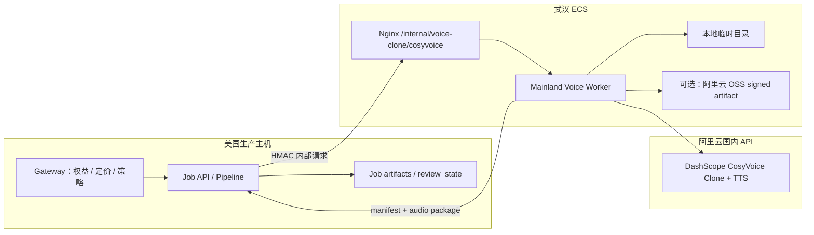
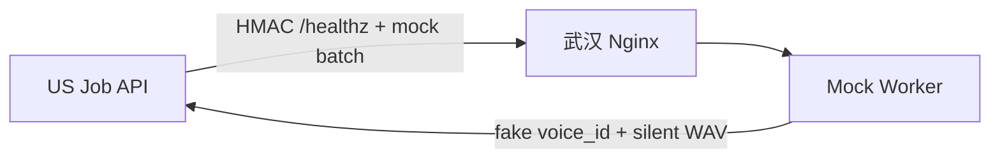

# CosyVoice 国内中转 / Worker 方案

日期：2026-05-24

## 目标

使用现有阿里云武汉 ECS 作为国内 `mainland voice worker`，承接 CosyVoice 国内版声音复刻和 TTS 合成，让美国生产主机不需要直接访问国内 DashScope/CosyVoice 端点，也不需要持有国内 DashScope API Key。

本方案是阶段化方案。第一目标是 POC 和管理员灰度，不是立刻替换当前 MiniMax 克隆主路径。

## 结论摘要

- 可以使用武汉 ECS 做 CosyVoice 国内 worker，但必须先验证阿里云账号是否有 CosyVoice 国内声音复刻权限。
- Worker 应该暴露窄 API，不做透明代理，不让美国主机认识 DashScope 国内接口。
- CosyVoice 克隆音色必须保存 `target_model`，后续 TTS 必须用同一模型。
- 5 Mbps 公网带宽是 Phase 3 的真实瓶颈，不只是流量费问题；Phase 0 必须实测 US 到武汉下载速度。
- 当前先做 Phase -1、Phase 0、Phase 1；不要向普通用户开放。

## 已知环境

### 武汉 ECS

- 公网 IP：`8.148.83.128`
- 地域：华中 1，武汉本地地域
- 系统：Ubuntu 24.04 64 位
- 规格：`ecs.e-c1m2.large`，2 vCPU，4 GiB 内存
- 系统盘：约 49 GiB，剩余约 36 GiB
- 数据盘：`/data` 约 196 GiB，剩余约 186 GiB
- 公网带宽：峰值 5 Mbps
- 带宽计费方式：按使用流量
- 控制台显示公网出网流量价格：`0.800 元/GB`
- 到期时间：2026-06-02 23:59:59，需要续费后才能作为生产依赖

### 当前进程和端口

已有服务：

- Docker：`atlas-app`、`atlas-postgres`
- Hermes dashboard：`127.0.0.1:9119`
- Hermes web UI：`127.0.0.1:8787`
- xray：`127.0.0.1:18080`、`127.0.0.1:18081`
- Nginx：公网 `80`，当前代理到 `127.0.0.1:8790`
- SSH：公网 `22`

避免占用：

- `8787`
- `8790`
- `9119`
- `5432`
- `18080`
- `18081`

建议 worker 监听：

- 本机端口：`127.0.0.1:8791`
- Nginx 路径：`/internal/voice-clone/cosyvoice/`
- 部署目录：`/opt/aivideotrans-mainland-worker/current`
- 数据目录：`/data/aivideotrans-mainland-worker`

目录和路由命名故意不写死 `cosyvoice-worker`，为未来豆包 ICL 2.0 或其他国内限定 provider 留扩展空间。

### 已测连通性

- 武汉 ECS 能访问 `https://dashscope.aliyuncs.com`。
- 美国生产主机能访问 `8.148.83.128:80` 和 `8.148.83.128:22`。
- `443` 未开放。
- `8789`、`8791` 等自定义公网端口未开放。
- 美国生产主机 IPv4 出口：`5.78.122.220`。

## 官方成本依据

阿里云 ECS 公网带宽只收公网出网流量，公网入网免费。

参考：

- ECS 公网带宽计费：https://help.aliyun.com/zh/ecs/public-bandwidth
- ECS 网络带宽机制：https://help.aliyun.com/zh/ecs/user-guide/network-bandwidth/
- CDT 公网流量价格：https://help.aliyun.com/zh/cdt/internet-data-transfers/

对本方案而言，主要计费流量是：

- 武汉 worker 把生成后的音频包传回美国主机。

通常不计费或很小：

- 美国主机把任务、文本、样本传入武汉 ECS：入网免费。
- 武汉 ECS 从 DashScope/OSS 下载结果：对 ECS 是入网，免费。
- API JSON 请求体：体积很小。

## 5 Mbps 带宽瓶颈

5 Mbps 不是费用问题，而是吞吐瓶颈。

换算：

- 5 Mbps = 0.625 MB/s
- 约 37.5 MB/min

粗略估算：

- 一个 10 分钟视频的 WAV 结果包可能是 20-30 MB。
- 顺序回传可能需要 30-50 秒。
- 两个任务并发回传会互相挤占带宽。
- 按使用流量模式下，5 Mbps 是出网峰值限制，不是稳定吞吐承诺。

Phase 0 必须实测：

- 从美国主机下载武汉 worker 测试文件，至少测 10 MB、50 MB、100 MB。
- 记录平均速度、P95 耗时、失败率。
- 如果单任务 30 MB 回传超过 60 秒，Phase 3 必须启用 OSS artifact 路径或升级带宽。

### Artifact 回传方案

默认路径：

```text
武汉 worker -> Nginx artifact URL -> 美国主机下载
```

适合：

- POC
- 小批量
- 单任务低并发

备选路径：

```text
武汉 worker -> 阿里云 OSS 临时对象 -> 美国主机用 signed URL 下载
```

优势：

- 回传不占 ECS 5 Mbps 出网瓶颈。
- OSS 带宽和可用性更适合大文件下载。

代价：

- OSS 公网出网也会产生费用。
- 需要额外管理 bucket、生命周期、签名 URL、权限和审计。

决策规则：

- Phase 0 下载实测良好，先用 ECS Nginx artifact。
- Phase 3 单任务回传超过 60 秒，切到 OSS artifact。
- 如果灰度阶段月出网持续超过 50 GB，再评估固定带宽或 OSS/CDT 成本。

## CosyVoice 产品约束

- CosyVoice 声音复刻能力依赖国内地域能力。
- 海外 DashScope endpoint 不足以覆盖 clone/design path。
- 克隆音色与 `target_model` 绑定，后续合成必须使用兼容模型。
- 美国主机不能假设自己可以直接用 CosyVoice 克隆音色合成。

参考：

- CosyVoice clone API：https://www.alibabacloud.com/help/en/model-studio/cosyvoice-clone-design-api
- CosyVoice SDK / 计费参考：https://help.aliyun.com/zh/model-studio/cosyvoice-ios-sdk

## 为什么选择窄 API Worker

不采用透明 HTTP 代理：

- 代理面过宽，容易把武汉 ECS 变成 DashScope 通用出口。
- API Key、请求体和 provider 细节会穿透到美国主机。
- 难以做按 job / speaker 的审计、重试和幂等。

不采用 WireGuard 隧道让美国主机直连国内 DashScope：

- 美国主机会直接认识国内 provider endpoint，破坏部署边界。
- 失败路径、付费调用和密钥管理更难收敛。
- 未来引入其他国内 provider 时会继续扩散复杂度。

不在武汉部署完整 pipeline：

- 会把 SemanticBlock、DSP 对齐、字幕 retiming、剪映草稿生成等主流程分裂到另一台机器。
- 破坏当前架构不变量：TTS 单元仍应由主 pipeline 决定，alignment 仍应 DSP-first，draft 输出仍由主流程生成。

因此 worker 只做：

- clone
- TTS batch
- artifact package
- provider deletion
- provider audit metadata

不做：

- 翻译
- 文本改写
- 说话人决策
- subtitle retiming
- DSP alignment
- Jianying draft generation

## 总体架构



Phase 0/1 mock-only 简图：



## Worker API

所有接口都是内部接口。美国主机每次请求必须签名。

通用请求头：

- `X-AVT-Key-Id`：HMAC key id
- `X-AVT-Timestamp`：Unix seconds
- `X-AVT-Nonce`：随机 UUID
- `X-AVT-Signature`：HMAC-SHA256
- `X-AVT-Job-Id`：job id

签名内容：

```text
method + "\n" + path + "\n" + timestamp + "\n" + nonce + "\n" + key_id + "\n" + sha256(body)
```

Worker 必须拒绝：

- 未知或已过期 `X-AVT-Key-Id`
- 时间偏移超过 300 秒
- 15 分钟内重复 nonce
- body 超过上限
- 未知调用方
- 缺少 provider 配置
- 未启用对应 provider

Worker 端维护 `{key_id: hmac_secret}` 表。旧 key 标记 `deprecated_at` 后允许短期并存，超过轮换窗口自动剔除。

### `GET /healthz`

健康检查，不触发付费 API。

响应：

```json
{
  "ok": true,
  "worker": "aivideotrans-mainland-worker",
  "region": "cn-wuhan",
  "providers": {
    "cosyvoice": {
      "configured": true,
      "mode": "mock"
    }
  }
}
```

### `POST /cosyvoice/clone`

用途：根据用户显式确认的样本创建 CosyVoice 自定义音色。

请求：

```json
{
  "job_id": "job_xxx",
  "user_id": "user_xxx",
  "speaker_id": "speaker_a",
  "speaker_name": "speaker_a",
  "target_model": "cosyvoice-v3.5-flash",
  "sample": {
    "kind": "download_url",
    "url": "https://us-host/internal/signed-artifact/...",
    "sha256": "..."
  },
  "source_segments": [12, 18, 19],
  "consent": {
    "voice_clone_confirmed": true,
    "confirmed_at": "2026-05-24T00:00:00Z"
  }
}
```

响应：

```json
{
  "ok": true,
  "voice_id": "cosyvoice_custom_xxx",
  "provider": "cosyvoice_voice_clone",
  "tts_provider": "cosyvoice",
  "target_model": "cosyvoice-v3.5-flash",
  "region_constraint": "mainland_only",
  "requires_worker": true,
  "platform": "dashscope_mainland",
  "sample_sha256": "...",
  "created_at": "2026-05-24T00:00:00Z"
}
```

说明：

- Worker 下载用户授权样本，必要时上传到阿里云 OSS 生成短期 signed URL。
- Clone 成功或失败后，默认删除原始样本。
- 不允许自动 fallback 到 MiniMax clone。

### `POST /cosyvoice/synthesize-batch`

用途：合成一个 job 或一个 speaker 的 CosyVoice 片段。

这个 endpoint 必须支持 `len(segments) == 1`。Studio post-edit 的单段 `regenerate-tts` 也走同一个 endpoint，不另开 `/synthesize-one`。

请求：

```json
{
  "job_id": "job_xxx",
  "target_model": "cosyvoice-v3.5-flash",
  "audio_format": "wav",
  "segments": [
    {
      "segment_id": 1,
      "speaker_id": "speaker_a",
      "voice_id": "cosyvoice_custom_xxx",
      "text": "需要合成的中文文本",
      "speech_rate": 1.0,
      "target_duration_ms": 3200,
      "text_hash": "..."
    }
  ]
}
```

响应：

```json
{
  "ok": true,
  "job_id": "job_xxx",
  "target_model": "cosyvoice-v3.5-flash",
  "segments": [
    {
      "segment_id": 1,
      "speaker_id": "speaker_a",
      "voice_id": "cosyvoice_custom_xxx",
      "audio_path": "segments/segment_001_speaker_a.wav",
      "duration_ms": 3180,
      "billed_chars": 24,
      "sha256": "..."
    }
  ],
  "package": {
    "kind": "zip",
    "download_url": "http://8.148.83.128/internal/voice-clone/cosyvoice/artifacts/...",
    "sha256": "...",
    "expires_at": "2026-05-24T01:00:00Z"
  }
}
```

小批量 POC 可以返回 base64；生产路径优先 artifact package。

`text_hash` 规范：

- `text_hash = sha256(text.encode("utf-8")).hexdigest()`
- 不做 Unicode normalize。
- 大小写敏感。
- Worker 必须根据收到的 `text` 重新计算；如果请求里带了 `text_hash`，两者不一致则拒绝。

### `DELETE /cosyvoice/voices/{voice_id}`

用途：删除 CosyVoice 自定义音色。

请求：

```json
{
  "job_id": "job_xxx",
  "user_id": "user_xxx",
  "reason": "user_deleted"
}
```

响应：

```json
{
  "ok": true,
  "voice_id": "cosyvoice_custom_xxx",
  "deleted_at": "2026-05-24T00:00:00Z"
}
```

删除失败时要写 retryable tombstone，不能静默丢失。

## 分发决策字段

必须在 voice metadata 中显式保存 worker 相关字段。

推荐字段：

```json
{
  "provider": "cosyvoice_voice_clone",
  "tts_provider": "cosyvoice",
  "platform": "dashscope_mainland",
  "target_model": "cosyvoice-v3.5-flash",
  "region_constraint": "mainland_only",
  "requires_worker": true,
  "worker_provider": "cosyvoice",
  "worker_region": "cn-wuhan"
}
```

字段语义：

- `region_constraint`: `"overseas_ok"` 或 `"mainland_only"`
- `requires_worker`: 由 `region_constraint == "mainland_only"` 派生，也可落库用于快速判断
- `target_model`: clone 和 TTS 的兼容模型
- `worker_provider`：当前是 `cosyvoice`，未来可扩展 `doubao`
- `worker_provider` / `worker_region` 目前是 metadata；未来多 provider / 多 worker 部署时用于 dispatch。

运行时 fork 规则：

```python
if voice.requires_worker:
    use_mainland_worker_client()
else:
    use_direct_provider()
```

不要只看 `provider == "cosyvoice_voice_clone"`。未来可能存在非克隆但 mainland-only 的音色，也可能有其他 provider 的国内限定资源。

## 与现有项目集成

### Gateway

Gateway 仍是计划、价格、试用、权益的唯一事实来源。

新增管理员配置：

- `mainland_voice_worker_enabled`
- `mainland_voice_worker_url`
- `mainland_voice_worker_hmac_key_id`
- `cosyvoice_clone_worker_enabled`
- `cosyvoice_clone_target_model`
- `cosyvoice_clone_allowed_plan_codes`
- `cosyvoice_clone_max_minutes_per_job`
- `cosyvoice_clone_max_speakers_per_job`

开关语义：

- `enabled`：管理员人工开关，持久化在 admin settings。
- `available`：运行时自动探测状态，由 worker 心跳和错误率派生。
- 生效条件：`enabled && available`。

管理员只修改 `enabled`。`available` 不应由管理员手动改写。

定价配置：

- CosyVoice clone 与 TTS 扣点仍从 Gateway runtime pricing 下发。
- 前端不能硬编码 provider 价格。
- CosyVoice clone 即使 provider 创建免费，也不能在产品上直接当作免费能力暴露。

### 用户音色库

CosyVoice clone 应与 MiniMax clone 分开记录。

推荐：

- 独立 quota 字段，例如 `cosyvoice_clone_voices`。
- 不占用现有 MiniMax clone quota。

理由：

- MiniMax 有音色创建成本。
- CosyVoice 当前创建自定义音色免费，但 TTS 按字符收费。
- 两者成本结构不同，混用 quota 会干扰用户行为和成本分析。

示例记录：

```json
{
  "provider": "cosyvoice_voice_clone",
  "tts_provider": "cosyvoice",
  "platform": "dashscope_mainland",
  "voice_id": "cosyvoice_custom_xxx",
  "target_model": "cosyvoice-v3.5-flash",
  "region_constraint": "mainland_only",
  "requires_worker": true,
  "worker_region": "cn-wuhan",
  "source_speaker_id": "speaker_a",
  "source_job_id": "job_xxx",
  "clone_sample_seconds": 18.2,
  "clone_sample_segment_ids": [12, 18, 19]
}
```

### Voice Selection UI

当前 Studio voice selection 已有 provider tab，且通过 `supports_clone` 控制是否显示克隆按钮。

后端准备好之前：

- CosyVoice `supports_clone` 继续为 false。

后端准备好之后：

- 只有当 `cosyvoice_clone_worker_enabled == true` 且用户权益允许时，CosyVoice 才返回 `supports_clone=true`。
- UI 文案必须说明这是国内 worker 复刻能力，用户需要显式确认。
- 不允许自动触发付费 clone。
- CosyVoice Tab 内是否新增“我的克隆音色”分组，留到 Phase 4 前单独做 UI plan，本方案不展开。

### Pipeline

保持现有架构不变量：

- TTS 单元是 SemanticBlock，不是 subtitle line。
- Alignment 仍 DSP-first。
- Subtitle retiming 仍是确定性数学逻辑。
- 主产物仍是 Jianying draft。

Pipeline 行为：

- 已选 CosyVoice cloned voice 且 `requires_worker=true` 时，TTS 走 mainland worker。
- 其他 CosyVoice 公共音色继续走现有 provider，除非 metadata 表示 mainland-only。
- Worker 返回 WAV 和 duration，主 pipeline 继续创建标准 `TTSResult`。
- 后续 alignment、retry、retiming、draft generation 不放到 worker。

### Studio Post-Edit / Regenerate TTS

单段重配音也必须兼容 worker。

规则：

- `POST /job-api/jobs/{id}/segments/{sid}/regenerate-tts` 判断该 segment 的 voice metadata。
- 如果 `requires_worker=true`，调用 `/cosyvoice/synthesize-batch`，其中 `segments` 只有 1 个元素。
- 不新增 `/synthesize-one`，避免两套重试和审计路径。
- 不允许 worker 不可用时静默切到 MiniMax 或其他 provider。

## Secret Management

武汉 ECS 是 DashScope 国内 API Key 的唯一放置点。

### 注入方式

推荐二选一：

- Docker Compose：`.env` 文件 + bind mount，只给 worker 容器读取。
- systemd：`EnvironmentFile=/etc/aivideotrans-mainland-worker/worker.env`。

HMAC secret 是双边 secret，需要美国 Gateway 和武汉 worker 同时持有。

初期采用人工同步：

- 美国侧写入 Gateway 运行环境，例如 `gateway/.env` 或生产 env secret。
- 武汉侧写入 `/etc/aivideotrans-mainland-worker/worker.env`。
- 不引入“Gateway 自动下发 secret 到 worker”的通道，避免扩大密钥面。

### 文件权限

要求：

- secret 文件 owner 为 root。
- 权限 `600`。
- worker 进程只读取必要环境变量。
- 不把 secret 写入镜像、git、日志、异常响应或健康检查。

### Key 轮换

建议：

- DashScope API Key：至少 90 天轮换一次。
- Worker HMAC secret：至少 90 天轮换一次。
- 支持 key id：`X-AVT-Key-Id`，允许新旧 key 短期并存。

Docker Compose 路线下，修改 `worker.env` 后必须重新创建 worker 容器，例如 `docker compose up -d worker`；不要只做 `docker restart`，否则 env 文件变更不会重新加载。

### 入侵应急

如果武汉 ECS 疑似泄漏：

1. 立即禁用 `mainland_voice_worker_enabled`。
2. 撤销 DashScope API Key。
3. 轮换 worker HMAC secret。
4. 删除 worker 临时 artifact。
5. 导出并封存 audit log。
6. 重新部署 worker 或更换 ECS。
7. 人工复核所有 provider voice deletion 状态。

## Retry 和付费 API 上限

所有会触发 provider 付费或资源创建的调用必须有硬上限。

Clone：

- 每次用户确认最多触发 1 次 clone provider call。
- 网络不确定错误可由用户再次显式点击重试。
- 后端不能自动重复 clone 超过 1 次。

TTS 单段：

- 单段 provider TTS 最多 3 次。
- 退避：1s -> 5s -> 15s。
- 三次失败后该 segment 标记失败。

Batch：

- batch 整体最多重提 1 次。
- batch 重提必须跳过已经成功且 sha256 校验通过的 segment。
- 幂等键：`job_id + segment_id + voice_id + target_model + text_hash + speech_rate`。

Worker 下载 artifact：

- 美国主机下载 package 最多 3 次。
- 失败后任务进入可恢复状态，不重新触发 provider TTS，除非缺失 segment 明确需要补合成。

禁止：

- 无限 loop。
- provider 失败后静默切换其他付费 provider。
- worker 不可用时自动触发 MiniMax clone。

## Worker Degraded Mode

Worker 不可用时需要显式降级。

判定：

- `/healthz` 连续 3 次失败，或
- 最近 5 分钟 TTS batch 失败率超过阈值，或
- Nginx 502/504 持续出现。

降级行为：

- Gateway 将 `cosyvoice_clone_worker_available=false` 写入运行时状态。
- `available` 由 worker 心跳自动维护，admin 不应手动改。
- Voice selection 隐藏 CosyVoice clone 入口，但保留公共音色 TTS。
- 已经选择 CosyVoice cloned voice 的任务进入 `awaiting_worker` 或 review pause。
- 不自动切换到 MiniMax。
- 管理员可手动改 provider 并让用户确认后继续。

恢复：

- `/healthz` 连续 3 次成功。
- 一次 mock synthesize 成功。
- 管理员重新启用灰度。

## 审计日志

Worker 本地写 JSONL：

- 路径：`/data/aivideotrans-mainland-worker/audit/worker-audit.jsonl`
- 权限：worker 可写，非公开。
- 内容只写 metadata，不写 raw audio，不写 API key。

字段：

- `event_id`
- `request_id`
- `job_id`
- `user_id`
- `speaker_id`
- `segment_id`（Phase 4.0b §A 新增：synthesize_segment 路径按段定位）
- `voice_id`
- `operation`
- `provider`
- `target_model`
- `provider_request_id`
- `status`
- `duration_ms`
- `billed_chars`
- `audio_seconds`
- `artifact_bytes`
- `error_code`
- `created_at`

同步策略：

- Worker 本地 JSONL append 是主记录。
- 每小时把 metadata batch 同步回美国主机，便于运营排查。
- raw audio 不做日志同步。
- artifact 走短 TTL，过期删除。

## 数据流

### Clone Flow

1. 用户在 Studio voice selection 选择 CosyVoice。
2. Gateway 判断用户权益和 `cosyvoice_clone_worker_enabled`。
3. UI 显示克隆入口。
4. 用户选择样本片段并显式确认。
5. 美国 Job API 提取并拼接授权样本。
6. 美国 Job API 调用武汉 worker `/cosyvoice/clone`。
7. Worker 必要时上传样本到 OSS signed URL。
8. Worker 调用 DashScope clone/design API。
9. Worker 返回 `voice_id`、`target_model`、`requires_worker`。
10. Gateway 写入用户音色库。
11. Voice selection 将该 speaker 标记为 CosyVoice cloned voice。

### TTS Flow

1. Pipeline 已生成 SemanticBlock / DubbingSegment。
2. 按 `voice_id + target_model + requires_worker` 分组。
3. Worker-required 的 CosyVoice 片段调用 `/cosyvoice/synthesize-batch`。
4. Worker 调用国内 CosyVoice TTS。
5. Worker 生成音频 package 和 manifest。
6. 美国主机下载 package。
7. Pipeline hydrate 标准 `TTSResult`。
8. 继续 DSP alignment、subtitle retiming、Jianying draft generation。

## Phase -1：账号能力验证

这是编码前置条件，不通过就不写 worker 代码。

步骤：

- 登录阿里云国内控制台。
- 确认 DashScope / 百炼账号已开通 CosyVoice clone/design 能力。
- 确认目标模型可用：优先 `cosyvoice-v3.5-flash`。
- 使用官方 curl 或 SDK 示例跑一次测试 clone。
- 获取测试 `voice_id`。
- 使用同一 `target_model` 合成一句短文本。
- 删除测试 voice。
- 查看账单确认真实计费行为。

通过标准：

- Clone API 可调用。
- TTS 可调用。
- 删除可调用。
- 账单与预期一致。
- 账号无额外人工审核或白名单阻塞。

## Rollout Plan

### Phase 0：连通性和 Worker Skeleton

- 创建 worker skeleton。
- 只实现 `/healthz`。
- 配置 Nginx 路径。
- 配置 HMAC 校验。
- 从美国主机调用 `/healthz`。
- 实测 10 MB、50 MB、100 MB artifact 下载速度。
- 不调用 DashScope。

通过标准：

- 美国主机能稳定访问 worker。
- HMAC 校验生效。
- 日志不泄漏 secret。
- 下载速度达到 Phase 3 预期，或明确启用 OSS artifact 备选路径。
- 不影响 Hermes、atlas app、Postgres。

### Phase 1：Mock Mode

- `/cosyvoice/clone` 返回 deterministic fake voice id。
- `/cosyvoice/synthesize-batch` 返回 silent WAV。
- 美国主机实现 worker client。
- 本地 tests 使用 fake worker，不访问网络。

通过标准：

- `main.py` 和 `pytest` 在干净本地环境可跑。
- Pipeline 能消费 worker-shaped TTS result。
- Studio post-edit 单段 regenerate 能走同一 batch endpoint。

### Phase 2：真实 Clone POC

- 仅 admin 可用。
- 使用一个或两个已授权样本。
- Phase 2 样本必须来自 admin / dev 团队自己的声音录音，不得使用任何真实用户数据。
- 优先测试 `cosyvoice-v3.5-flash`，因为成本低，POC 容错更好。
- 保存 `target_model` 和 `requires_worker`。
- 测试 provider deletion。

通过标准：

- Clone 成功。
- Clone voice 可删除。
- 样本在 worker 临时目录中按 TTL 删除。
- 账单符合预期。

### Phase 3：真实 TTS Batch POC

- 使用 Phase 2 的 voice 合成小批量。
- 下载 package 到美国主机。
- Hydrate TTS outputs。
- 继续 alignment 和 Jianying draft。
- 如果回传超过 60 秒，启用 OSS artifact 路径。

通过标准：

- 音频能被现有 DSP alignment 接收。
- timing metadata 符合 `TTSResult` 合约。
- 没有 worker 逻辑进入 subtitle retiming 或 draft generation。

### Phase 4：Studio 灰度

- 管理员配置打开。
- 仅 allowlist 用户可见 CosyVoice clone。
- 与 MiniMax 同素材对比。
- 灰度前再比较 `cosyvoice-v3.5-plus` 与 `cosyvoice-v3.5-flash`。

通过标准：

- Worker 启用 HTTPS / TLS。
- `443` 端口开放。
- 证书有效且自动续期。
- HTTP 明文入口不承载真实用户音频和真实 provider 请求。

指标：

- clone 成功率
- TTS 成功率
- 每分钟音频耗时
- 相似度主观评分
- 发音错误率
- 情绪表达
- 单分钟交付成本
- worker unavailable 次数

### Phase 5：产品决策

只有同时满足以下条件才扩大开放：

- 质量稳定可接受。
- worker 可用性达标。
- 成本显著低于 MiniMax。
- 失败处理和人工接管可控。
- 用户授权、删除和审计流程完整。

否则保持 admin-only 实验 provider。

## Rollback

回滚必须简单：

- 关闭 `cosyvoice_clone_worker_enabled`。
- 隐藏 CosyVoice clone 入口。
- MiniMax clone 主路径不受影响。
- 已经使用 CosyVoice clone 的任务继续通过 worker 完成，或进入 `awaiting_worker`。
- 不自动删除已有 CosyVoice user voices。
- 如果 worker 长期停用，把这些 voice 标记为 unavailable。

## Open Questions

- POC 后，`cosyvoice-v3.5-flash` 的实际质量是否足够，还是必须灰度 `plus`？
- 生产阶段 clone sample URL 是否直接走 OSS signed URL，还是先保留 worker 本地临时 URL 作为降级？
- CosyVoice clone 用户授权文案如何写，是否需要单独的声音生物特征提示？
- 国内 worker 未来是否承接豆包 ICL 2.0；若承接，是否复用同一 HMAC 和 artifact 子系统？

## 推荐启动顺序

先做 5 件事，再进入编码：

0. 确认武汉 ECS 已续费，建议至少续费 1 年，避免 POC 中途实例到期。
1. Phase -1：确认阿里云账号有 CosyVoice 国内 clone/design 权限。
2. Phase 0：实测美国主机到武汉 ECS 的 artifact 下载速度。
3. 确认 worker secret 注入方式和权限。
4. 确认 `requires_worker` / `region_constraint` 字段落库位置。
5. 确认 Studio post-edit 单段 regenerate 走 batch endpoint。

通过后，再开始 Phase 1 mock integration。

## 执行记录

### 2026-05-24 Phase -1 账号能力验证

DashScope key 已注入武汉 ECS：

- 文件：`/etc/aivideotrans-mainland-worker/worker.env`
- 权限：`600:root:root`
- 校验方式：只验证 `DASHSCOPE_API_KEY` 存在，不在终端输出 key 明文。

账号和国内 endpoint 验证结果：

- `list_voice` 调用 `https://dashscope.aliyuncs.com/api/v1/services/audio/tts/customization` 成功，HTTP 200。
- `create_voice` 使用 `target_model=cosyvoice-v3.5-flash` 成功，返回 voice id。
- `query_voice` 轮询成功，状态从 `DEPLOYING` 进入 `OK`。
- 使用同一个 `target_model=cosyvoice-v3.5-flash` 调用非实时 TTS `SpeechSynthesizer` 成功，HTTP 200。
- TTS 测试文本：`This is a short voice chain test.`
- TTS 计费用量：33 characters。
- 输出音频可下载，返回 WAV，测试下载大小 130604 bytes，文件头 `RIFF`。
- 测试 voice 已调用 `delete_voice` 清理，HTTP 200。

实测注意事项：

- 阿里官方样例 URL `https://dashscope.oss-cn-beijing.aliyuncs.com/samples/audio/cosyvoice/cosyvoice-zeroshot-sample.wav` 可从武汉 ECS `curl` 下载，但 DashScope 服务端创建音色时返回 `BadRequest.InputDownloadFailed`。
- 将同一公开样例临时转托管到武汉 ECS 后，DashScope 服务端能访问 Nginx，但完整 1.8 MB 文件仍会下载失败。
- 从样例裁剪 10 秒、约 960 KB 的 WAV 后，`create_voice` 成功。
- 结论：Phase 1 worker 应主动规范 clone sample，建议生成 10-20 秒、WAV/MP3/M4A、优先小于 1 MB 的临时公网 URL；生产阶段优先 OSS signed URL，避免依赖 ECS 5 Mbps 出网和临时 Nginx。
- 官方样例是英文，使用中文 TTS 文本时返回 `InvalidParameter: Please ensure input text is valid.`；改为 `language_hints=["en"]` 并使用英文测试句后 TTS 成功。后续中文真人样本应传 `language_hints=["zh"]` 并用中文文本验证。

临时资源清理：

- 武汉 Nginx 临时 `/avt-poc/` location 已删除。
- `/var/www/avt-poc` 已删除。
- Nginx 已通过 `nginx -t` 并 reload。

### 2026-05-24 Phase 0 Preflight

武汉 ECS：

- SSH 可用，登录用户 `ecs-user`。
- 主机名 `atlas-invest`。
- Python `3.12.3`、Docker `29.1.3`、Nginx `1.24.0` 可用。
- 内存 available 约 2.2 GiB。
- `/` 剩余约 36 GiB，`/data` 剩余约 186 GiB。
- 现有公网监听仍只有 `22` 和 `80`；临时测速 Nginx server block 已在测试后删除。

美国主机到武汉：

- `http://8.148.83.128/` 可达。
- 10 MB 下载：约 16 秒，平均约 653 KB/s。
- 50 MB 下载：约 1 分 49 秒，平均约 470 KB/s。
- 50 MB 已超过 60 秒阈值，因此 Phase 3 不应默认依赖 ECS 5 Mbps 直接回传大 artifact。
- Phase 3 优先采用 OSS signed artifact，或先升级武汉 ECS 公网带宽。

武汉到美国：

- 武汉直连美国主机 `5.78.122.220:22` 可达。
- 武汉直连美国主机 `5.78.122.220:80`、`:443` 超时。
- 武汉本机 `127.0.0.1:18080` HTTP 代理可访问公网，出口 IP 为 `140.228.18.32`。
- `127.0.0.1:18081` 作为 SOCKS 代理测试超时。
- 经 `127.0.0.1:18080` 访问美国主机 HTTP 返回 `503`。

结论：

- Worker 通信模式应采用 US 主机主动请求武汉 worker，并由 US 主机主动拉取 artifact。
- 不要设计成武汉 worker 主动 callback 到 US HTTP/HTTPS。
- 大 artifact 回传需要 OSS 或带宽升级。

### 2026-05-24 Phase 1 Mock Worker Skeleton

仅本地代码层完成，未触发任何真实 DashScope / 公网调用。

**新增运行时代码（`src/services/mainland_worker/`，整包独立、可拷贝部署）：**

- `types.py` — 请求/响应 dataclass：`WorkerCloneRequest` / `WorkerCloneResponse` / `WorkerSynthesizeBatchRequest` / `WorkerSegmentRequest` / `WorkerSegmentResult` / `WorkerArtifactPackage` / `WorkerSynthesizeBatchResponse` / `WorkerDeleteVoiceRequest` / `WorkerDeleteVoiceResponse` / `WorkerHealthResponse` + `compute_text_hash()`（sha256/utf-8，不做 normalize）。
- `hmac_auth.py` — 协议：headers `X-AVT-Key-Id` / `X-AVT-Timestamp` / `X-AVT-Nonce` / `X-AVT-Signature` / `X-AVT-Job-Id`；签名材料 `method\npath\nts\nnonce\nkey_id\nsha256(body)`；`InMemoryHmacKeyStore`（含 deprecated_at 轮换）+ `InMemoryNonceStore`（15 分钟窗 + 自清理）；`verify_request()` 顺序：size → headers → ts → key → signature → nonce（保证签名错误不污染 nonce 表）。
- `dispatch.py` — `should_use_worker(voice)`：显式 `requires_worker` 永远 wins，否则从 `region_constraint == "mainland_only"` 派生；支持 dataclass / dict / SimpleNamespace 三种 voice 形态。
- `silent_wav.py` — 纯 stdlib，16k mono 16-bit PCM，duration_ms 毫秒级精度。
- `client.py` — `MainlandWorkerClient`（httpx-based sync）；clone `max_attempts=1`，synthesize-batch / delete `max_attempts=3`、退避 1/5/15s；health 不重试；5xx 重试、4xx / 401 立刻抛；artifact inline_base64 解包到 `audio_path → wav_bytes` dict。
- `worker/app.py` — FastAPI；`/healthz`（不验签，给容器探活）+ 三个签名保护路由（clone / synthesize-batch / `DELETE voices/{id}`）；handler 取 `request.body()` raw bytes，与签名校验字节级一致；text_hash 校验 client 传入与 worker 重算必须一致，不一致拒。
- `worker/audit.py` — `JsonlAuditLogger`（thread-safe append）+ `InMemoryAuditLogger`（测试用）；白名单字段集合与 plan §审计日志 一一对齐，禁止 `raw_audio` / `api_key` 等敏感字段；遇禁止字段 warn-and-drop。
- `worker/providers/mock_cosyvoice.py` — deterministic voice_id（`mock_cosy_{sha256(speaker|model|sample_sha)[:16]}`）；`synthesize_segment` 按 CJK / ASCII 估时长，silent WAV bytes；`clone` 必须 `consent.voice_clone_confirmed == True`，否则 `ProviderError(code="consent_required")`。
- `worker/config.py` — `WORKER_MODE=mock|live`，env 解析 active / deprecated keys。**live 模式启动时如果未注入 provider 会 RuntimeError**——Phase 4 真实 provider 出现前 live 模式不可用。

**测试覆盖（5 个 test 文件 / 75 项）：**

- `tests/test_mainland_worker_hmac.py` — 22 项：sign/verify 对称、6 字段任何变化签名改变、key store 轮换、nonce 重放与过期清理、verify_request 完整路径、签名错误不污染 nonce store 的关键安全属性。
- `tests/test_mainland_worker_dispatch.py` — 14 项：决策真值表、dict / dataclass / SimpleNamespace 兼容、回归"不能只看 provider 字面量"。
- `tests/test_mainland_worker_silent_wav.py` — 10 项：RIFF/WAV 格式、时长精度、全零样本、text_hash 与官方 SHA256 / case 敏感 / 不做 normalize。
- `tests/test_mainland_worker_e2e.py` — 18 项：用 `_TestClientTransport`（FastAPI TestClient 包成 sync `httpx.BaseTransport`）做端到端；clone / synthesize 单段 / synthesize 多段 / delete 全成功路径 + audit；签名拒绝（错 secret / 错 key_id）；text_hash mismatch 拒；clone 网络错误不重试（验证 attempts==1）；synthesize 5xx 重试到 max_attempts（attempts==3）后抛；4xx 不重试；transient 5xx 后成功（attempts==2）。
- `tests/test_phase1_mainland_worker_guards.py` — 11 项契约级守卫：
  1. 整包不 import `dashscope`（mock-first 硬约束）
  2. 不反向依赖 `services.jobs` / `services.gemini` / `services.tts` 等主 pipeline 模块
  3. 整包无 `while True`（防无限循环）
  4. `worker/app.py` 不出现 `/synthesize-one` 等替代 route（AST 看 `@app.post(...)` 字面量）
  5. mock provider 不 import `httpx` / `requests` / `urllib` / `socket`
  6. `client.py` 不出现 `minimax` / `volcengine` / `doubao` 名（防 silent fallback）
  7. `audit._AUDIT_FIELDS` 与 plan §审计日志 字段集合双向对齐
  8. `_FORBIDDEN_FIELDS` 覆盖 raw_audio / api_key / hmac_secret
  9. `MockCosyvoiceProvider.clone` 方法体引用 `voice_clone_confirmed`
  10. `_send_request` 有 `max_attempts` 参数且做 `>= 1` 运行时校验
  11. `client.clone()` 方法体含 `max_attempts=1` 字面量（plan §Retry/Clone）

**Phase 1 通过标准验收：**

- ✅ `pytest tests/test_mainland_worker_*.py tests/test_phase1_mainland_worker_guards.py` — 75 / 75 通过，耗时约 1.4 秒。
- ✅ Mock worker 零网络依赖；主 src 没有 import 新包，main.py 启动行为不变。
- ✅ Single-segment 与 batch 共用 `/cosyvoice/synthesize-batch`，artifact 解 zip 后段数 / sha256 / RIFF 头三重对齐。
- ✅ HMAC key id 协议落地（headers / 签名材料 / 轮换表三处一致），守卫 #10 / #11 防回归。
- ✅ `requires_worker` / `region_constraint` 决策落在 `dispatch.should_use_worker()`，guard 测试覆盖 `provider` 字面量不当 signal 的反例。
- ✅ 付费 API 硬约束守住：clone 单次（attempts==1）、TTS 三次上限、4xx 不重试不重复扣费、client 无其他付费 provider fallback。

**尚未做（Phase 2+ 范围，刻意不在 Phase 1 触碰）：**

- 主 `src/services/tts/*` / `gateway/*` / `frontend-next/` 都未触碰。voice metadata schema 落库、Studio voice selection UI、segment_regenerate.py 接 worker client 都是 Phase 4 工作。
- 武汉 ECS 部署文件（systemd unit / Dockerfile / Nginx config）未生成；Phase 2 实际推到武汉时再做。
- 真实 `RealCosyvoiceProvider`（调 DashScope）—— Phase 2 编码前必须有授权文案 + "只用已授权声音"规则。
- artifact zip download endpoint（`http://.../artifacts/...`）—— Phase 3 切大文件传输时再加，Phase 1 全部走 inline_base64。

**对 plan §推荐启动顺序 的兑现：**

| 启动顺序条目 | 状态 |
|---|---|
| 0. ECS 续费 | ✅ 已完成 |
| 1. Phase -1 账号能力 | ✅ 2026-05-24 完成（见上一节） |
| 2. Phase 0 带宽实测 | ✅ 2026-05-24 完成（见上一节） |
| 3. Worker secret 注入与权限 | ✅ Phase -1 已落 `/etc/aivideotrans-mainland-worker/worker.env` 600:root:root |
| 4. `requires_worker` / `region_constraint` 字段落库位置 | 🟡 dispatch 协议已定，落库位置 Phase 4 工作 |
| 5. Studio 单段 regenerate 走 batch endpoint | ✅ Phase 1 合约层落地 + guard 守住 |

### 2026-05-24 Phase 1 Codex 审核 Fix

Codex 对 Phase 1 mock worker skeleton 跑了一轮 review，给出 4 条 findings
+ 1 条 non-blocking。全部修复并补回归测试。

**Fix #1：默认审计 logger 落盘**

`create_app()` 未注入 `audit_logger` 时之前挂 `InMemoryAuditLogger()`，
进程重启即丢历史，与 plan §审计日志 JSONL append-only 语义不一致。改成
默认 `JsonlAuditLogger(config.audit_log_path)`；测试路径显式传
`InMemoryAuditLogger()` 避免污染真实磁盘。

**Fix #2：clone consent 严格 JSON ``true``**

旧逻辑 `bool(consent_raw["voice_clone_confirmed"])` 会把字符串 ``"false"`` /
``"0"`` / ``"no"`` / int ``1`` 等都判成 truthy，绕过授权。改成
`is True` 严格校验，其他任何值返 400 ``consent_required``；同时把
该 400 也写入 audit log（plan §审计日志 中"未授权尝试 clone"是高
价值事件）。Regression 覆盖 11 种非 boolean 输入。

**Fix #3：Artifact 三层 sha256 校验**

`extract_artifact_segments()` 之前只解 zip 不验内容。改成三层校验：

1. Package 级：`sha256(zip_bytes) == response.package.sha256`
2. Manifest 级：每个 `audio_path` 必须在 zip 内
3. Segment 级：每段 wav bytes 的 sha256 与 manifest 对齐

任一失败抛 `WorkerArtifactIntegrityError`；只返回 manifest 列出的
segments（防 zip 内额外文件被 client 误用）。Phase 0/1 走 HTTP 时这道
校验是 artifact 完整性的唯一保障。

**Fix #4：审计 sanitizer 默认丢弃未知字段**

旧 `_sanitize_event()` 未知字段 ``logger.debug + passthrough``，
意味着将来误传 ``sample_url`` / ``authorization`` / ``dashscope_response``
等潜在敏感字段会被落盘。改成默认 drop + log warning；新增审计字段
必须先进 `_AUDIT_FIELDS` 白名单。守卫测试 `test_audit_sanitize_fields_match_plan`
确保白名单与 plan §审计日志 字段双向对齐。

**Non-blocking：env-backed ASGI 入口**

补 `create_app_from_env()` + 模块级 lazy ``app``，让武汉部署可以直接
`uvicorn services.mainland_worker.worker.app:app`。Lazy wrapper 避免
import 时触发 env 读取（缺 `WORKER_HMAC_KEYS` 时 pytest 仍可干净跑）。

**回归测试**

新增 `tests/test_mainland_worker_review_fixes.py`（26 项）：

- Fix #1：3 项（默认 logger 类型 / 显式注入仍尊重 / 落盘后真有内容）
- Fix #2：12 项（11 种非 boolean 输入参数化 + 1 项 JSON true 接受）
- Fix #3：6 项（合法路径 / package sha mismatch / segment sha mismatch /
  zip 缺段 / payload 空 / zip 内多余文件不暴露）
- Fix #4：3 项（未知字段 drop / forbidden 字段 drop / JSONL 落盘也不漏）
- Env entry：2 项（env 装配可用 / 模块级 app 是 lazy）

**累计测试覆盖**：mainland_worker 套件 75 → **101** 项全过；相关
guard 套件 165/165（2 个 pre-existing 失败与本任务无关，git status
证实 `frontend-next/` clean、无根 `projects/` 改动）。

### 2026-05-24 Phase 1 Codex 审核 Fix #5（batch retry 上限）

Codex 在第二轮 review 发现一处 P1 语义错：

**问题**：`synthesize_batch` 之前直接传 `max_attempts=self._max_network_retries`（默认 3），让多段 batch 5xx 时跑满 3 次 attempts。这等于"重提 2 次"，**超过 plan §Retry "batch 整体最多重提 1 次"**。

**修复**：按 segments 数量分两种语义：

| 路径 | 常量 | attempts 上限 | plan 对应 |
|---|---|---|---|
| 单段 `len(segments) == 1`（Studio post-edit regenerate-tts） | `SINGLE_SEGMENT_MAX_ATTEMPTS=3` | 3 | 单段 TTS 最多 3 次 |
| 多段 `len(segments) > 1`（主 pipeline batch 合成） | `MULTI_SEGMENT_MAX_ATTEMPTS=2` | 2 | batch 整体最多重提 1 次 |

实际上限 = `min(self._max_network_retries, 上述常量)`，让调用方可以从外部
进一步收紧（灰度期限到 1）但不能放大。

**回归测试新增（4 项在 `test_mainland_worker_review_fixes.py`，1 项守卫
在 `test_phase1_mainland_worker_guards.py`）**：

- `test_fix5_constants_match_plan` — 常量值锁定到 plan §Retry
- `test_fix5_multi_segment_5xx_retries_only_2` — **关键回归**：多段 5xx attempts==2
- `test_fix5_single_segment_5xx_retries_up_to_3` — 单段路径仍享 3 次
- `test_fix5_caller_can_tighten_via_max_network_retries` — 外部传 1 时收紧到 1
- `test_synthesize_batch_does_not_use_raw_max_network_retries`（AST 守卫）—
  禁止有人未来"简化"回 `max_attempts=self._max_network_retries`
- `test_retry_constants_locked_to_plan_values`（行为守卫）— 常量值漂移必须先改 plan

**累计 mainland_worker 测试**：101 → **107** 项全过。

部署联调前的 P1 finding 至此清空。

### 2026-05-24 武汉 ECS 部署完成（Codex 落地）

Codex 把 mock worker 部署到武汉 ECS，跑通 US ↔ 武汉跨境往返：

**部署形态**：

- 服务：`aivideotrans-mainland-worker.service`（systemd）
- 本机监听：`127.0.0.1:8791`
- Nginx 对外路径：`http://8.148.83.128/internal/voice-clone/`
- 来源 IP 限制：US 主机 `5.78.122.220` + localhost
- 模式：`WORKER_MODE=mock` — 未触发任何真实 DashScope 调用

**关键路径**：

| 类别 | 路径 |
|---|---|
| 代码 | `/opt/aivideotrans-mainland-worker/src` |
| Env | `/etc/aivideotrans-mainland-worker/worker.env` |
| Systemd | `/etc/systemd/system/aivideotrans-mainland-worker.service` |
| Nginx | `/etc/nginx/sites-enabled/jiujun-payment-relay` |
| 审计 | `/data/aivideotrans-mainland-worker/audit/worker-audit.jsonl` |

**验证通过**：

- 武汉本机 `/healthz` 200
- 美国主机 `http://8.148.83.128/internal/voice-clone/healthz` 200
- HMAC 签名 mock clone + mock synthesize 跨境 e2e 成功
- Artifact zip 返回，三层 sha256 校验通过
- Audit JSONL 已落 2 条记录

**常用排查**：

```bash
sudo systemctl status aivideotrans-mainland-worker
sudo journalctl -u aivideotrans-mainland-worker -n 100 --no-pager
curl http://127.0.0.1:8791/healthz
sudo nginx -t
```

### 2026-05-24 Phase 1.5：Gateway 接入配置层

把 `MainlandWorkerClient` 接进 Gateway 的**配置 + 工厂层**，让武汉 mock worker
能被 admin 探活，并为 Phase 2 / 4 业务路径（voice clone / segment regenerate）
预留单一构造入口。

**严格不做**（Phase 2/4 范围）：

- 不接通 voice clone / segment regenerate 真实调用路径
- 不动 voice library `requires_worker` schema
- 不暴露 worker 路径给前端用户

**改动清单**：

- `gateway/config.py` — 加 4 个字段：
  - `mainland_voice_worker_enabled: bool = False`
  - `mainland_voice_worker_url: str = ""`
  - `mainland_voice_worker_hmac_key_id: str = ""`
  - `mainland_voice_worker_hmac_secret: str = ""`（secret 仅从 env 读，
    不进 admin_settings.json、不进 API response、不进日志）
- `gateway/startup_checks.py` — 新增 `validate_mainland_voice_worker_config()`，
  fail-graceful 模式（仿 R2 backend 语义）：enabled=True 但 secret 缺时 CRITICAL log
  + 降级返 False，**不阻塞 gateway 启动**。日志路径只打 url + key_id 的存在性，
  **永远不打 secret 实体**。
- `gateway/main.py` lifespan — 在 R2 / pan_backup validate 之后调用，结果写回
  `settings.mainland_voice_worker_enabled`，所有 request-time 代码看到的是
  effective 值。
- 新建 `gateway/mainland_voice_worker.py`：
  - `build_mainland_voice_worker_client(settings) -> MainlandWorkerClient | None`
    — 工厂；disabled 或 secret 缺失返 None
  - `GET /api/admin/mainland-voice-worker/status` — 返
    `{effective_enabled, url, hmac_key_id, has_hmac_secret}`，
    **永远不返 secret 实体**
  - `GET /api/admin/mainland-voice-worker/healthz` — 通过 client 调武汉
    worker `/healthz`，原样转回 `{ok, worker, region, providers}`；
    disabled 时返 503 `worker_disabled`；网络不通返 502 `worker_unreachable`；
    签名拒绝返 502 `worker_signature_rejected`
- `tests/test_mainland_voice_worker_gateway.py` — 22 项回归测试

**回归测试覆盖**：

1. Settings 默认值（4 字段全空 + disabled）
2. validate 决策矩阵 5 项（disabled / 缺 url / 缺 key_id / 缺 secret / 三件齐）
3. **关键安全属性**：validate 的成功 + CRITICAL 日志路径都不含 secret 字面量
4. 工厂 5 项（disabled / 缺 url / 缺 key_id / 缺 secret / 三件齐）
5. Admin status：response 不含 secret + 未登录 401 + 普通用户 403
6. Admin healthz：disabled → 503 + 未登录 401 + e2e proxy 武汉 mock worker 返回
7. AST 守卫：`gateway/mainland_voice_worker.py` 内任何 dict 字面量都不能把 secret
   作为字段值返回（只允许 `has_hmac_secret: bool` 这种形态）

**通过验收**：

- ✅ Gateway 接入测试 22/22 通过
- ✅ Mainland_worker 107 项全过（无回归）
- ✅ 现有 4 个相关 guard 套件 88/88 通过
- ✅ AGENTS.md 约束：gateway 默认 disabled，干净 env 下 import / pytest 不依赖
  worker；secret 仅 env，永不进 admin response / 日志
- ✅ CLAUDE.md 约束：未授权付费 API 路径不开（Phase 2/4 才接业务路径）；
  `requires_worker` / `region_constraint` 落库延后到 Phase 4

**累计测试统计**：

| 套件 | 项数 |
|---|---|
| mainland_worker hmac / dispatch / silent_wav | 46 |
| mainland_worker e2e | 18 |
| mainland_worker review fixes | 30 |
| mainland_worker guards | 13 |
| **mainland_voice_worker gateway 接入** | **22** |
| **合计** | **129** |

下一步：Phase 2 真实 clone POC（需要先有授权文案 + admin 自录样本规则）。

### 2026-05-24 Phase 2 代码准备：RealCosyvoiceProvider + WORKER_MODE=live

代码层落地完成，真实 DashScope 联调留待 Codex 在武汉切 `WORKER_MODE=live` 时手工触发。

**新增运行时代码**：

- `src/services/mainland_worker/worker/providers/real_cosyvoice.py` —
  唯一允许 import dashscope 的 worker 文件：
  - `__init__(api_key, *, max_sample_bytes=1MB, query_poll_interval_s=1.0,
    query_max_polls=60, language_hints=("zh","en"))`
  - `clone()`：HEAD 样本 size 预校验 → `VoiceEnrollmentService.create_voice()`
    → 轮询 `query_voice()` 到 OK → 返 voice_id
  - `synthesize_segment()`：`SpeechSynthesizer.call()` → silent WAV bytes →
    `wav_duration_ms()` + `len(text)` billed_chars
  - `delete_voice()`：`VoiceEnrollmentService.delete_voice()`
  - 错误码映射：catch-all → `ProviderError(code=..., retryable=...)`，
    retryable 仅在 5xx / 429 / timeout / rate-limit 关键字命中时为 True
  - **Phase -1 实测硬规则**：样本 > 1 MB 拒（HEAD content-length 检查），
    避免在 DashScope 端触发 `BadRequest.InputDownloadFailed` 浪费调用
  - **不内部 retry**（plan §Retry 由 US client 收口）
- `src/services/mainland_worker/worker/app.py`：`WORKER_MODE=live` 时挂
  `RealCosyvoiceProvider`，启动前校验 `DASHSCOPE_API_KEY` env 存在
  （fail-hard，因为 live 模式必须有 key）；`WORKER_MODE=mock` 路径与 Phase 1
  完全相同（不感知 RealCosyvoiceProvider 存在，lazy import 不引爆 SDK 依赖）

**守卫更新**：

- `tests/test_phase1_mainland_worker_guards.py::test_no_dashscope_import_in_mainland_worker_package` —
  放开 `providers/real_cosyvoice.py` 单文件允许 import dashscope，其他文件
  仍禁止；同时跨平台路径分隔符规范化（Windows / Linux 都能跑）

**测试覆盖**：

`tests/test_mainland_worker_real_cosyvoice.py` — 45 项，**全部用 monkeypatch
注入 fake dashscope SDK，永不真实联网**：

- __init__ 拒空 api_key（1 项）
- clone 路径 9 项：happy path / 样本过大 / HEAD 网络错 / HEAD 4xx /
  create_voice 异常映射 / 5xx 标 retryable / 多次轮询直到 OK /
  query timeout / create_voice 返空 voice_id
- synthesize_segment 6 项：happy / 空文本 / SDK 异常 / 非 bytes 返回 /
  0 时长 / 完成后 `dashscope.api_key` 恢复原值
- delete_voice 3 项：成功 / 空 voice_id 拒 / SDK 异常
- 纯函数参数化测试：`_retryable_keywords` 10 项 / `_is_voice_ready` 7 项 /
  `_sanitize_prefix` 5 项
- `app.create_app` 装配：live 模式 + key → 挂 RealCosyvoiceProvider /
  live 模式缺 key → RuntimeError / mock 模式默认不变（Phase 1 兼容性）

**通过验收**：

- ✅ Phase 2 单元测试 45/45 通过
- ✅ mainland_worker 套件累计 **174 项**全过（无回归）
- ✅ 相关 guard 套件 88/88 全过（pre-existing 2 项失败与本任务无关）
- ✅ CLAUDE.md 付费 API 硬约束：测试零真实 DashScope 调用、`WORKER_MODE=live`
  必须显式配 key、无 fallback 路径自动调付费 API
- ✅ AGENTS.md：默认 mock-first；`main.py` / `pytest` 在干净本地环境（无
  `DASHSCOPE_API_KEY`）能跑

**累计测试统计**：

| 套件 | 项数 |
|---|---|
| Phase 1 hmac / dispatch / silent_wav | 46 |
| Phase 1 e2e | 18 |
| Phase 1 review fixes | 30 |
| Phase 1 guards | 13 |
| Phase 1.5 gateway 接入 | 22 |
| **Phase 2 RealCosyvoiceProvider** | **45** |
| **合计** | **174** |

**Codex 部署后下一步联调清单**（武汉 ECS）：

1. 把 `/etc/aivideotrans-mainland-worker/worker.env` 加上 `DASHSCOPE_API_KEY=...`
   （Phase -1 验证过的 mainland key）
2. 把 systemd unit 的 `WORKER_MODE` 改为 `live`，`systemctl daemon-reload`
3. `systemctl restart aivideotrans-mainland-worker`，确认 `/healthz` 返回
   `providers.cosyvoice.mode == "live"`
4. **用 admin/dev 自录的 10 秒以内 / < 1 MB 的 WAV 样本**（plan §Phase 2 通过
   标准硬规则）跑一次真实 clone（建议先用 `cosyvoice-v3.5-flash`）
5. 用返回的 voice_id 跑一次单段中文 TTS（`language_hints=["zh"]`）
6. 调 `DELETE /cosyvoice/voices/{voice_id}` 清理
7. 阿里云后台对账单 → 验证 Phase 2 §通过标准全部满足
8. 完成后把 `WORKER_MODE` 切回 `mock`（除非进入 Phase 4 灰度）

**严格不做**（Phase 2 真实联调阶段也不要做）：

- 不接通主 pipeline 的 voice clone 端点（仍是 Phase 4 工作）
- 不让普通用户看到 CosyVoice clone 入口（前端 `supports_clone` 继续为 false）
- 不在 fallback / 自动重试路径调真实 DashScope

### 2026-05-25 Phase 2 Codex 部署联调与修正

Codex 在武汉 ECS 上完成 Phase 2 live POC。联调前先审查并修正了 Claude Code
Phase 2 代码里的两个真实 SDK 细节：

1. **DashScope SDK endpoint 显式锁到中国内地**
   - 官方 Python SDK 示例使用 `dashscope.api_key`、`dashscope.base_http_api_url`
     和 `dashscope.base_websocket_api_url` 这三个 module-level 全局配置。
   - `RealCosyvoiceProvider` 改为 `_dashscope_mainland_context()`：
     - `base_http_api_url = https://dashscope.aliyuncs.com/api/v1`
     - `base_websocket_api_url = wss://dashscope.aliyuncs.com/api-ws/v1/inference`
     - 用 `RLock` 包住 DashScope 全局状态，调用结束后恢复旧值，避免并发或未来多
       provider 场景污染 endpoint / api_key。
2. **`language_hints` 必须只传 1 个值**
   - 第一次 live clone 被 DashScope 400 拒绝：
     `InvalidLanguageHints: the length of language_hints must be 1`。
   - 默认值从 `("zh", "en")` 改为 `("zh",)`，测试断言同步改为 `["zh"]`。
3. **真实 DashScope WAV duration 解析修复**
   - 第一次 TTS 成功，但审计里 `duration_ms=67108860`，实际 WAV 约 247KB。
   - 原因：真实 SDK 返回的 WAV header 可能带 streaming placeholder chunk size，
     Python `wave` 模块按 header 报出不可能的超长时长。
   - `wav_duration_ms()` 增加 RIFF chunk fallback：当 header 时长超过实际字节数可
     能承载的上限时，按实际 `data` chunk bytes / block_align / sample_rate 计算。
   - 新增回归：把 mock WAV 的 `data` chunk size 改成 `0xFFFFFFFF`，仍应解析为
     1500ms。

**本地验证**：

- Phase 1 / 1.5 / 2 相关测试累计 **175/175** 通过。
- 测试路径仍然全部 mock / fake SDK，不真实联网。

**武汉 ECS 部署验证**：

- 安装 `dashscope==1.25.18` 到 `/opt/aivideotrans-mainland-worker/.venv`。
- 部署更新后的 `src/services/mainland_worker`。
- `WORKER_MODE=live` 健康检查通过：
  `providers.cosyvoice.mode == "live"`。
- 完成后已切回 `WORKER_MODE=mock`，US 侧
  `http://8.148.83.128/internal/voice-clone/healthz` 返回 HTTP 200 且 mode=mock。

**真实 POC 结果**：

- 样本：阿里云官方文档公开 sample，裁剪成 8 秒 WAV（768KB），临时暴露到武汉
  Nginx 供 DashScope 抓取；POC 后已删除临时文件和 Nginx location。
- 第一次 POC：
  - clone 成功
  - TTS 成功
  - delete voice 成功
  - 暴露出 duration parser 问题（已修）
- 第二次 POC（修复后）：
  - clone 成功，voice_id 形如
    `cosyvoice-v3.5-flash-avtdocsa-...`
  - 单段中文 TTS 成功
  - artifact zip sha256 校验通过
  - WAV `RIFF` 校验通过，`WAV_BYTES=229484`
  - `duration_ms=7170`，`audio_seconds=7.17`
  - delete voice 成功

**当前运行状态**：

- 武汉 worker 保持部署但默认 `WORKER_MODE=mock`。
- DashScope API key 仍只在武汉 `/etc/aivideotrans-mainland-worker/worker.env`
  中，未打印、未回传。
- 审计 JSONL 已记录 live clone / synthesize / delete 事件，不含 raw audio / api key。
- 主 pipeline、Gateway 业务路径、前端 voice selection 仍未接通 CosyVoice clone；
  这些仍属于 Phase 4 灰度范围。
