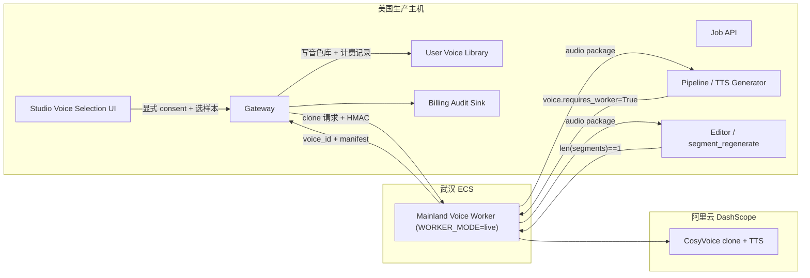

# CosyVoice Phase 4：Studio 灰度上线方案

日期：2026-05-24

前置文档：[`2026-05-24-cosyvoice-domestic-worker-plan.md`](2026-05-24-cosyvoice-domestic-worker-plan.md)
（Phase -1 → 1 → 1.5 → 2 已闭环）

## 目标

把 CosyVoice 国内 worker 从"admin POC 验证"推进到"Studio 用户可见的克隆能力"。
范围只覆盖**灰度上线**——管理员配置允许的少量用户可在 Studio voice
selection 看到 CosyVoice clone 入口，从样本片段克隆音色并用于配音 TTS。
不覆盖全量发布、不覆盖多语种扩展。

## 非目标

- 不替换 MiniMax clone 主路径（MiniMax 仍是默认 / 多语种 fallback）
- 不扩展跨语种克隆（CosyVoice ICL 2.0 当前只支持中文，方案 `language_hints`
  默认 `["zh"]`）
- 不引入新的存储后端（artifact 仍按 Phase 3 决策走 Nginx 或 OSS）
- 不接通豆包 ICL 2.0（虽然 worker 命名预留了 `aivideotrans-mainland-worker`
  扩展空间，但豆包接入是独立 plan）
- 不做用户级"克隆音色市场 / 分享"（个人音色库范畴，不展开）

## 结论摘要

- Phase 4 是**架构整合**任务，不是新能力创造：所有底层（worker /
  client / 协议 / 守卫）在 Phase 1-2 已就绪；Phase 4 把这些组件接进主
  pipeline + Studio UI。
- **成本口径修正**：CosyVoice **不是** 豆包 ICL 的 "3 元/万字符 + 槽位费"
  口径。按阿里云百炼**人民币**官方价（2026-05 中国内地）：
  - 声音复刻 API：`model="voice-enrollment"`（CosyVoice 官方 API），**计费 SKU
    待账单确认**，按价格页约 **¥0.01 / 个音色**
  - TTS 合成：`cosyvoice-v3.5-flash` **¥0.8 / 万字符**、`plus` **¥1.5 / 万字符**
  - **中文计费规则**：DashScope 1 个汉字 = 2 个 API 计费字符
  - 中国内地部署模式**无免费额度**；Phase 2 POC ¥0 仅因当前账号有
    资源包 / 抵扣权益覆盖，**不能作为长期定价假设**
  - ⚠️ 之前 plan 草案把 `$0.116/$0.22` 美元价当人民币、把 `qwen-voice-enrollment`
    （Qwen 自己的 SKU）误写成 CosyVoice 的 clone API 模型——均已修正
- **新增专章**：账单观测与成本守卫——每次 clone / TTS 必须记录
  `provider_request_id` / `billed_chars` / `voice_id` / 用户 / 任务，
  支撑与阿里云后台账单对账
- 灰度策略：admin allowlist + 单灰度任务并发上限，**不**通过 plan 等级
  自动开放（plan-based 灰度等真实成本数据进来后再做）

## 前置条件检查清单

启动 Phase 4 编码前必须确认：

| 条目 | 当前状态 |
|---|---|
| Phase 2 真实 POC 闭环 | ✅ Codex 2026-05-24 完成 |
| 武汉 worker 切回 `WORKER_MODE=mock` | ✅ |
| Gateway 配置层接入完成（Phase 1.5） | ✅ |
| Phase 1.5 admin endpoint `/admin/mainland-voice-worker/healthz` 可用 | ✅ |
| **授权文案就绪**（用户上传样本前的中文条款 + 勾选） | ✅ v1 approved（业务方 2026-05-25 确认，Codex review passed），`modal_version="2026-05-25-v1"` |
| **个人音色库 schema 决策**（quota 字段位置） | ✅ 不加列，``SELECT COUNT(*)`` 动态算 + admin settings 上限（plan §User Voice Library Schema） |
| **真实账单单价确认（人民币）** | ✅ flash ¥0.8/万字符、plus ¥1.5/万字符、复刻 ¥0.01/音色（Codex 2026-05-24 核对，已修正美元口径误用） |
| **DashScope 中文计费规则** | ✅ 1 汉字 = 2 字符（影响 billed_chars 实现） |
| **MiniMax 中文字符规则** | ❌ 待 Codex 从 MiniMax 文档确认（影响 TCO 对比表是否需要调整） |
| **Phase 4.0 worker 协议扩展** | ❌ 必须先做（`provider_request_id` + `billed_chars` 中文准确性，Phase 4.1 编码硬前置） |
| 武汉 ECS 续费状态 | ⚠️ 用户已续费但具体期限未在文档同步 |

## 架构变更概览



Phase 4 在原架构上**新增 5 个接通点**（每个对应 §与现有项目集成 一节）：

1. **Voice Library Schema**：voice 记录新增 4 个字段
2. **Voice Clone 端点**：Gateway 暴露给前端 `POST /api/voice/cosyvoice/clone`，
   内部转 Phase 1.5 工厂 + HMAC 调武汉
3. **TTS Generator Fork 点**：主 pipeline TTS 调用前判 `voice.requires_worker`
4. **Segment Regenerate Fork 点**：editing 路径同样判 `requires_worker`
5. **Studio Voice Selection UI**：CosyVoice tab 新增 "我的克隆音色"
   分组 + 克隆按钮（受 admin allowlist + `cosyvoice_clone_worker_enabled` gate）

## 数据流

### Clone Flow（用户显式触发）

```
1. 用户在 Studio voice selection → CosyVoice tab → 点"克隆我的声音"
2. UI 检查 gate：cosyvoice_clone_worker_enabled && user in allowlist
3. UI 弹授权文案 modal，用户勾选 + 选样本片段（来自当前任务 transcript）
4. UI POST /api/voice/cosyvoice/clone {speaker_id, sample_segments, consent}
5. Gateway:
   a. 校验 consent.voice_clone_confirmed === true
   b. 从任务样本拼接 → 上传到 OSS signed URL（短 TTL）
   c. 校验样本 size < 1 MB（worker HEAD 会再校验一次，这里前置防浪费）
   d. 调 build_mainland_voice_worker_client(settings) 拿 client
   e. client.clone(WorkerCloneRequest(...))
   f. 写 audit / billing 记录（事件类型 cosyvoice_clone_request）
   g. 写 user voice library（含 requires_worker=True、target_model、quota++）
6. UI 收到 voice_id，UI 把该 speaker 标记为 CosyVoice cloned voice
```

### TTS Flow（主 pipeline 批量合成）

```
1. Pipeline 已完成 SemanticBlock 分段 + 译文
2. TTSGenerator 取每段对应 voice 时，调 should_use_worker(voice)
3. 若 True → 按 (voice_id, target_model) 分组
4. 每组调 client.synthesize_batch(WorkerSynthesizeBatchRequest)
   - max_attempts = 2（多段）/ 3（单段）—— Phase 1 client 已收口
5. 收到 zip → extract_artifact_segments → 三层 sha256 校验 → hydrate TTSResult
6. 后续 DSP alignment / subtitle retiming / Jianying draft 不变
7. 每段 synth 完成后写 billing audit（事件类型 cosyvoice_tts_synth_segment）
```

### Single-segment Regenerate（Studio post-edit）

```
1. 用户编辑某段译文后点"重新合成"
2. POST /job-api/jobs/{id}/segments/{sid}/regenerate-tts
3. segment_regenerate 取该段 voice metadata，调 should_use_worker(voice)
4. 若 True → 调 client.synthesize_batch with len(segments)==1
   （Phase 1 协议层已经保证 single-segment 走同一 endpoint）
5. 写 editor/editing/ 下的 draft wav
6. 后续 commit 流程不变
```

### Voice Delete Flow

```
1. 用户在个人音色库点"删除"
2. Gateway DELETE /api/voice/{voice_id}
3. 若 voice.requires_worker → client.delete_voice(voice_id, ...)
4. 成功后软删除 user voice library 记录（quota--）
5. 失败：写 retryable tombstone（plan §Delete 已规定），定时任务重试
```

## 与现有项目集成

### Gateway

新增 admin settings（plan 父文档 §Gateway 已列前 4 项，Phase 4 再加 4 项）：

```
mainland_voice_worker_enabled         # Phase 1.5 已实现
mainland_voice_worker_url             # Phase 1.5 已实现
mainland_voice_worker_hmac_key_id     # Phase 1.5 已实现
mainland_voice_worker_hmac_secret     # Phase 1.5 已实现（env-only）

cosyvoice_clone_worker_enabled        # ← Phase 4.1 已实现
cosyvoice_clone_default_target_model  # ← Phase 4.1 已实现（默认 cosyvoice-v3.5-flash）
cosyvoice_clone_user_allowlist        # ← Phase 4.1 已实现（user_id 数组）
cosyvoice_clone_max_voices_per_user   # ← Phase 4.1 已实现（默认 3，灰度期严控；
                                      #    endpoint 调付费 worker 前先动态 count
                                      #    user_voices 实施配额，超过即 409）
cosyvoice_clone_max_concurrent_jobs   # ← Phase 4.2 PLACEHOLDER（默认 2）：字段
                                      #    在 schema 中保留，**当前 endpoint 不读**；
                                      #    需要 Redis/DB counter 实现并发 gate，
                                      #    Phase 4.2 落地后才真正生效。改了暂时
                                      #    无运行时效果。
```

`enabled` / `available` 语义沿用 Phase 1.5（plan 父文档 §Gateway）：管理员
手动改 `enabled`，`available` 由 worker 心跳自动维护。

### User Voice Library Schema

现有 voice library（MiniMax / VolcEngine 公共音色）的 row 形态保持不变。
Phase 4 引入 CosyVoice cloned voice 时新增 4 个字段，旧 row 用默认值兜底：

```json
{
  // ── 现有字段（不动）──
  "voice_id": "cosyvoice_custom_xxx",
  "provider": "cosyvoice_voice_clone",
  "tts_provider": "cosyvoice",
  "platform": "dashscope_mainland",
  "user_id": "u_xxx",
  "speaker_name": "...",
  "created_at": "...",

  // ── Phase 4 新增 ──
  "region_constraint": "mainland_only",        // overseas_ok | mainland_only
  "requires_worker": true,                      // 派生：region_constraint=="mainland_only"
  "target_model": "cosyvoice-v3.5-flash",      // clone 时锁定，TTS 必须用同一模型
  "worker_provider": "cosyvoice",               // 当前只 cosyvoice；预留 doubao 扩展位
  "worker_region": "cn-wuhan",                  // 当前只武汉；预留多 region

  // ── Clone API / 计费 SKU 拆分（Codex 2026-05-24 P0 修正）──
  // CosyVoice 官方 clone API 模型名是 "voice-enrollment"（不是 Qwen 的
  // "qwen-voice-enrollment"）。计费 SKU 名由阿里云后台对账确认填入；
  // 两个字段分开存便于：(a) Phase 2 SDK 调用层用 clone_api_model;
  // (b) 月度对账层用 billing_sku 与阿里云账单汇总匹配。
  "clone_api_model": "voice-enrollment",       // 调 SDK 时传给 create_voice
  "billing_sku": null,                          // 待首次账单出具后回填，例如 "voice-enrollment-domestic"

  // ── 计费 / 审计字段（plan §账单观测与成本守卫）──
  "clone_provider_request_id": "ali_req_xxx",  // 调用追踪；账单有 request_id 时可作精确对账锚点
  "clone_billed_units": 1,                      // 通常为 1（按 voice 计费）
  "clone_billed_at": "...",
  "clone_sample_seconds": 18.2,
  "clone_sample_segment_ids": [12, 18, 19]
}
```

**Quota 实现**（Phase 4.1 C.2 落地，**不新增用户表字段**）：

Phase 4.1 C.2 endpoint 在调付费 worker 前 **动态 count** 当前用户在
`user_voices` 表里 `provider="cosyvoice_voice_clone"` 且 `expired_at IS NULL`
的 row 数，与 admin setting `cosyvoice_clone_max_voices_per_user`（默认 3）
比较；超过即 409 `voice_quota_exceeded`，**不读样本 / 不转码 / 不上传 /
不调付费 worker**。

```python
# gateway/user_voice_service.py
async def count_active_voices_for_user_and_provider(
    db, user_id, *, provider: str
) -> int: ...

# gateway/cosyvoice_clone/api.py Layer 7（付费前 DB gate）
if active_count >= max_voices:
    raise HTTPException(409, "voice_quota_exceeded")
```

**为什么不加用户表 quota 字段**：

1. **避免双源（drift 风险）**：用户表 quota 与 admin setting 二者都是限值时，
   admin 改设置后用户表旧值不会自动同步，最终用户能问"为什么我看到的限额
   不一样"。单源 admin setting 没这个问题。
2. **避免计数字段事务争用**：`cosyvoice_clone_voices_count` 是派生值，可以
   直接 `SELECT COUNT(*)`；维护一个冗余 counter 字段会引入"clone 成功但
   counter 没 +1"或"删 voice 但 counter 没 -1"的状态漂移。
3. **MVP 期 count 性能足够**：单用户最多几十个音色，`COUNT(*) WHERE user_id
   AND provider AND expired_at IS NULL` 加上 `(user_id, region_constraint)`
   索引 < 1ms。Phase 4.2 真要做高并发并发 gate 时再考虑 Redis counter。

**独立于 MiniMax quota**（plan 父文档 §用户音色库 推荐）：MiniMax ¥9.9/音色
+ 单 voice unlock 计费；CosyVoice ¥0.01/音色 + 按字符 TTS 计费。两个成本结构
完全不同，混用 quota 会让用户行为分析失真——因此 `count_active_voices_for_
user_and_provider` 必须按 `provider="cosyvoice_voice_clone"` 严格过滤，
MiniMax / VolcEngine 等其它 provider 的音色不进 CosyVoice 配额。

### Voice Selection UI（frontend-next）

**当前形态**（Phase 1.5 不动 UI）：CosyVoice tab 显示公共预设音色 + matched
voice ranker 推荐。`supports_clone` 一直返 `false`。

**Phase 4 改动**：

```
CosyVoice tab:
├── [新增] 我的克隆音色 section（仅当 user in allowlist + enabled=true）
│   ├── [voice card] ...
│   └── + 克隆我的声音（按钮）
├── 推荐音色 section（原有）
└── 全部音色 section（原有）
```

点 "+ 克隆我的声音" 弹出 modal：

1. **样本选择**：从当前任务的 transcript 选 N 段，预览拼接后总时长（必须 ≤ 10s）
2. **授权勾选**（plan §Open Questions：需要法务输出文案）：
   - "我确认这段录音是我本人的声音 / 我已获得本人书面授权"
   - "我理解克隆音色会在国内服务器上生成并保留 X 天"
   - "我同意按 ¥XX 扣费"（具体金额从 Gateway runtime pricing 取）
3. 点"开始克隆" → POST `/api/voice/cosyvoice/clone`

**前端守卫**（必须在测试中固定）：

- "克隆我的声音" 按钮只在 `supports_clone === true && cosyvoice_clone_worker_enabled === true`
  时渲染
- modal 提交按钮 disabled until 三个勾选框全打勾
- 不在任何路径下"自动触发"克隆（CLAUDE.md 红线）

### Pipeline / TTS Generator

⚠️ Codex 2026-05-24 P1 finding：**`TTSGenerator` 是 `src/pipeline/process.py`
里跑的 pipeline 对象，不在 FastAPI 进程内**，**不能假设能访问 `current_app.state`**。

⚠️ Codex 2026-05-24 P0 finding（二轮）：**HMAC secret 绝不进 job spec /
runtime_config**。理由：

- JobRecord 写 DB / 备份 / 状态接口 / 任务目录 dump 都可能携带 spec
- secret 一旦写进 job state，会通过 `GET /jobs/{id}` 等用户可见接口意外
  泄漏
- 现有 `ProcessJobRunner` 已经会把启动 env 透传给 pipeline 子进程
  （`src/services/jobs/process_runner.py`）

**正确注入方式（explicit factory + env-only secret）**：

```
       Gateway (FastAPI process)        Pipeline (process.py 子进程)
       │  AVT_MAINLAND_*_SECRET (env)    │  AVT_MAINLAND_*_SECRET (env, 继承)
       │                                  │
       │ build_..._client(settings)       │ build_..._client_factory(env + spec)
       ▼                                  ▼
   MainlandWorkerClient            MainlandWorkerClientFactory
   （admin endpoint 用）            （TTSGenerator / segment_regenerate 用）
```

**Job spec runtime_config 只携带非密配置**（enabled / url / key_id），
**secret 由 pipeline 容器从自己的 env 读**。这样：

- Job spec 序列化进 DB / 备份 / response 不会泄密
- pipeline 容器和 gateway 容器是同一个 `.env` 来源（compose），secret
  始终一致
- 多副本部署时每个 pipeline 容器自管 env，不靠 spec 传递

具体落点：

- Gateway lifespan 构造 `MainlandWorkerConfigSnapshot`（**不含 secret**）：
  `enabled / url / key_id`，注入 job spec runtime_config
- pipeline 子进程启动时：从 `runtime_cfg` 取 `enabled/url/key_id`，从
  自己的 env `AVT_MAINLAND_VOICE_WORKER_HMAC_SECRET` 取 secret，合成
  `WorkerCredentials`
- `TTSGenerator.__init__` 接受 `mainland_worker_client_factory: Callable[[], MainlandWorkerClient | None]`
  参数；调用方在子进程入口装配
- `segment_regenerate` 同理通过 caller 注入

伪代码：

```python
# Gateway 侧：spec 只传非密字段，secret 完全不进 spec
def submit_job(...):
    runtime_cfg = {
        "mainland_voice_worker": {
            "enabled": settings.mainland_voice_worker_enabled,
            "url": settings.mainland_voice_worker_url,
            "key_id": settings.mainland_voice_worker_hmac_key_id,
            # ❌ 严禁：不传 secret
        }
    }
    # spec 持久化进 DB / 备份 / response，绝不可能携带 secret

# Pipeline 子进程侧：env 是 secret 的唯一来源
import os

def _build_worker_client_factory(runtime_cfg) -> Callable:
    cfg = runtime_cfg.get("mainland_voice_worker") or {}
    if not cfg.get("enabled"):
        return lambda: None

    secret = os.environ.get("AVT_MAINLAND_VOICE_WORKER_HMAC_SECRET", "").strip()
    if not secret:
        # plan §Worker Degraded Mode：secret 缺失 → 当作 disabled
        logger.warning("mainland_voice_worker enabled in spec but secret env missing; treating as disabled")
        return lambda: None

    key_id = cfg.get("key_id", "").strip()
    url = cfg.get("url", "").strip()
    if not (key_id and url):
        return lambda: None

    def factory():
        return MainlandWorkerClient(
            base_url=url,
            credentials=WorkerCredentials(key_id=key_id, secret=secret),
        )
    return factory

# TTSGenerator 接受 factory（与 Gateway 进程隔离的同一接口）
class TTSGenerator:
    def __init__(self, ..., mainland_worker_client_factory=None):
        self._mw_factory = mainland_worker_client_factory or (lambda: None)

    def _generate_one(self, seg, voice):
        if should_use_worker(voice):
            client = self._mw_factory()
            if client is None:
                raise WorkerDegradedError(
                    "CosyVoice worker disabled or misconfigured; 请联系管理员"
                )
            try:
                resp = client.synthesize_batch(WorkerSynthesizeBatchRequest(
                    job_id=self.job_id,
                    target_model=voice.target_model,
                    audio_format="wav",
                    segments=(WorkerSegmentRequest(...),),
                ))
                # ... extract artifact, hydrate TTSResult
            finally:
                client.close()
        else:
            return _existing_provider_call(...)
```

**Phase 4.1 AST 守卫**（防回退）：

- `models.py` / job spec dataclass / serializer 任何字段名 / 字典 key
  都不出现 `secret` / `hmac_secret`（针对 mainland_voice_worker 上下文）
- `submit_job` / `runtime_cfg` 构造路径 grep：禁止
  `settings.mainland_voice_worker_hmac_secret` 进 spec dict

**严格约束**（CLAUDE.md 付费 API）：

- `WorkerDegradedError` 不自动 fallback 到 MiniMax；让任务进 `awaiting_worker`
  状态等管理员介入（plan 父文档 §Worker Degraded Mode）
- TTS 失败也不在 except 路径调真实 worker 重试（client `max_attempts` 已经
  收口；超出抛 `WorkerNetworkError` 让上层把任务 pause）
- secret **仅** 通过 env 传递（runtime_cfg / job spec **永远不携带 secret**，
  见上面 P0 finding 说明）。pipeline 进程从自己的 env 读到 secret 后只在
  进程内存留存，**不能进 audit 日志、不能进 job status response**

### Segment Regenerate（post-edit）

`src/services/tts/segment_regenerate.py` 同样走 **explicit factory 注入**
（与 TTSGenerator 同一原则；不读 FastAPI `current_app.state`）：

```python
def build_real_segment_tts_caller(
    ...,
    mainland_worker_client_factory=None,  # 新增参数
):
    ...

def regenerate_segment(job, segment_id, ..., mainland_worker_client_factory):
    voice = lookup_voice(...)
    if should_use_worker(voice):
        client = mainland_worker_client_factory()
        if client is None:
            raise WorkerDegradedError("CosyVoice worker unavailable; 请联系管理员")
        try:
            resp = client.synthesize_batch(WorkerSynthesizeBatchRequest(
                ...,
                segments=(single_seg,),  # len == 1，复用 batch endpoint
            ))
            # ... write draft wav
        finally:
            client.close()
    else:
        return _existing_regenerate(...)
```

Phase 1 已经保证 `synthesize_batch` 支持 `len(segments) == 1`，AST 守卫禁止
有人新开 `/synthesize-one`。这条契约 Phase 4 不变。

factory 来源：Job API 在 startup wiring 时构造同一个 `MainlandWorkerConfigSnapshot`
→ factory，注入到 `build_real_segment_tts_caller`。

## Worker Degraded Mode 落地

plan 父文档 §Worker Degraded Mode 给了语义，Phase 4 落地为：

### 健康检查触发器

Gateway 启动后开一个后台 task，每 60s 调 `client.health()`：

- 连续 3 次失败 → 写 `runtime_state.mainland_voice_worker_available = false`
- 连续 3 次成功 → 写 `true`

`runtime_state` 在内存中（不进 DB），由 Gateway 进程持有；多副本部署时
每个副本独立判断（短期内可能略有差异但不影响用户安全）。

### 用户可见行为

| 状态 | UI | 任务 |
|---|---|---|
| `enabled=true && available=true` | 显示 "我的克隆音色" + 克隆按钮 | 主 pipeline / regenerate 走 worker |
| `enabled=true && available=false` | 隐藏克隆按钮；已有 voice 标"暂不可用" | 已选 CosyVoice voice 的任务进 `awaiting_worker`，弹"等待恢复 / 手动切其他 voice" |
| `enabled=false`（管理员手动关） | 完全隐藏 CosyVoice clone | 同上 |

**禁止**：worker degraded 时自动切 MiniMax clone（CLAUDE.md 付费 API 硬约束）

### 恢复

`available=true` 后管理员可手动 resume `awaiting_worker` 任务，或用户在 UI
点 "重试"。

## 账单观测与成本守卫（新增专章）

CosyVoice 中国内地**无免费额度**，所有调用都会产生真实费用。Phase 4 必须
做到"调用即留痕、留痕即可对账"。

### 每次调用必须落审计

**Clone 调用**（Gateway → worker → DashScope）写一条 `billing_audit` 记录：

```json
{
  "event_type": "cosyvoice_clone_request",
  "user_id": "u_xxx",
  "job_id": "job_xxx",
  "speaker_id": "speaker_a",
  "voice_id": "cosyvoice_custom_xxx",
  "provider": "cosyvoice_voice_clone",
  "clone_api_model": "voice-enrollment",      ← CosyVoice 官方 API model
  "billing_sku": null,                          ← 首次实账单后回填（例如 "voice-enrollment-domestic"）
  "target_model": "cosyvoice-v3.5-flash",     ← TTS 模型（与 voice 绑定，跟 clone_api_model 不同）
  "worker_request_id": "wrk_xxx",              ← 必填，worker 自生成 UUID
  "provider_request_id": "ali_req_xxx",        ← nullable，DashScope SDK 暴露时填
  "billed_units": 1,                            ← 通常 1 个音色
  "expected_cost_cny": 0.01,                    ← ¥0.01 / 个音色（人民币口径）
  "status": "succeeded" | "failed",
  "error_code": "...",
  "created_at": "..."
}
```

**TTS 调用**（每个 segment 一条，主 pipeline 和 regenerate 都打）：

```json
{
  "event_type": "cosyvoice_tts_synth_segment",
  "user_id": "u_xxx",
  "job_id": "job_xxx",
  "segment_id": 42,
  "voice_id": "cosyvoice_custom_xxx",
  "target_model": "cosyvoice-v3.5-flash",
  "worker_request_id": "wrk_xxx",              ← 必填
  "provider_request_id": "ali_req_xxx",        ← nullable
  "billed_chars": 26,                           ← 含中文 = 2 字符规则；优先用 SDK usage.characters
  "expected_cost_cny": 0.00208,                 ← 26 chars × ¥0.8/10000（flash 人民币口径）
  "status": "succeeded" | "failed",
  "error_code": "...",
  "audio_seconds": 3.18,
  "created_at": "..."
}
```

### 真实成本模型（按人民币 / 中国内地口径）

按阿里云百炼**人民币**官方价（2026-05 中国内地，
[来源](https://help.aliyun.com/zh/model-studio/model-pricing)）：

| 项目 | 单价（人民币） | 备注 |
|---|---|---|
| 声音复刻（SKU 待账单确认） | **¥0.01 / 个音色** | 阿里云价格页声音复刻一次性创建费 |
| TTS `cosyvoice-v3.5-flash` | **¥0.8 / 万字符** | Phase 4 灰度默认 |
| TTS `cosyvoice-v3.5-plus` | **¥1.5 / 万字符** | 更高质量；灰度后 A/B 评估 |
| MiniMax speech-02-hd | ¥3.5 / 万字符 | 同一阿里云价格页对照 |
| MiniMax speech-02-turbo | ¥2 / 万字符 | 同上 |
| MiniMax 快速复刻 | ¥9.9 / 音色 | 同上 |
| 中国内地免费额度 | **无** | Phase 2 ¥0 仅因当前账号有资源包 / 抵扣权益 |

**计费字符规则**（DashScope 官方）：

- 1 个 ASCII 字符 = 1 个 API 计费字符
- **1 个汉字 = 2 个 API 计费字符**
- 故 1 万**中文汉字**文本 ≈ 2 万 API 计费字符

⚠️ 之前 plan 把美元 `$0.116 / $0.22` 当人民币用是错的（Codex 2026-05-24
P0 finding）。后续成本估算和定价决策都按上表人民币重算。

### Phase 4 灰度典型场景成本（人民币口径重算）

按 **1 万 API 计费字符 = 5000 中文汉字 = 10000 ASCII** 的标准化口径：

| 场景 | 计算 | 总价 |
|---|---|---|
| 1 音色 + 1 万 API 字符（≈ 5000 汉字） | 0.01 + 1×0.8 | **¥0.81** |
| 1 音色 + 1 万**汉字** (= 2 万 API 字符) | 0.01 + 2×0.8 | **¥1.61** |
| 1 用户 1 音色 + 1 个 10 分钟视频配音（≈ 1500 汉字 ≈ 3000 字符） | 0.01 + 0.3×0.8 | **¥0.25** |
| 1 用户 3 音色 + 5 个视频（≈ 7500 汉字 ≈ 15000 字符） | 0.03 + 1.5×0.8 | **¥1.23** |
| 50 用户灰度月活，平均 2 音色 + 25000 汉字 / 人（= 50000 API 字符/人） | 50 × (2×0.01 + 5×0.8) | **¥201** |

**对比 MiniMax**（同 API 字符口径）：

| 场景 | MiniMax HD | CosyVoice flash | 差距 |
|---|---|---|---|
| 1 音色 + 1 万 API 字符 | 9.9 + 3.5 = ¥13.4 | 0.01 + 0.8 = **¥0.81** | CosyVoice 便宜 **~16.5 倍** |
| 1 音色 + 100 万 API 字符 | 9.9 + 350 = ¥359.9 | 0.01 + 80 = **¥80.01** | CosyVoice 便宜 **~4.5 倍** |
| 100 音色 + 100 万 API 字符 | 990 + 350 = ¥1340 | 1 + 80 = **¥81** | CosyVoice 便宜 **~16.5 倍** |

**真实成本反转结论（修正后）**：CosyVoice 在所有量级仍明显低于 MiniMax，
但**不是**之前 plan 草案误写的 118 倍——典型场景**约 16 倍**，大用量
场景 4-5 倍。这个差距仍然足以支撑 Phase 4 灰度（成本压力极小），但
不能用 "CosyVoice 便宜两位数量级" 作为产品定价宣传依据。

**MiniMax 字符规则待 Codex 确认**：本表假设 MiniMax 中文计费规则与
DashScope 一致（汉字 = 2 字符）。如果 MiniMax 按汉字 = 1 字符计，
则 MiniMax 真实成本是上表的一半，CosyVoice 优势相应折半。Phase 4 灰度
前需要从 MiniMax 官方文档确认。

### 对账流程

每月 1 号自动跑：

1. 拉取 Gateway `billing_audit` 表上月所有 `event_type LIKE 'cosyvoice_%'` 记录
2. 聚合：按 `target_model` 汇总 `billed_chars` + 按 voice 数汇总 `billed_units`
3. 计算 expected_cost：`sum(billed_chars) * 单价 + sum(voices) * 0.01`
4. 拉取阿里云后台账单（按月）；若账单明细提供 request id，则优先用
   `provider_request_id` 精确 join；若只提供 `consumedetailbillv2` 这种
   按分钟 / SKU / 用量聚合的明细，则按 `target_model`、消费时间窗口、
   `billed_chars` 汇总值和金额做聚合核对。`provider_request_id` 仍保留
   为 DashScope 支持追踪字段，但不作为 `consumedetailbillv2` 对账硬前提。
5. **差异 > 5% 报警**到管理员邮箱：
   - 我方记录 > 阿里云账单 → 可能有审计漏写 / 重复计费
   - 我方记录 < 阿里云账单 → 可能有"非用户触发"调用（守卫违规）

### 成本守卫

代码层面：

- **AST 守卫**：`cosyvoice_clone_*` / `cosyvoice_tts_*` 这两个 billing_audit
  event_type 必须有调用点（grep），防止有人未来重构时漏写审计
- **运行时守卫**：Gateway 在调 worker 前必须 `try/except` 包裹，无论成功失败
  都写 audit；audit 写失败时降级**拒绝调用** worker（fail-closed），避免静默
  调用产生费用
- **配置守卫（Phase 4.1 已生效）**：`cosyvoice_clone_max_voices_per_user`
  在 endpoint 调付费 worker 前动态 count `user_voices`（按 provider 严格
  过滤），超过即 409。详见 §User Voice Library Schema §Quota 实现。
- **配置守卫（Phase 4.2 placeholder）**：`cosyvoice_clone_max_concurrent_jobs`
  作为全局并发硬上限**当前未实现**——字段在 admin settings schema 里保留，
  但 endpoint 不读取，改动无运行时效果。Phase 4.2 配 Redis / DB counter 后
  才真正生效。灰度期由 `max_voices_per_user` 间接限制（单用户最多 N 个
  active 音色 → 同时最多 N 次 clone-in-progress）。

## Rollout 子阶段

Phase 4 内部再拆 5 个子阶段，每个子阶段独立通过标准：

### Phase 4.0：Worker 协议扩展 + 计费字符准确性（Phase 4.1 编码前的硬前置）

Codex 2026-05-24 P0 finding：当前 worker 协议拿不到对账要求的字段，
且 `billed_chars` 用 `len(seg.text)` 在中文场景系统性低估约一半。
Phase 4.1 编码前必须先扩 worker 协议层。

⚠️ **拆 4.0a → 4.0b 两步**（Codex 二轮 P1-5 finding：先 live 实测看
SDK 实际暴露什么，再写最终 contract，避免协议设计自相矛盾）。

---

#### Phase 4.0a：Live SDK Introspection（不写最终 contract）

目标：在写 Phase 4.0b 最终协议前，先看 DashScope SDK live 模式下到底
暴露什么。

**步骤**（Codex 在武汉 ECS 跑，预计 < 30 分钟）：

1. `worker.env` 加 `DASHSCOPE_API_KEY` + 切 `WORKER_MODE=live`，重启
   worker（用 admin/dev 自录小样本，~10s WAV）
2. 跑一次 `clone` + `synthesize_segment` + `delete_voice`，在 worker
   端把以下 SDK metadata 全部打到一个临时观测日志：
   - `service.create_voice(...)` 返回的对象 / 字符串
   - `service.get_last_request_id()` 是否可用、返什么
   - `service.query_voice(voice_id)` 返回结构
   - `SpeechSynthesizer.call(text)` 返回的对象 `dir()` + response headers
   - `synthesizer.get_last_request_id()` / `synthesizer.response_headers`
     等可能的 metadata 接口
   - SDK 是否暴露 `usage.characters` / `usage.input_tokens` 字段
3. 把观测结果落到 plan 文档（追加一节 §4.0a Observation Log）
4. 切回 `WORKER_MODE=mock`，清理临时日志

**通过标准**：

- 确认两件事：
  - **provider_request_id 来源路径**（路径 A：`get_last_request_id()` 可用 /
    路径 B：response headers 含 `X-Request-Id` / 路径 C：完全拿不到 → 留 None）
  - **billed_chars 来源路径**（路径 A：SDK 暴露 `usage.characters` /
    路径 B：本地实现 `billing_character_count()` 与官方一致）
- 决策结果写进 plan，作为 Phase 4.0b 的实施依据
- 不写最终 contract 代码

#### Phase 4.0a Observation Log（Codex 2026-05-25）

执行环境：

- 武汉 ECS，使用 `/opt/aivideotrans-mainland-worker/.venv` 内的 DashScope SDK
- 为降低对线上 mock worker 的扰动，本次没有把 systemd worker 切到 live；
  而是用同一份 `worker.env` / venv 在隔离脚本中直接调用 SDK。公网 worker
  全程保持 `WORKER_MODE=mock`
- 样本使用阿里云官方 CosyVoice 示例音频裁剪成 8 秒 WAV（768044 bytes），
  通过临时随机 Nginx location 暴露给 DashScope 拉取；执行后已删除临时
  location、样本文件、脚本和观测 JSONL

观测结果：

- `VoiceEnrollmentService.create_voice(...)`
  - 返回值类型：`str`
  - 返回值就是 `voice_id`
  - `service.get_last_request_id()` 可用，create 后返回 UUID 形态 request id
- `VoiceEnrollmentService.query_voice(voice_id)`
  - 返回值类型：`dict`
  - 关键字段：`status / target_model / voice_id / resource_link`
  - 本次第 7 次 poll 进入 `status="OK"`，约 6 秒
  - 每次 query 后 `service.get_last_request_id()` 都会更新为该 query 的 request id
- `SpeechSynthesizer.call(text)`
  - 返回值类型：`bytes`
  - `synthesizer.get_last_request_id()` / `synthesizer.last_request_id` 可用
  - `synthesizer.get_response()` 在 call 后返回：
    `header.task_id == last_request_id`、`event="task-finished"`、`payload.output={}`
  - 未观察到 `usage.characters`、`usage.input_tokens` 或等价 usage 字段
  - `headers` 为 `None`
- `VoiceEnrollmentService.delete_voice(voice_id)`
  - 返回值：`None`
  - delete 后 `service.get_last_request_id()` 可用，返回 UUID 形态 request id

Phase 4.0b 决策：

- `provider_request_id` 路线：走 SDK `get_last_request_id()` / synthesizer
  `last_request_id`
  - clone：使用 `create_voice` 后的 request id
  - synthesize：使用 `SpeechSynthesizer.call` 对应的 `last_request_id`
  - delete：使用 `delete_voice` 后的 request id
  - query_voice 的 request id 只进 worker audit debug，不作为 clone billing 主锚点
- `billed_chars` 路线：走本地 `billing_character_count(text)`，不依赖 SDK usage
  - 原因：SDK live response 未暴露 usage
  - 规则按阿里云官方计费口径实现：CJK 汉字按 2 个 API 字符；ASCII /
    标点 / 其他字符按 1 个 API 字符（边界用测试锁定）
  - 本次观测文本 `"你好，这是一次计费字符观测。"`：`len(text)=14`，
    fallback 计费字符数为 26

---

#### Phase 4.0b：协议实施（基于 4.0a 决策落代码）

**A. worker_request_id / provider_request_id 通路**：

- 改 `services.mainland_worker.types`：
  - `WorkerCloneResponse` 增 **`worker_request_id: str` 必填** +
    `provider_request_id: str | None`（nullable）
  - `WorkerSynthesizeBatchResponse` 增 **`worker_request_id: str` 必填**
    （batch 顶层一个）+ `WorkerSegmentResult` 增
    `provider_request_id: str | None`（segment 级，每段独立）
  - `WorkerDeleteVoiceResponse` 增 **`worker_request_id: str` 必填** +
    `provider_request_id: str | None`
  - `worker_request_id` 由 worker 端生成 UUID，**必填**；用于 Gateway audit
    把 client 侧 / worker 侧 / DashScope 侧三段串起来
  - `provider_request_id` 按 4.0a 决策填或留 None（Codex 二轮 P1-2/P1-3
    finding：三个 response 顶层都必填 `worker_request_id`；
    `provider_request_id` 全部 nullable，避免 DB schema 必填与 mock /
    SDK 不可获取冲突）
- 改 worker server 端 `app.py`：每个 handler 把 `worker_request_id` /
  `provider_request_id` 写进 audit + response
- 改 client `client.py`：解响应时把 `worker_request_id` +
  `provider_request_id` 透传到调用方

**B. billed_chars 准确性**：

- 当前 `RealCosyvoiceProvider.synthesize_segment` 用 `len(seg.text)` 当
  `billed_chars`，**中文低估约一半**（DashScope 汉字 = 2 字符）
- 按 4.0a 决策走路径 A（SDK usage）或路径 B（本地
  `billing_character_count()` 实现规则 "ASCII = 1, CJK = 2"）；
- 路线 B 时守卫测试覆盖边界：emoji / 半角全角符号 / latin extended /
  纯英文 / 纯中文 / 混合 / 数字 / 标点

**通过标准**：

- 三个 response 顶层都有必填 `worker_request_id`（单元测试 + AST 守卫）
- `WorkerSegmentResult.provider_request_id` 在 mock 路径下能透传到 client
  （mock 用 fake id 或 None）
- 武汉 live 模式下真实跑一次：`provider_request_id`（若 4.0a 决策为可获取）
  不为 None；账单若提供 request id 则验证可 join，否则按 SKU / 时间窗口 /
  用量汇总验证 `billed_chars` 偏差
- `billed_chars` 中文测试：`"你好"` → 4（不是 2）
- 守卫测试：grep `len(seg.text)` 不出现在 `RealCosyvoiceProvider.synthesize_segment`
- 累计 mainland_worker 测试预计 +15 项（含 e2e + 单元 + 守卫）

**不动**的：

- HMAC 协议（签名头不变）
- 现有 Phase 1 / 1.5 / 2 通过的测试套件
- worker 部署形态（仍 systemd + Nginx）

**DB schema 约束**（Codex 二轮 P1-3 finding + 2026-05-25 账单核对）：
billing audit 表 **`worker_request_id` 必填、`provider_request_id`
永久 nullable**。

之前草案曾提"若 SDK 在 live 模式稳定暴露 `provider_request_id`，灰度
1-2 周后可加 NOT NULL 约束"——这条假设已经被 Codex 2026-05-25 账单核对
否决：

- 阿里云 `consumedetailbillv2.csv` **不返** DashScope `request_id` 列
- 即便 SDK 稳定暴露 `provider_request_id`，账单层面也无法用它逐行 join
- `provider_request_id` 的真实价值降级为"DashScope 客服 / 支持工单追踪
  锚点"，不再是计费对账主键

因此 DB schema 维持 ``provider_request_id`` nullable 不再改约束；对账
协议改成"按 SKU + 时间窗口 + 用量汇总 + 金额"聚合核对（见 §账单观测与
成本守卫 §对账流程）。

---

#### Phase 4.0b 完成记录（Claude Code 2026-05-25）

**新增运行时代码**：

- `src/services/mainland_worker/billing_chars.py` — `billing_character_count(text)`
  实现规则：CJK Unified Ideographs（U+4E00-U+9FFF）= 2 字符，其它 = 1 字符。
  锁定 Codex 4.0a Observation 参考用例 `"你好，这是一次计费字符观测。"`
  = 26（12 个汉字 + 2 个标点）。
- `src/services/mainland_worker/worker/providers/base.py` — 新增 outcome
  dataclass：`CloneOutcome` / `SegmentSynthesisOutcome` / `DeleteOutcome`，
  每个都带 `provider_request_id: str | None`。Protocol 三个方法返回类型
  从 ``str / tuple`` 升级到 outcome dataclass。
- `src/services/mainland_worker/worker/providers/mock_cosyvoice.py` — mock
  路径返 outcome dataclass，`provider_request_id=None`；`billed_chars`
  改用 `billing_character_count` 替代 `len(seg.text)`。
- `src/services/mainland_worker/worker/providers/real_cosyvoice.py` —
  - `clone()`：`create_voice` 后立即取 `service.get_last_request_id()`
    作为 `provider_request_id`（不是后续 `query_voice` 的）—— 与 plan
    §Phase 4.0a 决策一致
  - `synthesize_segment()`：`SpeechSynthesizer.call` 后取
    `synthesizer.get_last_request_id()` 或 `synthesizer.last_request_id`
  - `delete_voice()`：`delete_voice` 后取 `service.get_last_request_id()`
  - 新增 `_safe_get_last_request_id` / `_safe_get_synth_request_id` 辅助方法，
    defensive try/except 让 SDK 行为变化时只丢锚点不 crash 业务
- `src/services/mainland_worker/types.py` — 三个 response 加字段：
  - `WorkerCloneResponse.worker_request_id: str` 必填 +
    `provider_request_id: str | None`
  - `WorkerSynthesizeBatchResponse.worker_request_id: str` 必填（batch 顶层）
  - `WorkerSegmentResult.provider_request_id: str | None`（segment 级，每段独立）
  - `WorkerDeleteVoiceResponse.worker_request_id: str` 必填 +
    `provider_request_id: str | None`
- `src/services/mainland_worker/worker/app.py` —
  - 三个 handler 都生成 UUID `worker_request_id`，写进 audit 的 `request_id`
    字段（语义统一为 worker_request_id）+ response 顶层
  - synthesize_segment 把 outcome 解出的 `provider_request_id` 写进 segment
    级 response + audit
  - clone / delete handler 把 outcome 的 `provider_request_id` 写进 audit
- `src/services/mainland_worker/worker/audit.py` — `_AUDIT_FIELDS` 白名单
  新增 `segment_id`（synthesize_segment 路径按段定位）
- `src/services/mainland_worker/client.py` — clone / synthesize_batch /
  delete_voice 解响应时透传 `worker_request_id` + `provider_request_id`
  到 dataclass 字段

**plan 文档同步**：

- 父文档 §审计日志 字段列表加 `segment_id`（Phase 1 守卫 `_PLAN_AUDIT_FIELDS`
  同步加，避免守卫 drift）
- 本文档（Phase 4 plan）§Phase 4.0b 通过标准已经预先描述，无需再改

**测试覆盖（新增 ~30 项，远超 §Phase 4.0b 估算的 15 项）**：

- `tests/test_mainland_worker_billing_chars.py`（17 项）：
  - 空串 / pure ASCII / 中英混合 / 单字符（CJK + ASCII）
  - 边界字符参数化 16 种：数字 / ASCII 标点 / 空格 / 中文标点 /
    CJK Han 边界（U+4E00 / U+9FA5）/ Latin Extended / Emoji
  - 长文本锁定 Codex Observation 参考值 26
  - `is_cjk_ideograph` 单字符判定 + 多字符拒
- `tests/test_phase4_0b_protocol_extension.py`（13 项）：
  - Type schema 守卫：三个 response 必须有 `worker_request_id` /
    `provider_request_id` 字段（参数化）
  - 端到端 mock 路径：clone / synthesize-batch / delete 响应都带非空
    `worker_request_id`（UUID hex）+ mock 路径下 `provider_request_id`
    为 None
  - `billed_chars` 关键断言：`"你好"` → 4（不是 2）
  - AST 守卫：`RealCosyvoiceProvider.synthesize_segment` 不出现
    `len(seg.text)`；必须用 `billing_character_count`
  - AST 守卫：`clone` / `synthesize_segment` 必须调
    `_safe_get_last_request_id` / `_safe_get_synth_request_id`
  - Protocol 返回类型守卫：三个方法返回签名必须是 outcome dataclass
  - Outcome dataclass 必须能携带 `provider_request_id`

**现有测试同步更新**：

- `test_mainland_worker_real_cosyvoice.py`：`clone` / `synthesize_happy_path`
  改成 unwrap outcome dataclass + billing_character_count 断言
- `test_mainland_worker_e2e.py`：`test_synthesize_audit_records_billed_chars`
  断言 `"短文本"` → 6 字符（3 汉字 × 2），不再用 `len(text)`
- `test_phase1_mainland_worker_guards.py`：`_PLAN_AUDIT_FIELDS` 加 `segment_id`

**累计 mainland_worker 测试**：184 → **229** 项全过，耗时约 3 秒。

**Phase 4.0b 通过验收**：

- ✅ 三个 response 顶层都有必填 `worker_request_id`（行为测试 + AST 守卫）
- ✅ `WorkerSegmentResult.provider_request_id` mock 路径透传（值 None）
- ✅ `billed_chars` 中文测试：`"你好"` → 4（不是 2）
- ✅ AST 守卫：`len(seg.text)` 不出现在 `synthesize_segment`
- ✅ 累计测试 +45 项（远超估算 15 项）

**真实 live 联调（Phase 4.1 编码前）**：

Codex 在武汉切 `WORKER_MODE=live` 跑一次合成后，需要验证：

- ``provider_request_id`` 非 None（路径 A 决策落实）
- ``provider_request_id`` 非 None；若阿里云账单提供 request_id 列则验证可
  join，若账单不提供则按 SKU / 时间窗口 / 用量汇总核对
- ``billed_chars`` 计算结果与 DashScope 真实计费偏差 < 5%

如果 ``billed_chars`` 偏差超 5%，触发 `billing_character_count` 规则调整
（可能是"忽略 ASCII 数字"或"中文标点也按 2 字符"等微调，待 Phase 4.1
首次实账单数据决定）。

#### Phase 4.0b Live Worker 联调记录（Codex 2026-05-25）

**执行范围**：

- 将武汉 ECS worker 部署到当前 Phase 4.0b 代码版本。
- 临时切 `WORKER_MODE=live`，通过 `MainlandWorkerClient` + HMAC 走真实
  worker HTTP 链路，而不是直接调 SDK。
- 使用 admin/dev 自录样本的临时 Nginx URL，样本 `Content-Length=768044`
  bytes，`Content-Type=audio/wav`。
- 完成后删除临时 voice，切回 `WORKER_MODE=mock`，清理临时 Nginx location
  与临时脚本。

**观测结果**：

| 步骤 | 结果 |
| --- | --- |
| worker health | live 模式健康检查通过，`providers.cosyvoice.mode == "live"` |
| clone | 成功，`worker_request_id=991fd4665adb407da57a557f14ac24f4`，`provider_request_id=3743f3af-fab4-932d-a500-5269453c128a` |
| synthesize | 成功，`worker_request_id=cabb3c854e9b44ccb429fab4d9cd554f`，segment `provider_request_id=6befdc738240481b97a1b48171879db0` |
| billed_chars | 文本 `"你好，这是一次计费字符观测。"`，Python `len=14`，worker `billed_chars=26`，与 `billing_character_count()` 预期一致 |
| audio artifact | zip 解包成功，`audio_path=segments/segment_001_phase40b.wav`，音频 127084 bytes，`duration_ms=3970` |
| delete | 成功，`worker_request_id=d277b907955147838b279ae35bf8a5f4`，`provider_request_id=32b3ae52-e69b-9498-bb84-604ee2e8596b`，`deleted_at=2026-05-25T03:09:32Z` |
| cleanup | worker 已恢复 mock；临时 sample location / temp script / env backup 已清理 |

**结论**：

- ✅ `provider_request_id` 在真实 worker 链路中非空，路径 A 决策成立。
- ✅ `worker_request_id` 在 clone / synthesize / delete 三类 response 中均非空。
- ✅ `billed_chars` 当前样本文本的 worker 计算值与本地规则一致。

**账单明细核对（Codex 2026-05-25）**：

用户提供 `1989696840354004-20260525111757_consumedetailbillv2.csv` 后核对：

- 账单共有 5 条，全部为 `Cosyvoice语音合成字数用量`，费用类型均为
  `免费额度`，`应付金额（含税）=0`。
- 本次 live worker 合成对应 `2026-05-25 11:09:00` 这一分钟账单行：
  - 实例 ID（出账粒度）：`5263156;ws-6wrl86g0bohdkzrz;cosyvoice-v3.5-flash;audio_tts;0`
  - 抵扣前用量：`0.0026` 万字
  - 用量详情 `抵扣前用量=26`、`抵扣用量=26`
  - worker 侧 `billed_chars=26`
  - 偏差：`0%`
- CSV 中没有 DashScope `request_id` / `provider_request_id` 列，也没有
  voice enrollment / delete 的独立计费行。因此：
  - ✅ `billed_chars` 与账单计费字符偏差 `<5%` 已闭环
  - ⚠️ `provider_request_id` 无法用 `consumedetailbillv2` 逐行 join；后续
    月度对账不能把 request_id 作为硬依赖，只能按 SKU / 时间窗口 / 用量
    汇总核对。`provider_request_id` 继续作为调用追踪字段保留。
  - ⚠️ **声音复刻 SKU 仍未验证**：本次账单只有 5 条 TTS 字数用量行，
    没有 ``voice-enrollment`` 独立计费行。可能原因：复刻本身免费 /
    复刻计费行延迟出 / 当前账号资源包覆盖。**Phase 4.1 首次真实 clone
    后需要继续观察是否出现独立的复刻账单行**；在那之前
    ``user_voices.billing_sku`` 字段**保持 nullable，不写死字符串值**
    （Codex 三轮 finding：保留观察）。

---

#### Phase 4.1 编码前准备（Codex 2026-05-25 排序）

Codex 给的下一步顺序：

1. **schema migration dry-run 先做**（最硬）—— 提前暴露表结构冲突，
   不依赖最终 UI 文案
2. **同时补授权文案草稿** —— 中文版本 6 点：本人声音 / 已获授权 /
   不得冒用 / 违规后果 / 可删除音色 / 样本用途
3. **暂缓 Phase 4.1 业务接线** —— 等 migration dry-run 和授权文案
   review 都过，再接 `POST /api/voice/cosyvoice/clone`，避免 API 已开
   但授权和审计表没定

完成情况：

- ✅ Migration 030 草案（Codex 2026-05-25 二轮 P1 finding：移出
  ``gateway/alembic/versions/`` 防止 ``alembic upgrade head`` 自动执行）：
  [`docs/plans/drafts/030_phase4_cosyvoice_clone_voice_metadata_DRAFT.py`](drafts/030_phase4_cosyvoice_clone_voice_metadata_DRAFT.py)。
  ``alembic upgrade 029_pan_backup:030 --sql`` 在草案文件还放在 versions/
  时离线跑过，输出 9 个 ALTER COLUMN + 2 个 CREATE INDEX，旧 row
  ``region_constraint='overseas_ok'`` / ``requires_worker=false`` 兜底，
  不破坏 MiniMax / VolcEngine 现存音色。**Phase 4.1 编码 PR 时把草案
  复制回 versions/ + 同 PR 给 UserVoice ORM 加 9 字段 + 再跑一次
  ``alembic --sql`` review** 后才实跑。
- ✅ 授权文案 v1：
  [`docs/legal/2026-05-25-cosyvoice-clone-authorization-v1.md`](../legal/2026-05-25-cosyvoice-clone-authorization-v1.md)。
  业务方 2026-05-25 确认 **approved**（Codex review passed），
  ``modal_version="2026-05-25-v1"``，Phase 4.1 Gateway 校验 + Phase 4.2
  前端 modal 都按 v1 文案落代码。
- ✅ Open Question #2/#3/#4 全部 resolved（Codex 2026-05-25 决策）：
  - #2 样本来源：允许任意授权音频，加硬性 5 维校验（见 §样本硬性校验规则）
  - #3 生命周期：Phase 4.1 仅手动删除 + admin 观测，不做定期清理
  - #4 target_model：默认 flash，同时支持 plus；Phase 4.1 单次 clone =
    单 model，Phase 4.2 UI 支持 flash + plus 双轨变体
- 🟡 Phase 4.1 业务接线（编码）：**可以开**，仅剩 MiniMax 中文字符规则
  确认（不阻塞编码，影响 TCO 对比文案）。

**``billing_sku`` 字段写入规则**（Codex 三轮 finding）：

- Migration 030 把字段加为 nullable，**不设 server_default**
- Phase 4.1 编码：Gateway 写 `user_voices` row 时 ``billing_sku`` 留
  ``None``——首次真实 clone 后从阿里云账单后台手工确认 SKU 名再
  回填（admin manual UPDATE 或一次性 backfill 脚本）
- 不要在代码里硬编码 ``billing_sku="voice-enrollment-domestic"`` 类
  字符串——本次账单核对发现复刻**没有独立计费行**，写死会让对账
  错位

### Phase 4.1：Schema + Backend 接通（不动 UI）

- voice library schema 加 4 + 7 字段（含 billing audit + 拆分的
  `clone_api_model` / `billing_sku`）。Migration 030 草案在
  `docs/plans/drafts/`，Phase 4.1 PR 时复制回 `gateway/alembic/versions/`
  + 同 PR 给 `UserVoice` ORM 加对应字段
- 数据库 migration（旧 row 用默认值兜底）
- Gateway `POST /api/voice/cosyvoice/clone` endpoint：
  - **授权规则从一开始就是 allowlist gate**（Codex 2026-05-24 P1 finding）：

    ```
    authorized = is_admin(user) OR (user.id in cosyvoice_clone_user_allowlist)
    ```

    Phase 4.1 阶段 `cosyvoice_clone_user_allowlist` 只填 1-2 个 admin/dev
    自己的 user_id；4.2 / 4.4 阶段往 allowlist 加用户而**不动** endpoint
    授权逻辑。避免 "4.1 写 admin-only / 4.4 改成 allowlist" 的二次重构。
  - 请求体接受 `target_model: "cosyvoice-v3.5-flash" | "cosyvoice-v3.5-plus"`
    （默认 flash）。**单次 clone = 单 target_model**——不接受
    "一次创建 flash + plus" 复合请求（Codex 2026-05-25 决策：双 voice_id
    留 Phase 4.2 UI 增强）
  - 实施 §样本硬性校验规则 5 维度（格式 / 时长 / 大小 / 采样率 / 内容）
  - 实施 modal_version 严格校验：`consent.modal_version == "2026-05-25-v1"`，
    旧版本拒
- TTS generator `should_use_worker` fork 接通（**explicit factory 注入**，
  不读 FastAPI `current_app.state`，见 §Pipeline / TTS Generator）
- segment_regenerate fork 接通（同上 factory 注入模式）
- **不**改前端，allowlist 内 admin/dev 用 curl 触发测试

通过标准：
- 全套测试通过 + 新增 schema / factory injection 守卫测试
- allowlist 内账号 curl 触发 clone → voice 落 library → 后续 TTS
  走 worker → billing audit 落，含 `provider_request_id`
- allowlist 外账号同 curl 触发返 403

#### Phase 4.1 完成记录（Claude Code 2026-05-25, A-G 全程 Codex 多轮签字）

**新增 / 修改的运行时代码**（按 7 个子阶段顺序）：

A — Schema migration + ORM 字段
- `gateway/alembic/versions/030_cosyvoice_clone_metadata.py`：新增
  9 列（region_constraint / requires_worker / target_model / worker_provider /
  worker_region / clone_api_model / billing_sku / clone_provider_request_id /
  clone_worker_request_id）+ partial index on `clone_provider_request_id WHERE NOT NULL`
- `gateway/models.py::UserVoice`：ORM 同步 9 字段 + 索引

B — Sample validator (5 维硬校验)
- `gateway/cosyvoice_clone/sample_validator.py`：format（WAV PCM 16-bit /
  MP3 / M4A，二轮修加 `_WAV_PCM16_CODECS` 严校）/ duration (3-60s) /
  size (≤10MB) / sample_rate (≥16kHz) 5 维 ffprobe + magic bytes 校验

C.1 — Audio processor (ffmpeg 转码)
- `gateway/cosyvoice_clone/audio_processor.py`：`normalize_sample_for_dashscope`
  统一转 30s / 16kHz / mono / PCM 16-bit / WAV；尺寸安全上限
  `SAFETY_OUTPUT_CEILING_BYTES=980KB` + worker hard limit 1MB
- `src/services/mainland_worker/worker/providers/real_cosyvoice.py`：
  `DEFAULT_MAX_PROMPT_AUDIO_LENGTH_S=30.0` 传给 DashScope SDK

C.2 — Gateway clone endpoint（5+2 fail-closed review fix）
- `gateway/cosyvoice_clone/api.py` (新)：`POST /api/voice/cosyvoice/clone`
  13 层 fail-closed pipeline；强 fix 包括（i）uploader backend 生产 guard，
  （ii）worker target_model 回包校验 + best-effort delete cleanup，
  （iii）`max_voices_per_user` quota DB gate（付费前），（iv）source_segments
  解析提前，（v）consent literal `"true"` 严格校验
- `gateway/cosyvoice_clone/sample_uploader.py` (新)：`SampleUploader` Protocol +
  `LocalFsStubUploader`（仅 dev）+ `InMemoryUploader`（测试）+
  `KNOWN_BACKENDS` / `IMPLEMENTED_BACKENDS` / `PRODUCTION_READY_BACKENDS`
  三层 backend 状态常量；`AliyunOssUploader` 工厂层抛 `NotImplementedError`
  作为部署前 fail-closed 钩子
- `gateway/admin_settings.py`：5 个 Phase 4.1 clone 配置字段 +
  `validate_clone_default_target_model` validator（flash / plus 白名单）。
  `cosyvoice_clone_max_concurrent_jobs` 加 Phase 4.2 PLACEHOLDER 注释
  （字段保留但 endpoint 不读，避免运维误以为已生效）
- `gateway/user_voice_service.py`：`add_user_voice` 加 9 个 Phase 4.1 字段；
  `count_active_voices_for_user_and_provider`（quota helper）；
  `lookup_clone_voice_routing_metadata` + `ROUTING_METADATA_FIELDS` 白名单常量；
  `CloneVoiceRoutingError`
- `gateway/config.py`：`cosyvoice_sample_uploader: Literal[...]` +
  `cosyvoice_sample_local_dir` 字段
- `gateway/main.py`：`app.include_router(cosyvoice_clone_router)`

D — TTSGenerator factory injection（含 P1 provider drift + P2 echo invariant fix）
- `src/services/gemini/translator.py::DubbingSegment`：加
  `requires_worker: bool = False` + `worker_target_model: str = ""` 字段
  （默认值不破坏 legacy）
- `src/services/mainland_worker/client_factory.py` (新)：env-only 工厂
  `build_client_from_env()`；唯一 secret 入口；不 import gateway
- `src/services/tts/tts_generator.py`：
  - `_generate_one_cosyvoice_via_worker()` 新方法：头部校验 voice_id +
    worker_target_model；复用 `decide_tts_speed` 写 speech_rate；artifact
    解包 + atomic_write_bytes wav；3 echo invariant 校验
    (segment_id / speaker_id / voice_id)；target_model 回包校验；
    `finally: client.close()`；保留 worker authoritative `billed_chars`
    （不被 `_cn_chars*2` overwrite）；`match_confidence="high"`
    （对齐既有 selector 枚举）
  - `_generate_one()` 分支添加 + provider drift fail-closed
    （`requires_worker=True` + segment.tts_provider 非 cosyvoice → 抛错）
  - `_generate_one_with_backoff()` 入口早分支：`requires_worker=True`
    走 `_generate_one` 单次调用并立即返回 / 抛错；不进 backoff / fallback /
    5-min final retry
- `src/services/tts/segment_regenerate.py`：`requires_worker=True` 段
  `max_retries=0`（caller 层重试归零）

E — Voice routing producer（含 P1 fail-open / self-HTTP / verified filter 三轮 fix）
- `gateway/user_voice_service.py`：`lookup_clone_voice_routing_metadata`
  helper 7 维 strict filter（user_id + voice_id + expired_at IS NULL +
  provider=cosyvoice_voice_clone + tts_provider=cosyvoice +
  requires_worker=True + target_model 非空）；批量 IN 单次查询；
  返路由白名单字段（不返 label / billing_sku / request_id）
- `gateway/job_intercept.py`：
  - `_enrich_speakers_with_clone_routing` 新 helper：在
    `intercept_voice_selection_approve` 调 proxy 前 enrich approved
    review payload；4 项 fail-closed 约束（provider mismatch / metadata
    missing / routing lookup failed / catalog lookup failed）；body 重新
    序列化让 upstream Job API 看到 routing 字段
  - `_fetch_cosyvoice_public_voice_ids` 新 helper：直接 async DB 查
    Gateway 本地 `voice_catalog` 表（含 `_VERIFIED_TRUE_SQL` 单源 import
    同 `voice_catalog_api`），**不**走 self-HTTP services.tts helper
  - approve 拦截器加 error code → HTTP status 映射：
    `voice_clone_routing_lookup_failed` → 503（server 临时不可用），
    `voice_clone_provider_mismatch` / `voice_clone_metadata_missing` → 400
- `src/pipeline/process.py`：
  - `_apply_runtime_voice_overrides()` 加 `speaker_voice_routing` kwarg；
    应用到 DubbingSegment.requires_worker / worker_target_model；
    `requires_worker=True` 时强制 `tts_provider="cosyvoice"`
  - `_run_probe_tts_and_calibrate()` 加同名 kwarg
  - 从 approved payload 提取 `_speaker_voice_routing` dict
  - S3 cache-hit + **S3 fresh-translate**（重构 manual loop）+ S4-probe
    三路径全部传 `speaker_voice_routing`

F — 锁死跨子树守卫测试集（9 invariant + 1 follow-up）
- `tests/test_phase4_1_f_lockdown_guards.py` (新)：11 测试覆盖
  - F.1 / F.1b：secret 真实值 regex（sk- / PEM）+ 名字含 api_key /
    secret / hmac_key / token 的赋值 ≥ 20 字符 literal 守卫
  - F.2：`gateway/job_intercept.py` 不 import `services.tts.cosyvoice_voice_catalog` /
    `services.tts.cosyvoice_provider`
  - F.3：`src/pipeline/` + `src/services/tts/` 整树不 import `gateway`
  - F.4 ★：所有 `_apply_runtime_voice_overrides()` 业务调用必须传
    `speaker_voice_routing=` kwarg
  - F.5：`_enrich_speakers_with_clone_routing` 函数体内 `new_sp[...]`
    写入 key ∈ `{requires_worker, worker_target_model, tts_provider}`
  - F.6：双 env var 名 allowlist（`AVT_MAINLAND_VOICE_WORKER_*` 4 文件 +
    `WORKER_HMAC_KEYS` 2 文件 + tests/**）
  - F.7：端到端 JSON serialize 扫敏感字段名不出现
  - F.8：`client_factory.py` 禁 httpx/requests/subprocess/open/Path.read_*/
    write_*/DB
  - F.9 ★：`"requires_worker"` / `"worker_target_model"` 字符串 literal 在
    `gateway/` 子树只允许 5 文件出现

**新增测试文件**：
- `tests/test_alembic_030_phase4_cosyvoice_clone.py` (A 守卫)
- `tests/test_cosyvoice_clone_sample_validator.py` (B 测试)
- `tests/test_cosyvoice_clone_audio_processor.py` (C.1 测试)
- `tests/test_cosyvoice_clone_api.py` (C.2 端点测试)
- `tests/test_phase4_1_d_worker_routing.py` (D 39 守卫)
- `tests/test_phase4_1_e_routing_producer.py` (E 30 守卫)
- `tests/test_phase4_1_f_lockdown_guards.py` (F 11 守卫)

**Phase 4.1 完整回归**：324 tests pass（D 39 + E 30 + F 11 + C.2 53 + 旁路）；
无 D/E/F-introduced regression。Pre-existing `tests/test_tts_generator.py` 12
`test_*cosyvoice*` 失败已确认为 test mock signature drift（`_fake_generate_one`
缺 `usage_bucket` kwarg），与 Phase 4.1 工作无关；已 stash 验证。

**部署前剩余项**：

- ✅ **Phase 4.1.x 已补**：`AliyunOssUploader` 实现 +
  `PRODUCTION_READY_BACKENDS={"aliyun_oss"}`。Gateway 使用 OSS S3-compatible
  API 上传 30s/16k/mono/PCM16 WAV 样本，返回短 TTL signed GET URL 给武汉
  worker；endpoint Layer 3 在读样本前校验 `AVT_COSYVOICE_OSS_*` 必填配置，
  缺失时 503 `sample_uploader_config_missing`，不转码、不上传、不调付费
  worker。worker clone 调用完成后 best-effort 删除临时 OSS object。
- 🔴 **阻塞 live smoke**：生产环境补齐 `AVT_COSYVOICE_OSS_*`、
  `AVT_MAINLAND_VOICE_WORKER_*`，武汉 worker 切 `WORKER_MODE=live`，并确认
  HTTPS/Nginx 对外入口。
- 🟡 **首次实账单后回填**：`billing_sku` 字段当前 `None`，等首次 clone 真实
  扣费后从阿里云账单后台手工确认 SKU 名（admin manual UPDATE 或 backfill 脚本）
- 🟢 **Phase 4.2 placeholder**：`cosyvoice_clone_max_concurrent_jobs`
  schema 保留但不生效；真要做全局并发 gate 时补 Redis/DB counter
- 🟢 **MiniMax 中文字符规则**：与 Phase 4.1 编码并行的 TCO 文案确认
  （Codex 待办，不阻塞 4.1）

### Phase 4.2：Studio UI（allowlist 内自测）

- "我的克隆音色" section + 克隆按钮
  - 前端 gate：`supports_clone === true && cosyvoice_clone_worker_enabled === true`
  - 服务端授权仍沿用 4.1 已实现的 allowlist 逻辑
- 上传组件实施 §样本硬性校验规则 前端部分：
  - 格式 / 时长 / 大小 / 采样率 5 维即时校验
  - 文案提示用户"避免背景音乐 / 多人声 / 歌曲"
- 授权 modal v1（`modal_version="2026-05-25-v1"`）+ 三个勾选框
- **flash / plus 双轨 UI 增强**（Codex 2026-05-25 决策）：
  - "克隆我的声音" 按钮点击后，用户在 modal 内**选择 target_model**
    （单选：flash / plus，默认 flash）
  - **可选**："一次上传同时生成 flash + plus 两个 voice_id" 复合操作
    （UI 一次提交、底层向 Gateway 发 2 个 clone 请求、扣 2 份 ¥0.01
    复刻费用）—— 需在 modal 显式告知双倍费用 + 双勾确认
  - voice selection 列表把同 ``source_upload_md5`` + 同 ``user_id``
    的 flash / plus 两条 row 折叠成"同一克隆音色 (flash + plus)"，
    UI 标签下双 chip 切换；底层 ``user_voices`` 表仍是两条独立 row
- Phase 4.2 阶段 `cosyvoice_clone_user_allowlist` 仍只含 1-2 内部账号

通过标准：
- allowlist 内账号在 Studio 真实点击 → 克隆 → 配音 → 看到 voice 出现在 selection
- flash 与 plus 双 voice_id 在 UI 上折叠为一条克隆音色条目；切换 model
  切换的是 ``voice_id`` 而非"重新合成"
- billing audit 与阿里云后台对账差异 < 5%（实账单口径；`worker_request_id`
  / `provider_request_id` 用于调用追踪，账单是否能按 request_id join 取决于
  阿里云导出的明细粒度）

### Phase 4.3：Worker Degraded Mode 验证

- 模拟武汉 worker 挂掉（systemctl stop）
- 验证 Gateway 60s 内探活，`available` 切 false
- 已选 CosyVoice 的任务进 `awaiting_worker`
- 恢复 worker，admin 手动 resume 任务

通过标准：
- 任意时刻 worker 不可用，不会自动切 MiniMax
- 不会产生"用户已扣点但任务 stuck"的状态

### Phase 4.4：小灰度（5-10 个真实用户）

- 邀请已知用户加入 allowlist
- 监控 1-2 周：质量主观 / 失败率 / 平均成本 / 用户反馈
- 阿里云账单对账每周 1 次

通过标准（满足全部才进 Phase 5 全量）：
- clone 成功率 > 95%
- TTS 失败率 < 2%
- 用户对相似度评分均值 > 7/10
- 单用户月均成本 < ¥10（按当前价计算）
- 0 起付费 API 违规事件
- 0 起"未授权用户音色被克隆"投诉

## Rollback

Phase 4 rollback 必须能在 5 分钟内完成（plan 父文档 §Rollback 已有语义，
Phase 4 落地）：

```bash
# 一键关闭 CosyVoice clone（不动 worker，不动其他 voice）
curl -X POST /api/admin/settings \
  -d '{"cosyvoice_clone_worker_enabled": false}'
```

效果：
- UI 立刻隐藏 "我的克隆音色"
- 新克隆请求返 503 `worker_disabled`
- **已克隆的 voice 不删除**（用户资产 + 已扣的 ¥0.01 不退）
- **已生成的 TTS 不重做**
- 进行中的任务：用户已选 CosyVoice voice 的任务进 `awaiting_worker`
  状态等待恢复 / 手动切 voice

**完全卸载**（不可逆，仅在确认放弃此能力时执行）：
- 调 `client.delete_voice` 清掉所有用户 voice（涉及计费，须用户同意）
- soft-delete user voice library 中 `requires_worker=true` 的 row
- 武汉 worker 切回 `WORKER_MODE=mock` 或 stop 服务

## Open Questions

需要在 Phase 4 编码前解决：

1. **授权文案** — ✅ **已 resolved（业务方 2026-05-25 确认，Codex review passed）**
   - 文案文件升级到 v1：[`docs/legal/2026-05-25-cosyvoice-clone-authorization-v1.md`](../legal/2026-05-25-cosyvoice-clone-authorization-v1.md)
   - 后端 / 前端 `modal_version` 常量统一为 ``"2026-05-25-v1"``
   - Phase 4.2 前端 modal 与 Phase 4.1 Gateway 校验都按 v1 文案落代码
2. **样本来源限制** — ✅ **已 resolved（Codex 2026-05-25）**
   - 允许用户上传任意授权音频，**不**限制必须来自当前视频任务
   - **必须**在 Phase 4.1 / 4.2 加硬性音频校验（见下文 §样本硬性校验规则）
   - 内容审查沿用视频任务前置机制，**本方案不新增独立内容审查**
   - 未来若独立开放"音色库上传"入口（不绑定视频任务），届时单独补
     音频内容审查
3. **音色生命周期** — ✅ **已 resolved（Codex 2026-05-25）**
   - 阿里云 CosyVoice 文档口径：默认长期有效，长时间未使用可能被
     系统清理；支持查询 / 删除，删除可释放配额；总数上限文档未明确
   - **Phase 4.1 不做定期清理**，只做：
     - 用户手动删除
     - 记录 ``created_at`` / ``last_used``（可从 ``billing_audit``
       推导：最近一次 ``cosyvoice_tts_synth_segment`` 事件时间戳）
     - admin 观测项：账号下 CosyVoice voice 数量（``SELECT COUNT(*)
       FROM user_voices WHERE provider='cosyvoice_voice_clone'``）
   - 定期清理留 **Phase 5+** 视真实使用模式决定
4. **target_model 选择** — ✅ **已 resolved（Codex 2026-05-25）**
   - **默认** ``cosyvoice-v3.5-flash``，**同时支持** ``cosyvoice-v3.5-plus``
   - 前端 UI 允许用户选择 flash / plus（类似 MiniMax turbo / hd）
   - ⚠️ **CosyVoice voice_id 与 target_model 绑定**：同样本 A/B 必须
     **两个 voice_id**（一个 flash + 一个 plus），底层不能混用
   - **Phase 4.1 编码**：先支持单次 clone 创建一个指定 ``target_model``
     的音色；"一次上传同时生成 flash + plus" 留 Phase 4.2 UI 增强，
     不阻塞 4.1
   - **Phase 4.2 UI**：可以把同样本的 flash + plus 归为同一"克隆音色"
     的两个模型变体，但 ``user_voices`` 表层每条 row 仍绑定单一
     ``target_model``
5. **OSS 路径决策**：Phase 3 已经存在 OSS artifact 备选路径设计，Phase 4
   是不是默认就走 OSS（避免 5 Mbps ECS 出网瓶颈），还是先用 Nginx 看实际负载？
6. **个人音色库 UI**：是不是要独立 "音色管理" 页面（查看 / 删除所有
   CosyVoice + MiniMax voice），还是只在 voice selection 内部管理？
7. **跨任务复用**：用户在任务 A 克隆的音色，是否能在任务 B 自动出现在
   selection？默认应该可以（plan §用户音色库 推荐），但需要确认 UI
   呈现方式
8. **多副本 Gateway 健康状态一致性**：Phase 4 §Worker Degraded Mode 当前
   是每个 Gateway 副本内存独立判 `available`。短期可接受，灰度阶段不会
   多副本部署；正式上线前需要决定是否上 Redis / DB 同步状态
9. **MiniMax 中文计费字符规则**：当前 TCO 对比假设 MiniMax 与 DashScope
   一致（汉字 = 2 字符），但未从 MiniMax 文档直接确认。如果 MiniMax
   按汉字 = 1 字符计，TCO 对比 CosyVoice 优势折半。Phase 4 灰度前确认
10. **DashScope SDK `usage.characters` 暴露** — ✅ **已 resolved**（Phase
    4.0a 实测：SDK 不暴露 usage；Phase 4.0b 走路径 B 本地
    ``billing_character_count()``）
11. **Pipeline config 传递路径**：`MainlandWorkerConfigSnapshot` 通过
    job spec runtime_config（JSON 嵌入）还是 env var（启动子进程时注入）
    传给 pipeline？前者改 job spec schema、后者改 worker 启动脚本
12. **首次实账单 SKU 锁定**：Phase 4.1 首次真实 clone 后从阿里云后台
    取实际 SKU 名（账单显示的"商品名称"），回填 `billing_sku` 字段，
    保证后续对账行能按 SKU 精确匹配

## 样本硬性校验规则（Codex 2026-05-25 决策）

Phase 4.1 Gateway ``POST /api/voice/cosyvoice/clone`` 端点和 Phase 4.2
前端上传组件**都要**实施以下校验。任一失败 → 拒绝 clone，**不**触发
任何 worker / DashScope 调用，**不**扣费。

| 维度 | 规则 | 校验位置 |
|---|---|---|
| **格式** | WAV (PCM 16-bit) / MP3 / M4A 之一 | 前端 mime-type + 后端 magic bytes（``audio/wave`` / ``audio/mpeg`` / ``audio/mp4``） |
| **时长** | 推荐 10~20 秒；**最长 60 秒** | 前端 ``<audio>.duration``；后端用 ``pydub`` / ffmpeg probe |
| **大小** | ≤ **10 MB** | 前端 ``File.size``；后端 ``Content-Length`` 头 + 上传完整性检查 |
| **采样率** | ≥ **16 kHz** | 后端 ffmpeg probe |
| **内容质量** | 至少 5 秒连续清晰朗读；**不允许** 背景音乐 / 显著噪音 / 多人声 / 歌曲 | 主观，不强校验；前端文案提示用户。Phase 5+ 视需要加 silence / VAD 自动检测 |

**与 worker 端 1 MB HEAD 校验的关系**：

- 用户端上传 ≤ 10 MB → Gateway 预处理（可能裁剪 / 转码）→ 上传 OSS
  signed URL，**送进 worker 前必须裁剪到 ≤ 1 MB**（Phase -1 实测
  DashScope ``BadRequest.InputDownloadFailed`` 硬规则）
- Worker 端 ``_validate_sample_size`` HEAD 是**最后一道防线**：即便
  Gateway 漏裁剪，> 1 MB 仍会被 worker 拒，不会送到 DashScope 扣费

**Gateway 裁剪策略建议**（Phase 4.1 实施）：

- 用户上传 60 秒 5 MB MP3 → ffmpeg 裁剪首 10 秒 → 转 16k mono 16-bit WAV
- 转码后 WAV 大小通常 < 320 KB，远低于 1 MB 上限
- 裁剪规则可以是"取最长的连续非静音段"（VAD-based）或"取前 N 秒"
  （Phase 4.1 用前者更稳健；后者作为 fallback）

**不实施的校验**（明确范围）：

- ❌ ASR 转录后人工审查（独立"音色库上传"入口才需要）
- ❌ 背景音乐 / 多人声 AI 检测（Phase 5+）
- ❌ 声纹生物特征"是否真的是用户本人"（无法验证，靠 modal 授权声明）

## 推荐启动顺序

阻塞项按下列顺序解决，再开 Phase 4.1 编码（Codex 二轮 P1-5 finding：
原顺序把 "Phase 4.0 编码完成" 放在 "live 实测" 之前自相矛盾，已拆开
4.0a / 4.0b 解决）：

1. **Phase 4.0a：Live SDK introspection** — ✅ 完成（Codex 2026-05-25）
2. **Phase 4.0b：协议实施** — ✅ 完成（Claude Code + Codex live 验证）
3. **授权文案落地** — ✅ approved v1（业务方 2026-05-25 确认，Codex review passed）
4. **Open Question #2 / #3 / #4 决策** — ✅ resolved（Codex 2026-05-25）：
   - #2 样本来源：允许任意授权音频 + 5 维硬校验
   - #3 生命周期：手动删除 + admin 观测，无定期清理
   - #4 默认 model：flash + 同时支持 plus，单次 clone = 单 model
5. **Pipeline 注入路径决策**：runtime_config 嵌入 job spec
   （**只含 `enabled` / `url` / `key_id`；secret env-only，绝不进 spec**，
   Codex 二轮 P0-1 finding）— 已写进 §Pipeline / TTS Generator
6. **User voice library schema migration 草案** — ✅ 完成（Migration 030
   草案在 `docs/plans/drafts/`，待 Phase 4.1 编码 PR 时复制回 versions/）
7. **Billing audit 表 schema** — ✅ 决策完成：复用现有 `credits_ledger`
   表（worker_request_id 必填 + provider_request_id nullable）

7 项全部通过，**Phase 4.1 编码已无阻塞项**。

### 并行（不阻塞 Phase 4.1）

- **MiniMax 中文字符规则确认**（Codex 待办）：从 MiniMax 官方文档确认
  汉字是按 1 字符还是 2 字符计费。**不阻塞 Phase 4.1 编码**——只影响
  README / plan §对比 MiniMax 表的 TCO 数字，不进 code。Codex 确认后
  回头改 plan §典型场景成本 那张表即可。
- **首次实账单 SKU 锁定**（Phase 4.1 编码后真实 clone 一次后）：从阿里云
  账单回填 `user_voices.billing_sku`。不阻塞编码，只是上线后续操作。

**关键时序依赖**（已全部满足）：

- 4.0a **必须先于** 4.0b（4.0a 决定 4.0b 的最终 contract 形状）✅
- 4.0b 必须先于 4.1（Phase 4.1 编码依赖 worker 协议字段已就绪）✅
- secret 处理决策（#5 的 "env-only"）必须先于 schema migration（#6），
  防止 schema 设计意外把 secret 字段加进 spec table ✅

## 安全 / 合规

- **生物特征数据**：clone 样本属于声纹生物特征。最少：
  - 样本 OSS 路径短 TTL（≤ 1 小时）
  - clone 完成后立即删 OSS 对象
  - 用户删除 voice 时同步调 DashScope `delete_voice`
  - 不在审计日志中记录 sample raw audio
- **跨境数据**：用户样本从 US 主机经 OSS / 直传到 DashScope（武汉）。
  需要在隐私政策中明确披露"声音数据将上传至中国境内服务器处理"
- **付费 API 硬约束**（CLAUDE.md）：所有 clone 必须用户显式点击触发；
  不在 fallback / retry / scheduled job 路径自动调；并发上限硬截断
- **审计留痕**：每个 clone / TTS 必留 `worker_request_id`；若 SDK 可获取
  `provider_request_id` 则同步记录，用于事后追溯"这次费用是不是我们触发的"

## 累计测试预算（Phase 4 完成后预估）

| 套件 | 预计新增项数 |
|---|---|
| Phase 4.0 worker 协议扩展（`provider_request_id` + `billed_chars` 中文） | ~15 |
| Phase 4.1 schema migration + Gateway endpoint + allowlist gate | ~25 |
| Phase 4.1 TTS generator fork + regenerate fork（含 factory 注入守卫） | ~15 |
| Phase 4.2 Studio UI（前端 jest + e2e） | ~20 |
| Phase 4.3 Worker Degraded Mode | ~10 |
| 账单观测 / 成本守卫（含 AST 守卫 + 月度对账脚本测试） | ~10 |
| **Phase 4 合计预估** | **~95** |
| **累计**（Phase 1+1.5+2+4） | **~280** |

## 与父文档的关系

本文档是 [`2026-05-24-cosyvoice-domestic-worker-plan.md`](2026-05-24-cosyvoice-domestic-worker-plan.md)
的 Phase 4 延伸。父文档保留 Phase -1 / 1 / 1.5 / 2 的全部执行记录和架构决策；
本文档专注 Phase 4 的灰度上线方案，不重复父文档已有的协议 / HMAC / 守卫等
细节，必要处 cross-link。
